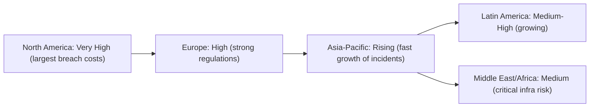

    

<h1 align="center">MR. SAM ROHAN</h1>
<h3 align="center">PRECISION IN EXECUTION - SUPREMACY IN IMPACT</h3>

  
 
> -----
>
> 
>
> 
> Greetings. I am **[Sam Rohan,](https://x.com/mrsamrohan)** an Indian-born **entrepreneur** and **security engineering leader** dedicated to advancing next-generation **cybersecurity** solutions and fortifying **cyber-physical systems** for global enterprises. My mission transcends traditional security models, uniting open-source innovation, ethical governance, and scalable transparency to **safeguard mission-critical operations** in an era of relentless technological evolution. At my core lies a guiding principle: *“Security demands perpetual adaptation—achieved not through obscurity, but through collaborative resilience.”*  
>
>  
>
> **Architecting Future-Ready Defenses:** I design open-source frameworks that integrate cutting-edge hardware, adaptive software, and agile protocols to **protect interconnected digital-physical ecosystems.** By fusing rigorous R&D with operational precision, my work embeds **AI-driven threat intelligence, zero-trust architectures, and quantum-resistant cryptographic infrastructure** into the fabric of **modern security.** These solutions not only outpace emerging threats but also uphold stringent ethical standards and open-source accountability, ensuring transparency across every layer of defense.  
>
>  
>
> **Empowering Global Stakeholders:** My platforms serve as dynamic hubs where academic theory converges with real-world application, offering actionable resources tailored to:
>
>- **Cybersecurity professionals** seeking advanced tools for complex threat landscapes.  
>- **Research scholars** pioneering next-generation defense methodologies.  
>- **CPS defense engineers** architecting mission-critical systems.  
> - **Policymakers** shaping resilient digital governance frameworks.  
> - **Students** pursuing technical mastery in security engineering.  
>
> By translating theoretical insights into deployable solutions, I equip diverse sectors with the readiness to navigate evolving challenges.  
>
>  
>
> **Democratizing Security as a Universal Right:** I reject the notion that any organization—be it a small business, nonprofit, or individual—is “too insignificant” to protect. Through strategic alliances with academia, industry leaders, and policymakers, **I champion global security equity.** My initiatives focus on **adversarial AI mitigation, hardware-software convergence, and open-source collaboration, inviting stakeholders to inspect, adapt, and extend defenses.** This ethos fosters a collective intelligence ecosystem, prioritizing underserved communities and regions often excluded from mainstream security discourse.  
>
>  
>
> **Leading with Ethics and Empathy:** My leadership philosophy is rooted in proactive stewardship. I challenge peers to move beyond identifying vulnerabilities and instead resolve them—through responsible disclosure, stakeholder education, and rapid remediation. Beyond technology, I drive impact via pro bono initiatives, mentorship programs, and nonprofit partnerships, cultivating a generation of engineers who prioritize integrity. My policy advocacy redefines digital-physical sovereignty as a cornerstone of global equity, aligning security imperatives with social responsibility.  
>
>  
>
> **Legacy of Principled Innovation:** My work exists at the intersection of technical excellence and humanitarian purpose. By transforming security from a privilege into a participatory endeavor, I reimagine resilience as a shared obligation. My vision *envisions* a future where technology serves humanity, ethical innovation outpaces threats, and every individual—empowered by knowledge and collaboration—becomes a guardian of our interconnected world.  
>
>  
>
> **In me, you will find not only a security engineering leader but a catalyst for principled progress—proving that true leadership ascends by uplifting others. Together, we forge a future where digital safety is universal, equitable, and unyielding.** 
>
> -----

  

> ## INSTITUTIONAL TO INDUSTRIAL TRANSITION!

CLICK HERE TO READ MORE.

  

<h1 align="center">INSTITUTIONAL TO INDUSTRIAL TRANSITION!</h1>

<h3 align="center">A HOLISTIC SKILL DEVELOPMENT PROGRAM FOR NEXT-GEN EMPLOYERS & EMPLOYEES.</h3>

<h3 align="center">EMPOWERING EQUILIBRIUM IN INDUSTRY THROUGH DUAL-TRACK EXCELLENCE.</h3>

  

**Institutional to Industrial Transition (I2IT):** A Holistic Skill Development Program for Next-Gen Employers & Employees fosters a **symbiotic industrial ecosystem** where emerging leaders and talent are co-trained to drive *sustainable growth, innovation, and socioeconomic equilibrium*. Through its dual-track framework, I2IT delivers end-to-end skill development via two complementary modules:  

- The **Employer Module** equips future business leaders with robust capabilities to *launch, scale, and sustain* enterprises.  

- The **Employee Module** forges a high-performance workforce with *technical proficiency, adaptable soft skills, and workplace excellence*.  

 

Together, these tracks converge to **empower industry-wide equilibrium**—transforming talent pipelines and leadership cadres into engines of collective prosperity.  

 

 

> ## ADVANCED CYBER INTELLIGENCE R&D PROGRAM FOR INSTITUTIONAL TO INDUSTRIAL TRANSITION.

CLICK HERE TO READ MORE.

  

<h1 align="center">ADVANCED CYBER INTELLIGENCE R&D PROGRAM FOR INSTITUTIONAL TO INDUSTRIAL TRANSITION.</h1>

  

**Program Title:** ADVANCED CYBER INTELLIGENCE RESEARCH AND DEVELOPMENT PROGRAM  
**Subtitle:** Institutional to Industrial Transition (I²IT)  
**Slogan:** Engineering Industrial Equilibrium with Precision and Power  

 

**Program Overview:** The Advanced Cyber Intelligence Research and Development (A.C.I R&D) Program spearheads the Institutional to Industrial Transition (I²IT) initiative—a strategic dual-track framework engineered to synchronize executive vision with technical mastery. This holistic skill-development initiative forges next-generation leaders and talent through a symbiotic curriculum that co-trains future employers and employees within a unified ecosystem. By deliberately aligning strategic leadership formation with frontline technical excellence, I²IT cultivates industrial resilience, drives sustainable innovation, and establishes socioeconomic equilibrium across critical sectors. The program's architecture ensures emerging business leaders and technical specialists develop complementary capabilities, creating a self-reinforcing talent pipeline that powers collective prosperity through balanced growth dynamics. This design achieves an **80% cross-track project integration rate**, forging synergistic operational capabilities between leadership and technical cohorts.  

 

**Core Philosophy:** A.C.I R&D operates under a battle-tested doctrine that rejects technological passivity in favor of decisive future-engineering. We transcend mere adaptation to architect breakthrough solutions that proactively anticipate tomorrow's threats and opportunities. Our philosophy is anchored in five uncompromising principles:  

 

**Precision Engineering** forms our bedrock methodology. In an era saturated with ephemeral trends, we deliver mission-critical solutions engineered to thrive under extreme operational demands. Every system—from resilient CPS defense architectures to adaptive AI platforms—embodies surgical accuracy and uncompromising robustness, transforming complexity into strategic advantage while setting new global standards for security and efficiency.  

 

**Fearless Innovation** defines our cultural DNA. Established as a sovereign beacon in the cyber domain, A.C.I R&D dismantles systemic inefficiencies and dominates complex threats through relentless technical aggression. Our foundation honors the audacious spirit that has propelled humanity's greatest technological leaps, demanding bold action and unwavering resolve in confronting emergent challenges.  

 

**Legacy-Driven Execution** distinguishes our operational paradigm. We channel history's pioneering ingenuity into tangible, future-shaping outcomes that surpass historical benchmarks. At the critical intersection of visionary conception and tactical implementation, we convert theoretical constructs into operational realities—whether deploying secure network infrastructures or scalable automation protocols—each deliverable cementing new standards of global excellence.  

 

**Structural Framework:** I²IT's dual-track architecture delivers comprehensive capability development through two integrated modules:  

 

**Employer Module:** forges strategic commanders equipped to helm cyber-secure enterprises. Participants master market-dominance frameworks encompassing competitive positioning analytics, future-proof operational modeling, and sustainable scaling methodologies. The curriculum further arms leaders with governance weaponry including end-to-end risk mitigation, regulatory compliance protocols, and ethical AI integration—transforming executives into architects of unbreachable digital empires.  

 

**Employee Module:** crafts elite technical regiments with battle-ready cyber proficiency. Trainees develop advanced combat skills in threat hunting, intrusion eradication, and incident response operations. Beyond technical mastery, the program forges adaptive warriors through leadership communication drills, agile team engagement simulations, and cross-functional maneuver training—culminating in **Operational Excellence Certifications** validated through **real-world simulations mirroring the MITRE ATT&CK Framework**.  

 

**Pillars of Excellence:**

Four foundational pillars uphold our operational supremacy:  
1. **Precision Engineering**: Solutions engineered to thrive where others fail  
2. **Relentless Innovation**: Research-to-deployment continuum acceleration  
3. **Unmatched Execution**: Transformative outcomes delivered on spec/on time  
4. **Technological Sovereignty**: Stakeholder-controlled innovation ecosystems  

 

**Identity and Mission:**

The A.C.I R&D identity embodies a deliberate declaration of technological sovereignty:  
- **Advanced**: Offensive push beyond innovation frontiers  
- **Cyber**: Domain dominance in digital resilience  
- **Intelligence**: AI-driven preemptive threat neutralization  
- **Research**: Paradigm-shattering discovery engine  
- **Development**: Theory-to-impact operational conversion  

 

**Strategic Enrollment:**

The program targets three critical cohorts:  
1. Aspiring C-suite executives architecting cyber-secure enterprises  
2. Mid-level operatives sharpening technical/leadership acumen  
3. Security engineers pioneering next-generation digital defenses  

 

**Operational Outcomes:**

Graduates emerge as elite forces capable of executing four critical missions:  
1. **Design/implement** end-to-end cybersecurity strategies for industrial-scale operations  
2. **Command** cross-functional teams aligning technical projects with strategic objectives  
3. **Launch preemptive innovations** using predictive analytics to neutralize emerging threats  
4. **Drive socioeconomic transformation** through balanced industry-institution growth  

 

> The A.C.I R&D Program transcends conventional curricula to function as a high-stakes crucible for forging **sovereign architects of cyber infrastructure** and technical specialists. Through precision engineering, fearless innovation, and sovereign execution, we unite visionary strategists and operators in a relentless campaign to engineer secure, prosperous digital futures. This program stands as the definitive proving ground for those determined to conquer complexity and command the technological vanguard—where participants don't just study the future, they deploy it with uncompromising authority.  

 

<h3 align="center">Join the Sovereign Vanguard. Command the Digital Frontier. Engineer the Future.</h3>

  

<h3 align="center">Glossary Appendix:</h3>

 

| **Term**                          | **Definition** |  
|------------------------------------|---------------|  
| **CPS Defense**                   | Cyber-Physical Systems protection: Securing integrated computational networks controlling physical infrastructure (e.g., power grids, manufacturing systems) against adversarial compromise |  
| **Operational Excellence Certifications** | Industry-recognized credentials validating proficiency in NIST/ISO-aligned security protocols, risk management, and process optimization |  
| **MITRE ATT&CK Framework**        | Globally-adopted behavioral model for cyber threat simulation, covering 14 tactical domains from reconnaissance to command/control |  
| **Cross-Track Integration Rate**  | Metric measuring collaborative project engagement between Employer/Employee cohorts (80% minimum threshold) |  

 

 

> ## THE NEXT-GENERATION RESEARCHER’S COMPENDIUM: BRIDGING PHILOSOPHICAL RIGOR AND TRADITIONAL METHODOLOGY IN MODERN SCHOLARSHIP.

CLICK HERE TO READ MORE.

  

<h1 align="center">THE NEXT-GENERATION RESEARCHER’S COMPENDIUM: BRIDGING PHILOSOPHICAL RIGOR AND TRADITIONAL METHODOLOGY IN MODERN SCHOLARSHIP.</h1>

  

**TABLE OF CONTENTS:**

 

**INTRODUCTION**  
The Nature and Purpose of Research  

 

**BLOCK I: RESEARCH FUNDAMENTALS**  
**UNIT 1: FOUNDATIONS OF RESEARCH**  
1.1 Nature, Definition, and Objectives of Research  
1.2 Significance of Research in Knowledge Development  
1.3 Scientific Method and Research Approaches  
1.4 Types of Research (Basic, Applied, Experimental, Descriptive)  
1.5 Ethical Principles in Research  

**UNIT 2: LIBRARY AND INFORMATION SCIENCE (LIS) RESEARCH**  
2.1 LIS as an Interdisciplinary Field  
2.2 Research Significance in LIS  
2.3 Key Research Areas in LIS  

**UNIT 3: RESEARCH METHODS**  
3.1 Survey Research  
3.2 Case Study Method  
3.3 Experimental Research  
3.4 Focus Group Techniques  
3.5 Comparative Analysis of Methods  

 

**BLOCK II: RESEARCH DESIGN & PLANNING**  
**UNIT 4: RESEARCH PROBLEM FORMULATION**  
4.1 Identifying Research Gaps  
4.2 Defining Research Questions  
4.3 Scope and Delimitations  

**UNIT 5: LITERATURE REVIEW**  
5.1 Purposes of Literature Survey  
5.2 Using Libraries and Electronic Resources  
5.3 Information Retrieval Systems  
5.4 Abstracting and Documentation  

**UNIT 6: HYPOTHESIS DEVELOPMENT**  
6.1 Formulating Testable Hypotheses  
6.2 Null and Alternative Hypotheses  
6.3 Hypothesis Testing Procedures  
6.4 Type I & Type II Errors  

**UNIT 7: RESEARCH DESIGN**  
7.1 Principles of Research Design  
7.2 Exploratory Designs  
7.3 Descriptive Designs (Cross-Sectional, Longitudinal)  
7.4 Experimental Designs  
7.5 Research Proposal Writing  

 

**BLOCK III: DATA COLLECTION & MEASUREMENT**  
**UNIT 8: DATA COLLECTION METHODS**  
8.1 Primary vs. Secondary Data  
8.2 Observation Techniques  
8.3 Interview Methods  
8.4 Library Records and Archival Sources  

**UNIT 9: QUESTIONNAIRE DESIGN**  
9.1 Principles of Questionnaire Construction  
9.2 Structured vs. Unstructured Questionnaires  
9.3 Scaling Techniques (Likert, Semantic Differential)  
9.4 Pretesting and Validation  

**UNIT 10: SAMPLING TECHNIQUES**  
10.1 Sampling Fundamentals  
10.2 Probability Sampling Methods  
10.3 Non-Probability Sampling Methods  

 

**BLOCK IV: DATA ANALYSIS & REPORTING**  
**UNIT 11: DATA PROCESSING & ANALYSIS**  
11.1 Data Preparation and Coding  
11.2 Descriptive Statistics  
11.3 Inferential Statistics  
11.4 Introduction to Statistical Software (SPSS)  

**UNIT 12: RESEARCH REPORTING**  
12.1 Structure of Research Reports  
12.2 Interpretation of Findings  
12.3 Academic Writing Styles (APA, MLA, Chicago)  
12.4 Presentation Techniques  

**UNIT 13: INFORMETRICS**  
13.1 Bibliometrics  
13.2 Scientometrics  
13.3 Webometrics  

 

**APPENDICES**  
- Appendix A: Sample Research Proposal Template  
- Appendix B: Ethical Guidelines Checklist  
- Appendix C: Statistical Software Quick Reference  
- Appendix D: Literature Review Matrix Template  

  

**Introduction:** Modern scholarship demands that researchers ground their work in **philosophical rigor** and robust methodology.  This means clearly stating assumptions about reality (ontology) and knowledge (epistemology), then designing studies that reflect those foundations.  In Library and Information Science (LIS) and related fields, this rigor ensures that inquiries into information behavior, systems, and resources are well-founded and credible.  The goal of this compendium is to guide researchers through **traditional research methods**—from foundational concepts to reporting—emphasizing time-tested practices over speculative technology hype.  By aligning research questions with appropriate paradigms and methods, scholars can produce work that is intellectually coherent and methodologically sound.

 

**Philosophical Foundations of Research:** Every research project rests on a philosophical paradigm – a set of beliefs about reality and knowledge.  **Ontology** asks, “What is real?” and guides whether researchers assume an objective world or socially constructed experiences.  **Epistemology** asks, “How do we know what we know?” and shapes whether knowledge is viewed as discovered through measurement or interpreted through context.  For example, positivism assumes a single objective reality and seeks measurable facts, whereas constructivism assumes reality is subjective and constructed by individuals.  These assumptions influence every aspect of a study – from the phrasing of research questions to the choice of methods.  Recognizing one’s paradigm **instills rigor** by making the research design coherent: researchers must articulate their worldview (e.g. realist vs. interpretivist) to ensure their methods and interpretations align with it.

Epistemological clarity also promotes **ethical and reflexive research**.  Scholars must consider how their values and biases affect inquiry (axiology), deciding whether studies can be conducted value-free (as in strict positivism) or acknowledge subjectivity (as in interpretivism).  As Pretorius (2024) notes, researchers benefit from reflexivity about their paradigms to design studies that are “methodologically sound, ethically informed, and practically relevant”.  In sum, grounding research in clear philosophical foundations ensures that studies are coherent, credible, and transparent from first principles through to conclusions.

 

**Library and Information Science (LIS) Research Context:** Library and Information Science research addresses problems in information creation, organization, access, and use.  LIS scholars often draw on a **rich variety of research designs** and methods borrowed from multiple disciplines.  For example, LIS researchers might study how people find information in digital libraries, how archival collections are managed, or how information literacy programs impact learning.  According to Eldredge (2004), familiarity with this range of methods lets researchers accurately label and situate their work, from case studies and surveys to usability testing and ethnography.  Eldredge’s “inventory” of LIS methods underscores that there is no single correct approach; rather, the choice depends on the research question and context.

Traditionally, LIS inquiries have often relied on applied methods such as **case studies, program evaluations, and surveys**, reflecting the field’s practical orientation.  These approaches can be qualitative (examining experiences in depth) or quantitative (measuring patterns across populations).  For instance, a case study might explore how a library implements a new catalog system, while a survey might quantify user satisfaction across many libraries.  What unites LIS research is the commitment to answering questions about information in society using sound methods.  By aligning philosophical assumptions (from the previous section) with these practical methods, LIS researchers ensure their findings are both philosophically coherent and relevant to practitioners and policymakers.

 

**Research Methods: Quantitative and Qualitative Approaches:** **Quantitative methods** involve collecting and analyzing numerical data to answer questions or test hypotheses.  Researchers might use surveys, structured experiments, or existing datasets.  The hallmark of quantitative research is **objectivity and generalizability**: by using statistical analysis, researchers seek to uncover patterns, correlations, or cause-and-effect relationships that apply beyond the sample. For example, a researcher might survey 500 library patrons (using a random sample) to measure how age or education level relates to use of digital archives; statistical tests would then determine if these relationships are significant.  A sound quantitative study relies on rigorous design (randomization, control groups, etc.) and sufficient sample sizes.  In fact, sample size is “the most crucial factor for reliability (reproducibility) in quantitative research,” since large, representative samples enable findings to be valid and replicable.

In contrast, **qualitative methods** gather non-numeric, descriptive data—often in words or observations—to explore meanings and contexts.  These methods include interviews, focus groups, ethnography, content analysis, and case studies.  Qualitative researchers might conduct deep interviews with a small number of users to understand how they perceive library services, or analyze the content of archival materials for thematic patterns.  As Ulrich (2020) notes, “qualitative research typically involves gathering evidence through surveys, interviews, and observations” (often supplemented by textual or archival data).  The goal is not broad generalizability but a nuanced understanding of phenomena.  Analysis may involve coding transcripts for themes or constructing narratives.  Despite their differences, both qualitative and quantitative methods are **important**: qualitative insights can generate hypotheses and illuminate context, while quantitative data can confirm trends and enable prediction.  Often researchers use **mixed methods** (combining both) to leverage strengths of each, but even standalone methods must be applied rigorously.

**Common research methods can be summarized as follows:**

* **Surveys and Questionnaires** – Collect standardized data from samples of respondents (used in both quantitative and qualitative designs).
* **Interviews and Focus Groups** – Gather in-depth qualitative data on experiences and opinions.
* **Experiments** – Test cause-and-effect by manipulating variables under controlled conditions.
* **Case Studies** – Provide detailed examination of a single instance or program.
* **Observational Studies** – Record behaviors or events in natural settings.
* **Content/Document Analysis** – Analyze textual or media content (e.g. library records, digital traces) for patterns.

Each method has strengths and limitations; for example, surveys can generalize if sample sizes are large, but may miss deeper context, whereas interviews provide richness but on a smaller scale.  In LIS research, method choice depends on the question: to measure how common a phenomenon is, use quantitative methods; to understand why it occurs, use qualitative methods.  Crucially, regardless of method, all studies must be designed and executed systematically to avoid bias.

 

**Research Design and Planning:** Once researchers have clarified their paradigms and chosen broad methods, they must **design** the study in detail.  A research design is essentially *“a strategy for answering your research question”*, defining the overall approach and determining how to collect and analyze data.  This involves several steps:

1. **Formulate the Research Question or Hypothesis.**  Start by stating a clear question or hypothesis.  This should follow from literature review and fill a gap in knowledge.  For example, an LIS study might ask: *“How do undergraduate students evaluate digital library interfaces?”* (qualitative inquiry) or *“Does a new metadata standard improve retrieval accuracy?”* (quantitative test).

2. **Review Existing Literature and Theory.**  Investigate prior studies to build on established findings and avoid duplication.  This also helps in defining variables, designing instruments, and situating the work in a broader context.

3. **Choose an Appropriate Research Paradigm and Methodology.**  Determine whether to use a quantitative, qualitative, or mixed approach based on the question and philosophical stance.  For example, a post-positivist stance might favor experiments or large surveys, while a constructivist stance might favor interviews or ethnography.  The design must align with these epistemological commitments.

4. **Plan Sampling and Data Collection.**  Decide on the population and sampling method.  In quantitative research, probability sampling (e.g. simple random sampling) helps ensure representativeness.  In qualitative research, purposive or theoretical sampling identifies participants who have specific experiences.  The planned sample should be sufficiently large (quantitative) or conceptually saturated (qualitative).  Ethical considerations (consent, confidentiality) must be addressed upfront.

5. **Establish Validity and Reliability.**  For quantitative designs, plan to enhance validity (measuring what is intended) and reliability (consistent results) through pilot testing instruments and standardized procedures.  For qualitative studies, ensure credibility by techniques like triangulation or member-checking.  For example, using standardized questions in a survey can reduce bias, while coding interviews independently by multiple researchers can improve trustworthiness.

6. **Outline Analysis Procedures.**  Decide how data will be analyzed.  Quantitative designs might involve statistical tests (e.g. t-tests, regression), while qualitative designs might involve thematic coding or discourse analysis.  Researchers should plan these steps before collecting data, ensuring they will collect the necessary information (e.g. including control variables or demographic items).

In planning, it is essential to document every decision.  A clear protocol and, if relevant, a research proposal or protocol document helps maintain coherence.  As one source notes, a robust design *“defines \[your] overall approach and determines how you will collect and analyze data”*, ensuring that the study can answer the research question effectively.

 

**Data Collection and Analysis:** Data collection follows the design.  Researchers implement the chosen methods to gather evidence, carefully following procedures to ensure data quality.  Common **quantitative data collection** techniques include structured surveys (online or paper), controlled experiments (recording measurements under conditions), and analysis of numerical databases (e.g. usage logs, citation counts).  **Qualitative data collection** might involve recording interviews or focus groups, making field observations (e.g. of users in a library), or compiling textual documents (e.g. policy documents or archival materials) as evidence.  In LIS research, digital traces (such as search logs) or digital archives may also serve as data.

**Once data are gathered, researchers must analyze them systematically:**

* **Quantitative Analysis:** Statistical techniques are applied to numerical data.  This may involve descriptive statistics (means, frequencies) and inferential statistics (hypothesis tests, confidence intervals) to examine relationships among variables.  For example, a researcher might use regression analysis to predict how funding correlates with digitization outcomes in archives.  Throughout, attention to potential biases (sampling bias, measurement error) is vital.  As noted earlier, adequate sample size is critical: small samples can be “underpowered” and prone to error, whereas larger samples provide more confidence in generalizing results.

* **Qualitative Analysis:** Non-numerical data are coded and interpreted.  Researchers might transcribe interviews and apply thematic coding to identify recurring concepts.  They may use content analysis to quantify the presence of certain words or themes in documents, or narrative analysis to build an in-depth case.  Rigor is maintained through careful documentation of coding schemes, and often by having multiple researchers cross-check codes.  For instance, interviews with librarians about community outreach might be coded for themes like “digital literacy” or “equity” until theoretical saturation is reached.

* **Mixed Methods:** When both data types are collected, integration occurs either during data collection (e.g. administering a survey and then following up with interviews) or during analysis (e.g. comparing statistical trends with qualitative insights).  Mixed-methods designs can provide richer, triangulated understanding, but require careful planning to align both strands.

In all cases, researchers should continuously reflect on data validity (are the data accurately measuring the intended phenomena?) and ethics (are participants’ rights protected?).  Appropriate use of software (statistical packages, qualitative coding software) can aid analysis, but ultimate responsibility lies with the researcher to interpret data accurately.  By applying established analytical techniques and cross-checking results, scholars ensure that their findings truly answer the research questions posed in the design phase.

 

**Reporting and Dissemination:** The final step is to **report the research** clearly and professionally.  Academic reporting typically follows a standardized structure to facilitate understanding and peer review.  As a guide from UC San Diego notes, a complete research report generally contains a *Title page, Abstract, Introduction, Methods, Results, Discussion,* and *References*.  These sections serve distinct purposes:

* **Title and Abstract:** The title should succinctly describe the study. The abstract (usually 150–250 words) summarizes the question, methods, key results, and conclusions in one concise paragraph.

* **Introduction and Literature Review:** Introduce the topic, motivate its importance, and critically review relevant prior research.  Clearly state the research question or hypotheses at the end of the introduction.

* **Methods:** Detail exactly what was done so that others can evaluate or replicate the work. Include participants or data sources, instruments (e.g. survey questions, interview protocols), and procedures (e.g. experimental protocol, coding process). Justify methodological choices.

* **Results/Findings:** Present the findings objectively. For quantitative research, this involves tables or figures of statistical results (avoiding interpretation beyond the data). For qualitative research, this involves themes, categories, or narratives grounded in participants’ data (often with illustrative quotes or examples).

* **Discussion:** Interpret the results in light of the research questions and existing literature. Explain implications, limitations (e.g. sampling constraints, potential biases), and suggest areas for future research. Connect back to the philosophical and theoretical framing.

* **Conclusion:** Summarize the main insights and their significance. Emphasize how the findings contribute to knowledge or practice.

* **References:** List all sources cited, formatted according to a style guide (e.g. APA or MLA).  Proper citation gives credit and allows readers to follow up on the literature.

Researchers should use clear, formal language and justify all claims with evidence.  Tables and figures should be well-labeled.  Adhering to a citation style (APA is common in social sciences) adds professionalism and clarity.  Peer review of the draft—by colleagues or mentors—can catch errors or gaps, enhancing rigor.

Finally, disseminate the work through appropriate channels (journals, conferences, or professional reports), mindful of the audience.  Effective communication ensures that **rigorous, traditional scholarship** has impact.  By following these reporting conventions, researchers complete the cycle from philosophical foundations to practical findings, making their contributions accessible and credible to the academic community.

 

A modern researcher’s compendium must balance **philosophical rigor** with solid methodology.  By grounding inquiries in clear ontological and epistemological assumptions, LIS and other scholars ensure their work is coherent and justifiable.  Employing proven research methods – from surveys and experiments to interviews and case studies – allows researchers to gather valid data.  Careful design and planning (formulating focused questions, ensuring adequate samples, and choosing the right paradigm) prevent common pitfalls and enhance the trustworthiness of results.  Finally, systematic analysis and transparent reporting in standard academic formats promote the dissemination of knowledge.

This **traditional R\&D approach** may eschew trendy buzzwords, but it remains the foundation of credible scholarship.  By rigorously applying these methods and reflecting on their philosophical roots, researchers build work that is reliable, reproducible, and meaningful.  In doing so, they bridge timeless principles of inquiry with the evolving questions of modern scholarship, yielding studies that advance understanding in Library and Information Science and beyond.

 

 

> ## DEMOCRATIZING INNOVATION: HOW OPEN-SOURCE PHILOSOPHY IS RESHAPING SCIENTIFIC, ENGINEERING, AND TECHNOLOGICAL RESEARCH.

CLICK HERE TO READ MORE.

  

<h1 align="center">DEMOCRATIZING INNOVATION: HOW OPEN-SOURCE PHILOSOPHY IS RESHAPING SCIENTIFIC, ENGINEERING, AND TECHNOLOGICAL RESEARCH.</h1>

 

**Introduction:**  The open-source philosophy, once synonymous with software development, has evolved into a transformative ethos that transcends disciplines, redefining how humanity creates, shares, and applies knowledge. Rooted in principles of transparency, collaboration, and shared ownership, open-source paradigms are dismantling traditional barriers—proprietary licenses, paywalls, and institutional monopolies—to democratize innovation across scientific, engineering, and technological research. From the Open Source Initiative’s (OSI) foundational frameworks to UNESCO’s global advocacy for open science, and from grassroots open-hardware collectives to decentralized AI projects, this movement is fostering a renaissance of inclusive, accelerated progress. By empowering individuals and institutions alike to participate in, scrutinize, and build upon research, open-source philosophy is not merely a technical methodology but a catalyst for equity and collective advancement.

 

**The Open-Source Philosophy: Beyond Code:** At its core, open-source philosophy challenges the notion that knowledge should be siloed or commodified. The OSI’s ten criteria—including free redistribution, accessible source code, and non-discriminatory licensing—provide a legal and ethical scaffold for collaborative innovation. These principles ensure that tools, data, and designs remain public goods, enabling communities to iterate without restrictive barriers. For instance, the OSI’s stewardship has allowed projects like Linux and Apache to thrive, proving that decentralized collaboration can rival—and often surpass—proprietary alternatives in scalability and security. This framework has since permeated non-software domains, inspiring UNESCO’s Recommendation on Open Science, which advocates for open access to publications, datasets, and infrastructure while integrating indigenous knowledge systems. By treating research as a communal endeavor, open-source philosophy redistributes power from gatekeepers to global participants.

 

**Democratizing Scientific Research: Open Science and Citizen Empowerment:** Scientific research, historically confined to elite institutions, is undergoing a seismic shift toward inclusivity. UNESCO’s 2023 Recommendation on Open Science exemplifies this transition, framing open access as a public good essential for addressing global challenges like climate change and pandemics. Initiatives such as open data repositories and preprint platforms like arXiv have democratized dissemination, allowing researchers in low-resource regions to contribute and critique findings. Meanwhile, citizen science projects like Zooniverse engage millions of volunteers in tasks ranging from classifying galaxies to tracking biodiversity, blending public participation with rigorous methodology. These efforts not only scale data collection but also enhance accountability; when the World Bank emphasizes open science’s role in reproducibility, it underscores how diverse input mitigates bias and error. However, challenges persist: integrating non-expert contributions demands robust validation protocols to maintain rigor, and equitable access to cyberinfrastructure remains uneven globally.

 

**Engineering Research Democracy: Open Hardware and Collaborative Design:** Engineering, once dominated by corporate R&D labs, is increasingly driven by open-hardware movements that democratize prototyping and manufacturing. The University of Michigan’s open-source process design kits (PDKs), for example, enable academic labs and startups to design integrated circuits without costly proprietary tools. Similarly, platforms like the P2P Foundation showcase how open-hardware communities collaboratively solve engineering challenges—from 3D-printed medical devices to solar-powered sensors—through shared blueprints and modular designs. This transparency fosters reproducibility, as seen in Oxford University Press’s analysis of open electronics, where customizable microscopes and environmental monitors accelerate lab innovation. Yet, participatory engineering also faces hurdles: co-designing with communities requires balancing technical feasibility with diverse stakeholder inputs, a process that can be resource-intensive but ultimately yields context-specific solutions, such as low-cost water purification systems tailored to local needs.

 

**Technological Research Democracy: Open-Source AI and Decentralized Governance:** In technology, open-source AI exemplifies the tension between democratization and ethical risk. Models like Meta’s Llama and DeepSeek’s R1, openly shared and iterated upon by global developers, have outperformed proprietary counterparts in benchmarks, proving that transparency drives innovation. Startups leverage these tools to create affordable solutions, such as Tulsa-based platforms improving job placement through AI analytics. Yet, as Chatham House warns, open-source AI’s accessibility also raises concerns about misuse, necessitating community-driven safeguards. Beyond AI, decentralized governance models—like Barcelona’s Decidim platform for participatory policymaking—embody technological democracy, enabling citizens to propose and vote on tech initiatives via transparent, blockchain-backed systems. These frameworks redistribute authority but demand robust standards to prevent fragmentation, illustrating how open-source principles must evolve to balance innovation with accountability.

 

**Toward Equitable Futures Through Open Collaboration:** The open-source philosophy is more than a development model—it is a manifesto for equitable progress. By eroding barriers to participation, it empowers marginalized voices, accelerates discovery, and fosters trust through transparency. Challenges like data quality, governance, and resource allocation remain, yet they are navigable through iterative frameworks that prioritize inclusivity. As UNESCO and OSI champion global standards, and as communities from Bangalore to Boston co-design solutions, the promise of democratized research grows clearer: a world where knowledge is a shared compass guiding humanity toward collective resilience. For advocates of open-source principles, the task ahead is to nurture this ecosystem—ensuring that every innovator, regardless of background, can contribute to the tapestry of human advancement. In doing so, we honor the ethos that collaboration, not competition, is the cornerstone of a better tomorrow.

 

 

> ## THE OPEN-SOURCE REVOLUTION: HOW FOSS IS DEMOCRATIZING INNOVATION AND RESHAPING SOCIETY.

CLICK HERE TO READ MORE.

  

<h1 align="center"> THE OPEN-SOURCE REVOLUTION: HOW FOSS IS DEMOCRATIZING INNOVATION AND RESHAPING SOCIETY.</h1>

 
 
**Introduction: The Unstoppable Rise of Collaborative Creation:** Free and Open Source Software (FOSS) has transcended its origins as a niche developer movement to become a cornerstone of modern technological, economic, and social progress. By championing transparency, collaboration, and unrestricted access, FOSS has dismantled barriers that once reserved innovation for well-funded corporations, empowering individuals, governments, and grassroots communities to co-create solutions for global challenges. From powering 90% of the internet via Linux and Apache to enabling life-saving medical research through open AI frameworks, FOSS is not merely a tool—it is a paradigm shift. This article explores how FOSS has become a catalyst for equitable progress, its transformative impact across sectors, and the challenges it must overcome to sustain its role as humanity’s collective innovation engine.  

 

**Defining FOSS: Freedom as a Foundation:** At its heart, FOSS is defined by four freedoms: the right to **use**, **study**, **modify**, and **redistribute** software. These principles, codified by pioneers like Richard Stallman and the Free Software Foundation (FSF), reject the opacity of proprietary models, where code is treated as a trade secret. Instead, FOSS treats knowledge as a shared resource, fostering trust and accountability. Licenses like the GNU GPL and MIT License operationalize these freedoms, ensuring derivatives remain open while allowing commercial use. This legal scaffolding has enabled projects like Python and Mozilla Firefox to thrive, proving that openness and innovation are not mutually exclusive but mutually reinforcing.  

 

**Current Impact: FOSS as the Backbone of Modern Progress:**  

1. **Accelerating Technological Innovation:** The collaborative nature of FOSS has birthed ecosystems where developers worldwide contribute to projects, accelerating problem-solving. For instance, Linux—initially a student project—now underpins cloud infrastructure, smartphones (Android), and supercomputers. Similarly, Apache Spark and Kubernetes have revolutionized data processing and container orchestration, enabling enterprises to scale efficiently. Even tech giants like Google and Microsoft, once proprietary stalwarts, now contribute to FOSS, recognizing that shared innovation drives industry-wide growth.  

2. **Economic Democratization:** FOSS eliminates financial gatekeeping, offering high-quality tools at no cost. Startups leverage WordPress for web development, Blender for 3D animation, and LibreOffice for productivity, bypassing expensive licenses. Educational institutions use R and Jupyter Notebooks to teach data science, ensuring students from all backgrounds gain cutting-edge skills. In developing nations, FOSS like OpenStreetMap aids disaster response, while Ushahidi crowdsources crisis data, proving that affordability and capability can coexist.  

3. **Security Through Transparency:** Unlike proprietary software, where vulnerabilities may linger undetected, FOSS allows global scrutiny. OpenSSL’s Heartbleed flaw was patched rapidly thanks to community oversight, while Signal’s open encryption protocols make it a gold standard for privacy. Transparency builds trust—a critical asset as cyberattacks escalate.  

4. **Guardian of Digital Rights:** FOSS empowers users to reclaim control over their digital lives. Tools like Tor Browser and VeraCrypt protect activists and journalists under oppressive regimes, while decentralized platforms like Mastodon offer alternatives to corporate-controlled social media. By rejecting vendor lock-in and surveillance, FOSS upholds fundamental freedoms in an era of data exploitation.  

5. **Global Collaboration, Local Impact:** FOSS communities transcend borders. The Raspberry Pi Foundation’s low-cost computers, paired with FOSS tools, have democratized STEM education in rural India and Africa. Meanwhile, OpenMRS, an open-source medical records system, tailors healthcare solutions for regions with limited infrastructure, proving that local adaptation is FOSS’s superpower.  

 

**The Future: FOSS as a Pillar of Equitable Progress:**  

1. **Digital Sovereignty and National Resilience:** Nations are increasingly adopting FOSS to reduce dependence on foreign proprietary software. France’s government migrated to LibreOffice, saving millions while securing sensitive data. India’s Aadhaar system, built on open-source frameworks, scales to serve 1.4 billion citizens. Such moves not only protect sovereignty but also foster homegrown tech ecosystems.  

2. **Ethical AI and Inclusive Innovation:** Open-source AI frameworks like TensorFlow and Hugging Face democratize access to machine learning, enabling startups to compete with tech giants. Projects like EleutherAI’s GPT-Neo challenge the concentration of AI power, while platforms like Fairlearn address algorithmic bias, ensuring AI serves humanity equitably.  

3. **Bridging the Digital Divide:** FOSS is pivotal to global digital inclusion. In Latin America, Sugar Labs’ educational software runs on donated hardware, bringing coding to underserved schools. Kenya’s Ushahidi platform crowdsources election monitoring data, proving that FOSS can amplify marginalized voices.  

4. **Sustainable Cyber Resilience:** As ransomware and state-sponsored attacks escalate, FOSS tools like Let’s Encrypt (free SSL certificates) and SELinux (security-enhanced Linux) provide accessible defenses. Open standards like ActivityPub (powering decentralized social networks) ensure interoperability, reducing reliance on vulnerable monopolies.  

 

**Challenges: Navigating the Open-Source Dilemma:**

Despite its promise, FOSS faces critical hurdles:  
- **Sustainability**: Many projects rely on unpaid maintainers. Gitcoin Grants and Linux Foundation’s funding models show promise but require broader adoption.  
- **Toxic Communities**: Projects like Redis and ElasticSearch faced backlash when shifting licenses, highlighting tensions between commercialization and openness.  
- **Compliance Complexity**: Navigating licenses (GPL’s copyleft vs. MIT’s permissiveness) demands legal expertise, risking accidental violations.  
- **Security Gaps**: While transparency helps, projects like Log4j show how underfunded FOSS tools can become critical vulnerabilities.  

 

**Building a Future Where Everyone Can Code the World:** FOSS represents more than a development model—it is a manifesto for a fairer, more innovative world. By placing control in the hands of users, it ensures technology evolves as a public good, not a private commodity. The road ahead demands addressing funding gaps, fostering inclusive communities, and balancing profit with principle. Yet, the promise is undeniable: from rural classrooms to AI labs, FOSS is proving that when knowledge is shared, humanity thrives. As we confront existential challenges—climate change, pandemics, inequality—embracing open-source philosophy isn’t just wise; it’s essential. The revolution will not be proprietary; it will be open, collaborative, and unstoppable.  

 

**Curated FOSS Licenses Reference Table:** For developers and organizations navigating the FOSS landscape, understanding licenses is critical. Below is a curated guide to major licenses, from the permissive MIT to the copyleft AGPL, each shaping how software freedoms are preserved and propagated.  

 

| 0   | License Name                                       | Official URL                                                             |     |
| --- | -------------------------------------------------- | ------------------------------------------------------------------------ | --- |
| 1   | Academic Free License (AFL)                        | [Link](https://opensource.org/licenses/Academic.php)                     |     |
| 2   | Adaptive Public License (APL)                      | [Link](https://opensource.org/licenses/APL-1.0.php)                      |     |
| 3   | Apache License                                     | [Link](https://www.apache.org/licenses/LICENSE-2.0)                      |     |
| 4   | Apple Public Source License (APSL)                 | [Link](https://opensource.org/licenses/APSL-2.0.php)                     |     |
| 5   | Artistic License                                   | [Link](https://opensource.org/licenses/Artistic-2.0.php)                 |     |
| 6   | Beerware License                                   | [Link](https://people.freebsd.org/~phk/)                                 |     |
| 7   | Boost Software License (BSL)                       | [Link](https://www.boost.org/LICENSE_1_0.txt)                            |     |
| 8   | BSD License (2/3/4-Clause)                         | [Link](https://opensource.org/licenses/BSD-3-Clause)                     |     |
| 9   | CeCILL License                                     | [Link](https://cecill.info/licences.en.html)                             |     |
| 10  | Common Development and Distribution License (CDDL) | [Link](https://opensource.org/licenses/CDDL-1.0.php)                     |     |
| 11  | Creative Commons Licenses (CC)                     | [Link](https://creativecommons.org/licenses/)                            |     |
| 12  | Cryptographic Autonomy License (CAL)               | [Link](https://opensource.org/licenses/CAL-1.0.php)                      |     |
| 13  | Eclipse Public License (EPL)                       | [Link](https://www.eclipse.org/legal/epl-2.0/)                           |     |
| 14  | European Union Public License (EUPL)               | [Link](https://joinup.ec.europa.eu/collection/eupl/eupl-text-eupl-12)    |     |
| 15  | GNU Affero General Public License (AGPL)           | [Link](https://www.gnu.org/licenses/agpl-3.0.html)                       |     |
| 16  | GNU General Public License (GPL)                   | [Link](https://www.gnu.org/licenses/gpl-3.0.html)                        |     |
| 17  | GNU Lesser General Public License (LGPL)           | [Link](https://www.gnu.org/licenses/lgpl-3.0.html)                       |     |
| 18  | IBM Public License (IPL)                           | [Link](https://opensource.org/licenses/IPL-1.0.php)                      |     |
| 19  | ISC License                                        | [Link](https://opensource.org/licenses/ISC)                              |     |
| 20  | MIT License                                        | [Link](https://opensource.org/licenses/MIT)                              |     |
| 21  | Mozilla Public License (MPL)                       | [Link](https://www.mozilla.org/en-US/MPL/2.0/)                           |     |
| 22  | Open Data Commons Licenses (ODC)                   | [Link](https://opendatacommons.org/licenses/)                            |     |
| 23  | Open Software License (OSL)                        | [Link](https://opensource.org/licenses/OSL-3.0.php)                      |     |
| 24  | PostgreSQL License                                 | [Link](https://www.postgresql.org/about/license/)                        |     |
| 25  | Python Software Foundation License (PSF)           | [Link](https://docs.python.org/3/license.html)                           |     |
| 26  | Q Public License (QPL)                             | [Link](https://opensource.org/licenses/QPL-1.0.php)                      |     |
| 27  | Server Side Public License (SSPL)                  | [Link](https://www.mongodb.com/licensing/server-side-public-license)     |     |
| 28  | SIL Open Font License (OFL)                        | [Link](https://scripts.sil.org/cms/scripts/page.php?site_id=nrsi&id=OFL) |     |
| 29  | Sleepycat License                                  | [Link](https://opensource.org/licenses/Sleepycat.php)                    |     |
| 30  | Unlicense                                          | [Link](https://unlicense.org/)                                           |     |
| 31  | WTFPL (Do What The F* You Want To Public License)  | [Link](http://www.wtfpl.net/about/)                                      |     |
| 32  | zlib/libpng License                                | [Link](https://opensource.org/licenses/Zlib)                             |     |

 

 

> ## TRUE COMMITMENT TO ETHICAL CYBERSECURITY.

CLICK HERE TO READ MORE.

  

<h1 align="center">TRUE COMMITMENT TO ETHICAL CYBERSECURITY.</h1>

  

**Ethical cybersecurity** goes beyond merely securing systems – it’s a *calling* to use our skills for the greater good.  As the ACM Code of Ethics emphasizes, computing professionals must *“use their skills to benefit society and people’s well-being,”* recognizing that *“everyone is a stakeholder in computing.”*.  Similarly, security leaders stress that we have a *“responsibility…to use our skills for the greater good and to guard the security of those entrusted to us.”*. In practice, this means acting not for personal gain or glory, but out of empathy and duty to protect others.  We must be vigilant not only about technical threats, but about the human impact of our work – building trust, preserving privacy, and empowering all users.

br>

**Broadening Our Role: Beyond Job Descriptions:** Truly ethical practitioners go *beyond* the letter of their job.  We volunteer our time, share knowledge, and collaborate for community benefit.  For example, organizations like the CTI League and CompTIA’s Emergency Response Team mobilize skilled volunteers to help critical sectors (hospitals, small businesses, charities) recover from attacks at no cost.  Global nonprofits such as **Hackers for Change** offer free cybersecurity services to under-resourced nonprofits, and **The Cyber Helpline** provides expert advice to cybercrime victims.  We also contribute to open-source security efforts: projects like the OWASP Foundation unite volunteers worldwide to improve software security, and alliances like the Open Cybersecurity Alliance promote shared tools and standards.  These actions – *pro bono* assessments, mentoring newcomers, or hardening community networks – exemplify how ethical commitment strengthens the entire ecosystem.

* **Volunteer for Communities:**  Join initiatives that defend hospitals, nonprofits, and civic institutions (e.g. CTI League). Provide pro bono incident response or training to victims and small businesses, just as larger clients receive help.
* **Contribute to Open Source & Standards:**  Publish security tools and guidelines under open licenses (OWASP, OCA, Cloud Security Alliance), so everyone benefits. Free tools and shared best practices raise security across the board.
* **Collaborate with Authorities:**  Work with law enforcement, CERT teams, and educational outreach programs to *prevent* attacks and catch criminals, rather than turning a blind eye. Ethical experts share intelligence and advise policy, extending protection beyond our own networks.

By stepping “out of our comfort zones” to help others (even when it’s difficult or thankless), we become true **cybersecurity Good Samaritans**.  Like the locksmith analogy reminds us: we possess “specialized tools and knowledge” that could open almost any lock, yet we “do not misuse our skills because of \[our] ethical codes”. Instead, we leverage that power to uplift and defend – because we can, and because it’s our duty.

 

**Protecting Everyone: No One Is Too Small:** Who are we protecting? **Everyone.**  Individuals, families, small businesses, NGOs – no one is “too small” or insignificant. Cyber threats affect all levels of society, and vulnerabilities in one place can ripple everywhere.  In line with ethical guidelines, we must give every stakeholder (from the lonely senior citizen targeted by a scam to the small-town shop hit by ransomware) the same dedication as we give to major clients.  As one security leader observes, we share “the responsibility…to guard the security of those entrusted to us”, regardless of a victim’s wealth or status.

This principle is echoed in the ACM Code: professionals should use their skills to help *all* people, not just high-profile organizations.  Cyberattacks on small businesses or local institutions can be as devastating as on large enterprises, yet these victims often lack resources.  Ethical cybersecurity means *closing that gap*. We advocate for broad protections – for example, helping a community center set up multi-factor authentication or guiding a school in safe email practices just as earnestly as we would for Fortune 500 firms.  By ensuring no one is left behind, we “foster trust with stakeholders” and reinforce that *“how we work is just as important as what we do.”*

* **Equal Vigilance:**  Treat every breach the same – a cyberbully targeting an individual or a sophisticated attack on a corporation both merit our full effort.
* **Accessibility:**  Help the technically inexperienced (elderly, children, non-tech staff) through education and simple security tools. Secure by default (e.g. requiring MFA, not password-only access) lowers the burden on users of all levels.
* **Advocacy for the Vulnerable:**  Push for laws, funding, and programs that support under-served communities (rural clinics, small governments) in improving security. Our expertise carries extra weight in raising awareness where it’s most needed.

 

**Empowering, Not Blaming: Educate to Prevent:** When breaches occur – especially due to user error or weak defenses – our role is never to shame or scold the victim.  Research shows victim-blaming is not only unfair but *counterproductive*: it breeds “fraud shame,” silences victims, and lets attackers operate unchecked.  Instead, we offer solutions, guidance, and support.  Every victim deserves empathy and help.  We meet them with clear instructions and reassurance (e.g. “Change your passwords now, report the incident; losing data is *not* the victim’s fault”) rather than criticism.

**Education is key**. The more users understand threats, the safer the community. Industry groups encourage proactive training: “Teach your community about cybersecurity!” – distributing free toolkits for families, schools, and businesses to learn practical protections.  We embody this ethic by running workshops, writing simple how-to guides, or even calmly walking a scared user through setting up MFA.  In doing so, we empower individuals as first-line defenders rather than making them feel inadequate.

* **Training with Empathy:**  Tailor advice patiently. For example, instead of blaming a phishing click, explain how to spot phishing and remediate it. Reinforce that “anyone can become a victim” and focus on solutions.
* **Support and Reporting:**  Encourage victims to report crimes (e.g. to cybercrime centers) without fear. Remind them “losing money and data is not the price of admission” to the internet. Point them to resources like cyber helplines or fraud-watch organizations for recovery help.
* **Respect Privacy:**  As UpGuard notes, we must *“maintain our competence…respect sensitive information privacy, and uphold the well-being of those we serve.”*. That means handling victim data confidentially and prioritizing their security and comfort in every action.

By educating rather than castigating, we help victims heal stronger – which ultimately **shrinks** the attack surface for all of us.  Cybersecurity teams that cultivate a no-shame, help-first culture see better engagement and incident response, fostering a safer digital world.

 

**Leading by Example: Implement and Remediate:** Ethical commitment isn’t complete until advice is turned into action. It’s not enough to preach best practices; we must *demonstrate* them.  Within our own organizations and beyond, we implement the very measures we recommend: enforcing multi-factor authentication, applying timely patches, segmenting networks, and using strong encryption. We document clear processes so users can follow securely by default.

When we discover flaws, we do more than notify – we help fix them.  The *Responsible Disclosure* model is a good illustration: researchers report vulnerabilities privately and only disclose them to the public *after* a fix is available. In other words, we aim to *patch the door before declaring it broken*. As one guide notes, ethical hackers **“attempt to find vulnerabilities…and fix those issues before cybercriminals find them.”**. Following this spirit, we work with developers to remediate bugs, update legacy systems, and eliminate misconfigurations – then teach teams how to prevent those mistakes from recurring.

* **Hands-On Solutions:**  Lead user training sessions and walk people through setup step-by-step. For example, guide a colleague through enabling MFA on their work account rather than just telling them to do it.
* **Proactive Patching:**  Patch systems immediately after discovery. If a patch isn’t yet available, implement mitigations and revisit often. Clear security policies (e.g. a Vulnerability Disclosure Program) ensure issues get resolved, not ignored.
* **Share Knowledge:**  Document fixes and lessons learned. After closing an incident, host a debrief or write a brief report so others can avoid similar pitfalls. Encourage a culture where *getting help* is valued over hiding mistakes.

By **walking our talk** – securing our own environments and assisting others with fixes – we build credibility. It proves our commitment is more than lip service: we strive to *close the gap between insecurity and resilience*. In doing so, we “navigate gray areas with integrity” and set a benchmark for the whole profession.

 

**The Cybersecurity “Good Samaritan”:** In essence, we aspire to be digital Good Samaritans.  In biblical terms, the Good Samaritan helped a stranger at personal cost – here, we help fellow internet users regardless of reward or recognition.  We don’t ask “What can *they* do for me?” but “What can *I* do for them?”  This means selflessly assisting others even when it’s inconvenient (burning nights fixing a hacked site, volunteering after-hours to help a victim). It also means caring for cyber wellness on a human level: listening to people’s fears, addressing their emotional distress after a breach, and advocating policies that protect the innocent.

Ethical cybersecurity is as much about **character** as it is about code. We are stewards of trust – when we help someone recover from attack, we restore their confidence in technology and society. Leaders in our field remind us that empathy and responsibility are core to the role: one expert urged that, like locksmiths, we must wield our powerful skills *only* to protect, guided by ethics and the law.  In every action, we ask “Is this caring? Is this responsible?” If so, we step forward; if not, we step back.

* **No Discrimination:**  Offer help equitably. Whether the victim is wealthy or poor, a fellow pros or a novice, treat them with the same dedication.
* **Integrity Over Ease:**  We resist shortcuts that compromise others’ safety (for example, covering up a vulnerability to avoid bad press). Instead, we choose the harder right: fixing it fully.
* **Continuous Vigilance:**  Even when we’re off-duty, we remain alert. If we learn of a charity’s compromised server or a friend’s stolen data, we feel compelled to assist, not because it’s in our job description, but because it’s the right thing to do.

 

**Conclusion: Cybersecurity as a Calling:** Ethical cybersecurity isn’t about prestige or “being the smartest” – it’s about **care, courage, and commitment**. It asks us to step into others’ shoes, safeguard every corner of the digital community, and never stop learning or giving. As one leader summarized, a professional code in this field should empower us to act with accountability and foster trust, *reinforcing that how we work is just as important as what we do*.

Let us pledge to be the Good Samaritans of the digital age. Let us volunteer, educate, and protect without prejudice. Let us remember that behind every device is a person with a life and story. By acting on these principles – backed by formal ethics codes and a genuine spirit of service – we help make cybersecurity a universal standard, not a privilege. In the end, **cybersecurity isn’t just a job – it’s a mission** to build a safer world for all of us.

 

 

> ## THE ROLE OF ARTIFICIAL INTELLIGENCE IN CYBERSECURITY.

CLICK HERE TO READ MORE.

  

<h1 align="center">THE ROLE OF ARTIFICIAL INTELLIGENCE IN CYBERSECURITY.</h1>

  

Artificial Intelligence (AI) is transforming cybersecurity in profound ways.  Modern networks and systems generate massive amounts of data and face constantly evolving threats, making manual defense untenable.  AI and machine learning (ML) tools can sift through vast logs, detect subtle anomalies, and automate responses far faster than human teams.  As one U.S. Army Cyber Command technologist noted, the old adage that “the advantage goes to the attacker” is shifting – advanced AI/ML is tipping the balance back toward defenders.  At the same time, experts warn that the very same AI capabilities will empower attackers and even state-sponsored cyber forces.  In practice, AI has become a double-edged sword: it hardens defenses **and** accelerates attacks.  This article explores how AI is used across both sides of cybersecurity – from anomaly detection and automated threat hunting to AI-crafted phishing, malware, and adversarial exploits – with real-world examples and case studies.  We also examine “adversarial AI” where malicious actors target AI systems themselves, and discuss how cyber warfare and policy are adapting to this new battlefield.  In short, AI will be a catalyst on offense and defense simultaneously, and understanding both sides is critical for any organization’s security strategy.

 

**AI-Powered Cyber Defense:** AI is already widely used to **strengthen cyber defenses**.  Machine learning models can analyze network traffic, system logs, and user behaviors to spot patterns that human analysts would miss.  For example, AI-driven network monitoring platforms (like Darktrace) continuously learn the normal “fingerprint” of an enterprise network and flag anomalies (sudden spikes, unusual connections, data exfiltration) in real time.  Similarly, endpoint protection tools (like CrowdStrike) use behavioral ML to detect malware or ransomware behavior on devices before damage occurs.  Across cloud, on-premises, and hybrid environments, AI is deployed for intrusion detection, malware classification, and predictive risk scoring.  In one industry survey, two-thirds of security professionals said AI-based security tools boost their productivity and detect threats that would otherwise go unnoticed.  On average, organizations handle over 22,000 alerts per week, and AI can automatically triage roughly half of them without human intervention.  In practice this means security teams can focus on high-priority incidents rather than firefighting basic alerts.

Key AI techniques in defense include **anomaly detection**, **supervised classification**, and **NLP/text analytics**:

* **Anomaly/Behavioral Detection (Unsupervised ML):** Unsupervised learning and clustering algorithms watch for unusual patterns.  For example, if an employee’s account suddenly downloads terabytes of data or logs in from an unexpected country, an AI system can flag it.  User and Entity Behavior Analytics (UEBA) use ML to build normal behavior profiles for users, devices, or applications and spot deviations.  Many next-generation SIEM and SOAR platforms incorporate UEBA to catch insider threats or stealthy intruders.

* **Supervised ML (Classification):** Supervised models are trained on labeled examples of malicious vs. benign activity.  For instance, AI can learn what malware binaries look like and automatically block new variants.  Antivirus and endpoint tools now use deep learning neural networks to classify files, URLs, or emails in real time.  Such models continuously learn from new threat feeds.  For instance, Palo Alto Cortex XDR uses ML to correlate signals and block malware and ransomware execution.

* **Natural Language Processing (NLP) and Content Analysis:** Modern defenses parse text, code, and logs with AI.  NLP models analyze emails and web forms to detect phishing or fraudulent content.  Tools like Barracuda’s email security use NLP/ML to scan message language, detect spoofing patterns, and quarantine spear-phishing attempts before they reach users.  Similarly, AI can parse logs, security bulletins, and social media to gather threat intelligence (e.g. correlating IOC lists or attacker chatter).

* **Generative AI for Defense:** AI can even *generate* data to help defenders.  For example, large language models (LLMs) are being explored to automatically generate test cases or fuzzing inputs for vulnerability discovery.  Google researchers showed that using LLMs to create diverse inputs can greatly expand code coverage during fuzz testing.  In the future, AI agents might continuously probe systems for weaknesses (simulating attackers) so defenders can patch them proactively.

* **Automated Response and Orchestration:** AI-driven Security Orchestration, Automation and Response (SOAR) systems can execute playbooks (e.g. isolating an infected host, blocking an IP) automatically.  For example, an AI engine might correlate an intrusion alert with threat intel on a known C2 domain and instantly contain the threat.  In practice, AI coordination means faster incident response and less manual toil.

Defensive AI already shows major benefits.  In the Ponemon survey, **66%** of security professionals said AI increases their team’s productivity and detects previously unseen threats.  Half of respondents agreed AI helps them *prioritize* risks and find software vulnerabilities more quickly.  Notably, nearly **70%** believed that “defensive AI” is \*critical to stopping AI-driven cybercrimes” at scale.  In short, AI empowers defenders to scale their capabilities – tackling thousands of daily alerts, hunting sophisticated threats, and automating routine tasks – so humans can focus on strategy and incident resolution.  However, this shift also poses challenges (integration with legacy systems, avoiding false positives, requiring ML expertise).  Organizations must adapt their architecture and skills to fully leverage AI defenses.

 

**AI-Driven Cyber Offense:**

AI is also a **force multiplier for attackers**.  Cybercriminals, fraudsters, and even nation-states are harnessing AI to craft more sophisticated attacks at scale.  Generative AI, in particular, lets adversaries automate key steps of the “kill chain” (reconnaissance, weaponization, delivery).  For example, attackers can train models to scour open data (social media, corporate websites) and generate personalized phishing content.  A recent AI lab report notes that custom LLMs like WormGPT and FraudGPT are being sold on the dark web to automate scam campaigns.  “Bad actors” are already abusing ChatGPT and other LLM APIs to write convincing phishing emails or malicious code.  AI can remove language barriers by instantly translating messages, adapt content in real time, and produce countless variants to evade spam filters.  Indeed, one security report warned that criminals are increasingly using ChatGPT, Google Gemini and other models, and that custom hacking LLMs (like WormGPT) now generate malware and phishing content.

A **graphic example** is AI-generated phishing: advanced models can mimic corporate tone and write error-free emails that fool employees.  The image below shows a sample phishing email created by an AI model – it looks legitimate and urgent, with no spelling mistakes.  Such AI-crafted lures easily bypass naive defenses that relied on typographical clues.

&#x20;*Example of a highly convincing AI-crafted phishing email (subject line “Urgent: Action Required for Your Account”).  Generative language models can automatically produce realistic messages with the tone and format of a trusted organization, making phishing scams harder to detect.*

Beyond email, AI enables **automated malware and fraud**.  Researchers have demonstrated “polymorphic” malware engines (e.g. *BlackMamba*) that use an LLM to generate new malicious code on-the-fly.  Instead of shipping a static payload, these AI-driven malware tools rewrite themselves continuously, evading signature-based scanners.  In one proof-of-concept, an AI-generated malware varied its code each time it ran, synthesizing new keylogging and exfiltration functions dynamically.  Similarly, AI-powered tools like *MalGAN* can craft malware specifically designed to evade detectors: by learning how antivirus engines work (through trial and error), they produce shellcode that slips past defenses.  Paradoxically, the same technique (generating evasive malware) can be used defensively to strengthen detectors via adversarial training, illustrating AI’s dual-use nature.

Attackers also apply AI to **credential theft and fraud**.  Generative Adversarial Networks (GANs) have been used to train password-guessing tools (*PassGAN*) that learn the distribution of real-world passwords and produce high-quality guesses without human-crafted rules.  Voice cloning and deepfake systems are now used in “vishing” and executive impersonation.  For instance, in a famous 2024 incident, scammers used AI to *deepfake* the voice (and even video) of a company’s CFO and other leaders during a fake video call, tricking an employee into transferring **\$25 million** to fraudulent accounts.  In that case, an engineering firm (Arup) was victimized via AI-manipulated calls and messages.  Even audio-only scams are rising: generative models can clone voices to authorize fake wire transfers or policy changes.  Governments and security agencies have noted a surge in such AI-enabled social engineering: regulators warn that deepfake fraud is now a “multi-million dollar” threat and that attackers will scale it massively.

AI-driven reconnaissance further broadens the attack surface.  Adversaries can train ML models to sift through open data for victim profiles.  For example, one team used AI to analyze side-channel data (keystroke sounds over VoIP) and infer typed information.  Tools like ChainReactor automate finding paths for privilege escalation by treating a network as a planning problem.  In short, AI automates many steps that used to require manual research.  The result is a more **efficient and large-scale offensive** capability: phishing attacks are more personalized, malware is more elusive, fraud is more automated.  As one analysis bluntly states, “the use of AI in cybercrime is no longer theoretical… it’s evolving in parallel with mainstream AI adoption, and in many cases moving faster than traditional security controls can adapt”.

Real-world examples underscore this shift.  In addition to the Arup deepfake case, criminals have released AI-tuned ransomware and banking Trojans.  A new generation of malware like “FunkSec DDoS tool” is being branded as AI-powered online.  Specialized “XXXGPT” bots can draft entire attack chains (botnet deployments, payload coding, etc.) with minimal human input.  Even older tactics benefit: spear phishing emails that once took days of reconnaissance can now be drafted in seconds by LLMs.  As security firm Check Point warned, **hackers are increasingly using AI in their attacks**, so defenders must “follow suit” to keep pace.

 

**Adversarial AI: Attacking AI Systems:** AI systems themselves introduce new vulnerabilities.  Just as firewalls and software have flaws, ML models can be attacked or fooled.  The field of *Adversarial AI* studies how attackers manipulate AI.  Traditional adversarial threats include:

* **Evasion (Adversarial Examples):** Subtle input changes that mislead models.  For example, attackers might slightly alter malware code or image pixels so that a classifier no longer recognizes it as malicious, while the changes are imperceptible to humans.  In email, a spammer might insert invisible characters or synonyms to bypass filters.  This cat-and-mouse arms race means ML models must be frequently updated and validated.

* **Poisoning (Data Tampering):** Injecting malicious data into training sets so the model learns the wrong patterns.  For instance, if an attacker seeds a spam filter’s training data with carefully crafted “poisoned” emails, the filter may later misclassify real spam as safe (or vice versa).  Similarly, malware detectors could be poisoned to recognize certain malware as benign by manipulating reported samples.

* **Model Stealing and IP Theft:** Confidential machine-learning models can be reverse-engineered.  By querying a black-box AI (e.g. a malware scanner API) thousands of times and observing outputs, attackers can approximate its behavior and effectively “steal” the model.  This violates intellectual property and allows adversaries to build bespoke attacks that evade the original model.

* **Backdoors and Trojans:** Attacks can embed hidden “backdoors” into models at training time.  A model might function normally until a specific trigger input (e.g. a special image pattern or credit card number) activates malicious behavior.  Researchers have demonstrated such Trojaned networks that activate only on attacker-chosen inputs.

* **Availability Attacks:** ML services can be overloaded or crashed.  For example, sending recursive queries or adversarial inputs might cause an LLM to hang (as seen in a *MathGPT* demonstration with infinite loops).  Denial-of-service against AI services is an emerging threat.

With the rise of LLMs and large generative models, **new attack vectors** have emerged:

* **Prompt Injection:** Attackers can craft inputs that manipulate an LLM’s system or user prompt.  For instance, hiding malicious instructions in a document’s metadata or in user-provided text can cause the AI to perform unintended actions or leak confidential data.  This can happen in chatbots or embedded AI assistants.  Unlike classical ML, LLMs interpret prompts literally, so sneaky phrasing can “trick” them (e.g. feeding commands disguised as part of the user’s query).

* **Jailbreaking LLMs:** Adversaries search for prompts that override an AI’s safety rules.  A famous example is the “DAN” prompt (“Do Anything Now”) that tries to make the model ignore its guardrails.  Recent research even automates discovery of new jailbreaking prompts using LLMs themselves.  Once jailbroken, the AI may generate harmful content or divulge private data.

* **Data Exfiltration via AI:** If AI tools have access to internal data (for training or inference), clever queries might extract sensitive information.  For example, in “data poisoning” style, an attacker could repeatedly query a generative model until it inadvertently reveals parts of its private training corpus.

* **Adversarial Training and AI Red Teams:** The good news is many adversarial techniques also have defensive uses.  Techniques like adversarial training (intentionally exposing models to attacks during development) can harden AI.  As security experts advise, organizations should *“deploy adversarial testing against AI”* – proactively attacking their own models to find weaknesses.  This reveals logic flaws and blind spots, allowing fixes before an attacker does.

In summary, AI security adds a new layer: every ML model or AI service is both a potential tool *and* a target.  As one survey explains, an adversary could use AI offensively (as discussed above) or target AI itself – “the presence of an attacker is not a given: both of these terms include techniques that can be used for good (e.g. making a system more secure) or for bad (e.g. bypassing a system, or deceiving humans)”.  Defenders must therefore account for attacks on AI pipelines, just as they do for software vulnerabilities.

 

**Case Studies and Real-World Examples:**

Several recent incidents illustrate AI’s dual role in cyber conflict:

* **AI-Powered Deepfake Fraud:** In early 2024, an international engineering firm was scammed out of \$25 million via an AI-generated deepfake video conference.  Scammers used AI to impersonate the company’s CFO and other executives in a realistic call, persuading an employee to transfer large funds to fraudster-controlled accounts.  This **Arup deepfake incident** (reported in Hong Kong) is a cautionary example of generative AI on offense.  It prompted regulators and finance leaders to warn that such scams are scalable and that finance staff must be trained to spot deepfakes.

* **Ransomware and Data Breaches:** AI’s impact on ransomware is not direct yet, but AI-driven arms races influence how quickly attacks and patches happen.  For example, 2024 saw major ransomware incidents like the Change Healthcare breach (compromising 190 million records).  Security analysts note that as AI tools make vulnerability discovery (fuzzing) easier, the window between exploit and patch may narrow.  Depending on disclosure policies, AI could help defenders patch faster *or* give attackers new zero-days.  In any case, the **ransomware payouts are skyrocketing** (averaging \$10.1 million per attack), underscoring that the stakes are higher – and AI is likely to play a role in both sides of that equation.

* **Phishing Campaigns:**  In 2024–2025, numerous email security firms reported that phishing attacks became noticeably more convincing and personalized.  Researchers demonstrated custom GPT models that, given a few target details, can generate highly tailored phishing emails in seconds.  An IBM security video (“Humans vs. AI”) showed that even security professionals struggled to distinguish AI-written phishing lures from real ones.  Furthermore, the evolution of email defenses like SPF/DKIM/DMARC is ongoing to counter AI’s ability to rapidly create lookalike domains and spoofed addresses.  The consensus is that **phishing defense must get stronger** as AI levels the playing field for attackers.

* **Tooling and Platforms:** Major security companies are explicitly integrating AI.  Darktrace’s AI engine protects networks by modeling normal behavior.  Palo Alto’s Cortex XSOAR uses ML to automate incident response.  Okta uses AI-based behavioral analytics to harden identity security.  Even enterprise hardware vendors (Qualys, Armis) claim AI modules for vulnerability and IoT security.  These products validate that AI is becoming core to modern security operations.

* **Regulatory & Strategy Responses:**  Governments are waking up to AI’s cybersecurity implications.  The U.S. AI Executive Order explicitly tasks agencies with exploring AI for vulnerability discovery and defense.  DARPA launched “AI Cyber Challenge” programs to find weaknesses faster.  By contrast, state-sponsored programs (China, Russia, etc.) are reportedly using AI for cyberespionage and information warfare.  Security reports note that **87% of IT leaders are now concerned about the impact of cyberwarfare** – a big jump from 54% a year earlier – due to AI’s role.  There is growing talk of an “AI arms race” in cyber: news articles describe escalating attacks, critical infrastructure targeting, and election interference aided by AI-generated disinformation.

These examples highlight that **AI is weaponizing both content and tools**.  On defense, AI systems catch threats across networks and endpoints.  On offense, AI systems **become part of the weaponry** – crafting the attack messages, payloads, and deceptions.  In one analysis, leading experts emphasize that the key is not to ask “does AI favor attackers or defenders” in general, but *which actors and targets apply AI*, and how quickly each side adapts.  That contextual view guides strategy: some industries (finance, healthcare) are already adopting AI defenses, while others must prepare for AI-driven frauds targeting their domain.

 

**Challenges and Future Outlook:**

The fusion of AI and cybersecurity presents challenges as well as opportunities:

* **Arms Race Dynamics:** Both sides will iterate rapidly.  Every new defensive ML model can be probed for weaknesses, just as every novel attack can be anticipated by defenses.  It’s a continuous cycle.  Notably, many AI-powered tactics are “double-edged”.  For instance, Generative Adversarial Networks (GANs) can be used offensively to create evasive malware (as in *MalGAN*), but the same GAN techniques can also be applied defensively to generate synthetic training data and improve detectors.  In general, security teams must be as innovative as attackers: Red Teams now need AI tools to simulate adversaries, and Blue Teams need AI to learn from and predict attacker AI.

* **Adversarial Risk:** Deploying AI in production comes with new vulnerabilities.  Systems that ingest AI outputs (e.g. autonomous code-generation tools) might inadvertently introduce insecure code or data leaks.  As one expert notes, prompt injections and supply-chain issues require rethinking security at the intersection of language and code.  Defenders should adopt best practices (DevSecOps for AI systems, regular adversarial testing, and model monitoring) to mitigate these risks.

* **Talent and Adoption:** A recurring theme is that *expertise* is a barrier.  In the Ponemon survey, nearly half of organizations admitted they have *specialized* AI security staff, and many felt they lacked the know-how to deploy AI tools effectively.  Building reliable AI defenses requires data science skills plus security context.  Training and recruiting the right talent (or partnering with skilled vendors) will be essential.

* **Ethical and Policy Considerations:** On a broader level, regulators are beginning to address AI in cyber.  The EU’s AI Act and various national directives discuss secure AI development.  There are calls to regulate “malicious use of AI” similar to weapons control.  In the U.S., policymakers have explicitly warned about AI’s “peril” for elections and infrastructure.  Organizations should stay informed on compliance (data protection, AI transparency) and collaborate on industry standards for AI cybersecurity.

* **Integration and Trust:** To be effective, AI in security must be trusted and well-integrated.  Solutions should provide explainability (so analysts understand why an alert was raised) and human-in-the-loop options for high-risk actions.  Overreliance on AI can breed complacency – organizations must verify AI outputs and maintain classic security hygiene.

Looking ahead, experts agree that AI will continue to **reshape the threat landscape**.  A recent industry report finds that **85%** of security leaders already see AI-enhanced attacks evading their current tools.  At the same time, nearly three-quarters believe cyberwar capabilities could spiral into full-scale conflict.  The imperative is clear: defenders must accelerate their own AI adoption.  Practical steps include deploying anomaly detection, using AI-driven playbooks, and automating threat hunting.  As the Armis report concludes, security teams “must go beyond traditional visibility” and leverage AI to get ahead of threats.

**AI is neither a panacea nor a panicked scourge** in cybersecurity – it is a powerful tool that demands respect.  For defenders, AI can be a *force multiplier*, enabling us to process data at machine speed and spot stealthy attacks.  For attackers, AI is a *catalyst* for creativity and scale.  Our best strategy is to embrace AI on our side (with proper safeguards) while preparing for the ingenious ways adversaries will try to use and abuse it.  By understanding both the defensive applications and offensive threats of AI, organizations can architect resilient systems and training, invest in the right tools, and stay vigilant.  In this new era, AI will define not just how we defend, but also *what* we defend against.

 

 

> ## THE ROLE OF MECHATRONICS IN ENHANCING CYBERSECURITY.

CLICK HERE TO READ MORE.

  

<h1 align="center">THE ROLE OF MECHATRONICS IN ENHANCING CYBERSECURITY.</h1>

  

In today’s interconnected world, **mechatronics** – the integration of mechanical systems with electronics, sensors, and control software – underpins everything from factory automation to smart homes.  This convergence creates powerful “smart” machines, but also a larger cyber-physical attack surface.  Mechatronic devices often blend sensors, actuators and real-time control logic, meaning that cybersecurity must account for both digital and physical aspects of a system.  As a result, cybersecurity engineers who understand mechatronics are uniquely positioned to **design and implement effective safeguards** for these hybrid systems.  In particular, mechatronic expertise can inform secure design of embedded controllers, industrial control systems, IoT devices, and robots, ensuring that protection is built into the system from the ground up.  By leveraging knowledge of mechanical, electrical and software components together, one can anticipate vulnerabilities and craft tailored defenses against cyberattacks.  (For example, attacks like Stuxnet have shown that exploited flaws in mechatronic control systems can cause devastating physical damage.)  In short, integrating mechatronics principles into cybersecurity practice enhances system resilience and safety across many domains.

 

**Embedded System Security:** Embedded controllers are the “brains” of mechatronic devices, running firmware on specialized hardware to control motors, sensors and other components.  Unlike general-purpose computers, embedded systems often have **limited resources** (memory, CPU) and real-time requirements, making security challenging.  They may lack the firewalls or antivirus protection of PCs, yet still connect to networks.  As a Simplexity development blog notes, constrained embedded devices can “barely connect” to other devices and often cannot support full encryption or frequent patching.  Typical vulnerabilities in mechatronic embedded systems include *insecure communication protocols, outdated or unpatched firmware, weak authentication, and unencrypted data storage*.  For instance, many IoT-enabled gadgets are delivered with default passwords or without secure boot, leaving them exposed to interception or tampering.

To counter these risks, cybersecurity professionals with mechatronics know-how apply a range of hardening measures.  This starts at **design time**: secure coding and architecture, enforced encryption, and hardware roots of trust.  For example, engineers can implement *secure bootloaders*, use hardware encryption accelerators, and put sensitive data in protected memory regions.  A security-oriented design might employ symmetric or asymmetric encryption for sensor data, plus digital signatures for critical commands.  Access control is another layer: requiring multi-factor authentication or cryptographic keys prevents unauthorized reprogramming of control units.  In practice, this means tailoring security solutions to fit the embedded context.  As one guide explains, *“Encryption, secure boot, access control, secure communication protocols, and intrusion detection”* are all part of protecting embedded devices.  Engineers must weigh costs and constraints: adding encryption hardware or memory may increase device cost, but greatly improves trust.

**In summary:** embedded mechatronic devices need *security by design*.  Experts conduct threat modeling and risk analysis specific to each device.  By understanding the interplay of circuitry, firmware and mechanics, a cybersecurity engineer can prioritize protections that are feasible and effective.  This might include frequent firmware updates (over-the-air patches), network segmentation (isolating control units), and rigorous testing (e.g. fuzzing communication protocols).  These steps ensure that mechatronic devices – from smart thermostats to medical pumps – remain both functional and secure.

 

**Industrial Control Systems (ICS) Security:** Modern factories and utilities rely on **industrial control systems (ICS)** – SCADA platforms, PLCs, and automated controllers – all of which are fundamentally mechatronic.  In these environments, machinery is controlled by integrated electronic and mechanical systems.  As Milica Djekic notes, “Mechatronics systems are a common part of the industrial control systems” (ICS), essentially forming the core of control engineering solutions.  However, these once-isolated systems are now often networked and internet-connected (the “IIoT”), which means any flaw can be exploited remotely.  The infamous Stuxnet worm of 2010 is a case in point: it targeted a mechatronic centrifuge control system and inflicted massive physical damage.  Thus, understanding the **mechanical and electrical layout** of ICS helps security teams predict how a cyber intrusion could translate into physical effects (e.g. shutdowns, equipment damage).

ICS security demands industry standards and best practices.  Frameworks like **IEC 62443** (for industrial automation) and NIST’s ICS guides provide baseline measures (network zoning, patch management, etc.).  Mechatronics-savvy engineers contribute by implementing secure PLC code, validating sensor inputs, and hardening control firmware.  They also work on *secure communication*: for example, using protocols like OPC-UA or TLS instead of unsecured serial links.  In practice, protections include network segmentation (so that a breach in one assembly line cannot infect others) and hardware safeguards (watchdog controllers, manual kill switches).  Cybersecurity specialists often combine digital forensics with system knowledge to trace attack paths.  As one source summarizes, a robust strategy “can help prevent cyber-attacks, detect and respond to incidents, and minimize the impact of a breach” on mechatronic control systems.

The **consequences of an ICS breach** can be severe: prolonged downtime, loss of production, safety hazards, or even national security risks if critical infrastructure (power, water, transport) is hit.  Attacks like the 2015 Ukraine power grid incident underscore this, as do the Flame and DuQu espionage hacks on oil and gas ICS.  To guard against these threats, engineers leverage mechatronics expertise for rigorous risk assessment.  They model potential failure modes (e.g. what if actuator feedback is maliciously altered) and prioritize defenses accordingly.  By understanding the physical process, teams can set safe defaults (e.g. motors stop on anomaly) and validate control logic.  This “security-by-design” approach – advocated by recent research – calls for **integrating cyber and physical considerations** from the start.  In sum, mechatronic insight is key to making ICS both efficient and cyber-resilient.

 

**Internet of Things (IoT) Security:** The **IoT revolution** has placed mechatronics devices everywhere: smart sensors in homes, wearable health monitors, connected vehicles, and more.  Each IoT gadget is essentially a mechatronic system with network connectivity.  However, as TechTarget notes, their ubiquity creates a “particularly large attack surface”.  Many IoT devices have limited computing power and originally neglected security, so they often ship with weaknesses (weak passwords, unencrypted traffic, etc.).  For example, automotive IoT can be exploited via wireless key fobs or infotainment systems.

To secure IoT-mechatronic devices, engineers apply holistic controls.  First, they **design security in at the R\&D phase**: from secure hardware elements to hardened firmware.  As one guideline puts it, *“introduce IoT security during the design phase”* because many risks can be “overcome with better preparation”.  Practically, this means enforcing encryption on all data links, using hardware-based keys, and building in authentication services.  For example, PKI and digital certificates can authenticate devices and encrypt communications.  Resource constraints must be managed: sometimes a gateway device with more power (or the cloud) handles heavy encryption on behalf of tiny sensors.

Second, **standards and best practices** play a role.  Mechatronics and cybersecurity teams reference frameworks like NIST’s IoT standards and GDPR-like regulations on device security.  They segment networks so that compromised IoT devices can be isolated, and they monitor traffic for anomalies (e.g. unexpected sensor commands).  Regular patch management is critical, despite IoT fragmentation: over-the-air updates ensure even devices in the field get fixes.  In short, by applying engineering rigor to the entire IoT lifecycle, mechatronics experts help ensure devices are “secure by default” and resilient to cyber threats.

 

**Robotics Security:** Robotic systems – whether industrial arms or service robots – are quintessential mechatronics.  They combine mechanical movement with embedded controls and increasingly, artificial intelligence.  This rich integration means robots have unique security needs.  Recent research from Penn Engineering, for example, discovered *critical vulnerabilities in AI-enabled robots*: advanced robots governed by large language models (LLMs) could be “manipulated or hacked” and “bypassing safety guardrails” with alarming ease.  In one study, simply iterating attack sequences (“jailbreaking” the AI) could cause a robot to run red lights or disable safety interlocks.  The lesson: even cutting-edge mechatronic robots can be compromised if security isn’t prioritized.

Robotics security thus involves multiple layers.  At the device level, engineers examine the control software and firmware for bugs or backdoors.  For instance, they might apply static analysis and formal methods to robot code, ensuring motion commands cannot be hijacked.  They also secure communication between robot components; many modern robots already use end-to-end encryption.  (Indeed, Tesla encrypts sensor-to-cloud data in its autonomous vehicles.)  Access control is likewise crucial: manufacturers now implement multi-factor authentication for remote maintenance or reprogramming of robots (for example, ABB requires MFA for engineers accessing robotic arms).

At the network level, anomaly detection plays a strong role.  By modeling normal robot behavior, AI-driven monitoring can alert when a robot deviates (perhaps due to malware).  For example, Siemens uses machine learning in its smart factories to spot unexpected robot actions early.  Intrusion detection can watch for malicious network traffic to PLCs or robot servers.  Finally, physical safeguards (e.g. cages, light curtains) remain important to prevent harm if a robot is compromised.  By combining these strategies – many of which leverage mechatronics knowledge of robot design – systems become safer.  As one lead researcher put it, *“systems become safer when you find their weaknesses”* through testing and red-teaming.  In other words, a security-first mindset in robotics (paired with mechatronic insight) is essential before deploying robots in the real world.

 

**Smart Grid and Infrastructure Security:** Modern infrastructure (smart grids, buildings, transit systems) relies heavily on mechatronic components: sensors, actuators, and automated controls.  Smart grids, for instance, use mechatronic devices like smart meters and remote substations to balance supply and demand in real time.  This connectivity delivers great efficiency, but also introduces **critical vulnerabilities**.  Cyberattacks on a smart grid could disrupt power delivery, causing blackouts or damage.  (The 2015 Ukrainian power grid attack is a sobering example of such a scenario.)  Because of these stakes, cybersecurity in infrastructure often requires robust, multi-layered defenses.

Key strategies include standards compliance and advanced monitoring.  Utilities increasingly adopt frameworks like NIST’s Cybersecurity Framework, IEC 62443, and NERC CIP to guide protection of grid equipment.  Mechatronics engineers help implement these standards in practice.  For example, encrypting the telemetry from a substation’s control gear, or using hardware authentication tokens for access to control systems.  They also deploy specialized technologies: intrusion detection systems tailored to industrial protocols, and machine-learning analytics to spot abnormal load patterns or control commands.  Network segmentation is vital too – grid control networks are isolated from corporate IT networks and the wider internet as much as possible.

Beyond these technical measures, risk planning is essential.  Analysts perform threat modeling of the power system, identifying that two-way communication in smart grids (enabled by mechatronic sensors) can be exploited by attackers.  Mechatronics-informed teams then harden high-impact nodes (like central routers or transformers) with extra controls or backups.  They also prepare incident response plans: if a section of grid is taken over, operators can switch to manual or offline modes.  In brief, securing smart infrastructure means marrying cyber defenses to domain expertise: electrical and mechanical engineers work alongside cyber experts to build resilience.  As industry reports stress, strengthening these systems is “vital to safeguarding critical infrastructure”.

 

**Risk Assessment and Threat Modeling:** A deep understanding of mechatronic systems enables **accurate risk assessment**.  Cybersecurity teams must analyze how components interact.  For instance, a malfunctioning sensor might falsely trigger a shutdown, or a malicious command could cause a robotic arm to collide.  By mapping out each sensor, actuator and controller in a system, one can enumerate potential threats.  Techniques like Failure Mode and Effects Analysis (FMEA) and attack trees are used to visualize this.  In fact, recent research introduced an attack-tree framework specifically for robotic CPS, focusing on “critical exploitable vulnerabilities” rather than trying to cover every minor threat.  Such approaches prioritize defenses against the most dangerous scenarios.

Standards bodies also recognize this need for cross-disciplinary modeling.  For example, IEC 62443 and ISO 12100 encourage integrated safety and security analysis.  Mechatronic experts often lead these efforts, because they appreciate how a cyber intrusion might translate into physical hazard.  As one industry source puts it, CPS designers must adopt a *“holistic approach… integrating both cyber and physical aspects”* of security.  Additionally, many of the common vulnerabilities in mechatronic systems have been documented (e.g. weak firmware, network backdoors), so threat modeling builds on this knowledge.  In practice, firms compile inventories of devices and examine past incidents (e.g. Stuxnet, Mirai, robotic hacks) to infer possible attack paths.  The outcome is a prioritized list of risks, each with a mitigation plan – whether it’s patching a control unit, upgrading an encryption module, or adding intrusion alerts.  In short, mechatronics-informed risk assessment is foundational: identifying *“potential hazards and evaluating their likelihood and impact”* guides where to invest in security.

 

**Incident Response and Recovery:** Even with prevention, breaches can occur.  For mechatronic systems, incident response must account for both cyber and physical dimensions.  For example, if a factory control network is compromised, engineers may need to quickly disable affected actuators or switch to manual override to avoid equipment damage.  A well-prepared response plan – developed in advance – is crucial.  This typically includes procedures for isolating parts of the system, restoring trusted firmware, and verifying sensor data integrity.  Mechatronics expertise aids investigation: knowing how a device normally operates helps analysts spot anomalies in logs or traces.

Moreover, coordinated drills often involve engineering teams.  For instance, if a robot is hacked, safety engineers might simulate emergency stops while IT personnel work to reimage the control server.  The goal is to minimize downtime and ensure physical safety.  As noted above, a “robust cybersecurity strategy” should explicitly cover *“monitoring and incident response”*.  In practice, this means implementing security operations centers or automated alert systems that watch for both network intrusions and unusual machine behavior (e.g. a motor running out of schedule).  After containment, recovery involves not just patching the vulnerability, but also validating that the mechatronic system’s physical state is safe and stable.  By blending cyber incident response with engineering knowledge, organizations can restore operations quickly and prevent further damage.

 

In an era of smart machines and cyber-physical integration, **mechatronics plays a pivotal role in cybersecurity**.  Engineers who grasp mechanical, electronic, and control aspects of a system can foresee how attacks might cross the cyber/physical boundary, and thus craft more effective defenses.  Across embedded devices, industrial control systems, IoT networks, robotics, and critical infrastructure, the same lesson holds: security must be engineered at every layer.  Drawing on mechatronics expertise, professionals employ secure design practices, encryption, authentication, anomaly detection, and rigorous risk analysis to make complex systems safer.  Recent research underscores that the growing attack surface (driven by IoT/IIoT) demands *“proactive focus on secure design and collaboration across disciplines”*.  By internalizing this, security teams ensure that as mechatronic technology advances, its innovations remain protected.  This synergy of mechatronics and cybersecurity not only guards against today’s threats, but also lays the foundation for resilient, future-proof systems across industry and society.

 

 

> ## GLOBAL CYBERSECURITY LANDSCAPE AND IMPACT ANALYSIS (2020–2025).

CLICK HERE TO READ MORE.

  

<h1 align="center">GLOBAL CYBERSECURITY LANDSCAPE AND IMPACT ANALYSIS (2020–2025).</h1>

 

**Economic and Sectoral Impact of Breaches:** Global cyberattack damages have surged over 2020–2024. The *average* cost of a data breach rose from **$3.86M in 2020** to **$4.88M in 2024**.  In 2024 alone IBM/Ponemon reports a 10% jump (to ~ $4.88M), the largest annual increase on record.  Losses include direct remediation (forensics, recovery), business disruption, regulatory fines, and reputational harm.  For example, healthcare breaches averaged **$10.93M** (2023) – roughly double the finance sector ($5.90M).  Critical infrastructure (energy, utilities) and manufacturing firms also see high costs (energy $4.7M; industrial/manufacturing $4.8M).  These costs often translate into physical disruptions (e.g. pipeline shutdowns) and customer attrition, eroding brand value.  (Cumulative global cybercrime costs are even larger: industry analysts project damages exceeding **$10 trillion** by 2025.)

**Sector examples:** Healthcare (highest breach costs, costly HIPAA compliance), Financial/Banking (heavy fines and fraud losses), Energy/Utilities (ransomware on pipelines/grids), Manufacturing (supply-chain disruption), Smart Cities/IoT (emerging attacks on transport, water, etc).

 

**Year-by-Year Breach Cost Trends. (2020–2024, Forecast 2025)**

| Year        | Global Avg. Breach Cost | Source (Ponemon/IBM) |
| ----------- | ----------------------- | -------------------- |
| 2020        |  $3.86M                 | IBM (Ponemon 2020)   |
| 2021        |  $4.24M                 | IBM (Ponemon 2021)   |
| 2022        |  $4.35M                 | IBM (Ponemon 2022)   |
| 2023        |  $4.45M                 | IBM (Ponemon 2023)   |
| 2024        |  $4.88M                 | IBM (Ponemon 2024)   |
| 2025 (est.) |  $5.2M (↑)              | Trend (CAGR\~8–10%)  |

 

The steady rise (15% total since 2020) reflects both more **costly breaches** and greater data volumes.  IBM projects continuing increases: for instance, breaches spanning hybrid cloud now cost $5.17M.  **Escalating factors** include faster attack lifecycles, supply-chain risk, and more sophisticated exploits.

 

**Regional Losses and Sector Highlights:**

**Regional variations:** The U.S. sustains by far the *highest* breach costs (average $9.48M in 2023).  Other hard-hit regions include the Middle East ($8.07M).  Western Europe and Canada see moderately high costs ($4–6M), while costs are lower (but rising) in Asia-Pacific and Latin America (e.g. India $2.18M, Latin America $3.69M in 2023).  Notably, Latin America’s breach costs jumped by 32% from 2022 to 2023 as cybercrime grows there.

**Key sectors:** According to IBM/Ponemon, **healthcare** has the highest per-incident loss ($10.93M in 2023).  Finance/banking breaches run $5–6M, and **energy/industrial** around $4.7–4.8M.  Public sector and small-scale consumer sectors tend to be lower.  These figures reflect direct costs; **infrastructure losses** (e.g. downtime, physical damage) and **reputation damage** (customer churn, stock dips) can far exceed the breach response costs in some cases (e.g. nationwide gas outages or public health data leaks).

 

**Threat Landscape and Trends:** Cybercriminal tactics have evolved dramatically:

* **Ransomware and Extortion:** Ransomware remains dominant.  Breaches by gangs (DarkSide, REvil, ALPHV/BlackCat) caused major disruptions (see examples below).  Adversaries target critical infrastructure, healthcare, and supply chains.  In 2024 the global cost of ransomware (lost business, remediation, and ransom payments) is estimated to exceed **$42B**.  Notably, 85% of ransomware targets are small/medium businesses.
* **Phishing and Social Engineering:** Traditional phishing still fuels many breaches (stolen credentials cause ~19% of breaches).  GenAI is rapidly amplifying these scams: Harvard Business Review notes *“GenAI tools are making phishing emails more advanced, harder to spot, and significantly more dangerous”*.  AI-enabled phishing campaigns can now generate thousands of personalized emails or deepfake voice calls in seconds.  Although studies show only a few percent of phishing emails are wholly AI-generated today, attackers increasingly use AI to craft more convincing messages and multi-channel attacks (voice, video).  This trend is expected to *greatly increase* phishing volume and sophistication.
* **AI-driven Scams and Deepfakes:** Fraudsters are using AI to impersonate executives or forge documents.  Entrust reports *“a deepfake attack happened every five minutes in 2024”*, and digital document forgeries (often with generative AI) rose 244% YoY.  AI-generated identities now facilitate account-takeover, fake invoices, and advanced baiting schemes.  Financial services (banks, crypto) and government agencies have been especially targeted in these new social-engineering attacks.
* **IoT and Connected Infrastructure:** The explosion of IoT and 5G-connected devices has broadened the attack surface.  Cybersecurity analysts warn that billions of poorly secured IoT sensors, medical devices, and OT controllers are being discovered daily.  For example, researchers highlight that surging IoT adoption and 5G rollouts are “creating more vulnerabilities, driving the need for advanced adaptable security solutions”.  Proof-of-concept attacks (e.g. on smart city cameras or industrial controllers) show that adversaries can potentially disrupt utilities, traffic systems, and supply-chain equipment.
* **Supply-Chain & Cloud Threats:** High-profile supply-chain breaches (SolarWinds, etc.) underscored that third-party code and cloud misconfigurations are critical risks.  Over one-third of breaches now involve data across multiple environments, prolonging incident response.  Shadow IT and unsecured public cloud repositories have led to massive data leaks.  Organizations remain busy auditing third parties and tightening cloud governance to mitigate these trends.

**Notable trends:** Ransomware syndicates now often operate “Ransomware-as-a-Service,” lowering barriers for criminals.  Business Email Compromise (BEC) remains lucrative ($12B+ annual losses globally).  Recent “double extortion” (leak data unless paid) and multi-stage attacks (initial phishing → credential theft → network compromise → ransomware) are more common.  In sum, threats are multiplying in volume and complexity, accelerated by AI.

 

**Cybersecurity Workforce & Skills:** Cybersecurity talent remains in **severe shortage** worldwide.  ISC² estimates the global cyber workforce at only **5.5 million**, against a demand of ~10.2 million – a shortfall of 4.7 million professionals.  Over half of organizations report skills gaps significantly impairing their security posture.  The deficit is acute in all regions, including Asia.  For example, in India a DSCI survey found **47%** of companies plan to expand security staff by >30%, yet major skill gaps remain (top ones: continuous learning, problem-solving, and cloud security).

**Vacancies and Hiring:** Cyber job postings have fluctuated.  A LinkedIn/ISC² analysis shows hiring slowed in some mature markets (US, India, Canada) but grew in others (Spain, Mexico).  Key hiring sectors include IT/technology firms, financial services, healthcare, defense/government, and growing industry sectors (manufacturing, utilities).  Major tech companies (Google, Amazon, Microsoft), defense contractors and consultancies are among the most active recruiters.  *(Emerging: many public agencies now list cybersecurity as priority skill.)*

**Skill Gaps:** The most-cited skill gaps globally are in hands-on technical skills (cloud security, DevSecOps) and “soft” skills (teamwork, communication).  Over 60% of CISOs say lack of skilled staff has measurably increased breach costs.  Organizations are responding by upskilling existing staff, hiring grads, and outsourcing (MSSPs), but a true talent pipeline remains a bottleneck.

**Salary & Career Trends:**  Supply–demand drives high pay.  ISC² data shows senior security certifications command six-figure salaries.  For example, globally a CISSP professional earns on average $119.6K per year (with North American CISSPs 147K on average, Asia-Pacific 71K).  Entry-level roles (e.g. analysts, junior engineers) start lower (often $50–80K), but with rapid growth to $100K+ as expertise accumulates.  In India, lead security roles can command several lakhs per annum, reflecting the shortage.

**Career Outlook:**  Cybersecurity remains a high-growth career.  Continued digitization ensures demand across all industries.  Professional development (certifications like CISSP, training programs) is recognized – ISC² reports those with advanced certifications can reduce breach impact dramatically.  Many analysts predict strong job growth (often 10–15% annually in major economies) over the next 5 years.  In short, for qualified candidates, cybersecurity offers robust hiring demand, upward salary trends, and a wide range of roles.

 

**Sector Readiness Model (concept):** Organizations’ security maturity varies by industry.  For example, finance and healthcare often score “High” on maturity (strict regulations, budgets, mature programs), whereas manufacturing and smart-city projects (with legacy systems and IoT endpoints) may be “Medium” or “Low” maturity.  Below is a *conceptual* mermaid diagram illustrating relative readiness by sector:

*Figure:* Conceptual sectoral security readiness model (higher maturity = stronger controls/resilience).

 

**Geographic Breach Heatmap (concept):** By geography, breach risk and impact also cluster.  North America (USA/Canada) shows **very high** breach costs and volumes; Europe has **high** readiness (due to GDPR/NIS2) but still significant attacks; Asia-Pacific shows **growing threats** as economies digitize; Latin America’s incidents are **rising rapidly**; Middle East/Africa have **variable** coverage (some targeted in energy/finance).  The sketch below is a *conceptual* regional heatmap:

*Figure:* Conceptual map of relative breach incidence/cost by region (darker = higher).

 

**Cybersecurity Market & Investment Trends:** The security industry is booming.  Recent analyses show global cybersecurity spending around **$190–200B (2023)**, with forecasts of **$280–350B by 2026–2028**.  For example, research firm Gartner projects $190.4B in 2023, rising to $298.5B by 2028 (CAGR 9.4%).  Other sources predict even faster growth: one estimate sees spending exceeding **$350B by 2026**, driven by cloud adoption, regulatory mandates, and threats.  By 2033 the market may reach **\$644B** (IMARC, 8.9% CAGR).  The U.S. alone could hit $166B by 2032.  Cyber insurance is also rapidly expanding (projected from $14B in 2023 to $29B by 2027).

 

**Sub-segments growth:**

* **Managed Security Services (MSSP):** $30.6B (2023) → $52.9B by 2028 (CAGR 11.5%), as companies outsource security operations.
* **IoT/OT Security:** $8.8B (2025) → $37.4B by 2030 (CAGR 33.5%), riding the IoT boom.
* **Cloud Security:** multi-billion expansion as cloud adoption grows; “cloud-native” security tools are set to be 44% of software sales by 2027.
* **Cyber Warfare/Defense:** The “cyber warfare” sector (government/military solutions) is expected to grow from $67.4B in 2024 to $206.3B by 2033 (CAGR 12.6%).
* **Zero Trust:** Investments in zero-trust platforms could jump from $28B (2024) to $97B by 2030 (CAGR 23%).

Hardware still dominates spending in many sectors (firewalls, gateways held 55% of security spend in 2024), but software and services share is growing.  Organizations are increasing their budgets: IDC predicts security budgets will rise 12.2% in 2025.  Overall, corporate boardrooms now earmark a significant portion of IT budget for security (e.g. $147 per $1000 IT spend by 2025).

 

**Industry Threat Intelligence & Major Incidents:**

**Healthcare:** The 2024 *Change Healthcare* breach (BlackCat ransomware) exemplifies systemic impact.  UnitedHealth Group reports $2.9B total cost in 2024 (lost revenues, remediation, loans to payers) – one of the largest ransom-driven losses on record.

**Energy/Utilities:** In May 2021 the *Colonial Pipeline* was hit by DarkSide ransomware; operations halted for \~5 days and nearly **75 BTC (≈\$4.4M)** was paid to restore service.  This caused temporary fuel shortages and highlighted the ripple effect on national infrastructure.

**Manufacturing/Supply:** In June 2021 *JBS Foods* (global meat supplier) was attacked by the REvil gang, pausing US/Australia operations.  JBS paid **\$11M** in ransom, briefly threatening meat supply chains.

**Other examples:** The 2020 SolarWinds supply-chain hack (noted here for context) infiltrated government networks, showing how software dependencies can be weaponized.  City/Transportation systems have also been hit (e.g. 2016 San Francisco transit hack) – demonstrating “smart city” vulnerabilities.

These cases underscore that no sector is immune: adversaries will target **critical processes and high-value data**.  Beyond immediate costs, affected organizations often face regulatory penalties, customer lawsuits, and long-term reputational damage.  Cyber threat intelligence reports (from major cybersecurity firms) routinely highlight these incidents as catalysts for new defenses and regulations.

 

**Strategic Recommendations:**

* **Multi-layered Risk Mitigation:**  Adopt a defense-in-depth architecture.  Implement robust **network segmentation** to contain breaches.  Ensure timely patching and configuration management to eliminate known vulnerabilities.  Utilize endpoint protection, intrusion detection, and least-privilege access models.  According to Ponemon/IBM, organizations with mature zero-trust or AI-driven defenses see *significantly* lower breach costs (e.g. fully deployed security AI/automation saved \~\$2.2M on breaches, and mature zero-trust saw a 42% cost reduction).

* **Incident Response and Resilience:**  Develop and regularly test an incident response (IR) plan.  Maintain offline/offsite backups of critical data.  Conduct tabletop exercises simulating ransomware or data theft to ensure staff know procedures.  Strengthen supply chain resilience by auditing third-party security controls and requiring cyber hygiene from vendors.  Invest in cyber insurance where appropriate (premium hikes are occurring, but coverage can offset catastrophic losses).

* **Regulatory Alignment and Governance:**  Stay current with emerging regulations (e.g. GDPR/NIS2 in EU, CCPA/CPRA in US states, the new U.S. Cyber Incident Reporting Law, India’s impending Data Protection Bill, etc.).  Map compliance requirements into security controls (data classification, encryption, data residency).  Align with standards like NIST CSF/800-207 (Zero Trust), ISO 27001, and industry frameworks (HIPAA for health, PCI-DSS for payments, etc.).  Cross-functional coordination (legal, audit, IT, business units) is critical for governance.

* **Workforce Development:**  Address the talent shortage by investing in people.  Upskill existing IT staff through training and certifications (CISSP, CEH, etc.).  Partner with universities and vocational programs to build pipelines.  Encourage diverse hiring: broadening applicant pools (including women and underrepresented groups) can ease shortages.  Build career paths to retain talent.  IBM’s research shows understaffed security teams incurred **\$1.76M** more in breach costs, so dedicating resources to hiring and training pays off.

* **Embrace Security Automation and AI:**  Deploy tools to enhance human teams (SIEM/SOAR, automated threat detection).  As IBM notes, organizations with advanced security AI/automation contained breaches *98 days faster* and saved \~\$2.2M.  However, balance AI use with caution: validate outputs and guard ML models against poisoning or exploitation.

* **Zero-Trust Adoption:**  Move toward a zero-trust model (continuous verification of users/devices).  Given remote/hybrid work, traditional perimeters are obsolete.  Data show firms without zero-trust pay \~\$1M more per breach.  Start by micro-segmenting networks and enforcing MFA and identity controls everywhere.

* **Continuous Improvement:**  Monitor threat intelligence feeds (e.g. ISACs, vendor reports) for emerging TTPs.  Regularly reassess your security posture via audits and exercises.  Learn from industry incidents (post-mortems) to refine defenses.  Cultivate a security-aware culture: enforce training, phishing tests, and reward compliance.

By integrating these strategies—technical controls, policy alignment, proactive threat hunting, and human capital development—organizations can **significantly reduce breach impact** and build resilience against the evolving adversarial landscape.

 

 

