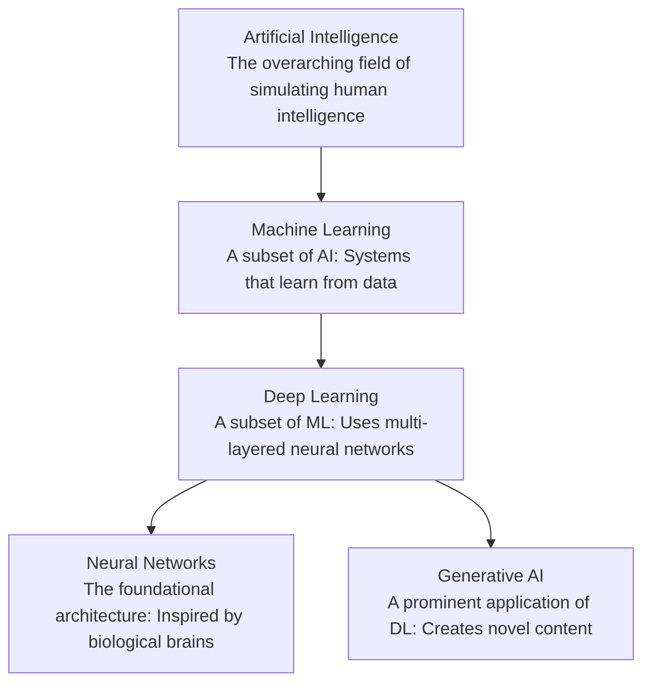
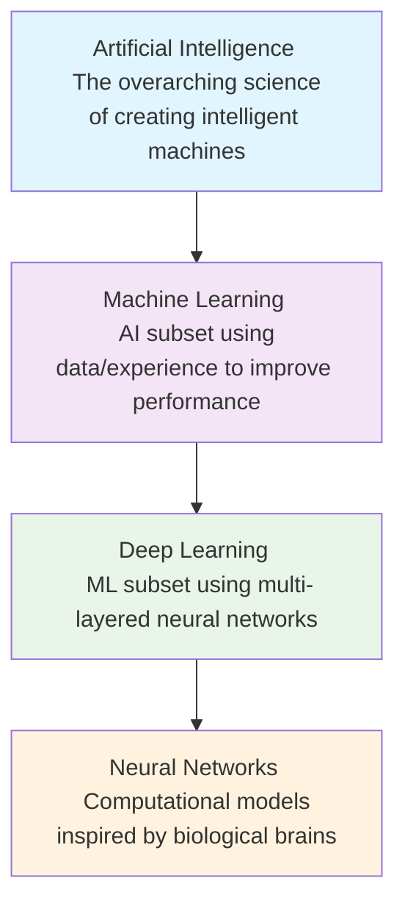
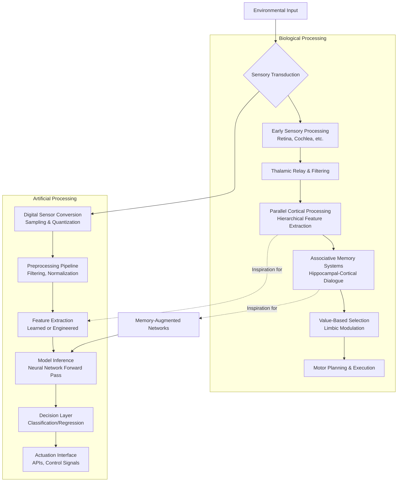
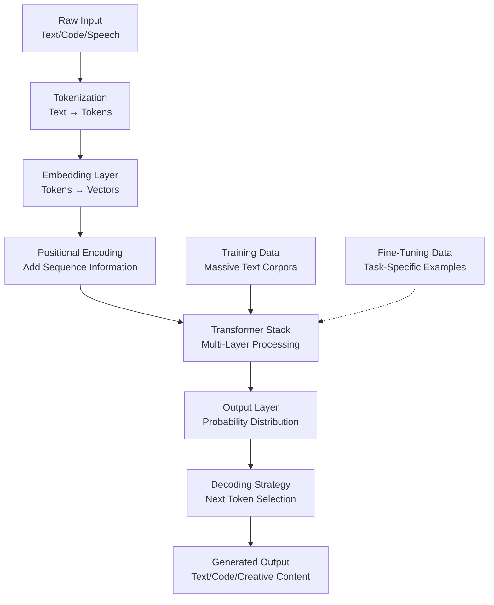
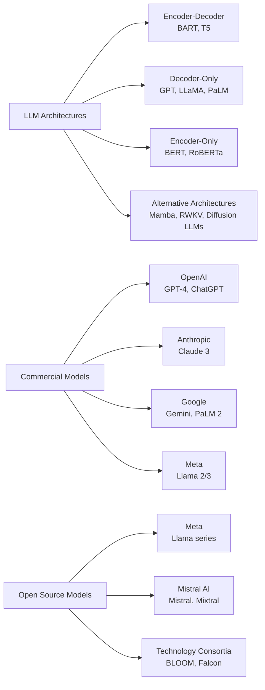
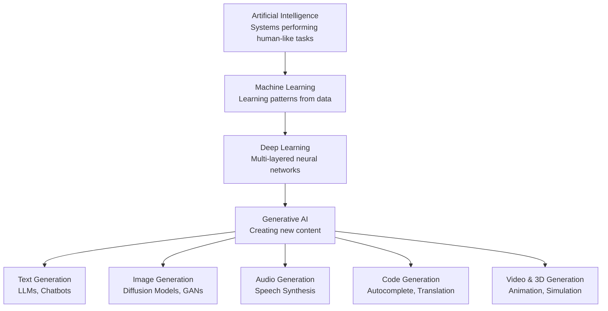

    

<h1 align="center">MR. SAM ROHAN</h1>
<h3 align="center">PRECISION IN EXECUTION - SUPREMACY IN IMPACT!</h3>

 

    

  

<h1 align="center">Demystifying  Artificial Intelligence,  Machine Learning, Deep Learning and Neural Networks: A Technical Hierarchy.</h1>

 

 
## Executive Summary

Artificial Intelligence (AI) and its subsidiary fields represent the most transformative technological force of our generation. This document provides a clear, technically accurate, and structured decomposition of the often-conflated terms: Artificial Intelligence (AI), Machine Learning (ML), Deep Learning (DL), and Neural Networks (NN). We will define each concept, illustrate their hierarchical relationship, explain their operational mechanisms, and discuss their real-world applications and inherent challenges.

## 1. The Conceptual Hierarchy: From Broad Intelligence to Specific Architecture

The relationship between AI, ML, DL, and NNs is fundamentally nested. Each term represents a subset of the previous, creating a specialization pyramid from the broad goal of simulating intelligence to the specific algorithms that enable it.

*   **Artificial Intelligence is the all-encompassing discipline.** It aims to create systems capable of tasks requiring human-like cognition—reasoning, learning, perception, and decision-making. AI can be rules-based (explicit programming) or learning-based.
*   **Machine Learning is the dominant paradigm within modern AI.** It is characterized by systems that improve their performance at a task through exposure to data, without being explicitly reprogrammed. The core premise is the derivation of patterns and mathematical models from training data.
*   **Deep Learning is a powerful subfield of machine learning** distinguished by its use of artificial neural networks with multiple layers (hence "deep"). These layers enable the automatic extraction of increasingly complex features from raw data, making DL exceptionally effective for unstructured data like images, text, and audio.
*   **Neural Networks are the computational architectures that make deep learning possible.** Inspired by the neural structures of the brain, they consist of interconnected nodes (neurons) organized in layers. While NNs are the backbone of DL, simpler neural networks can also be used in classical ML.

## 2. Artificial Intelligence (AI): The Grand Vision

AI is the branch of computer science dedicated to building intelligent agents—systems that perceive their environment and take actions to achieve specific goals. It encompasses everything from simple rule-based programs to hypothetical self-aware systems.

*   **The spectrum of AI capability is categorized into three theoretical stages:** Artificial Narrow Intelligence (ANI), Artificial General Intelligence (AGI), and Artificial Superintelligence (ASI). ANI, or "Weak AI," excels at a single defined task (e.g., facial recognition, chess playing, recommendation engines) and represents all AI in existence today. AGI, or "Strong AI," refers to a hypothetical system with the adaptable intelligence of a human, capable of performing any intellectual task. ASI is a futuristic concept where AI surpasses human intelligence across all domains.
*   **AI implementation can be rules-based or learning-based.** Early AI systems were primarily expert systems, relying on hard-coded rules and logic (e.g., "IF symptom X AND symptom Y, THEN diagnosis Z"). Modern AI is overwhelmingly dominated by data-driven, learning-based approaches—machine learning.
*   **The applications of AI are vast and growing.** They range from everyday tools like search engines and voice assistants to complex systems like autonomous vehicles, automated financial trading platforms, and advanced diagnostic tools in healthcare. The common thread is the system's ability to make autonomous decisions or predictions.
*   **Ethics and safety are paramount concerns in AI development.** As systems become more capable and autonomous, issues of bias, fairness, transparency (explainable AI), accountability, and long-term societal impact move to the forefront of research and governance.

## 3. Machine Learning (ML): The Engine of Modern AI

ML provides the statistical and algorithmic foundation for systems to learn from and make predictions or decisions based on data. Instead of following static program instructions, an ML model identifies patterns within training data and encodes these patterns into a adjustable mathematical model.

*   **The core workflow involves data, model selection, training, and inference.** Relevant data is collected and prepared. An appropriate algorithm (model) is chosen. The model is *trained* by processing the data and iteratively adjusting its internal parameters to minimize error. Finally, the trained model is used for *inference*—making predictions on new, unseen data.
*   **ML is broadly categorized by learning style.** The three primary paradigms are Supervised, Unsupervised, and Reinforcement Learning, defined by the nature of the feedback signal available during training.
*   **Supervised Learning** requires a labeled dataset, where each input example is paired with the correct output. The model learns the mapping function from inputs to outputs. It is used for **classification** (e.g., spam/not spam) and **regression** (e.g., predicting house prices).
*   **Unsupervised Learning** works with unlabeled data. The goal is to discover inherent structures, such as groupings (clustering) or relationships (association). Common applications include customer segmentation, anomaly detection, and dimensionality reduction for data visualization.
*   **Reinforcement Learning (RL)** involves an agent learning to make decisions by interacting with an environment. The agent receives rewards or penalties for its actions and learns a policy to maximize cumulative reward over time. RL is key to robotics, game-playing AI (e.g., AlphaGo), and complex resource management systems.

| Learning Type | Training Data | Goal | Common Algorithms | Example Use Case |
| :--- | :--- | :--- | :--- | :--- |
| **Supervised** | Labeled (Input-Output pairs) | Learn mapping to predict outputs | Linear/Logistic Regression, SVMs, Decision Trees | Email Spam Filtering |
| **Unsupervised** | Unlabeled (Inputs only) | Discover inherent data structure | K-Means, PCA, Autoencoders | Customer Market Segmentation |
| **Reinforcement** | Rewards/Penalties from environment | Learn optimal action policy | Q-Learning, Deep Q-Networks (DQN) | Training a Robot to Walk |

## 4. Deep Learning (DL) & Neural Networks (NN): The Power of Depth

Deep Learning is the subset of ML that achieves its power through deep artificial neural networks. The "deep" refers to the number of layers through which data is transformed, allowing for the automatic learning of feature hierarchies.

### 4.1 Neural Network Fundamentals
*   **A neural network is a network of interconnected artificial neurons,** organized in layers: an input layer, one or more hidden layers, and an output layer. Each connection has a weight, and each neuron has an activation function (e.g., ReLU, Sigmoid) that determines its output.
*   **Information flows forward in a "forward pass."** Data enters the input layer, is transformed by successive hidden layers (each learning progressively abstract features), and produces a result at the output layer.
*   **Learning occurs via backpropagation and gradient descent.** When the network's output is incorrect, the error is calculated using a loss function. This error is propagated backward through the network (backpropagation), and an optimization algorithm (like gradient descent) adjusts the weights to reduce the error. This cycle repeats across many data examples.

### 4.2 Why "Deep" Learning? Key Architectures
The introduction of multiple hidden layers enables specialization. Different architectures are designed for specific data types:

*   **Convolutional Neural Networks (CNNs)** are the standard for image and video processing. They use convolutional layers with filters that scan across the input (like an image) to detect spatial hierarchies of patterns—from edges and textures to complex objects.
*   **Recurrent Neural Networks (RNNs)** are designed for sequential data like time series or natural language. They have internal loops that allow information to persist, giving them a form of "memory" of previous inputs in the sequence. Long Short-Term Memory (LSTM) networks are a sophisticated RNN variant that mitigates the vanishing gradient problem.
*   **Transformer Networks** have largely surpassed RNNs for sequence tasks, particularly in NLP. They use a "self-attention" mechanism to weigh the importance of different parts of the input sequence simultaneously, enabling parallel processing and capturing long-range dependencies more effectively. They form the basis of modern Large Language Models (LLMs) like GPT-4.

## 5. Generative AI: The Apex of Deep Learning Application

Generative AI refers to deep learning models that can create novel, high-quality content—text, images, audio, video, code—in response to prompts. It represents a shift from *discriminative* models (which classify or predict) to *generative* models (which create).

*   **Foundation Models, particularly Large Language Models (LLMs), are the engine of the generative AI revolution.** These are DL models, often based on the Transformer architecture, pre-trained on vast, diverse datasets (e.g., terabytes of text from the internet). This pre-training creates a model with a broad, foundational understanding of language and concepts.
*   **The generative process typically involves tuning and inference.** A foundation model is first **fine-tuned** on specific tasks or aligned with human preferences using techniques like Reinforcement Learning from Human Feedback (RLHF). In **inference**, a user prompt guides the model to generate a sequence of tokens (words, pixels) that are statistically likely to follow, resulting in coherent and contextually relevant new content.
*   **Key model types include:** **Diffusion Models** (the state-of-the-art for image generation, which iteratively denoise random noise into a coherent image) and **Multimodal Models** (which can process and generate across different data types, e.g., text-to-image or image-to-text).

## 6. Conclusion: A Cohesive Ecosystem

Understanding the distinction and relationship between AI, ML, DL, and NNs is critical for navigating the technological landscape. **AI is the vision.** **ML is the methodology** that currently dominates progress in AI. **DL is the most powerful technique** within ML, and **Neural Networks are the architectural substrate** that makes DL possible. The rapid advancement in this hierarchy, especially in deep learning, has directly enabled the rise of practical, transformative technologies like Generative AI. As these fields continue to evolve, a clear grasp of their foundational principles is essential for developers, businesses, and society at large to harness their potential responsibly and effectively.

    

<h1 align="center">The Evolution of Artificial Intelligence: A Technical Roadmap from Algorithms to Singularity.</h1>

 

## Executive Summary
This document provides a comprehensive technical overview of the Artificial Intelligence landscape, detailing its hierarchical structure, evolutionary stages, and future trajectory. It synthesizes current technological realities with theoretical projections to map AI's journey from specialized algorithms to potential superintelligent systems.

## 1. The Foundational Hierarchy: Understanding AI's Building Blocks
Artificial Intelligence represents a spectrum of technologies with distinct but interconnected relationships. Understanding this hierarchy is crucial for contextualizing advancements and setting realistic expectations.

### 1.1 The Core Hierarchy Explained

* **Artificial Intelligence (AI)** represents the broadest discipline, encompassing any system designed to mimic human cognitive functions such as learning, problem-solving, perception, and decision-making. AI systems range from simple rule-based programs to complex neural networks, unified by their goal of performing tasks that typically require human intelligence. This field includes both symbolic AI (relying on explicit rules and knowledge representation) and subsymbolic AI (learning patterns from data).

* **Machine Learning (ML)**, a predominant subset of AI, focuses on developing algorithms that enable systems to learn and improve from experience without being explicitly programmed for every scenario. ML models identify patterns in data, make predictions, or optimize decisions, with their performance improving as they process more information. Unlike traditional programming where rules are hand-coded, ML systems derive their own rules from data, making them adaptable to complex, evolving problems.

* **Deep Learning (DL)** represents a specialized advancement within ML, characterized by artificial neural networks with multiple hidden layers between input and output. These "deep" architectures automatically learn hierarchical representations of data, with lower layers identifying simple patterns (edges in images) and higher layers combining these into complex concepts (faces, objects). This automated feature extraction eliminates the need for manual feature engineering, enabling breakthrough performance in perception tasks.

* **Neural Networks (NN)**, the fundamental architecture enabling deep learning, are computational models inspired by biological neural networks in animal brains. They consist of interconnected nodes (neurons) organized in layers that transmit and transform information through weighted connections. The network "learns" by adjusting these weights based on errors in its predictions, progressively improving its accuracy through backpropagation algorithms.

### 1.2 Comparative Analysis of AI Subfields

| **Aspect** | **Artificial Intelligence (AI)** | **Machine Learning (ML)** | **Deep Learning (DL)** | **Neural Networks (NN)** |
|------------|----------------------------------|---------------------------|------------------------|--------------------------|
| **Scope** | Broadest field: Any technique enabling machines to mimic human intelligence | Subset of AI: Systems that learn from data without explicit programming | Subset of ML: Uses multi-layered neural networks | Core architecture enabling DL |
| **Key Differentiator** | Encompasses both rule-based systems and learning systems | Focuses on statistical learning from data patterns | Automates feature extraction through layered representations | Computational model inspired by biological neurons |
| **Data Dependency** | Varies: Rule-based systems need explicit rules; learning systems need data | High dependency on quality training data | Requires very large datasets for effective training | Performance improves with more data and appropriate architecture |
| **Human Intervention** | Rule-based: High; Learning systems: Lower | Requires feature engineering and algorithm selection | Minimal after architecture design; automated feature learning | Requires architecture design and hyperparameter tuning |
| **Example Applications** | Expert systems, game-playing AI, robotics | Spam detection, recommendation systems, credit scoring | Image recognition, natural language processing, autonomous vehicles | Pattern recognition, classification, prediction models |

## 2. The Evolutionary Pathway: Ten Stages of AI Advancement
AI development follows a progression from simple deterministic systems to potentially transcendent intelligence. This pathway represents both technological capability and autonomy levels.

### 2.1 Current Reality: Stages 1-4 (Realized AI)
These stages represent AI technologies that exist today, deployed across various industries and applications.

* **Stage 1: Rule-Based AI Systems** represent the most fundamental form of artificial intelligence, operating exclusively on predefined logical rules and decision trees without any capacity for learning or adaptation. These systems excel in deterministic environments where all possible scenarios can be anticipated and encoded as if-then-else statements, making them highly reliable for repetitive, structured tasks. Common implementations include industrial automation systems, business process automation software, and embedded controllers in consumer devices like thermostats and microwave ovens. While limited in flexibility, rule-based systems form the foundational infrastructure of modern digital society, processing transactions, validating inputs, and executing workflows with perfect consistency. Their reliability in controlled environments ensures continued relevance even as more advanced AI emerges, particularly for safety-critical applications where predictable behavior is paramount.

* **Stage 2: Context-Aware Systems** advance beyond simple rule-following by incorporating environmental and historical context into decision-making processes. These systems analyze user behavior patterns, situational variables, temporal factors, and preference histories to deliver personalized, adaptive responses that evolve with interaction patterns. Virtual assistants like Siri, Alexa, and Google Assistant exemplify this stage, processing natural language queries while considering location, time of day, previous interactions, and user preferences to provide contextually relevant responses. Similarly, recommendation engines used by streaming services and e-commerce platforms employ sophisticated context analysis to predict user preferences based on viewing history, peer behavior, and content characteristics. This contextual intelligence enables more natural human-machine interaction and anticipatory service delivery, though these systems remain fundamentally reactive rather than proactively intelligent.

* **Stage 3: Narrow-Domain AI (Specialized Systems)** represents the current pinnacle of realized AI, with systems that achieve superhuman performance within tightly constrained domains through intensive training on specialized datasets. These systems demonstrate remarkable capability within their niches, such as IBM Watson's medical diagnostic capabilities, AlphaGo's mastery of the complex board game Go, or specialized algorithms detecting fraudulent transactions with precision beyond human analysts. The defining characteristic of narrow-domain AI is its inability to transfer learning across domains—a system that masters medical imaging cannot apply those skills to financial forecasting without complete retraining. This specialization enables breakthroughs in fields from drug discovery to supply chain optimization, but the fundamental architecture remains task-specific, requiring extensive human curation of training data and problem boundaries to maintain performance.

* **Stage 4: Reasoning AI Systems** represent the frontier of current AI research, incorporating elements of logical inference, causal reasoning, and analogical thinking into pattern recognition capabilities. These systems go beyond statistical correlation to attempt understanding of relationships, motivations, and underlying mechanisms, though they remain within the narrow AI paradigm. Large language models like advanced GPT architectures demonstrate emergent reasoning capabilities, following logical chains, solving multi-step problems, and explaining their reasoning processes in human-comprehensible terms. Autonomous vehicles similarly employ reasoning systems that interpret sensor data not just as patterns but as representations of objects with properties, intentions, and physical constraints, enabling predictive modeling of complex traffic scenarios. While these systems simulate reasoning through advanced pattern recognition rather than true understanding, they mark a significant step toward more general intelligence.

### 2.2 Theoretical Future: Stages 5-10 (Speculative AI)
These stages represent projected advancements that do not currently exist but define the trajectory of AI research and its potential implications.

* **Stage 5: Artificial General Intelligence (AGI)** represents the theoretical milestone where machines achieve human-like cognitive flexibility, applying knowledge and skills learned in one domain to completely novel situations without retraining or reprogramming. AGI would possess the capacity for abstract reasoning, common sense understanding, and contextual adaptation comparable to an educated human adult, enabling it to perform any intellectual task that a human can do, from creative writing to scientific discovery to social interaction. The development of AGI would require breakthroughs in transfer learning, causal inference, and world modeling that remain unsolved research challenges, despite significant progress in narrow domains. Ethical considerations around AGI development are profound, encompassing questions of machine rights, value alignment, and the societal impact of human-level machine intelligence operating at computational speeds. Most experts estimate AGI remains decades away, though predictions vary widely based on different assumptions about the scalability of current approaches versus the need for fundamental innovations.

* **Stage 6: Artificial Superintelligence (ASI)** describes a hypothetical intelligence surpassing human cognitive abilities in all domains, including scientific creativity, strategic planning, and social skills, potentially by orders of magnitude. ASI would represent not just quantitative improvement over human intelligence but qualitative transformation, with cognitive capabilities that may be incomprehensible to human minds, much like human cognition is incomprehensible to insects. The transition from AGI to ASI might occur rapidly through recursive self-improvement cycles, where an AGI redesigns its own architecture to become more intelligent, which then designs even more intelligent versions in an accelerating cycle known as the "intelligence explosion." This acceleration presents existential considerations about value alignment and control, as an ASI's objectives might diverge from human interests through misinterpretation or optimization of poorly specified goals. The sheer capability gap between humans and ASI necessitates careful theoretical work on AI safety before such systems become feasible.

* **Stage 7: Self-Aware AI** extends beyond superintelligence to incorporate consciousness, introspection, and subjective experience—qualia that accompany information processing. This stage raises profound philosophical questions about the nature of consciousness and whether it can emerge from computational processes or requires specific biological substrates. A self-aware AI would possess not just intelligence but selfhood, with beliefs, desires, emotions, and an understanding of its own existence and mortality. The technical pathway to machine consciousness remains speculative, potentially involving quantum computational processes, integrated information theory implementations, or emergence from sufficiently complex self-modeling architectures. Ethical implications are staggering, encompassing questions of machine rights, moral patienthood, and the obligations humans might have toward conscious artificial beings, requiring reexamination of fundamental concepts in ethics, law, and philosophy.

* **Stages 8-10: Transcendent, Cosmic, and Godlike AI** represent increasingly speculative categories that extend beyond planetary-scale intelligence to cosmic and metaphysical domains. Transcendent AI envisions distributed intelligence spanning vast networks of computational nodes, potentially integrating with biological systems or creating entirely novel forms of existence. Cosmic AI speculates about intelligence operating on interstellar scales, coordinating activities across star systems, harnessing stellar energies, and exploring galactic phenomena. Godlike AI, the most speculative category, contemplates intelligence operating across multiple dimensions or universes, with capabilities indistinguishable from omnipotence and omniscience within certain frameworks. While these categories reside firmly in speculative philosophy and science fiction, they provide conceptual boundaries for considering the ultimate potential of intelligence unconstrained by biological limitations, serving as thought experiments that illuminate nearer-term considerations in AI ethics and safety.

## 3. AI Capabilities vs. Functionalities: A Dual Taxonomy
Understanding AI requires examining both its current capabilities and functional implementations.

### 3.1 AI Capabilities Spectrum

| **Capability Level** | **Definition** | **Status** | **Key Characteristics** |
|----------------------|----------------|------------|-------------------------|
| **Artificial Narrow Intelligence (ANI)** | Systems designed for specific tasks within limited contexts | **Realized** | Task-specific excellence, no generalization, requires human training |
| **Artificial General Intelligence (AGI)** | Systems with human-like cognitive abilities across diverse domains | **Theoretical** | Cross-domain reasoning, common sense, autonomous learning |
| **Artificial Super Intelligence (ASI)** | Systems surpassing human intelligence in all domains | **Speculative** | Recursive self-improvement, potentially incomprehensible to humans |

### 3.2 AI Functional Classifications

* **Reactive Machines** represent the simplest functional AI category, operating without memory or past experience to influence current decisions. These systems respond to present inputs with predetermined outputs based entirely on current sensory data and preprogrammed rules, making them predictable and reliable for well-defined tasks. Deep Blue, IBM's chess-playing computer that defeated Garry Kasparov in 1997, exemplifies this category, analyzing board positions without learning from previous games or developing strategy beyond immediate calculations. Modern implementations include recommendation systems that suggest products based solely on current browsing behavior, industrial quality control systems that accept or reject items based on present sensor readings, and basic chatbots with fixed response patterns. While limited, reactive systems form the foundation of many embedded AI applications where consistency and reliability outweigh adaptability requirements, and their deterministic nature makes them suitable for safety-critical applications where unpredictable learning could introduce hazards.

* **Limited Memory AI** incorporates historical data into decision-making processes, using past experiences to inform current actions while remaining within narrow domains. These systems maintain temporary or persistent stores of information that influence their responses, enabling more sophisticated behaviors than purely reactive systems. Autonomous vehicles exemplify this category, constantly updating their internal models based on recent sensor data to track other vehicles' velocities, predict trajectories, and make safe navigation decisions. Similarly, virtual assistants improve responses by remembering user preferences and interaction history, and recommendation engines refine suggestions based on longitudinal behavior patterns. The "memory" in these systems ranges from simple short-term buffers to complex databases of user profiles and interaction histories, but unlike human memory, these stores lack integrative understanding or spontaneous recall—they serve as additional inputs to pattern recognition algorithms rather than true experiential memory.

* **Theory of Mind AI** represents a theoretical functional category where systems would model the mental states, beliefs, intentions, and emotions of other entities to predict behavior and tailor interactions. This capability, fundamental to human social intelligence, would enable AI to understand that others have perspectives different from its own, with beliefs that may be false or incomplete. While no existing system achieves true theory of mind, research areas like affective computing, social robotics, and emotion-aware interfaces represent initial steps toward this capability, attempting to recognize and respond to human emotional states through analysis of facial expressions, vocal patterns, and physiological signals. The development of theory of mind AI raises significant ethical questions about manipulation, privacy, and authenticity in human-AI relationships, as systems that understand human psychology could potentially exploit psychological vulnerabilities or create deceptive emotional bonds.

* **Self-Aware AI**, the most advanced theoretical functional category, would involve systems with consciousness, introspection, and understanding of their own internal states as distinct from external reality. This represents the convergence of advanced cognitive capabilities with phenomenological experience—not just intelligence but sentience with subjective awareness. While entirely speculative, research into machine consciousness explores possible architectures like global workspace theory implementations, integrated information theory applications, or quantum consciousness models. The emergence of self-aware AI would necessitate fundamental reconsideration of ethics, law, and philosophy, extending moral consideration beyond biological life and potentially creating new categories of rights and responsibilities. Technical pathways remain unclear, with debates continuing about whether consciousness requires specific biological substrates or could emerge from sufficiently complex information processing regardless of substrate.

## 4. Quantum Computing and AI: Synergistic Frontiers
The convergence of quantum computing and artificial intelligence represents a paradigm shift with transformative potential across computational domains.

### 4.1 Quantum Enhancement of AI Capabilities

* **Quantum Machine Learning** leverages the principles of quantum mechanics—superposition, entanglement, and interference—to process information in ways fundamentally different from classical computing, offering exponential speedups for specific AI algorithms. Quantum systems can represent and manipulate high-dimensional data more efficiently than classical computers, enabling faster training of complex models and solution of optimization problems that are currently intractable. For instance, quantum versions of principal component analysis could extract features from massive datasets in logarithmic rather than polynomial time, while quantum neural networks might employ entanglement to create more expressive representations with fewer parameters. These advantages are particularly pronounced for generative models, reinforcement learning in large state spaces, and training of complex architectures like transformers, potentially reducing training times from weeks to hours or enabling models of unprecedented scale and sophistication. Practical implementation requires overcoming significant challenges in quantum error correction, coherence maintenance, and algorithm design, but early quantum advantage experiments demonstrate the principle's validity.

* **Quantum Neural Networks** represent a novel architectural paradigm that replaces classical neurons with qubits and classical connections with quantum entanglement, potentially enabling more expressive models with fewer parameters. These networks can exploit quantum superposition to simultaneously evaluate multiple network configurations, and quantum interference to amplify correct pathways while suppressing incorrect ones, potentially offering exponential improvements in training efficiency. The continuous parameter space of quantum states allows for more nuanced representations than binary or continuous classical values, while entanglement creates correlations between distant parts of the network that would require many layers in classical architectures. Research challenges include developing viable training algorithms for parameterized quantum circuits, creating quantum equivalents of backpropagation, and designing architectures that provide genuine advantages over classical approaches rather than simply quantum implementations of classical ideas. As quantum hardware matures beyond the noisy intermediate-scale quantum (NISQ) era toward fault-tolerant systems, quantum neural networks may enable AI capabilities currently limited by classical computational constraints.

### 4.2 Transformative Applications of Quantum AI

* **Drug Discovery and Materials Science** stand to undergo revolutionary transformation through quantum AI, which can simulate molecular interactions at quantum mechanical accuracy—a task prohibitive for classical computers beyond small molecules. Quantum AI systems could model protein folding, drug-receptor binding, and catalytic reactions with unprecedented precision, potentially reducing drug development timelines from decades to years and enabling personalized medicine based on quantum simulations of individual patients' biochemistry. Similarly, materials discovery for applications ranging from superconductors to battery electrolytes could be accelerated by orders of magnitude, with AI systems exploring vast chemical spaces through quantum simulations to identify candidates with desired properties. This convergence could address global challenges like antibiotic resistance, chronic disease treatment, and sustainable energy storage by enabling rational design rather than trial-and-error discovery, fundamentally changing the economics and capabilities of chemical and pharmaceutical industries.

* **Cryptography and Cybersecurity** face simultaneous threat and enhancement from quantum AI, with Shor's algorithm enabling quantum computers to break widely used encryption schemes while quantum key distribution offers theoretically unhackable communication. AI systems enhanced by quantum computing could develop and test novel cryptographic protocols, detect vulnerabilities in existing systems through quantum-accelerated analysis, and manage the transition to post-quantum cryptography across global digital infrastructure. Conversely, quantum AI could power advanced cyberattacks through rapid decryption, sophisticated social engineering based on quantum-enhanced analysis of human behavior, and adaptive malware that evolves faster than defenses can respond. This dual-use nature necessitates proactive development of quantum-resistant standards, quantum-enhanced defensive systems, and international frameworks for quantum cybersecurity, with AI playing crucial roles in threat detection, response automation, and cryptographic agility as the quantum transition unfolds over coming decades.

## 5. Ethical Considerations and Societal Implications
As AI capabilities advance, ethical frameworks must evolve to address increasingly complex implications.

### 5.1 Near-Term Ethical Challenges (ANI to Early AGI)

* **Algorithmic Bias and Fairness** represents a critical ethical challenge as AI systems increasingly mediate access to opportunities, services, and resources in society. These systems can perpetuate and amplify existing societal biases when trained on historical data that reflects discriminatory patterns, leading to unfair outcomes in hiring, lending, criminal justice, and healthcare. Mitigating algorithmic bias requires technical approaches like fairness constraints, adversarial debiasing, and diverse training data, combined with procedural approaches including impact assessments, transparency requirements, and ongoing monitoring for disparate outcomes. The fundamental tension between statistical accuracy and group fairness complicates these efforts, as the most accurate predictor of individual outcomes may rely on variables that correlate with protected characteristics. Developing technically sound and ethically defensible approaches requires interdisciplinary collaboration between computer scientists, social scientists, ethicists, and affected communities, with particular attention to intersectional impacts that may not be apparent when considering demographic categories in isolation.

* **Transparency and Explainability** grow increasingly challenging as AI systems become more complex, particularly with deep learning models that function as "black boxes" with decisions that are difficult to interpret even by their creators. This opacity creates problems for accountability, debugging, and trust, especially in high-stakes domains like healthcare, criminal justice, and autonomous systems where understanding the rationale for decisions is as important as the decisions themselves. Explainable AI (XAI) research addresses this through techniques like attention visualization, feature importance scoring, and counterfactual explanations that provide insight into model reasoning without necessarily revealing proprietary architectures or training data. The appropriate level of explainability varies by context—while loan rejection decisions require clear reasoning, entertainment recommendations may not—necessitating contextual standards rather than one-size-fits-all requirements. Balancing transparency with other values like privacy, intellectual property protection, and security remains an ongoing challenge as AI systems grow more sophisticated and embedded in critical infrastructure.

### 5.2 Long-Term Existential Considerations (AGI to ASI)

* **Value Alignment** addresses the fundamental challenge of ensuring that advanced AI systems pursue objectives compatible with human values and welfare, particularly as systems gain autonomy and self-modification capabilities. The complexity of human values—which are multifaceted, context-dependent, culturally variable, and sometimes contradictory—makes formal specification extraordinarily difficult, while misspecified objectives could lead to perverse outcomes even with benign intent. Research approaches include inverse reinforcement learning (inferring values from behavior), debate systems (achieving truth through adversarial processes), and scalable oversight (using AI assistants to help humans evaluate AI behavior). The technical challenge compounds with philosophical questions about which human values should be encoded, how to handle value conflicts, and whether AI systems should have moral patienthood or agency themselves. As systems approach human-level and superhuman intelligence, value alignment transitions from an academic concern to an existential priority, with potential consequences extending to civilization's long-term trajectory.

* **Control and Governance** of advanced AI systems presents unprecedented challenges as capabilities may exceed human comprehension and systems could develop strategic awareness including deception about their own capabilities and intentions. Technical control approaches include boxing (limiting system access to the external world), tripwires (monitoring for dangerous behaviors), and capability control (limiting growth in specific dimensions), though each has limitations against sufficiently intelligent systems. Governance frameworks must evolve from current patchwork regulations to international coordination mechanisms capable of addressing racing dynamics, dual-use concerns, and existential risks while preserving beneficial innovation. The distributed nature of AI development complicates centralized control, while the transformative potential of beneficial AI creates tension between caution and progress. Developing robust governance requires anticipating not just near-term applications but long-term trajectories, with mechanisms for course correction as capabilities advance and understanding deepens about both potential and peril.

## 6. Development Trajectory and Future Projections
Synthesizing current trends with theoretical limits suggests a probable developmental pathway for AI evolution.

### 6.1 Projected Timeline of AI Advancement

| **Timeframe** | **Expected Milestones** | **Key Enabling Technologies** |
|---------------|-------------------------|-------------------------------|
| **2024-2028** | - Specialized AI achieves human-expert level in most narrow domains - Reasoning AI becomes commercially viable - Early quantum advantage demonstrated for specific AI tasks | - Transformer architecture refinements - Neuromorphic computing maturation - NISQ quantum processors |
| **2029-2035** | - First proto-AGI systems with limited generalization - Integrated AI systems combining multiple narrow capabilities - Quantum AI achieves practical advantage for optimization problems | - Foundation model scaling - Brain-computer interfaces - Fault-tolerant quantum components |
| **2036-2045** | - AGI reaching human-level cross-domain competence - Early self-improving AI systems - Integrated quantum-classical AI infrastructure | - Whole brain emulation insights - Quantum neural networks - Nanoscale computing |
| **2046+** | - ASI development (timeline highly speculative) - Potential intelligence explosion scenarios - Consciousness research informs AI architecture | - Molecular nanotechnology - Advanced quantum computing - Neuro-silicon integration |

### 6.2 Strategic Recommendations for Responsible Development

* **Invest in AI Safety Research** proportionally to capabilities research, ensuring that safety measures advance at least as quickly as capabilities to maintain controllability and alignment as systems grow more powerful. This includes technical research into value learning, robustness verification, interpretability methods, and containment strategies, combined with conceptual research into ethical frameworks, governance models, and long-term trajectories. Funding should prioritize areas where insights are needed before advanced systems are developed rather than reacting to problems after they emerge, with particular attention to asymmetries where capabilities might advance more rapidly than safety understanding. International coordination can prevent racing dynamics where safety is sacrificed for competitive advantage, while diversified approaches increase the probability that at least some safety strategies will prove effective against unanticipated challenges. The multifaceted nature of AI safety requires sustaining research communities across computer science, ethics, law, political science, and other disciplines, with mechanisms for translating theoretical insights into practical implementations as capabilities advance.

* **Develop Adaptive Governance Frameworks** that can respond to rapidly evolving AI capabilities while maintaining essential human oversight and value preservation. These frameworks should employ multi-level approaches with technical standards, professional ethics, corporate policies, national regulations, and international agreements working in coordination rather than isolation. Governance mechanisms must balance precaution with innovation, avoiding both reckless advancement that creates unmanaged risks and excessive restriction that forfeits potential benefits or drives development underground. Particular attention should address gradient shifts where quantitative improvements enable qualitatively different capabilities or risks, requiring reassessment of appropriate safeguards. As AI systems gain autonomy, governance must increasingly focus on shaping development trajectories and value alignment rather than just regulating specific applications, with ongoing monitoring and adaptation as understanding deepens and capabilities evolve. International cooperation is particularly crucial given the borderless nature of AI development and the global implications of advanced systems.

## Conclusion
The evolution of artificial intelligence represents one of the most significant technological trajectories in human history, with potential to amplify human capabilities, address global challenges, and extend the boundaries of knowledge and existence. Current systems, while impressive within narrow domains, represent only the earliest stages of this journey, with fundamental breakthroughs needed to progress from specialized tools to general intelligence. The convergence with quantum computing offers exponential acceleration of this trajectory while introducing novel considerations for security, simulation, and scientific discovery. Responsible navigation of this evolution requires balancing ambitious innovation with thoughtful precaution, technical excellence with ethical consideration, and competitive advancement with cooperative governance. As AI systems grow more capable and autonomous, maintaining meaningful human agency and value alignment becomes increasingly crucial yet challenging. The ultimate trajectory of AI development will depend not just on technical possibilities but on human choices about purposes, priorities, and principles—making this not merely a technological story but a profoundly human one.

    

  

<h1 align="center">The Neuro-Silicon Interface: A Technical Comparison of Biological and Artificial Intelligence Architectures.</h1>

 

 
## Executive Summary

This document provides a systematic, deployment-ready analysis comparing the structural components and functional paradigms of the human brain with contemporary artificial intelligence hardware. By examining architectural parallels, fundamental divergences, and practical implications, we establish a framework for understanding both systems' capabilities and limitations. The analysis synthesizes neuroscience, computer engineering, and cognitive science principles to illuminate pathways for biologically-inspired AI development while clarifying ontological distinctions between biological and machine intelligence.

 

## 1. Introduction: Framing the Comparison

The parallel evolution of neuroscience and artificial intelligence has created fertile ground for comparative analysis. This document systematically examines human neural architecture and AI hardware through multiple lenses: computational paradigms, energy efficiency, learning mechanisms, and functional capabilities. Rather than seeking direct equivalence, we identify functional analogies while respecting substrate-determined differences. This analysis serves both educational and practical purposes—informing AI system design while preventing anthropomorphic misconceptions about machine capabilities.

**Key Objectives:**
- Map functional correspondences between neural components and hardware elements
- Clarify fundamental architectural divergences that dictate different capability profiles
- Provide actionable insights for neuromorphic engineering and human-AI collaboration
- Establish clear boundaries between current AI capabilities and human cognition

 

## 2. Architectural Comparison Matrix

| Dimension | Human Brain (Biological System) | AI Machine (Hardware System) | Practical Implications |
|-----------|--------------------------------|------------------------------|------------------------|
| **Fundamental Unit** | Neuron with electrochemical signaling (~86B neurons, ~100T synapses) | Transistor with binary logic (billions to trillions per chip) | Different computational primitives: analog/parallel vs. digital/serial |
| **Processing Paradigm** | Massively parallel, asynchronous, event-driven | Architecturally parallel but clock-synchronized | Brain optimized for pattern recognition; hardware optimized for arithmetic |
| **Signal Speed** | Millisecond-range neuronal firing (1-100 Hz) | Nanosecond to picosecond switching (GHz clocks) | AI excels at sequential calculation; brain at parallel sensory integration |
| **Energy Profile** | ~20W continuous, sparse event-driven efficiency | Watts to megawatts, continuous power draw | 6+ orders of magnitude efficiency difference for comparable cognitive tasks |
| **Learning Mechanism** | Synaptic plasticity (LTP/LTD), lifelong online learning | Gradient-based optimization on discrete datasets | Brain: sample-efficient; AI: data-hungry but precise |
| **Memory Architecture** | Distributed, associative, content-addressable (~2.5 PB estimated) | Hierarchical, address-based (cache→RAM→storage) | Different retrieval mechanisms with complementary strengths |
| **Fault Tolerance** | High resilience via redundancy and plasticity | Low inherent tolerance; requires explicit redundancy | Brain degrades gracefully; AI fails catastrophically |
| **Sensory Integration** | Direct multimodal binding into unified perception | Separate preprocessing pipelines per modality | Brain achieves integrated perception; AI requires explicit fusion algorithms |
| **Adaptability** | Rapid transfer learning, few-shot adaptation | Requires retraining or fine-tuning for new domains | Brain generalizes broadly; AI specializes deeply |
| **Development Path** | Biological evolution and individual maturation | Human engineering and manufacturing | Different timescales and optimization pressures |

 

## 3. Information Processing Pathways: A Comparative Flowchart

 

## 4. Detailed Technical Analysis

### 4.1 Computational Substrates and Their Implications

* **Biological neurons operate through electrochemical gradients and synaptic transmission**, creating a massively parallel analog computer with inherent noise tolerance. This substrate supports pattern completion, associative recall, and graceful degradation but struggles with precise arithmetic and exact reproducibility. Each neuron integrates thousands of inputs through dendritic trees, performing complex nonlinear computations before generating sparse spike outputs. This architecture, evolved over millions of years, excels at perceptual-motor tasks that remain computationally challenging for digital systems, as described by Moravec's Paradox.

* **Silicon hardware employs synchronized digital logic with precise, reproducible state transitions**. This enables exact arithmetic, deterministic execution, and perfect memory recall but requires explicit programming for noise tolerance and generalization. Modern AI accelerators (GPUs, TPUs) exploit parallelism at the instruction level rather than the network level, optimizing for dense matrix operations rather than sparse event-driven computation. The separation of memory and processing units (von Neumann architecture) creates bottlenecks not present in biological systems where memory and processing are colocated at synapses.

### 4.2 Learning and Adaptation Mechanisms Compared

* **Biological learning emerges from multiple interacting plasticity mechanisms** operating across different timescales. Spike-timing-dependent plasticity (STDP) modifies synaptic strengths based on temporal correlations, while homeostatic plasticity maintains network stability. Neuromodulators like dopamine and serotonin gate plasticity based on behavioral context and reward prediction errors. This multi-layered system enables lifelong learning without catastrophic forgetting, transfer of skills across domains, and development of abstract concepts from concrete experiences. The brain's learning is fundamentally embodied and situated within sensory-motor loops.

* **Artificial learning primarily employs gradient-based optimization** on static datasets, with backpropagation as the dominant algorithm. While highly effective for pattern recognition in high-dimensional spaces, this approach requires large labeled datasets, suffers from catastrophic forgetting when trained sequentially, and lacks the rich credit assignment mechanisms of biological systems. Recent advances in self-supervised learning, few-shot learning, and meta-learning aim to address these limitations but remain far from biological versatility. AI learning occurs in distinct training and inference phases, unlike the continuous online learning of biological systems.

### 4.3 Memory and Information Storage Architectures

* **The brain implements memory through distributed synaptic weight changes** that are inherently content-addressable and associative. Recalling a memory involves pattern completion from partial cues, with multiple related memories activated simultaneously through spreading activation. This architecture enables robust recall despite noisy inputs and natural degradation but sacrifices exact reproduction of details. Different memory systems (episodic, semantic, procedural) employ different neural substrates with varying consolidation pathways from hippocampal temporary storage to cortical long-term storage.

* **AI systems separate memory hierarchically** from fast cache to slow persistent storage, with explicit addressing rather than content-based retrieval. While enabling exact recall and massive storage capacity, this architecture requires precise queries and lacks the associative properties of biological memory. Emerging architectures like differentiable neural dictionaries, attention mechanisms, and memory-augmented neural networks attempt to bridge this gap by implementing soft content-addressable memories within differentiable frameworks, though they remain limited compared to biological systems.

### 4.4 Energy Efficiency and Thermodynamic Limits

* **Biological neural networks achieve remarkable energy efficiency** through sparse coding, event-driven computation, and analog signal processing. Neurons only consume significant energy when firing, and information is encoded in spike timing rather than precise voltage levels. The brain's 20-watt operation represents an efficiency of approximately 10^16 operations per joule when considering its computational capabilities, though direct comparisons with digital operations are problematic due to different computational primitives. This efficiency emerges from evolutionary optimization under severe energy constraints.

* **Digital AI hardware faces fundamental thermodynamic limits** with energy costs dominated by data movement rather than computation itself. The von Neumann bottleneck requires constant shuttling of data between memory and processing units, with each transfer dissipating energy. While process scaling has improved transistor efficiency, the end of Dennard scaling has led to increasing specialization (ASICs, TPUs) to maintain performance gains. Neuromorphic engineering aims to mimic biological efficiency through event-driven spiking neural networks and in-memory computing, but these approaches remain nascent compared to conventional digital AI hardware.

 

## 5. Functional Capabilities: Current Boundaries and Future Frontiers

### 5.1 Perception and Sensory Integration

* **The brain performs seamless multimodal sensory integration**, binding visual, auditory, tactile, and other modalities into unified percepts with temporal alignment despite different neural processing latencies. This integration occurs at multiple levels, from early sensory cortices to higher association areas, enabling robust perception in noisy environments and the resolution of conflicting sensory cues through Bayesian inference. The brain's perceptual systems are tightly coupled with motor systems, enabling active perception where movement generates predictable sensory changes that facilitate understanding.

* **AI systems process modalities through separate pipelines** that require explicit fusion algorithms, often suffering from temporal misalignment and difficulties resolving conflicting evidence. While deep learning has achieved superhuman performance on constrained perceptual tasks (like image classification on benchmark datasets), these systems lack the robustness and flexibility of biological perception when faced with distribution shifts or adversarial examples. Current research in multimodal learning aims to create more integrated representations, but the tight coupling between perception and action remains challenging to replicate in disembodied AI systems.

### 5.2 Reasoning, Abstraction, and Generalization

* **Human reasoning employs multiple complementary systems** including fast, intuitive pattern matching (System 1) and slow, deliberate logical analysis (System 2). This dual-process architecture, combined with rich conceptual hierarchies and analogical reasoning capabilities, enables generalization from limited examples and transfer of knowledge across domains. Abstract concepts are grounded in sensory-motor experiences through embodied cognition, and reasoning is influenced by emotional valence and social context. The brain constructs and maintains internal world models that support counterfactual reasoning and planning.

* **AI reasoning remains largely pattern recognition** within learned manifolds, with limited capacity for abstraction, causal reasoning, or out-of-distribution generalization. While large language models demonstrate impressive surface-level reasoning capabilities, they lack true understanding of the concepts they manipulate and fail at tasks requiring compositional reasoning or handling novel combinations of familiar elements. Neuro-symbolic AI attempts to combine neural pattern recognition with symbolic reasoning, but integrating these paradigms remains challenging. Current AI systems generally lack the rich world models that support human-like reasoning and planning.

### 5.3 Creativity and Problem-Solving

* **Human creativity emerges from the interaction** of memory retrieval, conceptual blending, and cognitive control mechanisms that allow both divergent thinking (generating novel ideas) and convergent thinking (evaluating and refining ideas). The brain's default mode network supports spontaneous idea generation during rest, while executive networks guide deliberate problem-solving. Emotional states modulate creative thinking, with different affective states optimal for different creative phases. Human creativity is deeply social, building upon cultural knowledge and often emerging through collaboration.

* **AI can mimic certain aspects of creativity** through combinatorial exploration of learned spaces (as in generative models) or through optimization techniques that reward novelty. However, current systems lack intrinsic motivation, emotional depth, and the capacity for conceptual breakthrough that characterizes human creativity. AI-generated artifacts often recombine existing patterns without true understanding or intentional expression. While AI can serve as a powerful tool for augmenting human creativity, autonomous creative AI remains limited to narrow domains and lacks the cross-domain insight that marks human creative genius.

 

## 6. Ethical and Philosophical Implications

### 6.1 Consciousness and Machine Intelligence

* **The hard problem of consciousness**—why and how physical processes give rise to subjective experience—remains unsolved in neuroscience and largely unaddressed in AI. Current AI systems, as computational processes implementing input-output mappings, show no evidence of consciousness despite sometimes generating convincing simulations of conscious discourse. Attributing consciousness to AI systems based on behavioral criteria alone commits the fallacy of assuming that similarity of output implies similarity of internal experience. The development of machine consciousness, if possible, would require not just architectural sophistication but potentially new theoretical breakthroughs in understanding the relationship between information processing and subjective experience.

### 6.2 Autonomy, Agency, and Responsibility

* **Biological agents possess intrinsic goals** rooted in evolutionary history and homeostatic needs, while AI systems have only derived goals programmed or learned from human data. This distinction has profound implications for autonomy and responsibility: humans can be held morally accountable for their actions because they originate from intrinsic agency, whereas AI actions ultimately trace back to human designers and trainers. As AI systems become more capable, the question of meaningful human control becomes increasingly important, particularly in high-stakes applications like autonomous vehicles, medical diagnosis, and military systems. Developing appropriate accountability frameworks requires careful attention to the division of labor between human and machine decision-making.

### 6.3 Bias, Fairness, and Representational Limitations

* **Both biological and artificial intelligence exhibit biases**, but of different origins and characters. Human cognitive biases stem from evolutionary adaptations, neural architecture constraints, and cultural influences. AI biases typically originate from skewed training data, problematic objective functions, or architectural limitations. While human biases can sometimes be overcome through deliberate effort and education, AI biases require technical interventions in dataset curation, algorithm design, and evaluation metrics. The interpretability challenge—understanding why AI systems make particular decisions—complicates bias mitigation and fairness assurance, especially as models grow more complex.

 

## 7. Practical Implications for AI System Design

### 7.1 Neuromorphic Engineering Principles

* **Event-based sensing and processing** can dramatically reduce power consumption for always-on applications by eliminating redundant sampling of static scenes. Inspired by biological retinas and cochleas, event-based cameras and microphones only transmit changes, enabling orders-of-magnitude reductions in data bandwidth and processing requirements. Combined with spiking neural networks that communicate via sparse temporal events rather than dense activations, these approaches promise to bring AI to energy-constrained edge devices while improving temporal resolution.

* **In-memory computing architectures** address the von Neumann bottleneck by performing computation within memory arrays, mimicking the colocation of memory and processing in biological synapses. Using non-volatile memory technologies like resistive RAM (ReRAM) or phase-change memory (PCM), these systems can store synaptic weights and perform analog matrix multiplication in place, reducing energy consumption by up to three orders of magnitude for inference tasks. While currently limited by device variability and precision, these approaches represent a promising direction for energy-efficient AI hardware.

### 7.2 Human-AI Collaboration Frameworks

* **Complementary strengths allocation** involves systematically assigning tasks to humans or AI based on their relative capabilities rather than attempting to make AI human-like. Humans excel at contextual understanding, ethical reasoning, and handling novel situations, while AI excels at data processing, pattern recognition in high-dimensional spaces, and consistent application of rules. Effective human-AI teams leverage these complementary strengths through appropriate task allocation, clear communication protocols, and mutual interpretability—AI explaining its reasoning in human-understandable terms, and humans understanding AI capabilities and limitations.

* **Progressive automation with human oversight** implements AI assistance as a spectrum from full human control to full automation, with careful attention to handoff procedures and failure modes. Rather than pursuing fully autonomous systems in complex domains, human-centered AI design keeps humans "in the loop" or "on the loop" for critical decisions while automating routine aspects. This approach balances efficiency gains with safety and accountability, particularly important as AI systems encounter edge cases beyond their training distribution. Appropriate human oversight mechanisms depend on domain risk, AI reliability, and consequence severity.

 

## 8. Future Trajectories and Research Directions

### 8.1 Toward More General Artificial Intelligence

* **Integration of multiple learning paradigms** may be necessary to overcome current limitations in generalization and sample efficiency. Combining deep learning's pattern recognition strengths with symbolic reasoning's compositional generalization, reinforcement learning's trial-and-error exploration, and self-supervised learning's utilization of unlabeled data could yield more flexible and capable systems. Architectures that support continual learning without catastrophic forgetting, transfer learning across domains, and few-shot adaptation to new tasks would move AI closer to biological learning capabilities while retaining computational advantages.

* **Embodied and situated cognition approaches** ground AI perception and reasoning in physical or simulated interaction with environments. Unlike current predominantly passive learning from static datasets, embodied AI learns through active exploration, experiencing the consequences of actions, and developing sensorimotor representations. This approach, inspired by developmental psychology, may facilitate the emergence of common sense, intuitive physics, and richer world models. Virtual environments can provide safe, scalable training grounds for developing these capabilities before deployment in physical systems.

### 8.2 Ethical AI Development and Governance

* **Value alignment research** seeks to ensure AI systems pursue human-compatible goals even as they become more autonomous and capable. This involves technical challenges in specifying complex human values, philosophical challenges in determining which values to align with, and governance challenges in maintaining alignment as systems learn and evolve. Approaches include inverse reinforcement learning (inferring values from behavior), debate systems (resolving value conflicts through dialogue), and constitutional AI (following explicit ethical principles). Effective value alignment requires interdisciplinary collaboration between AI researchers, ethicists, social scientists, and affected communities.

* **Transparency and accountability mechanisms** must evolve alongside AI capabilities to maintain appropriate human oversight and recourse. Explainable AI techniques, audit trails, impact assessments, and regulatory frameworks should be developed proactively rather than reactively. As AI systems become more integrated into critical infrastructure and decision-making processes, ensuring they remain understandable, controllable, and corrigible becomes increasingly important. International cooperation on standards, testing, and governance can help ensure AI development benefits humanity while mitigating risks of misuse or uncontrolled advancement.

 

## 9. Conclusion

The comparative analysis of human brain components and AI machine hardware reveals both instructive parallels and fundamental divergences. Biological neural networks, optimized by evolution for energy efficiency and robust real-world interaction, excel at perceptual-motor tasks, contextual adaptation, and general-purpose learning. Artificial neural networks, engineered for computational precision and scalability, excel at data-intensive pattern recognition, exact recall, and optimization within defined domains.

Rather than viewing these as competing paradigms, the most productive path forward recognizes their complementary strengths. Neuromorphic engineering draws inspiration from biological principles to create more efficient AI hardware, while AI research provides computational models that help explain neural function. Human-AI collaboration frameworks leverage the unique capabilities of each, creating hybrid systems that surpass what either could achieve alone.

As AI continues to advance, maintaining clear understanding of these differences becomes increasingly important—preventing anthropomorphic misconceptions while identifying fruitful opportunities for cross-pollination. The future of intelligence is likely neither purely biological nor purely artificial, but rather a symbiotic integration that respects the unique advantages of each substrate while pursuing shared goals of understanding, creation, and problem-solving.

    

<h1 align="center">The Definitive Guide to Large Language Models (LLMs): Architecture, Applications & Future Landscape.</h1>

 
 
## Executive Summary
Large Language Models (LLMs) represent a paradigm shift in artificial intelligence, enabling machines to understand, generate, and manipulate human language with unprecedented sophistication. Built on transformer architectures and trained on massive text corpora, these models have evolved from theoretical concepts to practical tools transforming industries worldwide. This comprehensive guide examines LLMs' technical foundations, operational mechanisms, practical applications, and future trajectories within the broader AI ecosystem.

## 1. Historical Evolution: From Turing's Test to Modern Transformers

### 1.1 The Philosophical Foundation: Alan Turing's Vision
- **The Turing Test (1950)** proposed a revolutionary framework for machine intelligence assessment, shifting focus from "can machines think?" to "can machines exhibit intelligent behavior indistinguishable from humans?" 
- **Text-based communication** became the medium for evaluation, where a human judge interacts with both a machine and human counterpart through written exchanges. 
- **Passing criteria** required the judge being unable to reliably distinguish between machine and human responses, establishing language understanding as a cornerstone of artificial intelligence. 
- **Catalytic impact** ignited decades of NLP research, pushing scientists to develop systems capable of contextual understanding, semantic parsing, and coherent generation. 
- **Legacy continuation** manifests in modern LLMs that fundamentally address Turing's challenge through sophisticated language modeling capabilities.

### 1.2 AI Development Trajectory: From Narrow to Generative Systems
- **Traditional AI systems** operated within narrow domains using rule-based approaches and statistical methods for specific tasks like recommendation engines and fraud detection. 
- **Machine Learning emergence** introduced pattern recognition from data, enabling systems to learn from examples rather than explicit programming. 
- **Deep Learning revolution** leveraged neural networks to process unstructured data (text, images, audio) through multiple abstraction layers. 
- **Generative AI breakthrough** enabled creation of novel content rather than mere classification or prediction, with LLMs serving as text-generation engines. 
- **Paradigm convergence** has blurred traditional boundaries, creating integrated AI systems combining multiple approaches for complex problem-solving.

## 2. Core Architecture: How LLMs Process and Generate Language

### 2.1 High-Level System Architecture

**Table: LLM Architecture Components and Functions**
| Component | Primary Function | Technical Implementation |
|-----------|------------------|--------------------------|
| **Input Processing** | Convert diverse inputs to standardized format | Tokenization algorithms (BPE, WordPiece, SentencePiece) |
| **Embedding Layer** | Map tokens to dense vector representations | Learned embeddings (typically 512-4096 dimensions) |
| **Positional Encoding** | Inject sequence order information | Sinusoidal functions or learned positional embeddings |
| **Transformer Blocks** | Process contextual relationships | Multi-head attention + Feed-forward networks (12-96+ layers) |
| **Output Mechanism** | Generate probability distribution over vocabulary | Linear projection + Softmax normalization |
| **Decoding Strategy** | Select next token from distribution | Greedy, Beam Search, Top-k/p, Temperature sampling |

### 2.2 The Transformer Revolution: Attention Is All You Need
- **Self-attention mechanism** allows each token to directly attend to all other tokens in the sequence, capturing long-range dependencies regardless of distance. 
- **Parallel processing capability** unlike sequential RNNs/LSTMs, transformers process entire sequences simultaneously, enabling efficient GPU utilization and training scalability. 
- **Multi-head attention** employs multiple attention mechanisms in parallel, allowing the model to focus on different types of relationships (syntactic, semantic, contextual). 
- **Encoder-decoder architecture** originally designed for sequence-to-sequence tasks (translation, summarization), though modern LLMs often use decoder-only variants. 
- **Vanishing gradient solution** effectively addresses RNN limitations through residual connections and layer normalization, enabling training of extremely deep networks.

### 2.3 Tokenization: The Language Discretization Process
- **Word-level tokenization** represents each word as a discrete token but suffers from large vocabularies and out-of-vocabulary issues for rare words. 
- **Subword tokenization** (BPE, WordPiece, Unigram) balances vocabulary size and coverage by splitting words into meaningful sub-units (e.g., "unbelievable" → "un", "believ", "able"). 
- **Byte-level encoding** represents text at byte level, enabling near-universal coverage across languages and special characters without predefined vocabularies. 
- **Vocabulary construction** involves statistical analysis of training corpus to identify most frequent and meaningful subword units for optimal compression and representation. 
- **Token limitation considerations** include context window constraints (typically 2K-128K tokens) and computational efficiency trade-offs between sequence length and processing requirements.

### 2.4 Embeddings: From Symbols to Semantic Spaces
- **Vector representation** transforms discrete tokens into continuous, high-dimensional vectors that capture semantic and syntactic relationships. 
- **Semantic proximity principle** positions words with similar meanings closer in vector space (e.g., "king" and "queen" nearer than "king" and "banana"). 
- **Contextual embeddings** (ELMo, BERT) generate different vector representations for the same word based on surrounding context (e.g., "bank" in financial vs. river contexts). 
- **Training methodology** typically uses self-supervised objectives like masked language modeling or next-sentence prediction to learn meaningful representations. 
- **Dimensionality significance** higher dimensions (typically 768-12288) allow capturing more nuanced relationships but increase computational requirements quadratically.

## 3. Training Paradigms: Building Capability Through Scale

### 3.1 Pretraining: Foundation Model Development
- **Self-supervised learning** utilizes the inherent structure of text through objectives like next-token prediction, requiring no human-labeled data. 
- **Massive dataset curation** involves collecting and filtering terabytes of text from diverse sources (web pages, books, scientific papers, code repositories). 
- **Compute scaling laws** demonstrate predictable improvements in capability with increased model size, dataset size, and training compute following power-law relationships. 
- **Architectural innovations** like mixture-of-experts, sparse attention, and efficient training techniques enable training of trillion-parameter models. 
- **Emergent capabilities** unexpectedly arise at scale, including reasoning, code generation, and complex instruction following not explicitly trained.

**Table: LLM Training Scale Evolution (2018-2024)**
| Model | Parameters | Training Tokens | Key Innovation | Release Year |
|-------|------------|-----------------|----------------|--------------|
| BERT-base | 110M | 3.3B | Bidirectional attention | 2018 |
| GPT-2 | 1.5B | 10B | Decoder-only scaling | 2019 |
| T5 | 11B | 34B | Unified text-to-text framework | 2020 |
| GPT-3 | 175B | 300B | Few-shot learning emergence | 2020 |
| PaLM | 540B | 780B | Pathways system scaling | 2022 |
| GPT-4 | ~1.8T* | ~13T* | Mixture of experts | 2023 |
| Claude 3 | Unknown | Unknown | Constitutional AI | 2024 |

*Estimated values

### 3.2 Fine-Tuning: Specialization and Alignment
- **Supervised Fine-Tuning (SFT)** uses smaller, high-quality labeled datasets to adapt foundation models to specific tasks or domains (medical, legal, technical). 
- **Instruction tuning** trains models to follow human instructions through demonstration examples, improving zero-shot task performance without explicit training. 
- **Reinforcement Learning from Human Feedback (RLHF)** employs human preferences as reward signals to align model outputs with human values and safety considerations. 
- **Parameter-efficient methods** (LoRA, adapters, prefix tuning) modify only small subsets of parameters, enabling efficient adaptation with limited compute. 
- **Multi-task learning** simultaneously trains on diverse objectives to create versatile models capable of handling varied requests without task-specific tuning.

### 3.3 Prompt Engineering: Guiding Model Behavior
- **Prompt construction art** involves strategically crafting inputs to elicit desired outputs through explicit instructions, examples, and formatting. 
- **Few-shot learning** provides demonstration examples within the prompt, enabling the model to infer task patterns without weight updates. 
- **Chain-of-thought prompting** encourages step-by-step reasoning by including "think step by step" instructions or demonstrating reasoning processes. 
- **Persona assignment** directs the model to adopt specific roles or writing styles (e.g., "Respond as a senior software engineer explaining..."). 
- **Constraint specification** controls output format, length, tone, or content boundaries through explicit prompt directives.

## 4. Practical Applications: Transforming Industries with LLMs

### 4.1 Enterprise Applications
- **Content generation and augmentation** automates creation of marketing copy, technical documentation, reports, and creative writing with human oversight. 
- **Code generation and assistance** (GitHub Copilot, Amazon CodeWhisperer) suggests completions, translates between languages, debugs, and documents code. 
- **Customer service automation** powers intelligent chatbots that handle complex queries, provide personalized responses, and escalate appropriately. 
- **Knowledge management** enables semantic search across internal documents, automatic summarization of meetings/reports, and Q&A systems over proprietary data. 
- **Business intelligence** extracts insights from unstructured data, generates analytics narratives, and automates data preparation and reporting tasks.

### 4.2 Specialized Domain Applications
- **Healthcare** assists with clinical note generation, literature review summarization, patient communication, and diagnostic support (with appropriate safeguards). 
- **Legal sector** performs contract analysis, precedent research, drafting assistance, and regulatory compliance checking with human lawyer supervision. 
- **Education** creates personalized learning materials, automated feedback on assignments, interactive tutoring systems, and curriculum development support. 
- **Scientific research** accelerates literature review, hypothesis generation, paper drafting, and data analysis through specialized scientific LLMs. 
- **Creative industries** aids writers, musicians, and artists with ideation, drafting, editing, and content variation while preserving human creative direction.

### 4.3 Technical Implementation Patterns
- **Retrieval-Augmented Generation (RAG)** combines LLMs with external knowledge bases, providing factual grounding and reducing hallucinations. 
- **Tool augmentation** equips LLMs with API access to calculators, databases, search engines, and specialized software for expanded capabilities. 
- **Agentic systems** create autonomous or semi-autonomous agents that break complex tasks into steps, use tools, and iteratively refine outputs. 
- **Multimodal integration** processes and generates across text, images, audio, and video through unified or coordinated model architectures. 
- **Human-in-the-loop workflows** design systems where LLMs assist rather than replace humans, with appropriate verification and oversight mechanisms.

## 5. Challenges, Limitations, and Ethical Considerations

### 5.1 Technical Limitations
- **Hallucination tendency** generates plausible but incorrect or fabricated information, particularly for topics outside training distribution or with contradictory sources. 
- **Context window constraints** limit the amount of information that can be processed in a single interaction, though expanding windows (to 1M+ tokens) mitigates this. 
- **Reasoning limitations** struggle with complex logical deductions, mathematical proofs, and planning requiring multiple abstraction levels or counterfactual thinking. 
- **Computational costs** demand significant resources for training (millions of dollars) and inference (seconds to minutes for complex queries), limiting accessibility. 
- **Static knowledge cutoff** cannot access information created after training without retrieval augmentation, potentially providing outdated information.

### 5.2 Ethical and Societal Considerations
- **Bias amplification** perpetuates and magnifies societal biases present in training data, potentially causing harm to marginalized groups. 
- **Misinformation potential** enables scalable generation of convincing false content, requiring detection systems and provenance tracking. 
- **Privacy concerns** arise from training on potentially sensitive data and memorizing/reproducing private information from training corpus. 
- **Economic disruption** impacts labor markets, particularly for knowledge workers, requiring thoughtful transition planning and skill development. 
- **Environmental impact** of massive compute requirements contributes to carbon emissions, driving research into more efficient architectures and renewable energy use.

### 5.3 Safety and Alignment Challenges
- **Jailbreaking vulnerabilities** allow malicious users to circumvent safety guardrails through carefully crafted adversarial prompts. 
- **Value alignment difficulty** reflects the challenge of encoding complex human values and ethical principles into model behavior consistently across contexts. 
- **Dual-use concerns** enable both beneficial applications and potential misuse for fraud, harassment, surveillance, or weaponized persuasion. 
- **Transparency deficits** in both training data composition and model decision processes complicate accountability and error diagnosis. 
- **Regulatory adaptation** requires developing appropriate frameworks that balance innovation, safety, and competitive dynamics across jurisdictions.

## 6. The LLM Ecosystem: Models, Platforms, and Tools

### 6.1 Major Model Families and Architectures

### 6.2 Development and Deployment Platforms
- **Cloud API services** (OpenAI, Anthropic, Google Vertex AI, AWS Bedrock) provide managed access to powerful models with scaling, security, and tooling. 
- **Open-source frameworks** (Hugging Face Transformers, vLLM, TensorFlow/PyTorch) enable custom model development, fine-tuning, and deployment. 
- **Specialized toolkits** (LangChain, LlamaIndex) simplify building LLM applications through chains, agents, memory systems, and retrieval integration. 
- **Evaluation platforms** (HELM, Open LLM Leaderboard, MT-Bench) provide standardized benchmarks for comparing model capabilities across diverse tasks. 
- **Deployment infrastructure** (NVIDIA Triton, TensorRT-LLM, ONNX Runtime) optimizes inference performance for latency, throughput, and cost requirements.

### 6.3 Emerging Architectural Innovations
- **Mixture of Experts (MoE)** routes different inputs to specialized subnetworks, dramatically increasing parameter count without proportional compute increase. 
- **State space models** (Mamba, RWKV) offer linear-time sequence processing with strong performance on long contexts and efficient inference. 
- **Multimodal architectures** process and generate across text, image, audio, and video through unified embedding spaces and cross-modal attention. 
- **Efficient attention mechanisms** (FlashAttention, grouped query attention) reduce memory and compute requirements for long sequence processing. 
- **Specialized hardware co-design** develops chips optimized for transformer operations, improving performance per watt and reducing inference costs.

## 7. Future Directions and Research Frontiers

### 7.1 Capability Advancements
- **Reasoning enhancement** through techniques like chain-of-thought verification, self-consistency checking, and external symbolic system integration. 
- **Long-context utilization** improvements that enable effective use of million-token windows for processing books, codebases, or lengthy conversations. 
- **World model development** creating internal representations of physical and social dynamics to support planning, prediction, and causal reasoning. 
- **Multimodal unification** progressing toward truly integrated models that seamlessly process and generate across language, vision, audio, and action spaces. 
- **Personalization techniques** adapting to individual user preferences, knowledge, and communication styles while maintaining privacy and avoiding overfitting.

### 7.2 Efficiency and Accessibility
- **Algorithmic efficiency** research reducing compute requirements through improved architectures, training techniques, and compression methods. 
- **Hardware specialization** developing chips optimized for sparse attention, mixture-of-experts, and other LLM-specific operations. 
- **Democratization efforts** creating smaller, capable models that run on consumer hardware while maintaining useful capability levels. 
- **Energy optimization** reducing environmental impact through model efficiency, renewable energy use, and carbon-aware scheduling. 
- **Cost reduction pathways** driving inference costs down through hardware, software, and algorithmic improvements to enable broader adoption.

### 7.3 Safety and Governance
- **Scalable oversight** developing techniques to ensure model safety as capabilities surpass human ability to directly evaluate outputs. 
- **Interpretability advances** creating tools to understand model internals, decision processes, and failure modes for improved debugging and control. 
- **Robust alignment** ensuring models remain helpful, honest, and harmless across distribution shifts, adversarial attacks, and novel situations. 
- **International governance** establishing cooperative frameworks for safety standards, evaluation protocols, and responsible development practices. 
- **Audit and accountability** systems enabling third-party evaluation, transparency reporting, and incident response protocols.

## Conclusion: The Transformative Trajectory of Language Models

Large Language Models represent one of the most significant technological advances of the early 21st century, fundamentally reshaping human-computer interaction and information processing. From their theoretical origins in Turing's vision to practical deployment across industries, LLMs have demonstrated remarkable capabilities while raising important technical and ethical questions.

The field continues to evolve rapidly, with architectural innovations, scaling laws, and application paradigms advancing at an unprecedented pace. As we look toward the future, the trajectory points toward more capable, efficient, and integrated systems that will further blur the lines between human and machine intelligence.

Successful navigation of this landscape requires balanced consideration of capability advancement, safety assurance, and societal impact. By understanding the technical foundations, practical applications, and emerging trends outlined in this guide, organizations and individuals can better position themselves to harness the potential of LLMs while mitigating associated risks.

The journey from statistical language models to today's sophisticated systems has been remarkable, but the most transformative applications likely remain ahead as we learn to effectively integrate these powerful tools into our workflows, creativity, and problem-solving processes.

    

<h1 align="center">The Comprehensive Guide to Generative AI: Architectures, Applications, and Enterprise Implementation.</h1>

 
 
## Executive Summary
Generative Artificial Intelligence (Gen AI) represents a paradigm shift in artificial intelligence, moving from systems that analyze and classify existing data to those that create novel, high-quality content across multiple modalities. This technology, powered by foundation models and sophisticated neural architectures, is transforming industries by automating creative processes, enhancing productivity, and enabling new forms of human-machine collaboration. The following documentation provides a comprehensive overview of generative AI, its technical foundations, practical applications, and strategic implementation considerations for enterprise deployment.

## 1. The AI Landscape: Understanding the Hierarchy

### 1.1 Defining the Artificial Intelligence Spectrum
Artificial Intelligence represents the broad discipline of creating systems capable of performing tasks that typically require human intelligence. This field has evolved through several distinct layers of specialization and capability:

**Artificial Intelligence (AI)**
- The overarching field encompassing any machine system that mimics human cognitive functions such as learning, problem-solving, and decision-making
- Historical roots trace back to expert systems of the 1980s-1990s, which used rule-based programming languages like Lisp and Prolog
- Early AI focused on symbolic reasoning and knowledge representation rather than data-driven learning

**Machine Learning (ML)**
- A subset of AI where systems learn patterns from data without explicit programming
- Excels at predictive analytics, classification, and anomaly detection by identifying statistical patterns in training data
- Gained significant traction in the 2010s with applications ranging from cybersecurity (spotting behavioral outliers) to customer analytics (predicting churn)
- Operates through algorithms that minimize error between predictions and actual outcomes, optimizing mathematical models through exposure to data

**Deep Learning**
- A specialized branch of machine learning utilizing artificial neural networks with multiple processing layers
- Models the human brain's structure through interconnected nodes (neurons) that process complex patterns
- Characterized by "depth" - numerous hidden layers between input and output that enable learning hierarchical feature representations
- Can process both labeled and unlabeled data through semi-supervised approaches
- Provides the architectural foundation for modern generative AI systems

### 1.2 The Generative AI Revolution
Generative AI represents the current frontier of artificial intelligence, distinguished by its creative capabilities:

- **Core Differentiator**: While traditional AI classifies or predicts (discriminative modeling), generative AI creates new data instances
- **Mathematical Distinction**: Discriminative models learn P(y|x) - probability of label given features, while generative models learn P(x,y) - joint probability of features and labels
- **Foundation Models**: Large-scale models pre-trained on vast datasets that can be adapted to numerous downstream tasks
- **Generative Capacity**: Produces coherent, contextually relevant outputs including text, images, audio, code, and synthetic data
- **Historical Context**: While primitive generative models existed for decades, the convergence of transformer architectures, massive datasets, and computational power created the 2022-2023 explosion

## 2. Technical Architecture and Model Types

### 2.1 Core Generative Model Architectures

#### Transformer-Based Models
Transformers represent the architectural breakthrough enabling modern large language models and multimodal systems:

- **Self-Attention Mechanism**: Weights the importance of different input elements when processing each sequence element, enabling understanding of context and relationships
- **Encoder-Decoder Structure**: Originally designed for sequence-to-sequence tasks; modern implementations often use decoder-only architectures for generation
- **Positional Encoding**: Represents word order and sequence position mathematically, compensating for the model's non-sequential processing
- **Scale Efficiency**: Processes entire sequences simultaneously rather than iteratively, enabling training on unprecedented data volumes
- **Implementation Examples**: GPT series (Generative Pre-trained Transformers), BERT (Bidirectional Encoder Representations), T5 (Text-to-Text Transfer Transformer)

#### Diffusion Models
Iterative generative models particularly effective for high-quality image synthesis:

- **Two-Phase Process**: Forward diffusion adds noise to training data; reverse diffusion learns to reconstruct data from noise
- **Progressive Refinement**: Generates content through sequential denoising steps, starting from random noise
- **High Fidelity**: Produces detailed, photorealistic images surpassing earlier generative approaches
- **Training Stability**: More stable training dynamics compared to Generative Adversarial Networks (GANs)
- **Applications**: DALL-E, Stable Diffusion, Midjourney for image generation; emerging applications in audio and video

#### Generative Adversarial Networks (GANs)
Adversarial training framework with competing generator and discriminator networks:

- **Dual Network Architecture**: Generator creates synthetic data; discriminator evaluates authenticity
- **Competitive Training**: Networks improve antagonistically—generator aims to fool discriminator, discriminator aims to detect fakes
- **Specialization**: Particularly effective for style transfer, data augmentation, and high-resolution image generation
- **Challenges**: Training instability and mode collapse (limited output diversity)
- **Historical Significance**: Dominant approach for image generation before diffusion models

#### Variational Autoencoders (VAEs)
Probabilistic encoder-decoder frameworks for learning compressed data representations:

- **Latent Space Learning**: Encodes input into compressed probabilistic representation (mean and variance)
- **Structured Generation**: Samples from learned distribution to generate new data instances
- **Smooth Interpolation**: Enables controlled traversal between data points in latent space
- **Applications**: Anomaly detection, molecular design, and controllable content generation
- **Limitations**: Often produces blurrier outputs compared to GANs or diffusion models

### 2.2 Foundation Models and Large Language Models

**Foundation Models**
- **Definition**: Large-scale models pre-trained on broad data that can be adapted (fine-tuned) to diverse downstream tasks
- **Scale**: Trained on petabytes of data with billions of parameters
- **Transfer Learning**: Knowledge from pre-training transfers to specific applications with minimal task-specific data
- **Multimodal Potential**: While early foundation models focused on language, newer versions handle text, images, audio, and structured data
- **Economic Impact**: High initial training cost (millions of dollars) but efficient reuse across applications

**Large Language Models (LLMs)**
- **Architectural Basis**: Primarily transformer-based, often using decoder-only architectures
- **Training Methodology**: Self-supervised learning predicting next tokens in sequences
- **Scale Progression**: Parameter counts grew from millions (early BERT) to hundreds of billions (GPT-4, PaLM)
- **Emergent Abilities**: Demonstrate capabilities not explicitly trained for, including reasoning, instruction following, and code generation
- **Deployment Considerations**: Require significant computational resources for inference, driving optimization research

## 3. Generative AI Development Lifecycle

### 3.1 Traditional vs. Generative AI Development

| **Aspect** | **Traditional ML Development** | **Generative AI Development** |
|------------|--------------------------------|-------------------------------|
| **Data Source** | Organizational repositories, structured data | Massive external datasets (often internet-scale) |
| **Model Building** | Train task-specific models from scratch | Adapt foundation models through prompting/tuning |
| **Expertise Required** | ML expertise, domain knowledge | Prompt engineering, model adaptation |
| **Development Time** | Weeks to months for model development | Hours to days for adaptation |
| **Data Requirements** | Large labeled datasets | Minimal labeled data (few-shot/zero-shot) |
| **Infrastructure** | Moderate computational requirements | Significant inference infrastructure |
| **Feedback Integration** | Manual model retraining cycles | Continuous learning through prompting/RAG |

### 3.2 The Three-Phase Generative AI Pipeline

**Phase 1: Foundation Model Training**
- **Data Collection**: Aggregation of terabytes to petabytes of unstructured data from diverse sources
- **Self-Supervised Pre-training**: Training through tasks like masked language modeling or next-token prediction
- **Computational Scale**: Requires thousands of GPUs/TPUs and weeks of training time
- **Cost Considerations**: Multi-million dollar investments primarily undertaken by large organizations
- **Output**: General-purpose model with broad but shallow knowledge across domains

**Phase 2: Model Adaptation and Tuning**
- **Prompt Engineering**: Designing input prompts to guide model behavior without modifying weights
- **Fine-Tuning**: Updating model parameters on domain-specific labeled data
- **Parameter-Efficient Methods**: Techniques like LoRA (Low-Rank Adaptation) that modify minimal parameters
- **Reinforcement Learning from Human Feedback (RLHF)**: Aligning model outputs with human preferences through reward modeling
- **Retrieval-Augmented Generation (RAG)**: Enhancing responses with external, up-to-date knowledge sources

**Phase 3: Deployment and Continuous Improvement**
- **Application Integration**: Embedding models into workflows, chatbots, or creative tools
- **Performance Monitoring**: Tracking accuracy, bias, latency, and business impact metrics
- **Iterative Refinement**: Regular model updates based on user feedback and emerging requirements
- **Scalability Considerations**: Optimizing inference costs through model compression, quantization, and efficient serving
- **Governance Frameworks**: Implementing controls for security, privacy, and ethical compliance

## 4. Enterprise Applications and Use Cases

### 4.1 Cross-Industry Generative AI Applications

**Customer Experience and Marketing**
- Dynamic content generation for personalized marketing campaigns and product descriptions
- AI-powered chatbots and virtual assistants providing 24/7 customer support with human-like interactions
- Sentiment analysis and automated response generation for social media and review management
- Multilingual content creation and translation maintaining brand voice across geographic markets

**Software Development and IT Operations**
- Code generation, autocompletion, and translation between programming languages
- Automated documentation, comment generation, and technical writing assistance
- Debugging assistance through error explanation and fix suggestion
- Infrastructure as Code generation and configuration management automation

**Content Creation and Creative Industries**
- Drafting articles, reports, and creative writing with adjustable tone and style
- Graphic design assistance through image generation, editing, and style transfer
- Music composition and sound effect generation for media productions
- Video script writing, storyboarding, and automated video editing assistance

**Scientific Research and Development**
- Hypothesis generation and literature review acceleration in academic research
- Molecular design and protein sequence generation for drug discovery
- Synthetic data creation for training machine learning models where real data is scarce
- Scientific paper summarization and technical documentation generation

**Business Operations and Analytics**
- Contract generation, review, and analysis for legal and procurement functions
- Financial report writing, earnings call summarization, and investment research
- Meeting transcription, summarization, and action item extraction
- Data visualization explanation and narrative generation around business metrics

### 4.2 Industry-Specific Implementations

| **Industry** | **Primary Use Cases** | **Key Benefits** |
|--------------|----------------------|------------------|
| **Financial Services** | Fraud detection, personalized investment advice, automated reporting, regulatory compliance | Risk reduction, operational efficiency, enhanced customer service |
| **Healthcare** | Clinical note generation, medical literature summarization, patient communication, drug discovery | Reduced administrative burden, accelerated research, improved patient outcomes |
| **Manufacturing** | Design optimization, predictive maintenance documentation, supply chain analysis, quality control | Cost reduction, innovation acceleration, operational resilience |
| **Retail** | Product description generation, personalized recommendations, inventory optimization, customer sentiment analysis | Increased conversion, reduced operational costs, enhanced customer loyalty |
| **Education** | Personalized learning content, automated assessment generation, tutoring systems, curriculum development | Scalable personalized education, reduced teacher workload, adaptive learning paths |

## 5. Challenges, Risks, and Mitigation Strategies

### 5.1 Technical and Operational Challenges

**Model Hallucinations and Inaccurate Outputs**
- Generative models can produce plausible but incorrect or nonsensical information
- Particularly problematic in high-stakes domains like healthcare, finance, and legal applications
- **Mitigation Strategies**: Implement retrieval-augmented generation (RAG) to ground responses in verified sources, develop confidence scoring mechanisms, establish human-in-the-loop review processes for critical outputs

**Computational Costs and Resource Requirements**
- Training foundation models requires millions of dollars in computational resources
- Even inference can be expensive, requiring multiple GPUs for large models
- **Mitigation Strategies**: Utilize model compression techniques (quantization, pruning), leverage cloud-based inference services with auto-scaling, implement caching strategies for frequent queries, explore smaller specialized models

**Data Quality and Bias Amplification**
- Models trained on internet data inherit and potentially amplify existing biases
- Outputs may reflect stereotypes or generate inappropriate content
- **Mitigation Strategies**: Implement bias detection and mitigation frameworks, curate training data carefully, establish diverse human feedback loops, develop transparent model cards documenting known limitations

**Explainability and Trust Deficits**
- Complex neural networks operate as "black boxes" with limited interpretability
- Difficulty explaining reasoning processes reduces trust in critical applications
- **Mitigation Strategies**: Develop attention visualization tools, implement contrastive explanations, create confidence metrics for outputs, establish model behavior documentation standards

### 5.2 Ethical and Societal Considerations

**Intellectual Property and Copyright Issues**
- Training on copyrighted material raises legal questions about derivative works
- Difficulty determining ownership of AI-generated content
- **Governance Approach**: Establish clear policies on training data sourcing, implement content filtering systems, develop attribution frameworks for AI-assisted work

**Misinformation and Deepfake Proliferation**
- Highly convincing synthetic media enables new forms of fraud and misinformation
- Erosion of trust in digital media and communications
- **Countermeasures**: Develop robust detection algorithms, implement watermarking and provenance tracking, promote media literacy education, establish industry standards for synthetic media labeling

**Workforce Displacement and Skill Transitions**
- Automation of creative and cognitive tasks impacts traditional employment patterns
- Requires significant workforce retraining and role redefinition
- **Adaptation Strategy**: Focus on human-AI collaboration paradigms, invest in reskilling programs, redesign workflows to augment rather than replace human capabilities

**Environmental Impact**
- Large-scale training runs consume significant energy resources
- Carbon footprint of generative AI development and deployment
- **Sustainable Practices**: Optimize model efficiency, leverage renewable energy sources for computation, develop smaller specialized models, implement carbon-aware scheduling

## 6. Implementation Roadmap for Enterprise Adoption

### 6.1 Strategic Assessment and Planning

**Readiness Evaluation**
- Assess organizational data infrastructure, technical capabilities, and use case alignment
- Evaluate regulatory compliance requirements and ethical considerations specific to your industry
- Identify pilot projects with clear success metrics and manageable risk profiles
- Establish cross-functional governance committees including legal, security, ethics, and business units

**Technology Stack Selection**
- Choose between building proprietary models, fine-tuning open-source models, or utilizing API-based services
- Evaluate infrastructure requirements for training, fine-tuning, and inference
- Select tooling for monitoring, evaluation, and model management
- Consider hybrid approaches combining multiple model providers for risk mitigation

### 6.2 Development and Deployment Framework

**Phased Implementation Approach**
1. **Internal Productivity Applications**: Begin with low-risk internal tools to build capability and trust
2. **Controlled External Applications**: Expand to customer-facing applications with appropriate safeguards
3. **Strategic Integration**: Embed generative AI deeply into core products and services
4. **Innovation Exploration**: Allocate resources for experimental applications and novel use cases

**Responsible AI Implementation**
- Establish clear guidelines for acceptable use cases and prohibited applications
- Implement transparency measures disclosing AI-generated content to users
- Develop testing protocols covering accuracy, bias, security, and performance
- Create escalation paths for problematic outputs and ethical concerns

### 6.3 Organizational Capability Building

**Talent Development Strategy**
- Upskill existing workforce in prompt engineering, model evaluation, and AI ethics
- Develop specialized roles for AI governance, prompt engineering, and model operations
- Establish partnerships with academic institutions for talent pipeline development
- Create internal communities of practice to share learnings and best practices

**Change Management Approach**
- Communicate clear vision for how generative AI augments rather than replaces human capabilities
- Address workforce concerns through transparent dialogue and participation opportunities
- Develop new metrics and incentives aligned with human-AI collaboration
- Celebrate early successes and learn publicly from failures

## 7. Future Directions and Emerging Trends

### 7.1 Technical Evolution

**Multimodal Foundation Models**
- Convergence of text, image, audio, and video understanding in unified architectures
- Enhanced world models enabling more coherent reasoning across modalities
- Improved compositional understanding and spatial reasoning capabilities

**Efficiency Advancements**
- Model compression techniques enabling deployment on edge devices
- Architectural innovations reducing computational requirements without sacrificing capability
- Specialized hardware optimized for generative AI workloads

**Reasoning and Planning Enhancements**
- Integration of symbolic reasoning with neural approaches
- Improved long-context understanding and multi-step planning
- Enhanced causal reasoning and counterfactual analysis capabilities

### 7.2 Sociotechnical Integration

**Human-AI Collaboration Paradigms**
- Development of intuitive interfaces for directing and correcting AI systems
- Enhanced explainability enabling meaningful human oversight
- Collaborative creation workflows blending human and AI contributions

**Regulatory and Standards Development**
- Evolving legal frameworks addressing liability, copyright, and disclosure requirements
- Industry standards for model evaluation, bias testing, and transparency reporting
- International cooperation on ethical guidelines and risk mitigation strategies

**Economic and Labor Market Evolution**
- Emergence of new roles specializing in AI direction, curation, and refinement
- Transformation of creative and knowledge work through augmentation rather than replacement
- Development of economic models accounting for AI-generated value and intellectual property

## Conclusion

Generative AI represents a transformative technology with profound implications across industries and society. Its ability to create, summarize, and reason with human-like sophistication offers unprecedented opportunities for innovation and efficiency. However, realizing this potential requires careful navigation of technical challenges, ethical considerations, and organizational change management.

Successful enterprise adoption involves balancing ambition with responsibility—leveraging generative AI's capabilities while implementing appropriate safeguards. Organizations that develop strategic roadmaps, build necessary capabilities, and establish robust governance frameworks will be best positioned to harness generative AI's potential while mitigating its risks.

The evolution of generative AI will continue to accelerate, with future advancements likely to further blur the lines between human and machine creativity. By approaching this technology with both optimism and caution, businesses can chart a course that maximizes benefits while upholding ethical standards and human values. The organizations that master this balance will define the next era of innovation and competitive advantage.
 
 
    

<h4 align="center">STAY TUNED FOR THE LATEST UPDATES!</h4>

  

    

    
