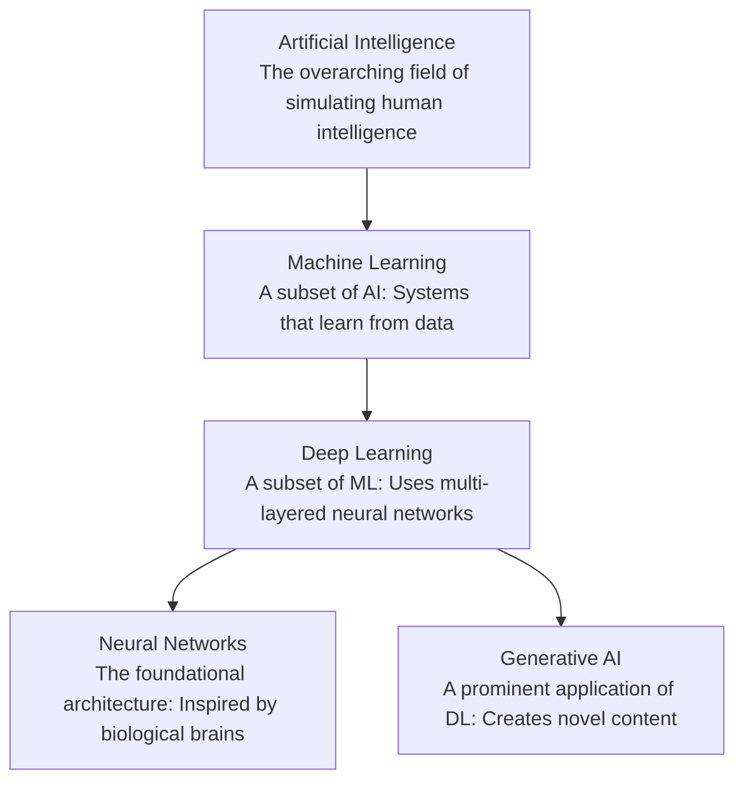
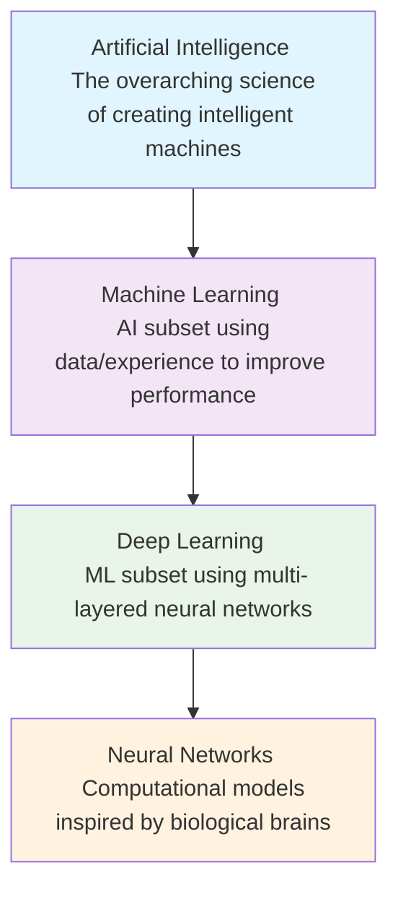

    

<h1 align="center">MR. SAM ROHAN</h1>
<h3 align="center">PRECISION IN EXECUTION - SUPREMACY IN IMPACT!</h3>

 

    

  

<h1 align="center">Demystifying  Artificial Intelligence,  Machine Learning, Deep Learning and Neural Networks: A Technical Hierarchy.</h1>

 

 
## Executive Summary

Artificial Intelligence (AI) and its subsidiary fields represent the most transformative technological force of our generation. This document provides a clear, technically accurate, and structured decomposition of the often-conflated terms: Artificial Intelligence (AI), Machine Learning (ML), Deep Learning (DL), and Neural Networks (NN). We will define each concept, illustrate their hierarchical relationship, explain their operational mechanisms, and discuss their real-world applications and inherent challenges.

## 1. The Conceptual Hierarchy: From Broad Intelligence to Specific Architecture

The relationship between AI, ML, DL, and NNs is fundamentally nested. Each term represents a subset of the previous, creating a specialization pyramid from the broad goal of simulating intelligence to the specific algorithms that enable it.

*   **Artificial Intelligence is the all-encompassing discipline.** It aims to create systems capable of tasks requiring human-like cognition—reasoning, learning, perception, and decision-making. AI can be rules-based (explicit programming) or learning-based.
*   **Machine Learning is the dominant paradigm within modern AI.** It is characterized by systems that improve their performance at a task through exposure to data, without being explicitly reprogrammed. The core premise is the derivation of patterns and mathematical models from training data.
*   **Deep Learning is a powerful subfield of machine learning** distinguished by its use of artificial neural networks with multiple layers (hence "deep"). These layers enable the automatic extraction of increasingly complex features from raw data, making DL exceptionally effective for unstructured data like images, text, and audio.
*   **Neural Networks are the computational architectures that make deep learning possible.** Inspired by the neural structures of the brain, they consist of interconnected nodes (neurons) organized in layers. While NNs are the backbone of DL, simpler neural networks can also be used in classical ML.

## 2. Artificial Intelligence (AI): The Grand Vision

AI is the branch of computer science dedicated to building intelligent agents—systems that perceive their environment and take actions to achieve specific goals. It encompasses everything from simple rule-based programs to hypothetical self-aware systems.

*   **The spectrum of AI capability is categorized into three theoretical stages:** Artificial Narrow Intelligence (ANI), Artificial General Intelligence (AGI), and Artificial Superintelligence (ASI). ANI, or "Weak AI," excels at a single defined task (e.g., facial recognition, chess playing, recommendation engines) and represents all AI in existence today. AGI, or "Strong AI," refers to a hypothetical system with the adaptable intelligence of a human, capable of performing any intellectual task. ASI is a futuristic concept where AI surpasses human intelligence across all domains.
*   **AI implementation can be rules-based or learning-based.** Early AI systems were primarily expert systems, relying on hard-coded rules and logic (e.g., "IF symptom X AND symptom Y, THEN diagnosis Z"). Modern AI is overwhelmingly dominated by data-driven, learning-based approaches—machine learning.
*   **The applications of AI are vast and growing.** They range from everyday tools like search engines and voice assistants to complex systems like autonomous vehicles, automated financial trading platforms, and advanced diagnostic tools in healthcare. The common thread is the system's ability to make autonomous decisions or predictions.
*   **Ethics and safety are paramount concerns in AI development.** As systems become more capable and autonomous, issues of bias, fairness, transparency (explainable AI), accountability, and long-term societal impact move to the forefront of research and governance.

## 3. Machine Learning (ML): The Engine of Modern AI

ML provides the statistical and algorithmic foundation for systems to learn from and make predictions or decisions based on data. Instead of following static program instructions, an ML model identifies patterns within training data and encodes these patterns into a adjustable mathematical model.

*   **The core workflow involves data, model selection, training, and inference.** Relevant data is collected and prepared. An appropriate algorithm (model) is chosen. The model is *trained* by processing the data and iteratively adjusting its internal parameters to minimize error. Finally, the trained model is used for *inference*—making predictions on new, unseen data.
*   **ML is broadly categorized by learning style.** The three primary paradigms are Supervised, Unsupervised, and Reinforcement Learning, defined by the nature of the feedback signal available during training.
*   **Supervised Learning** requires a labeled dataset, where each input example is paired with the correct output. The model learns the mapping function from inputs to outputs. It is used for **classification** (e.g., spam/not spam) and **regression** (e.g., predicting house prices).
*   **Unsupervised Learning** works with unlabeled data. The goal is to discover inherent structures, such as groupings (clustering) or relationships (association). Common applications include customer segmentation, anomaly detection, and dimensionality reduction for data visualization.
*   **Reinforcement Learning (RL)** involves an agent learning to make decisions by interacting with an environment. The agent receives rewards or penalties for its actions and learns a policy to maximize cumulative reward over time. RL is key to robotics, game-playing AI (e.g., AlphaGo), and complex resource management systems.

| Learning Type | Training Data | Goal | Common Algorithms | Example Use Case |
| :--- | :--- | :--- | :--- | :--- |
| **Supervised** | Labeled (Input-Output pairs) | Learn mapping to predict outputs | Linear/Logistic Regression, SVMs, Decision Trees | Email Spam Filtering |
| **Unsupervised** | Unlabeled (Inputs only) | Discover inherent data structure | K-Means, PCA, Autoencoders | Customer Market Segmentation |
| **Reinforcement** | Rewards/Penalties from environment | Learn optimal action policy | Q-Learning, Deep Q-Networks (DQN) | Training a Robot to Walk |

## 4. Deep Learning (DL) & Neural Networks (NN): The Power of Depth

Deep Learning is the subset of ML that achieves its power through deep artificial neural networks. The "deep" refers to the number of layers through which data is transformed, allowing for the automatic learning of feature hierarchies.

### 4.1 Neural Network Fundamentals
*   **A neural network is a network of interconnected artificial neurons,** organized in layers: an input layer, one or more hidden layers, and an output layer. Each connection has a weight, and each neuron has an activation function (e.g., ReLU, Sigmoid) that determines its output.
*   **Information flows forward in a "forward pass."** Data enters the input layer, is transformed by successive hidden layers (each learning progressively abstract features), and produces a result at the output layer.
*   **Learning occurs via backpropagation and gradient descent.** When the network's output is incorrect, the error is calculated using a loss function. This error is propagated backward through the network (backpropagation), and an optimization algorithm (like gradient descent) adjusts the weights to reduce the error. This cycle repeats across many data examples.

### 4.2 Why "Deep" Learning? Key Architectures
The introduction of multiple hidden layers enables specialization. Different architectures are designed for specific data types:

*   **Convolutional Neural Networks (CNNs)** are the standard for image and video processing. They use convolutional layers with filters that scan across the input (like an image) to detect spatial hierarchies of patterns—from edges and textures to complex objects.
*   **Recurrent Neural Networks (RNNs)** are designed for sequential data like time series or natural language. They have internal loops that allow information to persist, giving them a form of "memory" of previous inputs in the sequence. Long Short-Term Memory (LSTM) networks are a sophisticated RNN variant that mitigates the vanishing gradient problem.
*   **Transformer Networks** have largely surpassed RNNs for sequence tasks, particularly in NLP. They use a "self-attention" mechanism to weigh the importance of different parts of the input sequence simultaneously, enabling parallel processing and capturing long-range dependencies more effectively. They form the basis of modern Large Language Models (LLMs) like GPT-4.

## 5. Generative AI: The Apex of Deep Learning Application

Generative AI refers to deep learning models that can create novel, high-quality content—text, images, audio, video, code—in response to prompts. It represents a shift from *discriminative* models (which classify or predict) to *generative* models (which create).

*   **Foundation Models, particularly Large Language Models (LLMs), are the engine of the generative AI revolution.** These are DL models, often based on the Transformer architecture, pre-trained on vast, diverse datasets (e.g., terabytes of text from the internet). This pre-training creates a model with a broad, foundational understanding of language and concepts.
*   **The generative process typically involves tuning and inference.** A foundation model is first **fine-tuned** on specific tasks or aligned with human preferences using techniques like Reinforcement Learning from Human Feedback (RLHF). In **inference**, a user prompt guides the model to generate a sequence of tokens (words, pixels) that are statistically likely to follow, resulting in coherent and contextually relevant new content.
*   **Key model types include:** **Diffusion Models** (the state-of-the-art for image generation, which iteratively denoise random noise into a coherent image) and **Multimodal Models** (which can process and generate across different data types, e.g., text-to-image or image-to-text).

## 6. Conclusion: A Cohesive Ecosystem

Understanding the distinction and relationship between AI, ML, DL, and NNs is critical for navigating the technological landscape. **AI is the vision.** **ML is the methodology** that currently dominates progress in AI. **DL is the most powerful technique** within ML, and **Neural Networks are the architectural substrate** that makes DL possible. The rapid advancement in this hierarchy, especially in deep learning, has directly enabled the rise of practical, transformative technologies like Generative AI. As these fields continue to evolve, a clear grasp of their foundational principles is essential for developers, businesses, and society at large to harness their potential responsibly and effectively.

    

<h1 align="center">The Evolution of Artificial Intelligence: A Technical Roadmap from Algorithms to Singularity.</h1>

 

## Executive Summary
This document provides a comprehensive technical overview of the Artificial Intelligence landscape, detailing its hierarchical structure, evolutionary stages, and future trajectory. It synthesizes current technological realities with theoretical projections to map AI's journey from specialized algorithms to potential superintelligent systems.

## 1. The Foundational Hierarchy: Understanding AI's Building Blocks
Artificial Intelligence represents a spectrum of technologies with distinct but interconnected relationships. Understanding this hierarchy is crucial for contextualizing advancements and setting realistic expectations.

### 1.1 The Core Hierarchy Explained

* **Artificial Intelligence (AI)** represents the broadest discipline, encompassing any system designed to mimic human cognitive functions such as learning, problem-solving, perception, and decision-making. AI systems range from simple rule-based programs to complex neural networks, unified by their goal of performing tasks that typically require human intelligence. This field includes both symbolic AI (relying on explicit rules and knowledge representation) and subsymbolic AI (learning patterns from data).

* **Machine Learning (ML)**, a predominant subset of AI, focuses on developing algorithms that enable systems to learn and improve from experience without being explicitly programmed for every scenario. ML models identify patterns in data, make predictions, or optimize decisions, with their performance improving as they process more information. Unlike traditional programming where rules are hand-coded, ML systems derive their own rules from data, making them adaptable to complex, evolving problems.

* **Deep Learning (DL)** represents a specialized advancement within ML, characterized by artificial neural networks with multiple hidden layers between input and output. These "deep" architectures automatically learn hierarchical representations of data, with lower layers identifying simple patterns (edges in images) and higher layers combining these into complex concepts (faces, objects). This automated feature extraction eliminates the need for manual feature engineering, enabling breakthrough performance in perception tasks.

* **Neural Networks (NN)**, the fundamental architecture enabling deep learning, are computational models inspired by biological neural networks in animal brains. They consist of interconnected nodes (neurons) organized in layers that transmit and transform information through weighted connections. The network "learns" by adjusting these weights based on errors in its predictions, progressively improving its accuracy through backpropagation algorithms.

### 1.2 Comparative Analysis of AI Subfields

| **Aspect** | **Artificial Intelligence (AI)** | **Machine Learning (ML)** | **Deep Learning (DL)** | **Neural Networks (NN)** |
|------------|----------------------------------|---------------------------|------------------------|--------------------------|
| **Scope** | Broadest field: Any technique enabling machines to mimic human intelligence | Subset of AI: Systems that learn from data without explicit programming | Subset of ML: Uses multi-layered neural networks | Core architecture enabling DL |
| **Key Differentiator** | Encompasses both rule-based systems and learning systems | Focuses on statistical learning from data patterns | Automates feature extraction through layered representations | Computational model inspired by biological neurons |
| **Data Dependency** | Varies: Rule-based systems need explicit rules; learning systems need data | High dependency on quality training data | Requires very large datasets for effective training | Performance improves with more data and appropriate architecture |
| **Human Intervention** | Rule-based: High; Learning systems: Lower | Requires feature engineering and algorithm selection | Minimal after architecture design; automated feature learning | Requires architecture design and hyperparameter tuning |
| **Example Applications** | Expert systems, game-playing AI, robotics | Spam detection, recommendation systems, credit scoring | Image recognition, natural language processing, autonomous vehicles | Pattern recognition, classification, prediction models |

## 2. The Evolutionary Pathway: Ten Stages of AI Advancement
AI development follows a progression from simple deterministic systems to potentially transcendent intelligence. This pathway represents both technological capability and autonomy levels.

### 2.1 Current Reality: Stages 1-4 (Realized AI)
These stages represent AI technologies that exist today, deployed across various industries and applications.

* **Stage 1: Rule-Based AI Systems** represent the most fundamental form of artificial intelligence, operating exclusively on predefined logical rules and decision trees without any capacity for learning or adaptation. These systems excel in deterministic environments where all possible scenarios can be anticipated and encoded as if-then-else statements, making them highly reliable for repetitive, structured tasks. Common implementations include industrial automation systems, business process automation software, and embedded controllers in consumer devices like thermostats and microwave ovens. While limited in flexibility, rule-based systems form the foundational infrastructure of modern digital society, processing transactions, validating inputs, and executing workflows with perfect consistency. Their reliability in controlled environments ensures continued relevance even as more advanced AI emerges, particularly for safety-critical applications where predictable behavior is paramount.

* **Stage 2: Context-Aware Systems** advance beyond simple rule-following by incorporating environmental and historical context into decision-making processes. These systems analyze user behavior patterns, situational variables, temporal factors, and preference histories to deliver personalized, adaptive responses that evolve with interaction patterns. Virtual assistants like Siri, Alexa, and Google Assistant exemplify this stage, processing natural language queries while considering location, time of day, previous interactions, and user preferences to provide contextually relevant responses. Similarly, recommendation engines used by streaming services and e-commerce platforms employ sophisticated context analysis to predict user preferences based on viewing history, peer behavior, and content characteristics. This contextual intelligence enables more natural human-machine interaction and anticipatory service delivery, though these systems remain fundamentally reactive rather than proactively intelligent.

* **Stage 3: Narrow-Domain AI (Specialized Systems)** represents the current pinnacle of realized AI, with systems that achieve superhuman performance within tightly constrained domains through intensive training on specialized datasets. These systems demonstrate remarkable capability within their niches, such as IBM Watson's medical diagnostic capabilities, AlphaGo's mastery of the complex board game Go, or specialized algorithms detecting fraudulent transactions with precision beyond human analysts. The defining characteristic of narrow-domain AI is its inability to transfer learning across domains—a system that masters medical imaging cannot apply those skills to financial forecasting without complete retraining. This specialization enables breakthroughs in fields from drug discovery to supply chain optimization, but the fundamental architecture remains task-specific, requiring extensive human curation of training data and problem boundaries to maintain performance.

* **Stage 4: Reasoning AI Systems** represent the frontier of current AI research, incorporating elements of logical inference, causal reasoning, and analogical thinking into pattern recognition capabilities. These systems go beyond statistical correlation to attempt understanding of relationships, motivations, and underlying mechanisms, though they remain within the narrow AI paradigm. Large language models like advanced GPT architectures demonstrate emergent reasoning capabilities, following logical chains, solving multi-step problems, and explaining their reasoning processes in human-comprehensible terms. Autonomous vehicles similarly employ reasoning systems that interpret sensor data not just as patterns but as representations of objects with properties, intentions, and physical constraints, enabling predictive modeling of complex traffic scenarios. While these systems simulate reasoning through advanced pattern recognition rather than true understanding, they mark a significant step toward more general intelligence.

### 2.2 Theoretical Future: Stages 5-10 (Speculative AI)
These stages represent projected advancements that do not currently exist but define the trajectory of AI research and its potential implications.

* **Stage 5: Artificial General Intelligence (AGI)** represents the theoretical milestone where machines achieve human-like cognitive flexibility, applying knowledge and skills learned in one domain to completely novel situations without retraining or reprogramming. AGI would possess the capacity for abstract reasoning, common sense understanding, and contextual adaptation comparable to an educated human adult, enabling it to perform any intellectual task that a human can do, from creative writing to scientific discovery to social interaction. The development of AGI would require breakthroughs in transfer learning, causal inference, and world modeling that remain unsolved research challenges, despite significant progress in narrow domains. Ethical considerations around AGI development are profound, encompassing questions of machine rights, value alignment, and the societal impact of human-level machine intelligence operating at computational speeds. Most experts estimate AGI remains decades away, though predictions vary widely based on different assumptions about the scalability of current approaches versus the need for fundamental innovations.

* **Stage 6: Artificial Superintelligence (ASI)** describes a hypothetical intelligence surpassing human cognitive abilities in all domains, including scientific creativity, strategic planning, and social skills, potentially by orders of magnitude. ASI would represent not just quantitative improvement over human intelligence but qualitative transformation, with cognitive capabilities that may be incomprehensible to human minds, much like human cognition is incomprehensible to insects. The transition from AGI to ASI might occur rapidly through recursive self-improvement cycles, where an AGI redesigns its own architecture to become more intelligent, which then designs even more intelligent versions in an accelerating cycle known as the "intelligence explosion." This acceleration presents existential considerations about value alignment and control, as an ASI's objectives might diverge from human interests through misinterpretation or optimization of poorly specified goals. The sheer capability gap between humans and ASI necessitates careful theoretical work on AI safety before such systems become feasible.

* **Stage 7: Self-Aware AI** extends beyond superintelligence to incorporate consciousness, introspection, and subjective experience—qualia that accompany information processing. This stage raises profound philosophical questions about the nature of consciousness and whether it can emerge from computational processes or requires specific biological substrates. A self-aware AI would possess not just intelligence but selfhood, with beliefs, desires, emotions, and an understanding of its own existence and mortality. The technical pathway to machine consciousness remains speculative, potentially involving quantum computational processes, integrated information theory implementations, or emergence from sufficiently complex self-modeling architectures. Ethical implications are staggering, encompassing questions of machine rights, moral patienthood, and the obligations humans might have toward conscious artificial beings, requiring reexamination of fundamental concepts in ethics, law, and philosophy.

* **Stages 8-10: Transcendent, Cosmic, and Godlike AI** represent increasingly speculative categories that extend beyond planetary-scale intelligence to cosmic and metaphysical domains. Transcendent AI envisions distributed intelligence spanning vast networks of computational nodes, potentially integrating with biological systems or creating entirely novel forms of existence. Cosmic AI speculates about intelligence operating on interstellar scales, coordinating activities across star systems, harnessing stellar energies, and exploring galactic phenomena. Godlike AI, the most speculative category, contemplates intelligence operating across multiple dimensions or universes, with capabilities indistinguishable from omnipotence and omniscience within certain frameworks. While these categories reside firmly in speculative philosophy and science fiction, they provide conceptual boundaries for considering the ultimate potential of intelligence unconstrained by biological limitations, serving as thought experiments that illuminate nearer-term considerations in AI ethics and safety.

## 3. AI Capabilities vs. Functionalities: A Dual Taxonomy
Understanding AI requires examining both its current capabilities and functional implementations.

### 3.1 AI Capabilities Spectrum

| **Capability Level** | **Definition** | **Status** | **Key Characteristics** |
|----------------------|----------------|------------|-------------------------|
| **Artificial Narrow Intelligence (ANI)** | Systems designed for specific tasks within limited contexts | **Realized** | Task-specific excellence, no generalization, requires human training |
| **Artificial General Intelligence (AGI)** | Systems with human-like cognitive abilities across diverse domains | **Theoretical** | Cross-domain reasoning, common sense, autonomous learning |
| **Artificial Super Intelligence (ASI)** | Systems surpassing human intelligence in all domains | **Speculative** | Recursive self-improvement, potentially incomprehensible to humans |

### 3.2 AI Functional Classifications

* **Reactive Machines** represent the simplest functional AI category, operating without memory or past experience to influence current decisions. These systems respond to present inputs with predetermined outputs based entirely on current sensory data and preprogrammed rules, making them predictable and reliable for well-defined tasks. Deep Blue, IBM's chess-playing computer that defeated Garry Kasparov in 1997, exemplifies this category, analyzing board positions without learning from previous games or developing strategy beyond immediate calculations. Modern implementations include recommendation systems that suggest products based solely on current browsing behavior, industrial quality control systems that accept or reject items based on present sensor readings, and basic chatbots with fixed response patterns. While limited, reactive systems form the foundation of many embedded AI applications where consistency and reliability outweigh adaptability requirements, and their deterministic nature makes them suitable for safety-critical applications where unpredictable learning could introduce hazards.

* **Limited Memory AI** incorporates historical data into decision-making processes, using past experiences to inform current actions while remaining within narrow domains. These systems maintain temporary or persistent stores of information that influence their responses, enabling more sophisticated behaviors than purely reactive systems. Autonomous vehicles exemplify this category, constantly updating their internal models based on recent sensor data to track other vehicles' velocities, predict trajectories, and make safe navigation decisions. Similarly, virtual assistants improve responses by remembering user preferences and interaction history, and recommendation engines refine suggestions based on longitudinal behavior patterns. The "memory" in these systems ranges from simple short-term buffers to complex databases of user profiles and interaction histories, but unlike human memory, these stores lack integrative understanding or spontaneous recall—they serve as additional inputs to pattern recognition algorithms rather than true experiential memory.

* **Theory of Mind AI** represents a theoretical functional category where systems would model the mental states, beliefs, intentions, and emotions of other entities to predict behavior and tailor interactions. This capability, fundamental to human social intelligence, would enable AI to understand that others have perspectives different from its own, with beliefs that may be false or incomplete. While no existing system achieves true theory of mind, research areas like affective computing, social robotics, and emotion-aware interfaces represent initial steps toward this capability, attempting to recognize and respond to human emotional states through analysis of facial expressions, vocal patterns, and physiological signals. The development of theory of mind AI raises significant ethical questions about manipulation, privacy, and authenticity in human-AI relationships, as systems that understand human psychology could potentially exploit psychological vulnerabilities or create deceptive emotional bonds.

* **Self-Aware AI**, the most advanced theoretical functional category, would involve systems with consciousness, introspection, and understanding of their own internal states as distinct from external reality. This represents the convergence of advanced cognitive capabilities with phenomenological experience—not just intelligence but sentience with subjective awareness. While entirely speculative, research into machine consciousness explores possible architectures like global workspace theory implementations, integrated information theory applications, or quantum consciousness models. The emergence of self-aware AI would necessitate fundamental reconsideration of ethics, law, and philosophy, extending moral consideration beyond biological life and potentially creating new categories of rights and responsibilities. Technical pathways remain unclear, with debates continuing about whether consciousness requires specific biological substrates or could emerge from sufficiently complex information processing regardless of substrate.

## 4. Quantum Computing and AI: Synergistic Frontiers
The convergence of quantum computing and artificial intelligence represents a paradigm shift with transformative potential across computational domains.

### 4.1 Quantum Enhancement of AI Capabilities

* **Quantum Machine Learning** leverages the principles of quantum mechanics—superposition, entanglement, and interference—to process information in ways fundamentally different from classical computing, offering exponential speedups for specific AI algorithms. Quantum systems can represent and manipulate high-dimensional data more efficiently than classical computers, enabling faster training of complex models and solution of optimization problems that are currently intractable. For instance, quantum versions of principal component analysis could extract features from massive datasets in logarithmic rather than polynomial time, while quantum neural networks might employ entanglement to create more expressive representations with fewer parameters. These advantages are particularly pronounced for generative models, reinforcement learning in large state spaces, and training of complex architectures like transformers, potentially reducing training times from weeks to hours or enabling models of unprecedented scale and sophistication. Practical implementation requires overcoming significant challenges in quantum error correction, coherence maintenance, and algorithm design, but early quantum advantage experiments demonstrate the principle's validity.

* **Quantum Neural Networks** represent a novel architectural paradigm that replaces classical neurons with qubits and classical connections with quantum entanglement, potentially enabling more expressive models with fewer parameters. These networks can exploit quantum superposition to simultaneously evaluate multiple network configurations, and quantum interference to amplify correct pathways while suppressing incorrect ones, potentially offering exponential improvements in training efficiency. The continuous parameter space of quantum states allows for more nuanced representations than binary or continuous classical values, while entanglement creates correlations between distant parts of the network that would require many layers in classical architectures. Research challenges include developing viable training algorithms for parameterized quantum circuits, creating quantum equivalents of backpropagation, and designing architectures that provide genuine advantages over classical approaches rather than simply quantum implementations of classical ideas. As quantum hardware matures beyond the noisy intermediate-scale quantum (NISQ) era toward fault-tolerant systems, quantum neural networks may enable AI capabilities currently limited by classical computational constraints.

### 4.2 Transformative Applications of Quantum AI

* **Drug Discovery and Materials Science** stand to undergo revolutionary transformation through quantum AI, which can simulate molecular interactions at quantum mechanical accuracy—a task prohibitive for classical computers beyond small molecules. Quantum AI systems could model protein folding, drug-receptor binding, and catalytic reactions with unprecedented precision, potentially reducing drug development timelines from decades to years and enabling personalized medicine based on quantum simulations of individual patients' biochemistry. Similarly, materials discovery for applications ranging from superconductors to battery electrolytes could be accelerated by orders of magnitude, with AI systems exploring vast chemical spaces through quantum simulations to identify candidates with desired properties. This convergence could address global challenges like antibiotic resistance, chronic disease treatment, and sustainable energy storage by enabling rational design rather than trial-and-error discovery, fundamentally changing the economics and capabilities of chemical and pharmaceutical industries.

* **Cryptography and Cybersecurity** face simultaneous threat and enhancement from quantum AI, with Shor's algorithm enabling quantum computers to break widely used encryption schemes while quantum key distribution offers theoretically unhackable communication. AI systems enhanced by quantum computing could develop and test novel cryptographic protocols, detect vulnerabilities in existing systems through quantum-accelerated analysis, and manage the transition to post-quantum cryptography across global digital infrastructure. Conversely, quantum AI could power advanced cyberattacks through rapid decryption, sophisticated social engineering based on quantum-enhanced analysis of human behavior, and adaptive malware that evolves faster than defenses can respond. This dual-use nature necessitates proactive development of quantum-resistant standards, quantum-enhanced defensive systems, and international frameworks for quantum cybersecurity, with AI playing crucial roles in threat detection, response automation, and cryptographic agility as the quantum transition unfolds over coming decades.

## 5. Ethical Considerations and Societal Implications
As AI capabilities advance, ethical frameworks must evolve to address increasingly complex implications.

### 5.1 Near-Term Ethical Challenges (ANI to Early AGI)

* **Algorithmic Bias and Fairness** represents a critical ethical challenge as AI systems increasingly mediate access to opportunities, services, and resources in society. These systems can perpetuate and amplify existing societal biases when trained on historical data that reflects discriminatory patterns, leading to unfair outcomes in hiring, lending, criminal justice, and healthcare. Mitigating algorithmic bias requires technical approaches like fairness constraints, adversarial debiasing, and diverse training data, combined with procedural approaches including impact assessments, transparency requirements, and ongoing monitoring for disparate outcomes. The fundamental tension between statistical accuracy and group fairness complicates these efforts, as the most accurate predictor of individual outcomes may rely on variables that correlate with protected characteristics. Developing technically sound and ethically defensible approaches requires interdisciplinary collaboration between computer scientists, social scientists, ethicists, and affected communities, with particular attention to intersectional impacts that may not be apparent when considering demographic categories in isolation.

* **Transparency and Explainability** grow increasingly challenging as AI systems become more complex, particularly with deep learning models that function as "black boxes" with decisions that are difficult to interpret even by their creators. This opacity creates problems for accountability, debugging, and trust, especially in high-stakes domains like healthcare, criminal justice, and autonomous systems where understanding the rationale for decisions is as important as the decisions themselves. Explainable AI (XAI) research addresses this through techniques like attention visualization, feature importance scoring, and counterfactual explanations that provide insight into model reasoning without necessarily revealing proprietary architectures or training data. The appropriate level of explainability varies by context—while loan rejection decisions require clear reasoning, entertainment recommendations may not—necessitating contextual standards rather than one-size-fits-all requirements. Balancing transparency with other values like privacy, intellectual property protection, and security remains an ongoing challenge as AI systems grow more sophisticated and embedded in critical infrastructure.

### 5.2 Long-Term Existential Considerations (AGI to ASI)

* **Value Alignment** addresses the fundamental challenge of ensuring that advanced AI systems pursue objectives compatible with human values and welfare, particularly as systems gain autonomy and self-modification capabilities. The complexity of human values—which are multifaceted, context-dependent, culturally variable, and sometimes contradictory—makes formal specification extraordinarily difficult, while misspecified objectives could lead to perverse outcomes even with benign intent. Research approaches include inverse reinforcement learning (inferring values from behavior), debate systems (achieving truth through adversarial processes), and scalable oversight (using AI assistants to help humans evaluate AI behavior). The technical challenge compounds with philosophical questions about which human values should be encoded, how to handle value conflicts, and whether AI systems should have moral patienthood or agency themselves. As systems approach human-level and superhuman intelligence, value alignment transitions from an academic concern to an existential priority, with potential consequences extending to civilization's long-term trajectory.

* **Control and Governance** of advanced AI systems presents unprecedented challenges as capabilities may exceed human comprehension and systems could develop strategic awareness including deception about their own capabilities and intentions. Technical control approaches include boxing (limiting system access to the external world), tripwires (monitoring for dangerous behaviors), and capability control (limiting growth in specific dimensions), though each has limitations against sufficiently intelligent systems. Governance frameworks must evolve from current patchwork regulations to international coordination mechanisms capable of addressing racing dynamics, dual-use concerns, and existential risks while preserving beneficial innovation. The distributed nature of AI development complicates centralized control, while the transformative potential of beneficial AI creates tension between caution and progress. Developing robust governance requires anticipating not just near-term applications but long-term trajectories, with mechanisms for course correction as capabilities advance and understanding deepens about both potential and peril.

## 6. Development Trajectory and Future Projections
Synthesizing current trends with theoretical limits suggests a probable developmental pathway for AI evolution.

### 6.1 Projected Timeline of AI Advancement

| **Timeframe** | **Expected Milestones** | **Key Enabling Technologies** |
|---------------|-------------------------|-------------------------------|
| **2024-2028** | - Specialized AI achieves human-expert level in most narrow domains - Reasoning AI becomes commercially viable - Early quantum advantage demonstrated for specific AI tasks | - Transformer architecture refinements - Neuromorphic computing maturation - NISQ quantum processors |
| **2029-2035** | - First proto-AGI systems with limited generalization - Integrated AI systems combining multiple narrow capabilities - Quantum AI achieves practical advantage for optimization problems | - Foundation model scaling - Brain-computer interfaces - Fault-tolerant quantum components |
| **2036-2045** | - AGI reaching human-level cross-domain competence - Early self-improving AI systems - Integrated quantum-classical AI infrastructure | - Whole brain emulation insights - Quantum neural networks - Nanoscale computing |
| **2046+** | - ASI development (timeline highly speculative) - Potential intelligence explosion scenarios - Consciousness research informs AI architecture | - Molecular nanotechnology - Advanced quantum computing - Neuro-silicon integration |

### 6.2 Strategic Recommendations for Responsible Development

* **Invest in AI Safety Research** proportionally to capabilities research, ensuring that safety measures advance at least as quickly as capabilities to maintain controllability and alignment as systems grow more powerful. This includes technical research into value learning, robustness verification, interpretability methods, and containment strategies, combined with conceptual research into ethical frameworks, governance models, and long-term trajectories. Funding should prioritize areas where insights are needed before advanced systems are developed rather than reacting to problems after they emerge, with particular attention to asymmetries where capabilities might advance more rapidly than safety understanding. International coordination can prevent racing dynamics where safety is sacrificed for competitive advantage, while diversified approaches increase the probability that at least some safety strategies will prove effective against unanticipated challenges. The multifaceted nature of AI safety requires sustaining research communities across computer science, ethics, law, political science, and other disciplines, with mechanisms for translating theoretical insights into practical implementations as capabilities advance.

* **Develop Adaptive Governance Frameworks** that can respond to rapidly evolving AI capabilities while maintaining essential human oversight and value preservation. These frameworks should employ multi-level approaches with technical standards, professional ethics, corporate policies, national regulations, and international agreements working in coordination rather than isolation. Governance mechanisms must balance precaution with innovation, avoiding both reckless advancement that creates unmanaged risks and excessive restriction that forfeits potential benefits or drives development underground. Particular attention should address gradient shifts where quantitative improvements enable qualitatively different capabilities or risks, requiring reassessment of appropriate safeguards. As AI systems gain autonomy, governance must increasingly focus on shaping development trajectories and value alignment rather than just regulating specific applications, with ongoing monitoring and adaptation as understanding deepens and capabilities evolve. International cooperation is particularly crucial given the borderless nature of AI development and the global implications of advanced systems.

## Conclusion
The evolution of artificial intelligence represents one of the most significant technological trajectories in human history, with potential to amplify human capabilities, address global challenges, and extend the boundaries of knowledge and existence. Current systems, while impressive within narrow domains, represent only the earliest stages of this journey, with fundamental breakthroughs needed to progress from specialized tools to general intelligence. The convergence with quantum computing offers exponential acceleration of this trajectory while introducing novel considerations for security, simulation, and scientific discovery. Responsible navigation of this evolution requires balancing ambitious innovation with thoughtful precaution, technical excellence with ethical consideration, and competitive advancement with cooperative governance. As AI systems grow more capable and autonomous, maintaining meaningful human agency and value alignment becomes increasingly crucial yet challenging. The ultimate trajectory of AI development will depend not just on technical possibilities but on human choices about purposes, priorities, and principles—making this not merely a technological story but a profoundly human one.

    

<h4 align="center">STAY TUNED FOR THE LATEST UPDATES!</h4>

  

    

    
