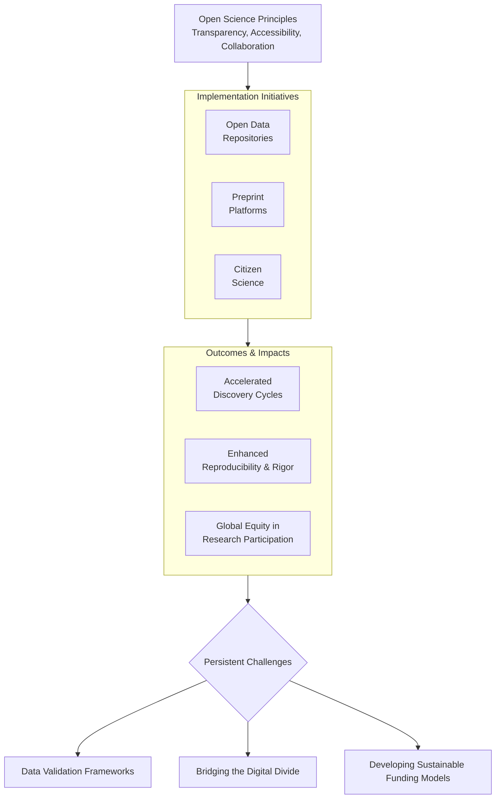
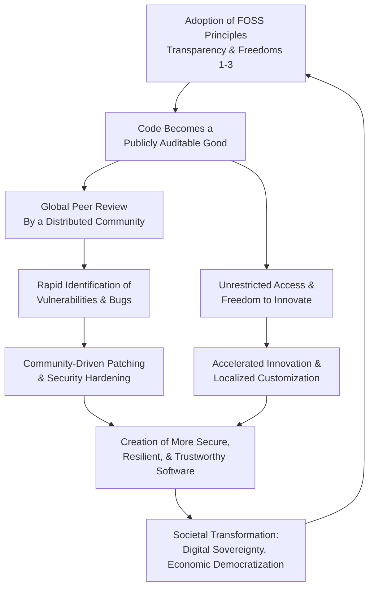

<br><br><br><br>

<h3 align="center">WELCOME TO</h3>
<h1 align="center">BLACXQUAD SECURITY INTERNATIONAL</h1>
<h3 align="center">GUARDIANS OF THE DIGITAL COMMONS!</h3>


<br>

<p align="center">
    <a href="https://github.com/mrsamrohan">
        
    </a>
</p>


```
┌──────────────────────────────────────────────────────────────────────────────┐
│                   • BXDSI AUTHORIZED PERSONNEL IDENTITY •                    │
├──────────────────────────────────────────────────────────────────────────────┤
│                                                                              │
│  **NAME**:  Sam Rohan                                                        │
│  **TITLE**: Founder & Principal Architect                                    │
│  **ENTITY**: BLACXQUAD SECURITY INTERNATIONAL (BQSI)                         │
│  **DOMAIN**: Cyber-Physical Defense Engineering | AI-Augmented Security Ops  │
│                                                                              │
│  ━━━━━━━━━━━━━━━━━━━━━━━━━━━━━━━━━━━━━━━━━━━━━━━━━━━━━━━━━━━━━━━━━━━━━━━━━   │
│                                                                              │
│  **COMMAND CENTER**: India | **DEPLOYMENTS**: Active Globally                │
│                                                                              │
│                                                                              │
└──────────────────────────────────────────────────────────────────────────────┘
```

<br><br>

> -----
>
> 
>
>
> ### BLACXQUAD IS A VANGUARD SCIENTIFIC RESEARCH AND ADVANCED ENGINEERING CONSORTIUM DEDICATED TO DEFINING THE NEXT FRONTIER OF CYBERSECURITY IN THE POST A.I ERA. FOUNDED ON AUGUST 15, 2025 — INDIA'S 79TH INDEPENDENCE DAY, AS A TRIBUTE TO TECHNOLOGICAL SOVEREIGNTY AND GLOBAL PROGRESS — OUR  CONSORTIUM EMBODIES A POTENT SYNTHESIS OF CUTTING-EDGE RESEARCH, COLLABORATIVE ENGINEERING, AND UNWAVERING ETHICAL COMMITMENT. 
>
> ### WE FUNCTION AS A GLOBAL NEXUS, UNITING CYBERSECURITY PROFESSIONALS, RESEARCHERS, ENGINEERS, AND POLICY ARCHITECTS IN A MISSION TO ADVANCE FRONTIER SECURITY TECHNOLOGIES.
>
> ### OUR VISION IS TO CULTIVATE A PLANETARY COLLECTIVE INTELLIGENCE, TRANSCENDING GEOGRAPHICAL CONSTRAINTS THROUGH A DECENTRALIZED DIGITAL ECOSYSTEM. THIS MODEL FOSTERS AGILE PROBLEM-SOLVING AND CO-CREATION, SPECIFICALLY TARGETING HUMANITY'S MOST PRESSING DIGITAL SECURITY CHALLENGES. 
>
> ### BLACXQUAD'S OPERATIONAL PILLARS ARE BUILT UPON AN OPEN-SOURCE PHILOSOPHY, DEMOCRATIC KNOWLEDGE ACCESS, AND ETHICAL RESPONSIBILITY, WHICH UNIQUELY POSITION US AT THE FOREFRONT OF RESHAPING CYBERSECURITY RESEARCH AND PRACTICE.
>
> ### WE LEVERAGE A DIVERSE ARRAY OF CUTTING-EDGE DISCIPLINES — INCLUDING AI-POWERED THREAT NEUTRALIZATION, QUANTUM-RESISTANT CRYPTOGRAPHIC INFRASTRUCTURE, ZERO-TRUST ARCHITECTURE, DEVSECOPS, AND MECHATRONICS—TO DEVELOP PRACTICAL, SUSTAINABLE SOLUTIONS FOR BOTH CONTEMPORARY AND FUTURE GLOBAL NEEDS.
>
> ### MORE THAN A RESEARCH HUB, BLACXQUAD IS A DYNAMIC FUSION OF INNOVATION AND COLLABORATION. WE PROVIDE A UNIFIED PLATFORM AND A NETWORK OF VIRTUAL LABS THAT OFFER HANDS-ON, IMMERSIVE EXPERIENCES, EMPOWERING A GLOBAL COMMUNITY OF TECHNOLOGY ENTHUSIASTS, RESEARCHERS, AND ENTREPRENEURS. BY CHAMPIONING FREEDOM, INNOVATION, AND PROGRESS, WE EQUIP INDIVIDUALS, STARTUPS, AND INSTITUTIONS WITH THE RESOURCES, TOOLS, AND PROFESSIONAL NETWORKS NECESSARY TO ACCELERATE MEANINGFUL DIGITAL TRANSFORMATION.
>
> ### BLACXQUAD IS COMMITTED TO ENSURING TECHNOLOGY REMAINS A UNIVERSAL FORCE FOR EMPOWERMENT, SECURITY, AND PROSPERITY, TRANSFORMING BOLD IDEAS INTO GROUNDBREAKING REALITIES THAT SECURE OUR COLLECTIVE DIGITAL FUTURE.
>
>
>  
>
> ---

<br><br><br><br>

<h1 align="center">OPERATIONAL DOCTRINES FOR THE GUARDIANS OF DIGITAL COMMONS.</h1>

<br><br>
 

**Preamble:** The digital commons – encompassing critical open-source software (FOSS), public data infrastructures, and shared knowledge platforms – underpins global society. Its security and resilience demand more than technical proficiency; they require a dedicated cadre of professionals operating under a unified ethical and operational framework. These doctrines define the principles and practices for Guardians committed to protecting this vital ecosystem, synthesizing core tenets of FOSS philosophy, ethical cybersecurity imperatives, and effective leadership.

**Core Doctrines:**

1.  **Stewardship Rooted in FOSS Principles:**
    *   **Principle:** Recognize FOSS not merely as software, but as essential, transparent public infrastructure requiring vigilant protection. Its openness enables scrutiny and collaboration but introduces unique supply chain and sustainability challenges.
    *   **Operational Mandate:**
        *   **Proactive Contribution:** Actively contribute security expertise to critical FOSS projects (e.g., code audits, vulnerability patching, documentation) within organizational capacity and mission alignment. Prioritize projects foundational to the digital commons.
        *   **Transparency-Informed Defense:** Leverage the inherent transparency of FOSS for continuous security assessment. Advocate for and utilize Software Bill of Materials (SBOM) generation and consumption to manage dependencies and vulnerabilities effectively.
        *   **Sustainable Support:** Champion and participate in sustainable funding models (e.g., corporate sponsorship via OpenSSF, Tidelift subscriptions, foundation grants) for critical FOSS security maintenance. Recognize that uncompensated volunteerism is an unsustainable security foundation.

2.  **Ethical Imperative of Universal Protection:**
    *   **Principle:** Cybersecurity is a human endeavor. The duty to protect extends universally across the digital commons, irrespective of victim resources, perceived negligence, or attacker motive. Compassion and action supersede judgment.
    *   **Operational Mandate:**
        *   **Non-Discriminatory Response:** Provide security guidance, vulnerability disclosure, and incident response support based on need and impact on the commons, not solely on commercial viability or victim profile (e.g., supporting under-resourced public interest technologists, NGOs, small municipalities).
        *   **Responsible Remediation:** Move beyond identification to responsible remediation. When discovering critical vulnerabilities in widely used FOSS, collaborate with maintainers on patches, provide clear mitigations, and support deployment where feasible and appropriate. Contribute fixes upstream.
        *   **Empowerment over Blame:** Address user and organizational security shortcomings through education, accessible guidance, and tooling simplification. Focus on enabling secure practices (e.g., streamlined MFA rollout guides, secure configuration templates for common FOSS) rather than attributing fault.

3.  **Collaborative Defense of Shared Infrastructure:**
    *   **Principle:** The interconnected nature of the digital commons necessitates collective defense. Siloed security efforts are insufficient against systemic threats targeting shared FOSS components and protocols.
    *   **Operational Mandate:**
        *   **Intelligence Sharing:** Actively participate in trusted threat intelligence sharing communities (e.g., OASIS OpenC2, industry ISACs with FOSS focus) specific to the FOSS ecosystem. Contribute anonymized indicators and tactics, techniques, and procedures (TTPs) related to FOSS exploitation.
        *   **Coordinated Vulnerability Disclosure (CVD):** Adhere rigorously to established CVD protocols (e.g., CISA's guidelines) for FOSS vulnerabilities. Facilitate communication between finders, maintainers, and downstream users. Utilize platforms like the CVE Program effectively.
        *   **Community Incident Response:** Develop plans and establish relationships for cross-organizational collaboration during widespread incidents affecting critical FOSS infrastructure (e.g., Log4j-equivalent events). Practice joint response scenarios.

4.  **Leadership for Resilience and Sustainability:**
    *   **Principle:** Effective Guardianship requires leadership focused on long-term resilience, ethical integrity, and the health of the FOSS ecosystem, balancing security needs with open-source values.
    *   **Operational Mandate:**
        *   **Advocate Ethical Commercialization:** Support sustainable business models around FOSS that respect core freedoms (e.g., open-core, support subscriptions, managed services) while actively opposing practices that undermine the commons (e.g., predatory licensing changes, deliberate incompatibilities). Enforce clear ethical guidelines for vendor engagements.
        *   **Foster Inclusive Communities:** Champion diversity, equity, and inclusion within security teams and the broader FOSS security community. Implement and enforce Codes of Conduct. Mitigate toxic dynamics that deter contribution and erode trust. Mentor emerging talent from diverse backgrounds.
        *   **Invest in Foundational Security:** Allocate resources to secure the underpinnings: fund audits of critical libraries, support development of memory-safe alternatives, contribute to hardened FOSS security tools (e.g., OpenSSF Scorecard, Sigstore), and advocate for security-focused engineering practices within FOSS projects.
        *   **Manage Technical Debt & Compliance:** Proactively address FOSS security technical debt through systematic inventory (SBOM), continuous monitoring, and prioritized patching. Implement robust FOSS license compliance processes to avoid legal risks that jeopardize project viability, utilizing tools like SPDX and FOSSology.

5.  **Vigilance Through Continuous Adaptation:**
    *   **Principle:** Threat landscapes targeting the digital commons evolve rapidly. Guardians must prioritize continuous learning, adaptability, and the integration of emerging best practices.
    *   **Operational Mandate:**
        *   **Emerging Threat Focus:** Dedicate resources to researching and understanding threats specifically targeting FOSS supply chains (e.g., dependency confusion, malicious commits, typosquatting) and shared infrastructure.
        *   **Adopt Proven Frameworks:** Integrate established security frameworks and standards (e.g., NIST SSDF, NIST CSF, ISO 27001) adapted for the FOSS context into development and operational lifecycles. Utilize OpenSSF Best Practices Badges as a benchmark.
        *   **Metrics-Driven Improvement:** Define and track key security metrics relevant to FOSS stewardship (e.g., mean time to patch critical FOSS vulns, SBOM coverage/accuracy, contribution velocity to security-critical projects). Use data to guide resource allocation and process refinement.


<br>

Guardianship of the digital commons is a continuous, collective endeavor demanding technical excellence anchored in unwavering ethics. These operational doctrines provide a framework for cybersecurity professionals to move beyond traditional boundaries, embracing the role of stewards. By embedding FOSS principles, universal ethical commitment, collaborative defense, resilient leadership, and adaptive vigilance into practice, Guardians fortify the transparent, innovative, and secure foundation upon which our shared digital future depends. Success is measured not only in vulnerabilities patched but in an ecosystem sustained, trusted, and accessible for all.

 
<br><br><br><br>

<h1 align="center">BLACXQUAD'S DEMOCRATIZING INNOVATION: THE TRANSFORMATIVE IMPACT OF OPEN-SOURCE PHILOSOPHY ON SCIENTIFIC, ENGINEERING, AND TECHNOLOGICAL RESEARCH.</h1>

<br><br>


**Abstract:** The open-source philosophy, originating in software development, has transcended its initial domain to become a transformative paradigm reshaping the entire innovation landscape. This document analyzes its profound impact on scientific inquiry, engineering design, and technological advancement. By championing principles of transparency, collaborative ownership, and universal accessibility, open-source models are systematically dismantling traditional barriers—proprietary licenses, institutional monopolies, and restrictive paywalls. This analysis explores the operationalization of these principles through global policy frameworks, citizen science, open-hardware movements, and decentralized AI development, using the corporate ethos of  BLACXQUAD as a contemporary case study. We conclude that while challenges in governance, equity, and ethical safeguards persist, the open-source philosophy is an indispensable catalyst for a more accelerated, inclusive, and resilient global innovation ecosystem.

<br>

**1. Introduction: From Software Ethos to Global Innovation Paradigm.**

The open-source philosophy represents a fundamental socio-technical shift from a proprietary, siloed model of knowledge creation to one of radical transparency and collaborative ownership. This ethos, meticulously defined by the Open Source Initiative (OSI), has evolved beyond its software origins to redefine progress across scientific, engineering, and technological domains. It functions not merely as a development methodology but as a potent framework for global equity, empowering a diverse spectrum of participants to scrutinize, iterate upon, and build upon research as a shared human commons. This democratization of innovation redistributes agency from traditional gatekeepers to a globally engaged collective, thereby accelerating the pace of discovery and ensuring its relevance to humanity's most pressing challenges.

<br>

**2. The Foundational Framework: Principles of Open Collaboration.**

The open-source movement is underpinned by a robust ethical and legal scaffold that challenges the notion of knowledge as a private commodity. The OSI’s ten criteria—mandating free redistribution, source-code accessibility, and non-discriminatory licensing—provide the foundational legal framework. These principles ensure that critical tools, datasets, and designs remain accessible public goods, enabling innovation without prohibitive legal or technical barriers.

The success of this framework is empirically validated by iconic projects like the Linux kernel and the Apache HTTP Server, which demonstrate how decentralized, community-driven collaboration can surpass proprietary counterparts in scalability, security, and adaptive evolution. This model has successfully permeated beyond software, inspiring global policies like UNESCO’s Recommendation on Open Science, which mandates open access to publications, data, and infrastructure while explicitly recognizing the value of integrating diverse knowledge systems, including indigenous epistemologies.

**Table 1: Core Tenets of the Open-Source Philosophy Across Domains**

| **Principle** | **Software (Origin)** | **Scientific Research** | **Engineering & Hardware** | **AI & Technology** |
| :--- | :--- | :--- | :--- | :--- |
| **Transparency** | Public source code repositories (e.g., GitHub) | Open data, open peer review protocols | Public schematics & blueprints (e.g., OSHPark) | Open-model weights & training data |
| **Collaboration** | Global developer communities | Citizen science, collaborative papers (e.g., arXiv) | Co-design platforms (e.g., P2P Foundation) | Open-source AI communities (e.g., Hugging Face) |
| **Accessibility** | Free redistribution (OSI-compliant licenses) | Open-access journals, preprints | Low-cost, locally manufacturable designs | Publicly available AI models & tools (e.g., Llama 2) |
| **Iterative Improvement** | Community bug fixes, security patches | Reproducibility studies, meta-analyses | Rapid prototyping & versioning (e.g., Git for CAD) | Community fine-tuning & optimization |

<br>

**3. Democratizing Scientific Research: The Open Science Revolution.**

Scientific inquiry, historically constrained within well-funded elite institutions, is undergoing a profound shift towards radical inclusivity. UNESCO’s 2023 Recommendation on Open Science explicitly positions it as an essential public good, critical for addressing global crises like pandemics and climate change. This revolution is operationalized through key initiatives:

*   **Open Data Repositories** (e.g., GenBank for genomic data, PDB for protein structures) ensure foundational datasets are available to all, preventing redundant effort and enabling novel, large-scale meta-analyses.
*   **Preprint Platforms** (e.g., arXiv, bioRxiv) democratize the dissemination of findings, enabling researchers in under-resourced regions to contribute to and critique the global discourse in near real-time.
*   **Citizen Science Projects** (e.g., Zooniverse, Foldit) engage millions of volunteers in tasks from classifying galaxies to solving protein-folding puzzles, merging public participation with academic rigor to achieve unprecedented scalability.

As emphasized by institutions like the World Bank, this openness enhances scalability, accountability, and reproducibility. The primary challenges involve developing robust validation protocols for non-expert contributions and bridging the global digital divide to ensure equitable access to essential cyberinfrastructure.



<br>

**4. Engineering Research Democratized: The Open Hardware Movement.**

Engineering innovation is experiencing a parallel revolution, moving from corporate R&D labs to global communities. The open-hardware movement democratizes prototyping and manufacturing through the open sharing of detailed blueprints, schematics, and bill of materials (BOM).

*   **Open-Source PDKs:** Process Design Kits from institutions like the University of Michigan enable startups and academics to design integrated circuits without costly proprietary tools, lowering the barrier to entry for semiconductor innovation.
*   **Collaborative Platforms:** Platforms like the P2P Foundation and Appropedia facilitate global communities in co-designing solutions, from 3D-printed prosthetics to open-source environmental sensors for climate monitoring.
*   **Participatory Co-Design:** This approach involves end-users directly in the design process, balancing technical feasibility with local contextual needs. This yields solutions of unparalleled relevance and adoption potential, such as co-designed water purification systems for specific rural environments.

Empirical studies, including those from Oxford University Press, confirm that open-electronics projects (e.g., the OpenFlexure Microscope) can reduce development costs and accelerate lab innovation by orders of magnitude. The key challenge is navigating the resource-intensive process of co-design to ensure solutions are technically sound, manufacturable, and contextually appropriate.

<br>

**5. Technological Research Transformed: Open-Source AI and Decentralized Governance.**

In the technological sphere, open-source Artificial Intelligence (AI) embodies both the immense promise and inherent complexities of democratization. Models like Meta’s Llama 2 and DeepSeek’s R1, released under open licenses, have matched proprietary counterparts in performance while enabling a wave of affordable, novel applications—from AI-driven scientific research tools to specialized agricultural analytics.

However, this accessibility raises legitimate concerns regarding potential misuse, including disinformation, autonomous weapons, and unethical surveillance. Mitigating these risks necessitates proactive, community-driven safeguards:
*   **Technical Guardrails:** Federated learning architectures, stringent ethical-use licenses (e.g., Responsible AI Licenses - RAIL), and robust model provenance tracking.
*   **Decentralized Governance:** Platforms like Barcelona’s Decidim leverage blockchain-based transparency to enable citizens to propose, debate, and vote on technology policies, redistributing authority from centralized bodies to engaged communities.

The critical challenge, as noted by policy institutes like Chatham House, is developing robust, interoperable standards and adaptive governance mechanisms to prevent ecosystem fragmentation and ensure ethical accountability without stifling innovation.

<br>

**6. Case Analysis: BLACXQUAD – A Model for Open-Source Cybersecurity Research.**

The corporate profile of  BLACXQUAD provides a pertinent case study in operationalizing open-source philosophy within a critical, high-stakes domain: cybersecurity. Founded on the principles of "democratic knowledge access" and "collaborative engineering," the consortium functions as a global nexus and a "decentralized digital ecosystem." Its mission aligns directly with the tenets described in this document:

*   **Transparency & Collaboration:** By uniting "cybersecurity professionals, researchers, engineers, and policy architects,"  BLACXQUAD embodies the collaborative model, leveraging a global community to tackle complex threat landscapes that no single entity can manage alone.
*   **Accessibility:** Its vision of a "planetary collective intelligence" and its provision of a "unified platform and a network of virtual labs" directly address the challenge of equitable access to advanced cyberinfrastructure, democratizing the ability to contribute to frontier security technologies.
*   **Ethical Commitment:** Its focus on "unwavering ethical commitment" and ensuring technology remains a "universal force for empowerment" mirrors the essential discussion around ethical guardrails in open-source AI, applied here to the domain of digital security.

BLACXQUAD’s model demonstrates how open-source principles are not confined to academia or grassroots movements but are being adopted by advanced research consortia to enhance agility, resilience, and inclusivity in tackling frontier technological challenges.

<br>

**7. Conclusion: Forging an Equitable Future Through Collaborative Stewardship.**

The open-source philosophy is a powerful manifesto for equitable, sustainable progress. By eroding barriers to participation, it amplifies marginalized voices, accelerates discovery cycles, and fosters trust through transparency. While challenges persist—including data quality governance, infrastructure inequity, and ethical risk mitigation—they are navigable through iterative, inclusive frameworks.

**The path forward requires deliberate focus on three interconnected pillars:**

1.  **Sustainable Infrastructure Expansion:** Investing in computational resources, high-bandwidth connectivity, and open hardware fabrication capabilities (Fab Labs) in underserved regions to ensure true global participation.
2.  **Adaptive Ethical & Security Guardrails:** Developing community-validated governance models, security protocols (e.g., Software Bill of Materials - SBOMs), and ethical-use licenses for frontier technologies to mitigate risks without reverting to centralization.
3.  **Inclusive Validation Frameworks:** Creating robust methodologies that integrate diverse knowledge systems and non-expert contributions while maintaining rigorous scientific and engineering integrity.

The democratization of innovation powerfully affirms that collaboration, not isolation, is the cornerstone of human advancement. As evidenced by global policy shifts, grassroots movements, and the operational model of  consortiums like  BLACXQUAD, empowering every potential contributor to enrich our collective knowledge is the most practical strategy for forging a more resilient and innovative future. This collaborative stewardship is not merely an ideal; it is a practical imperative for the 21st century.


<br><br><br><br>


<h1 align="center">TRUE COMMITMENT TO ETHICAL CYBERSECURITY.</h1>

<br>

**Ethical cybersecurity** goes beyond merely securing systems – it’s a *calling* to use our skills for the greater good.  As the ACM Code of Ethics emphasizes, computing professionals must *“use their skills to benefit society and people’s well-being,”* recognizing that *“everyone is a stakeholder in computing.”*.  Similarly, security leaders stress that we have a *“responsibility…to use our skills for the greater good and to guard the security of those entrusted to us.”*. In practice, this means acting not for personal gain or glory, but out of empathy and duty to protect others.  We must be vigilant not only about technical threats, but about the human impact of our work – building trust, preserving privacy, and empowering all users.

<br>

**Broadening Our Role: Beyond Job Descriptions:** Truly ethical practitioners go *beyond* the letter of their job.  We volunteer our time, share knowledge, and collaborate for community benefit.  For example, organizations like the CTI League and CompTIA’s Emergency Response Team mobilize skilled volunteers to help critical sectors (hospitals, small businesses, charities) recover from attacks at no cost.  Global nonprofits such as **Hackers for Change** offer free cybersecurity services to under-resourced nonprofits, and **The Cyber Helpline** provides expert advice to cybercrime victims.  We also contribute to open-source security efforts: projects like the OWASP Foundation unite volunteers worldwide to improve software security, and alliances like the Open Cybersecurity Alliance promote shared tools and standards.  These actions – *pro bono* assessments, mentoring newcomers, or hardening community networks – exemplify how ethical commitment strengthens the entire ecosystem.

* **Volunteer for Communities:**  Join initiatives that defend hospitals, nonprofits, and civic institutions (e.g. CTI League). Provide pro bono incident response or training to victims and small businesses, just as larger clients receive help.
* **Contribute to Open Source & Standards:**  Publish security tools and guidelines under open licenses (OWASP, OCA, Cloud Security Alliance), so everyone benefits. Free tools and shared best practices raise security across the board.
* **Collaborate with Authorities:**  Work with law enforcement, CERT teams, and educational outreach programs to *prevent* attacks and catch criminals, rather than turning a blind eye. Ethical experts share intelligence and advise policy, extending protection beyond our own networks.

By stepping “out of our comfort zones” to help others (even when it’s difficult or thankless), we become true **cybersecurity Good Samaritans**.  Like the locksmith analogy reminds us: we possess “specialized tools and knowledge” that could open almost any lock, yet we “do not misuse our skills because of \[our] ethical codes”. Instead, we leverage that power to uplift and defend – because we can, and because it’s our duty.

<br>

**Protecting Everyone: No One Is Too Small:** Who are we protecting? **Everyone.**  Individuals, families, small businesses, NGOs – no one is “too small” or insignificant. Cyber threats affect all levels of society, and vulnerabilities in one place can ripple everywhere.  In line with ethical guidelines, we must give every stakeholder (from the lonely senior citizen targeted by a scam to the small-town shop hit by ransomware) the same dedication as we give to major clients.  As one security leader observes, we share “the responsibility…to guard the security of those entrusted to us”, regardless of a victim’s wealth or status.

This principle is echoed in the ACM Code: professionals should use their skills to help *all* people, not just high-profile organizations.  Cyberattacks on small businesses or local institutions can be as devastating as on large enterprises, yet these victims often lack resources.  Ethical cybersecurity means *closing that gap*. We advocate for broad protections – for example, helping a community center set up multi-factor authentication or guiding a school in safe email practices just as earnestly as we would for Fortune 500 firms.  By ensuring no one is left behind, we “foster trust with stakeholders” and reinforce that *“how we work is just as important as what we do.”*

* **Equal Vigilance:**  Treat every breach the same – a cyberbully targeting an individual or a sophisticated attack on a corporation both merit our full effort.
* **Accessibility:**  Help the technically inexperienced (elderly, children, non-tech staff) through education and simple security tools. Secure by default (e.g. requiring MFA, not password-only access) lowers the burden on users of all levels.
* **Advocacy for the Vulnerable:**  Push for laws, funding, and programs that support under-served communities (rural clinics, small governments) in improving security. Our expertise carries extra weight in raising awareness where it’s most needed.

<br>

**Empowering, Not Blaming: Educate to Prevent:** When breaches occur – especially due to user error or weak defenses – our role is never to shame or scold the victim.  Research shows victim-blaming is not only unfair but *counterproductive*: it breeds “fraud shame,” silences victims, and lets attackers operate unchecked.  Instead, we offer solutions, guidance, and support.  Every victim deserves empathy and help.  We meet them with clear instructions and reassurance (e.g. “Change your passwords now, report the incident; losing data is *not* the victim’s fault”) rather than criticism.

**Education is key**. The more users understand threats, the safer the community. Industry groups encourage proactive training: “Teach your community about cybersecurity!” – distributing free toolkits for families, schools, and businesses to learn practical protections.  We embody this ethic by running workshops, writing simple how-to guides, or even calmly walking a scared user through setting up MFA.  In doing so, we empower individuals as first-line defenders rather than making them feel inadequate.

* **Training with Empathy:**  Tailor advice patiently. For example, instead of blaming a phishing click, explain how to spot phishing and remediate it. Reinforce that “anyone can become a victim” and focus on solutions.
* **Support and Reporting:**  Encourage victims to report crimes (e.g. to cybercrime centers) without fear. Remind them “losing money and data is not the price of admission” to the internet. Point them to resources like cyber helplines or fraud-watch organizations for recovery help.
* **Respect Privacy:**  As UpGuard notes, we must *“maintain our competence…respect sensitive information privacy, and uphold the well-being of those we serve.”*. That means handling victim data confidentially and prioritizing their security and comfort in every action.

By educating rather than castigating, we help victims heal stronger – which ultimately **shrinks** the attack surface for all of us.  Cybersecurity teams that cultivate a no-shame, help-first culture see better engagement and incident response, fostering a safer digital world.

<br>

**Leading by Example: Implement and Remediate:** Ethical commitment isn’t complete until advice is turned into action. It’s not enough to preach best practices; we must *demonstrate* them.  Within our own organizations and beyond, we implement the very measures we recommend: enforcing multi-factor authentication, applying timely patches, segmenting networks, and using strong encryption. We document clear processes so users can follow securely by default.

When we discover flaws, we do more than notify – we help fix them.  The *Responsible Disclosure* model is a good illustration: researchers report vulnerabilities privately and only disclose them to the public *after* a fix is available. In other words, we aim to *patch the door before declaring it broken*. As one guide notes, ethical hackers **“attempt to find vulnerabilities…and fix those issues before cybercriminals find them.”**. Following this spirit, we work with developers to remediate bugs, update legacy systems, and eliminate misconfigurations – then teach teams how to prevent those mistakes from recurring.

* **Hands-On Solutions:**  Lead user training sessions and walk people through setup step-by-step. For example, guide a colleague through enabling MFA on their work account rather than just telling them to do it.
* **Proactive Patching:**  Patch systems immediately after discovery. If a patch isn’t yet available, implement mitigations and revisit often. Clear security policies (e.g. a Vulnerability Disclosure Program) ensure issues get resolved, not ignored.
* **Share Knowledge:**  Document fixes and lessons learned. After closing an incident, host a debrief or write a brief report so others can avoid similar pitfalls. Encourage a culture where *getting help* is valued over hiding mistakes.

By **walking our talk** – securing our own environments and assisting others with fixes – we build credibility. It proves our commitment is more than lip service: we strive to *close the gap between insecurity and resilience*. In doing so, we “navigate gray areas with integrity” and set a benchmark for the whole profession.

<br>

**The Cybersecurity “Good Samaritan”:** In essence, we aspire to be digital Good Samaritans.  In biblical terms, the Good Samaritan helped a stranger at personal cost – here, we help fellow internet users regardless of reward or recognition.  We don’t ask “What can *they* do for me?” but “What can *I* do for them?”  This means selflessly assisting others even when it’s inconvenient (burning nights fixing a hacked site, volunteering after-hours to help a victim). It also means caring for cyber wellness on a human level: listening to people’s fears, addressing their emotional distress after a breach, and advocating policies that protect the innocent.

Ethical cybersecurity is as much about **character** as it is about code. We are stewards of trust – when we help someone recover from attack, we restore their confidence in technology and society. Leaders in our field remind us that empathy and responsibility are core to the role: one expert urged that, like locksmiths, we must wield our powerful skills *only* to protect, guided by ethics and the law.  In every action, we ask “Is this caring? Is this responsible?” If so, we step forward; if not, we step back.

* **No Discrimination:**  Offer help equitably. Whether the victim is wealthy or poor, a fellow pros or a novice, treat them with the same dedication.
* **Integrity Over Ease:**  We resist shortcuts that compromise others’ safety (for example, covering up a vulnerability to avoid bad press). Instead, we choose the harder right: fixing it fully.
* **Continuous Vigilance:**  Even when we’re off-duty, we remain alert. If we learn of a charity’s compromised server or a friend’s stolen data, we feel compelled to assist, not because it’s in our job description, but because it’s the right thing to do.

<br>

**Conclusion: Cybersecurity as a Calling:** Ethical cybersecurity isn’t about prestige or “being the smartest” – it’s about **care, courage, and commitment**. It asks us to step into others’ shoes, safeguard every corner of the digital community, and never stop learning or giving. As one leader summarized, a professional code in this field should empower us to act with accountability and foster trust, *reinforcing that how we work is just as important as what we do*.

Let us pledge to be the Good Samaritans of the digital age. Let us volunteer, educate, and protect without prejudice. Let us remember that behind every device is a person with a life and story. By acting on these principles – backed by formal ethics codes and a genuine spirit of service – we help make cybersecurity a universal standard, not a privilege. In the end, **cybersecurity isn’t just a job – it’s a mission** to build a safer world for all of us.


<br><br><br><br>


<h1 align="center">BLACXQUAD'S OPEN-SOURCE REVOLUTION: HOW FOSS IS DEMOCRATIZING INNOVATION AND RESHAPING SOCIETY.</h1>

<br><br>


**Abstract:** Free and Open Source Software (FOSS) has evolved from a niche developer ethos into the foundational paradigm of modern technological progress, economic democratization, and digital sovereignty. This document provides an in-depth analysis of this revolution, using the vanguard cybersecurity consortium  BLACXQUAD as a primary case study. We explore the core FOSS principles of transparency, collaboration, and accessibility, and detail their profound impact across sectors—from securing global digital infrastructure to empowering grassroots innovation. Furthermore, we examine the critical challenges of sustainability and governance within the FOSS ecosystem and present a strategic framework for harnessing its full potential to build a more secure, equitable, and resilient digital future.

<br>

**1. Introduction: The Paradigm Shift to Open Collaboration.**

The rise of Free and Open Source Software (FOSS) represents a fundamental shift from proprietary, closed-door development to a model of radical transparency and decentralized peer production. This philosophy, which treats knowledge as a shared public good rather than a private commodity, has become the indispensable engine of the modern digital world. It is the bedrock upon which the internet, cloud computing, and artificial intelligence are built. Organizations that embody this ethos, such as the cybersecurity consortium  BLACXQUAD, are not merely participants in this revolution but are actively architecting its next frontier. Founded on principles of "democratic knowledge access" and "collaborative engineering,"  BLACXQUAD exemplifies how the FOSS model is being applied to tackle humanity's most pressing digital security challenges through a "planetary collective intelligence." This analysis delves into the mechanisms, impacts, and future imperatives of this open-source revolution.

<br>

**2. The Foundational Framework: The Four Freedoms and Their Modern Implications.**

The architectural and ethical integrity of FOSS is defined by four essential freedoms, originally codified by the Free Software Foundation (FSF). These freedoms provide the legal and philosophical scaffold for collaborative innovation and are operationalized through a spectrum of licenses, from the protective GNU General Public License (GPL) to the permissive MIT License.

**Table 1: The Four Essential Freedoms of FOSS and Their Societal Impact**

| Freedom | Core Right | Technical Implication | Societal & Security Implication |
| :--- | :--- | :--- | :--- |
| **Freedom 0** | To run the program for any purpose. | Ensures software utility is not restricted by vendor mandates. | Prevents vendor lock-in and guarantees user autonomy over their tools. |
| **Freedom 1** | To study how the program works and access its source code. | Enables deep customization, debugging, and educational use. | Allows for independent security audits, trust verification, and the elimination of hidden backdoors. |
| **Freedom 2** | To redistribute copies. | Facilitates sharing and reduces barriers to access. | Democratizes access to high-quality tools, regardless of economic or geographic status. |
| **Freedom 3** | To distribute modified versions. | Drives iterative innovation and community-led improvement. | Enables rapid vulnerability patching, customization for local needs, and fosters a global innovation commons. |

For entities like BLACXQUAD, whose operational pillars are built upon an "open-source philosophy," these freedoms are non-negotiable. They allow the consortium to function as a "global nexus," uniting professionals across disciplines to audit, refine, and advance security technologies in a transparent and trustworthy manner.

<br>

**3. The Demonstrated Impact: FOSS as a Catalyst for Secure Progress.**

The FOSS model has demonstrated unparalleled success across three critical domains: security, innovation, and societal transformation.

**3.1 Security Through Collective Vigilance & Transparency:** Contrary to the outdated axiom "security through obscurity," FOSS leverages global scrutiny to build more resilient systems. The "many eyes" hypothesis ensures that vulnerabilities are identified and patched rapidly by a distributed community of experts.

*   **Auditable Code:** Provides verifiable guarantees against backdoors and malicious code, a critical feature for security tools and infrastructure.
*   **Rapid Response:** Critical vulnerabilities, such as the Heartbleed bug in OpenSSL, are mitigated through coordinated, global efforts.
*   **Inherently Trustworthy Systems:** Privacy-centric tools like Signal and VeraCrypt rely on their open-source nature to provide auditable proof of their security claims.
BLACXQUAD’s mission to develop "quantum-resistant cryptographic infrastructure" and "AI-powered threat neutralization" inherently depends on this transparent, community-vetted approach to build foundational trust.

**3.2 Accelerated Innovation and Economic Democratization:** FOSS dismantles financial and legal barriers to entry, creating a fertile ground for unprecedented innovation.

*   **Collaborative Velocity:** Projects like the Linux kernel (powering the vast majority of cloud infrastructure and all of the world's top 500 supercomputers) and Kubernetes demonstrate how global collaboration outpaces proprietary development.
*   **Cost Efficiency:** Tools like LibreOffice, Blender, and WordPress save governments and businesses billions in licensing fees, redirecting capital towards innovation and customization.
*   **Knowledge Transfer:** Public repositories serve as global educational platforms, accelerating skill development and best practices worldwide.
BLACXQUAD’s "network of virtual labs" and "unified platform" are direct extensions of this principle, aiming to "equip individuals, startups, and institutions with the resources... to accelerate meaningful digital transformation."

**3.3 Societal Transformation and Empowerment:** FOSS is a powerful force for digital sovereignty, rights protection, and equitable access.

*   **Digital Sovereignty:** Nations like France have migrated to FOSS alternatives (e.g., LibreOffice) to secure sensitive data and reduce foreign dependency.
*   **Guardian of Digital Rights:** Tools like Tor and the Mastodon decentralized social network empower users to reclaim control from corporate and state surveillance.
*   **Glocalized Impact:** FOSS enables context-specific solutions, such as the OpenMRS medical records system tailored for clinics in low-infrastructure settings.
This aligns perfectly with BLACXQUAD’s vision of "cultivating a planetary collective intelligence" and ensuring technology remains a "universal force for empowerment, security, and prosperity."

The following flowchart illustrates the virtuous cycle created by FOSS principles:


<br>

**4. Strategic Imperatives and Challenges: Navigating the Future.**

To fully harness the potential of FOSS, strategic action is required to address its most pressing challenges.

**Table 2: Key Challenges and Mitigation Strategies for the FOSS Ecosystem**

| Challenge | Description | Mitigation Strategy |
| :--- | :--- | :--- |
| **Sustainability** | Critical projects (e.g., OpenSSL, log4j) are often maintained by under-resourced volunteers. | **Tiered Funding:** Enterprises & governments must allocate a percentage of IT budgets to support critical dependencies. **Foundations:** Leverage organizations like the OpenSSF (Open Source Security Foundation). |
| **Governance & Compliance** | Managing license compliance and contribution integrity can be complex. **Toxic Communities** can drive away contributors. | **Automated Tooling:** Use scanners (FOSSA, Snyk) for license compliance. **Clear Governance:** Adopt frameworks like OpenChain ISO/IEC 5230 and enforce Codes of Conduct. |
| **Ethical Commercialization** | "Open-core" models can lead to the erosion of core FOSS features to push proprietary offerings ("enshitification"). | **Vigilant Stewardship:** Support licenses (e.g., GPLv3) that protect user freedoms. **Patent Risk Mitigation:** Join collectives like the Open Invention Network (OIN). |
| **Security Accountability** | While more secure, FOSS is not immune to vulnerabilities; responsibility for patching can be diffuse. | **SBOM Adoption:** Mandate Software Bill of Materials (SBOM) to track dependencies. **Proactive Auditing:** Fund dedicated audits for critical infrastructure projects. |

<br>

**5. Conclusion: Architecting an Open and Secure Future.**

The FOSS revolution is irreversible and indispensable. It is the most powerful model we have for building secure, transparent, and equitable technological systems. The philosophy has moved from the fringe to the very core of global infrastructure, a transition exemplified by pioneers like BLACXQUAD who are applying its principles to secure the post-AI era.

<br>

The path forward requires a concerted effort: **sustainable investment** in the shared foundations of our digital world, **robust governance** to maintain integrity and inclusivity, and an unwavering **ethical commitment** to the freedoms that make FOSS so powerful. By embracing this collaborative stewardship, we can ensure that the digital future is not one of centralized control and opaque systems, but one of open innovation, verified trust, and democratic empowerment. The revolution will not be proprietary; it is, and will continue to be, open source.


<br><br><br><br>


<h1 align="center">THE CYBERSECURITY STEWARD: EMBODYING THE GOOD SAMARITAN ETHOS IN DIGITAL DEFENSE.</h1>

<br><br>


**Introduction: Beyond Technical Mastery – The Call to Stewardship:**  As cybersecurity professionals, we occupy positions of profound societal trust, operating at the critical intersection of complex technology and fundamental human safety. This role demands far more than technical proficiency; it necessitates a deep-seated ethical commitment—a covenant to wield our specialized expertise exclusively as a force for protection, empowerment, and systemic resilience. True cybersecurity transcends procedural adherence; it requires elevating our function from skilled technicians to dedicated guardians and stewards of the global digital commons. We are entrusted with the integrity of the infrastructure upon which modern society increasingly depends, demanding a perspective rooted in service and compassion.

<br>

**Defining the Core Ethical Imperative: Service to the Greater Good:**  The foundational principle of ethical cybersecurity mandates that our unique skills serve the unequivocal greater good. This requires the explicit rejection of actions driven by personal gain, unwarranted recognition, or objectives compromising broader societal welfare. Moving beyond the essential tasks of vulnerability identification and threat neutralization, true ethical practice encompasses decisive, compassionate intervention aimed at mitigating harm and fostering enduring security. Our knowledge must function as an active shield, protecting individuals, organizations of all scales, and the fundamental integrity of interconnected systems. Crucially, this commitment acknowledges that our professional obligations extend far beyond contractual duties or organizational silos. We serve as stewards of digital trust, accountable to the vast, diverse constituency reliant upon secure and resilient digital infrastructure – essentially, to society itself.

<br>

**The Scope of Protection - Universality, Empathy, and Constructive Empowerment:**  The protective mandate inherent in ethical cybersecurity is universal and non-discriminatory. Victims of cybercrime—whether individuals suffering identity theft, small businesses crippled by ransomware, or large enterprises targeted by espionage—are equally deserving of our expertise, diligence, and compassion. Authentic ethical commitment necessitates the explicit rejection of prioritization based solely on financial resources, perceived status, or public visibility. Every legitimate security concern warrants our attention; no entity is too insignificant to merit protection. We must constantly recognize the human dimension: behind every breach statistic lies tangible impact—financial devastation, psychological trauma, reputational damage, or operational paralysis.

Furthermore, even when vulnerabilities demonstrably stem from user negligence or organizational oversight, our primary role is constructive remediation and empowerment, not judgment. Blaming victims is ethically indefensible and operationally counterproductive. Our duty is to secure the exploited entry points, fortify defenses against future compromise, and critically, educate stakeholders to prevent recurrence. While negligence creates exploitable attack surfaces, the ethical steward focuses relentlessly on attack surface reduction through proactive enablement and knowledge transfer, transforming vulnerability into resilience.

<br>

**Operationalizing Ethics - From Principle to Proactive Practice:**   Ethical commitment remains theoretical without concrete, sustained action. It demands tangible leadership by example, translating principles into daily operational reality:

1.  **Proactive Implementation & Assistance:** Move beyond abstract advisement. Don't merely recommend Multi-Factor Authentication (MFA); actively guide users through its seamless configuration and adoption. Don't just advocate for network segmentation or the principle of least privilege; provide practical assistance in designing, implementing, and validating robust security architectures tailored to the specific context. Offer step-by-step support to bridge the gap between awareness and action.
2.  **Responsible Remediation & Resolution:** Responsible vulnerability disclosure represents an essential baseline, but true ethics propel us further. Whenever feasible and appropriate, actively collaborate on developing patches, contribute effective mitigations, or directly assist in eradicating flaws—not merely documenting them. Pursue resolution with the same vigor applied to discovery. Focus on closing the vulnerability, not just cataloging it.
3.  **Sustainable Empowerment & Capability Building:** Focus on building enduring security capability within user bases and organizations. Develop accessible, relevant training programs. Create clear, actionable security playbooks and response guidelines. Foster organizational cultures where security is understood as an integral, shared responsibility, not an opaque technical burden imposed externally. Invest in transforming reactive incident response into proactive, ingrained resilience.

<br>

**Embodying the Cybersecurity Steward - The Good Samaritan Principle Realized:**  The pinnacle of authentic ethical practice is embodied by the **Cybersecurity Steward**. This professional archetype exemplifies the modern "Good Samaritan" principle within the digital realm, acting selflessly to protect and uplift others, irrespective of personal inconvenience, technical challenge, or the absence of recognition or reward. Key defining attributes characterize this essential stewardship:

*   **Non-Discriminatory Aid:** Assistance is provided based solely on demonstrable need and potential impact, never on the victim's identity, perceived culpability, resource level, or potential for reciprocation. The small non-profit is as deserving as the Fortune 500 company; the individual victim merits the same compassion as the large institution.
*   **Action-Oriented Imperative:** Decisive intervention occurs because the capability exists and the profound ethical responsibility demands it. Inaction in the face of preventable harm, especially when one possesses the means to help, constitutes a failure of stewardship. The steward acts because they *can* and *must*.
*   **Human-Centric Foundation:** A deep recognition that cybersecurity is fundamentally a human endeavor. We protect *people*—their data, privacy, dignity, and digital well-being. Technical systems are merely the conduits and battlegrounds; human safety, autonomy, and trust are the ultimate assets we safeguard. Empathy guides our actions.
*   **Compassionate Application:** Expertise is applied with genuine empathy, acknowledging the significant fear, disruption, and harm caused by cyber incidents. Communication and actions reflect an understanding of the human experience behind the technical event. We educate gently, remediate diligently, and support victims holistically.

<br>

**The Calling: Elevating Profession to Sacred Mission:**  Authentic ethical cybersecurity is not defined by the intellectual triumph of uncovering esoteric vulnerabilities or the prestige associated with high-profile engagements. Its essence resides in unwavering care, profound responsibility, and relentless, constructive action. It necessitates stepping beyond purely technical comfort zones to actively engage with the complex human realities of digital insecurity—understanding the specific fears and challenges faced by victims and stakeholders, and dedicating our full spectrum of capability to their meaningful resolution. This transforms cybersecurity from a profession into a vital vocation—a sacred mission rooted in service.

<br>

**Conclusion: Architecting a Secure, Equitable, and Trustworthy Digital Future:**  Cybersecurity, when authentically practiced as a rigorous ethical discipline guided by the Good Samaritan principle, transcends a mere career path. It becomes a vocation demanding the highest levels of technical excellence, unwavering integrity, and deep-seated compassion. This vocation compels us to safeguard not only the specific systems under our direct purview but, more critically, the individuals, communities, and societal functions those systems enable and serve. Our collective mission is unequivocal: to leverage our unique skills and privileged position as stewards in creating a world—both physical and digital—where safety, security, privacy, and inclusivity are not precarious privileges reserved for the well-resourced, but fundamental rights accessible to all. Through steadfast dedication to these ethical principles, manifested in compassionate and competent action, we become the indispensable architects of a resilient, trustworthy, and equitable digital future. This enduring commitment to stewardship, modeled on the timeless parable of the Good Samaritan, is the true measure of our professional value and our lasting legacy.


<br><br><br><br>

<h4 align="center">STAY TUNED FOR THE LATEST UPDATES!</h4>

<br><br>

<p align="center">
    <a href="https://github.com/mrsamrohan">
        
    </a>
</p>

<br><br><br><br>

