<br><br><br><br>

<h1 align="center">MR. SAM ROHAN</h1>
<h3 align="center">PRECISION IN EXECUTION - SUPREMACY IN IMPACT!</h3>

<br>

<p align="center">
    <a href="https://github.com/mrsamrohan">
        
    </a>
</p>


<br><br>

<h1 align="center">Cyber-Physical System Defense Engineering: A Comprehensive Guide for Critical Infrastructure Security.</h1>

<br>

## Executive Summary

Cyber-Physical Systems (CPS) represent the fundamental integration of computational algorithms, networked communication, and physical processes that govern modern critical infrastructure. This comprehensive documentation synthesizes two decades of engineering experience, incident analysis, and evolving defense methodologies to provide a definitive guide for securing systems where digital and physical realms converge. We examine the core principles, architectural patterns, security challenges, and defense frameworks essential for protecting energy grids, manufacturing facilities, transportation networks, and healthcare systems against increasingly sophisticated threats. The convergence of Information Technology (IT) and Operational Technology (OT) demands specialized approaches that prioritize safety, reliability, and real-time performance alongside traditional cybersecurity objectives.

 
## 1. Introduction: The Age of Cyber-Physical Integration

Cyber-Physical Systems have fundamentally transformed how humanity interacts with and controls the physical world. From autonomous vehicles navigating city streets to smart grids balancing renewable energy, CPS enable unprecedented efficiency, automation, and capability. However, this integration creates unprecedented vulnerabilities where cyber attacks can manifest as physical consequences—equipment destruction, environmental harm, and threats to human safety. The 2010 Stuxnet worm demonstrated this reality by physically damaging nuclear enrichment centrifuges, while subsequent incidents against power grids, water systems, and manufacturing plants have established cyber-physical security as a critical discipline.

This documentation provides security engineers, system architects, and operational leaders with the foundational knowledge, defensive frameworks, and strategic insights necessary to secure CPS throughout their lifecycle. We move beyond theoretical models to practical, field-tested approaches that balance security requirements with operational constraints.

## 2. Definitions and Core Concepts

### 2.1 What is a Cyber-Physical System?

A Cyber-Physical System is an engineered integration of computation with physical processes, where embedded computers and networks monitor and control physical entities through feedback loops that operate in real time. The "cyber" component refers to the computational and communication aspects, while "physical" encompasses the mechanical, electrical, and chemical processes being controlled.

**Key Distinctions from Related Systems:**

| **System Type** | **Primary Focus** | **Temporal Requirements** | **Safety Criticality** |
|-----------------|-------------------|---------------------------|------------------------|
| **Traditional IT Systems** | Data processing, storage, and communication | Soft real-time or non-real-time | Generally low |
| **Embedded Systems** | Dedicated control functions | Often real-time | Varies by application |
| **Internet of Things (IoT)** | Connectivity and data collection | Typically non-real-time | Generally low |
| **Cyber-Physical Systems** | Tight integration of computation and physical control | Hard real-time constraints | Typically high |

### 2.2 Foundational Principles

* **Cyber-Physical Feedback Loops:** The fundamental building block of any CPS is the feedback loop where sensors gather physical state data, computational algorithms process this information, and actuators effect changes in the physical world, which are then measured again by sensors. This continuous cycle requires deterministic timing and reliable execution to maintain system stability and safety.
* **Tight Coupling:** Unlike systems where cyber and physical components operate independently, CPS feature deep interdependencies where cyber malfunctions immediately affect physical processes and vice versa. This coupling necessitates holistic security approaches that consider both domains simultaneously.
* **Networked Heterogeneity:** Modern CPS integrate diverse components from microcontrollers running real-time operating systems to cloud-based analytics platforms, communicating across specialized industrial protocols (Modbus, PROFINET, DNP3) and standard IT networks. This heterogeneity creates complex security challenges requiring multi-layered defense strategies.

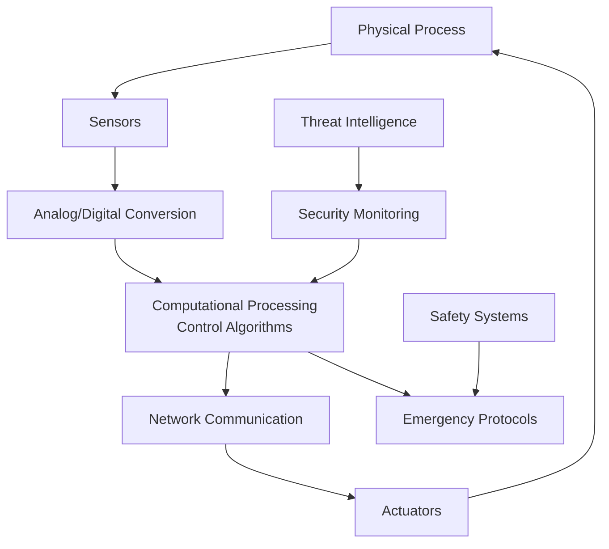

## 3. Historical Context and Evolution

### 3.1 Origins and Development Trajectory

The conceptual foundations for CPS emerged in the early 2000s as industries sought greater automation and intelligence in physical systems. The Ptolemy Project at UC Berkeley provided early models for heterogeneous system design, while advances in embedded computing, real-time operating systems, and industrial networking enabled practical implementations.

**Evolutionary Milestones:**

| **Era** | **Technological Enablers** | **Typical Applications** | **Security Paradigm** |
|---------|----------------------------|--------------------------|----------------------|
| **Pre-2000 (Isolated Systems)** | PLCs, SCADA, Proprietary Networks | Industrial Automation, Building Management | Physical Security, Air Gaps |
| **2000-2010 (Networked Integration)** | Ethernet in OT, Wireless Sensors, OPC | Smart Manufacturing, Early Smart Grids | Perimeter Defense, Basic Authentication |
| **2010-2020 (Convergence Era)** | Cloud Integration, IIoT, Advanced Analytics | Autonomous Vehicles, Medical CPS, Industry 4.0 | Defense-in-Depth, Anomaly Detection |
| **2020-Present (Intelligent CPS)** | AI/ML, 5G Connectivity, Digital Twins | Adaptive Infrastructure, Collaborative Robotics | Zero Trust, Predictive Security |

### 3.2 Paradigm-Shifting Incidents

* **Stuxnet (2010):** The first publicly confirmed cyber weapon designed specifically to cause physical damage, Stuxnet targeted Siemens PLCs controlling Iranian nuclear centrifuges, accelerating them beyond operational limits while displaying false normal readings to operators. This incident fundamentally changed the security landscape by demonstrating that air-gapped industrial systems were vulnerable to sophisticated attacks.
* **Ukrainian Power Grid Attacks (2015, 2016):** The BlackEnergy and Industroyer malware campaigns caused widespread power outages by manipulating SCADA systems and substation breakers. These attacks revealed how cyber operations could disrupt critical infrastructure on a large scale and highlighted vulnerabilities in utility control networks.
* **Triton/Trisis (2017):** This malware specifically targeted safety instrumented systems (SIS) at a petrochemical plant, attempting to disable emergency shutdown mechanisms. Triton represented a dangerous escalation by targeting the last line of defense against catastrophic failures.

## 4. Core Characteristics of CPS

### 4.1 Real-Time Responsiveness and Determinism

Cyber-Physical Systems must guarantee bounded response times to maintain stability and safety. Control loops in automotive systems, power grid frequency regulation, and robotic control typically require millisecond to microsecond latencies. Security mechanisms must therefore operate within these stringent temporal constraints without introducing jitter or unacceptable delays that could destabilize physical processes.

* **Worst-Case Execution Time (WCET):** Safety-critical CPS components require deterministic WCET calculations for all computational tasks, including security functions like encryption and authentication. This demands specialized real-time operating systems and carefully engineered software that avoids garbage collection, dynamic memory allocation, and other non-deterministic operations.
* **Network Timing Guarantees:** Industrial communication protocols like Time-Sensitive Networking (TSN) and Deterministic Ethernet provide bounded latency and jitter for control traffic. Security implementations must preserve these guarantees through hardware acceleration, efficient cryptographic algorithms, and appropriate placement in the network architecture.

### 4.2 Heterogeneous Component Integration

CPS architectures typically incorporate diverse technologies with varying capabilities, lifespans, and security postures:

| **Component Type** | **Typical Lifespan** | **Security Capabilities** | **Update Frequency** |
|-------------------|----------------------|---------------------------|----------------------|
| **Legacy PLCs/RTUs** | 15-30 years | Minimal or none | Rarely (if ever) |
| **Modern Controllers** | 10-15 years | Basic authentication, encrypted comms | 1-2 years |
| **Industrial Network Gear** | 7-10 years | VLANs, basic firewall rules | 3-5 years |
| **Sensors/Actuators** | 5-20 years | Typically none | Never |
| **HMI/SCADA Workstations** | 5-10 years | OS-level security | 1-3 months |

### 4.3 Safety and Security Interdependencies

In CPS, safety mechanisms (designed to prevent accidents under fault conditions) and security controls (designed to prevent malicious actions) are deeply interconnected but often managed by different engineering teams with divergent priorities. A secure but unsafe system is unacceptable, as is a safe but insecure system that attackers can compromise.

* **Safety Instrumented Systems (SIS):** These specialized controllers provide the last line of defense against catastrophic failures by implementing independent safety functions. However, as demonstrated by the Triton malware, SIS themselves can become attack targets, requiring careful security hardening without compromising their safety integrity.
* **Security-Induced Safety Risks:** Well-intentioned security measures can inadvertently create safety hazards. For example, aggressive intrusion prevention that blocks legitimate control commands could trigger emergency shutdowns or leave processes in unsafe states. Security implementations must undergo rigorous safety impact assessments.

## 5. Architectures and Components

### 5.1 Reference Architecture Models

**Purdue Enterprise Reference Architecture (PERA):**
The Purdue Model provides a hierarchical framework for industrial control system segmentation that has become the de facto standard for OT security architecture:

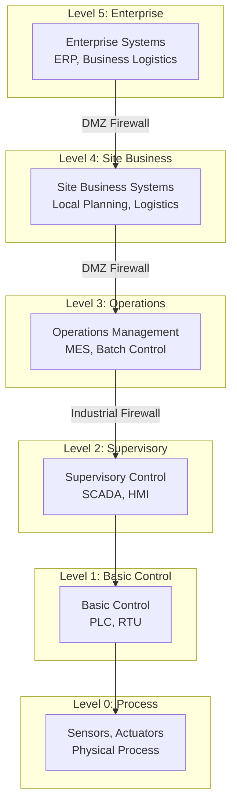

### 5.2 Core CPS Components and Security Considerations

* **Programmable Logic Controllers (PLCs):** These industrial computers automate electromechanical processes through custom control logic. Older PLCs lack security features entirely, while modern versions may include password protection, role-based access, and encrypted communications. Security implementation requires careful consideration of performance impacts on scan cycles.
* **Human-Machine Interfaces (HMIs):** HMIs provide operator visualization and control interfaces, typically running on commercial operating systems (Windows, Linux) with inherent vulnerabilities. They represent high-value targets as compromising an HMI can provide control over underlying processes. Defense strategies include application whitelisting, network segmentation, and regular patching.
* **Industrial Networking Infrastructure:** Specialized switches, routers, and gateways connect field devices to control systems. Many industrial protocols (Modbus, PROFINET, DNP3) lack native security features, requiring network-level protections through industrial firewalls, intrusion detection systems, and protocol-aware monitoring tools.
* **Sensors and Actuators:** Field devices that measure physical parameters (temperature, pressure, flow) and effect physical changes (valve positions, motor speeds). These typically have minimal computing resources and cannot support complex security mechanisms, relying instead on network segmentation and physical security for protection.

## 6. Real-World Deployments and Examples

### 6.1 Smart Grid Systems

Modern electrical grids exemplify large-scale CPS with generation, transmission, and distribution components integrated through real-time monitoring and control. Security challenges include protecting SCADA systems managing substations, securing Advanced Metering Infrastructure (AMI) with millions of endpoints, and maintaining grid stability despite potential cyber attacks.

* **Case Study - Ukrainian Power Grid Attacks:** In December 2015, the BlackEnergy malware combined with KillDisk wiper malware caused power outages affecting approximately 225,000 customers. Attackers gained access through spear-phishing, moved laterally to SCADA systems, and operated circuit breakers remotely. This incident highlighted critical vulnerabilities in utility remote access, authentication mechanisms, and incident response capabilities.
* **Defensive Measures Implemented Post-Incident:** Ukrainian utilities implemented multi-factor authentication for all remote access, network segmentation between corporate and OT networks, enhanced monitoring of SCADA communications, and regular red team exercises. These measures proved effective during subsequent attacks in 2016.

### 6.2 Autonomous Vehicle Systems

Self-driving cars integrate numerous CPS subsystems including perception (LiDAR, radar, cameras), planning (route algorithms, obstacle avoidance), and actuation (steering, braking, acceleration). Security must address both safety (preventing accidents) and privacy (protecting location data) while operating in potentially hostile environments.

* **Security Architecture Principles:** Automotive CPS security follows a defense-in-depth approach with hardware security modules for cryptographic operations, secure boot processes to ensure firmware integrity, intrusion detection systems monitoring CAN bus traffic, and over-the-air update mechanisms with strong authentication and rollback capabilities.
* **Regulatory Framework - ISO/SAE 21434:** This standard defines cybersecurity engineering requirements for road vehicles, establishing a risk-based framework covering concept, development, production, operation, maintenance, and decommissioning phases. Compliance requires documented cybersecurity management systems and evidence-based assurance processes.

### 6.3 Medical Cyber-Physical Systems

Healthcare CPS include implantable devices (pacemakers, insulin pumps), diagnostic equipment (MRI, CT scanners), and hospital infrastructure (ventilators, infusion pumps). These systems face unique challenges due to direct patient safety implications, regulatory requirements, and often legacy components with limited security capabilities.

* **FDA Cybersecurity Guidance:** The U.S. Food and Drug Administration requires medical device manufacturers to implement security throughout the product lifecycle, including threat modeling during design, vulnerability management processes, and coordinated disclosure procedures. Post-market requirements include monitoring for vulnerabilities and providing patches for supported devices.
* **Case Study - Medjacking Vulnerabilities:** Research has demonstrated vulnerabilities in wireless implantable devices that could allow attackers to drain batteries, modify therapy parameters, or exfiltrate patient data. Defenses include strong authentication before programming changes, encryption of wireless communications, and patient notification systems for anomalous device behavior.

## 7. Security Challenges and Risk Assessments

### 7.1 Unique CPS Security Challenges

| **Challenge Category** | **Specific Issues** | **Potential Impacts** |
|-----------------------|---------------------|----------------------|
| **Temporal Constraints** | Security mechanisms must operate within hard real-time deadlines; cryptographic operations can introduce unacceptable latency; security updates may require system downtime incompatible with 24/7 operations | Delayed control responses causing instability; missed safety-critical actions; production losses during security maintenance |
| **Legacy System Integration** | Decades-old equipment with no security features; proprietary protocols lacking encryption or authentication; components from vendors no longer in business | Inability to patch known vulnerabilities; exposure of control communications; lack of security monitoring capabilities |
| **Safety-Security Interactions** | Safety systems may have vulnerabilities; security measures might interfere with safety functions; different teams managing safety vs security with potentially conflicting priorities | Compromised safety systems; security controls that create safety hazards; organizational gaps in risk management |
| **Resource Constraints** | Field devices with limited processing, memory, and power; inability to run standard security software; trade-offs between security and operational functionality | Limited cryptographic capabilities; no host-based protections; security vs performance decisions |
| **Supply Chain Risks** | Compromised components during manufacturing; malicious firmware implants; counterfeit hardware with hidden vulnerabilities; dependence on third-party vendors | Backdoors in critical infrastructure; compromised integrity from inception; difficulty tracing attack origins |

### 7.2 Risk Assessment Methodologies

Effective CPS risk assessment must consider both cyber and physical dimensions:

1. **Asset Identification and Criticality Analysis:**
   * Inventory all CPS components including controllers, field devices, network infrastructure, and software
   * Determine criticality based on safety impact, environmental consequences, operational importance, and economic value
   * Map interdependencies to understand cascading failure paths

2. **Threat Modeling for CPS:**
   * Adversary capability analysis (nation-states, criminals, insiders, hacktivists)
   * Attack vector identification (network, physical, supply chain, wireless)
   * Consequence estimation (safety, environmental, operational, financial, reputational)
   * Likelihood assessment based on vulnerability exposure, attacker motivation, and existing controls

3. **Vulnerability Assessment Approaches:**
   * Passive network monitoring to identify devices and communications without disruption
   * Configuration reviews of controllers, network devices, and security systems
   * Security patch status evaluation across heterogeneous components
   * Physical security assessments of facilities and device locations

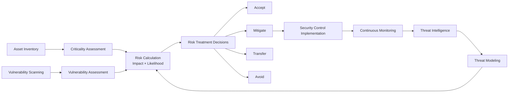

### 7.3 Quantitative Risk Assessment Models

For high-consequence CPS, quantitative risk assessment provides measurable security investment justification:

* **Failure Mode and Effects Analysis (FMEA):** Systematic approach to identifying potential failure modes, their causes, and effects on system operations. Cybersecurity FMEA extends traditional methods to include malicious causes.
* **Fault Tree Analysis (FTA):** Deductive approach starting with an undesired event (top event) and determining all possible causes using logical gates. Cybersecurity FTAs incorporate attack trees to model adversary actions.
* **Bow-Tie Analysis:** Visual risk model combining fault tree (causes) and event tree (consequences) with preventive and mitigative controls. Effective for communicating CPS risks to non-technical stakeholders.

## 8. Defense Controls and Standards

### 8.1 Defense-in-Depth Architecture

CPS security requires layered defenses that provide multiple barriers against intrusion and limit damage from successful attacks:

1. **Physical Security Layer:** Perimeter controls, facility access systems, equipment enclosures, and surveillance to prevent physical tampering.
2. **Network Security Layer:** Segmentation following the Purdue Model, industrial firewalls, intrusion detection/prevention systems, and secure remote access gateways.
3. **Endpoint Security Layer:** Secure configurations, application whitelisting, host intrusion detection, and integrity monitoring for servers and workstations.
4. **Application Security Layer:** Secure development practices, code review, vulnerability testing, and secure update mechanisms.
5. **Data Security Layer:** Encryption of sensitive data at rest and in transit, data loss prevention, and secure data destruction.
6. **Identity and Access Management:** Multi-factor authentication, role-based access control, privileged access management, and user behavior analytics.

### 8.2 Key Security Standards and Frameworks

| **Standard/Framework** | **Scope** | **Key Requirements** | **Applicability to CPS** |
|-----------------------|-----------|----------------------|--------------------------|
| **IEC 62443 Series** | Industrial automation and control systems | Security program, system design, component requirements, lifecycle processes | High - Specifically designed for industrial CPS |
| **NIST SP 800-82** | Industrial control system security | Risk management, architecture, implementation guidance, incident response | High - Comprehensive ICS security guide |
| **NERC CIP Standards** | Bulk electric system cybersecurity | Asset identification, security management, incident reporting, recovery plans | Critical for energy sector CPS |
| **ISO/SAE 21434** | Road vehicle cybersecurity | Cybersecurity management system, risk assessment, product development, production | Essential for automotive CPS |
| **FDA Cybersecurity Guidance** | Medical device cybersecurity | Premarket submissions, postmarket management, vulnerability disclosure | Mandatory for medical CPS |
| **NIST Cybersecurity Framework** | General cybersecurity risk management | Identify, Protect, Detect, Respond, Recover functions | Useful as overarching framework |
| **ISO/IEC 27001** | Information security management systems | ISMS requirements, risk treatment, continuous improvement | Applicable to IT portions of CPS |

### 8.3 Technical Control Implementation

* **Network Segmentation:** Implement the Purdue Model with industrial firewalls between levels, micro-segmentation within levels, and DMZs for IT-OT data exchange. Use VLANs sparingly as they provide logical rather than physical separation.
* **Secure Remote Access:** Replace direct connections with jump hosts requiring multi-factor authentication, implement session recording and monitoring, use vendor-specific gateways for remote maintenance, and enforce time-limited access.
* **Identity and Access Management:** Implement role-based access control aligned with operational responsibilities, require multi-factor authentication for all administrative access, regularly review and revoke unnecessary privileges, and monitor for anomalous access patterns.
* **Continuous Monitoring:** Deploy passive network monitoring tools that understand industrial protocols, implement security information and event management (SIEM) with OT-specific correlations, establish baselines for normal system behavior, and configure alerts for deviations.
* **Patch Management:** Maintain an asset inventory with patch status, establish risk-based prioritization for patching, test patches in isolated environments before deployment, implement virtual patching for legacy systems, and maintain rollback capabilities.

## 9. Deployment Readiness Frameworks

### 9.1 Maturity Assessment Models

CPS security maturity progresses through defined capability levels:

| **Maturity Level** | **Characteristics** | **Typical Controls** |
|-------------------|---------------------|----------------------|
| **Initial/Ad Hoc** | Reactive security, minimal documentation, limited awareness | Basic physical security, default passwords sometimes changed |
| **Developing** | Some policies and procedures, basic technical controls implemented | Network segmentation begun, some monitoring, incident response plan drafted |
| **Defined** | Formal program established, regular assessments, defined responsibilities | Defense-in-depth architecture, continuous monitoring, regular training |
| **Managed** | Metrics-driven management, continuous improvement, integrated risk management | Advanced threat detection, automated response playbooks, supply chain security |
| **Optimizing** | Predictive security, organizational resilience, industry leadership | AI/ML threat hunting, active defense, cyber-physical range testing |

### 9.2 Readiness Assessment Checklist

**Governance and Strategy:**
- [ ] Executive leadership commitment and funding for CPS security
- [ ] Defined organizational structure with clear roles and responsibilities
- [ ] Integrated risk management framework covering cyber and physical risks
- [ ] Security policies and procedures tailored to CPS operational constraints
- [ ] Regular security awareness training for all personnel

**Architecture and Design:**
- [ ] Network segmentation following Purdue Model or similar framework
- [ ] Secure network architecture diagrams maintained and updated
- [ ] Defense-in-depth strategy with multiple security layers
- [ ] Resilience and redundancy for critical components
- [ ] Secure development lifecycle for CPS software and configurations

**Operational Security:**
- [ ] Comprehensive asset inventory with security attributes
- [ ] Continuous monitoring with OT-aware tools
- [ ] Incident response plan with cyber-physical playbooks
- [ ] Regular vulnerability assessments and risk reviews
- [ ] Effective patch management process for heterogeneous components

**Compliance and Assurance:**
- [ ] Regulatory requirements identified and addressed
- [ ] Regular internal and external security assessments
- [ ] Audit trails maintained for security-relevant events
- [ ] Third-party vendor security requirements and assessments
- [ ] Continuous improvement process based on lessons learned

### 9.3 Implementation Roadmap Template

A phased approach ensures manageable implementation while maintaining operational continuity:

**Phase 1: Foundation (Months 1-6)**
- Conduct initial risk assessment and asset inventory
- Establish cross-functional security governance team
- Implement basic network segmentation and access controls
- Develop incident response plan and conduct tabletop exercise

**Phase 2: Enhancement (Months 7-18)**
- Deploy continuous monitoring and anomaly detection
- Implement multi-factor authentication and privileged access management
- Establish formal patch management process
- Conduct comprehensive security training program

**Phase 3: Advanced (Months 19-36)**
- Deploy advanced threat detection and hunting capabilities
- Implement automated response playbooks
- Establish cyber-physical range for testing and training
- Integrate security into development and lifecycle processes

## 10. Incident Propagation Analysis

### 10.1 Cascading Failure Mechanisms

CPS incidents rarely remain isolated due to tightly coupled components and interdependencies:

* **Physical-to-Cyber Propagation:** Equipment failures can generate anomalous sensor readings that confuse control algorithms or trigger automatic responses that create cyber events. For example, a transformer failure causing voltage fluctuations might be misinterpreted as a cyber attack on grid controls.
* **Cyber-to-Physical Propagation:** Malicious commands can cause physical damage that subsequently affects other systems. The 2010 Stuxnet attack damaged centrifuges, which then affected downstream uranium processing and potentially triggered investigations that revealed the infiltration.
* **Cross-Domain Propagation:** Attacks can move between IT and OT networks, leveraging vulnerabilities in one domain to access the other. The 2017 Triton malware entered through the IT network, moved to the OT network, and then targeted safety systems.

### 10.2 Modeling and Simulation Approaches

* **Digital Twins:** Virtual replicas of CPS enable simulation of attack scenarios without risk to actual systems. Digital twins can model how malware would propagate through control networks, what physical effects would result, and how defensive measures would perform.
* **Attack Graphs:** These models map possible attack paths through systems based on vulnerabilities and connectivity. For CPS, attack graphs must include physical access points, wireless communications, and supply chain vectors in addition to network connections.
* **System Dynamics Models:** These capture feedback loops and time delays in CPS, showing how incidents evolve. System dynamics can model the acceleration of damage in positive feedback loops or the effectiveness of mitigations in negative feedback loops.

### 10.3 Containment and Isolation Strategies

Effective incident response requires understanding propagation paths to contain damage:

1. **Predefined Isolation Points:** Identify and document network segmentation points, safety interlocks, and physical disconnects that can isolate compromised areas.
2. **Gradual Response Escalation:** Begin with least disruptive containment measures, escalating only as necessary to stop propagation. For example, start with firewall rule changes before implementing safety shutdowns.
3. **Parallel System Operation:** Where possible, switch to redundant systems while investigating and cleaning compromised components. This maintains operations while containing the incident.
4. **Forensic Preservation:** Ensure containment actions preserve evidence for root cause analysis while preventing further damage.

## 11. Strategic Recommendations

### 11.1 Organizational and Cultural Initiatives

* **Bridge the IT-OT Divide:** Establish joint teams with representation from both IT security and OT engineering. Create shared metrics that balance security and operational objectives. Develop cross-training programs to build mutual understanding.
* **Implement Cyber-Physical Risk Governance:** Integrate cyber risks into enterprise risk management with explicit consideration of physical consequences. Establish board-level oversight of CPS security with regular briefings on threats and preparedness.
* **Foster Security-Aware Culture:** Develop role-specific security training for operators, engineers, and maintenance personnel. Implement reporting mechanisms for security concerns without fear of reprisal. Recognize and reward security-conscious behavior.

### 11.2 Technical and Architectural Investments

* **Adopt Zero Trust Principles:** Implement "never trust, always verify" approaches even within OT networks. Use micro-segmentation to limit lateral movement. Require continuous authentication and authorization for all access attempts.
* **Invest in Continuous Monitoring:** Deploy OT-aware security tools that provide visibility without impacting operations. Implement security information and event management (SIEM) with OT-specific correlations. Establish behavioral baselines for normal operations.
* **Modernize with Security in Mind:** When upgrading legacy systems, prioritize security capabilities alongside functionality. Select vendors with strong security postures and long-term support commitments. Implement secure architectures from the start rather than bolting on security later.

### 11.3 Operational and Process Improvements

* **Develop and Test Incident Response Plans:** Create CPS-specific playbooks that address both cyber and physical dimensions. Conduct regular tabletop exercises with all stakeholders. Establish clear communication channels and decision authorities.
* **Implement Secure Lifecycle Management:** Integrate security requirements into procurement, development, deployment, operation, and decommissioning phases. Maintain accurate asset inventories with security attributes. Establish patch management processes that balance security and stability.
* **Build Resilience Through Diversity:** Avoid single-vendor dependencies that create systemic vulnerabilities. Implement heterogeneous defenses that require multiple exploitation methods to bypass. Design systems to fail safely and recover gracefully.

### 11.4 Future-Proofing Against Emerging Trends

* **Prepare for Post-Quantum Cryptography:** Inventory cryptographic implementations in CPS. Develop migration plans for quantum-resistant algorithms. Monitor NIST standardization progress and vendor adoption timelines.
* **Secure Edge Computing Deployments:** As CPS move computation closer to sensors and actuators, implement security controls at the edge. Use hardware security modules for cryptographic operations at resource-constrained endpoints. Maintain visibility and control over distributed edge assets.
* **Address AI/ML Security Risks:** Secure training data and models against poisoning and manipulation. Implement adversarial testing of AI components. Maintain human oversight of critical decisions even in highly automated systems.

## 12. Conclusion: Building Resilient Cyber-Physical Systems

The security of Cyber-Physical Systems represents one of the most critical challenges of our digital age. As our infrastructure becomes more intelligent and interconnected, the potential consequences of security failures grow more severe—from localized equipment damage to regional blackouts, environmental disasters, and threats to human life. The unique characteristics of CPS—real-time requirements, safety-critical functions, heterogeneous components, and long lifespans—demand specialized security approaches that transcend traditional IT cybersecurity.

This documentation has outlined a comprehensive framework for CPS defense engineering, spanning foundational concepts, architectural patterns, defensive controls, and strategic recommendations. The path forward requires sustained commitment, cross-disciplinary collaboration, and continuous adaptation to evolving threats and technologies. By implementing defense-in-depth architectures, establishing robust governance, fostering security-aware cultures, and investing in advanced monitoring and response capabilities, organizations can secure their cyber-physical infrastructure against current and future threats.

The journey to secure CPS is not a destination but a continuous process of assessment, improvement, and adaptation. As adversaries evolve their tactics and new technologies emerge, defense strategies must likewise advance. Through shared knowledge, industry collaboration, and unwavering commitment to security principles, we can build cyber-physical systems that are not only intelligent and efficient but also secure, resilient, and trustworthy.

<br><br><br><br>

<h1 align="center">Cyber-Physical Systems (CPS): Architecture, Security, and Deployment.</h1>

<br>
 

## Executive Summary

Cyber-Physical Systems (CPS) represent the fundamental integration of computational algorithms, networked communication, and physical processes. These engineered systems utilize continuous feedback loops to monitor and control real-world operations with strict timing requirements. From autonomous vehicles and smart grids to advanced medical devices and industrial robotics, CPS form the backbone of modern critical infrastructure and intelligent automation. This document provides a comprehensive overview of CPS, detailing their core architecture, operational characteristics, inherent security challenges, and a deployment-ready framework for building resilient systems. It is designed to inform engineers, security professionals, and operational leaders responsible for specifying, deploying, and defending these complex, safety-critical environments.

 

## Table of Contents

1.  [Definition and Core Concept](#1-definition-and-core-concept)
2.  [Historical Evolution and Rationale](#2-historical-evolution-and-rationale)
3.  [Core Characteristics of CPS](#3-core-characteristics-of-cps)
4.  [Architectural Components and Data Flow](#4-architectural-components-and-data-flow)
5.  [Exemplary Applications and Use Cases](#5-exemplary-applications-and-use-cases)
6.  [Security Implications and Unique Challenges](#6-security-implications-and-unique-challenges)
7.  [A Framework for Secure CPS Deployment](#7-a-framework-for-secure-cps-deployment)
8.  [Deployment Readiness Checklist](#8-deployment-readiness-checklist)
9.  [Conclusion and Forward Path](#9-conclusion-and-forward-path)
10. [Revision History](#10-revision-history)

 

## 1. Definition and Core Concept

A **Cyber-Physical System (CPS)** is an engineered orchestration of computational cores, communication networks, and physical elements, fused together through feedback loops where embedded computers and software sense, reason about, and influence the physical world. Unlike purely informational IT systems, the correctness and safety of a CPS are determined by the *joint behavior* of its cyber and physical components, subject to real-time constraints and physical dynamics. The "cyber" aspect encompasses computation, control, and connectivity, while the "physical" aspect involves natural and human-made systems governed by laws of motion, thermodynamics, or biology.

 

## 2. Historical Evolution and Rationale

The formal concept of CPS coalesced in the early 2000s, driven by converging advancements in embedded systems, real-time operating systems, and pervasive networking. This period saw a paradigm shift from isolated, standalone controllers to networks of intelligent, communicating devices capable of complex coordination. Foundational academic projects, such as the **Ptolemy Project** at UC Berkeley, developed critical modeling frameworks and tools for designing heterogeneous, concurrent real-time systems. The driving rationale was—and remains—to create systems that are more adaptive, efficient, and autonomous, enabling capabilities like precision automation, large-scale infrastructure management, and responsive human-machine collaboration that were previously infeasible.

 

## 3. Core Characteristics of CPS

*   **Tight Coupling of Cyber and Physical Realms:**
    The defining trait of a CPS is the inseparable interplay between its computational logic and physical dynamics. A control algorithm's effectiveness depends on actuator response times and physical inertia, while sensor placement and accuracy dictate the algorithm's observability. This necessitates a holistic, model-based design approach where software and hardware are co-developed. Verification and validation must account for this symbiosis, often requiring co-simulation, hardware-in-the-loop (HIL) testing, and safety cases that bridge digital and physical evidence. Treating the cyber and physical domains as separate silos inevitably leads to systemic vulnerabilities and performance failures.

*   **Deterministic Real-Time Responsiveness:**
    For CPS, timeliness is not a performance metric but a correctness condition. Safety-critical control loops must guarantee that sensing, computation, and actuation complete within rigorously defined deadlines. Missing a deadline can mean a vehicle fails to brake or a generator loses synchronization. This demands deterministic computing platforms (real-time OS, time-aware schedulers) and communication networks (Time-Sensitive Networking, deterministic Ethernet). Consequently, any integrated security mechanism—encryption, authentication, intrusion detection—must be analyzed for its worst-case execution time to ensure it does not violate these critical temporal bounds and introduce latent safety hazards.

*   **Networked and Heterogeneous Composition:**
    CPS are inherently distributed, integrating a wide spectrum of devices from resource-constrained microcontrollers and sensors to powerful edge servers and cloud analytics platforms. These components communicate over a mix of wired (CAN bus, PROFINET, Ethernet) and wireless (5G, Wi-Fi, mesh) protocols. This heterogeneity, while enabling functionality and scalability, significantly expands the attack surface and complicates lifecycle management. Achieving secure interoperability requires carefully designed gateways, middleware, and consistent security policies that can be enforced across diverse device capabilities and legacy technology stacks.

*   **Closed-Loop Feedback as a Foundational Pattern:**
    Continuous monitoring and adaptive control through feedback loops are the operational essence of CPS. Sensors provide real-time measurements of the physical state, which controllers process using algorithms (from classic PID to modern model-predictive control) to compute corrective commands for actuators. These loops operate at multiple time scales and hierarchical levels, from milli-second motor control to hour-long optimization of energy flow. Ensuring robustness involves strategies like sensor fusion for redundancy, fault detection and isolation (FDI) logic, and graceful degradation plans to maintain safe operation even with partial system failures.

*   **Extended Lifecycles and Operational Constraints:**
    Many CPS assets, particularly in infrastructure and industrial settings, are deployed for decades and operate in environments where disruptive maintenance is costly or dangerous. This long lifecycle imposes unique requirements: forward-compatible security architectures, secure and recoverable firmware update mechanisms, and designs that accommodate future component obsolescence. Security and maintenance strategies must be planned for the entire operational horizon, emphasizing non-disruptive patching, secure boot, and comprehensive supply chain assurance for replacement parts.

 

## 4. Architectural Components and Data Flow

### 4.1 Component Taxonomy

| Component Category | Role / Function | Typical Examples | Critical Requirements |
| :--- | :--- | :--- | :--- |
| **Physical Process** | The real-world phenomena under control. | Electrical grid flow, vehicle kinematics, chemical reaction. | Must be observable and controllable within system limits. |
| **Sensors** | Translate physical state into digital data. | LiDAR, pressure transducers, thermocouples, cameras. | Accuracy, precision, latency, calibration stability, tamper-resistance. |
| **Actuators** | Translate digital commands into physical force/motion. | Servo motors, solenoid valves, relays, display units. | Response time, power, range, built-in safety interlocks. |
| **Embedded Controllers** | Execute time-critical control algorithms. | Programmable Logic Controllers (PLCs), microcontrollers with RTOS. | Deterministic scheduling, fail-safe states, secure communication stacks. |
| **Communication Networks** | Enable data exchange between components. | TSN Ethernet, CAN bus, WirelessHART, 5G URLLC. | Bounded latency, high reliability, Quality of Service (QoS) prioritization. |
| **Supervisory & Analytics** | Provide system-wide monitoring, optimization, and logging. | SCADA servers, Cloud-based digital twins, Historians. | Scalable data ingestion, secure APIs, advanced analytics capabilities. |
| **Human-Machine Interface (HMI)** | Enable operator oversight and intervention. | Control room dashboards, mobile operator panels, AR interfaces. | Situational awareness, role-based access control (RBAC), unambiguous alarm presentation. |

### 4.2 Core CPS Control and Data Flow
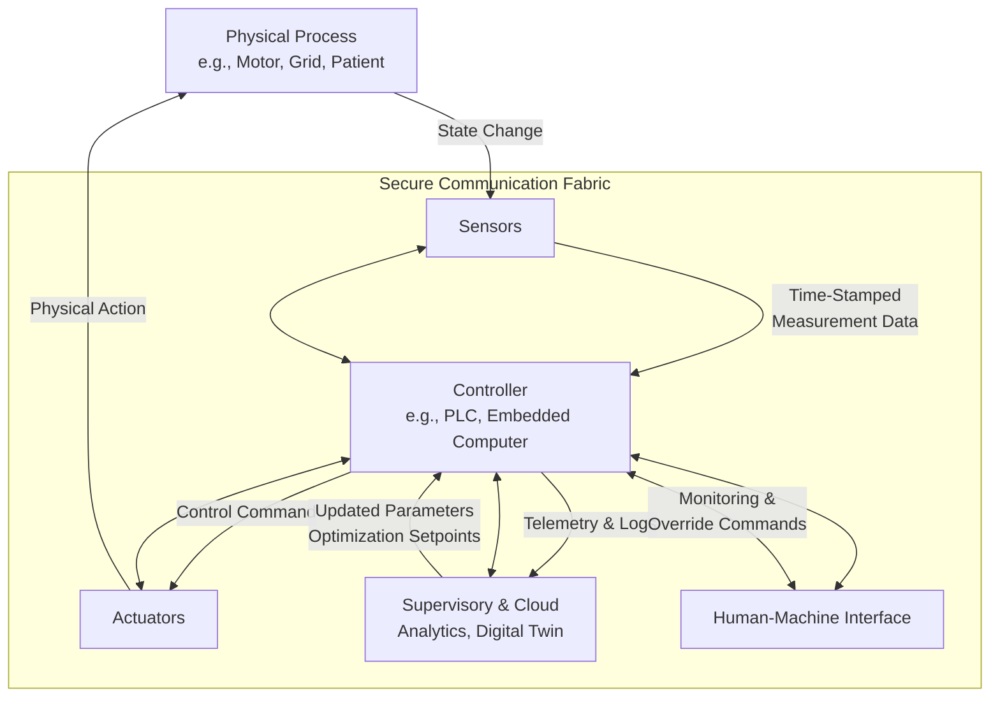

 

## 5. Exemplary Applications and Use Cases

*   **Smart Electrical Grids:** CPS enable real-time balancing of supply and demand, integration of volatile renewable sources, automated fault isolation, and dynamic pricing. Security and ultra-reliable communication are paramount to prevent cascading blackouts.
*   **Autonomous Vehicles and Drones:** These systems fuse data from myriad sensors (cameras, radar, LiDAR) using complex perception algorithms to model their environment and execute split-second navigation and collision-avoidance decisions within deterministic control loops.
*   **Industrial Control Systems (ICS) & Smart Manufacturing:** From discrete assembly lines to continuous process plants, CPS (via PLCs, DCS, and robotics) automate production. The convergence of IT and OT networks in Industry 4.0 introduces both efficiency and significant cyber-risk to physical processes.
*   **Medical Cyber-Physical Systems (MCPS):** Devices like implantable pacemakers, smart insulin pumps, and robotic surgical systems directly interact with human physiology. They require verifiable safety properties, exceptional reliability, and secure communication to protect patient health and data.
*   **Intelligent Building Management:** Integrated CPS control HVAC, lighting, access, and fire safety systems to optimize energy use, comfort, and security, requiring coordination across multiple subsystems with different criticality levels.

 

## 6. Security Implications and Unique Challenges

*   **Converged IT/OT Attack Surface:**
    The integration of traditionally isolated operational technology (OT) networks with enterprise IT systems creates a broad and heterogeneous attack surface. Adversaries can exploit vulnerabilities in business networks to pivot into control networks, targeting devices never designed with cybersecurity in mind. This requires defenders to understand and secure protocols like Modbus, DNP3, and OPC UA, and to implement robust network segmentation (following models like Purdue) to contain breaches and protect critical control loops from IT-originating threats.

*   **The Safety-Security Trade-Off Under Real-Time Constraints:**
    Introducing security controls can inadvertently compromise safety. Cryptographic operations, deep packet inspection, or additional authentication steps may introduce latency or jitter that violates the deterministic timing requirements of a safety-critical control loop. Therefore, security architecture for CPS must prioritize **lightweight, deterministic security primitives**, hardware-based acceleration for cryptographic functions, and careful traffic shaping to ensure safety-critical messages are never delayed by security processing or lower-priority network traffic.

*   **Risk of Physical-Focused Attacks and Cascading Failures:**
    CPS attackers often aim to cause physical damage or disruption—a fundamentally different objective than data theft in IT systems. Techniques like sensor spoofing, actuator hijacking, or command injection can drive the physical process into an unsafe state. Furthermore, due to tight coupling, a localized compromise can trigger cascading failures across interconnected subsystems. Defenses must therefore include physics-aware anomaly detection that recognizes impossible physical states (e.g., a tank simultaneously being full and empty) and designs that incorporate isolation boundaries and fail-safe modes to limit blast radius.

*   **Lifecycle Management of Legacy and Constrained Devices:**
    A significant portion of deployed CPS consists of legacy devices with long service lives, limited processing power, and no inherent security features. Patching these systems is often complex, risky, or impossible. Security strategies must rely on **compensating controls**, such as network segmentation, protocol monitoring, and out-of-band serial tap monitoring. A comprehensive asset inventory and risk-based patch management policy are essential to prioritize efforts and manage the residual risk posed by these unavoidable legacy components.

 

## 7. A Framework for Secure CPS Deployment

### 7.1 Controls Mapping to Standards

| Control Objective | Practical Implementation Guidance | Relevant Standards & Frameworks |
| :--- | :--- | :--- |
| **Secure Architecture & Segmentation** | Implement a zone & conduit model (e.g., Purdue Model). Use OT-aware firewalls and unidirectional gateways (data diodes) for critical conduits. Enforce micro-segmentation within OT zones. | IEC 62443, NIST SP 800-82 Rev.3, NIST CSF |
| **Device Integrity & Trust** | Enforce secure boot and firmware signing. Implement hardware-based roots of trust (TPM, HSM). Establish processes for secure firmware update distribution and validation. | IEC 62443, NIST SP 800-193, ISA/IEC 62443-4-2 |
| **Secure Communications** | Utilize transport-layer security (TLS 1.3+) for management traffic. Employ lightweight authenticated encryption (e.g., AES-GCM) for field device comms where appropriate. Leverage Time-Sensitive Networking (TSN) for deterministic, secure data flows. | IEC 62443, IEEE 802.1 TSN, NIST FIPS 140-3 |
| **Access Management & Monitoring** | Enforce Role-Based Access Control (RBAC) and Multi-Factor Authentication (MFA) for all administrative access. Deploy passive, OT-aware network monitoring (IDS) and establish a Security Operations Center (SOC) workflow for OT alerts. | NIST SP 800-53, IEC 62443, NIST CSF (Detect & Respond functions) |
| **Resilience & Safety Integration** | Design redundant critical components and paths. Implement Fail-Safe/Fail-Operational states. Conduct joint Safety & Security Risk Assessments (e.g., SAHARA, S³). | IEC 61508 (Functional Safety), ISA/IEC 62443-3-2 (Security Risk Assessment), ISO/SAE 21434 (Road Vehicles) |

### 7.2 Foundational Mitigation Strategies

*   **Adopt a Defense-in-Depth Architecture with OT-Centric Segmentation:**
    Move beyond a flat network topology. Rigorously apply the Purdue Model or similar zone-based architecture to create security perimeters around groups of assets with similar criticality and function. Control all communication between zones through secured conduits with deep packet inspection capabilities tailored to industrial protocols. This strategy limits lateral movement, contains incidents, and allows for tailored security policies that match the risk profile and capability of devices within each zone, from Level 0 sensors to Level 5 enterprise systems.

*   **Integrate Security into the System Development Lifecycle (SDLC):**
    Cybersecurity cannot be bolted on; it must be "baked in." From the initial requirements and architecture phase, incorporate security and safety co-engineering practices. Use threat modeling (e.g., STRIDE) specific to CPS to identify attack vectors that could impact physical safety. Employ digital twin technology and Hardware-in-the-Loop (HIL) testbeds to validate both functional performance and security controls under realistic, high-fidelity conditions before field deployment, ensuring that security measures do not disrupt critical operations.

*   **Establish Continuous Visibility and Physics-Aware Threat Detection:**
    Gain comprehensive asset visibility through passive network discovery and active management. Deploy monitoring solutions that understand industrial protocols and can baseline normal operational behavior. Move beyond signature-based detection to implement **physics-aware anomaly detection** that uses process models to identify sensor readings or actuator commands that are physically impossible, indicating potential manipulation or component failure. This provides a critical layer of defense against novel or sophisticated attacks that bypass conventional IT security tools.

*   **Develop and Practice Integrated Incident Response Playbooks:**
    Recognize that responding to a CPS incident requires coordination between IT security, OT engineers, and safety officers. Develop specific playbooks that prioritize **safe operational state transition** over immediate containment (e.g., isolating a compromised controller might need to be sequenced after bringing the process to a safe halt). Conduct regular tabletop and functional exercises that involve cross-disciplinary teams to refine communication, decision-making, and technical procedures under pressure, ensuring a swift and safe response to real incidents.

 

## 8. Deployment Readiness Checklist

| Category | Item | Status (✅/◻/N/A) | Notes/Owner |
| :--- | :--- | :--- | :--- |
| **Governance & Inventory** | 1.1 Maintain a detailed, dynamic inventory of all CPS assets (OT/IoT). | | |
| | 1.2 Defined and documented roles/responsibilities for CPS security (IT/OT/Safety). | | |
| **Architecture & Design** | 2.1 Network segmentation (zones/conduits) architecture documented and implemented. | | |
| | 2.2 Network diagrams updated to reflect OT environment and critical data flows. | | |
| **Protective Controls** | 3.1 Secure configurations and hardening baselines applied to all OT devices. | | |
| | 3.2 Secure remote access implemented (e.g., Jump Hosts, VPN with MFA). | | |
| **Monitoring & Detection** | 4.1 OT-aware network monitoring (IDS/IPS) deployed in critical zones/conduits. | | |
| | 4.2 A process for log aggregation and review from OT assets is established. | | |
| **Response & Recovery** | 5.1 CPS-specific incident response playbook exists and is approved by OT/Safety. | | |
| | 5.2 Secure backup, restore, and disaster recovery procedures for control system data/configuration tested. | | |
| **Lifecycle Management** | 6.1 Formal, risk-based patch management policy for OT assets is in place. | | |
| | 6.2 A process for decommissioning OT assets securely exists. | | |

 

## 9. Conclusion and Forward Path

Cyber-Physical Systems are the engines of technological advancement in critical sectors, offering unprecedented capabilities through the deep integration of computation and physical processes. This integration, however, brings forth a complex landscape of risks where cyber threats have direct physical consequences. Success hinges on moving beyond traditional IT security paradigms and adopting a holistic, resilience-focused approach that equally prioritizes safety, security, and operational integrity.

The forward path requires continued investment in **cross-disciplinary education**, development of **CPS-specific security tools and standards**, and fostering **collaboration between vendor, integrator, and asset owner communities**. By architecting with security and safety from the outset, implementing defense-in-depth tailored to operational constraints, and building prepared, cross-functional teams, organizations can harness the power of CPS while managing the inherent risks.


<br><br><br><br>

<h1 align="center">Securing Our Physical Future: The Critical Imperative of Cyber-Physical System Security.</h1>

<br>
 

## Executive Summary

Cyber-Physical Systems (CPS)—the engineered integration of computation, networking, and physical processes—form the operational backbone of modern society. From the electrical grid and water treatment facilities to advanced manufacturing and medical devices, CPS translate digital commands into physical actions. This very integration is their vulnerability: **a cyber breach in a CPS does not just compromise data; it can directly commandeer the physical world.** Consequently, CPS security transcends traditional information security, becoming a foundational concern for human safety, economic stability, environmental protection, and national resilience. This document articulates the multifaceted criticality of CPS security, supported by historical incidents, evolving threat landscapes, and a framework for proactive defense.

 

## 1. The Paramount Imperative: Protection of Human Life and Safety

In CPS, safety and security are inseparable. Attacks targeting safety-critical functions can have immediate, dire consequences.

*   **Subversion of Safety Instrumented Systems (SIS):** Unlike IT systems where data integrity is key, CPS attacks aim to manipulate sensor inputs or actuator outputs to create hazardous physical states. The 2017 **Triton/Trisis malware** attack on a Saudi petrochemical plant represents a watershed moment. It was specifically designed to reprogram safety controllers, aiming to disable emergency shutdown systems that protect against explosions, fires, and toxic releases. This demonstrated a malicious intent to engineer catastrophic, potentially fatal, industrial disasters purely through digital means.
*   **Direct Manipulation Leading to Physical Destruction:** The 2014 attack on a **German steel mill** provided one of the first confirmed instances of a cyber attack causing unambiguous physical damage. By infiltrating the plant's control network, attackers prevented the proper shutdown of a blast furnace, leading to massive equipment destruction. This incident proved that digital intrusions could bypass traditional physical safety interlocks and directly inflict damage.
*   **The Inextricable Link:** These cases underscore that in CPS, **security failures become safety failures**. A vulnerability in a network-connected medical infusion pump, a building management system, or an autonomous vehicle's controller is not merely a privacy issue; it is a direct threat to human well-being. Ensuring the integrity and availability of control loops is therefore a life-saving necessity.

## 2. Ensuring Reliability and Availability of Critical National Infrastructure

CPS are the engines of essential services. Their compromise directly translates to societal and economic paralysis.

*   **Cascading Failures and Widespread Disruption:** The December 2015 **BlackEnergy3 attack on Ukraine's power grid** is a seminal case study. By compromising IT networks, deploying malware on SCADA systems, and leveraging stolen credentials to operate circuit breakers remotely, attackers caused sustained power outages for hundreds of thousands of citizens. This event illustrated how a coordinated cyber campaign could weaponize infrastructure against a population, creating chaos and undermining public trust.
*   **Economic Catastrophe and Mounting Costs:** The financial impact of CPS disruption is staggering. Service outages halt production, spoil perishable goods, and disrupt supply chains. The cost of investigation, forensic recovery, physical repairs, and regulatory penalties can be crippling. Projections indicate the global annual cost of cybercrime will exceed **$10.5 trillion by 2025**, a significant portion of which will stem from attacks on critical infrastructure and industrial systems.
*   **The Insider Threat Vector:** The 2000 **Maroochy Shire sewage spill** in Australia, caused by a disgruntled insider with a radio transmitter, remains a classic example. It highlights that threats are not exclusively external and that even standalone control systems are vulnerable to attacks that cause environmental harm and service degradation, eroding the reliability the public depends upon.

## 3. Preventing Environmental and Public Health Catastrophes

Many CPS govern processes with significant environmental and public health implications. Their compromise can lead to lasting ecological damage.

*   **Uncontrolled Discharges and Contamination:** CPS manage chemical balances in water treatment, control emissions from industrial scrubbers, and regulate pressures in pipelines. A malicious actor or a piece of malware that alters setpoints in a wastewater management system can cause the deliberate or accidental release of raw sewage or toxic chemicals into rivers and watersheds, as seen in the Maroochy incident. Similarly, an attack on a chemical plant's control logic could result in a dangerous release of gasses or contaminants.
*   **Long-Term Remediation Liabilities:** The consequences of such events extend far beyond the initial incident. Environmental contamination may require decades of costly remediation, legal liabilities, and cause irreversible damage to ecosystems. Public health can be affected through contaminated water supplies or exposure to hazardous materials, creating a secondary crisis stemming from the primary cyber event.

## 4. Navigating the Evolving Regulatory and Compliance Landscape

A complex web of mandatory and voluntary frameworks now governs CPS security, making compliance a critical business driver.

*   **Sector-Specific Mandates:** Regulatory bodies worldwide have established compulsory standards. The **North American Electric Reliability Corporation (NERC) Critical Infrastructure Protection (CIP)** standards enforce cybersecurity requirements for the bulk electric system. The **U.S. Food and Drug Administration (FDA)** provides pre- and post-market guidance for cybersecurity in medical devices.
*   **Adopted Best-Practice Frameworks:** Widely adopted standards like the **IEC 62443** series provide a comprehensive, risk-based framework for securing Industrial Automation and Control Systems (IACS). The **NIST Cybersecurity Framework (CSF)** and its extensions offer a flexible structure for managing risk across critical infrastructure sectors.
*   **Compliance as a Security Baseline:** Adherence to these frameworks is no longer optional for operators of critical systems. It forms the minimum due diligence expected by regulators, insurers, and partners. A robust CPS security program directly enables and demonstrates compliance, reducing legal and financial risk.

## 5. Systemic Challenges: The Expanding and Interconnected Attack Surface

The underlying trends in technology adoption are inherently increasing risk.

*   **IT/OT/IoT Convergence:** The historical "air gap" between operational technology (OT) networks and corporate IT networks has dissolved. The proliferation of **Industrial Internet of Things (IIoT)** sensors and cloud analytics drives this convergence, creating new connectivity pathways for attackers. Legacy OT devices, often designed for longevity and reliability rather than security, are now exposed to threats from the IT domain.
*   **Increased Interdependence and Complexity:** Modern infrastructure is a system of systems. A failure in one CPS (e.g., the power grid) can cascade into others (e.g., water distribution, communications). This interdependence amplifies the impact of a single point of failure and complicates recovery efforts.
*   **Supply Chain Insecurity:** CPS are built from components and software sourced from a global supply chain. Vulnerabilities or malicious code embedded in vendor software, firmware, or hardware can introduce latent weaknesses that are difficult to detect and remediate.

### Attack Propagation in a Converged IT/OT Environment
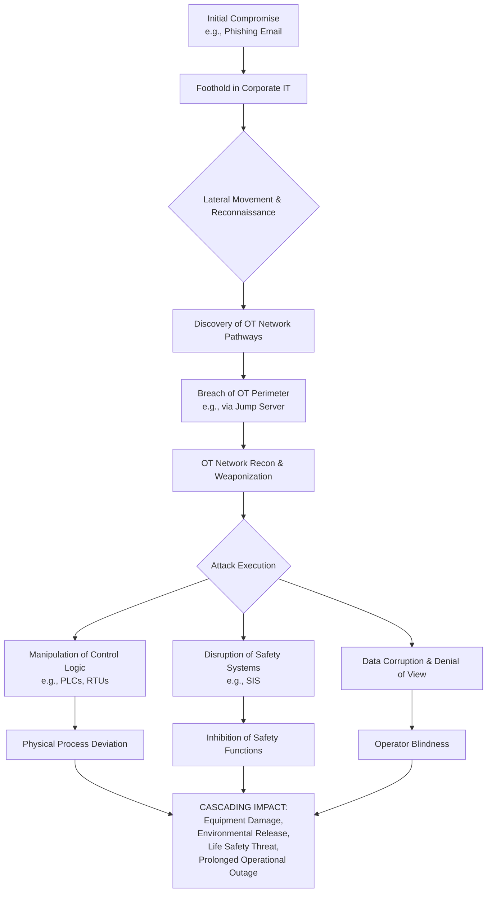

## 6. Building Resilience: A Strategic Framework for Defense

Securing CPS requires a specialized, defense-in-depth strategy that acknowledges their unique constraints and criticality.

### Core Principles of CPS Defense

| Principle | Objective | Key Actions |
| :--- | :--- | :--- |
| **Secure Architecture & Segmentation** | Limit attack propagation and contain breaches. | Implement the Purdue Model/ISA-95 zones and conduits; enforce micro-segmentation; strictly control IT/OT demilitarized zones (DMZs). |
| **Asset Visibility & Inventory** | Know what you need to protect. | Maintain a dynamic, accurate inventory of all CPS assets (OT/IoT); understand device dependencies and criticality. |
| **Identity & Access Management** | Ensure only authorized entities interact with systems. | Enforce role-based access control (RBAC); implement multi-factor authentication (MFA) for critical access; manage vendor remote access ephemerally. |
| **Threat Detection & Monitoring** | Identify malicious activity early. | Deploy OT-aware intrusion detection systems (IDS); analyze network traffic for anomalies; establish a security operations center (SOC) with OT visibility. |
| **Incident Response & Recovery** | Respond safely and restore operations. | Develop and exercise CPS-specific IR playbooks that involve both IT security and OT engineering teams; maintain secure backups and "golden images" for critical controllers. |
| **Lifecycle & Patch Management** | Manage risk over the system's lifespan. | Implement a risk-based patching program; use testbeds to validate updates; secure the software supply chain via Software Bill of Materials (SBOM). |

*   **Adopt a "Zero Trust" Mindset for OT:** Move beyond the assumption that the internal network is safe. Continuously verify trust for devices and users, enforce least-privilege access, and inspect traffic even within OT zones where possible.
*   **Integrate Security with Safety Engineering:** Safety and security teams must collaborate from the design phase. Security requirements should be derived from safety analyses (e.g., HAZOP), ensuring that cybersecurity controls protect and do not interfere with safety functions.
*   **Prioritize Resilience:** Accept that some attacks may succeed. Design systems to **fail securely**, maintain core functions under degraded modes, and ensure the ability to recover quickly and predictably. This involves technical measures (redundancy, graceful degradation) and organizational preparedness (crisis management, public communication plans).

## 7. Conclusion and Call to Action

The security of Cyber-Physical Systems is not a secondary technical consideration; it is a primary strategic imperative for any organization operating critical infrastructure, advanced manufacturing, or life-critical devices. The convergence of the digital and physical worlds has created a new domain of risk where cyber events have kinetic consequences.

**Leadership must recognize that investing in CPS security is an investment in:**
*   **Safety:** Protecting employees and the public from harm.
*   **Reliability:** Ensuring the continuous delivery of essential services.
*   **Viability:** Avoiding catastrophic financial and reputational loss.
*   **Compliance:** Meeting legal and regulatory obligations.

The path forward requires a sustained commitment to understanding unique CPS risks, implementing tailored defense-in-depth strategies, fostering cross-disciplinary collaboration between IT, OT, and safety teams, and building a culture of resilience that prepares organizations to prevent, withstand, and recover from the evolving threats of the 21st century.
 
<br><br><br><br>

<h1 align="center">Comprehensive Threat Analysis for Cyber-Physical Systems.</h1>

<br>
 
## Executive Summary

Cyber-Physical Systems (CPS) represent the critical convergence of computational algorithms, networked communication, and physical processes. This integration creates a unique risk landscape where cyber threats can manifest directly as physical harm, environmental damage, or infrastructure failure. Unlike traditional IT systems, CPS attacks can bypass digital boundaries to produce irreversible real-world consequences. This document provides a structured analysis of common CPS threats, their propagation mechanisms, and prioritized defense strategies essential for engineers, operators, and security architects responsible for safeguarding critical infrastructure.

 

## 1. Introduction to CPS Threat Landscape

Cyber-Physical Systems encompass industrial control systems (ICS), supervisory control and data acquisition (SCADA) systems, medical devices, autonomous vehicles, and smart infrastructure. The threat landscape for these systems is characterized by:

* **Converged Attack Surfaces:** Digital, physical, and human elements present interconnected vulnerabilities
* **Safety-Critical Consequences:** Attacks can directly impact human safety, environmental protection, and continuous operations
* **Extended Lifecycles:** Legacy components with decades-long service lives create persistent vulnerability windows
* **Complex Interdependencies:** Disruption in one system can cascade across interconnected infrastructure

Understanding these threats requires moving beyond traditional cybersecurity models to incorporate physical security, human factors engineering, and safety system integrity.

 

## 2. Threat Taxonomy & Classification

The following taxonomy categorizes CPS threats by vector, actor motivation, and potential impact:

| Threat Category | Primary Vectors | Typical Actors | Primary Objectives | Potential Physical Consequences |
|-----------------|-----------------|----------------|-------------------|---------------------------------|
| **Cyberattacks** | Network exploitation, malware, protocol manipulation | Criminal groups, nation-states, hacktivists | Disruption, sabotage, espionage, ransom | Process shutdowns, equipment damage, environmental releases |
| **Insider Threats** | Credential misuse, intentional sabotage, procedural bypass | Disgruntled employees, compromised contractors | Sabotage, intellectual property theft, revenge | Direct physical manipulation, safety system disablement |
| **Supply Chain Compromise** | Counterfeit hardware, backdoored firmware, compromised updates | Nation-states, sophisticated adversaries | Persistent access, widespread compromise | Systemic vulnerabilities across deployed fleets |
| **Physical Tampering** | Direct hardware access, field device manipulation | Insiders, terrorists, vandals | Immediate physical damage, safety system defeat | Equipment destruction, fires, toxic releases |
| **Legacy System Exploitation** | Unpatched vulnerabilities, outdated protocols | Opportunistic attackers, automated tools | Initial access, persistent footholds | Unauthorized control, system instability |
| **Side-Channel & Zero-Day Attacks** | Power analysis, timing attacks, protocol vulnerabilities | Highly resourced adversaries, state actors | Stealthy intelligence gathering, persistent access | Long-term undetected manipulation |

 

## 3. Detailed Threat Analysis

### 3.1 Cyberattack Vectors

* **Ransomware and Targeted Malware**
  Ransomware has evolved from data-centric extortion to operational disruption in CPS environments. Attackers now encrypt not only data but also control system configurations, historian databases, and Human-Machine Interface (HMI) access, directly threatening operational continuity. Targeted ICS malware like Industroyer and Triton/Trisis demonstrates sophisticated understanding of industrial protocols and safety systems, enabling manipulation of physical processes. The convergence of financial motivation and process knowledge creates particularly dangerous scenarios where attackers can calculate the maximum disruption value. Recovery often requires physical intervention, calibration, and safety recertification, extending downtime far beyond typical IT recovery scenarios. Effective defense requires segmented backups, air-gapped recovery systems, and real-time anomaly detection specifically tuned to control system behavior.

* **Denial-of-Service (DoS) and Resource Exhaustion**
  CPS DoS attacks target the real-time constraints essential for safe operation. By flooding control networks, exhausting PLC processing cycles, or saturating fieldbus bandwidth, attackers can disrupt timing-critical control loops. Even brief disruptions can cause cascading failures in tightly coupled systems, while prolonged attacks may force emergency shutdowns with significant safety and economic consequences. Resource exhaustion attacks often exploit management interfaces, engineering workstation services, or protocol vulnerabilities unique to industrial systems. Mitigation requires deterministic network design with Quality of Service (QoS) guarantees, redundant communication paths, and out-of-band management channels. Understanding worst-case execution times and implementing watchdogs at both device and system levels provides additional resilience against timing attacks.

* **Advanced Persistent Threats (APTs)**
  APT campaigns against CPS involve meticulous reconnaissance, multi-stage infiltration, and long-term persistence with strategic objectives ranging from espionage to pre-positioning for future conflict. These attacks typically combine social engineering, supply chain compromise, and custom malware tailored to specific industrial environments. APT operators invest significant resources in understanding target systems, often developing exploit chains that leverage both IT and OT vulnerabilities. Detection requires correlation across security domains, behavioral analytics focused on operational anomalies, and threat intelligence specific to industrial sectors. Remediation of APT compromises demands careful forensic analysis to ensure complete eradication without triggering safety incidents, often necessitating controlled isolation and phased recovery.

### 3.2 Insider and Human Factor Threats

* **Malicious and Negligent Insider Actions**
  Insider threats represent some of the most challenging CPS risks due to legitimate access privileges and system knowledge. Malicious insiders can bypass technical controls through authorized channels, while negligent personnel may inadvertently create vulnerabilities through poor security practices. The convergence of elevated privileges in OT environments (where few operators often have broad system access) and pressure to maintain operational continuity creates environments where security procedures may be circumvented. Effective controls include role-based access with strict separation of duties, comprehensive session logging and auditing, and behavioral monitoring that detects anomalous sequences of operations even from authorized users. Regular security training must be complemented by technical enforcement mechanisms that prevent critical actions without proper authorization workflows.

* **Social Engineering and Human Manipulation**
  Social engineering attacks exploit human psychology rather than technical vulnerabilities, making them particularly effective against CPS environments where operators must balance multiple priorities under pressure. Phishing campaigns targeting control engineers often use industry-specific lures, while pretexting attacks may impersonate vendor support personnel to gain remote access credentials. These attacks succeed because they bypass technical controls entirely, leveraging trust relationships and operational urgency. Defense requires a layered approach combining security awareness training with technical controls like multi-factor authentication, mandatory change management procedures, and automated enforcement of security policies. Simulated phishing exercises and tabletop drills that combine safety and security scenarios build organizational resilience against these human-centric attacks.

### 3.3 Physical and Supply Chain Threats

* **Physical Tampering and Hardware Attacks**
  Direct physical access to CPS components enables attacks that bypass all network security measures. Attackers can install rogue devices, intercept fieldbus communications, modify sensor readings, or directly manipulate actuators. These attacks can achieve immediate physical effects, from equipment damage to environmental releases. Protection requires physical security measures including tamper-evident seals, surveillance, access controls, and secure enclosures, complemented by technical measures like device attestation and hardware security modules. Runtime integrity checks, including sensor plausibility analysis and actuator feedback verification, can detect some forms of tampering even when physical security is breached.

* **Supply Chain Compromises**
  Supply chain attacks introduce vulnerabilities at the manufacturing or distribution stage, potentially affecting entire fleets of deployed devices. These can include backdoored firmware, counterfeit components with reduced reliability, or compromised update mechanisms that serve as persistent access vectors. Mitigation requires comprehensive supply chain risk management including vendor security assessments, software bill of materials (SBOM) analysis, cryptographic code signing with secure boot verification, and firmware provenance validation. Organizations should maintain the capability to test firmware updates in hardware-in-the-loop (HIL) or digital twin environments before deployment to detect anomalous behavior that might indicate compromise.

### 3.4 Legacy and Emerging Technical Threats

* **Legacy System Vulnerabilities**
  Extended operational lifecycles mean many CPS environments contain components running unsupported operating systems, proprietary protocols with known weaknesses, and firmware that cannot be patched. These legacy systems create persistent attack surfaces that adversaries actively exploit. Risk reduction strategies include network segmentation to isolate legacy components, protocol gateways that provide security wrappers, and compensating controls that monitor for exploitation attempts. A comprehensive modernization roadmap, informed by risk assessment and business continuity requirements, should guide the phased replacement or upgrade of legacy components while implementing interim protective measures.

* **Zero-Day and Side-Channel Attacks**
  Zero-day vulnerabilities in industrial control software or hardware present particularly dangerous threats as they provide adversaries with capabilities against which no patches exist. Side-channel attacks exploit physical characteristics like power consumption, electromagnetic emissions, or timing variations to extract sensitive information such as cryptographic keys or control logic. Defense against these sophisticated attacks requires depth-in-security approaches including anomaly detection based on behavioral baselines, physical security measures that limit access to emissions, and cryptographic implementations designed to resist side-channel analysis. Participation in industry information sharing groups and vendor security advisories provides early warning of emerging threats.

 

## 4. Threat Propagation in CPS Environments

The following diagram illustrates how threats typically propagate through CPS architectures from initial access to physical impact:

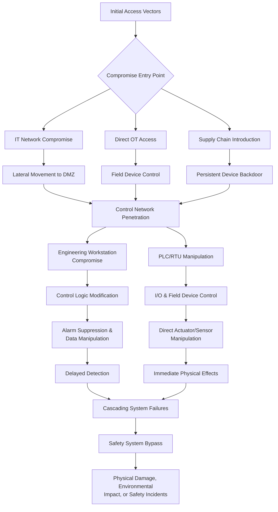

 

## 5. Real-World Incident Analysis

| Incident | Year | Sector | Attack Vector | Primary Impact | Key Lessons |
|----------|------|--------|---------------|----------------|-------------|
| **Ukraine Power Grid** | 2015 | Energy | Spear-phishing, BlackEnergy malware, scheduled disconnect commands | 230,000 customers without power for 1-6 hours | Coordinated IT/OT attacks can cause widespread outages; need for resilient distribution systems |
| **Oldsmar Water Treatment** | 2021 | Water | Compromised TeamViewer credentials, HMI access | Attempted chemical overdose (prevented by operator) | Secure remote access controls; operator vigilance as last line of defense |
| **Triton/Trisis** | 2017 | Industrial | Safety controller compromise via engineering workstation | Safety Instrumented System disablement | Safety systems require independent security protection; defense-in-depth essential |
| **FrostyGoop Heating** | 2024 | Municipal | Router compromise, Modbus protocol manipulation | Heating disruption for 600 buildings in winter | Perimeter security critical; industrial protocol security often inadequate |
| **Colonial Pipeline** | 2021 | Energy | Compromised VPN credentials, business IT ransomware | Pipeline operations halted for 5 days | IT/OT interconnectivity risks; business disruption from IT attacks |

 

## 6. Risk Prioritization & Mitigation Framework

### 6.1 Risk Assessment Matrix

| Threat Category | Likelihood | Safety Impact | Operational Impact | Priority | Primary Mitigations |
|-----------------|------------|---------------|-------------------|----------|---------------------|
| Ransomware/ICS Malware | High | Medium-High | High | Critical | Air-gapped backups, network segmentation, application whitelisting |
| APT Campaigns | Medium | High | High | High | Threat hunting, cross-domain monitoring, supply chain vetting |
| Insider Threats | Medium | High | Medium-High | High | Privileged access management, session recording, behavioral analytics |
| Physical Tampering | Medium | High | Medium | Medium-High | Physical security, device integrity checks, redundant sensing |
| DoS Attacks | Medium | Medium | High | Medium | Network QoS, redundant control paths, traffic shaping |
| Legacy Vulnerabilities | High | Medium | Medium-High | High | Network segmentation, virtual patching, modernization planning |
| Supply Chain Compromise | Low-Medium | High | High | High | Firmware signing, SBOM analysis, vendor security requirements |

### 6.2 Defense-in-Depth Strategy

* **Perimeter Security:** Industrial DMZ architecture, protocol-aware firewalls, secure remote access gateways
* **Network Segmentation:** Purdue model implementation, microsegmentation for critical assets, VLAN isolation
* **Endpoint Protection:** Application whitelisting, host intrusion prevention, device integrity verification
* **Monitoring & Detection:** OT-specific SIEM, anomaly detection based on operational baselines, threat intelligence integration
* **Incident Response:** Safety-integrated response plans, forensic capabilities for OT systems, recovery procedures with safety validation
* **Governance:** Security policies addressing OT specifics, regular risk assessments, third-party security requirements

 

## 7. Deployment Checklist for CPS Security

### 7.1 Foundational Requirements

- [ ] **Asset Inventory:** Complete inventory of all CPS assets including make, model, firmware version, and network connectivity
- [ ] **Network Architecture Documentation:** Current network diagrams showing all zones, conduits, and data flows
- [ ] **Security Zones:** Implementation of Purdue Model/ISA-62443 zones with enforced boundaries
- [ ] **Access Control:** Role-based access control for all human and system access to CPS components
- [ ] **Patch Management:** Process for security patch evaluation, testing, and deployment for OT systems

### 7.2 Technical Controls

- [ ] **Network Segmentation:** Firewalls and access control lists enforcing inter-zone communications
- [ ] **Monitoring:** OT-aware network monitoring, security information and event management (SIEM)
- [ ] **Endpoint Security:** Application control, removable media restrictions, host firewall configurations
- [ ] **Physical Security:** Access controls for control rooms, field devices, and network infrastructure
- [ ] **Backup & Recovery:** Regular backups of control system configurations with tested restoration procedures

### 7.3 Operational Practices

- [ ] **Incident Response Plan:** Documented procedures for security incidents addressing safety implications
- [ ] **Change Management:** Formal process for all changes to CPS including security impact assessment
- [ ] **Vendor Management:** Security requirements for third-party vendors with remote access
- [ ] **Training:** Regular security training for operations, engineering, and maintenance personnel
- [ ] **Exercises:** Tabletop exercises combining safety and security scenarios

 

## 8. Conclusion and Strategic Recommendations

Cyber-Physical Systems security requires fundamentally different approaches than traditional IT security due to the direct physical consequences of compromise. Organizations must adopt integrated security programs that address the unique characteristics of CPS:

1. **Integrate Security with Safety:** Security controls should be validated within safety cases and safety instrumented systems should be protected as high-value targets.

2. **Adopt Defense-in-Depth Architectures:** Implement layered security controls across physical, network, host, and application levels with particular attention to IT/OT convergence points.

3. **Implement Continuous Monitoring:** Deploy OT-aware security monitoring capable of detecting anomalies in control system behavior rather than relying solely on signature-based detection.

4. **Prepare for Incident Response:** Develop and regularly exercise incident response plans that address both cybersecurity and physical safety considerations.

5. **Manage Third-Party Risks:** Establish robust security requirements for vendors and supply chain partners, with particular attention to remote maintenance access.

6. **Plan for Long Lifecycles:** Develop technology refresh roadmaps that address security throughout the extended lifecycle of CPS components.

The convergence of digital and physical systems will continue to accelerate, making CPS security not merely a technical concern but a fundamental requirement for public safety, economic stability, and national security. Organizations that proactively address these threats through comprehensive, risk-based security programs will be best positioned to operate safely and resiliently in an increasingly connected world.

<br><br><br><br>

<h1 align="center">Navigating the Convergence: A Technical Guide to Cyber-Physical Systems Security in a Traditional IT World.</h1>

<h3 align="center">Understanding the Fundamental Paradigms, Architectural Imperatives, and Safety-Critical Requirements that Differentiate CPS Defense.</h3>

<br>

 

### **Executive Summary**

The digital transformation of critical infrastructure, manufacturing, and healthcare has converged the once-isolated realms of Information Technology (IT) and Operational Technology (OT), giving rise to Cyber-Physical Systems (CPS). While IT security is a mature discipline, directly applying its principles to CPS can introduce catastrophic risks. CPS security is distinguished by its foundational requirement to ensure **physical safety, real-time deterministic performance, and operational resilience** over multi-decade lifecycles. This document, authored from the perspective of a senior CPS defense engineer, delineates the core philosophical and technical divergences between IT and CPS security. It provides a structured framework, actionable controls, and deployment-ready guidance to architect defenses that protect both data and the physical world it now controls.

 

### **Table of Contents**

1.  **The Paradigm Shift: From Data-Centric to Safety-Centric Security**
2.  **Core Divergences: A Detailed Technical Analysis**
3.  **Comparative Analysis: IT vs. CPS Security at a Glance**
4.  **Architectural Implications: Layered Defense in a CPS World**
5.  **Risk Mitigation: Mapping CPS-Specific Threats to Controls**
6.  **Deployment Readiness Checklist for CPS Security Programs**
7.  **Conclusion and Strategic Recommendations**
8.  **Document Revision History**

---

### **1. The Paradigm Shift: From Data-Centric to Safety-Centric Security**

Traditional IT security is architected around the CIA Triad—Confidentiality, Integrity, and Availability—with a predominant focus on protecting data and services from compromise. The impact model is largely digital: financial loss, data breach, reputational damage, and service disruption. Cyber-Physical Systems fundamentally alter this model by introducing a direct, real-time bridge between the cyber and physical domains. In a CPS, a security incident is not merely a data event; it is a potential **physical event**. The compromise of a controller can result in kinetic consequences—equipment destruction, environmental harm, or loss of life. Therefore, CPS security must evolve the CIA triad into the **SIA-P Triad: Safety, Integrity, Availability, and Physical Robustness**, where security controls are evaluated not just for their cryptographic strength, but for their impact on control loop stability and safe operational failure states.

 

### **2. Core Divergences: A Detailed Technical Analysis**

*   **The Imperative of Determinism and Real-Time Constraints**
    In IT systems, security functions like deep packet inspection or full-disk encryption operate with performance overheads that are managed but ultimately flexible. In CPS, control loops governing physical processes—from robotic assembly lines to grid frequency regulation—have hard real-time requirements. These systems depend on bounded Worst-Case Execution Times (WCET) and guaranteed maximum communication latencies to maintain stability. A security control that introduces non-deterministic latency, such as an intrusive software agent performing variable-time scans on a Programmable Logic Controller (PLC), can cause a deadline miss. This missed deadline is not a performance glitch; it is a safety event that can drive a physical process into an unsafe state, leading to automatic emergency shutdowns or hazardous conditions. Consequently, CPS security engineering demands lightweight, deterministic protections, often hardware-accelerated, validated through rigorous timing analysis and Hardware-in-the-Loop (HIL) testing.

*   **Safety as the Primary Objective and Consequence Model**
    The foremost priority in CPS is to prevent the system from entering a hazardous physical state. This elevates the integrity of sensor data and the availability of control commands to safety-critical status. A spoofed sensor reading indicating normal pressure in an over-pressurized vessel is not just a data integrity failure; it is a direct threat to life and infrastructure. Security risk assessments must therefore integrate directly with Process Hazard Analysis (PHA) and Safety Instrumented Systems (SIS) reviews. Mitigations are chosen not only for their efficacy against a threat actor but for their fail-safe behavior. For example, a network-based intrusion prevention system (IPS) must be configured to fail *open* for critical control traffic if its own processing fails, ensuring the physical process can continue to operate or shut down safely, albeit with potentially reduced cyber protection.

*   **Extended Lifecycles and the Legacy Integration Challenge**
    IT assets follow refresh cycles measured in years, with software patches deployed weekly or monthly. CPS assets, such as PLCs, RTUs, and medical imaging systems, are engineered for 15-30 year lifespans and are deeply embedded in complex, continuously operating processes. Frequent patching is often impossible due to vendor validation requirements, production schedules, and the risk of patching itself introducing instability. Security programs cannot rely on timely vendor updates. Instead, they must architect **compensating controls**: stringent network segmentation (following the Purdue Model), protocol normalization gateways, out-of-band monitoring, and "virtual patching" via network security controls that block exploits targeting known vulnerabilities in unpatched systems.

*   **Heterogeneous Ecosystems and Constrained Devices**
    An enterprise IT environment typically standardizes on x86/ARM architectures running common operating systems. A CPS is a tapestry of heterogeneous components: microcontrollers without an OS, real-time operating systems (RTOS), proprietary fieldbus protocols (e.g., Modbus, PROFINET), and legacy serial links. Many field devices have severe constraints on power, compute, and memory, precluding the use of standard IT security agents. This heterogeneity fractures the threat model and demands a defense-in-depth strategy tailored to each layer. Security may involve hardware-based root of trust for device integrity, protocol-aware firewalls at network boundaries, and behavioral anomaly detection on the SCADA/Historian layer, rather than deploying a uniform endpoint protection suite.

*   **Converged Governance: Bridging IT Standards and OT Safety Regulations**
    IT security governance is often structured around frameworks like ISO/IEC 27001 and the NIST Cybersecurity Framework (CSF), which are excellent for managing information risk but lack prescriptive guidance for operational safety. CPS security must comply with domain-specific regulatory frameworks that codify safety and security interdependencies, such as IEC 62443 for industrial automation, NERC CIP for the power grid, or FDA pre-market guidance for medical devices. A mature CPS security program does not choose one over the other; it creates a harmonized control set that satisfies the requirements of both IT governance and OT safety regulation, ensuring auditability and traceability from technical controls to safety outcomes.

 

### **3. Comparative Analysis: IT vs. CPS Security at a Glance**

| Attribute | Traditional IT Security | CPS (OT/Industrial) Security |
| :--- | :--- | :--- |
| **Primary Objective** | Protect confidentiality, integrity & availability of **data and IT services**. | Ensure **safety**, **integrity**, and **deterministic availability** of **physical processes**. |
| **Consequence of Failure** | Data loss/theft, financial impact, reputational damage, service downtime. | Physical harm, environmental damage, equipment destruction, loss of life, prolonged operational halt. |
| **Key Performance Requirement** | High throughput, low **average** latency. | Predictable, **bounded worst-case** latency and jitter (determinism). |
| **Patch & Update Management** | Frequent, automated patching cycles; rapid rollout expected. | Highly planned, infrequent, validated during maintenance windows; long-term legacy support required. |
| **Primary Asset Types** | Servers, workstations, laptops, network equipment, databases. | PLCs, RTUs, DCS, Sensors, Actuators, HMIs, SCADA, embedded controllers. |
| **Network Architecture Paradigm** | Flat/software-defined networks focused on data flow and user access. | Hierarchical, segmented (Purdue Model), focusing on control flow and zone isolation. |
| **Dominant Risk** | Data exfiltration, ransomware, credential theft. | Process disruption, equipment manipulation, safety system impairment. |
| **Incident Response Priority** | Contain spread, eradicate threat, recover data/services. | **Ensure continuous safety of physical process**, then contain threat in coordination with operations. |
| **Governance Frameworks** | ISO/IEC 27001, NIST CSF, CIS Controls. | IEC 62443, NERC CIP, API 1164, sector-specific safety standards. |

 

### **4. Architectural Implications: Layered Defense in a CPS World**

The following diagram illustrates the defense-in-depth model for CPS, highlighting critical security layers and their placement within a typical Purdue Model-inspired architecture.

```mermaid
flowchart TD
    subgraph L5[L5: Enterprise IT Zone]
        E[Business Systems<br/>ERP, CRM]
    end

    subgraph L4[L4: Site Business Zone]
        S[Site Historian<br/>& Business LAN]
    end

    L5 -- Firewall/DMZ --> L4

    subgraph L3_5[L3.5: DMZ<br/>(Security Mediation)]
        GW[Protocol Gateway<br/>& Data Diode]
        IDS[OT-Aware<br/>IDS/IPS]
    end

    L4 -- Controlled Data Flow --> L3_5

    subgraph L3[L3: Site Operations Zone]
        HMI[Human-Machine<br/>Interface HMI]
        ENG[Engineering<br/>Workstation]
    end

    L3_5 -- Enforced Segmentation --> L3

    subgraph L2[L2: Area Supervisory Zone]
        SCADA[SCADA Server<br/>/ Master Terminal]
    end

    L3 -- Supervisory Control --> L2

    subgraph L1[L1: Basic Control Zone]
        PLC[Programmable Logic<br/>Controller PLC]
        RTU[Remote Terminal<br/>Unit RTU]
    end

    L2 -- Control Commands --> L1

    subgraph L0[L0: Process Zone]
        SENS[Smart Sensors]
        ACT[Actuators<br/>& Drives]
    end

    L1 -- I/O Signals --> L0

    style L3_5 fill:#f9f,stroke:#333,stroke-width:2px
    style L0 fill:#ccf,stroke:#333,stroke-width:2px
    style L1 fill:#ccf,stroke:#333,stroke-width:2px

```

**Architectural Security Imperatives:**
*   **Zone & Conduit Segmentation (Layers 0-3.5):** Strict access control between Purdue levels is non-negotiable. The DMZ (Level 3.5) is critical for mediating IT-to-OT traffic, not merely routing it.
*   **Device Integrity (Layers 0-1):** Security begins at the edge. Implement secure boot, signed firmware, and physical tamper protection on controllers where feasible.
*   **Deterministic Network Protection:** Firewalls and IDS/IPS at OT boundaries must be "OT-aware," supporting industrial protocols and allowing rule-setting based on function codes and process parameters, not just IP addresses.
*   **Monitoring & Anomaly Detection:** Deploy passive, network-based monitoring in Levels 1-3 to establish behavioral baselines of normal process communication and detect deviations indicative of compromise or malfunction.

 

### **5. Risk Mitigation: Mapping CPS-Specific Threats to Controls**

| CPS-Specific Threat Vector | IT Security Parallel | Recommended CPS-Specific Controls |
| :--- | :--- | :--- |
| **Sensor/Actuator Spoofing** | Data falsification at rest or in transit. | **Network Segmentation,** **protocol whitelisting** at controllers, **sensor fusion** (cross-validate with redundant sensors), use of **time-series anomaly detection** on process values. |
| **Control Logic Manipulation** | Malware or unauthorized code execution. | **Application whitelisting** on controllers, **signed and verified logic downloads**, **change management** with multi-party authorization, **baselining and checksum verification** of runtime logic. |
| **Communication Latency/Jitter** | Network congestion causing application slowness. | **Quality of Service (QoS) prioritization** for control traffic, use of **deterministic Ethernet** (TSN), **hardware-accelerated cryptography**, and **validation of all security tools for WCET impact**. |
| **Exploitation of Legacy Protocols** | Exploitation of outdated services (e.g., SMBv1). | **Protocol gateways** to normalize traffic, **deep packet inspection firewalls** to filter malicious function codes, **network segmentation** to contain legacy assets. |
| **Insider Threat via Engineering Stations** | Privileged insider data access. | **Robust RBAC** tied to plant roles, **just-in-time access provisioning**, **full session auditing/recording** on engineering workstations, **removal of USB/media ports**. |
| **Supply Chain Compromise** | Compromised software libraries or hardware. | **Software Bill of Materials (SBOM)** analysis, **vendor security assessments**, **air-gapped acceptance testing** for new devices, **network behavioral baselining** post-deployment. |

 

### **6. Deployment Readiness Checklist for CPS Security Programs**

| Phase | Task | Description & Acceptance Criteria | Priority |
| :--- | :--- | :--- | :--- |
| **Visibility & Inventory** | Asset Discovery & Classification | Identify ALL CPS/OT assets (make, model, firmware, serial #) and classify them by Purdue Level and criticality to the process. | High |
| **Architecture & Segmentation** | Network Zoning Enforcement | Implement physical or logical firewalls between Purdue Levels, especially at the IT-OT boundary (DMZ). Verify no direct routes exist from IT to Level 2 or below. | High |
| **Access Control** | Secure Remote & On-site Access | Replace direct VPNs to OT assets with a **jump server/bastion host** in the DMZ. Enforce Multi-Factor Authentication (MFA) and privilege segregation for all users, including vendors. | High |
| **Device Integrity** | Endpoint Hardening | Disable unused ports/services on controllers and HMIs. Implement application whitelisting. Begin a program for secure boot and firmware signing where supported by asset refresh cycles. | Medium |
| **Monitoring & Detection** | OT-Aware Security Monitoring | Deploy a passive network monitoring solution capable of decoding industrial protocols. Establish baselines for normal process communication and configure alerts for significant deviations. | High |
| **Incident Response** | Safety-Integrated Playbooks | Develop and document IR playbooks **in collaboration with operations and safety engineers**. Define clear safety-first procedures for containment that avoid triggering unsafe process states. | High |
| **Process & Governance** | Integrated Risk Management | Form a cross-functional **OT Security Council** with IT, OT, and Safety leadership. Map existing controls to both IT (NIST) and OT (IEC 62443) frameworks to identify coverage gaps. | Medium |

 

### **7. Conclusion and Strategic Recommendations**

Securing Cyber-Physical Systems is not an extension of IT security; it is a distinct discipline that marries cybersecurity engineering with safety engineering and control system theory. To build an effective CPS defense program, organizations must start by acknowledging this paradigm shift. The path forward requires:

1.  **Fostering Cross-Disciplinary Collaboration:** Break down silos between IT, OT, and Safety teams. Establish joint governance and integrated processes.
2.  **Adopting a Safety-First Security Model:** Evaluate every security decision—from technology selection to incident response actions—through the lens of its impact on physical process safety and operational resilience.
3.  **Architecting for Determinism and Legacy:** Design networks and select security tools that respect real-time constraints and provide protective "shields" for legacy and un-patchable assets.
4.  **Building Progressive Maturity:** Begin with foundational visibility and segmentation, then layer on advanced controls like anomaly detection and secure remote access, continuously validating against safety and operational requirements.

Investing in these CPS-specific principles mitigates the unique risks of converged environments, protecting both our digital information and the physical infrastructure upon which society depends.


<br><br><br><br>

<h1 align="center">Securing Cyber-Physical Systems: A Defense Engineer's Analysis of Critical Challenges.</h1>

 

<br>


## Executive Summary

The convergence of digital control systems with physical processes defines Cyber-Physical Systems (CPS), creating a unique and critical security paradigm. Unlike traditional IT environments, securing a CPS requires a holistic engineering approach that simultaneously addresses cybersecurity, operational safety, physical reliability, and stringent performance constraints. The core challenge lies in protecting systems where a digital exploit can have immediate, dangerous physical consequences. This analysis distills the nine most pressing challenges faced by CPS defenders, drawing from authoritative standards and real-world operational experience. These challenges are not isolated; they form a complex, interconnected risk landscape that demands coordinated mitigation strategies spanning technology, processes, and people. Success hinges on moving beyond IT-centric security models to embrace CPS-specific principles of resilience, safety-integrated design, and lifecycle-aware risk management.

 

## 1. Taxonomy of Core CPS Security Challenges

The following table categorizes the fundamental challenges, their primary impact, and the resultant risk to system integrity.

| Challenge Category | Underlying Cause | Primary Consequence | Associated Risk Profile |
| :--- | :--- | :--- | :--- |
| **1. Extended Lifecycles & Patching Limitations** | Devices deployed for 20+ years; vendor support ends; safety recertification needed for updates. | Persistent, unpatched vulnerabilities in "orphaned" operational assets. | High likelihood of exploit with major operational/safety impact. |
| **2. Resource Constraints** | Low-power MCUs, sensors, and actuators with limited CPU, memory, and energy budgets. | Inability to run standard security controls (e.g., crypto) without violating operational constraints. | Increased attack surface due to weakened or absent security controls. |
| **3. Real-Time & Safety-Critical Demands** | Control loops require deterministic, bounded latency; missed deadlines cause instability. | Security tools that introduce jitter or delay can trigger unsafe physical states. | Safety incidents or process failures induced by security mechanisms. |
| **4. Heterogeneity & Interoperability Gaps** | Multi-vendor environment with proprietary protocols, legacy systems, and custom stacks. | Inconsistent security posture and blind spots; difficult to apply uniform policies. | Exploitation of weakest-link components and protocol-level attacks. |
| **5. Systemic Interdependencies** | Tight coupling across cyber and physical domains creates complex "systems-of-systems." | Cascading failures where a fault in one subsystem propagates widely. | High-consequence, large-scale outages from a single point of compromise. |
| **6. Supply Chain Compromise** | Risk of tampering (hardware Trojans, malicious firmware) during manufacturing or distribution. | Introduction of persistent, deep-rooted backdoors that evade network defenses. | Fundamental loss of trust in system components; extremely difficult remediation. |
| **7. Inadequate Visibility & Monitoring** | OT network traffic and asset behavior differ from IT; lack of CPS-aware tools and inventory. | Delayed or missed detection of intrusions and anomalies. | Extended dwell time for adversaries, increasing damage potential. |
| **8. Human Capital & Organizational Silos** | Shortage of talent skilled in both OT engineering and cybersecurity; cultural IT/OT divides. | Misconfigurations, slow incident response, and security-safety trade-offs poorly managed. | Increased operational errors and ineffective security governance. |
| **9. Regulatory & Standards Fragmentation** | Overlapping mandates (IEC 62443, NIST SP 800-82, NERC CIP, etc.) with differing requirements. | Compliance burden distracts from actual risk reduction; inconsistent control implementation. | Audit failures and a check-box mentality that leaves gaps in defense. |

 

## 2. Deep Dive Analysis: Challenges, Implications, and Mitigations

### 2.1. The Legacy Conundrum: Extended Device Lifecycles and Patching Paralysis
*   Cyber-Physical Systems are built on operational technology (OT) assets like Programmable Logic Controllers (PLCs) and Remote Terminal Units (RTUs) engineered for extreme longevity, often exceeding 20-30 years. This lifespan far outpaces the vendor support and security update cycle for the embedded software they run. Applying a standard security patch is rarely trivial; it often necessitates a full stop of the physical process, thorough safety re-certification, and on-site technician intervention—operations that are costly and disruptive. Consequently, organizations are forced to operate a fleet of devices with known, unpatched vulnerabilities, creating a predictable and persistent attack surface for adversaries. Mitigation requires a shift from a pure patching strategy to a defense-in-depth model centered on compensating controls. This includes enforcing strict network segmentation to contain legacy assets, deploying intrusion prevention systems (IPS) for virtual patching at network boundaries, and implementing passive, OT-aware monitoring to detect exploitation attempts against unpatchable systems. Furthermore, security must be integrated into procurement and lifecycle planning, favoring vendors that commit to long-term support and design for secure, modular field updates.

### 2.2. The Physics of Limitation: Resource Constraints on Edge Devices
*   A vast portion of a CPS comprises resource-constrained edge devices: battery-powered sensors, microcontroller-based actuators, and low-power communication modules. These devices lack the computational horsepower, memory, or energy reserves to implement standard cryptographic algorithms (like AES-256-GCM) or run complex security agents. Imposing such overhead can drain batteries prematurely, increase latency beyond acceptable bounds, or simply exceed available processing cycles, directly threatening the system's primary function. The security implication is a forced trade-off between protection and performance, often leading to disabled security features. The mitigation path is threefold. First, adopt **Lightweight Cryptography (LWC)** standards such as the NIST-selected Ascon family, designed specifically for authenticated encryption with minimal overhead. Second, architect systems to offload intensive security operations to more capable hardware, such as using secure cryptographic co-processors or performing deep inspection at gateway levels. Third, employ adaptive security models where the intensity of cryptographic checks is dynamically scaled based on perceived threat level or operational mode, preserving resources during normal operation.

### 2.3. The Tyranny of Time: Real-Time and Safety-Critical Imperatives
*   At the heart of every CPS is a control loop that must execute within a guaranteed, deterministic timeframe—its Worst-Case Execution Time (WCET). Whether regulating voltage on a power grid or engine pressure in an aircraft, missing a timing deadline by milliseconds can cause instability, equipment damage, or safety hazards. Traditional IT security controls are notoriously non-deterministic; deep packet inspection, on-the-fly decryption/re-encryption, and extensive logging can introduce variable and unpredictable latency, making them unsuitable for deployment within real-time control paths. Therefore, security cannot be an afterthought bolted onto a validated control system; it must be co-engineered with timing and safety requirements from the outset. Mitigations include the use of hardware-based security (Trusted Execution Environments, memory protection units) that enforce policies with minimal timing impact, placing monitoring and inspection tools on out-of-band network taps rather than in-line, and rigorously testing all security functions within a Hardware-in-the-Loop (HIL) simulation to validate they do not violate timing or safety envelopes.

### 2.4. The Integration Maze: Heterogeneity and Protocol Interoperability
*   A typical CPS is a tapestry of components from dozens of vendors, spanning decades of technological generations. This ecosystem includes legacy serial fieldbuses (Modbus RTU, PROFIBUS), modern industrial Ethernet protocols (PROFINET, EtherNet/IP), and proprietary vendor-specific stacks. This heterogeneity creates severe interoperability challenges for security. Uniform policy enforcement is difficult, asset discovery and management become complex, and many legacy protocols were designed without any security features (e.g., authentication, encryption). The strategy to overcome this is not to replace everything but to manage the complexity. Deploy protocol-aware gateways and data diodes that can normalize traffic, apply security policies at translation points, and create secure perimeters around legacy zones. Gradually migrate towards modern, security-centric standards like OPC UA (with its built-in security model) where feasible. Most critically, establish and maintain an authoritative, automated asset inventory that understands both IT and OT device contexts to eliminate visibility blind spots.

### 2.5. The Domino Effect: Complex Interdependencies and Cascade Risk
*   CPS are rarely isolated; they function as interdependent systems-of-systems. A smart grid depends on communication networks, which depend on power. A manufacturing line's robotic cell depends on the upstream supply conveyor. This interdependence creates pathways for cascading failures, where a compromise or fault in one subsystem triggers a chain reaction of failures in others, potentially leading to large-scale collapse. Attackers can exploit these couplings to amplify the impact of an attack. Defending against this requires a resilience engineering mindset. Security architects must work with system designers to map critical dependencies, design in fail-operational or fail-safe states, and implement compartmentalization to isolate faults. Digital twin technology is a powerful tool here, allowing teams to model interdependencies and simulate the effects of cyber-attacks or failures to understand systemic risk and design appropriate containment strategies before deployment.

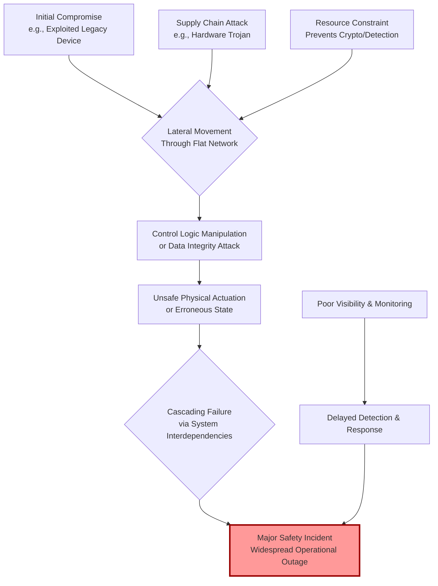

### 2.6. The Foundation of Trust: Supply Chain and Third-Party Risks
*   CPS security is fundamentally undermined if the hardware and software components themselves cannot be trusted. The supply chain presents multiple attack vectors: hardware Trojans (malicious modifications integrated during chip fabrication), counterfeit components with substandard or backdoored firmware, and compromised software libraries or firmware updates delivered from trusted vendors. These threats are particularly insidious as they establish a foothold behind traditional network and endpoint defenses. Mitigation demands a formal Cyber Supply Chain Risk Management (C-SCRM) program aligned with frameworks like NIST SP 800-161. This includes conducting rigorous security assessments of suppliers, requiring a Software Bill of Materials (SBOM) for all software components, enforcing code signing and cryptographic verification of firmware updates, and, for critical components, employing hardware root of trust and attestation mechanisms to verify device integrity at boot and during operation.

### 2.7. Operating in the Dark: Gaps in Visibility and Effective Monitoring
*   Many CPS environments suffer from a profound lack of situational awareness. IT-centric Security Information and Event Management (SIEM) systems cannot parse proprietary OT protocols, leading to either a complete blind spot or an avalanche of meaningless alerts. Furthermore, organizations often lack a complete, accurate inventory of what devices are on their OT networks, their configuration state, and their normal communication patterns. This "visibility gap" allows adversaries to operate undetected for extended periods. Closing this gap requires specialized tools. Operators must deploy passive, OT-aware network monitoring solutions that can decode industrial protocols, establish behavioral baselines, and detect anomalies indicative of compromise (e.g., a PLC receiving commands from an unauthorized engineering workstation). This visibility data must then be integrated into SOC workflows, empowering analysts with the context needed to distinguish between a network reconnaissance scan and a normal maintenance operation.

### 2.8. The Human Dimension: Skills Shortages and Organizational Friction
*   The cybersecurity industry faces a well-documented talent shortage, but the gap is especially severe for CPS/OT security, which requires a rare blend of control systems engineering, network architecture, and cybersecurity expertise. This shortage is exacerbated by persistent organizational silos: IT security teams prioritize confidentiality and integrity, while OT engineering teams prioritize availability and safety. These differing priorities can lead to conflict, slow decision-making, and security controls being deployed in ways that jeopardize operations. Mitigation involves both cultural and structural change. Organizations should invest in cross-training programs to build mutual understanding and create dedicated OT Security Engineer roles that sit at the intersection of both worlds. Incident response playbooks must be co-developed and regularly exercised by joint IT-OT teams to ensure response actions are both effective from a security perspective and safe from an operational standpoint.

### 2.9. The Compliance Labyrinth: Navigating Multiple Standards and Regulations
*   CPS operators must comply with a complex, often overlapping web of standards and regulations. An industrial manufacturer may need to align with IEC 62443 for automation security, NIST Cybersecurity Framework for overall governance, and NIST SP 800-82 for OT guidance, while also facing sector-specific regulations. This fragmentation creates significant overhead, risks "checkbox compliance" that doesn't reduce real risk, and can lead to confusion over control priorities. The effective approach is to adopt a risk-based, unified compliance framework. Map the controls from all applicable standards to a single, consolidated risk register and control set. Use automation to collect evidence and generate audit reports, reducing manual effort. Focus compliance activities on protecting identified high-value assets and mitigating the most probable high-impact attack scenarios, ensuring that the compliance program directly supports the overarching mission of safe and secure operations.

 

## 3. Strategic Mitigation Roadmap

| Priority Level | Challenge Focus | Recommended Actions | Key Standards for Guidance |
| :--- | :--- | :--- | :--- |
| **Foundational (Immediate)** | Visibility & Lifecycle | 1. Conduct comprehensive OT asset discovery.<br>2. Implement network segmentation (Zones/Conduits).<br>3. Establish an accurate asset inventory & network topology map. | IEC 62443-3-2, NIST SP 800-82r2 |
| **Operational (Short-Term)** | Monitoring & Response | 1. Deploy OT-specific network anomaly detection (IDS).<br>2. Develop and exercise joint IT-OT incident response playbooks.<br>3. Begin cross-training IT and OT staff. | NIST CSF (Respond, Recover), ISA/IEC 62443-2-4 |
| **Tactical (Mid-Term)** | Secure Architecture & Supply Chain | 1. Enforce secure remote access (MFA, jump hosts).<br>2. Implement Software Bill of Materials (SBOM) review.<br>3. Design new projects with lightweight crypto and hardware security modules. | NIST SP 800-161r1 (C-SCRM), NIST SP 800-232 (LWC) |
| **Strategic (Long-Term)** | Resilience & Culture | 1. Develop and utilize digital twins for security/safety testing.<br>2. Integrate security requirements into procurement and lifecycle contracts.<br>3. Establish a dedicated OT security team and governance board. | NIST SP 1500 Series (CPS Framework), ISA/IEC 62443-2-1 |

 

## 4. Deployment Readiness Checklist

Use this checklist to validate core security posture before and during CPS deployment.

**Governance & Lifecycle**
- [ ] A formal, risk-based OT security policy has been established and approved by both IT and OT leadership.
- [ ] Security requirements (including support lifespan and patch capabilities) are included in all new hardware/software procurement.
- [ ] A process exists for managing the security of legacy and end-of-life devices (e.g., segmentation, monitoring).

**Architecture & Segmentation**
- [ ] A logical network diagram following a Purdue Model or Zones/Conduits architecture is documented and current.
- [ ] Network segmentation (firewalls, VLANs) is implemented to isolate OT cells from IT and from each other.
- [ ] All remote access (vendor, employee) requires multi-factor authentication and is brokered through a secured jump host.

**Visibility & Monitoring**
- [ ] A comprehensive, automated asset inventory of all OT devices (make, model, firmware) is maintained.
- [ ] Passive, OT-protocol-aware network monitoring is deployed in critical zones.
- [ ] Established baselines for normal network traffic and process behavior exist.

**Incident Preparedness**
- [ ] Incident response playbooks specific to OT environments and safety implications have been developed.
- [ ] A communication plan involving IT security, OT operations, and safety officers is in place.
- [ ] Regular tabletop exercises involving both IT and OT personnel are conducted.

**Supply Chain & Development**
- [ ] Critical component suppliers are vetted for their security practices.
- [ ] A process for requesting and reviewing SBOMs for new software/firmware is operational.
- [ ] Firmware/configuration update processes require cryptographic verification of integrity.

 

## 5. Conclusion

Securing Cyber-Physical Systems is a multidimensional engineering challenge that defies simple, off-the-shelf solutions. It requires a paradigm shift from viewing security as a software overlay to treating it as an intrinsic system property, co-equal with safety, reliability, and performance. The challenges of long lifecycles, resource constraints, real-time demands, and systemic complexity are not merely inconveniences; they are first-order design constraints that must be addressed through architecture, specialized technology, and interdisciplinary collaboration. By adopting a lifecycle-aware, defense-in-depth strategy that prioritizes asset visibility, network segmentation, OT-aware monitoring, and supply chain integrity—all while bridging the human and organizational divides—organizations can build resilient CPS capable of operating safely and securely in an increasingly hostile threat landscape. The path forward is one of continuous integration, where security informs every stage from design and procurement to deployment, operation, and decommissioning.


<br><br><br><br>

<h1 align="center">A Practical Guide to Cyber-Physical Systems (CPS) Security Standards and Frameworks.</h1>

 

<br>
 

## Executive Summary

Securing **Cyber-Physical Systems (CPS)**—the integrated networks of computation, networking, and physical processes—requires a specialized, multi-layered approach that conventional IT security strategies cannot address. These systems, which include **industrial control systems (ICS)**, smart grids, medical devices, and autonomous vehicles, directly impact the physical world, making their security a matter of safety, reliability, and operational continuity. This guide provides a structured overview of the essential standards and frameworks that form the cornerstone of a robust CPS defense strategy. By mapping the landscape from operational technology (OT) and information security to functional safety, we equip security professionals and engineers with the knowledge to build resilient, compliant, and secure CPS architectures.

## 1. Understanding the CPS Security Landscape

Cyber-Physical Systems represent a fundamental convergence where digital commands control physical outcomes. This integration creates a unique and expanded attack surface where a cyber breach can lead to **physical damage**, **operational disruption**, or **safety hazards**. The security challenge is compounded by the confluence of diverse technologies, legacy equipment, and the critical need for real-time, uninterrupted operation.

*   **The Core Challenge: Bridging IT and OT:** A primary hurdle in CPS security is the traditional divergence between Information Technology (IT) and Operational Technology (OT) priorities. IT teams typically emphasize data **confidentiality** and integrity, while OT teams are fundamentally concerned with system **availability** and safety to ensure continuous physical processes. This conflict can lead to fragmented security policies. Effective CPS security demands a unified strategy that reconciles these objectives, ensuring security measures do not impair the real-time performance and reliability of physical operations.
*   **Beyond IT Tools:** Traditional IT security solutions are often unsuitable for CPS environments. They may disrupt fragile OT protocols, fail to interpret proprietary industrial communications, or lack the visibility into specialized devices like Programmable Logic Controllers (PLCs). Consequently, securing CPS necessitates frameworks and controls specifically designed or adapted for industrial and embedded systems, focusing on resilience and safe operation under adverse conditions.
*   **A Multi-Standard Approach:** No single standard comprehensively addresses all facets of CPS security. Instead, a defense-in-depth posture is built by leveraging a suite of complementary frameworks. These can be categorized into: **Operational Technology Security** (e.g., ISA/IEC 62443, NIST SP 800-82), **Information Security Management** (e.g., ISO/IEC 27001), **Functional Safety** (e.g., ISO 26262), and overarching **Risk Management Frameworks** (e.g., NIST CSF). The following sections and visual mapping detail how these standards interact to provide holistic coverage.

The following chart maps how key standards apply across the different lifecycle stages and responsibility areas of a CPS:
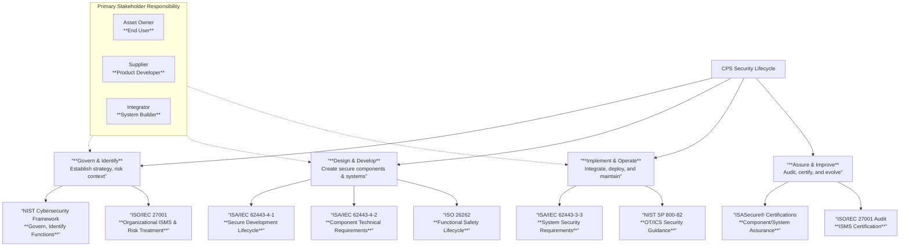

## 2. Foundational Standards for Operational Technology (OT) & Industrial Security

This category encompasses the most direct and critical guidance for securing the systems that monitor and control physical processes.

### ISA/IEC 62443 Series: The Global Benchmark for IACS Security
The ISA/IEC 62443 series is the world's only consensus-based set of standards specifically designed for Industrial Automation and Control Systems (IACS) security. It adopts a holistic, risk-based approach that bridges operational technology and information technology.

*   **Comprehensive Structure:** The standards are organized into four logical groups: **General** (concepts and models), **Policies and Procedures** (security management for asset owners and service providers), **System Requirements** (risk assessment and design for integrators), and **Component Requirements** (secure development lifecycle for suppliers). This structure acknowledges **shared responsibility** across different stakeholder groups—asset owners, product suppliers, system integrators, and service providers.
*   **Key Concepts: Zones, Conduits, and Security Levels:** A core methodology involves segmenting the IACS network into **security zones** (grouping assets with similar security requirements) and regulating communication between them through protected **conduits**. Requirements are defined based on **Security Levels**, which specify target levels of protection against escalating capability of attackers.
*   **Certification and Assurance:** The ISA Security Compliance Institute (ISCI) offers **ISASecure®** certifications based on these standards. These include certifications for components, systems, and supplier development processes, providing independent assurance of cybersecurity robustness.

### NIST SP 800-82: Practical Guidance for OT/ICS Security
NIST Special Publication 800-82, "Guide to Industrial Control Systems (ICS) Security," is a foundational document providing detailed guidance on securing ICS, including SCADA, DCS, and PLC systems. Its third revision notably expands the scope from ICS to the broader domain of **Operational Technology (OT)**, encompassing building automation, transportation, and physical access control systems.

*   **Practical Focus:** The guide offers actionable recommendations, including an overview of OT/ICS topologies, identification of common threats and vulnerabilities, and recommended security countermeasures and architectures.
*   **Bridging with Other Frameworks:** It provides crucial alignment with other standards, including the NIST Cybersecurity Framework, and offers tailoring guidance for applying the comprehensive NIST SP 800-53 security controls to OT environments. It even includes a dedicated OT overlay to help establish security control baselines for systems of varying impact levels.

## 3. Information Security Management Systems (ISMS)

While OT standards address the "operational" environment, ISMS frameworks establish the overarching organizational governance and risk management discipline necessary for sustained security.

### ISO/IEC 27001: The Global Standard for Information Security Management
ISO/IEC 27001 is the internationally recognized standard specifying the requirements for establishing, implementing, maintaining, and continually improving an **Information Security Management System (ISMS)**. An ISMS is a systematic approach to managing sensitive company information so that it remains secure, encompassing people, processes, and IT systems.

*   **Risk-Based Philosophy:** The standard mandates that organizations systematically assess information security risks, considering threats, vulnerabilities, and impacts. They must then design and implement a comprehensive suite of controls to treat unacceptable risks. This **Plan-Do-Check-Act** model ensures continuous adaptation to the evolving threat landscape.
*   **Certification and Trust:** Organizations can choose to be audited and certified against ISO/IEC 27001 by accredited bodies. This certification provides a credible, independent demonstration to stakeholders—clients, regulators, and partners—that the organization manages information security risks according to international best practices. With over 70,000 certificates reported globally in 2022, it is a widely adopted benchmark of security maturity.

### NIST Cybersecurity Framework (CSF) 2.0: A Risk Management Blueprint
The NIST Cybersecurity Framework provides a voluntary, high-level framework for managing cybersecurity risk. It is particularly valuable for aligning cybersecurity activities with business requirements, risk tolerances, and resources. The CSF 2.0 is organized around six core functions: **Govern, Identify, Protect, Detect, Respond, and Recover**.

*   **Flexible Implementation:** The CSF is not a prescriptive checklist but a flexible tool. Organizations can create "Profiles" to align the framework's outcomes with their specific business needs and risk environment. It is widely used across critical infrastructure sectors and is explicitly referenced and aligned with by more technical guides like NIST SP 800-82.
*   **Sector-Specific Profiles:** NIST develops and encourages sector-specific profiles (e.g., for manufacturing) that tailor the CSF's core guidance to address unique risks, technologies, and regulatory requirements within an industry.

## 4. Functional Safety Standards: Integrating Safety and Security
For CPS, security failures can directly cause safety incidents. Therefore, integrating cybersecurity into the functional safety lifecycle is non-negotiable. These standards provide the engineering rigor for ensuring systems operate safely even when components fail.

### ISO 26262: Automotive Functional Safety
ISO 26262 is the paramount functional safety standard for road vehicles' electrical and electronic (E/E) systems. It mandates a rigorous, safety-oriented development process from specification through production release.

*   **Safety Lifecycle and ASILs:** The standard is based on a **safety lifecycle** encompassing management, development, production, operation, and decommissioning. Its central mechanism is the **Automotive Safety Integrity Level (ASIL)**, a risk classification (A to D) derived from hazard analysis considering severity, exposure, and controllability. Higher ASILs (e.g., D for braking systems) demand more stringent design and verification requirements.
*   **Convergence with Security:** While ISO 26262 traditionally focused on mitigating random hardware failures and systematic software errors, the rise of connectivity has made cybersecurity a critical prerequisite for functional safety. This drives the need to implement security controls (e.g., from ISA/IEC 62443 or ISO/SAE 21434) in parallel with the safety processes defined by ISO 26262 to protect safety-critical functions from malicious manipulation.

## 5. Comparison of Key CPS Security Standards

The table below provides a consolidated overview of the primary standards discussed, highlighting their distinct focus and application.

| Standard / Framework | Primary Scope & Focus | Key Industry Application | Certification / Conformance | Core Objective |
| :--- | :--- | :--- | :--- | :--- |
| **ISA/IEC 62443** | Holistic security for **Industrial Automation and Control Systems (IACS)** throughout their lifecycle. | Manufacturing, Energy, Water, Transportation, Building Automation. | **ISASecure®** certifications for components, systems, and development processes. | Establish a risk-based, zone-defended security posture for operational environments. |
| **NIST SP 800-82** | Practical guidance & safeguards for **Operational Technology (OT)**/ICS security, including architecture and controls. | Critical Infrastructure, Industrial sectors, Building Management. | Used as a guideline; can inform audits. Often used to demonstrate due care. | Provide actionable recommendations to secure OT systems against prevalent threats. |
| **ISO/IEC 27001** | Requirements for an organization-wide **Information Security Management System (ISMS)**. | Universal (IT and OT-supporting functions across all sectors). | Accredited third-party **ISO/IEC 27001 certification** available. | Systematically manage information security risks to ensure confidentiality, integrity, and availability of data. |
| **NIST CSF 2.0** | High-level, risk-based **cybersecurity risk management** framework organized around six core functions. | Critical Infrastructure, Government, Private Sector (all sizes). | Voluntary self-assessment or gap analysis. Profiles demonstrate alignment. | Align cybersecurity strategy with business needs and manage risk in a structured, flexible manner. |
| **ISO 26262** | **Functional safety** lifecycle for automotive E/E systems, focusing on hazard and risk management. | Automotive (Passenger vehicles, expanding to trucks, buses, motorcycles). | Demonstrated compliance through documentation and process adherence; often required by OEMs. | Ensure safety of E/E systems by mitigating risks from systematic failures and random hardware faults. |

## 6. Implementing a Cohesive CPS Security Strategy

Successfully navigating this multi-standard landscape requires a strategic, phased approach.

1.  **Establish Governance and Context:** Begin with the **NIST CSF** or **ISO/IEC 27001** to gain executive buy-in and establish the governance structure, risk management methodology, and organizational context for your CPS security program. This sets the "why" and the "how" at a management level.
2.  **Assess the Operational Environment:** Conduct a detailed assessment of your CPS/OT environment using the guidance in **NIST SP 800-82**. Identify assets, network architecture, data flows, and existing vulnerabilities. Simultaneously, apply the **zoning and conduit** methodology from **ISA/IEC 62443** to logically segment your operational network.
3.  **Define Target Security Levels:** For each identified zone, determine the required **Security Level (SL)** from ISA/IEC 62443 based on your risk assessment. This defines the target of protection and guides the selection of specific technical and process controls.
4.  **Select and Implement Controls:** Map your security requirements to specific controls. Use the system and component requirements from **ISA/IEC 62443-3-3** and **-4-2** for OT-specific measures. For overarching IT and organizational controls, use Annex A of **ISO/IEC 27001** or the controls from **NIST SP 800-53**, tailored for OT via the NIST overlay. For automotive or safety-critical CPS, integrate the **safety lifecycle and ASIL requirements of ISO 26262** in parallel.
5.  **Pursue Assurance and Continuously Improve:** For critical components or systems, consider **ISASecure® certification** for third-party assurance. For the overall security program, aim for **ISO/IEC 27001 certification**. Regularly review and audit your security posture against your chosen frameworks, using incidents and audits as inputs for continual improvement of your ISMS and OT security practices.

## 7. Conclusion

The security of Cyber-Physical Systems is a complex but manageable challenge that demands a convergence of specialized knowledge from operational technology, information security, and functional safety disciplines. By strategically leveraging the complementary strengths of frameworks like **ISA/IEC 62443** for OT defense, **ISO/IEC 27001** for organizational governance, **NIST CSF** for risk management, and **ISO 26262** for safety assurance, organizations can construct a coherent and resilient security posture. This integrated approach ensures that as CPS continue to drive innovation across industries, they do so on a foundation of trust, safety, and security, protecting both our digital and physical worlds from evolving threats.


<br><br><br><br>

<h1 align="center">A Comprehensive Framework for Cyber-Physical System (CPS) Security: Best Practices for Resilience.</h1>

<br>

## Executive Summary

Cyber-Physical System (CPS) security is a critical discipline that merges information technology (IT) cybersecurity with the operational technology (OT) governing physical processes. The convergence of these domains introduces unique risks where a cyber incident can lead to physical consequences, including safety hazards, environmental damage, and operational shutdowns. Effective CPS defense requires a holistic, defense-in-depth strategy that integrates architectural controls, proactive vulnerability management, robust monitoring, and a security-first culture. This document outlines a structured set of best practices, grounded in established frameworks such as NIST SP 800-82 and IEC 62443, to guide organizations in building and maintaining resilient, secure CPS infrastructure.

## 1. Foundational Security Architecture & Network Segmentation

A secure architecture is the cornerstone of CPS defense, designed to contain breaches and limit adversarial movement.

*   **Implement a Defense-in-Depth Strategy:** Relying on a single security layer is insufficient for critical infrastructure. A defense-in-depth approach employs multiple, overlapping controls across physical, network, host, application, and data layers. This ensures that if one control fails, subsequent layers provide continued protection, thereby increasing the adversary's work factor and creating opportunities for detection and response before a safety-impacting event occurs.
*   **Define and Enforce Security Zones and Conduits:** Segment the OT network into distinct security zones based on criticality and function (e.g., Safety, Basic Control, Supervisory, Demilitarized Zone (DMZ), Enterprise). Data exchange between zones must occur through controlled conduits, typically enforced by next-generation firewalls (NGFWs) or unidirectional gateways. A DMZ between the IT and OT networks is essential to broker all communications, preventing direct exposure of control system assets to enterprise networks.
*   **Apply the Principle of Least Privilege at the Network Level:** Configure firewall rules and Access Control Lists (ACLs) to permit only explicitly authorized traffic flows—specified by protocol, source, destination, and port—between zones. Regularly audit these rules to eliminate any unnecessary "allow any" policies that accumulate over time, which significantly reduces the network attack surface and impedes lateral movement.

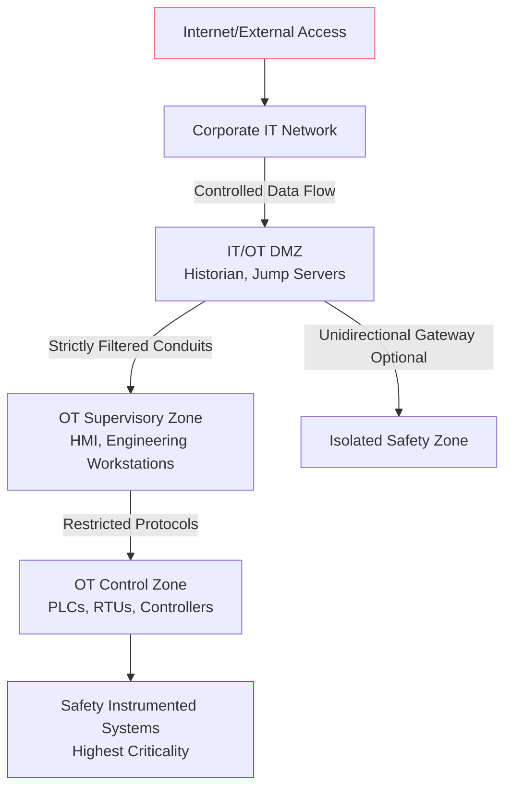

## 2. Proactive Vulnerability & Patch Management

Given the long lifecycles and sensitivity of CPS assets, a standardized yet flexible approach to vulnerability management is required.

*   **Maintain a Comprehensive, Dynamic Asset Inventory:** You cannot secure what you do not know exists. Establish and continuously update a detailed inventory of all CPS assets, including controllers, field devices, network equipment, and software. This inventory must track make, model, firmware version, network address, physical location, and criticality to operations and safety, forming the foundation for all subsequent risk management activities.
*   **Adopt a Risk-Based Prioritization Model for Remediation:** Not all vulnerabilities pose equal risk to a CPS. Prioritize patching and mitigation efforts based on a combined assessment of the Common Vulnerability Scoring System (CVSS) score and the operational impact of exploitation. Focus first on assets that are internet-exposed, have known exploits, or interface directly with safety systems, as their compromise could lead to immediate physical consequences.
*   **Establish a Safe Validation and Deployment Pipeline:** Never deploy patches directly to the live operational environment. Utilize an isolated testbed or digital twin to validate that patches do not disrupt control logic, real-time performance, or safety functions. For legacy or safety-certified systems that cannot be patched, implement compensating controls such as virtual patching via intrusion prevention systems (IPS), strict network segmentation, and enhanced monitoring to mitigate the risk.

**Table: Vulnerability Response Matrix for CPS Assets**

| Asset Criticality | Patch Available & Safe to Apply | Patch Available but Risky | No Patch Available (Legacy) |
| :--- | :--- | :--- | :--- |
| **High (Safety-Critical)** | Schedule immediate, validated deployment in maintenance window. | Isolate asset further; test extensively in simulator; prepare rollback plan. | Enforce maximum compensating controls: micro-segmentation, IPS virtual patch, heightened monitoring. |
| **Medium (Operational)** | Deploy in planned maintenance cycle following validation. | Assess operational risk vs. security benefit; implement temporary network-based controls. | Apply network segmentation and monitor for exploit-related behavior. |
| **Low (Informational)** | Deploy per standard IT patch management cycle. | Standard validation and deployment. | Apply standard security perimeter controls. |

## 3. Identity, Access Management & Zero Trust

Controlling who and what can interact with CPS components is paramount to preventing unauthorized access and manipulation.

*   **Enforce Strong, Multi-Factor Authentication (MFA):** Mandate MFA for all human and non-interactive service accounts accessing the CPS environment, especially for remote access and privileged actions. This dramatically reduces the risk of account compromise via stolen or weak credentials, adding a critical layer of defense for systems where unauthorized access can have immediate physical effects.
*   **Implement Granular Role-Based Access Control (RBAC):** Define user roles aligned with job responsibilities (e.g., Operator, Engineer, Maintenance, Vendor) and assign the minimum necessary permissions to each role. Regularly review and audit user privileges, especially after role changes, to ensure the principle of least privilege is maintained over time and that excessive access does not accumulate.
*   **Adopt Zero Trust Principles for CPS:** Move beyond the traditional "trust but verify" model. A Zero Trust Architecture (ZTA) for CPS assumes no implicit trust is granted based on network location. It requires continuous verification of every device and user, strict access enforcement based on dynamic policies (considering device health, user role, and request context), and comprehensive logging of all sessions to enable thorough audit and investigation.

## 4. Continuous Monitoring & Threat Detection

Visibility into CPS network and process behavior is essential for early threat identification and response.

*   **Deploy ICS-Aware Network Monitoring Tools:** Utilize intrusion detection/prevention systems (IDS/IPS) and passive network monitoring solutions that deeply understand industrial protocols (e.g., Modbus/TCP, DNP3, OPC UA, PROFINET). This protocol awareness allows for accurate detection of malicious command injections, parameter manipulation, and anomalous communication patterns that generic IT tools would miss, while minimizing false positives.
*   **Leverage Behavioral Anomaly Detection:** Supplement signature-based tools with machine learning (ML) and statistical models that learn normal baselines for network traffic, process variable states, and controller commands. These systems can detect subtle, novel attacks or insider threats that deviate from established operational patterns, such as unauthorized setpoint changes or abnormal sequences of operations.
*   **Integrate Threat Intelligence and Frameworks:** Contextualize detected anomalies using threat intelligence feeds and frameworks like MITRE ATT&CK for ICS. Mapping activity to known adversary tactics, techniques, and procedures (TTPs) transforms raw alerts into actionable intelligence, guiding investigators and improving the speed and efficacy of the response.

## 5. Secure Development Lifecycle & Supply Chain Assurance

Security must be ingrained from the earliest stages of system design and extend through the entire supply chain.

*   **Institutionalize a Secure Development Lifecycle (SDLC):** Integrate security activities—including threat modeling, secure coding practices, static/dynamic application security testing (SAST/DAST), and penetration testing—into every phase of CPS software and firmware development. This proactive approach, as guided by NIST SP 800-64, is far more cost-effective and secure than attempting to bolt security onto a finished product.
*   **Implement Rigorous Cyber Supply Chain Risk Management (C-SCRM):** Vet all third-party suppliers, software components, and hardware for security practices. Require software bill of materials (SBOM), enforce code-signing to ensure integrity, and verify firmware updates through cryptographic attestation. This mitigates the risk of introducing vulnerabilities or malicious code via compromised suppliers, an increasingly common attack vector.
*   **Apply IoT & Embedded Device Security Standards:** For component development and procurement, adhere to established security requirements such as the IEC 62443 series for industrial automation and control systems (IACS) and the OWASP IoT Top 10. Key practices include implementing secure boot, hardware-backed cryptographic storage, secure and resilient update mechanisms, and the disabling of unused ports and services.

## 6. Physical Security & Integrated Incident Response

CPS security is inherently cyber-physical; logical attacks can be enabled by physical access, and cyber incidents require physically-aware response.

*   **Implement Layered Physical Security Controls:** Protect critical hardware (controllers, networking gear, workstations) with concentric layers of security: perimeter fencing, controlled facility access, locked control rooms and server cabinets, and tamper-evident seals. The goal is to deter, detect, and delay any unauthorized physical access that could lead to device tampering or the installation of malicious hardware.
*   **Develop and Exercise CPS-Specific Incident Response Plans:** Generic IT incident response plans are inadequate. CPS plans must integrate with operational safety procedures, involve OT personnel, and include steps for fail-safe or graceful shutdowns. Establish clear communication channels with equipment vendors and relevant government agencies like CISA. Regularly conduct tabletop and functional exercises that simulate combined cyber-physical scenarios to validate plans and improve team coordination.
*   **Foster a Cross-Domain Security Culture:** Bridge the traditional IT-OT divide through joint training programs. OT staff must understand fundamental cybersecurity risks, while IT security personnel must learn operational constraints and safety priorities. This shared understanding is crucial for effective collaboration during both daily security operations and incident response, ensuring that security measures enhance rather than compromise operational safety and reliability.

## Conclusion: Building a Resilient CPS Defense Posture

Securing Cyber-Physical Systems is a continuous journey, not a one-time project. It requires a strategic blend of modern cybersecurity principles adapted to the unique constraints and imperatives of physical operations. By architecting a segmented network, proactively managing vulnerabilities, enforcing strict access controls, maintaining vigilant monitoring, securing the development supply chain, and integrating physical with cyber defense, organizations can build a resilient posture. Adherence to frameworks like NIST SP 800-82 and IEC 62443 provides a structured path forward. Ultimately, the goal is to ensure the availability, integrity, and safety of critical operations in an increasingly connected and threatened world, safeguarding both infrastructure and the communities it serves.

<br><br><br><br>

<h1 align="center">The Tangible Fallout: Analyzing the Consequences of Cyber-Physical System Breaches.</h1>

<br>
 
## **Executive Summary**

A breach of a Cyber-Physical System (CPS) represents a catastrophic convergence of digital and physical risk. Unlike traditional IT incidents, a CPS compromise directly threatens the machinery, processes, and environments we depend on for energy, manufacturing, healthcare, and transportation. This documentation synthesizes real-world incidents and data to detail the multi-domain consequences of such breaches, which escalate from immediate physical damage to long-term organizational and societal harm. Understanding this cascading impact profile is the first critical step in building effective, resilient defenses for our increasingly interconnected critical infrastructure.

 
## **1. Introduction: The Unique Threat of CPS Compromise**

Cyber-Physical Systems integrate computational algorithms and physical components, where software directly controls or monitors tangible processes. This fusion creates unparalleled efficiency but also introduces profound vulnerabilities. A breach here is not merely a data theft event; it is an attack on the physical world. Adversaries can manipulate control logic, override safety systems, and command industrial processes to achieve destructive outcomes. The following sections delineate the consequential domains impacted, supported by historical precedent and empirical cost data.

## **2. Domain Analysis of Breach Consequences**

### **2.1. Physical Damage and Equipment Destruction**

The most direct consequence of a CPS breach is the infliction of physical harm upon machinery and infrastructure. Attackers achieve this by sending malicious commands to Programmable Logic Controllers (PLCs), Industrial Control Systems (ICS), or other actuators.

*   **Mechanical Sabotage:** Sophisticated malware can command equipment to operate far beyond its designed tolerances, leading to immediate and catastrophic failure. The seminal example is the **Stuxnet worm**, which specifically targeted Siemens PLCs governing uranium enrichment centrifuges in Iran. By covertly altering rotational speeds, it caused approximately 1,000 centrifuges to physically degrade and destroy themselves, setting back nuclear capabilities by years. This was not an accident; it was a precision cyber-weapon designed to cause unambiguous physical damage.
*   **Control Logic Subversion:** Attacks employing **false sequential logic** can inject malicious command sequences into Supervisory Control and Data Acquisition (SCADA) systems. This can cause valves to open or close at the wrong time, motors to start or stop erratically, or safety interlocks to be bypassed entirely. The result is often irreversible mechanical failure, unplanned shutdowns, and the need for costly component replacement, extending downtime far beyond the initial cyber event.

### **2.2. Environmental Hazards and Contamination**

CPS often manage the flow, processing, and containment of hazardous materials. Compromising these systems can trigger spills, leaks, and emissions with severe ecological repercussions.

*   **Case Study – Colonial Pipeline Spill (2020):** While initially caused by a mechanical failure, the subsequent response was severely hampered by a prior cyber-attack on Colonial Pipeline's business systems, which crippled communication and operational visibility. This incident underscores how a CPS-adjacent breach can exacerbate a physical disaster. The resultant leak of over **272,580 gallons of gasoline** required a **$10.3 million cleanup** and long-term environmental monitoring, demonstrating the direct link between cyber incidents and ecological liability.
*   **Broader Implications:** A successful attack on systems controlling chemical plants, water treatment facilities, or pipeline pressure could deliberately trigger catastrophic environmental events, leading to pollution, public health crises, and devastating regulatory and civil penalties.

### **2.3. Operational Disruption and Systemic Downtime**

The primary objective of many attacks, particularly ransomware, is to halt operations to extort payment. The operational technology (OT) environment is exceptionally sensitive to such disruptions.

*   **Ransomware Surge:** The industrial sector has become a prime target. Recent reports indicate an **87% surge in ransomware attacks** against industrial organizations, with manufacturing bearing the brunt. These attacks encrypt or compromise critical control servers and engineering workstations, forcing complete production line stoppages that can last for weeks.
*   **Critical Infrastructure Outages:** Malware can be designed for maximum disruption. **Industroyer**, deployed against Ukraine's power grid in 2016, directly communicated with substation breakers using legacy industrial protocols, successfully cutting power to one-fifth of Kyiv. Similarly, the 2021 **Colonial Pipeline ransomware attack** shut down the largest fuel pipeline in the U.S. for days, causing widespread fuel shortages and economic panic. These events prove that CPS breaches can weaponize operational disruption against national and economic security.

### **2.4. Financial Loss and Economic Impact**

The financial toll of a CPS breach is staggering, often an order of magnitude greater than a typical IT breach due to combined costs of incident response, physical repair, operational downtime, and recovery.

*   **Elevated Breach Costs:** According to the 2024 IBM Cost of a Data Breach Report, the average cost for a data breach in the **industrial sector is $5.56 million**, which is **18% higher than the global average** of $4.88 million across all sectors. This premium reflects the unique complexities and expenses associated with restoring physical operations.
*   **Direct Loss Examples:** The 2019 ransomware attack on global aluminum giant **Norsk Hydro** resulted in direct costs exceeding **$70 million**. This figure encompassed the shift to manual operations, lost production, system restoration, and extensive cybersecurity remediation efforts. It serves as a benchmark for the potential financial scale of a determined attack on a major industrial operator.

### **2.5. Regulatory Penalties and Reputational Harm**

Organizations operating critical infrastructure are bound by stringent and evolving cybersecurity regulations. A breach often exposes compliance failures, leading to severe penalties.

*   **Regulatory Action:** In 2024, **Sellafield Ltd**, the operator of a UK nuclear site, was fined **£332,500** after pleading guilty to serious cybersecurity failures that left critical safety systems exposed. This highlights regulatory bodies' increasing willingness to impose significant fines for inadequate CPS security postures.
*   **Reputational Collateral Damage:** Beyond fines, the loss of stakeholder trust can be irreversible. Customers, partners, and investors lose confidence in an organization's ability to operate safely and reliably. This reputational harm can lead to lost contracts, declining stock value, and increased scrutiny from boards and insurers, creating a long-term strategic disadvantage.

### **2.6. Privacy Risks and Safety Compromises**

In sectors like healthcare, CPS breaches pose a dual threat: the compromise of highly sensitive personal data and direct risks to human safety.

*   **Mass Data Exposure:** Healthcare CPS, including imaging systems and patient monitors, are repositories of Protected Health Information (PHI). Breaches in this sector are rampant, with one 2024 report noting over **183 million patient records** exposed in a single year due to attacks on healthcare entities and their vendors.
*   **Medical Device Hijacking ("Medjacking"):** Attackers exploit vulnerabilities in FDA-certified medical devices (e.g., insulin pumps, MRI machines) to gain a persistent foothold in hospital networks. This allows for the exfiltration of PHI and, alarmingly, introduces the potential for direct patient harm if device functionality is maliciously altered.

## **3. Consequence Interdependence and Cascading Effects**

The consequences of a CPS breach are rarely isolated. They cascade and amplify across domains, as visualized below:

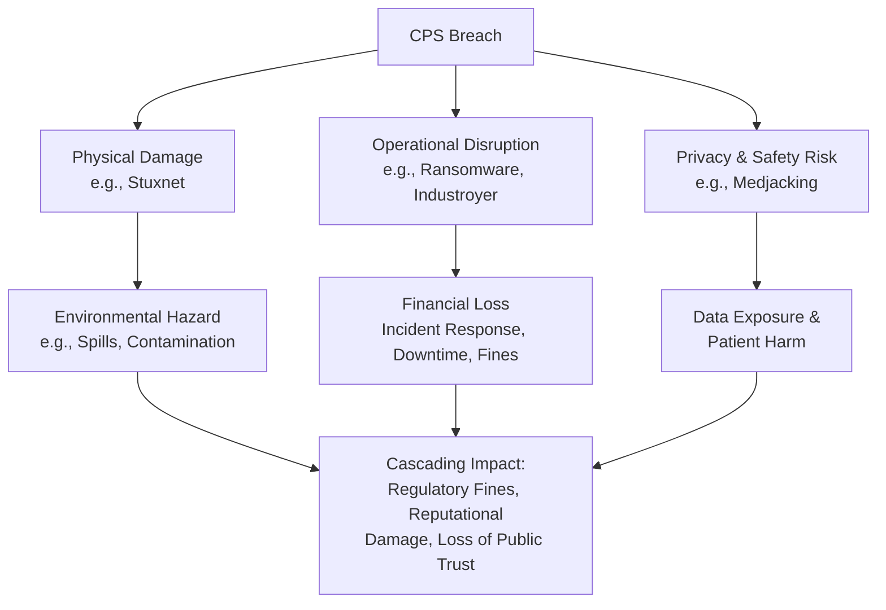

## **4. Mitigation Framework: From Understanding to Resilience**

Acknowledging these severe consequences mandates a proactive and integrated defense strategy. The following table outlines key mitigation pillars aligned against the primary consequences:

| Consequence Domain | Recommended Mitigation Strategies |
| :--- | :--- |
| **Physical & Environmental** | **Safety-instrumented system (SIS) segregation;** robust change management for control logic; integrity checking for actuator commands; environmental monitoring alarms. |
| **Operational Disruption** | **Comprehensive OT network segmentation;** air-gapped backups; ransomware-resistant architecture; incident response playbooks tested via tabletop exercises. |
| **Financial & Regulatory** | **Cyber insurance with OT-specific coverage;** proactive compliance auditing (e.g., NERC CIP, NIS2); investment in predictive maintenance and redundancy. |
| **Privacy & Safety** | **Strict medical/ICS device lifecycle management;** network segmentation for sensitive data zones; application allowlisting; regular security assessments for FDA-certified devices. |

## **5. Conclusion**

The consequences of a Cyber-Physical System breach are profound and multidimensional, transcending data loss to encompass physical destruction, environmental harm, societal disruption, and threats to human safety. The interconnected nature of these systems means impacts cascade rapidly, amplifying financial and reputational damage. The historical record—from Stuxnet to Colonial Pipeline—provides unequivocal evidence of this evolving threat landscape.

For organizations operating critical infrastructure, moving beyond conventional IT security is not optional; it is an operational imperative. Building resilience requires a fundamental understanding of these consequences and a committed investment in a defense-in-depth strategy tailored to the unique fragility of the cyber-physical interface. The goal is clear: to secure not just our data, but the very physical processes upon which modern society depends.

<br><br><br><br>

<h1 align="center">A Multi-Layered Approach to Intrusion Detection in Cyber-Physical Systems.</h1>

<br>
 
## Executive Summary

Intrusion detection in Cyber-Physical Systems (CPS) presents a unique challenge, merging the complexities of information technology (IT) networks with the critical, real-time demands of operational technology (OT) and physical processes. A single-method approach is insufficient due to the sophisticated and evolving threat landscape targeting industrial control systems (ICS), SCADA networks, and IoT-enabled infrastructure. This document outlines a comprehensive, defense-in-depth strategy, detailing the synergistic application of signature-based, anomaly-based, specification-based, and advanced correlation techniques to achieve robust, resilient detection capabilities. Success hinges on integrating these methods into a coherent security architecture that provides visibility across IT, OT, and physical layers, enabling timely identification and mitigation of threats before they cause operational disruption or physical damage.

 
## 1. Introduction: The CPS Detection Challenge

Cyber-Physical Systems are inherently vulnerable due to their convergence of cyber and physical domains. Attacks can manifest as data manipulation, control logic subversion, or denial-of-service, with consequences ranging from production loss to equipment destruction and safety incidents. Traditional IT security tools often fail in OT environments due to proprietary protocols, real-time constraints, and the potential for false positives to trigger catastrophic operational interventions. Therefore, effective intrusion detection must be context-aware, multi-faceted, and designed for the unique characteristics of CPS, including deterministic communication, legacy device limitations, and the paramount importance of safety and availability.

 

## 2. Core Intrusion Detection Methodologies

A robust CPS Intrusion Detection System (IDS) employs a blend of complementary techniques. The following table summarizes the primary methodologies, their mechanisms, strengths, and limitations.

| **Methodology** | **Core Mechanism** | **Primary Strength** | **Key Limitation** | **Ideal Use Case** |
| :--- | :--- | :--- | :--- | :--- |
| **Signature-Based** | Pattern matching against known attack signatures. | High accuracy for known threats; low false positives. | Blind to novel (zero-day) attacks; requires constant updates. | Detecting known malware, exploit attempts, and protocol abuses. |
| **Anomaly-Based** | Statistical or ML models of normal behavior flag deviations. | Can detect novel, stealthy, and zero-day attacks. | Potentially high false positives; requires training period. | Monitoring process variable behavior, network traffic volumes, and user activity. |
| **Specification-Based** | Enforces formal rules and models of allowed system behavior. | Low false positives; based on system design logic. | Requires deep system knowledge to create specifications. | Validating PLC ladder logic sequences and command-state legality. |
| **State-Based** | Tracks finite state machine transitions for illegitimacy. | Effective against control-flow attacks; logic-driven. | Complexity grows with system state space. | Protecting multi-stage industrial processes (e.g., batch reactors). |
| **Hardware Attestation** | Cryptographically verifies device firmware/software integrity. | Strong guarantee of device trustworthiness; tamper-resistant. | Requires specialized hardware (TPM, TEE); adds cost. | Verifying integrity of edge devices, PLCs, and gateways. |

### 2.1 Signature-Based Detection: The First Line of Defense
*   Signature-based detection operates as a high-precision filter for known threats. It involves scanning network packets, controller commands, or system logs for sequences that match patterns (signatures) documented in threat intelligence libraries. In CPS environments, this is particularly effective for detecting misuse of industrial protocols like Modbus/TCP, DNP3, or PROFINET, such as unauthorized writes to critical holding registers or malformed packet structures designed to crash controllers. Its primary advantage is a low false-positive rate for documented attack vectors, allowing security teams to act on alerts with high confidence. However, its reactive nature is its fundamental weakness; it cannot identify zero-day exploits, sophisticated malware variants, or attacks that leverage legitimate commands for malicious purposes. Maintaining efficacy demands a rigorous process for signature updates and tuning to the specific operational technology stack in use.

### 2.2 Anomaly-Based Detection: Uncovering the Unknown
*   Anomaly-based detection systems proactively learn a baseline of "normal" system behavior across multiple dimensions, including network traffic patterns, sensor value ranges, control loop timings, and user interaction sequences. Using statistical analysis or machine learning (ML) models—such as autoencoders, isolation forests, or Long Short-Term Memory (LSTM) networks—these systems flag significant deviations from the established baseline. This approach is crucial for identifying zero-day attacks, insider threats, and slow, stealthy intrusions that manipulate physical processes subtly. The challenge lies in accurately modeling complex, potentially non-stationary industrial processes to minimize false alarms, which can lead to alert fatigue and operational disruption. Successful deployment requires careful feature engineering, contextual awareness of operational modes (e.g., startup vs. steady-state), and continuous model retraining to adapt to legitimate process changes.

### 2.3 Specification & State-Based Detection: Enforcing Design Intent
*   Specification-based and state-based detection are knowledge-driven approaches that enforce the intended design and operational logic of the CPS. Specification-based IDS uses formal models or rule sets defining correct system behavior (e.g., "Valve V101 can only open if Pump P205 is running and pressure sensor PS301 reads > 50 psi"). Any violation triggers an alert. State-based IDS (SIDS) models the system as a finite state machine, monitoring transitions between operational states (e.g., IDLE, HEATING, CRITICAL_REACTION, PURGE) and flagging any illegal or unexpected state change. These methods excel at detecting attacks that manipulate control logic or process sequences, offering very low false-positive rates as they are not based on statistical variance but on concrete design rules. The main barrier is the upfront investment required to create and maintain accurate specifications or state models, especially for large, heterogeneous, or legacy systems.

 
## 3. Advanced and Integrated Detection Strategies

To overcome the limitations of individual methods, modern CPS defense relies on layered and correlated strategies.

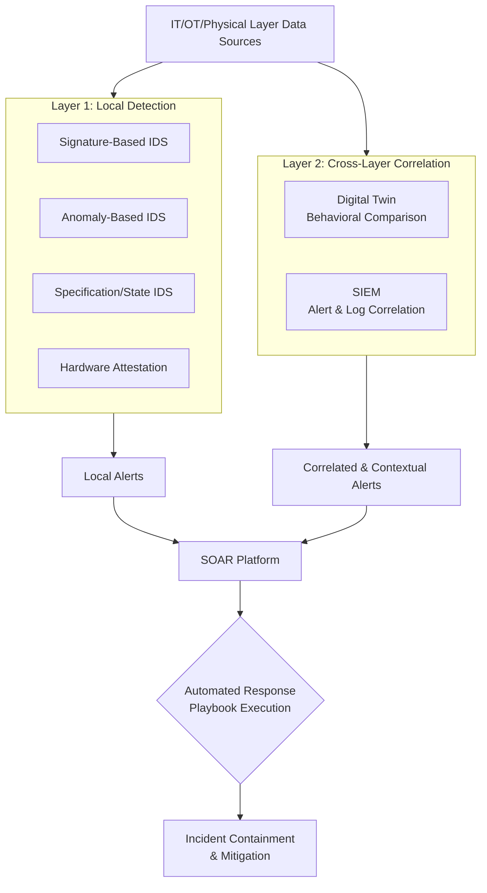

### 3.1 Hybrid Intrusion Detection Systems
*   Hybrid IDS architectures intelligently combine two or more core methodologies (e.g., signature, anomaly, and specification) to create a more robust and adaptive defense. A common implementation uses a fast, signature-based front end to filter known threats, while an anomaly-based engine analyzes remaining traffic for suspicious patterns. A specification-based module can then adjudicate ambiguous alerts by checking against system design rules. This fusion mitigates the weaknesses of individual approaches: it reduces the false-positive burden on anomaly detectors while extending coverage beyond the known-threat database of signature engines. The key to effective hybridization is a coherent correlation engine that can weigh evidence from different sources and present a unified, prioritized alert to analysts.

### 3.2 Hardware-Based Root of Trust and Attestation
*   Hardware-based security provides a foundational layer of trust upon which other detection methods rely. Utilizing Trusted Platform Modules (TPMs), hardware security modules (HSMs), or Trusted Execution Environments (TEEs), this approach performs cryptographic attestation. A remote verifier can challenge a device (e.g., a PLC or RTU) to produce a signed "quote" of its current firmware, boot configuration, and critical software measurements. Any unauthorized modification, such as the injection of malicious code, will alter these measurements and cause attestation to fail. This proactively prevents compromised devices from participating in the network, effectively stopping attacks at the endpoint before they can propagate or influence physical processes.

### 3.3 Cross-Layer and Multi-Source Data Fusion
*   Sophisticated attacks often span the IT, OT, and physical layers. An attacker might breach an IT workstation (IT layer), pivot to a engineering station (OT layer), and upload malicious logic to a PLC that causes abnormal physical vibrations (physical layer). Isolated layer-specific detectors may miss the broader campaign. Cross-layer analysis correlates events and data across these domains. For instance, a network anomaly alert coinciding with an unusual vibration sensor reading and a specific user login event creates a high-fidelity indicator of compromise. This requires a security information and event management (SIEM) system or a specialized CPS security analytics platform capable of ingesting and contextualizing diverse data streams to uncover these hidden relationships.

### 3.4 Digital Twins for Predictive and Comparative Detection
*   A digital twin is a high-fidelity, dynamic virtual model of a physical CPS asset or process. In security, it serves as a high-precision specification-based detector. By feeding real-time operational data (sensor values, control commands) into the twin, its simulated output represents the *expected* behavior of the physical system. A significant divergence between the twin's prediction and the actual system state signals a potential intrusion, malfunction, or degradation. Digital twins enable safe "what-if" attack simulation, facilitate forensic analysis by replaying incidents, and allow for the testing of patches and detection rules in a risk-free virtual environment before deployment to the live system.

 
## 4. Operationalizing Detection: The SIEM and SOAR Imperative

Detection technologies generate alerts; their operational value is realized through integration.

### 4.1 Centralized Visibility with SIEM
*   A Security Information and Event Management (SIEM) system is the central nervous system for CPS security monitoring. It aggregates, normalizes, and correlates logs and alerts from signature-based IDS, anomaly detectors, firewall logs, Windows event logs from HMIs, and even physical security systems. For CPS, an OT-aware SIEM is critical—one that understands industrial protocols, can parse PLC tag data, and contextualizes OT events within operational phases. This unified dashboard provides the situational awareness necessary to distinguish targeted attacks from routine anomalies, significantly reducing the mean time to detect (MTTD) an incident.

### 4.2 Automated Response with SOAR
*   The volume and velocity of threats necessitate automation. Security Orchestration, Automation, and Response (SOAR) platforms consume alerts from the SIEM and other sources, executing predefined playbooks to contain incidents rapidly. In a CPS context, automated responses must be designed with safety and operational continuity as paramount concerns. Playbooks may involve actions such as: isolating a compromised network segment by reconfiguring an industrial firewall, quarantining a suspect engineering workstation, triggering a safety instrumented system (SIS) to bring a process to a safe state, or creating a temporary patch rule on a network IDS. SOAR drastically reduces the mean time to respond (MTTR), limiting the attacker's dwell time and potential impact.

 
## 5. Conclusion: Building a Resilient CPS Detection Posture

No single silver bullet exists for CPS intrusion detection. Resilience is achieved through a **defense-in-depth strategy** that strategically layers and integrates the methods detailed above. The recommended approach begins with **asset visibility** and **hardware-rooted trust**, establishes **local detection** using hybrid signature/anomaly methods at key network boundaries and critical controllers, and implements **specification or state-based** guards for high-risk processes. This data is then fed into a **cross-layer correlation engine** (OT-SIEM) and contextualized against a **digital twin** where feasible. Finally, **orchestrated automated response** plans ensure swift, safe mitigation.

Continuous improvement is vital. Detection rules, ML models, and system specifications must be regularly reviewed and updated. Exercises and red-team engagements should test the entire detection and response pipeline. By adopting this comprehensive, layered framework, organizations can move from reactive security to a proactive, resilient stance capable of defending critical cyber-physical infrastructure against an evolving adversary.

<br><br><br><br>

<h1 align="center">The Transformative Role of AI and Machine Learning in Cyber-Physical System Security.</h1>

<br>
 
## Executive Summary

In the modern threat landscape, Cyber-Physical Systems (CPS)—which integrate computational algorithms with physical processes in sectors like energy, manufacturing, and transportation—face increasingly sophisticated attacks. Artificial Intelligence (AI) and Machine Learning (ML) have evolved from auxiliary tools to foundational technologies for CPS defense. They enable a shift from reactive, signature-based security to proactive, adaptive, and intelligent protection paradigms. By analyzing vast, multivariate data streams from sensors, networks, and control systems, AI/ML provides the capability to predict failures, detect subtle anomalies, simulate attacks, and maintain operational resilience under adversarial conditions. This document details the core roles, implementations, and governance frameworks essential for deploying AI/ML to secure our interconnected physical world.

## 1. Introduction: The AI-Driven Security Imperative for CPS

Cyber-Physical Systems form the backbone of critical infrastructure, where a security breach transcends data loss and can lead to physical damage, operational shutdowns, or threats to public safety. Traditional perimeter-based IT security tools are insufficient for the unique protocols, real-time requirements, and safety-critical nature of industrial control systems (ICS) and operational technology (OT). AI and ML address this gap by offering scalable, intelligent analysis tailored to the cyber-physical domain. These technologies learn the legitimate "baseline" behavior of complex systems, allowing them to identify deviations that may indicate a compromise, forecast equipment failures that could be exploited, and create dynamic digital simulations for safe testing and validation. The integration of AI into CPS security is not merely an enhancement but a necessary evolution to defend against adaptive adversaries.

## 2. Core Roles of AI/ML in CPS Security

### 2.1 Predictive Maintenance for Proactive Security
*   AI-driven predictive maintenance transcends its traditional role of optimizing uptime to become a critical security function. By applying ML models—such as neural networks, regression models, and survival analysis—to historical and real-time sensor data (e.g., vibration, temperature, pressure), engineers can forecast equipment degradation and incipient faults. A security-critical perspective recognizes that mechanical failures can create unsafe system states or be deliberately induced by an attacker to cause cascading damage. Proactively scheduling maintenance based on AI predictions not only prevents unplanned downtime but also eliminates windows of vulnerability where a system is in a degraded, more easily exploitable state. Techniques like Supervisory Just-in-Time Neural Networks (SJITNN) demonstrate high accuracy in predicting faults within SCADA environments, thereby hardening the overall resilience of the CPS by maintaining operational integrity.

### 2.2 Advanced Anomaly and Threat Detection
*   The core strength of ML in CPS security lies in its ability to perform sophisticated anomaly detection across both cyber (network traffic, logs) and physical (sensor readings, actuator states) domains. Unsupervised and semi-supervised learning algorithms, including autoencoders, isolation forests, and Long Short-Term Memory (LSTM) networks, learn the normal operational profile of a system without requiring labeled examples of attacks. This allows them to detect novel, zero-day, or stealthy attacks that evade signature-based tools. Furthermore, AI-powered Security Information and Event Management (SIEM) solutions for ICS/OT can correlate disparate data sources—firewall logs, PLC commands, and process historian data—at scale, providing a unified view of the threat landscape and significantly reducing alert fatigue by suppressing false positives through contextual awareness.

### 2.3 Countering Adversarial AI and Building Resilient ML
*   The adoption of AI by defenders inevitably leads to its weaponization by adversaries. Threats such as data poisoning (corrupting training data), evasion attacks (crafting inputs to fool a deployed model), and model extraction pose direct risks to AI-powered security tools. Research in adversarial ML for CPS, exemplified by frameworks like ConAML, studies attack generation under real-world physical constraints, informing the development of robust defenses. Building resilient ML architectures involves techniques like adversarial training, where models are trained on perturbed data, implementing redundancy through ensemble methods, and establishing continuous validation pipelines. Governance frameworks, including the NIST AI Risk Management Framework (AI-RMF), provide essential guidance on securing the AI lifecycle itself, ensuring the integrity and reliability of the very tools we depend on for protection.

### 2.4 AI-Enhanced Digital Twins for Simulation and Validation
*   Digital twins, virtual replicas of physical assets and processes, become exponentially more powerful when augmented with AI. An AI-enabled digital twin can run high-fidelity simulations to model control-loop dynamics, predict system responses under stress, and validate security patches or configuration changes in a risk-free, virtual environment. For security operations, the twin serves as a continuous validation engine; by comparing live system telemetry against the twin's simulated "ground truth," security teams can rapidly detect subtle deviations indicative of an attack or fault. This capability allows for proactive threat hunting, safe testing of incident response procedures, and a substantial reduction in the attack surface by preventing poorly vetted changes from reaching the production environment.

### 2.5 Explainable AI (XAI) for Trust and Forensic Analysis
*   The "black box" nature of complex ML models like deep neural networks is a significant barrier to adoption in safety-critical CPS environments, where operators and engineers require understanding to make informed decisions. Explainable AI methods address this by making model outputs interpretable. Techniques such as SHAP (SHapley Additive exPlanations) and LIME (Local Interpretable Model-agnostic Explanations) can highlight which sensor readings or network events contributed most to an anomaly alert. This transparency builds operator trust, accelerates forensic investigations by pinpointing root causes, and aids in regulatory compliance by providing auditable decision trails. XAI transforms AI from an opaque oracle into a collaborative diagnostic partner.

### 2.6 Governance, Standards, and Collaborative Defense
*   The successful and secure deployment of AI/ML in CPS cannot rely on technology alone; it requires robust governance and cross-sector collaboration. Standards and frameworks provide the necessary structure: NIST's AI-RMF offers a voluntary guide to manage risks and promote trustworthy AI development, while CISA's AI Cybersecurity Collaboration Playbook facilitates information sharing and joint response strategies between government and private sector entities. Adhering to these guidelines ensures that AI implementations are secure, accountable, and aligned with broader national and industry resilience goals. This collaborative, governance-led approach is vital for defending the interconnected ecosystems that underpin critical infrastructure.

## 3. Comparative Analysis of AI/ML Techniques in CPS Security

The table below summarizes key AI/ML applications, their primary functions, and associated challenges within the CPS security context.

| **AI/ML Application** | **Primary Security Function** | **Common Techniques** | **Key Challenges** |
| :--- | :--- | :--- | :--- |
| **Predictive Maintenance** | Preempt security-critical faults & maintain system integrity. | Neural Networks, Survival Analysis, Regression Models. | High-quality, labeled historical data required; integrating predictions into maintenance workflows. |
| **Anomaly Detection** | Identify novel & known threats in cyber & physical data streams. | Autoencoders, LSTMs, Isolation Forests, One-Class SVM. | Tuning sensitivity to minimize false positives/negatives; adapting to legitimate operational drift. |
| **Adversarial Resilience** | Protect ML models from poisoning, evasion, & extraction attacks. | Adversarial Training, Defensive Distillation, Ensemble Methods. | Evolving attacker capabilities; computational overhead of robust defenses. |
| **Digital Twins** | Safe attack simulation, patch validation, & continuous monitoring. | Physics-based Modeling, Reinforcement Learning, Data Fusion. | Creating and maintaining high-fidelity models; synchronization with physical asset. |
| **Explainable AI (XAI)** | Build trust, aid forensics, & ensure regulatory compliance. | SHAP, LIME, Counterfactual Explanations, Attention Maps. | Balancing explainability with model performance/accuracy. |

## 4. The Adaptive AI-Driven CPS Defense Lifecycle

The following flowchart illustrates how these AI/ML roles integrate into a continuous, adaptive security lifecycle for a Cyber-Physical System.

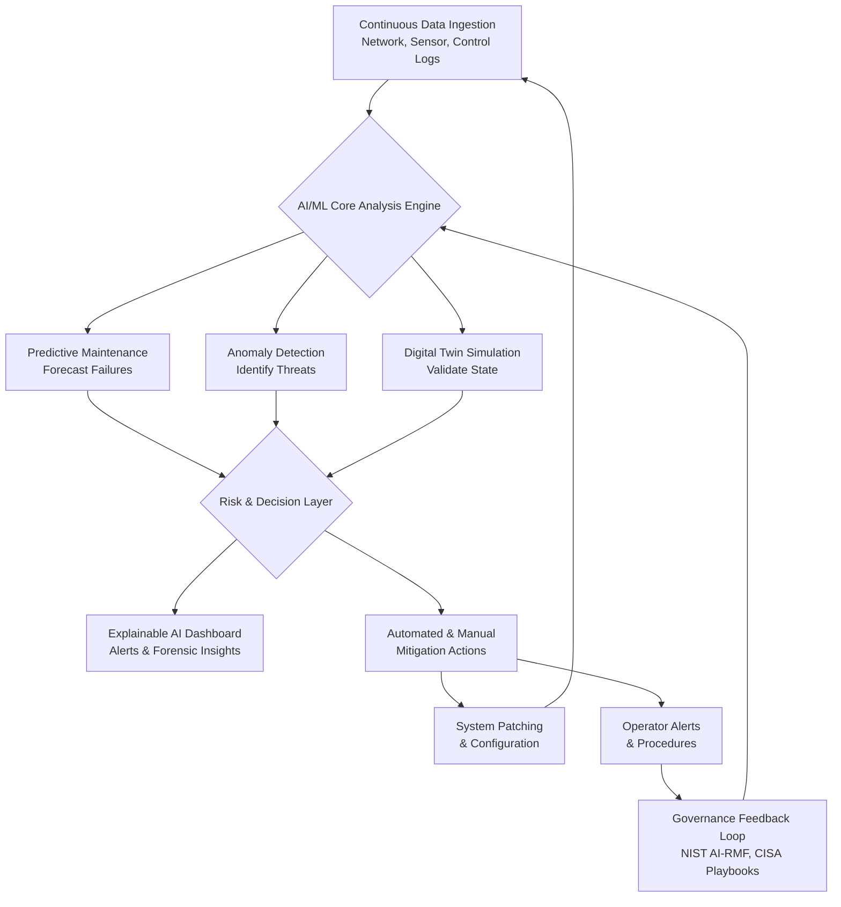

## 5. Future Directions and Challenges

The convergence of AI and CPS security is an ongoing journey. Future developments will likely focus on federated learning to train models on distributed data without compromising privacy, the use of reinforcement learning for autonomous incident response, and more seamless integration of XAI into Security Operations Center (SOC) workflows. Persistent challenges include the scarcity of high-quality, labeled attack data for CPS, the need for specialized AI hardware at the edge for real-time processing, and the critical importance of cultivating a workforce skilled in both cybersecurity and data science. Addressing these challenges is essential to fully realize the promise of intelligent, self-defending critical infrastructure.

## 6. Conclusion

AI and Machine Learning are fundamentally redefining the art of the possible in Cyber-Physical System security. They empower a proactive, intelligent, and resilient defense posture capable of anticipating failures, detecting unseen threats, and withstanding sophisticated adversarial campaigns. From predictive analytics and digital twins to explainable interfaces and robust governance, a holistic AI strategy is paramount. For organizations operating critical infrastructure, investing in these technologies and frameworks is no longer optional—it is a strategic imperative to ensure safety, reliability, and national security in an increasingly digital and adversarial world.

<br><br><br><br>

<h4 align="center">STAY TUNED FOR THE LATEST UPDATES!</h4>

<br><br>

<p align="center">
    <a href="https://github.com/mrsamrohan">
        
    </a>
</p>

<br><br><br><br>
