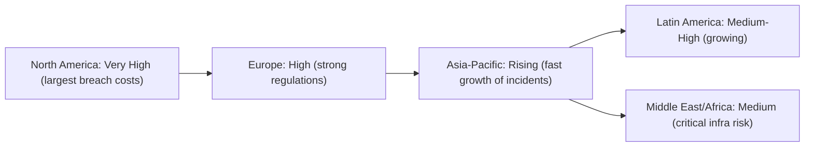

    

<h1 align="center">MR. SAM ROHAN</h1>
<h3 align="center">PRECISION IN EXECUTION - SUPREMACY IN IMPACT!</h3>

 

    

  

<h1 align="center">KEY INSIGHTS & NUMERICAL CATALOG 2020–2025.</h1>

 

**Economic Impact & Breach Statistics:**

1.  **Average Data Breach Cost:**  
    - **2020:** $3.86M → **2024:** $4.88M (**+26.4% increase**).  
    - **2025 Projection:** $5.2M (CAGR: 8–10%).  
2.  **Sector-Specific Costs (2023):**  
    - Healthcare: **$10.93M** (highest globally).  
    - Finance: $5.90M | Energy: $4.7M | Manufacturing: $4.8M.  
3.  **Global Cybercrime Damages:**  
    - Projected to exceed **$10 Trillion by 2025**.  
4.  **Ransomware Impact (2024):**  
    - Global cost: **$42B+** | **85%** target SMBs.  

 

**Threat Landscape Evolution:**

5.  **AI-Driven Threats:**  
    - Deepfake attacks: **1 every 5 minutes** (2024).  
    - AI document forgery: **+244% YoY** (2024).  
6.  **Phishing & Social Engineering:**  
    - Cause **~19%** of breaches | AI-enhanced phishing volume surging.  
7.  **IoT Vulnerabilities:**  
    - Billions of unsecured devices discovered daily.  
8.  **Supply Chain Risks:**  
    - **>33%** of breaches involve multi-environment data.  

 

**Workforce Crisis:**

9.  **Global Talent Shortfall (2024):**  
    - Workforce: **5.47M** | Demand: **10.23M** → Gap: **4.76M**.  
10. **Burnout & Retention:**  
    - **44%** of professionals report severe burnout.  
11. **Salary Benchmarks (2025):**  
    - CISSP Global Avg: **$119.6K** (NA: $147K | APAC: $71K).  
    - Entry-Level: **$80K–$100K** | Senior Roles: **$180K–$210K**.  

 

**Regional & Sectoral Vulnerabilities:**

12. **Highest Breach Costs by Region (2023):**  
    - USA: **$9.48M** | Middle East: **$8.07M** | India: **$2.18M**.  
13. **Sector Readiness (Conceptual):**  
    - High Maturity: Finance, Healthcare.  
    - Low Maturity: Smart Cities, Legacy Manufacturing.  
14. **Healthcare Sector (2020–2025):**  
    - **725 breaches** (2023) exposing **133M+ records**.  
    - Avg. cost: **$10M/breach** (2× finance sector).  

 

**Market Growth & Investment:**

15. **Global Cybersecurity Spending:**  
    - **2023:** $190–200B → **2028:** $298.5B (CAGR: **9.4%**).  
16. **High-Growth Segments:**  
    - IoT/OT Security: **33.5% CAGR** ($37.4B by 2030).  
    - Zero Trust: **23% CAGR** ($97B by 2030).  
    - Cloud Security: **44%** of software sales by 2027.  

 

**Strategic Defense Metrics:**

17. **Proven Cost Reducers:**  
    - Full security AI/automation deployment: **Saves $2.2M/breach**.  
    - Mature Zero Trust: **42% lower breach costs**.  
18. **Incident Response Efficiency:**  
    - AI-augmented teams contain breaches **98 days faster**.  

 

**Future Projections (2030+):**

19. **Quantum Threats:**  
    - Harvested encrypted health data at risk of future decryption.  
20. **Healthcare AI Risks:**  
    - Deepfake fraud, genomic blackmail, and automated ransomware negotiation.  
21. **Market Scale:**  
    - India’s cybersecurity market: **$46.93B by 2035** (18.3% CAGR).  

 

> **Key Takeaway:** Cyber risks are escalating faster than defenses. Prioritize AI-augmented security, Zero Trust architecture, workforce development, and cross-sector collaboration to close the 4.76M talent gap and mitigate trillion-dollar losses.

  

<h1 align="center">GLOBAL CYBERSECURITY LANDSCAPE AND IMPACT ANALYSIS 2020–2025.</h1>

 

**Economic and Sectoral Impact of Breaches:** Global cyberattack damages have surged over 2020–2024. The *average* cost of a data breach rose from **$3.86M in 2020** to **$4.88M in 2024**.  In 2024 alone IBM/Ponemon reports a 10% jump (to ~ $4.88M), the largest annual increase on record.  Losses include direct remediation (forensics, recovery), business disruption, regulatory fines, and reputational harm.  For example, healthcare breaches averaged **$10.93M** (2023) – roughly double the finance sector ($5.90M).  Critical infrastructure (energy, utilities) and manufacturing firms also see high costs (energy $4.7M; industrial/manufacturing $4.8M).  These costs often translate into physical disruptions (e.g. pipeline shutdowns) and customer attrition, eroding brand value.  (Cumulative global cybercrime costs are even larger: industry analysts project damages exceeding **$10 trillion** by 2025.)

**Sector examples:** Healthcare (highest breach costs, costly HIPAA compliance), Financial/Banking (heavy fines and fraud losses), Energy/Utilities (ransomware on pipelines/grids), Manufacturing (supply-chain disruption), Smart Cities/IoT (emerging attacks on transport, water, etc).

 

**Year-by-Year Breach Cost Trends. (2020–2024, Forecast 2025)**

| Year        | Global Avg. Breach Cost | Source (Ponemon/IBM) |
| ----------- | ----------------------- | -------------------- |
| 2020        |  $3.86M                 | IBM (Ponemon 2020)   |
| 2021        |  $4.24M                 | IBM (Ponemon 2021)   |
| 2022        |  $4.35M                 | IBM (Ponemon 2022)   |
| 2023        |  $4.45M                 | IBM (Ponemon 2023)   |
| 2024        |  $4.88M                 | IBM (Ponemon 2024)   |
| 2025 (est.) |  $5.2M (↑)              | Trend (CAGR\~8–10%)  |

 

The steady rise (15% total since 2020) reflects both more **costly breaches** and greater data volumes.  IBM projects continuing increases: for instance, breaches spanning hybrid cloud now cost $5.17M.  **Escalating factors** include faster attack lifecycles, supply-chain risk, and more sophisticated exploits.

 

**Regional Losses and Sector Highlights:**

**Regional variations:** The U.S. sustains by far the *highest* breach costs (average $9.48M in 2023).  Other hard-hit regions include the Middle East ($8.07M).  Western Europe and Canada see moderately high costs ($4–6M), while costs are lower (but rising) in Asia-Pacific and Latin America (e.g. India $2.18M, Latin America $3.69M in 2023).  Notably, Latin America’s breach costs jumped by 32% from 2022 to 2023 as cybercrime grows there.

**Key sectors:** According to IBM/Ponemon, **healthcare** has the highest per-incident loss ($10.93M in 2023).  Finance/banking breaches run $5–6M, and **energy/industrial** around $4.7–4.8M.  Public sector and small-scale consumer sectors tend to be lower.  These figures reflect direct costs; **infrastructure losses** (e.g. downtime, physical damage) and **reputation damage** (customer churn, stock dips) can far exceed the breach response costs in some cases (e.g. nationwide gas outages or public health data leaks).

 

**Threat Landscape and Trends:** Cybercriminal tactics have evolved dramatically:

* **Ransomware and Extortion:** Ransomware remains dominant.  Breaches by gangs (DarkSide, REvil, ALPHV/BlackCat) caused major disruptions (see examples below).  Adversaries target critical infrastructure, healthcare, and supply chains.  In 2024 the global cost of ransomware (lost business, remediation, and ransom payments) is estimated to exceed **$42B**.  Notably, 85% of ransomware targets are small/medium businesses.
* **Phishing and Social Engineering:** Traditional phishing still fuels many breaches (stolen credentials cause ~19% of breaches).  GenAI is rapidly amplifying these scams: Harvard Business Review notes *“GenAI tools are making phishing emails more advanced, harder to spot, and significantly more dangerous”*.  AI-enabled phishing campaigns can now generate thousands of personalized emails or deepfake voice calls in seconds.  Although studies show only a few percent of phishing emails are wholly AI-generated today, attackers increasingly use AI to craft more convincing messages and multi-channel attacks (voice, video).  This trend is expected to *greatly increase* phishing volume and sophistication.
* **AI-driven Scams and Deepfakes:** Fraudsters are using AI to impersonate executives or forge documents.  Entrust reports *“a deepfake attack happened every five minutes in 2024”*, and digital document forgeries (often with generative AI) rose 244% YoY.  AI-generated identities now facilitate account-takeover, fake invoices, and advanced baiting schemes.  Financial services (banks, crypto) and government agencies have been especially targeted in these new social-engineering attacks.
* **IoT and Connected Infrastructure:** The explosion of IoT and 5G-connected devices has broadened the attack surface.  Cybersecurity analysts warn that billions of poorly secured IoT sensors, medical devices, and OT controllers are being discovered daily.  For example, researchers highlight that surging IoT adoption and 5G rollouts are “creating more vulnerabilities, driving the need for advanced adaptable security solutions”.  Proof-of-concept attacks (e.g. on smart city cameras or industrial controllers) show that adversaries can potentially disrupt utilities, traffic systems, and supply-chain equipment.
* **Supply-Chain & Cloud Threats:** High-profile supply-chain breaches (SolarWinds, etc.) underscored that third-party code and cloud misconfigurations are critical risks.  Over one-third of breaches now involve data across multiple environments, prolonging incident response.  Shadow IT and unsecured public cloud repositories have led to massive data leaks.  Organizations remain busy auditing third parties and tightening cloud governance to mitigate these trends.

**Notable trends:** Ransomware syndicates now often operate “Ransomware-as-a-Service,” lowering barriers for criminals.  Business Email Compromise (BEC) remains lucrative ($12B+ annual losses globally).  Recent “double extortion” (leak data unless paid) and multi-stage attacks (initial phishing → credential theft → network compromise → ransomware) are more common.  In sum, threats are multiplying in volume and complexity, accelerated by AI.

 

**Cybersecurity Workforce & Skills:** Cybersecurity talent remains in **severe shortage** worldwide.  ISC² estimates the global cyber workforce at only **5.5 million**, against a demand of ~10.2 million – a shortfall of 4.7 million professionals.  Over half of organizations report skills gaps significantly impairing their security posture.  The deficit is acute in all regions, including Asia.  For example, in India a DSCI survey found **47%** of companies plan to expand security staff by >30%, yet major skill gaps remain (top ones: continuous learning, problem-solving, and cloud security).

**Vacancies and Hiring:** Cyber job postings have fluctuated.  A LinkedIn/ISC² analysis shows hiring slowed in some mature markets (US, India, Canada) but grew in others (Spain, Mexico).  Key hiring sectors include IT/technology firms, financial services, healthcare, defense/government, and growing industry sectors (manufacturing, utilities).  Major tech companies (Google, Amazon, Microsoft), defense contractors and consultancies are among the most active recruiters.  *(Emerging: many public agencies now list cybersecurity as priority skill.)*

**Skill Gaps:** The most-cited skill gaps globally are in hands-on technical skills (cloud security, DevSecOps) and “soft” skills (teamwork, communication).  Over 60% of CISOs say lack of skilled staff has measurably increased breach costs.  Organizations are responding by upskilling existing staff, hiring grads, and outsourcing (MSSPs), but a true talent pipeline remains a bottleneck.

**Salary & Career Trends:**  Supply–demand drives high pay.  ISC² data shows senior security certifications command six-figure salaries.  For example, globally a CISSP professional earns on average $119.6K per year (with North American CISSPs 147K on average, Asia-Pacific 71K).  Entry-level roles (e.g. analysts, junior engineers) start lower (often $50–80K), but with rapid growth to $100K+ as expertise accumulates.  In India, lead security roles can command several lakhs per annum, reflecting the shortage.

**Career Outlook:**  Cybersecurity remains a high-growth career.  Continued digitization ensures demand across all industries.  Professional development (certifications like CISSP, training programs) is recognized – ISC² reports those with advanced certifications can reduce breach impact dramatically.  Many analysts predict strong job growth (often 10–15% annually in major economies) over the next 5 years.  In short, for qualified candidates, cybersecurity offers robust hiring demand, upward salary trends, and a wide range of roles.

 

**Sector Readiness Model (concept):** Organizations’ security maturity varies by industry.  For example, finance and healthcare often score “High” on maturity (strict regulations, budgets, mature programs), whereas manufacturing and smart-city projects (with legacy systems and IoT endpoints) may be “Medium” or “Low” maturity.  Below is a *conceptual* mermaid diagram illustrating relative readiness by sector:

*Figure:* Conceptual sectoral security readiness model (higher maturity = stronger controls/resilience).

 

**Geographic Breach Heatmap (concept):** By geography, breach risk and impact also cluster.  North America (USA/Canada) shows **very high** breach costs and volumes; Europe has **high** readiness (due to GDPR/NIS2) but still significant attacks; Asia-Pacific shows **growing threats** as economies digitize; Latin America’s incidents are **rising rapidly**; Middle East/Africa have **variable** coverage (some targeted in energy/finance).  The sketch below is a *conceptual* regional heatmap:

*Figure:* Conceptual map of relative breach incidence/cost by region (darker = higher).

 

**Cybersecurity Market & Investment Trends:** The security industry is booming.  Recent analyses show global cybersecurity spending around **$190–200B (2023)**, with forecasts of **$280–350B by 2026–2028**.  For example, research firm Gartner projects $190.4B in 2023, rising to $298.5B by 2028 (CAGR 9.4%).  Other sources predict even faster growth: one estimate sees spending exceeding **$350B by 2026**, driven by cloud adoption, regulatory mandates, and threats.  By 2033 the market may reach **\$644B** (IMARC, 8.9% CAGR).  The U.S. alone could hit $166B by 2032.  Cyber insurance is also rapidly expanding (projected from $14B in 2023 to $29B by 2027).

 

**Sub-segments growth:**

* **Managed Security Services (MSSP):** $30.6B (2023) → $52.9B by 2028 (CAGR 11.5%), as companies outsource security operations.
* **IoT/OT Security:** $8.8B (2025) → $37.4B by 2030 (CAGR 33.5%), riding the IoT boom.
* **Cloud Security:** multi-billion expansion as cloud adoption grows; “cloud-native” security tools are set to be 44% of software sales by 2027.
* **Cyber Warfare/Defense:** The “cyber warfare” sector (government/military solutions) is expected to grow from $67.4B in 2024 to $206.3B by 2033 (CAGR 12.6%).
* **Zero Trust:** Investments in zero-trust platforms could jump from $28B (2024) to $97B by 2030 (CAGR 23%).

Hardware still dominates spending in many sectors (firewalls, gateways held 55% of security spend in 2024), but software and services share is growing.  Organizations are increasing their budgets: IDC predicts security budgets will rise 12.2% in 2025.  Overall, corporate boardrooms now earmark a significant portion of IT budget for security (e.g. $147 per $1000 IT spend by 2025).

 

**Industry Threat Intelligence & Major Incidents:**

**Healthcare:** The 2024 *Change Healthcare* breach (BlackCat ransomware) exemplifies systemic impact.  UnitedHealth Group reports $2.9B total cost in 2024 (lost revenues, remediation, loans to payers) – one of the largest ransom-driven losses on record.

**Energy/Utilities:** In May 2021 the *Colonial Pipeline* was hit by DarkSide ransomware; operations halted for \~5 days and nearly **75 BTC (≈\$4.4M)** was paid to restore service.  This caused temporary fuel shortages and highlighted the ripple effect on national infrastructure.

**Manufacturing/Supply:** In June 2021 *JBS Foods* (global meat supplier) was attacked by the REvil gang, pausing US/Australia operations.  JBS paid **\$11M** in ransom, briefly threatening meat supply chains.

**Other examples:** The 2020 SolarWinds supply-chain hack (noted here for context) infiltrated government networks, showing how software dependencies can be weaponized.  City/Transportation systems have also been hit (e.g. 2016 San Francisco transit hack) – demonstrating “smart city” vulnerabilities.

These cases underscore that no sector is immune: adversaries will target **critical processes and high-value data**.  Beyond immediate costs, affected organizations often face regulatory penalties, customer lawsuits, and long-term reputational damage.  Cyber threat intelligence reports (from major cybersecurity firms) routinely highlight these incidents as catalysts for new defenses and regulations.

 

**Strategic Recommendations:**

* **Multi-layered Risk Mitigation:**  Adopt a defense-in-depth architecture.  Implement robust **network segmentation** to contain breaches.  Ensure timely patching and configuration management to eliminate known vulnerabilities.  Utilize endpoint protection, intrusion detection, and least-privilege access models.  According to Ponemon/IBM, organizations with mature zero-trust or AI-driven defenses see *significantly* lower breach costs (e.g. fully deployed security AI/automation saved \~\$2.2M on breaches, and mature zero-trust saw a 42% cost reduction).

* **Incident Response and Resilience:**  Develop and regularly test an incident response (IR) plan.  Maintain offline/offsite backups of critical data.  Conduct tabletop exercises simulating ransomware or data theft to ensure staff know procedures.  Strengthen supply chain resilience by auditing third-party security controls and requiring cyber hygiene from vendors.  Invest in cyber insurance where appropriate (premium hikes are occurring, but coverage can offset catastrophic losses).

* **Regulatory Alignment and Governance:**  Stay current with emerging regulations (e.g. GDPR/NIS2 in EU, CCPA/CPRA in US states, the new U.S. Cyber Incident Reporting Law, India’s impending Data Protection Bill, etc.).  Map compliance requirements into security controls (data classification, encryption, data residency).  Align with standards like NIST CSF/800-207 (Zero Trust), ISO 27001, and industry frameworks (HIPAA for health, PCI-DSS for payments, etc.).  Cross-functional coordination (legal, audit, IT, business units) is critical for governance.

* **Workforce Development:**  Address the talent shortage by investing in people.  Upskill existing IT staff through training and certifications (CISSP, CEH, etc.).  Partner with universities and vocational programs to build pipelines.  Encourage diverse hiring: broadening applicant pools (including women and underrepresented groups) can ease shortages.  Build career paths to retain talent.  IBM’s research shows understaffed security teams incurred **\$1.76M** more in breach costs, so dedicating resources to hiring and training pays off.

* **Embrace Security Automation and AI:**  Deploy tools to enhance human teams (SIEM/SOAR, automated threat detection).  As IBM notes, organizations with advanced security AI/automation contained breaches *98 days faster* and saved \~\$2.2M.  However, balance AI use with caution: validate outputs and guard ML models against poisoning or exploitation.

* **Zero-Trust Adoption:**  Move toward a zero-trust model (continuous verification of users/devices).  Given remote/hybrid work, traditional perimeters are obsolete.  Data show firms without zero-trust pay \~\$1M more per breach.  Start by micro-segmenting networks and enforcing MFA and identity controls everywhere.

* **Continuous Improvement:**  Monitor threat intelligence feeds (e.g. ISACs, vendor reports) for emerging TTPs.  Regularly reassess your security posture via audits and exercises.  Learn from industry incidents (post-mortems) to refine defenses.  Cultivate a security-aware culture: enforce training, phishing tests, and reward compliance.

By integrating these strategies—technical controls, policy alignment, proactive threat hunting, and human capital development—organizations can **significantly reduce breach impact** and build resilience against the evolving adversarial landscape.

  

<h1 align="center">GLOBAL CYBERSECURITY WORKFORCE GAP 2020–2025.</h1>

 

**Overview:** Global demand for cybersecurity talent has surged in recent years, outpacing the growth of the workforce. According to industry studies, both the supply of cybersecurity professionals and the estimated shortfall have steadily climbed since 2020. For example, the ISC² studies report the global workforce at **\~3.5 million in 2020**, rising to **\~4.7M in 2022** and **5.5M by 2023**, while the unfilled gap grew from **3.12M in 2020** to **4.0M in 2023**.  Other forecasts confirm this trend: the World Economic Forum notes a **4.0M professional shortfall** in 2023, despite a 12.6% workforce jump from 2022. Cybersecurity Ventures similarly predicted **3.5M unfilled positions by 2021**, plateauing through 2025. In short, despite record hiring, demand continues to outstrip supply, driven by rising cyber threats, digitization and new regulations.

 

**Year-by-Year Trends (2020–2024):**

* **2020:** The ISC² study estimates roughly **3.5M professionals** in the global cyber workforce, with a **gap of \~3.12M**. Growth had slowed due to the pandemic; yet **700K new entrants** began joining cybersecurity in 2021, suggesting \~**3.5M** workforce in 2020. Despite COVID disruptions, **demand remained high** (organizations faced new digital risks), but hiring constraints (economic uncertainty) kept growth modest. The gap remained the largest in **Asia-Pacific (\~1.42M)**.

* **2021:** By 2021 the workforce **jumped to \~4.19M**, driven by **700K new professionals** entering the field. This represents a **\~20% increase** from 2020. The widened supply helped **narrow the gap** to \~**2.72M** (from 3.12M). However, demand still outstripped supply; ISC² noted 72% of organizations planned to increase cybersecurity staff in the next year. The largest regional shortage remained **APAC (\~1.42M gap)**, although other regions (North America, Europe, Latin America) saw smaller gaps. Key drivers were continued **digital transformation and remote work expansion**, even as budgets were constrained.

* **2022:** Growth moderated. The workforce reached about **4.7M** (adding \~0.5M), a roughly **12% YOY** increase. At the same time, the **gap surged to \~3.4M**. ISC² noted the gap grew “twice as fast” as the workforce that year. Major factors were intense hiring competition and emerging tech (cloud, IoT) requiring specialized skills, coupled with heightened threats (e.g. after high-profile breaches). Geopolitical tensions and macroeconomic uncertainty also spurred firms to bolster security, fueling demand. (ISC² CEO Clar Rosso highlighted that “as a result of geopolitical tensions and macroeconomic instability…demand for professionals \[is] increasing”.) Nonetheless, 72% of surveyed organizations still intended staff increases – a new high – reflecting persistent need.

* **2023:** Strong growth continued in supply. ISC² reports **5.5M** cybersecurity professionals globally in 2023, up **8.7%** from 2022. This was a record high, despite the pandemic aftermath. Yet the **gap also climbed** to **4.0M** by 2023. Thus supply growth once again failed to “catch up” to demand. Regionally, APAC and North America saw the largest workforce gains (APAC +11.8% to 960K; NA +11.3% to 1.50M), but also the biggest gaps (APAC gap \~2.7M, up 23%; NA gap \~522K). Europe’s workforce grew modestly (+7.2% to 1.31M) with a gap of \~348K. Sectors driving demand included cloud security, AI readiness, and critical infrastructure protection. Automation and AI entered the discussion: many professionals believe AI will augment cyber work (only \~1/3 fear being “obsolete”), and roughly 45% of teams adopted generative AI to bridge skill gaps. However, budget cuts and layoffs began to bite: in 2023, \~25% reported cybersecurity layoffs and 37% faced budget cuts, hinting at slowing hiring.

* **2024:** The latest data show growth plateauing. ISC²’s **2024 workforce study** estimates **\~5.47M** cybersecurity professionals globally (just a 0.1% increase from 2023), even as organizations still *need* far more. The estimated **gap jumped \~19%** to about **4.76M** in 2024. In other words, the demand for talent expanded faster than supply. Economic pressures played a role: 25% of organizations reported cybersecurity layoffs in 2024 (up 3% from 2023), and 39% cite **budget shortfalls** as the #1 reason for skills shortages. Hiring freezes and fewer entry-level roles have created a bottleneck. Meanwhile, AI adoption is climbing (45% of teams use GenAI tools for security tasks), but so far hasn’t significantly eroded headcount – many see it more as an augmentation. By year-end 2024, ISC² warns that **“demand still outpaces supply”** and even an all-time high workforce of 5.47M can’t fill the 4.8M gap.

 

**Regional Patterns:** Regional data reveal disparities in both talent supply and gaps. In **Asia-Pacific**, the cybersecurity workforce is rapidly expanding: ISC² reports **0.96M (2023)–1.00M (2024)** professionals. However, APAC also has the **largest shortage** – on the order of **2.7M unfilled jobs** in 2023, driven by booming digital economies (e.g. India’s tech sector) and relatively slower growth in domestic talent. **Europe** has  **1.30M** professionals with a gap of  **0.35M**; the gap here stems partly from regulations like GDPR and NIS2 creating new demand. **North America** (US & Canada) fields about **1.45M** cyber pros but still reports roughly **0.52M unfilled roles** (as of 2023) – the highest corporate spending on cyber does not erase the shortage. **Middle East & Africa (MEA)** has a much smaller workforce (**0.43M** in 2024) and a gap of about **0.11M**. Notably, regions with less established training infrastructure (e.g. Africa – only  20K certified pros on a 1.4B population) face acute deficits. Lastly, **Oceania** (mainly Australia and NZ) has only  **0.15M** cybersecurity professionals. Australia’s gap was estimated  28K in 2023. Overall, APAC and NA drive global numbers, but no region is immune – all report skills shortages, as depicted by the charts above.

 

**Country Highlights and Initiatives:**

* **United States:** The U.S. remains the largest single market for cyber talent. Estimates suggest **>500K vacancies** nationwide. Industry statistics note  950K total cyber workers with  465K job openings. The U.S. government and tech sector have launched major initiatives to close the gap (e.g. White House / CISA training programs and partnerships to upskill 150K Americans, and tech giants pledging  250K new positions via education).

* **India:** With a massive IT/tech workforce, India is quickly becoming an epicenter of demand. One report projects **1.5 million cybersecurity job openings by 2025**. However, domestic supply lags: 30% of India’s 40K advertised cyber positions in 2023 went unfilled. The Indian government is ramping up cyber education (e.g. new training institutes) and international collaborations to grow its talent pool.
* **Europe/UK:** Europe’s cybersecurity gap is moderated by strong policy drivers. The EU’s **GDPR** (data privacy) and the expanded **NIS2** Directive impose stricter security requirements on many industries, effectively **creating demand for thousands of security officers and compliance experts**. The UK (no longer in EU) also faces shortages: about **43% of small/mid businesses couldn’t hire needed security support in 2023**. Many European governments have launched cyber skills strategies (funding training programs, certifications and apprenticeships) to increase supply. For instance, Germany and France saw their cyber workforces grow  14–17% in 2023 alongside EU mandates.
* **Middle East & Africa:** Wealthy Gulf nations are rapidly scaling up cyber teams; e.g. UAE’s cyber workforce grew 18% in 2023. Saudi Arabia and Egypt have national cyber security strategies with education quotas. By contrast, much of Sub-Saharan Africa has few trained cyber professionals (per capita) and is relying on external training initiatives (including partnerships with global bodies). Notably, only  20K certified pros serve an entire African continent (1.4B people), highlighting a critical regional gap.
* **Oceania (Australia/NZ):** Australia reports  146K cyber pros in 2024 (with a slight recent drop in large cities due to budget cuts). The government’s **Australian Cyber Security Strategy** (and bodies like the Australian Cyber Security Growth Network) aim to bridge a projected  28K shortfall by 2025, by funding university courses and industry bootcamps. New Zealand likewise emphasizes cyber training in its national security plan. Overall, Oceania has one of the lowest per-capita cyber workforce sizes, making strategic investment a national priority.

 

**Tech, Automation and Regulatory Impacts:**

Several cross-cutting factors are reshaping hiring demand:

* **AI and Automation:** Accelerating use of automation and AI in cyber tasks is a double-edged sword. Many organizations expect AI to **augment** analysts rather than replace them. In ISC²’s 2024 survey, 45% of teams had implemented generative AI tools for security functions (e.g. threat detection). While this may streamline routine work, it has **not** led to widespread layoffs – firms actually *value human expertise* to interpret AI outputs. Indeed, about 2/3 of security professionals believe their roles are “future-proof” even with AI. Meanwhile, automation of low-level tasks increases demand for higher-skilled roles (cloud architects, AI/ML security specialists, DevSecOps engineers). Many hiring managers now prioritize **transferable soft skills** (problem-solving, communication) to complement AI.

* **Economic Pressures:** The global economy has put pressure on cyber budgets. The 2024 ISC² study found that **budget constraints** have become the top barrier to hiring (39% cited funding shortfalls as the main reason for workforce gaps). Many organizations enacted hiring freezes or layoffs in 2023–24 (cumulatively \~25–37% of respondents). Consequently, **workforce growth is stalling**: the global cyber headcount grew only 0.1% in 2024. This crunch creates a paradox – demand is rising (due to more threats), but companies are cutting back on talent acquisition. Cybersecurity remains a high priority, but strained budgets mean slower hiring and more reliance on automation or third-party services.

* **Compliance Mandates:** Stricter regulations continue to drive hiring. The EU’s **GDPR** (in force since 2018) set a high bar for data protection, compelling companies to hire privacy officers and security teams. More recently, the **NIS2 Directive** (effective from 2024) dramatically expands the scope of regulated entities across finance, energy, healthcare, transportation and more. NIS2 imposes new obligations – mandatory incident reporting, risk management practices, supply-chain security, and board-level accountability. This effectively means *thousands* of European firms must beef up their cyber units and train existing staff, further boosting demand for skilled professionals. Similar trends exist globally (e.g. CMMC in the U.S. defense supply chain, evolving state data laws) so compliance requirements are a major hiring driver.

 

**Roles, Sectors and Skills in Demand:**

* **High-demand roles:** Certain specialties are skyrocketing in need. Security architects, cloud security specialists, DevSecOps engineers, incident responders and SOC analysts are among the fastest-growing positions. A recent salary index shows *Information Security Directors and CISOs* commanding \~\$200K median salaries, reflecting high demand. ISC² survey data highlight *cloud computing, zero-trust, AI/ML security,* and *penetration testing* as top skill gaps. About **45% of practitioners** cited **AI skills** as their biggest team deficiency (even though hiring managers rate it lower). Communication and leadership skills are also valued but scarce.

* **Declining or changing roles:** Routine security operations roles (e.g. purely on-premise firewall admins) may shrink over time, as cloud and automation take over repetitive tasks. Workers report fewer promotions and career advancement in stagnant areas. There is also a trend toward *consolidating roles* – for instance, companies merging separate network and security functions under DevOps/SecOps. Nevertheless, no major cyber role is disappearing in the short term; rather, job descriptions are evolving (e.g. “security practitioner” roles require broader expertise in AI, cloud, and compliance).

* **Sectoral demands:** All sectors report acute shortages, but a few stand out. **Healthcare** is especially vulnerable – ISC² found *96% of healthcare respondents* see skill gaps on their teams. This aligns with a 72% jump in global data breaches (2022–2023) affecting hospitals and pharma. **Critical infrastructure** (energy, utilities, manufacturing) also has high demand – utilities and manufacturing firms report some of the highest gaps in OT (operational technology) security skills, given the rise in attacks on power grids and factories. **Finance and banking** consistently hire lots of cyber staff (often requiring compliance and governance expertise) and have demand for roles like fraud detection analysts. Education, telecoms, and government too report >90% of surveyed orgs with team shortages. In short, nearly every key industry (finance, government, industrial, e-commerce) is competing for the same limited pool of talent.

 

**Salary Trends (2025 Estimates):**

Cybersecurity professionals command high salaries globally. **Senior executives** in security (CISOs, Directors) often see median compensation in the **\$180K–210K** range. For example, the Global InfoSec Salary Index (2025) shows an *Information Security Director* at about \$210K and a *CISO* at \$200K median. **Mid-career specialists** (e.g. Security Engineers, Security Team Leads) typically earn in the \$130K–160K band. **Entry-level roles** (e.g. Jr. analysts, SSCP-certified juniors) average around **\$90K–100K**. Regionally, there are sharp differences: North American professionals earn the highest salaries (e.g. certified CISSP holders \~\$148K in North America vs \~\$71K in Asia-Pacific). European averages (CISSP \~\$103K) sit between North America and APAC levels. Middle East/Africa pays the least on average (often \$40K–\$60K for comparable roles). These figures will likely tick upward in 2025, reflecting continued competition; ISC² data suggest certified cyber pros have global averages of \$95K–\$120K depending on experience.

| **Role / Level**         | **Median Salary (USD)**                       | **Sources**            |
| ------------------------ | --------------------------------------------- | ---------------------- |
| Entry Analyst (1–3yr)    | \~\$80K–100K                                  | ISC², industry reports |
| Mid-Level Engineer       | \~\$130K–160K                                 | InfoSec Salary Index   |
| Senior Manager (7+yr)    | \~\$180K–210K                                 | InfoSec Salary Index   |
| Regional Average (CISSP) | **NA: \~\$147K**; EU: \~\$103K; APAC: \~\$71K | ISC²                   |

 

**Root Causes and Closing the Gap:**

**Bottlenecks and retention:**  A major bottleneck is the **talent pipeline**. Cyber positions often require specialized credentials (CISSP, degrees) that narrow the candidate pool. Furthermore, **demand surged faster than universities and training programs could adapt**. On the retention side, burnout and job dissatisfaction are key issues: ISC² found \~70% of cyber pros feel *overworked*, and significant percentages would consider leaving for better work-life balance or pay. Pay and budgets also matter – 58% of workers at low-paying orgs see a skills gap vs only 38% at companies offering competitive pay.

**Diversity gaps:** The cyber workforce remains demographically narrow. However, industry research stresses that **“diverse backgrounds can help solve the talent gap.”** ISC² notes that entrants are increasingly coming from non-traditional fields, and respondents rate such diverse pathways as equally valuable. Yet women and minorities are underrepresented, and many organizations lack strong diversity programs. This bottleneck means half the population is not fully tapped for cyber roles.

**Strategies to close the gap:** Experts agree on several approaches:

* *Upskilling internal talent:* Prioritizing in-house training, rotational assignments, and mentoring can quickly fill roles without always hiring externally. Organizations are also expanding flexible entry paths (bootcamps, apprenticeships, return-to-work programs) to draw non-traditional candidates.
* *Flexible work and culture:* Embracing remote/hybrid work is critical. ISC² found that refusal to allow remote work was a top reason 40% of professionals would switch jobs. Companies with strong cultures and competitive pay report significantly lower vacancy rates.
* *Diversity & inclusion:* Investing in DEI initiatives widens the talent pool. ISC² emphasizes “put people before technology” – fostering an inclusive culture and pursuing candidates from varied backgrounds can rapidly alleviate shortages.
* *Educational partnerships:* Governments and industry are forging public-private partnerships (e.g. CISA’s NICE framework, university certificate programs) to boost enrollment in cyber programs.
* *Utilizing AI tools:* In the short term, AI/automation can reduce pressure on understaffed teams. As ISC² notes, 90% of organizations are already using some AI in their cyber function. Using tools like automated scanners and AI-driven analytics can free human experts for higher-order tasks, effectively stretching limited talent.

Overall, closing the gap will require **concerted, multi-faceted effort**: aligning education with industry needs, incentivizing careers, and leveraging technology—all underpinned by adequate funding.

 

By 2025 the global shortage will remain in the **multi-million** range unless dramatic changes occur. Studies and experts warn there is “little optimism that supply will catch up”. If the gap persists, organizations face higher cyber risk and potential disruptions in sectors from finance to infrastructure. Stakeholders should therefore act now: governments must fund cybersecurity education and scholarships; companies must create clear career paths and competitive packages; and the industry must continue to embrace broader talent pipelines and AI assistance. With these measures, the gap can be narrowed over the next decade; without them, the cybersecurity talent shortfall will become an enduring threat to digital resilience.

 
  

<h1 align="center">EXPLORING THE MULTI-LAYERED CHALLENGES BEHIND THE 3.5 MILLION UNFILLED CYBERSECURITY POSITIONS.</h1>

 

**Executive Summary:** Global cyber-ops vacancies have ballooned since 2013, when **1 million** roles went unfilled, to an astonishing **3.5 million** by 2021—and ISC² now estimates the gap at **4.8 million** as of 2024 ([isc2.org][1], [isc2.org][2]). This document dissects the supply–demand imbalance, organizational hurdles, practitioner pain points, hidden blind spots, and systemic inertia that perpetuate this crisis. Drawing on recent surveys, industry reports, and academic research, we propose a multi-faceted blueprint to close the gap through hiring reform, talent pipelines, wellbeing initiatives, and culture change.

 

**1. Demand vs. Constrained Supply:**

**1.1 Explosive Vacancy Growth:**

* **2013–2021**: Unfilled positions rose **350 %**, from 1 million to 3.5 million, driven by rapid digital transformation and sophisticated threats ([isc2.org][1], [isc2.org][1]).
* **2022–2024**: Vacancy levels plateaued around 3.5 million (Cybersecurity Ventures) even as breach costs surged, signaling entrenched hiring roadblocks ([isc2.org][1]).
* **ISC²’s View**: Puts the 2024 gap at **4.8 million**, a **19 %** year-on-year rise, underscoring a widening disconnect between organizational need and talent availability 

**1.2 Emerging Threat Complexity:**

* **AI-Enhanced Attacks**: 34 % of professionals warn their organizations lack AI-security skills, making this the top emerging gap ([wsj.com][4]).
* **Cloud & Supply Chain Risks**: As more workloads migrate to hybrid and SaaS environments, firms require deep cloud-security and third-party risk management expertise.

 

**2. Employer-Side Barriers:**

**2.1 Unrealistic Hiring Criteria:**

Job postings routinely request:

* A four-year degree in computer science or a related field
* Two to five industry certifications (CISSP, CISA, CEH)
* 3+ years of hands-on incident-response experience
  This “unicorn” profile screens out career-switchers and self-taught talent, even when they possess demonstrable skills ([isc2.org][5], [wsj.com][6]).

**2.2 Budgetary & Economic Pressures:**

* **Budget Cuts**: 37 % of firms faced cybersecurity budget reductions in 2024, up 7 % from 2023, hampering both hiring and professional development ([ibm.com][7], [isc2.org][2]).
* **Layoffs & Freezes**: One-quarter of organizations reported cybersecurity layoffs in 2024, and 38 % imposed hiring freezes—further eroding resilience ([ibm.com][7], [isc2.org][1]).

**2.3 Talent-Pipelining Neglect:**

Despite abundant entry-level interest, only **55 %** of North American firms maintain internship or apprenticeship programs; globally, that figure is under **50 %** ([isc2.org][5], [digital-skills-jobs.europa.eu][8]). This underinvestment perpetuates reliance on external recruiting and omits a prime source of diverse, trainable talent.

 

**3. Practitioner-Side Hurdles:**

**3.1 Burnout & Attrition:**

* **Burnout Rates**: 44 % of cybersecurity professionals report severe stress or burnout; 58 % say skills gaps put their organizations at significant risk, compounding pressure ([edu.arrow.com][9], [ibm.com][7]).
* **Silent Exits**: Under-resourced teams see “quiet quitting” and high turnover—early-career staff leave before mastering core competencies ([edu.arrow.com][9], [axios.com][10]).

**3.2 Theory vs. Practice:**

Graduates often lack hands-on exposure to SIEM tools, red-team exercises, and live incident drills. As a result:

* **Imposter Syndrome**: 62 % of entry-level hires express low confidence in real-world scenarios ([isc2.org][5]).
* **Skill Mismatch**: Employers rate only 35 % of graduates as “job-ready” without 3–6 months of supplementary training.

**3.3 Socioeconomic & Geographic Barriers:**

* **Certification Costs**: Average price for CISSP or CISM exam + training: \$1,500–\$3,000—prohibitively expensive for many candidates.
* **Location Bias**: Remote and emerging markets lag behind, with only 22 % of cyber roles open to fully remote work, shrinking the reachable talent pool.

 

**4. Employers’ Hidden Blind Spots:**

**4.1 Human Error & Insider Threats:**

* **Human Error**: Accounted for 22 % of breaches in 2024—nearly as many as software flaws (23 %) .
* **Insider Incidents**: 55 % of organizations suffered insider-related breaches, averaging \$505 K in remediation costs .

**4.2 Culture & Training Gaps:**

Only **47 %** of firms run continuous phishing simulations; **42 %** have no formal security-awareness curriculum ([digital-skills-jobs.europa.eu][8]). Without habit-forming, scenario-based training, staff revert to insecure shortcuts.

**4.3 Misaligned Recruitment Models:**

Many HR processes weigh degrees and pedigree over problem-solving aptitude. As WSJ readers note, this credential obsession excludes “unconventional” talent such as military veterans, bootcamp grads, and mid-career switchers ([wsj.com][6]).

 

**5. Consolidated Key Metrics:**

| **Metric**                                         | **Value**                     | **Source (Year)**                                                         |
| -------------------------------------------------- | ----------------------------- | ------------------------------------------------------------------------- |
| Unfilled positions                                 | 3.5 million / 4.8 million gap | Cybersecurity Ventures (2023)& ISC² (2024) ([isc2.org][1], [isc2.org][2]) |
| Vacancy growth (2013→2021)                         | +350 %                        | Cybersecurity Ventures (2023) ([isc2.org][1])                             |
| Budget cuts & freezes                              | 37 % / 38 %                   | ISC² (2024) ([ibm.com][7])                                                |
| Reported layoffs                                   | 25 %                          | ISC² (2024) ([ibm.com][7])                                                |
| Severe burnout                                     | 44 %                          | ISC² & Arora & Hastings (2024) ([edu.arrow.com][9])                       |
| Breaches due to human error                        | 22 %                          | IBM/Ponemon (2024)                                                        |
| Incidents from insider actions                     | 55 %                          | Ponemon Institute (2023)                                                  |
| Entry-level programs (internships/apprenticeships) | 50 % global                   | ISC² Hiring Trends (2025) ([isc2.org][5])                                 |

 

**6. A Multi-Faceted Solution Framework:**

1. **Transform Hiring Practices**

   * Swap rigid JD checklists for **growth-mindset indicators**: adaptability, analytical thinking, teamwork.
   * Embed **structured entry rails** (junior → mid → senior) with clear competency milestones.

2. **Forge Robust Talent Pipelines**

   * Partner with academia, bootcamps, and veteran-transition programs.
   * Scale **apprenticeships** (55 % adoption in top-performing regions) and **micro-internships** tied to real SOC projects ([isc2.org][5]).

3. **Prioritize Wellbeing & Retention**

   * Automate menial SOC tasks (using SOAR) to reduce 30 % of analyst toil.
   * Offer EAPs, mental-health days, flexible shifts, and **clear promotion ladders**.

4. **Embed a Security-First Culture**

   * Launch **continuous, gamified** training (phishing캠페인, tabletop exercises).
   * Publicly recognize incident-reporting heroes to foster psychological safety.

5. **Secure & Support Remote Work**

   * Apply **zero-trust** BYOD frameworks, containerized endpoints, and **managed VPN** clients.
   * Facilitate virtual mentorship circles and quarterly in-person summits.

 

The oft-cited **3.5 million** (or **4.8 million**) unfilled cyber-ops roles are a symptom of deeper organizational inertia: outdated hiring norms, underfunded talent development, cultural neglect, and underestimated human factors. To bridge this chasm, the industry must overhaul hiring mindsets, build and invest in internal talent pipelines, and safeguard the wellbeing and growth of practitioners. Only then can we staff truly resilient cyber-ops capable of defending tomorrow’s digital frontiers.

  

<h1 align="center">THE INDIAN CYBERSECURITY ECOSYSTEM 2020–2035.</h1>

 

India’s cybersecurity market has been growing rapidly in the 2020s, fueled by pervasive digitization and rising threat levels.  Estimates vary, but most place the mid-2020s market in the low‐to‐mid single‐digit billions (USD). For example, one industry study estimates **\~USD 4.5–5.6 billion by 2024–25**, growing at \~18–20% per annum.  Grand View Research similarly projects **USD 6.87 billion in 2024 rising to USD 20.48 billion by 2030** (≈20.2% CAGR), while Mordor Intelligence forecasts **USD 5.56 billion in 2025 and USD 12.90 billion by 2030** (≈18.3% CAGR).  A market research firm (MRFR) predicts even larger scale by 2035 (≈**USD 46.93 billion**).  In sum, the sector is expected to roughly **double each 5–6 years**, reaching at least tens of billions of USD by the mid-2030s.

Market segmentation by product and deployment shows clear trends:

* **Offering (Solutions vs. Services):**  Traditionally hardware and software solutions (firewalls, endpoint protection, etc.) have driven revenue, but **security services (consulting, managed services, incident response)** are now the fastest-growing segment.  In fact, recent forecasts highlight security services as the **highest-growth category**, with spending in this segment projected to rise \~19% in 2025.  Many organizations are outsourcing security operations to MSSPs, reflecting persistent talent gaps.

* **Deployment (Cloud vs. On-Premise):**  Cloud adoption is accelerating security spending.  India’s **cloud data security** market, for instance, was only \~USD 198 million in 2024 but is expected to exceed **USD 615 million by 2030** (≈21% CAGR).  Enterprises are increasingly deploying **cloud-native security** (CWPPs, CASBs, etc.), and Gartner notes a sharp rise in cloud security budgets.  (Globally, spending on cloud workload/CASB tools is expected to grow \~24.7% in 2024.)

* **Operational Technology (OT) / Critical Infrastructure:**  With India’s expanding industrial and utility networks, OT/ICS security is emerging as a distinct segment.  One estimate puts India’s **OT security market at USD 1.13 billion in 2023**, growing at \~7.2% CAGR (2024–2029).  Government and industry are beginning to secure SCADA systems in power, transport and manufacturing, although at a slower rate than IT security.

* **By Industry:**  Banking and financial services (BFSI) constitute the **largest single market share** (roughly one-quarter of all security budgets).  Government and defense sectors (including public-sector banks, telecom and utilities) also drive heavy investment in cyber defenses.  Healthcare, energy, retail and e-commerce have been ramping up spend in response to recent attacks.  Notably, in 2024–25 **BFSI and healthcare were the most-targeted sectors**, and thus major focus areas for security spend.

* **Key Growth Drivers:**  Major drivers include regulatory compliance (new IT and data protection laws), large-scale digital transformation programs, and the megacity-level expansion of IT services.  For example, **Gartner projects India’s total infosec spend at USD 3.3 billion by 2025** (16.4% growth over 2024), reflecting corporate and government security budgets.

Overall, India’s cybersecurity industry is on a strong upward trajectory.  Current estimates place the market in the **USD 4–7 billion range by mid-2020s**, with robust double-digit growth.  Forecasts extend this into the **\$10–20+ billion range by 2030** and possibly **\$40–50 billion by 2035**, depending on scenarios.

 

**Workforce Trends and Talent Gap (2020–2025) with Forecast to 2035:** India faces an acute cybersecurity talent shortage.  The cybersecurity workforce has grown rapidly from a very small base: roughly **0.1 million professionals in 2021 to \~0.3 million in 2023**.  However, demand far outpaces supply.  A national study reports an **estimated gap of \~790,000 security professionals by 2023**.  In practical terms, *over 75%* of Indian organizations report a shortage of cyber specialists.  TeamLease Digital predicts that **\~1.0 million professionals will be needed by 2025** to adequately staff India’s cyber defenses – implying the workforce must triple from current levels in just a few years.  This gap is proportionally larger than the global average (India’s \~30% shortfall vs \~global norms) and has increased roughly sevenfold in the last two years.

Skill-specific shortages are severe.  Surveys of employers consistently flag a dearth of expertise in:

* **Cloud Security:** Architects, engineers, and CWPP specialists (to secure AWS/Azure workloads).
* **Threat Intelligence & Analytics:** Experts to gather and analyze threat data.
* **Incident Response and Forensics:** Capability to investigate breaches.
* **Application and DevSecOps:** AppSec reviewers, penetration testers, and secure software developers.
* **Network/SOC Analysts:** Analysts to monitor and respond via Security Operations Centers.
* **Emerging Fields:** AI/ML security (models and data protection), IoT/IIoT security, blockchain security, and compliance/privacy specialists.

For example, a 2023 survey lists *cloud security, threat intelligence, IR management, application security, ethical hacking, SOC analysis, identity & access management and data encryption* as the most in-demand cyber skills.  Academic and industry leaders note that **AI/ML security and generative AI security** are rapidly growing specializations.  The talent gap is aggravated by high attrition and limited training throughput: only about half of cybersecurity graduates meet industry needs.  As a result, many firms are outsourcing to Managed Security Service Providers (MSSPs) – indeed, by 2022 over 60% of large enterprises outsourced some security functions.

Looking ahead, India’s workforce demand will continue to swell.  Even under optimistic training ramp-up, **hundreds of thousands more practitioners will be needed by 2030**.  If the population of cyber professionals only grows \~30–40% annually (as some CEOs project), India may still lag behind need.  To put numbers in perspective, estimates suggest over **1.0–1.5 million total cybersecurity staff** may be required by 2030 to service all sectors (up from \~0.3 million in 2023).  By 2035, demand could exceed the ability of traditional pipelines, unless drastic educational and upskilling programs are implemented. (Globally, shortages are also projected to widen; one study warns of an **85 million global deficit by 2030**.)

**Key Workforce Stats:** (End-2023) \~300k employed vs \~790k shortage; growth \~40–50% year-on-year needed. **Target:** \~1 million professionals by 2025. **Hot Skills:** Cloud security, threat intel, incident response, appSec, IAM, SOC analysis; **Emerging:** AI security, IoT security, privacy engineering.

 

**Threat Landscape and Incident Profile:**

India’s threat landscape is intensifying in both scale and sophistication.  **Cyber incidents reported to CERT-In soared in the 2020s**: for example, attacks on government agencies jumped 138% from 85.8K incidents in 2019 to 204.8K in 2023.  Nationwide, **millions of cyberattacks are logged annually**.  One recent analysis found **over 7 million cyber incidents in 2024**, a 54% year-on-year increase.  This surge is driven by digitization (e.g. payment systems, e-governance) and by threat-actors exploiting India’s expanding attack surface.

**Major Threat Vectors:** Ransomware remains a top concern: dozens of organizations, including major hospitals, banks and ISPs, have been hit by high-impact ransomware strains.  Phishing and business-email compromise (BEC) attacks have spiked, targeting financial transactions and user credentials.  Malware targeting Android/Windows users and ISP routers has affected millions of consumers.  Supply-chain attacks (third-party software breaches) have also emerged, as seen in global breaches affecting Indian supply chains.  Notably, **Generative AI** and deepfakes are beginning to be used in social engineering.

**Financial Impact:**  Cybercrime is already inflicting serious economic damage.  Government data show that **annual losses to cyber fraud jumped from \~₹18.5 crore in 2014–15 to ₹177 crore in 2023–24** (a nearly tenfold increase).  Projections by the Indian Cyber Crime Coordination Centre (I4C) warn that losses could reach **\~₹1.2 trillion in 2025** if trends continue.  (These figures cover only reported financial fraud; intangible costs like data theft, service downtime and brand damage run much higher.)  On average worldwide, each data breach can cost several million dollars, so large-scale incidents in India could easily damage companies’ balance sheets and consumer trust.

**State-Sponsored and Geopolitical Threats:**  India’s regional tensions manifest acutely in cyberspace.  During the 2023–25 military standoffs with Pakistan and China, security experts detected **coordinated cyber campaigns**.  For instance, **“Operation Sindoor”** (May 2025) involved Pakistani-linked hackers and allied hacktivists targeting Indian defence, government and critical infrastructure entities.  Hundreds to thousands of probes and DDoS attacks were recorded, mainly against government targets (75% of observed attacks).  Attackers used ransomware, credential theft and API exploits, aiming to exfiltrate sensitive data on weapons and communications.  India’s cyber intelligence firms also report persistent intrusions by Chinese APT groups probing telecom, media and power sectors.  In sum, **nation-state espionage and hacktivism are a constant factor**, compelling India to elevate defensive countermeasures.

**High-Profile Incidents (2020–2025):**  Several incidents raised awareness: major data leaks at banks and digital services, ISPs hijacked, and government certificates stolen.  In early 2025, a large health insurer (Star Health) was hit by ransom demands after a breach of patient records.  State agencies have repeatedly warned of rising infrastructure threats (e.g. new advisories on mobile network security, SCADA protections).  The frequency of reported incidents suggests an average Indian organization faces multiple serious attacks each year.

In summary, the threat landscape combines **volume (millions of attacks annually)**, **financial crime (rapidly growing fraud losses)**, and **geopolitical campaigns**.  This situation underscores the urgency of scaling up India’s defense measures and incident response capabilities.

 

**Industry and Geographic Focus:** Cybersecurity investment and adoption are **unevenly distributed** across sectors and cities.  The **BFSI sector** leads in spending, driven by digital banking and payment systems.  Surveys indicate BFSI accounts for \~26% of India’s overall cybersecurity budgets.  Telecom/IT services and government (including defence PSUs) are also major spenders.  Sectors like e-commerce, healthcare and manufacturing have surged in investment after notable breaches.  For example, new digital threat reporting (by RBI/IBBI) now requires banks to share attack data, reflecting focus on finance.  At the same time, emerging sectors (AgriTech, Smart Cities) are only beginning to bolster their defenses.

Geographically, India’s **tech hubs dominate** the cybersecurity ecosystem.  Bangalore alone accounted for \~10% of all cyber-security job listings in late 2023, making it the country’s clear leader.  Delhi NCR (including Gurugram) is next (≈4%), followed by Hyderabad, Pune, Chennai and Mumbai.  Corporate IT centers (Gurugram for BFSI, Pune/Chennai for manufacturing) show strong demand for security talent.  A Quess report notes Bangalore generates \~43.5% of tech hiring demand, far above any other city.  Smaller cities (Lucknow, Ahmedabad, etc.) have nascent cybersecurity communities, but the primary innovation and purchasing power remain in the metros.

In terms of adoption trends, enterprises in these leading cities are quicker to deploy advanced solutions (cloud-native security, AI-based threat hunting, zero-trust architectures) as part of their digital transformation.  Public-sector efforts (such as CERT-In and MeitY initiatives) also cluster around New Delhi and regional centers.

 

**Strategic Opportunities and Policy Directions:** India’s government and industry are actively responding to cybersecurity challenges through policy, technology adoption, and capacity building.  Key initiatives and trends include:

* **National Exercises:**  India is institutionalizing cyber drills.  For example, in June 2025 the Defence Cyber Agency launched **“Cyber Suraksha”**, a 12-day multi-phase exercise simulating live attacks on defence networks. Over 100 cyber professionals (including tri-service personnel and CISOs) participated, training in real-world breach scenarios. The exercise emphasizes readiness at **all leadership levels** (from SOC operators to senior CISOs). Such drills – some becoming quarterly events – aim to tighten military cyber defenses and inter-agency coordination. (A related Home Ministry program, *Cyber Surakshit Bharat*, similarly conducts mock drills for government ministries.)

* **Training and Academia Collaboration:**  Bridging the skills gap is a national priority.  The government has launched a **“Cyber Commando” training program** (Oct 2024) at Rashtriya Raksha University (in collaboration with the cybercrime coordination centre) to train police officers in cyber defense.  The long-term plan is to train **5,000 cyber commandos over 5 years**, leveraging premier institutions (IITs, IIITs, NFSU) for curriculum and R\&D.  Industry-academia partnerships (e.g. CERT-In and NASSCOM-accredited centers) are also growing to certify CISOs and developers.  These efforts aim to create a sustainable pipeline of security experts.

* **Emerging Technologies (AI/ML, Quantum):**  Indian cybersecurity firms and labs are rapidly integrating **AI/ML** into products (for anomaly detection, automated threat hunting, intelligent access controls).  Analysts note that by 2024–25, most advanced monitoring platforms in India include machine-learning analytics.  Looking further ahead, there is strong interest in **quantum-resistant cryptography**. Industry roadmaps expect “quantum-safe” algorithms (e.g. post-quantum encryption, quantum key distribution) to start entering Indian deployments by the late 2020s.  Behavioral biometrics and AI-powered fraud detection are other key innovation areas.

* **Managed and Cloud Services:**  Faced with talent shortages, Indian enterprises are adopting Managed Security Services.  Over 60% of large firms now outsource tasks like 24×7 SOC monitoring and incident response to MSS providers.  Concurrently, cloud-service providers (AWS, Azure, Google Cloud) and security startups see opportunities: products for cloud workload protection, identity management, and security orchestration are in high demand. Gartner predicts that by 2028, \~40% of all IT service contracts in India will include integrated security components.

* **Policy and Regulation:**  The government is updating the legal/regulatory framework.  The 2023 **Digital Personal Data Protection Act (DPDP)** and revised IT Rules impose stricter breach reporting and data handling norms, pushing organizations to invest in compliance-related security.  India has also achieved **Tier-1 status (score 98.49/100)** in the ITU’s 2024 Global Cybersecurity Index, reflecting strong institutional capacity.  The ITU recommends that India periodically update its National Cybersecurity Strategy, expand workforce training, and boost international collaboration.  In line with this, India actively participates in multilateral cyber dialogues (QUAD Cyber Group, etc.) and has signed mutual legal assistance treaties on cybercrime.

* **Investment Climate:**  Cybersecurity has become a favored investment sector.  Venture funding and startups in threat intelligence, cloud security, blockchain security and AI for security are growing.  Domestic and foreign investment schemes are focusing on “deeptech” security startups (several incubators and seed funds have new cyber-oriented verticals).  This contrasts with the early 2020s when India had few homegrown vendors. Now dozens of Indian MSSPs, compliance platforms, and IoT security firms are scaling up.

These strategic measures – from technology adoption to policy reforms – are creating many opportunities.  Businesses and investors find that demand for advanced AI-driven security, IoT/OT protection, and security automation solutions is especially strong.  Analysts highlight cybersecurity as a high-growth segment within India’s tech economy, with both defense and commercial sectors set to continue heavy spending.

 

**Economic, Operational, and Security Impacts of Failures:** Cybersecurity failures carry **far-reaching consequences**.  Economically, successful attacks or data breaches can inflict multi-million-dollar losses.  For perspective, global studies estimate the average cost of a data breach at over USD 4.4 million, and India’s per-incident costs are similarly high.  India’s finance ministry data show that cyber fraud losses (in the payment and banking sector) exploded from ₹18.5 crore in 2014–15 to ₹177 crore in 2023–24.  This surge in losses – especially via digital payments and e-commerce fraud – erodes consumer trust and forces banks to spend heavily on remediation.

Operationally, cyberattacks can cripple critical services.  Major enterprises may suffer system shutdowns from ransomware (e.g. hospitals forced to divert patients, factories halting production, airlines delaying flights).  Outages can cost millions per hour, damage reputations, and trigger regulatory fines.  Indeed, ITU reports highlight “costly system outages” in essential industries and the high costs of ransomware as key risks.  Even a minor breach can disrupt supply chains: for example, a cyber incident at a logistics or telecom provider could cascade through the economy.

On the **national security** front, the stakes are highest.  Cyber intrusions into defence networks or critical infrastructure (power grids, nuclear facilities, telecom backbones) could compromise military readiness or even precipitate conflicts.  The recent “Operation Sindoor” scenario showed attempts to steal missile data and disable defense communications.  Successful espionage on security agencies or public utilities could undermine sovereignty.  The Indian government therefore treats cyberwarfare capability as integral to national defense planning.  Any major breach of a defense or intelligence system would constitute a grave security failure.

In summary, a significant cybersecurity failure can:

* **Cost billions** (through fraud, theft, loss of IP, and business interruption).
* **Damage critical infrastructure**, causing cascading effects on economy and daily life.
* **Undermine public trust** in digital services, slowing technology adoption.
* **Threaten national defense**, especially if sensitive military/government networks are penetrated.

These impacts justify India’s aggressive investment in cyber defenses and regulatory oversight.  The potential penalties of failure – from pay outs to hackers to strategic vulnerabilities – are enormous.

 

**Long-Range Forecasts (2030 and 2035):**

Looking ahead to 2030–2035, India’s cybersecurity ecosystem is projected to expand dramatically:

* **Market Size:**  Based on current growth, many analysts foresee the market crossing **USD 20 billion by 2030**.  Mordor Intelligence’s baseline suggests **USD 12.9 billion by 2030**, while Grand View Research projects over **USD 20.5 billion by 2030**.  By 2035, forecasts range up to **\~USD 46–50 billion**.  Even conservative scenarios (assuming 15–20% CAGR) imply a market of **\$10–15 billion by 2030**.  In any case, cybersecurity will constitute a key pillar of India’s \$10+ trillion digital economy, commanding high double-digit annual growth for the next decade.

* **Workforce and Skills:**  By 2030, workforce needs will likely have grown commensurately.  If India requires \~1 million cybersecurity professionals by 2025, extrapolating growth suggests perhaps **1.5–2.0 million** by 2030 to close the gap.  The shortfall could remain at \~30–40% unless education scales up greatly.  Beyond headcount, the required skill mix will include advanced capabilities (AI security engineers, quantum-safe cryptographers, cyber law experts, etc.).  Training one million cyber pros by 2030 has been a frequently stated goal; if achieved, India would add several hundred thousand more professionals by 2035 through attrition replacements and new roles.

* **Cyberwarfare and National Defense:**  India is actively building its cyber combat capacity.  The Defence Cyber Agency (established 2019) is becoming fully operational, with dedicated cyber brigades.  By the early 2030s, India aims to field thousands of cyber warfare personnel; for example, the government’s plan to train **5,000 Cyber Commandos over 5 years** will by \~2028 create a core cyber defense force across police and military.  Technology-wise, India is investing in cyber-intelligence platforms, advanced encryption (including quantum-safe systems), and offensive cyber tools.  Partnerships with allies (e.g. joint cyber exercises with friendly nations) will further enhance capabilities.  In short, India is moving from reactive defense to proactive cyber offense/defense integration, which will substantially elevate its cyber deterrence capacity by 2035.

* **Economic Impact:**  With the cybersecurity market becoming a significant industry, it will drive high-quality jobs and innovation.  A December 2024 report estimated that emerging tech (including cybersecurity) could **add \~\$150 billion to India’s economy by 2030** and create **\~1 million tech jobs**.  Many of those jobs will be in security.  By 2035, cybersecurity firms may be globally competitive in certain niches (e.g. fintech security, AI-driven monitoring) and contribute to exports.

* **Strategic Outlook:**  Ultimately, India is expected to be among the world leaders in cybersecurity.  Having achieved the ITU Tier-1 status already, India’s challenges will shift toward continual innovation.  By 2035, we can anticipate a comprehensive national cyberstrategy (regularly updated), pervasive zero-trust architectures, and widespread use of AI-driven risk management in both public and private sectors.  The balance between offensive and defensive cyber capabilities will be critical; India’s investments suggest it aims to match the capabilities of other major powers in cyber conflict scenarios.

  

<h1 align="center">GLOBAL HEALTHCARE CYBERSECURITY BREACH REPORT 2020–2025.</h1>

 

**Key Technical Insights & Strategic Imperatives**

 

* **Explosive Growth in Attacks (2020–2025):** Hundreds of major incidents globally, with U.S. healthcare alone reporting 541 breaches in 2023 exposing over 133 million records.
* **Massive Financial Impact:** Average cost per breach in healthcare is \~\$10 million, driving sectoral losses into the tens of billions (e.g., Change Healthcare’s 2024 ALPHV/BlackCat attack cost ≈\$2.9 billion).
* **Ransomware Dominance:** Ransomware (LockBit, BlackCat/ALPHV, Cl0p, Hive) accounts for \~80% of healthcare hacks, with RaaS syndicates increasingly professionalized.
* **Critical Vulnerabilities:** Legacy EHR platforms, unpatched medical IoT devices (MRIs, infusion pumps), and exposed remote-access portals (RDP/Citrix without MFA) are primary exploit paths.
* **Supply-Chain Risk:** Over 60% of large breaches originate via third-party/business-associate compromises (billing, transcription, cloud EHR vendors).
* **Regional Concentration:** The U.S. endures the highest incident volume; EU reporting rises under NIS2/GDPR; APAC and LATAM see surging, costly attacks amid rapid digital rollout.
* **Shifting Adversary Tactics:** Phishing remains the top vector; AI-enhanced spear-phishing and deepfake scams are emerging. Double- and triple-extortion schemes are on the rise.
* **Future Threat Horizon:** By 2030, expect AI-driven attacks (automated malware/phishing), deepfake impersonation, quantum-era decryption of harvested data, and biothreat profiling via genomic leaks.
* **Defensive Imperatives:** Urgent adoption of MFA, zero-trust segmentation, continuous patch management, post-quantum crypto planning, AI-augmented detection, and rigorous third-party risk oversight.
* **Proactive Collaboration:** Continuous monitoring, red-team exercises, incident-response drills, staff cybersecurity training, and coordinated information-sharing (ISACs, law enforcement) are essential to stem evolving threats.

 

Healthcare and medical facilities have seen a **dramatic rise in cyberattacks** since 2020, driven by ransomware and data theft.  Reports indicate **tens of billions of dollars** in direct losses and **hundreds of millions of patient records** breached.  For example, U.S. healthcare saw 725 reported breaches exposing \~133M records in 2023, with hacking/ransomware accounting for \~80% of cases.  Data show major incidents each year (Table 1), including the Irish HSE ransomware (2021, €102M loss), Australia’s Medibank (2022, 9.7M customers, \~\$126M loss), and the 2024 LockBit/ALPHV attack on U.S. Change Healthcare (∼190M records, \~\$2.9B loss).  Figure 1 highlights that healthcare breach costs average \~\$10M (much higher than other sectors) and are accelerating.

 

| **Year** | **Incident (Country)**       | **Attack/Actor**         | **Impact (Records/Patients)** | **Estimated Loss**           |
| -------- | ---------------------------- | ------------------------ | ----------------------------- | ---------------------------- |
| 2021     | HSE – Ireland                | Conti ransomware         | 90,936 patients contacted     | €102M (estimated total cost) |
| 2022     | Medibank – Australia         | Ransomware (REvil)       | 9.7M customers breached       | \$126M (projected total)     |
| 2023     | HCA Healthcare – US          | Data breach (external)   | 11M patient records           | N/A                          |
| 2023     | Perry Johnson & Assoc. – US  | Third-party breach       | 8.95M records                 | N/A                          |
| 2023     | MCNA (dental insurer) – US   | Data breach              | 8.8M records                  | N/A                          |
| 2024     | Change Healthcare (UHG) – US | LockBit/ALPHV ransomware | \~190M patient records        | \~\$2.87B (2024 est.)        |

 

*Table 1: **Selected major healthcare cyber incidents**.  Many others (ranging from hospital networks to insurers) have occurred globally.  Loss estimates are from company reports and media; indirect costs are excluded (see Disclaimer).*

Modern hospitals rely on thousands of networked devices, from MRI scanners to infusion pumps.  These **legacy systems and IoT medical devices** create unique vulnerabilities, making hospitals “special magnets” for cyberattacks.  Studies identify Electronic Health Records (EHRs), wireless infusion pumps, endoscope cameras, and radiology systems as **highly vulnerable** targets.  If an MRI or patient monitor is compromised, it can serve as a pivot to broader networks, endangering patient care.  Attackers exploit these weak points via **phishing and remote-access exploits** (e.g. unpatched RDP/VPN systems).  Common root causes include: outdated or unpatched EHR platforms, exposed remote-access portals without MFA, poor network segmentation, and insecure third-party integrations.

* **Insecure IoT & Legacy Systems:**  Many hospitals run decades-old software and numerous connected devices with weak defaults.  HHS reports note that if devices like MRIs, PET scanners, or vital-sign monitors are breached, they can be used as attack vectors.
* **Phishing & Credential Attacks:**  Phishing is consistently the *top vector* for healthcare breaches.  In 2022 over **300,000 phishing incidents** were reported in the US, and the average phishing breach cost was \~\$14.8M.  Attackers use stolen credentials to access Citrix or RDP portals; for example, the 2024 Change Healthcare hack began with compromised creds on a Citrix portal lacking MFA.
* **Third-Party/Supply Chain Vulnerabilities:**  Over 60% of major incidents involved a **business associate**.  In one review, 8 of 13 largest breaches of 2023-24 were traced to third-party compromises (e.g. transcription vendors, billing services).  Ransomware groups have also exploited supply-chain flaws (e.g. MOVEit file-transfer zero-day hit multiple health payers).

 

**Key Ransomware Actors & Malware Strains:** Ransomware continues to drive huge losses.  The most active strains (and RaaS syndicates) in healthcare include **LockBit**, **ALPHV/BlackCat**, **Cl0p**, **Black Basta**, **Hunters International**, **BianLian**, **Royal (BlackSuit)**, **Akira**, **Medusa**, and others.  A U.S. HHS/HC3 report (Apr 2024) ranked LockBit 3.0 and ALPHV/BlackCat as the #1-2 threats against hospitals.  Globally, 2023 saw LockBit, ALPHV/BlackCat, and Cl0p cause a large share of healthcare attacks.  Notably:

* **LockBit** (latest 3.0 version) leads in activity, using varied access methods (phishing, RDP exploits) and modular payloads.
* **ALPHV/BlackCat** (and its affiliate network) was responsible for Change Healthcare and many other breaches.
* **Cl0p** continued its focus on stealing data (e.g. MOVEit intrusions affecting health entities).
* **Hive** (subsequently disrupted by law enforcement) specifically **targeted hospitals and clinics** in 2021–22. DOJ reports note Hive attacks forced a U.S. hospital to revert to paper records and reject new patients.  Hive actors used RDP/VPN login and FortiToken exploits to breach networks.
* **Emerging groups** like **Rhysida** have struck Latin American hospitals (e.g. multiple Argentinian medical centers), and others like **Medusa**, **Rhysida**, **Hunters International** have been seen in U.S. health sector incidents.

 

**Regional Threat Landscape (US, EU, APAC, LATAM):**

**United States:**  The U.S. is the worst-hit region.  By one count, **460 of 630** global ransomware incidents in 2023 impacted U.S. health organizations.  According to Microsoft, roughly *389 U.S. healthcare institutions* were hit by ransomware in FY2024 (to date), each incurring downtime costs up to \$900K/day.  Among orgs that paid, the average ransom was \~\$4.4M.  The U.S. breach environment is at record levels: 2023 saw 541 HHS-reported breaches (vs. 524 in 2022) affecting >133M records, and 2024’s total records breached already surpasses 276M (driven largely by Change Healthcare).

**European Union:**  The EU’s NIS2 directive and health agencies report hundreds of incidents annually.  In 2023, EU providers reported **309 cybersecurity incidents** in healthcare; over half involved ransomware.  Key EU events include the 2021 Irish HSE ransomware (Conti) and various attacks on NHS trusts and pan-EU research networks.  Healthcare in the EU also faces threats from Eastern European ransomware gangs.  EU forecasts emphasize compliance (GDPR, NIS2) driving better reporting but also expose health data as a valuable target.

**Asia-Pacific (APAC):**  APAC is seeing steep growth in attacks.  Australia’s healthcare breach share was 22% of all data incidents (H2 2023).  A KnowBe4 report finds healthcare breaches cost APAC \~\$11M on average (over 3× the global average), with ransomware accounting for >70% of successful attacks in the last two years.  Japan saw an 87% jump in hospital ransomware attacks in early 2022.  High-profile APAC cases include SingHealth (Singapore, 2020, 1.5M patients), and Medibank (Australia, 2022, 9.7M customers).  Rapid tech adoption in APAC (IoT devices, telehealth) coincides with limited cybersecurity budgets, creating ripe conditions for exploits.

**Latin America:**  Latin American healthcare has become a rising target.  Kaspersky reports \~5.28% of all cyberattacks in Latin America targeted healthcare (2023).  Ransomware is surging: for example, Argentina’s public hospital network (PAMI) suffered a Rhysida attack affecting 17 hospitals and 166 clinics.  Regional gaps in training and investment amplify risk.  Forecasts note LA and Caribbean as “medium-low” in cyber-maturity, with healthcare often falling prey to phishing and ransomware.

 

**Vulnerabilities & Attack Surfaces:** Healthcare’s broad **attack surface** spans exposed IT infrastructure, connected medical gear, and sensitive data stores.  Common exploited vulnerabilities include:

* **Remote Access Misconfigurations:** Flaws or misconfigurations in VPN/RDP/Citrix portals (often lacking MFA) have been exploited repeatedly.  In Change Healthcare’s 2024 breach, adversaries used stolen credentials on a Citrix portal that had no MFA.  Similarly, vulnerabilities in remote-management tools have led to widespread provider outages.
* **Unpatched Software:** Many hospitals still run unsupported OS (e.g. Windows 7) and third-party legacy apps.  Zero-days (e.g. MOVEit, FileZilla, or other file-transfer tools) have been leveraged to steal PHI.  For instance, a zero-day in file-transfer software was cited in a 2023 U.S. Medicare/Medicaid breach.

* **Medical Device Flaws:** Connected medical devices (imaging equipment, monitors, infusion pumps) often use hardcoded credentials or outdated firmware.  Researchers note that breaches in these devices can shut down critical care systems.  Attackers have targeted MRIs and patient-monitor networks to gain lateral movement, knowing hospitals have weak segmentation.

* **Insider and Third-Party Risks:** Weak oversight of partners means credentials or tokens (e.g. FortiToken, VPN accounts) often fall prey to phishing or theft.  The Hive ransomware affiliates admitted they frequently used RDP/VPN logins to penetrate networks.  In eight of 13 recent large breaches, a compromised business associate was the entry point.

Organizations are increasingly fortifying these surfaces with **multi-factor authentication (MFA)**, network segmentation, regular patching, and zero-trust designs.  Proposed regulations (e.g. HIPAA Security Rule updates) now mandate vulnerability scanning, encryption, MFA, and stronger backups to address these gaps.

 

**Breach Forecasts & Future Threats (to 2030):** Cyber risk in healthcare is expected to **intensify sharply** by 2030.  Analysts predict that **AI-driven attacks, quantum decryption, and biometric deepfakes** will emerge as major concerns.  Key forecasts include:

* **AI-Powered Phishing & Deepfakes:**  Generative AI makes spear-phishing far cheaper and more convincing. Tools like “FraudGPT” (an AI kit sold underground) can autonomously generate malware and phishing content for a modest subscription.  Already, deep-voice scams have netted millions (e.g. \$35M stolen via voice-clone scam in 2021).  ENISA predicts that by 2030 deepfakes (audio/video) will be **ubiquitous**, leading to new attacks on verification systems.  We may see attackers using AI to impersonate patients or clinicians for fraudulent prescriptions or insurance claims, and even targeting AI-based defense systems in an “AI vs AI” arms race.

* **Quantum Computing Threats:**  By 2030 quantum hardware may break today’s encryption.  ENISA warns that threat actors could harvest encrypted health records now and decrypt them later once quantum attacks (e.g. Shor’s algorithm) are feasible.  This is especially concerning for medical research data and digital health IDs that rely on asymmetric crypto.  Healthcare organizations should plan crypto-agility (post-quantum algorithms) to mitigate this coming threat.

* **Data Explosion & Biothreats:**  The volume of health/genetic data will grow exponentially.  ENISA foresees criminals (or authoritarian regimes) exploiting breaches of e-health databases to blackmail or target individuals based on genetic markers or disease profiles.  Healthcare institutions must prepare for **privacy-invasive attacks** where stolen genomic or behavioral data could be used for extortion or discriminatory profiling.

* **Ransomware Evolution:**  RaaS gangs will continue evolving. Double/triple extortion (encrypt, leak, DDoS) will become more common. With remote work and IoT growth, the attack surface only widens.  Analysts like John Riggi of AHA have warned that 2023 was likely the worst year yet by victims reached. Absent drastic defenses, we expect healthcare to remain a top target through 2030.

**Estimations of future losses** are speculative but sobering.  Industry forecasts peg global cybercrime at ~~\$10–23 trillion annually by 2025–27; healthcare, with its high breach costs (~~\$10M each), will claim a significant share.  If attack frequency continues rising \~25–75% annually (as seen in 2022–2023), annual healthcare breach costs could easily climb into the **tens of billions** worldwide by 2030.  Table 2 (below) summarizes emerging threat trends and potential impacts.

 

| **Trend**                      | **Description & Potential Impact**                                                                                                                                                          | **Source** |
| ------------------------------ | ------------------------------------------------------------------------------------------------------------------------------------------------------------------------------------------- | ---------- |
| AI-Driven Phishing             | Use of generative AI (e.g. FraudGPT) to automate realistic phishing/malware; targeted deepfake audio/video attacks on patients/providers. Could exponentially increase successful breaches. |            |
| Deepfake Impersonation         | AI-generated patient or clinician likenesses to manipulate medical staff or systems (e.g. falsify consent, insurance, or telemedicine sessions). Detection arms race expected.              |            |
| Quantum Decryption             | Future quantum computers may break RSA/ECC encryption, exposing archived or transmitted patient data. Organizations may see harvested encrypted PHI at risk of future decryption.           |            |
| Genomic Data Exploits          | Attacks on databases of genetic/health records could lead to targeted blackmail (e.g. disease susceptibility) or biased profiling by bad actors.                                            |            |
| Hybrid Attacks (AI×Ransomware) | Ransomware gangs using AI to adapt payloads, evade defenses, or conduct large-scale extortion (e.g. automated negotiation bots). Legacy ransomware tools will advance.                      |            |
| Supply Chain & Cloud Risks     | Growing reliance on cloud EHR and IoT services means compromise of providers or SaaS vendors can cascade across facilities worldwide.                                                       |            |

 

**Summary of Key Points:**

* **Rising Costs:** Healthcare breach costs are already *far above average* (≈\$10M each), and are growing as attacks become more damaging. Sector-wide losses hit multi-billions (e.g. Change Healthcare \~\$2.9B).
* **Frequent Ransomware:** Ransomware is the dominant threat.  In 2023, U.S. saw \~258 healthcare victims vs. 113 in 2022.  Globally, LockBit and BlackCat/Cl0p families caused roughly 30% of known healthcare ransomware events.
* **Persistent Vulnerabilities:** Legacy systems, medical IoT, and third-party links remain pervasive weak points.  Even high-profile systems (e.g. Citrix) are often deployed without MFA, inviting credential theft.
* **Regional Variations:** The U.S. endures the most attacks (hundreds/year).  EU/UK report hundreds more (54% ransomware).  APAC and LATAM are increasingly targeted, with notable attacks (e.g. Medibank, Argentinian hospitals) and high breach costs.
* **Evolving Threats:** Future adversaries will exploit AI and quantum.  Healthcare must prepare for **AI-enhanced phishing**, **deepfake identity fraud**, and eventual **post-quantum decryption threats**. Early investment in AI-based defenses and quantum-safe cryptography is advised.

The healthcare sector must balance patient safety with security: “digital hygiene” (patching, access control) is now as critical as medical hygiene.  Proactive measures — continuous monitoring, staff training, incident drills, and collaboration with law enforcement/ISACs — are essential to stay ahead of this rapidly evolving landscape.

*Disclaimer: Loss estimates are derived from public reports, regulatory filings, and industry studies. Actual figures may vary due to underreporting or unrecovered incident data. This analysis excludes indirect costs (e.g., reputational damage, stock devaluation).*

  

<h4 align="center">STAY TUNED FOR THE LATEST UPDATES!</h4>

  

    

    