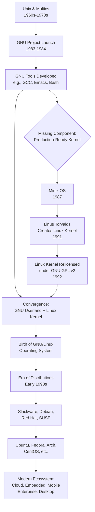

    

<h1 align="center">MR. SAM ROHAN</h1>
<h3 align="center">PRECISION IN EXECUTION - SUPREMACY IN IMPACT!</h3>

 

    

  

<h1 align="center">The History and Evolution of Linux: From a Hobby Project to the World's Most Dominant Operating System.</h1>

 

 
## 1. Introduction: The Linux Phenomenon

Linux, at its core, is an open-source, Unix-like operating system kernel initially created by Linus Torvalds in 1991. What began as a personal hobby project has evolved into one of the most influential and ubiquitous software platforms in history. Today, Linux forms the foundational layer for a vast ecosystem of operating system distributions, powering everything from embedded devices and smartphones to supercomputers and global cloud infrastructure. Its development model—characterized by decentralized collaboration, transparency, and the GNU General Public License (GPL)—has not only produced robust and secure software but also catalyzed a broader cultural shift toward open-source innovation. This document traces the meticulous curation, historical milestones, and evolutionary journey of Linux, examining the philosophical, technical, and community-driven forces that shaped it into the cornerstone of modern computing.

*   **The Linux kernel is the central coordinating component of an operating system, managing communication between hardware and software.** Unlike proprietary kernels, Linux's source code is freely available for anyone to view, modify, and distribute, subject to the terms of the GPL. This openness has fostered a global community of contributors, including individual volunteers and major corporations, who collaboratively drive its development. The result is a kernel renowned for its stability, security, and exceptional portability across diverse hardware architectures, from tiny IoT sensors to the world's most powerful supercomputers.
*   **The term "Linux" colloquially refers to complete operating systems built around the Linux kernel, though these are more accurately called "distributions" or "GNU/Linux systems."** A typical Linux distribution bundles the kernel with a suite of user-space applications, libraries, and tools, many of which originate from the GNU Project. This combination creates a fully functional OS. Popular distributions like Ubuntu, Fedora, and Debian curate these components, providing cohesive installation, package management, and support, each tailored for different use cases and philosophies.
*   **Linux's dominance is largely invisible to the end-user but is absolute in critical infrastructure.** It powers over 90% of public cloud workloads, runs on all of the top 500 supercomputers, and forms the base for the Android mobile operating system used on billions of devices. Its success demonstrates the viability and strength of the open-source development model, proving that complex, mission-critical software can be developed through transparent, community-driven collaboration rather than traditional proprietary models.

## 2. The Foundations: Unix and the Free Software Movement

The story of Linux is intrinsically linked to two predecessor movements: the technical architecture of Unix and the philosophical framework of free software. Unix, developed at Bell Labs in the late 1960s and 1970s, introduced a powerful, portable, and modular operating system design that became the gold standard in academic and commercial computing. Its principles of simplicity, clarity, and the "everything is a file" abstraction deeply influenced subsequent systems. However, as Unix became commercialized, access to its source code became restricted, creating a barrier to learning, modification, and sharing. This shift away from the collaborative academic culture sparked a reaction that would directly enable Linux's creation.

*   **The Free Software Movement, spearheaded by Richard Stallman, emerged in the early 1980s as a direct response to the rise of proprietary software and the erosion of user freedoms.** Stallman, then a programmer at the MIT AI Lab, experienced frustration when he could not fix or modify the software for a new printer due to proprietary restrictions. He formulated a philosophy centered on four essential user freedoms: the freedom to run a program for any purpose, to study and change its source code, to redistribute copies, and to distribute modified versions. To institutionalize these principles, he founded the Free Software Foundation (FSF) in 1985.
*   **The GNU Project, launched by Stallman in 1983, was the ambitious, practical embodiment of this philosophy with the goal of creating a completely free Unix-compatible operating system.** The recursive name "GNU's Not Unix" signified both its technical inspiration and its ethical divergence. By the early 1990s, the GNU project had successfully developed a comprehensive suite of high-quality, free software components, including the GCC compiler, the Emacs text editor, the Bash shell, and numerous core utilities. However, its own kernel, GNU Hurd, remained incomplete and not production-ready, leaving the project without a critical core component.
*   **This period also saw the creation of MINIX, a Unix-like operating system for educational use by Andrew S. Tanenbaum.** While its source code was available for study, its license limited modification and redistribution. MINIX served as an important teaching tool and inspiration but was not intended to be a fully-fledged, modifiable system for wider use. It was within this context—a world with a robust set of free software tools but no free, production-ready kernel—that Linus Torvalds began his work.

## 3. The GNU Project: Building a Free Operating System

The GNU Project represents one of the most significant collaborative software engineering efforts in history, predating the Linux kernel by nearly a decade. Its primary objective was not merely to replicate Unix technically but to reconstruct it under an ethical framework that guaranteed user freedom. This required rebuilding an entire operating system ecosystem from scratch, a task of monumental scale. The project's success in creating essential tools demonstrated the power of collaborative development focused on a shared ideal. The GNU General Public License (GPL), authored by Stallman, became the legal instrument to safeguard these freedoms, ensuring that GNU software—and any derivative works—would remain free.

*   **The GNU GPL, first published in 1989, implemented a "copyleft" strategy, a clever subversion of copyright law.** Instead of using copyright to restrict use, copyleft uses it to guarantee freedom. The license mandates that anyone who distributes a modified version of a GPL-licensed program must also make their source code available under the same terms. This viral mechanism creates a legally protected commons, preventing the software from being incorporated into proprietary products and ensuring that improvements benefit the entire community. The GPL became a cornerstone of the open-source ecosystem.
*   **By 1991, the GNU ecosystem was largely complete but for the kernel.** Tools like the GNU Compiler Collection (GCC) set new standards for performance and portability, while the Bash shell became a de facto standard command-line interface. This vast collection of user-space software was poised for use but required a kernel to form a complete operating system. The search for a suitable kernel led the community to evaluate several options, including the ongoing but slow Hurd development and various BSD derivatives, which were entangled in legal disputes at the time.
*   **The philosophical and legal groundwork laid by the GNU Project was indispensable for Linux's future trajectory.** When Linus Torvalds later sought a license for his kernel, the GPL provided an ideal framework that aligned with the collaborative spirit of his growing developer community. The subsequent combination of the Linux kernel with GNU software created a synergistic partnership, yielding a fully functional free operating system. The FSF and many proponents therefore advocate for the term "GNU/Linux" to acknowledge this critical contribution.

## 4. The Birth of the Linux Kernel

In 1991, Linus Torvalds, a 21-year-old computer science student at the University of Helsinki, began working on a personal project to explore the capabilities of his new Intel 80386 PC. Interested in operating systems and frustrated by the limitations of MINIX, he set out to create his own kernel. His now-famous announcement to the MINIX newsgroup on August 25, 1991, was notably humble: "I'm doing a (free) operating system (just a hobby, won't be big and professional like gnu)...". This post marked the inception of what would become the Linux kernel. Torvalds adopted a development style characterized by early and frequent releases, actively soliciting feedback and contributions from other enthusiasts on the nascent internet.

*   **Torvalds' initial motivation was pragmatic and educational, not explicitly ideological.** He wanted a system that could leverage the full features of his PC's hardware, something he felt MINIX could not do. He released version 0.01 in September 1991, which was minimal but demonstrated core functionality. Crucially, he made the source code immediately available, inviting others to examine and contribute. This open development model, managed via early internet communication channels, allowed the project to grow at an unprecedented pace as developers worldwide began submitting patches, bug fixes, and new features.
*   **A pivotal decision in the kernel's evolution was its licensing.** Linux version 0.12, released in early 1992, was relicensed under the GNU GPL, replacing its original non-commercial license. Torvalds later stated this was "the best thing I ever did." The GPL provided a legal framework that encouraged widespread collaboration and commercialization while protecting the project's openness. It guaranteed that all derivative works would remain free, preventing fragmentation and ensuring that improvements flowed back to the main codebase, fueling rapid innovation and stability.
*   **The development philosophy pioneered by Torvalds, often contrasted with the "cathedral" model of proprietary development, was later dubbed the "bazaar" model by Eric S. Raymond.** This model emphasizes releasing early and often, delegating tasks, and embracing a large, diverse base of contributors. Torvalds' role evolved from sole author to the project's "benevolent dictator," ultimately responsible for merging changes but relying on a trusted network of subsystem maintainers. This scalable, meritocratic governance structure has been key to managing the complexity of one of the world's largest software projects.

## 5. GNU/Linux: The Complete Operating System

The convergence of the Linux kernel and the GNU user-space utilities in 1992 created the first fully functional, completely free Unix-like operating system. This combination was natural and synergistic: the kernel provided the essential low-level hardware management, while the GNU tools provided the mature, rich environment for users and developers. While technically referred to as GNU/Linux to acknowledge both components, the system became popularly known simply as "Linux." This complete operating system demonstrated the practical viability of free software, providing a powerful, modifiable platform that could be freely copied and distributed, instantly appealing to hobbyists, academics, and eventually businesses.

*   **The completeness of GNU/Linux ignited the creation of "distributions," which package the kernel and software into an easily installable and maintainable system.** Early pioneers like MCC Interim Linux, Slackware (1993), and Debian (1993) took on the complex task of integrating the kernel with the necessary libraries, drivers, and application software. They provided installation scripts, documentation, and a curated repository of packages, abstracting the complexity of building a system from source code. This packaging was crucial for broadening Linux's appeal beyond skilled developers.
*   **Distributions quickly diversified to serve different needs and philosophies.** Some, like Debian, emphasized strict adherence to free software principles and community governance. Others, like Red Hat Linux (1994), focused on stability and commercial support, creating a business model around selling services, training, and enterprise-grade subscriptions. This ecosystem of distributions, all sharing the same kernel but differing in package management, release cycles, and default software, became a defining and enduring characteristic of the Linux world.
*   **The GNU/Linux system directly challenged the dominance of proprietary Unix vendors and, later, Microsoft Windows on the server and desktop.** Its zero cost, customizability, and growing robustness made it an attractive option for cost-conscious organizations and technologists who valued control. The operating system proved itself capable of running critical infrastructure, leading to its gradual adoption in web hosting, scientific computing, and eventually, with the rise of the internet, as the backbone of the nascent world wide web.

## 6. The Proliferation of Linux Distributions

The distribution model is the engine of Linux's diversity and adaptability. By separating the core kernel development from system integration and user experience, it allows for unparalleled specialization. Distributions (distros) cater to every conceivable niche: from secure penetration testing (Kali Linux) and multimedia production (Ubuntu Studio) to lightweight systems for old hardware (Lubuntu) and immutable, atomic deployments for container hosts (Fedora CoreOS). This table outlines some of the most influential distribution families and their key descendants.

| Distribution Family (Origin) | Founding Philosophy / Focus | Notable Derivatives & Downstreams | Primary Package Manager |
| :--------------------------- | :-------------------------- | :-------------------------------- | :---------------------- |
| **Debian** (1993) | Stability, strict free software commitment, vast community repository. | **Ubuntu** (user-friendliness), **Linux Mint** (desktop ease), **Kali Linux** (security testing), **elementary OS** (design focus). | `APT` (`dpkg`) |
| **Red Hat** (1994) | Enterprise-grade stability, long-term support, commercial ecosystem. | **Fedora** (cutting-edge features), **CentOS** / **Rocky Linux** / **AlmaLinux** (community RHEL rebuilds), **Oracle Linux**. | `RPM` (`dnf`/`yum`) |
| **Arch Linux** (2002) | Simplicity, minimalism, user centrality, rolling-release model. | **Manjaro** (user-friendly Arch), **EndeavourOS** (terminal-centric installer). | `Pacman` |
| **openSUSE** (1994) | Stability and flexibility, powerful configuration tool (YaST). | **SUSE Linux Enterprise Server (SLES)** (commercial edition), **openSUSE Leap** (stable), **openSUSE Tumbleweed** (rolling). | `RPM` (`zypper`) |
| **Slackware** (1993) | One of the oldest; extreme simplicity, stability, Unix-like purity. | **Salix OS** (user-friendly, dependency-aware), **Zenwalk**. | `pkgtools` / `slapt-get` |
| **Gentoo** (2002) | Ultimate configurability, source-based compilation for optimization. | **Funtoo** (variant with experimental features). | `Portage` |

*   **Each distribution family represents a different approach to balancing stability, currency of software, ease of use, and philosophical goals.** Debian's lengthy release cycles prioritize rock-solid stability, while Arch's rolling release provides immediate access to the latest software. Red Hat's model successfully commercialized open-source software by providing certified, supported builds for enterprises, funding further kernel and ecosystem development.
*   **The package manager is a core differentiator and a key component of a distribution's identity.** It handles software installation, dependency resolution, updates, and removals. The divergence between systems like APT (Debian/Ubuntu) and RPM (Red Hat/SUSE) initially created fragmentation, but the rise of universal package formats like Snap and Flatpak is now providing cross-distribution application deployment options.
*   **Ubuntu, launched in 2004, played a transformative role in popularizing Linux on the desktop.** By offering a polished, user-friendly experience based on Debian with regular release cycles and professional backing from Canonical, it dramatically lowered the barrier to entry. Despite controversies over its Unity desktop, Amazon integration, and Snap package system, Ubuntu remains a gateway for millions of new users and a major force in cloud and server deployments.

## 7. Key Milestones in Linux Development

The evolution of Linux is marked by technical leaps, community growth, and increasing industry adoption. The following timeline highlights pivotal moments that shaped its trajectory from a hobbyist kernel to a global computing standard.

| Year | Milestone | Significance |
| :--- | :-------- | :----------- |
| **1991** | Linus Torvalds announces and releases first Linux kernel (0.01). | The project begins; source is opened for collaboration. |
| **1992** | Linux kernel relicensed under GNU GPL v2. | Adopts the copyleft framework, ensuring perpetual openness and aligning with GNU. |
| **1994** | Linux kernel 1.0.0 released. | Signals the kernel's maturity and stability for broader use. |
| **1996** | Tux the penguin mascot is adopted. | Creates a recognizable and enduring brand symbol for Linux. |
| **1998** | Major companies (IBM, Oracle) announce support for Linux. | Legitimizes Linux in the enterprise, leading to massive investment. |
| **1999** | Red Hat IPO; stock soars, validating open-source business models. | Demonstrates the commercial viability of open-source software and services. |
| **2003** | SCO Group lawsuits against IBM and Linux users. | A major legal challenge that ultimately strengthened the Linux community's resolve and clarified its legal standing. |
| **2004** | Ubuntu 4.10 "Warty Warthog" released. | Democratizes Linux desktop access with a focus on usability and regular releases. |
| **2005** | Git version control system created by Linus Torvalds. | Revolutionizes distributed software development; becomes the global standard for version control. |
| **2007** | Linux Foundation formed. | Provides a neutral, professional home for kernel development and industry collaboration. |
| **2011** | Linux powers 91% of the world's top 500 supercomputers. | Establishes dominance in high-performance computing (HPC). |
| **2015** | Microsoft launches Windows Subsystem for Linux (WSL). | Symbolic embrace of Linux by its historic rival, integrating it into Windows. |

*   **The early 2000s "dot-com" boom and the subsequent rise of web infrastructure were profoundly accelerated by Linux.** Its reliability, performance, and low cost made it the default choice for web servers, powering the expansion of companies like Google, Amazon, and Facebook. The LAMP stack (Linux, Apache, MySQL, PHP/Perl/Python) became the standard toolkit for dynamic website development.
*   **The creation of Git in 2005 was a direct response to the scaling challenges of managing the Linux kernel project.** Torvalds designed Git for speed, distributed operation, and robust handling of non-linear development. Its adoption spread far beyond Linux, becoming the foundational tool for modern software development across all domains, from open-source to proprietary.
*   **The formation of the Linux Foundation consolidated governance and funding.** As a non-profit consortium, it employs key developers, manages legal issues, and hosts collaborative projects like the Cloud Native Computing Foundation (CNCF). This professional stewardship ensures the kernel's development remains sustainable and neutral amid competing corporate interests from its largest contributors, including Intel, Google, Red Hat, and Microsoft.

## 8. Linux in the Modern Computing Landscape

Today, Linux is the silent, ubiquitous foundation of the digital world. Its design principles of modularity, network transparency, and configurability have made it the ideal substrate for nearly every major computing trend of the 21st century. From the smallest embedded device to planetary-scale cloud platforms, Linux provides a consistent, reliable, and programmable interface. Its success in servers, cloud, and embedded systems contrasts with its modest but growing presence on the desktop, where it remains a powerhouse for developers, creators, and privacy-conscious users.

*   **Cloud Computing and Containers:** Linux is the undisputed host operating system for the global cloud. Major providers like AWS, Google Cloud, and Microsoft Azure run their infrastructure on customized Linux variants. The container revolution, led by Docker and orchestrated by Kubernetes, is inherently a Linux technology, built upon kernel features like cgroups and namespaces. This has cemented Linux's role as the operating system for modern, microservices-based application development and deployment.
*   **Embedded Systems and the Internet of Things (IoT):** Due to its small footprint and high customizability, Linux is the dominant OS for embedded devices, from smart TVs and home routers to automotive infotainment systems and industrial controllers. Projects like the Yocto Project and Buildroot provide tools to build bespoke Linux systems for any hardware. In IoT, Linux balances capability with efficiency, running on everything from high-end gateways to streamlined microcontroller units.
*   **Desktop and End-User Computing:** While holding a single-digit market share, the Linux desktop ecosystem is vibrant and mature. Distributions like Linux Mint, Ubuntu, and Fedora Workstation offer polished, secure, and complete computing environments. They are increasingly viable for general use, offering strong alternatives for software development, content creation, and everyday productivity, free from licensing costs and with strong privacy protections.

## 9. The Future of Linux

The future trajectory of Linux points toward deeper integration, increased specialization, and continued dominance in foundational technologies. Its open development model and architectural flexibility position it to underpin the next generation of computing innovations. Key areas of growth include edge computing, where lightweight, secure Linux distributions will manage data processing closer to its source; artificial intelligence and machine learning, where the kernel is optimized for specialized hardware like GPUs and TPUs; and security-focused systems, leveraging its transparency for rigorous auditing and the implementation of advanced security modules.

*   **Linux will continue to evolve as the primary host for virtualized and containerized workloads, with ongoing kernel improvements for isolation, performance, and resource management.** The rise of edge computing will see Linux distributions tailored for low-latency, intermittent connectivity, and ruggedized hardware, managing everything from 5G network nodes to autonomous vehicle systems. The kernel's support for real-time processing (PREEMPT_RT) is also expanding its role in industrial automation and telecommunications.
*   **Security and digital sovereignty are becoming paramount concerns where Linux's open-source nature is a strategic advantage.** Governments and enterprises are increasingly viewing transparent, auditable software as essential for national security and data protection. Linux distributions can be thoroughly inspected and hardened to meet the strictest compliance requirements, free from dependency on any single vendor. This is driving adoption in sensitive sectors like finance, defense, and healthcare.
*   **The developer experience on Linux will continue to improve, solidifying its position as the premier platform for software engineering.** Tools like Windows Subsystem for Linux (WSL) have made Linux toolchains accessible to a broader developer base, while native Linux desktops offer unparalleled integration with container and cloud workflows. The ecosystem of open-source development tools, languages, and frameworks is most robust on Linux, ensuring it remains the environment of choice for innovation.

## 10. Conclusion

The history of Linux is a testament to the power of a simple idea executed with remarkable consistency: that collaborative, open development can produce systems of unparalleled quality and adaptability. From its origins in Linus Torvalds' Helsinki bedroom to its current status as the world's most important software platform, Linux's journey has been shaped by a unique synergy of individual ingenuity, communal effort, and pragmatic idealism. It overcame technical hurdles, legal challenges, and market skepticism not through corporate mandate, but through the decentralized contributions of a global community united by a shared resource.

*   **Linux's success has fundamentally altered the technology industry's landscape, proving the economic and technical viability of open-source software.** It has forced a reevaluation of traditional software business models, inspired a generation of developers, and provided a trusted foundation for the digital economy. The principles it embodies—transparency, collaboration, and user freedom—continue to influence fields far beyond operating systems.
*   **The story of Linux is ongoing.** Its development model, managed by the Linux Foundation and thousands of contributors, ensures it will continue to adapt to new hardware, new paradigms, and new challenges. As computing becomes ever more pervasive and critical to society, the need for a stable, secure, and transparent foundation becomes more acute. Linux, curated and evolved by a global community, is poised to meet that need for decades to come.

    

<h4 align="center">STAY TUNED FOR THE LATEST UPDATES!</h4>

  

    

    
