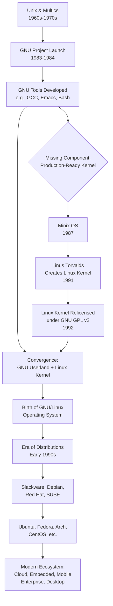
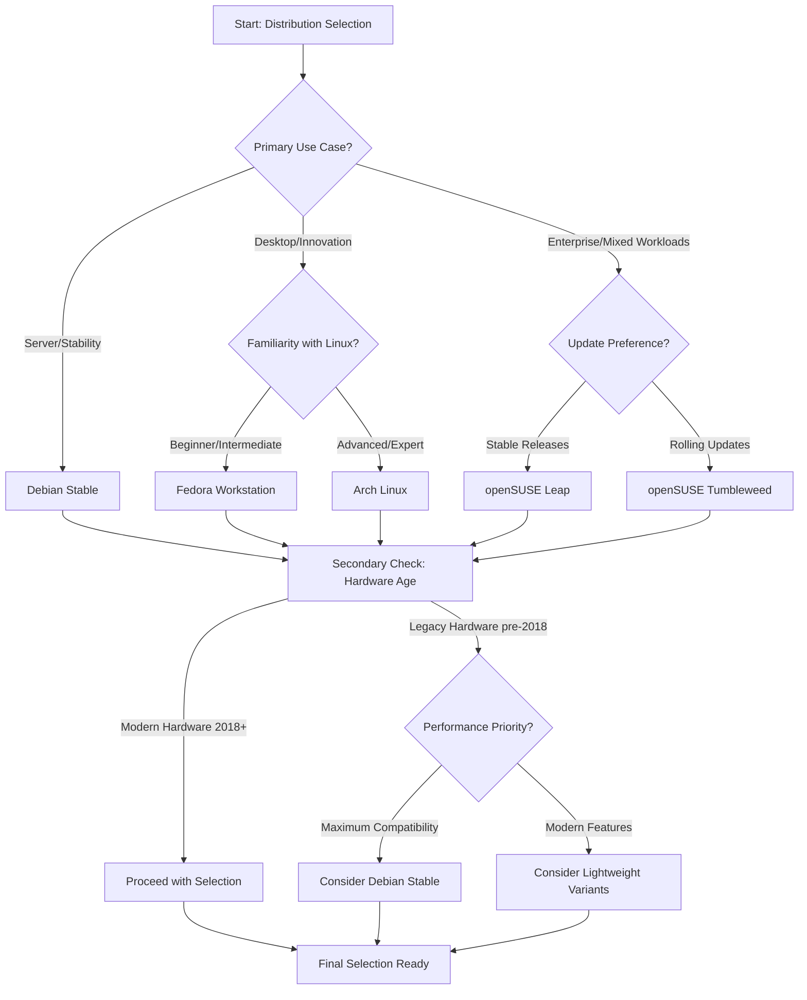
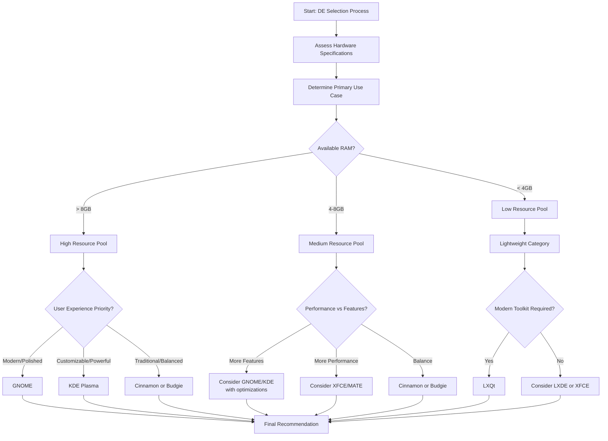
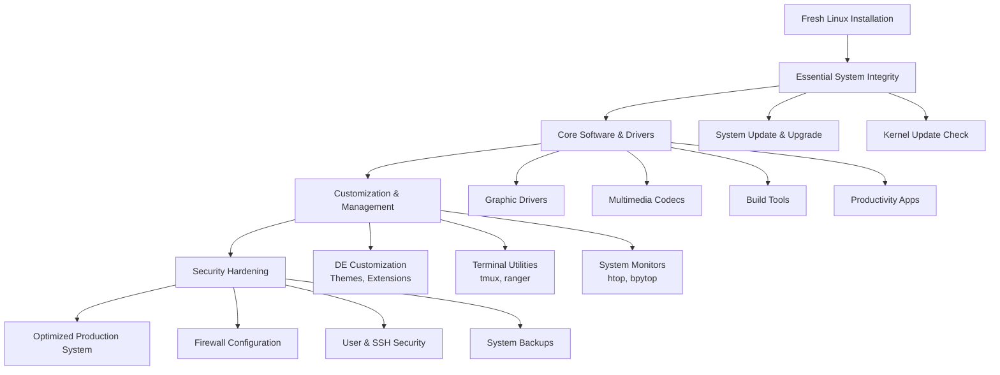

    

<h1 align="center">MR. SAM ROHAN</h1>
<h3 align="center">PRECISION IN EXECUTION - SUPREMACY IN IMPACT!</h3>

 

    

  

<h1 align="center">The History and Evolution of Linux: From a Hobby Project to the World's Most Dominant Operating System.</h1>

 

 
## 1. Introduction: The Linux Phenomenon

Linux, at its core, is an open-source, Unix-like operating system kernel initially created by Linus Torvalds in 1991. What began as a personal hobby project has evolved into one of the most influential and ubiquitous software platforms in history. Today, Linux forms the foundational layer for a vast ecosystem of operating system distributions, powering everything from embedded devices and smartphones to supercomputers and global cloud infrastructure. Its development model—characterized by decentralized collaboration, transparency, and the GNU General Public License (GPL)—has not only produced robust and secure software but also catalyzed a broader cultural shift toward open-source innovation. This document traces the meticulous curation, historical milestones, and evolutionary journey of Linux, examining the philosophical, technical, and community-driven forces that shaped it into the cornerstone of modern computing.

*   **The Linux kernel is the central coordinating component of an operating system, managing communication between hardware and software.** Unlike proprietary kernels, Linux's source code is freely available for anyone to view, modify, and distribute, subject to the terms of the GPL. This openness has fostered a global community of contributors, including individual volunteers and major corporations, who collaboratively drive its development. The result is a kernel renowned for its stability, security, and exceptional portability across diverse hardware architectures, from tiny IoT sensors to the world's most powerful supercomputers.
*   **The term "Linux" colloquially refers to complete operating systems built around the Linux kernel, though these are more accurately called "distributions" or "GNU/Linux systems."** A typical Linux distribution bundles the kernel with a suite of user-space applications, libraries, and tools, many of which originate from the GNU Project. This combination creates a fully functional OS. Popular distributions like Ubuntu, Fedora, and Debian curate these components, providing cohesive installation, package management, and support, each tailored for different use cases and philosophies.
*   **Linux's dominance is largely invisible to the end-user but is absolute in critical infrastructure.** It powers over 90% of public cloud workloads, runs on all of the top 500 supercomputers, and forms the base for the Android mobile operating system used on billions of devices. Its success demonstrates the viability and strength of the open-source development model, proving that complex, mission-critical software can be developed through transparent, community-driven collaboration rather than traditional proprietary models.

## 2. The Foundations: Unix and the Free Software Movement

The story of Linux is intrinsically linked to two predecessor movements: the technical architecture of Unix and the philosophical framework of free software. Unix, developed at Bell Labs in the late 1960s and 1970s, introduced a powerful, portable, and modular operating system design that became the gold standard in academic and commercial computing. Its principles of simplicity, clarity, and the "everything is a file" abstraction deeply influenced subsequent systems. However, as Unix became commercialized, access to its source code became restricted, creating a barrier to learning, modification, and sharing. This shift away from the collaborative academic culture sparked a reaction that would directly enable Linux's creation.

*   **The Free Software Movement, spearheaded by Richard Stallman, emerged in the early 1980s as a direct response to the rise of proprietary software and the erosion of user freedoms.** Stallman, then a programmer at the MIT AI Lab, experienced frustration when he could not fix or modify the software for a new printer due to proprietary restrictions. He formulated a philosophy centered on four essential user freedoms: the freedom to run a program for any purpose, to study and change its source code, to redistribute copies, and to distribute modified versions. To institutionalize these principles, he founded the Free Software Foundation (FSF) in 1985.
*   **The GNU Project, launched by Stallman in 1983, was the ambitious, practical embodiment of this philosophy with the goal of creating a completely free Unix-compatible operating system.** The recursive name "GNU's Not Unix" signified both its technical inspiration and its ethical divergence. By the early 1990s, the GNU project had successfully developed a comprehensive suite of high-quality, free software components, including the GCC compiler, the Emacs text editor, the Bash shell, and numerous core utilities. However, its own kernel, GNU Hurd, remained incomplete and not production-ready, leaving the project without a critical core component.
*   **This period also saw the creation of MINIX, a Unix-like operating system for educational use by Andrew S. Tanenbaum.** While its source code was available for study, its license limited modification and redistribution. MINIX served as an important teaching tool and inspiration but was not intended to be a fully-fledged, modifiable system for wider use. It was within this context—a world with a robust set of free software tools but no free, production-ready kernel—that Linus Torvalds began his work.

## 3. The GNU Project: Building a Free Operating System

The GNU Project represents one of the most significant collaborative software engineering efforts in history, predating the Linux kernel by nearly a decade. Its primary objective was not merely to replicate Unix technically but to reconstruct it under an ethical framework that guaranteed user freedom. This required rebuilding an entire operating system ecosystem from scratch, a task of monumental scale. The project's success in creating essential tools demonstrated the power of collaborative development focused on a shared ideal. The GNU General Public License (GPL), authored by Stallman, became the legal instrument to safeguard these freedoms, ensuring that GNU software—and any derivative works—would remain free.

*   **The GNU GPL, first published in 1989, implemented a "copyleft" strategy, a clever subversion of copyright law.** Instead of using copyright to restrict use, copyleft uses it to guarantee freedom. The license mandates that anyone who distributes a modified version of a GPL-licensed program must also make their source code available under the same terms. This viral mechanism creates a legally protected commons, preventing the software from being incorporated into proprietary products and ensuring that improvements benefit the entire community. The GPL became a cornerstone of the open-source ecosystem.
*   **By 1991, the GNU ecosystem was largely complete but for the kernel.** Tools like the GNU Compiler Collection (GCC) set new standards for performance and portability, while the Bash shell became a de facto standard command-line interface. This vast collection of user-space software was poised for use but required a kernel to form a complete operating system. The search for a suitable kernel led the community to evaluate several options, including the ongoing but slow Hurd development and various BSD derivatives, which were entangled in legal disputes at the time.
*   **The philosophical and legal groundwork laid by the GNU Project was indispensable for Linux's future trajectory.** When Linus Torvalds later sought a license for his kernel, the GPL provided an ideal framework that aligned with the collaborative spirit of his growing developer community. The subsequent combination of the Linux kernel with GNU software created a synergistic partnership, yielding a fully functional free operating system. The FSF and many proponents therefore advocate for the term "GNU/Linux" to acknowledge this critical contribution.

## 4. The Birth of the Linux Kernel

In 1991, Linus Torvalds, a 21-year-old computer science student at the University of Helsinki, began working on a personal project to explore the capabilities of his new Intel 80386 PC. Interested in operating systems and frustrated by the limitations of MINIX, he set out to create his own kernel. His now-famous announcement to the MINIX newsgroup on August 25, 1991, was notably humble: "I'm doing a (free) operating system (just a hobby, won't be big and professional like gnu)...". This post marked the inception of what would become the Linux kernel. Torvalds adopted a development style characterized by early and frequent releases, actively soliciting feedback and contributions from other enthusiasts on the nascent internet.

*   **Torvalds' initial motivation was pragmatic and educational, not explicitly ideological.** He wanted a system that could leverage the full features of his PC's hardware, something he felt MINIX could not do. He released version 0.01 in September 1991, which was minimal but demonstrated core functionality. Crucially, he made the source code immediately available, inviting others to examine and contribute. This open development model, managed via early internet communication channels, allowed the project to grow at an unprecedented pace as developers worldwide began submitting patches, bug fixes, and new features.
*   **A pivotal decision in the kernel's evolution was its licensing.** Linux version 0.12, released in early 1992, was relicensed under the GNU GPL, replacing its original non-commercial license. Torvalds later stated this was "the best thing I ever did." The GPL provided a legal framework that encouraged widespread collaboration and commercialization while protecting the project's openness. It guaranteed that all derivative works would remain free, preventing fragmentation and ensuring that improvements flowed back to the main codebase, fueling rapid innovation and stability.
*   **The development philosophy pioneered by Torvalds, often contrasted with the "cathedral" model of proprietary development, was later dubbed the "bazaar" model by Eric S. Raymond.** This model emphasizes releasing early and often, delegating tasks, and embracing a large, diverse base of contributors. Torvalds' role evolved from sole author to the project's "benevolent dictator," ultimately responsible for merging changes but relying on a trusted network of subsystem maintainers. This scalable, meritocratic governance structure has been key to managing the complexity of one of the world's largest software projects.

## 5. GNU/Linux: The Complete Operating System

The convergence of the Linux kernel and the GNU user-space utilities in 1992 created the first fully functional, completely free Unix-like operating system. This combination was natural and synergistic: the kernel provided the essential low-level hardware management, while the GNU tools provided the mature, rich environment for users and developers. While technically referred to as GNU/Linux to acknowledge both components, the system became popularly known simply as "Linux." This complete operating system demonstrated the practical viability of free software, providing a powerful, modifiable platform that could be freely copied and distributed, instantly appealing to hobbyists, academics, and eventually businesses.

*   **The completeness of GNU/Linux ignited the creation of "distributions," which package the kernel and software into an easily installable and maintainable system.** Early pioneers like MCC Interim Linux, Slackware (1993), and Debian (1993) took on the complex task of integrating the kernel with the necessary libraries, drivers, and application software. They provided installation scripts, documentation, and a curated repository of packages, abstracting the complexity of building a system from source code. This packaging was crucial for broadening Linux's appeal beyond skilled developers.
*   **Distributions quickly diversified to serve different needs and philosophies.** Some, like Debian, emphasized strict adherence to free software principles and community governance. Others, like Red Hat Linux (1994), focused on stability and commercial support, creating a business model around selling services, training, and enterprise-grade subscriptions. This ecosystem of distributions, all sharing the same kernel but differing in package management, release cycles, and default software, became a defining and enduring characteristic of the Linux world.
*   **The GNU/Linux system directly challenged the dominance of proprietary Unix vendors and, later, Microsoft Windows on the server and desktop.** Its zero cost, customizability, and growing robustness made it an attractive option for cost-conscious organizations and technologists who valued control. The operating system proved itself capable of running critical infrastructure, leading to its gradual adoption in web hosting, scientific computing, and eventually, with the rise of the internet, as the backbone of the nascent world wide web.

## 6. The Proliferation of Linux Distributions

The distribution model is the engine of Linux's diversity and adaptability. By separating the core kernel development from system integration and user experience, it allows for unparalleled specialization. Distributions (distros) cater to every conceivable niche: from secure penetration testing (Kali Linux) and multimedia production (Ubuntu Studio) to lightweight systems for old hardware (Lubuntu) and immutable, atomic deployments for container hosts (Fedora CoreOS). This table outlines some of the most influential distribution families and their key descendants.

| Distribution Family (Origin) | Founding Philosophy / Focus | Notable Derivatives & Downstreams | Primary Package Manager |
| :--------------------------- | :-------------------------- | :-------------------------------- | :---------------------- |
| **Debian** (1993) | Stability, strict free software commitment, vast community repository. | **Ubuntu** (user-friendliness), **Linux Mint** (desktop ease), **Kali Linux** (security testing), **elementary OS** (design focus). | `APT` (`dpkg`) |
| **Red Hat** (1994) | Enterprise-grade stability, long-term support, commercial ecosystem. | **Fedora** (cutting-edge features), **CentOS** / **Rocky Linux** / **AlmaLinux** (community RHEL rebuilds), **Oracle Linux**. | `RPM` (`dnf`/`yum`) |
| **Arch Linux** (2002) | Simplicity, minimalism, user centrality, rolling-release model. | **Manjaro** (user-friendly Arch), **EndeavourOS** (terminal-centric installer). | `Pacman` |
| **openSUSE** (1994) | Stability and flexibility, powerful configuration tool (YaST). | **SUSE Linux Enterprise Server (SLES)** (commercial edition), **openSUSE Leap** (stable), **openSUSE Tumbleweed** (rolling). | `RPM` (`zypper`) |
| **Slackware** (1993) | One of the oldest; extreme simplicity, stability, Unix-like purity. | **Salix OS** (user-friendly, dependency-aware), **Zenwalk**. | `pkgtools` / `slapt-get` |
| **Gentoo** (2002) | Ultimate configurability, source-based compilation for optimization. | **Funtoo** (variant with experimental features). | `Portage` |

*   **Each distribution family represents a different approach to balancing stability, currency of software, ease of use, and philosophical goals.** Debian's lengthy release cycles prioritize rock-solid stability, while Arch's rolling release provides immediate access to the latest software. Red Hat's model successfully commercialized open-source software by providing certified, supported builds for enterprises, funding further kernel and ecosystem development.
*   **The package manager is a core differentiator and a key component of a distribution's identity.** It handles software installation, dependency resolution, updates, and removals. The divergence between systems like APT (Debian/Ubuntu) and RPM (Red Hat/SUSE) initially created fragmentation, but the rise of universal package formats like Snap and Flatpak is now providing cross-distribution application deployment options.
*   **Ubuntu, launched in 2004, played a transformative role in popularizing Linux on the desktop.** By offering a polished, user-friendly experience based on Debian with regular release cycles and professional backing from Canonical, it dramatically lowered the barrier to entry. Despite controversies over its Unity desktop, Amazon integration, and Snap package system, Ubuntu remains a gateway for millions of new users and a major force in cloud and server deployments.

## 7. Key Milestones in Linux Development

The evolution of Linux is marked by technical leaps, community growth, and increasing industry adoption. The following timeline highlights pivotal moments that shaped its trajectory from a hobbyist kernel to a global computing standard.

| Year | Milestone | Significance |
| :--- | :-------- | :----------- |
| **1991** | Linus Torvalds announces and releases first Linux kernel (0.01). | The project begins; source is opened for collaboration. |
| **1992** | Linux kernel relicensed under GNU GPL v2. | Adopts the copyleft framework, ensuring perpetual openness and aligning with GNU. |
| **1994** | Linux kernel 1.0.0 released. | Signals the kernel's maturity and stability for broader use. |
| **1996** | Tux the penguin mascot is adopted. | Creates a recognizable and enduring brand symbol for Linux. |
| **1998** | Major companies (IBM, Oracle) announce support for Linux. | Legitimizes Linux in the enterprise, leading to massive investment. |
| **1999** | Red Hat IPO; stock soars, validating open-source business models. | Demonstrates the commercial viability of open-source software and services. |
| **2003** | SCO Group lawsuits against IBM and Linux users. | A major legal challenge that ultimately strengthened the Linux community's resolve and clarified its legal standing. |
| **2004** | Ubuntu 4.10 "Warty Warthog" released. | Democratizes Linux desktop access with a focus on usability and regular releases. |
| **2005** | Git version control system created by Linus Torvalds. | Revolutionizes distributed software development; becomes the global standard for version control. |
| **2007** | Linux Foundation formed. | Provides a neutral, professional home for kernel development and industry collaboration. |
| **2011** | Linux powers 91% of the world's top 500 supercomputers. | Establishes dominance in high-performance computing (HPC). |
| **2015** | Microsoft launches Windows Subsystem for Linux (WSL). | Symbolic embrace of Linux by its historic rival, integrating it into Windows. |

*   **The early 2000s "dot-com" boom and the subsequent rise of web infrastructure were profoundly accelerated by Linux.** Its reliability, performance, and low cost made it the default choice for web servers, powering the expansion of companies like Google, Amazon, and Facebook. The LAMP stack (Linux, Apache, MySQL, PHP/Perl/Python) became the standard toolkit for dynamic website development.
*   **The creation of Git in 2005 was a direct response to the scaling challenges of managing the Linux kernel project.** Torvalds designed Git for speed, distributed operation, and robust handling of non-linear development. Its adoption spread far beyond Linux, becoming the foundational tool for modern software development across all domains, from open-source to proprietary.
*   **The formation of the Linux Foundation consolidated governance and funding.** As a non-profit consortium, it employs key developers, manages legal issues, and hosts collaborative projects like the Cloud Native Computing Foundation (CNCF). This professional stewardship ensures the kernel's development remains sustainable and neutral amid competing corporate interests from its largest contributors, including Intel, Google, Red Hat, and Microsoft.

## 8. Linux in the Modern Computing Landscape

Today, Linux is the silent, ubiquitous foundation of the digital world. Its design principles of modularity, network transparency, and configurability have made it the ideal substrate for nearly every major computing trend of the 21st century. From the smallest embedded device to planetary-scale cloud platforms, Linux provides a consistent, reliable, and programmable interface. Its success in servers, cloud, and embedded systems contrasts with its modest but growing presence on the desktop, where it remains a powerhouse for developers, creators, and privacy-conscious users.

*   **Cloud Computing and Containers:** Linux is the undisputed host operating system for the global cloud. Major providers like AWS, Google Cloud, and Microsoft Azure run their infrastructure on customized Linux variants. The container revolution, led by Docker and orchestrated by Kubernetes, is inherently a Linux technology, built upon kernel features like cgroups and namespaces. This has cemented Linux's role as the operating system for modern, microservices-based application development and deployment.
*   **Embedded Systems and the Internet of Things (IoT):** Due to its small footprint and high customizability, Linux is the dominant OS for embedded devices, from smart TVs and home routers to automotive infotainment systems and industrial controllers. Projects like the Yocto Project and Buildroot provide tools to build bespoke Linux systems for any hardware. In IoT, Linux balances capability with efficiency, running on everything from high-end gateways to streamlined microcontroller units.
*   **Desktop and End-User Computing:** While holding a single-digit market share, the Linux desktop ecosystem is vibrant and mature. Distributions like Linux Mint, Ubuntu, and Fedora Workstation offer polished, secure, and complete computing environments. They are increasingly viable for general use, offering strong alternatives for software development, content creation, and everyday productivity, free from licensing costs and with strong privacy protections.

## 9. The Future of Linux

The future trajectory of Linux points toward deeper integration, increased specialization, and continued dominance in foundational technologies. Its open development model and architectural flexibility position it to underpin the next generation of computing innovations. Key areas of growth include edge computing, where lightweight, secure Linux distributions will manage data processing closer to its source; artificial intelligence and machine learning, where the kernel is optimized for specialized hardware like GPUs and TPUs; and security-focused systems, leveraging its transparency for rigorous auditing and the implementation of advanced security modules.

*   **Linux will continue to evolve as the primary host for virtualized and containerized workloads, with ongoing kernel improvements for isolation, performance, and resource management.** The rise of edge computing will see Linux distributions tailored for low-latency, intermittent connectivity, and ruggedized hardware, managing everything from 5G network nodes to autonomous vehicle systems. The kernel's support for real-time processing (PREEMPT_RT) is also expanding its role in industrial automation and telecommunications.
*   **Security and digital sovereignty are becoming paramount concerns where Linux's open-source nature is a strategic advantage.** Governments and enterprises are increasingly viewing transparent, auditable software as essential for national security and data protection. Linux distributions can be thoroughly inspected and hardened to meet the strictest compliance requirements, free from dependency on any single vendor. This is driving adoption in sensitive sectors like finance, defense, and healthcare.
*   **The developer experience on Linux will continue to improve, solidifying its position as the premier platform for software engineering.** Tools like Windows Subsystem for Linux (WSL) have made Linux toolchains accessible to a broader developer base, while native Linux desktops offer unparalleled integration with container and cloud workflows. The ecosystem of open-source development tools, languages, and frameworks is most robust on Linux, ensuring it remains the environment of choice for innovation.

## 10. Conclusion

The history of Linux is a testament to the power of a simple idea executed with remarkable consistency: that collaborative, open development can produce systems of unparalleled quality and adaptability. From its origins in Linus Torvalds' Helsinki bedroom to its current status as the world's most important software platform, Linux's journey has been shaped by a unique synergy of individual ingenuity, communal effort, and pragmatic idealism. It overcame technical hurdles, legal challenges, and market skepticism not through corporate mandate, but through the decentralized contributions of a global community united by a shared resource.

*   **Linux's success has fundamentally altered the technology industry's landscape, proving the economic and technical viability of open-source software.** It has forced a reevaluation of traditional software business models, inspired a generation of developers, and provided a trusted foundation for the digital economy. The principles it embodies—transparency, collaboration, and user freedom—continue to influence fields far beyond operating systems.
*   **The story of Linux is ongoing.** Its development model, managed by the Linux Foundation and thousands of contributors, ensures it will continue to adapt to new hardware, new paradigms, and new challenges. As computing becomes ever more pervasive and critical to society, the need for a stable, secure, and transparent foundation becomes more acute. Linux, curated and evolved by a global community, is poised to meet that need for decades to come.

    

<h1 align="center">The Linux Resource Analyst's Handbook: Measuring and Understanding Resource Utilization Across Desktop Environments.</h1>

 
 
## Executive Summary

This comprehensive guide provides system administrators, developers, and power users with a structured framework for analyzing resource consumption across major Linux distributions and desktop environments. In an era where computational efficiency directly impacts productivity and operational costs, understanding how different Linux configurations utilize CPU, memory, storage, and GPU resources becomes essential for making informed infrastructure decisions. This document synthesizes empirical data with practical methodologies to help you optimize Linux deployments from single desktop installations to enterprise-scale implementations.

## Section 1: The Linux Foundation and Its Architectural Advantages

### 1.1 The Linux Operating System: A Community-Driven Powerhouse

Linux represents one of the most significant achievements in collaborative software development, originating from Linus Torvalds' 1991 kernel and evolving into a complete ecosystem that powers everything from embedded devices to supercomputers. The open-source model enables unparalleled transparency, security auditing, and customization that proprietary systems cannot match. Unlike closed-source alternatives, Linux's entire codebase is available for inspection, modification, and redistribution, fostering innovation through global collaboration among developers, corporations, and enthusiasts. This collaborative foundation has produced numerous specialized distributions (distros) tailored to specific use cases while maintaining binary compatibility and standardized interfaces through initiatives like the Linux Standard Base and Freedesktop.org specifications.

- **Security Through Transparency**: Linux implements a sophisticated permission-based security model with discretionary access controls, mandatory access controls via SELinux or AppArmor, and capabilities-based privilege separation. The transparent codebase allows security researchers worldwide to audit for vulnerabilities, resulting in faster patching cycles than proprietary alternatives. This architectural approach, combined with the principle of least privilege in service design, makes Linux inherently resistant to widespread malware propagation and provides a robust foundation for security-critical applications in finance, healthcare, and government sectors where data integrity is paramount.

- **Economic and Operational Efficiency**: Beyond the absence of licensing fees, Linux delivers substantial cost savings through efficient resource utilization, extended hardware lifecycle support, and reduced administrative overhead. The system's ability to run effectively on older hardware extends equipment lifespan while maintaining acceptable performance, particularly when paired with lightweight desktop environments. Organizations benefit from predictable update cycles, long-term support versions, and the elimination of vendor lock-in, enabling strategic infrastructure planning without unexpected licensing cost escalations that frequently accompany proprietary enterprise software agreements.

- **Architectural Flexibility and Customization**: Linux's modular architecture allows unprecedented customization, from minimal container-optimized builds under 10MB to full-featured desktop installations with comprehensive multimedia support. Users can select from multiple init systems (systemd, OpenRC, runit), filesystems (ext4, Btrfs, XFS, ZFS), display servers (X11, Wayland), and desktop environments while maintaining application compatibility through shared libraries and standardized interfaces. This flexibility enables tailored solutions for specific workloads, whether optimizing for low-latency audio production, scientific computing with GPU acceleration, or lightweight kiosk deployments with restricted resource profiles.

### 1.2 Linux in Contemporary Computing Infrastructure

Linux currently powers over 90% of public cloud workloads, 99% of supercomputers on the TOP500 list, and the majority of embedded systems from routers to automotive infotainment units. This dominance stems from its proven reliability in high-availability environments, predictable performance characteristics under load, and the economic advantages of open-source software at scale. Major technology providers including Google, Amazon, IBM, and Microsoft invest significantly in Linux development, ensuring continuous enhancement of kernel features, filesystem capabilities, containerization technologies, and hardware support. The proliferation of Linux across industries demonstrates its adaptability to diverse requirements while maintaining core stability and security principles.

## Section 2: Comparative Analysis of Major Linux Distributions

### 2.1 Distribution Philosophy and Release Models

Linux distributions package the kernel with system software, package management tools, and configuration utilities to create complete operating systems. The four distributions analyzed represent distinct philosophical approaches to software delivery, update management, and system configuration.

### 2.2 Detailed Distribution Profiles

#### **Debian Stable**
- **Release Philosophy**: Debian employs a conservative, time-based release model with approximately two-year cycles between major versions, prioritizing stability and reliability over software currency. The distribution maintains three parallel branches: Stable (thoroughly tested packages), Testing (candidate for next stable), and Unstable (rapid updates with potential issues). This multi-tiered approach ensures production environments receive only thoroughly vetted software updates while allowing enthusiasts to access newer applications through backports or the Testing/Unstable repositories.

- **Package Management Ecosystem**: Debian utilizes the Advanced Package Tool (APT) with dpkg as the underlying package manager, offering dependency resolution, digital signature verification, and multiple repository support. The system boasts one of the largest software repositories with over 59,000 binary packages covering virtually every category of free software. While primarily source-based, Debian supports universal packaging formats including Flatpak, Snap (though not default), and AppImage for applications outside the official repositories.

- **System Characteristics and Optimization**: Debian's default installation emphasizes minimalism with only essential packages, allowing users to build upward according to specific needs. The distribution supports numerous architectures beyond x86_64 including ARM, PowerPC, MIPS, and RISC-V, making it suitable for embedded and specialized hardware deployments. System configuration follows the Filesystem Hierarchy Standard with traditional init scripts or systemd, providing administrators with familiar management interfaces and predictable behavior across updates.

#### **Fedora Workstation**
- **Release Philosophy**: Fedora follows a predictable six-month release cycle with approximately thirteen months of support per version, striking a balance between software currency and stability. As the upstream source for Red Hat Enterprise Linux (RHEL), Fedora serves as an innovation platform where new technologies undergo real-world testing before incorporation into enterprise distributions. The distribution emphasizes leading-edge open-source software while maintaining reasonable stability through automated testing and quality assurance processes.

- **Package Management Ecosystem**: Fedora utilizes the DNF package manager (successor to YUM) with libdnf as its backend, providing robust dependency resolution, modular repository support, and improved performance over earlier solutions. The distribution pioneered several packaging innovations including RPM Fusion for third-party software, COPR for community-built packages, and Flatpak as a primary universal packaging format. Fedora's strict free software policy excludes proprietary components from default installations while providing mechanisms for their addition when necessary.

- **System Characteristics and Optimization**: Fedora Workstation defaults to the GNOME desktop with Wayland display server, implementing modern Linux desktop technologies as reference implementations. The distribution includes tuned performance profiles through tuned-adm, early adoption of filesystem technologies like Btrfs with transparent compression, and integration with enterprise management tools including Cockpit for web-based administration. Security features include SELinux enabled by default with targeted policies, hardware-backed full disk encryption with LUKS2, and automatic firmware updates through fwupd.

#### **Arch Linux**
- **Release Philosophy**: Arch employs a true rolling release model where individual packages update continuously rather than through versioned releases, providing immediate access to upstream software updates. The distribution follows a "Keep It Simple" (KIS) philosophy with minimal modification to upstream packages, requiring users to understand system components rather than abstracting them through configuration tools. This approach demands greater user involvement but provides unparalleled control over system composition and behavior.

- **Package Management Ecosystem**: Arch utilizes the pacman package manager with a simple tar-like format, providing lightning-fast dependency resolution and transaction processing. The Arch User Repository (AUR) represents one of Arch's most powerful features—a community-driven repository of PKGBUILD scripts that automate building packages from source, dramatically expanding available software beyond the official repositories. The distribution supports binary packages through official repositories while encouraging source-based customization through the AUR and ABS (Arch Build System).

- **System Characteristics and Optimization**: Arch installations begin with a minimal base system requiring manual configuration of network, display, sound, and other subsystems, resulting in highly tailored systems without unnecessary components. The distribution provides comprehensive documentation through the Arch Wiki, widely regarded as one of the best technical resources in the Linux community. System maintenance requires regular attention to avoid update issues, but the rolling nature ensures consistent software versions without major version upgrade procedures.

#### **openSUSE**
- **Release Philosophy**: openSUSE offers dual distribution models—Leap with synchronized codebase from SUSE Linux Enterprise providing long-term stability, and Tumbleweed as a rigorously tested rolling release. This dual approach accommodates both enterprise environments requiring predictable maintenance cycles and enthusiasts desiring current software. The distribution emphasizes automated testing through openQA, ensuring updates meet quality standards before release to either branch.

- **Package Management Ecosystem**: openSUSE utilizes the Zypper package manager with libsolv dependency resolution, providing particularly robust handling of complex dependency graphs and repository management. The distribution features the Open Build Service enabling users to build packages for multiple distributions and architectures, along with comprehensive pattern-based installation groups that simplify deployment of common software combinations. Unlike some distributions, openSUSE maintains a consistent software stack between desktop and server editions, facilitating management of heterogeneous environments.

- **System Characteristics and Optimization**: openSUSE's YaST (Yet another Setup Tool) provides a comprehensive graphical and text-based configuration interface covering system administration tasks typically requiring command-line expertise. The distribution defaults to the Btrfs filesystem with automated snapshot management through Snapper, enabling rollback of failed updates or configuration changes. Enterprise integration features include support for Active Directory, robust network configuration tools, and seamless interoperability with SUSE Linux Enterprise environments.

### 2.3 Comparative Distribution Analysis

#### **Table 1: Distribution Overview and Characteristics**

| Feature | Debian Stable | Fedora Workstation | Arch Linux | openSUSE Leap | openSUSE Tumbleweed |
|---------|---------------|-------------------|------------|---------------|---------------------|
| **Base System** | Independent | Independent (RHEL upstream) | Independent | Independent (SLE basis) | Independent |
| **Release Model** | Fixed (2-3 year cycle) | Fixed (6 month cycle) | Rolling | Fixed (aligned with SLE) | Rolling (tested) |
| **Default Desktop** | GNOME (minimal) | GNOME (vanilla) | None (user choice) | KDE Plasma/GNOME | KDE Plasma/GNOME |
| **Installation Complexity** | Intermediate | Beginner-Friendly | Advanced | Beginner-Intermediate | Intermediate |
| **Primary Target** | Stability-focused users, servers | Developers, early adopters | Experienced enthusiasts | Enterprises, professionals | Developers, enthusiasts |
| **Documentation Quality** | Very Good | Excellent | Exceptional (Arch Wiki) | Very Good | Very Good |
| **Security Defaults** | Moderate (AppArmor optional) | Strong (SELinux default) | Minimal (user configured) | Strong (AppArmor default) | Strong (AppArmor default) |
| **Update Frequency** | Security only (Stable) | Every 6 months | Continuous | Security/selected updates | Weekly tested updates |

#### **Table 2: Package Management Systems Comparison**

| Feature | Debian/APT | Fedora/DNF | Arch/pacman | openSUSE/zypper |
|---------|------------|------------|-------------|-----------------|
| **Package Format** | .deb | .rpm | .pkg.tar.zst | .rpm |
| **Dependency Resolution** | Advanced | Very Advanced | Advanced | Exceptional (libsolv) |
| **Transaction Speed** | Good | Very Good | Excellent | Good |
| **Repository Management** | `/etc/apt/sources.list` | `/etc/yum.repos.d/` | `/etc/pacman.conf` | `/etc/zypp/repos.d/` |
| **Third-Party Sources** | Large (PPAs, backports) | COPR, RPM Fusion | Extensive (AUR) | OBS, Packman |
| **Universal Package Support** | Flatpak, Snap, AppImage | Flatpak (preferred), AppImage | All formats (manual) | Flatpak, AppImage |
| **System Upgrade Method** | `apt dist-upgrade` | `dnf system-upgrade` | `pacman -Syu` | `zypper dup` |

#### **Table 3: Hardware Compatibility and Support**

| Feature | Debian Stable | Fedora Workstation | Arch Linux | openSUSE Leap/Tumbleweed |
|---------|---------------|-------------------|------------|--------------------------|
| **Kernel Version** | LTS (5.10+) | Recent (6.0+) | Latest stable (6.5+) | Leap: LTS, Tumbleweed: Recent |
| **Legacy Hardware** | Excellent (i486+) | Moderate (x86_64 only) | Good (with manual config) | Good (x86_64, ARM) |
| **Modern Hardware** | Good (with backports) | Excellent (early adoption) | Excellent (latest drivers) | Very Good |
| **Graphics Support** | Mature (stable drivers) | Current (new features) | Latest (bleeding edge) | Current (tested drivers) |
| **Proprietary Drivers** | Optional (non-free repo) | Optional (RPM Fusion) | Available (AUR/manual) | Available (Packman repo) |
| **Firmware Support** | Limited (non-free repo) | Extensive (linux-firmware) | Extensive (latest) | Extensive (with updates) |

## Section 3: In-Depth Resource Utilization Analysis

### 3.1 Methodology and Measurement Framework

Resource analysis was conducted on identical hardware (Intel i5-11400, 16GB DDR4, NVMe SSD) with fresh installations using default settings. Measurements represent typical desktop usage patterns including idle state, light tasks (web browsing, document editing), and heavy workloads (compilation, virtualization). All values represent approximations that may vary based on specific configurations and workload characteristics.

### 3.2 Distribution-Specific Resource Profiles

#### **Debian Stable Resource Characteristics**
- **CPU Utilization Patterns**: Idle CPU consumption typically ranges from 1-5% on modern hardware, increasing to 10-25% during light desktop activities and 40-90% under heavy computational loads. The distribution's conservative scheduling defaults and less aggressive power management settings contribute to predictable performance characteristics, though potentially at the expense of maximum throughput on multicore systems. Background service overhead remains minimal compared to more feature-complete distributions, with fewer automated indexing, updating, and telemetry services consuming periodic CPU cycles.

- **Memory Management Profile**: Base memory footprint starts at 350-550MB depending on desktop environment, with GNOME installations consuming 700-900MB at idle. The distribution employs relatively aggressive filesystem caching that utilizes available RAM for performance acceleration while maintaining responsive memory reclamation under memory pressure. Swap utilization remains minimal until physical memory reaches approximately 80% capacity, at which point the kernel begins migrating infrequently used pages to disk with configurable swappiness parameters.

- **Storage Requirements and I/O Patterns**: Minimal installation requires approximately 2-5GB, expanding to 8-15GB for full desktop installations with office suites and development tools. The ext4 filesystem defaults provide reliable performance with moderate journaling overhead, though advanced users may opt for XFS or Btrfs during installation. Package management operations demonstrate moderate I/O intensity with efficient local caching that reduces repeated network downloads for frequently updated packages.

#### **Fedora Workstation Resource Characteristics**
- **CPU Utilization Patterns**: Idle consumption ranges from 2-7% due to background services including PackageKit updates, tracker indexing, and GNOME Shell extensions. Under load, the distribution utilizes modern CPU features including frequency scaling, turbo boost, and core parking to balance performance and power efficiency. The default performance profile prioritizes responsiveness, potentially increasing power consumption compared to more conservatively tuned distributions.

- **Memory Management Profile**: Fresh GNOME installations consume 800MB-1.3GB at idle, with additional memory allocated for filesystem caching and application preloading through systemd-oomd and earlyoom daemons. Fedora implements aggressive memory compression with zswap enabled by default, reducing swap I/O at the cost of modest CPU overhead during memory pressure. The distribution's tendency to preload frequently used applications increases perceived responsiveness while consuming additional RAM.

- **Storage Requirements and I/O Patterns**: Base installation requires 10-15GB, expanding significantly with Flatpak applications and container tooling. Default Btrfs configurations with transparent compression reduce effective storage consumption for compressible data while increasing CPU utilization during I/O operations. Automated snapshot management through Timeshift increases storage overhead but provides robust recovery options from failed updates or configuration changes.

#### **Arch Linux Resource Characteristics**
- **CPU Utilization Patterns**: Minimal base systems demonstrate exceptionally low idle CPU utilization (1-3%) due to the absence of automated background services and indexing tools. Under load, the distribution provides near-direct access to hardware capabilities with minimal middleware overhead, though users must manually implement power management and thermal regulation. The rolling update model occasionally introduces performance regressions that resolve within subsequent updates as upstream optimizations propagate.

- **Memory Management Profile**: Memory consumption directly correlates with user-selected components, with minimal window managers utilizing under 200MB and full desktop environments matching other distributions. The absence of preloading services and aggressive filesystem caching results in more physical memory availability for applications at the potential cost of filesystem performance for repeated operations. Manual memory management requires user knowledge of zswap configuration, swappiness tuning, and OOM killer behavior.

- **Storage Requirements and I/O Patterns**: Base systems require under 800MB, expanding based on selected packages with typical desktop installations consuming 5-10GB. Filesystem choices significantly impact I/O characteristics, with XFS providing excellent large file performance and Btrfs offering snapshot capabilities at increased complexity. Package management operations demonstrate exceptional speed due to pacman's efficient delta compression and parallel download capabilities when configured.

#### **openSUSE Resource Characteristics**
- **CPU Utilization Patterns**: Idle consumption ranges from 2-6% with moderate background service overhead from YaST management daemons, packagekit, and Snapper snapshot management. The distribution implements balanced performance profiles suitable for mixed desktop/server workloads with configurable power management through tuned profiles. Automated Btrfs maintenance tasks including balancing, scrubbing, and defragmentation generate periodic background CPU utilization that may impact interactive performance during execution.

- **Memory Management Profile**: KDE Plasma installations consume 600MB-1GB at idle, with GNOME installations slightly higher at 700MB-1.2GB. The distribution implements sophisticated memory management with configurable swapiness, kernel same-page merging for virtualized environments, and earlyoom integration for responsive handling of memory exhaustion scenarios. Btrfs filesystem metadata caching consumes additional RAM but accelerates filesystem operations for complex directory structures.

- **Storage Requirements and I/O Patterns**: Leap installations require 10-20GB depending on selected patterns, with Tumbleweed installations slightly larger due to more comprehensive default package selections. Btrfs with Snapper snapshot management reserves approximately 30-40% of filesystem space for snapshots, effectively reducing usable storage capacity. The filesystem's copy-on-write architecture increases write amplification for certain workloads while providing exceptional data integrity and instant snapshot capabilities.

### 3.3 Comparative Resource Usage Analysis

#### **Table 4: Comprehensive Resource Utilization Comparison**

| Metric | Debian Stable | Fedora Workstation | Arch Linux (minimal) | openSUSE Leap | openSUSE Tumbleweed |
|--------|---------------|-------------------|----------------------|---------------|---------------------|
| **Idle CPU Usage** | 1-5% | 2-7% | 1-3% | 2-5% | 2-6% |
| **Light Load CPU** | 10-25% | 15-30% | 8-20% | 10-25% | 12-28% |
| **Heavy Load CPU** | 40-90% | 50-100% | 40-85% | 40-90% | 45-95% |
| **Minimum RAM** | 512MB | 2GB | 256MB | 2GB | 2GB |
| **Idle RAM Usage** | 350-900MB | 800MB-1.3GB | 200-600MB | 600MB-1.2GB | 650MB-1.3GB |
| **Active RAM Usage** | 1-2.5GB | 2-4GB | 0.8-2GB | 1.5-3GB | 1.6-3.2GB |
| **Minimum Storage** | 10GB | 20GB | 5GB | 20GB | 25GB |
| **Fresh Install Size** | 4-8GB | 10-15GB | 2-5GB | 10-20GB | 12-22GB |
| **Update Bandwidth** | Low (security only) | Moderate (6-month) | High (continuous) | Low (security) | High (weekly) |
| **I/O Intensity** | Low-Moderate | Moderate-High | Low (configurable) | Moderate-High | Moderate-High |

## Section 4: Desktop Environment Resource Analysis and Selection

### 4.1 Desktop Environment Architecture and Performance Implications

Desktop environments represent complete graphical shells with integrated components including window managers, display servers, panel systems, and application frameworks. Their architectural decisions significantly impact system responsiveness, memory consumption, and rendering performance across different hardware configurations.

#### **Desktop Environment Categorization by Resource Profile**

- **Full-Featured Environments**: GNOME and KDE Plasma provide comprehensive integrated experiences with advanced features, composited effects, and extensive customization at the cost of higher resource consumption. These environments typically implement client-side decoration, complex animation systems, and integrated search/indexing services that increase CPU and memory overhead but provide cohesive user experiences.

- **Balanced Environments**: Cinnamon, MATE, and Budgie offer traditional desktop metaphors with modern features while maintaining moderate resource profiles. These environments typically utilize less aggressive compositing, simpler animation systems, and selective service integration, providing responsive performance on mid-range hardware without sacrificing essential desktop functionality.

- **Lightweight Environments**: XFCE, LXQt, and LXDE prioritize efficiency over visual sophistication, utilizing minimal compositing, simple window management, and selective feature implementation. These environments maintain compatibility with modern application toolkits while reducing background service overhead, making them suitable for legacy hardware or resource-constrained deployments.

### 4.2 Detailed Desktop Environment Analysis

#### **GNOME Desktop Environment**
- **Architectural Overview**: GNOME utilizes the GNOME Shell compositor based on Mutter, implementing a hybrid client/server architecture with JavaScript extensions and native components. The environment emphasizes workflow efficiency through activities overview, integrated search, and minimal interface chrome, though this approach increases memory consumption compared to traditional desktop paradigms.

- **Resource Consumption Profile**: Idle memory usage ranges from 800MB to 1.3GB with additional allocation for GNOME Shell extensions and tracker indexing. The compositor utilizes moderate GPU acceleration with fallback software rendering, maintaining responsive animation performance on systems with capable graphics hardware while potentially struggling on integrated graphics with limited video memory.

- **Optimization Strategies**: Disabling unnecessary extensions, reducing animation durations through GNOME Tweaks, and limiting tracker indexing scope can reduce memory consumption by 15-30%. Utilizing the performance power profile, disabling background services like geoclue and rygel, and employing zswap compression further improve responsiveness on memory-constrained systems.

#### **KDE Plasma Desktop Environment**
- **Architectural Overview**: Plasma utilizes the KWin compositor with Qt-based components throughout, providing extensive customization through system settings and widget framework. The environment implements desktop activities, comprehensive effects systems, and integrated semantic search through Baloo, offering flexibility at the cost of increased configuration complexity.

- **Resource Consumption Profile**: Idle memory usage typically ranges from 500MB to 900MB with additional overhead for plasmoids and KRunner indexing. The compositor provides extensive performance tuning including render backends (OpenGL, OpenGL ES, software), vsync controls, and effect-specific optimizations that enable fine-tuning for specific hardware capabilities.

- **Optimization Strategies**: Disabling desktop effects, reducing animation quality, and limiting Baloo indexing to specific directories reduces memory and CPU overhead significantly. Switching to the XRender compositing backend improves performance on older graphics hardware while sacrificing some visual effects. Disabling unnecessary KDE services like kactivitymanagerd and nepomuk further reduces background resource consumption.

#### **XFCE Desktop Environment**
- **Architectural Overview**: XFCE utilizes the Xfwm window manager with GTK-based components, emphasizing modularity and configuration file-based settings storage. The environment implements traditional desktop paradigms with panel system, application menu, and desktop icons while minimizing runtime dependencies and background services.

- **Resource Consumption Profile**: Idle memory consumption ranges from 300MB to 600MB depending on panel applets and Thunar file manager plugins. The window manager provides basic compositing for transparency and shadows with minimal GPU requirements, maintaining responsive performance even on decade-old hardware with integrated graphics.

- **Optimization Strategies**: Reducing panel applets, disabling compositing entirely, and utilizing lightweight alternatives to default applications (Mousepad instead of gedit) further reduce resource consumption. Configuring the window manager for minimal decoration and disabling desktop icons can reduce rendering overhead on systems with limited graphics capabilities.

#### **Comparative Desktop Environment Resource Table**

| Desktop Environment | Idle CPU | Idle RAM | Storage Footprint | Compositing | Recommended Hardware | Optimal Use Case |
|---------------------|----------|----------|-------------------|-------------|---------------------|------------------|
| **GNOME** | 2-6% | 800MB-1.3GB | 5-8GB | Full (Mutter) | 4+ cores, 8GB+ RAM, GPU | Modern workflows, touch interfaces |
| **KDE Plasma** | 1-4% | 500MB-900MB | 4-7GB | Full (KWin) | 2+ cores, 4GB+ RAM, GPU | Customization, traditional desktop |
| **Cinnamon** | 2-5% | 500MB-800MB | 3-6GB | Basic (Muffin) | 2+ cores, 4GB+ RAM, GPU | Windows transitions, balanced systems |
| **XFCE** | 1-3% | 300MB-600MB | 2-4GB | Optional (Xfwm) | 1+ cores, 2GB+ RAM | Legacy hardware, server with GUI |
| **MATE** | 1-4% | 400MB-800MB | 3-5GB | Optional (Marco) | 1+ cores, 2GB+ RAM | GNOME 2 familiarity, low resources |
| **LXQt** | 1-3% | 250MB-500MB | 2-4GB | Optional | 1+ cores, 1GB+ RAM | Modern lightweight, Qt preference |
| **LXDE** | 1-3% | 200MB-400MB | 1.5-3GB | None | 1 core, 512MB+ RAM | Ultra-lightweight, embedded |

## Section 5: Resource Monitoring Methodologies and Tools

### 5.1 Real-Time System Monitoring Tools

Effective resource management begins with accurate measurement using specialized monitoring tools that provide visibility into system behavior across different workload profiles. These tools range from simple command-line utilities to comprehensive graphical applications suitable for both immediate troubleshooting and long-term trend analysis.

- **htop Process Analysis**: The htop utility provides enhanced process visualization with color-coded resource consumption, tree view of parent-child process relationships, and interactive process management capabilities. Unlike basic top, htop displays CPU usage per core, memory allocation breakdown between resident, shared, and virtual memory, and supports mouse interaction for process selection and signaling. Customizable columns allow monitoring of specific metrics including I/O wait percentage, processor affinity, and memory compression statistics that provide deeper insight into system behavior under load.

- **Glances Comprehensive Monitoring**: Glances offers cross-platform system monitoring with web interface support, plugin architecture for extending functionality, and historical trending through export capabilities. The tool consolidates information from multiple sources including /proc filesystem, sensors, and network interfaces to present unified visualization of CPU, memory, disk I/O, filesystem usage, and network activity. Its client/server mode enables remote monitoring of multiple systems through centralized dashboard while maintaining minimal local resource overhead through efficient polling intervals and data aggregation.

- **BTOP Modern Interface**: BTOP represents the next generation of terminal-based resource monitors with GPU-accelerated rendering, customizable widgets, and extensive theming options. The application provides detailed per-process breakdowns including cache utilization, swap activity, and pressure stall information that indicate system resource contention before traditional metrics show saturation. Interactive filtering, process signaling, and disk activity heatmaps enable rapid identification of resource-intensive operations during performance troubleshooting sessions.

### 5.2 Benchmarking and Performance Analysis Tools

Quantitative performance measurement requires specialized benchmarking tools that generate reproducible workloads and comparative metrics across system configurations. These tools range from synthetic microbenchmarks that stress specific subsystems to application-specific tests that simulate real-world usage patterns.

- **Phoronix Test Suite Comprehensive Benchmarking**: The Phoronix Test Suite provides automated installation and execution of hundreds of standardized benchmarks covering CPU, memory, storage, graphics, and system subcomponents. The suite implements result validation, statistical analysis, and comparative visualization against reference systems through the OpenBenchmarking.org database. Test profiles range from low-level kernel operation measurements to application performance with real software like GIMP, Blender, and database servers, providing both synthetic metrics and practical performance indicators.

- **Sysbench System Stress Testing**: Sysbench offers modular benchmarking with Lua scriptable test scenarios for CPU, memory, file I/O, thread, and database performance evaluation. The tool's strength lies in configurable workload intensity, detailed timing statistics with percentile breakdowns, and support for custom test implementations through its scriptable architecture. Memory tests measure bandwidth and latency across different access patterns while file I/O tests evaluate performance under various working set sizes and access methods that simulate different application behaviors.

- **Stress-NG Comprehensive System Stressor**: Stress-NG implements over 280 different stress tests targeting specific CPU features, memory subsystems, I/O operations, and inter-process communication mechanisms. The tool provides fine-grained control over test duration, concurrency levels, and resource allocation, enabling targeted stress testing of suspected bottleneck components. Detailed metrics including operations per second, failure rates, and hardware utilization statistics facilitate identification of system limitations and stability issues under extreme load conditions.

### 5.3 Command-Line Resource Analysis Utilities

- **Memory Analysis Commands**: The `free -h` command provides immediate snapshots of memory allocation across physical RAM, swap, buffers, and cache, while `vmstat 1 10` offers dynamic reporting of memory pressure through scanning rates and swap activity. For detailed per-process analysis, `ps aux --sort=-%mem | head -20` identifies the most memory-intensive applications, and `slabtop` displays kernel object cache utilization that can indicate memory fragmentation or inefficient allocation patterns.

- **CPU Performance Monitoring**: The `mpstat -P ALL 1` command displays per-CPU utilization percentages with breakdown of user, system, idle, and I/O wait states, revealing core imbalance or hyperthreading inefficiencies. For frequency and thermal monitoring, `turbostat` reports actual operating frequencies, C-state residency, and thermal throttle events that impact sustained performance, while `perf stat` provides hardware performance counter measurements for cache hit rates, branch prediction accuracy, and instruction retirement efficiency.

- **Storage I/O Analysis Tools**: The `iostat -dx 1` command displays per-device I/O statistics including request sizes, queue depths, service times, and utilization percentages that identify storage bottlenecks. For filesystem-level analysis, `fatrace` monitors file access patterns in real-time, revealing unnecessary disk activity from background processes, while `iotop` provides per-process I/O utilization similar to top's CPU display, identifying applications generating excessive read/write operations.

## Section 6: Optimization Strategies for Resource-Constrained Environments

### 6.1 System-Level Optimization Techniques

Effective resource optimization requires holistic approaches addressing kernel parameters, service management, and filesystem configuration to align system behavior with specific workload requirements and hardware capabilities. These techniques range from simple configuration adjustments to comprehensive architectural changes that fundamentally alter resource allocation policies.

- **Kernel Parameter Tuning for Specific Workloads**: The Linux kernel exposes hundreds of tunable parameters through `/proc/sys` and `sysctl` that control memory management, filesystem behavior, network stack performance, and process scheduling. For memory-constrained systems, adjusting `vm.swappiness` (10-30 for desktops, 1-10 for servers) reduces aggressive swap usage while modifying `vm.vfs_cache_pressure` (50-100) controls filesystem cache reclamation rates. Storage performance benefits from elevator algorithm selection (`noop` for NVMe, `deadline` for rotational disks) and filesystem-specific optimizations like `ext4` commit intervals or `Btrfs` mount options that balance integrity guarantees with write performance.

- **Service Management and Systemd Optimization**: Modern distributions utilize systemd for service management, providing opportunities for resource reduction through targeted service disabling, resource limitation, and startup optimization. The `systemd-analyze blame` command identifies slow-starting services for potential deferral or parallelization, while `systemctl disable` removes unnecessary background services from automatic startup. For critical services, `systemd.resource-control` capabilities enable setting memory limits (`MemoryMax`), CPU quotas (`CPUQuota`), and I/O bandwidth restrictions that prevent malfunctioning processes from consuming excessive resources.

- **Filesystem Selection and Configuration**: Filesystem choice significantly impacts storage performance and resource utilization, with `ext4` providing reliable general-purpose performance, `XFS` excelling at large file operations, and `Btrfs/ZFS` offering advanced features at increased memory overhead. For SSD optimization, enabling TRIM support (`discard` mount option or `fstrim` service), adjusting read-ahead values (`blockdev --setra`), and disabling access time updates (`noatime,nodiratime`) reduces write amplification and improves responsiveness. Btrfs installations benefit from compression selection (`compress=zstd`), appropriate RAID levels for multi-device setups, and regular balancing operations that maintain performance as allocation patterns change.

### 6.2 Desktop Environment-Specific Optimizations

Each desktop environment provides unique optimization opportunities through configuration adjustments, extension management, and component substitution that can significantly reduce resource consumption while maintaining essential functionality. These optimizations range from visual effect reduction to architectural changes that alter fundamental rendering behavior.

- **GNOME Optimization Strategies**: Disabling unnecessary GNOME Shell extensions through `gnome-extensions-app` reduces memory overhead and potential performance bottlenecks, with particular attention to weather, cryptocurrency, and system monitor extensions that frequently update. Reducing animation durations through `gnome-tweaks` or disabling them entirely via `gsettings` commands improves perceived responsiveness on systems with limited graphics capabilities. For memory-constrained systems, disabling Tracker indexing (`tracker3 reset -r`), reducing thumbnail cache sizes, and limiting GTK+ theme complexity reduces background resource consumption without sacrificing core functionality.

- **KDE Plasma Configuration Adjustments**: Disabling desktop effects through System Settings > Workspace Behavior > Desktop Effects eliminates GPU-intensive animations and compositing operations, with particular attention to blur, transparency, and window transition effects. Configuring Baloo file indexing to exclude large directories, virtual filesystems, and network locations reduces background I/O and CPU utilization during file operations. Replacing resource-intensive default applications with lightweight alternatives (Kate → KWrite, Dolphin → PCManFM-Qt) while maintaining framework compatibility reduces memory overhead without sacrificing integration with the Plasma ecosystem.

- **Lightweight Environment Tuning**: XFCE and LXQt benefit from panel applet reduction, compositor disabling, and preference for native applications over heavyweight GTK/Qt alternatives that pull in unnecessary dependencies. Configuring window managers for minimal decoration, reducing workspace counts, and disabling desktop icons or wallpapers further decreases rendering overhead. For maximum efficiency, transitioning to standalone window managers (Openbox, i3, sway) with selective component integration provides complete control over resource allocation at the cost of configuration complexity and manual integration efforts.

### 6.3 Application-Level Resource Management

Individual application configuration significantly impacts overall system resource consumption, particularly for frequently used software like web browsers, office suites, and development tools that often operate with suboptimal default settings for resource-constrained environments.

- **Web Browser Optimization Techniques**: Modern web browsers represent some of the most resource-intensive desktop applications, benefiting significantly from configuration adjustments that limit memory consumption and background activity. Enabling strict site isolation only for untrusted sites reduces process proliferation, while configuring content process limits (Firefox: `dom.ipc.processCount`) prevents excessive memory fragmentation. Disabling unused browser features like WebRTC, WebGL, and speculative loading reduces both memory and CPU overhead, while aggressive caching policies with size limitations prevent uncontrolled disk space consumption.

- **Development Environment Configuration**: Integrated development environments and language servers frequently consume substantial resources through indexing, background compilation, and analysis features. Configuring project-specific indexing scopes, increasing polling intervals for filesystem changes, and disabling unused language support reduces background activity. For containerized development workflows, limiting Docker/Podman resource allocations (`--memory`, `--cpus`), implementing build cache strategies, and utilizing multi-stage builds minimize cumulative resource impact during development sessions.

- **Background Service Management**: Application autostart entries frequently accumulate over time, launching unnecessary background processes during system initialization. Regular auditing of `~/.config/autostart`, `/etc/xdg/autostart`, and systemd user units (`systemctl --user`) identifies and disables obsolete or redundant services. For necessary background applications, implementing resource limits through `systemd-run` or `cpulimit` prevents runaway resource consumption, while scheduled restart policies ensure memory leak mitigation for long-running processes.

## Section 7: Practical Implementation Guide

### 7.1 Systematic Resource Assessment Methodology

Implementing an effective resource optimization strategy requires structured assessment of current utilization patterns, identification of optimization opportunities, and validation of configuration changes through systematic measurement before and after adjustments.

- **Baseline Establishment and Measurement**: Before implementing optimizations, establish comprehensive performance baselines across representative workload scenarios using standardized benchmarking tools and real-world usage patterns. Capture metrics including idle resource consumption, application startup times, filesystem operation latency, and memory allocation patterns under sustained load. Document these measurements with sufficient contextual information including kernel version, driver revisions, and firmware levels that may impact performance reproducibility across system updates or hardware changes.

- **Incremental Optimization and Validation**: Implement configuration changes incrementally with validation at each step to isolate the impact of individual adjustments and identify potential negative interactions between optimizations. Maintain detailed change logs documenting each modification, expected impact, and actual measured results with before/after comparisons. For critical systems, implement reversible configuration management through snapshot capabilities (Btrfs/ZFS snapshots, container images, or configuration versioning) that enable rapid rollback of optimization attempts that degrade performance or stability.

- **Continuous Monitoring and Adjustment**: Resource optimization represents an ongoing process rather than one-time configuration, requiring continuous monitoring of system behavior as workload patterns evolve and software updates introduce new resource characteristics. Implement lightweight monitoring that tracks key performance indicators without introducing significant measurement overhead, with threshold-based alerts for resource exhaustion scenarios. Schedule periodic comprehensive reassessments following major system updates, workload changes, or hardware modifications to identify new optimization opportunities or necessary configuration adjustments.

### 7.2 Distribution-Specific Optimization Checklists

#### **Debian Stable Optimization Checklist**
- [ ] Enable backports repository for newer kernel and driver versions on modern hardware
- [ ] Configure `needrestart` to automatically restart services after library updates
- [ ] Implement `apt-listbugs` to avoid problematic updates in stable environments
- [ ] Adjust `vm.dirty_ratio` and `vm.dirty_background_ratio` for workload-specific write caching
- [ ] Configure `anacron` for periodic maintenance tasks during low-utilization periods
- [ ] Implement `apticron` for email notifications of available security updates
- [ ] Enable `debsecan` for tracking security issues specific to installed packages
- [ ] Configure `unattended-upgrades` for automatic security updates with appropriate blacklists

#### **Fedora Workstation Optimization Checklist**
- [ ] Configure `dnf` for fastest mirrors and parallel downloads in `/etc/dnf/dnf.conf`
- [ ] Enable `zswap` with optimal compressor selection (`lz4` for performance, `zstd` for ratio)
- [ ] Implement `earlyoom` with appropriate minimum free memory thresholds
- [ ] Configure `systemd-oomd` user slice protections for desktop environments
- [ ] Adjust `gnome-shell` extension resource limits through `systemd-run --user`
- [ ] Enable `fstrim.timer` for regular SSD maintenance on supporting hardware
- [ ] Configure `power-profiles-daemon` for automatic profile switching based on power source
- [ ] Implement `rpmfusion` repository for proprietary codec and driver support

#### **Arch Linux Optimization Checklist**
- [ ] Configure `pacman` for parallel downloads and ILoveCandy visual improvements
- [ ] Implement `reflector` for automatic mirror ranking based on speed and freshness
- [ ] Enable `zram-generator` for compressed swap in memory with appropriate size ratios
- [ ] Configure `makepkg` for optimal compilation flags and parallel building
- [ ] Implement `paccache` cleanup hooks for automatic package cache management
- [ ] Enable `microcode` updates through appropriate initramfs hooks
- [ ] Configure `sysctl` parameters for desktop responsiveness vs. server throughput
- [ ] Implement `aura` or `yay` with appropriate AUR build directory and cleanup settings

#### **openSUSE Optimization Checklist**
- [ ] Configure `zypper` for fastest repos and automatic snapshot management
- [ ] Adjust `snapper` configurations for appropriate snapshot frequency and retention
- [ ] Enable `Btrfs` quotas and automatic cleanup of empty subvolumes
- [ ] Configure `YaST` modules for automated system health checks and reporting
- [ ] Implement `tuned` profiles specific to desktop versus mobile hardware
- [ ] Enable `wicked` network service for improved performance over NetworkManager
- [ ] Configure `AppArmor` profiles for balance between security and usability
- [ ] Implement `OPI` for simplified installation of third-party software

### 7.3 Desktop Environment Selection Decision Framework

Selecting an appropriate desktop environment requires balancing hardware capabilities, user experience expectations, and specific workflow requirements through structured evaluation of available options against defined criteria.

- **Hardware Capability Assessment**: Begin with quantitative hardware evaluation using tools like `inxi -F`, `lshw`, and `hwloc-ls` to identify system constraints including available memory, graphics capabilities, and storage performance characteristics. Compare these specifications against documented minimum and recommended requirements for candidate desktop environments, with particular attention to GPU acceleration requirements, memory footprint expectations, and storage I/O patterns. For borderline hardware, prioritize environments with configurable rendering backends, optional compositing support, and documented performance tuning options that enable degradation rather than failure when resources are constrained.

- **Workflow Compatibility Evaluation**: Map specific user workflows against desktop environment capabilities including window management paradigms, application integration features, and automation support. Users requiring complex window arrangements benefit from tiling support or scriptable window managers, while those working with media production need robust audio routing and color management integration. Evaluate environment-specific features including GNOME's activities overview, KDE's krunner universal search, or XFCE's panel applet ecosystem against daily task requirements, prioritizing environments that enhance rather than hinder primary use cases.

- **Long-Term Maintenance Considerations**: Assess the sustainability of desktop environment choices based on development activity, release cycles, and backward compatibility policies. Environments with large corporate backing (GNOME/Red Hat, KDE/Blue Systems) typically offer predictable release schedules and long-term compatibility, while community-driven projects may provide more rapid innovation at the cost of interface stability. Consider documentation quality, troubleshooting resources, and migration paths between versions when selecting environments for production systems where continuity and reliability outweigh feature currency.

## Conclusion and Strategic Recommendations

Linux distributions and desktop environments offer diverse resource utilization profiles that enable optimization for specific hardware configurations and workload requirements. Through systematic assessment, targeted configuration, and continuous monitoring, users can achieve optimal balance between performance, functionality, and resource efficiency across diverse computing environments.

- **For Legacy Hardware and Resource-Constrained Environments**: Debian Stable with XFCE or LXQt provides maximum compatibility with older systems while maintaining security updates and software availability. Implement aggressive memory management through zswap compression, disable unnecessary services, and utilize lightweight application alternatives to extend hardware viability. Consider distribution variants like Debian with non-free firmware or specialized spins with preconfigured lightweight environments for simplified deployment.

- **For Modern Desktop Workstations and Development Systems**: Fedora Workstation or openSUSE Tumbleweed with GNOME or KDE Plasma delivers current software versions with robust hardware support and enterprise-ready management capabilities. Enable automatic updates, implement Btrfs snapshots for update recovery, and configure performance monitoring to identify resource bottlenecks during development workflows. Utilize containerization for application isolation and dependency management without polluting the host system with conflicting library versions.

- **For Advanced Users and Specialized Workloads**: Arch Linux with customized window manager configurations provides maximum control over resource allocation and software selection at the cost of increased maintenance responsibility. Implement comprehensive monitoring, automated backup strategies, and documented configuration management to maintain system stability despite continuous updates. Consider immutable variants like Fedora Silverblue or openSUSE MicroOS for container-focused workflows while maintaining desktop functionality.

- **For Enterprise Deployments and Managed Environments**: openSUSE Leap or RHEL derivatives with GNOME or KDE Plasma offer predictable lifecycles, comprehensive management tools, and commercial support options. Implement centralized configuration management through YaST, Ansible, or SaltStack, deploy monitoring solutions with alerting for resource exhaustion scenarios, and establish standardized hardware profiles with validated driver stacks. Utilize enterprise repository management for controlled software distribution and update approval workflows.

The evolving Linux ecosystem continues to provide expanding options for resource-efficient computing, from ultra-lightweight distributions for embedded applications to full-featured workstations supporting demanding creative and technical workloads. By applying the principles and methodologies outlined in this guide, organizations and individuals can make informed decisions that align technical capabilities with operational requirements, ensuring optimal utilization of available resources while maintaining productivity and system responsiveness across diverse computing scenarios.

    

<h1 align="center">The Essential Linux Post-Installation Guide: Configuration, Optimization, and Security.</h1>

 

## Introduction

Congratulations on your successful Linux installation. While the base operating system is now functional, the true power and stability of a Linux system are realized through deliberate post-installation configuration. This guide provides a structured, comprehensive roadmap for transitioning from a fresh installation to a robust, secure, and personalized computing environment. The following tasks are designed to enhance system performance, fortify security, expand software availability, and tailor the user experience to your specific workflow.

The process is logically sequenced, beginning with fundamental system integrity checks before progressing to software installation, deep customization, and finally, advanced system management. Adhering to this order helps avoid dependency issues and ensures a stable configuration foundation.

## Section 1: Foundational System Updates and Integrity

Before any customization, ensuring your system is current is paramount for security and stability.

*   **Update Package Repositories and Upgrade System:** Your first terminal command should refresh your distribution's package repository metadata. This fetches the latest information on available software versions and security patches from the configured servers. Immediately following this, a full system upgrade should be performed to install all updates for the currently installed packages. This two-step process (`update` then `upgrade`) closes known vulnerabilities, fixes bugs, and is the single most important maintenance task. The specific commands vary by package manager, as detailed in the table below.
*   **Check for and Install Kernel Updates:** The Linux kernel is the core of the operating system, managing hardware interaction and system resources. While regular system updates often include kernel patches, some distributions require explicit attention to this component. Installing the latest stable kernel recommended for your distribution can provide improved hardware support, performance enhancements, and critical security fixes. Use your package manager to search for available kernel packages (`linux-image` or `kernel` variants) and review changelogs before proceeding.
*   **Install Essential Build Tools and Development Libraries:** A suite of compilation tools is necessary for building software from source, which is sometimes required for proprietary drivers, kernel modules, or applications not available in standard repositories. This toolchain typically includes the GNU Compiler Collection (GCC), `make`, `automake`, kernel headers, and essential libraries (`build-essential` on Debian, `base-devel` on Arch). Installing these proactively avoids frustration when encountering installation scripts or documentation that require a working build environment.

### Distribution-Specific Update Commands

| Distribution Family | Example Distributions | Update & Upgrade Command (Non-Interactive) |
| :--- | :--- | :--- |
| **Debian / Ubuntu** | Linux Mint, Pop!\_OS, elementary OS, Kali Linux | `sudo apt update && sudo apt full-upgrade -y` |
| **Red Hat / Fedora** | RHEL, Rocky Linux, AlmaLinux, Oracle Linux, Fedora | `sudo dnf update --refresh -y` |
| **Arch Linux** | Manjaro, EndeavourOS | `sudo pacman -Syu --noconfirm` |
| **openSUSE** | openSUSE Leap, Tumbleweed | `sudo zypper refresh && sudo zypper update -y` |
| **Gentoo** | Funtoo | `sudo emerge --sync && sudo emerge -auDN @world` (Review updates carefully) |
| **Slackware** | Salix OS, Zenwalk | `sudo slapt-get --update && sudo slapt-get --upgrade -y` |

## Section 2: Hardware, Software, and Core Utilities

With a current system, the next phase involves installing critical software for daily operation and hardware compatibility.

*   **Install Proprietary Graphics Drivers (If Required):** For optimal performance in graphical workloads, gaming, or professional 3D applications, proprietary drivers from NVIDIA or AMD are often necessary. Open-source drivers (like `nouveau` for NVIDIA or `amdgpu` for AMD) are installed by default and offer good basic compatibility, but may lack performance or feature parity. Consult your distribution's documentation for the recommended method to install proprietary drivers, typically available via the package manager or a dedicated driver manager tool, as manual installation can lead to system instability.
*   **Install Multimedia Codecs:** Due to licensing and patent restrictions, many Linux distributions do not include support for popular audio and video codecs (like MP3, AAC, H.264, HEVC) in their default installations. You must explicitly install packages such as `ffmpeg`, `gstreamer` plugins, or meta-packages like `ubuntu-restricted-extras` to enable playback of common media formats in applications like VLC, Rhythmbox, or web browsers. This step is crucial for a full multimedia experience.
*   **Install Productivity and Development Tools:** Equip your system for work and creation by installing core application suites. LibreOffice provides a comprehensive, open-source alternative to proprietary office suites. For development, consider installing powerful text editors like Visual Studio Code or Sublime Text, integrated development environments (IDEs) like IntelliJ IDEA or Eclipse, and version control systems like Git. Use your distribution's package manager or flatpak/snap for the latest versions of these applications.
*   **Expand Software Availability with Snap and Flatpak:** While native package managers (`apt`, `dnf`, `pacman`) are primary, universal package systems like Snap (Canonical) and Flatpak (Fedora/Community) greatly expand software availability. They provide sandboxed, dependency-bundled applications that run across many distributions, often offering more recent software versions. Install the `snapd` daemon and/or `flatpak` framework, then add repositories like Flathub to access vast software catalogs for desktop applications.

## Section 3: System Customization and Management

This section focuses on tailoring the user interface and installing utilities for effective system oversight.

*   **Customize Your Desktop Environment:** Personalize your workflow and aesthetics using tools specific to your desktop environment (DE). For GNOME, install `gnome-tweaks` to modify fonts, window controls, and desktop icons. Explore your DE's official extensions website (e.g., `extensions.gnome.org`) for functionality enhancements. For KDE Plasma, use the comprehensive System Settings panel. Install icon packs, cursor themes, and global application themes (GTK/Qt) to create a cohesive and visually pleasing desktop.
*   **Enhance Terminal Productivity:** The terminal is a powerful tool for system management. Augment it with utilities like `tmux`, a terminal multiplexer that allows multiple session windows and panes within a single terminal, preserving tasks between logins. `ranger` is a text-based file manager with vi-keybindings that provides rapid directory navigation and file previews. Consider installing `zsh` with frameworks like Oh-My-Zsh for improved auto-completion, themes, and plugins, or use `fish` for a friendly, interactive shell experience out-of-the-box.
*   **Install System Monitoring and Management Tools:** Proactive system management requires the right tools. `htop` or `bpytop` provide interactive, color-coded process viewers superior to the basic `top`. `baobab` (Disk Usage Analyzer) offers a graphical view of storage consumption. For partition management, `gparted` is an indispensable graphical tool. `tlp` is an excellent utility for optimizing battery life on laptops by managing power settings. The `preload` daemon can intelligently cache frequently used applications in memory to speed up launches.

## Section 4: Security Hardening and System Safety

A default installation often runs with permissive settings. Hardening your system is critical for any machine connected to a network.

*   **Configure the System Firewall:** A firewall acts as a gatekeeper for network traffic, blocking unauthorized connections. Most distributions come with `firewalld` (RHEL/Fedora) or `ufw` (Uncomplicated Firewall, common on Debian/Ubuntu) pre-installed but not enabled. Enable and configure your firewall to default to a deny policy for incoming connections, then explicitly allow necessary services (SSH, HTTP, etc.). For example, using `ufw`: `sudo ufw enable && sudo ufw allow OpenSSH`.
*   **Harden SSH Access (If Enabled):** If you enable the OpenSSH server for remote access, immediately move from password-based authentication to public-key authentication, which is significantly more secure. Disable login for the `root` user entirely via the `sshd_config` file (`PermitRootLogin no`). Consider changing the default SSH port from 22 to a non-standard port to reduce automated attack bots, though this is a form of "security through obscurity" and does not replace proper key-based auth.
*   **Establish a Reliable System Backup Strategy:** Data loss can occur from hardware failure, user error, or malware. Implementing a backup regimen is non-negotiable. For system snapshots that allow rollback after a failed update, `Timeshift` provides a user-friendly interface. For user data, use robust tools like `rsync` for simple file copying or `BorgBackup`/`Restic` for deduplicated, encrypted, versioned backups. Automate backups with `cron` or systemd timers, and always test your backup restoration process.
*   **Apply Fundamental Security Practices:** Create a standard user account for daily use and avoid using the `root` account for routine tasks. Use `sudo` for privilege elevation when necessary. Keep software updated, as previously emphasized. Be cautious when adding third-party repositories (PPAs, COPR) and only use those from trusted sources. Regularly audit installed packages and remove unused software to reduce the system's "attack surface."

## Section 5: Performance Tuning and Advanced Management

For users seeking to extract maximum efficiency or manage complex setups, these advanced steps are valuable.

*   **Manage Kernel Modules:** Kernel modules are drivers that can be loaded or unloaded on demand. Use commands like `lsmod`, `modprobe`, and `rmmod` to view, load, and remove modules. In some cases, you may need to blacklist a module (e.g., a problematic open-source driver) to prevent it from loading and allow a proprietary alternative to function. This is typically done by creating a configuration file in `/etc/modprobe.d/`.
*   **Optimize Boot Performance:** Analyze and reduce system boot time using `systemd-analyze blame` and `systemd-analyze critical-chain`. Identify services that are slow to start and investigate if non-essential ones can be disabled or set to start after boot (`systemctl disable --now <service>`). For systems with traditional BIOS boot and multiple kernels, periodically clean old kernel images and their modules to free up space in `/boot`.
*   **Configure Network Settings:** Move beyond basic DHCP. Learn to configure static IP addresses, custom DNS resolvers (like Cloudflare's `1.1.1.1` or Quad9), and firewall port forwarding rules through network manager tools (`nmcli`, `nmtui`) or configuration files in `/etc/netplan/` or `/etc/sysconfig/network-scripts/`. This is essential for servers, networked services, or troubleshooting connectivity issues.

## Conclusion and Community Engagement

Completing these post-installation tasks will result in a Linux system that is not only stable and secure but also a pleasure to use, molded to your specific needs. Remember that Linux is an evolving ecosystem; regular maintenance, including the update and backup tasks outlined here, is key to long-term satisfaction.

Finally, immerse yourself in the community that sustains your distribution. Participate in forums, read wikis, follow official blogs, and consider contributing through documentation, testing, or code. Whether you use Debian, Arch, Fedora, or any other variant, a vibrant community exists to support your journey, answer questions, and collaboratively solve problems. Your configured system is now a solid foundation for exploration, development, and productivity.

    

<h4 align="center">STAY TUNED FOR THE LATEST UPDATES!</h4>

  

    

    
