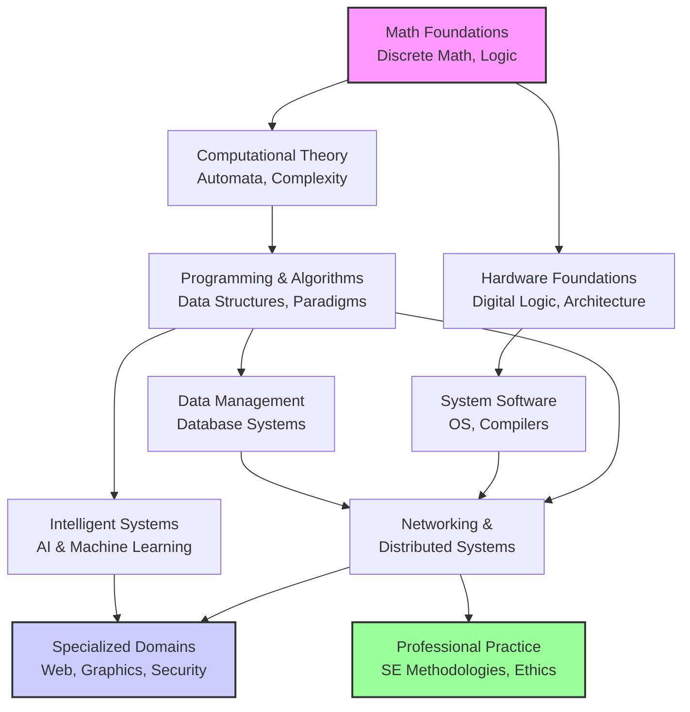
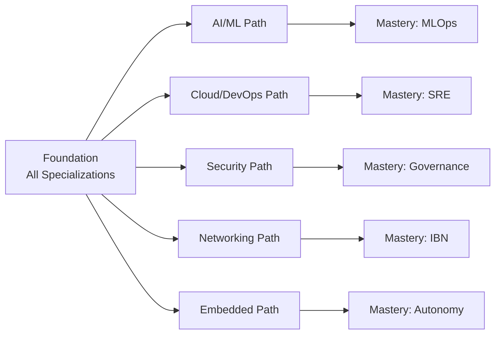
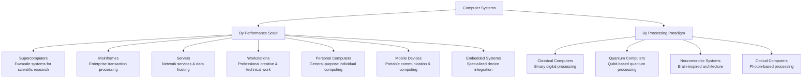
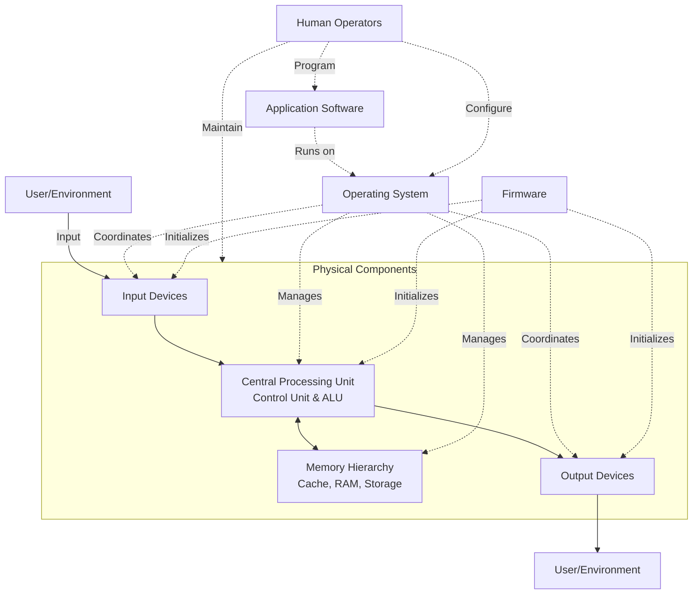
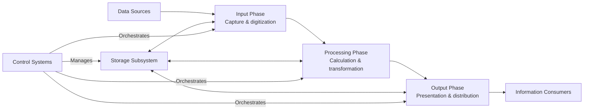
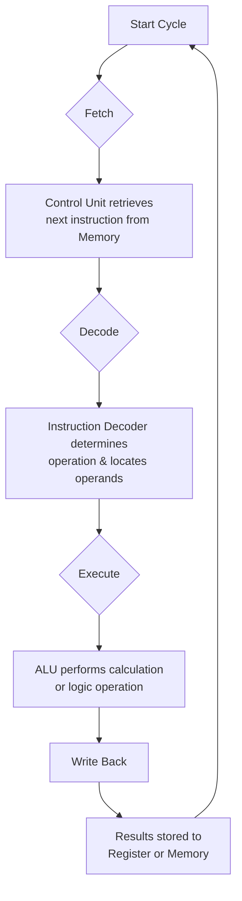
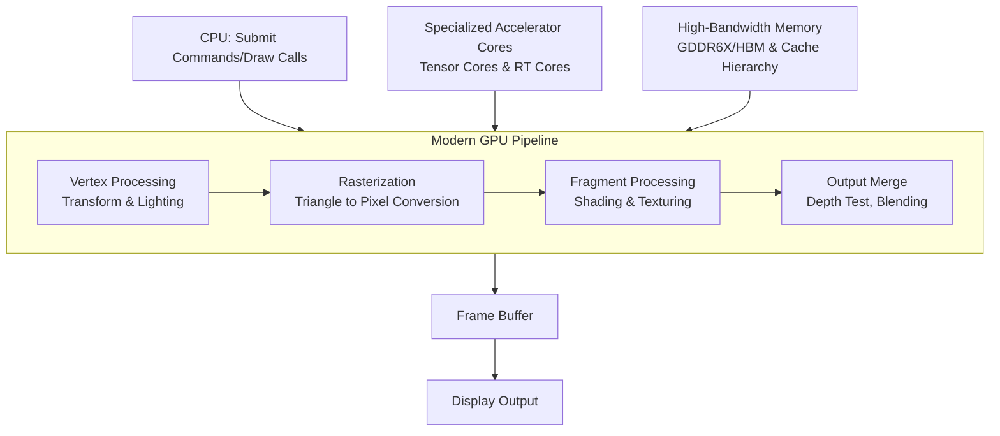
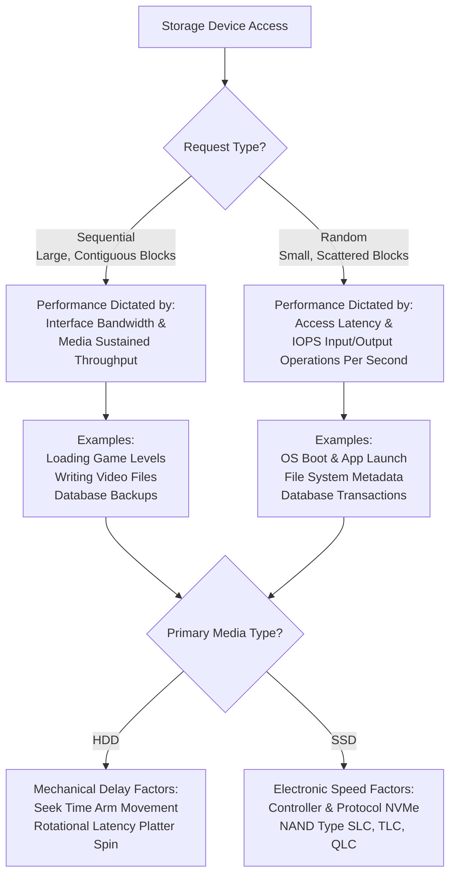
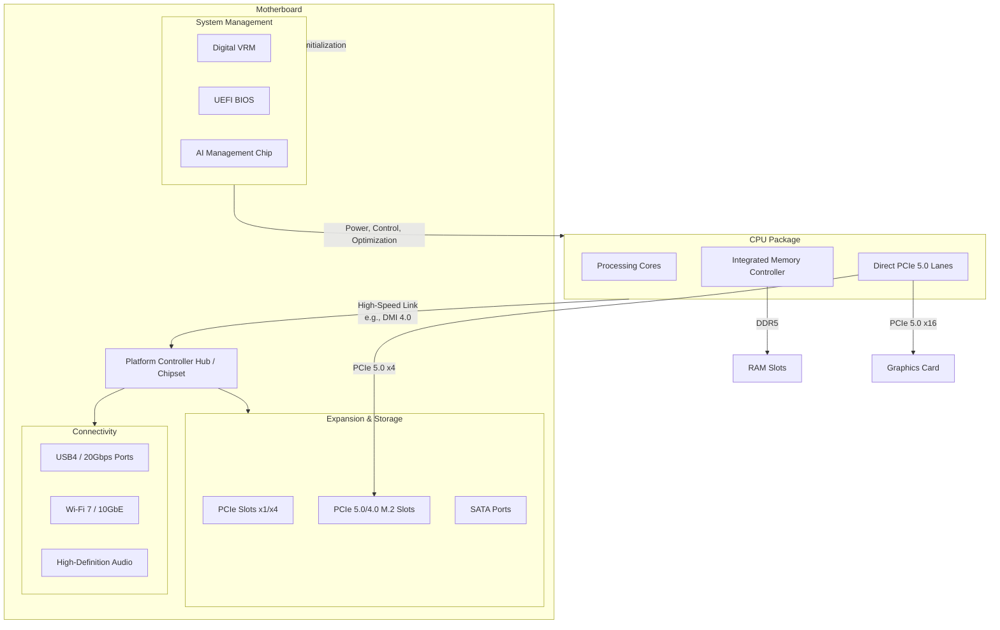

<br><br><br><br>

<h1 align="center">MR. SAM ROHAN</h1>
<h3 align="center">PRECISION IN EXECUTION - SUPREMACY IN IMPACT!</h3>

<br>

<p align="center">
    <a href="https://github.com/mrsamrohan">
        
    </a>
</p>


<br><br>


<h1 align="center">The Advanced Computer Science and Engineering Mastery Framework: A Unified Curriculum for the Modern Era.</h1>

<br>

 
## **Executive Summary: The Interdisciplinary Imperative**

The technological landscape of the 21st century is defined by rapid, convergent evolution, where innovation emerges at the intersection of disciplines. Computer Science and Engineering (CSE) is no longer a siloed field but the fundamental substrate upon which all modern sectors are built. This framework synthesizes decades of pedagogical research, industry evolution, and emergent paradigms into a coherent, structured curriculum. It moves beyond linear educational models to present knowledge as a dynamic, interconnected graph—a directed network where robust foundational theory enables and informs advanced specialized practice. Designed for aspiring engineers, transitioning professionals, and academic institutions alike, this document serves as both a navigational map and a strategic compass for traversing the complex, rewarding terrain of modern computing.

*   The discipline's expansion demands a curriculum that reflects its role as a horizontal enabler across vertical industries, from computational biology to fintech.
*   Success now requires a hybrid mindset: the rigor of a formal logician, the vision of a systems architect, the pragmatism of a software engineer, and the foresight of an ethical practitioner.
*   This framework is architected for adaptability, ensuring its core principles remain relevant amid the inevitable churn of specific tools and transient technologies.

 

## **1.0 Architectural Philosophy: A Knowledge Graph Approach**

Modern CSE mastery cannot be achieved through isolated topic acquisition. This curriculum is explicitly structured as a **Directed Acyclic Graph (DAG)**, where nodes represent knowledge domains and edges represent prerequisite relationships and conceptual dependencies.

*   This model acknowledges that learning is non-linear and contextual; understanding in one area reinforces and deepens understanding in another. For instance, grasping computational complexity (a node) is dependent on discrete mathematics (a prerequisite node) and directly informs the design of efficient algorithms (a dependent node).
*   The DAG structure allows for multiple valid learning pathways, accommodating different specializations and entry points while ensuring all paths build upon a verifiable, axiom-based foundation.
*   This approach mirrors the reality of modern technological systems, which are themselves complex networks of interdependent components, and trains the mind to think in terms of systems and relationships rather than in isolation.



*Visualization 1: A simplified knowledge graph illustrating prerequisite flow from foundational cores to advanced and applied domains.*

 

## **2.0 Curriculum Core: The Six-Volume Structure**

The framework is organized into six thematic volumes, each representing a major pillar of comprehensive CSE education. The progression from Volume I to Volume VI follows the DAG philosophy, moving from abstract foundations to concrete practice and integration.

### **Table 1: Framework Volume Overview**

| Volume | Title | Focus | Key Outcome |
| :--- | :--- | :--- | :--- |
| **I** | **The Immutable Foundations** | Mathematical & Theoretical Core | Ability to formalize problems and reason about computational limits. |
| **II** | **Systems Architecture** | Hardware & System Software | Understanding of the computing stack from transistors to operating systems. |
| **III** | **Programming & Data Management** | Software Construction & Data | Proficiency in crafting efficient, scalable software and managing persistent data. |
| **IV** | **The Networked & Intelligent Era** | Distributed Systems & AI | Skills to build connected, scalable, and intelligent applications. |
| **V** | **Specialized Domains** | Applied & Emerging Technologies | Ability to apply core principles to cutting-edge and domain-specific challenges. |
| **VI** | **Professional Practice** | Engineering Methodologies & Labs | Competence in professional software lifecycle, collaboration, and ethics. |

### **2.1 Volume I: The Immutable Mathematical and Theoretical Foundations**
This volume establishes the formal language and fundamental limits of computation, providing the tools for rigorous analysis and proof.
*   **Part 1: Mathematical Foundations** covers Discrete Mathematics, Graph Theory, and Probability & Statistics. These are not abstract exercises but the essential syntax for algorithm analysis, cryptographic protocol design, network modeling, and the statistical reasoning underpinning machine learning.
*   **Part 2: Computational Theory** explores Formal Languages, Automata, and Computational Complexity. This knowledge directly translates to compiler construction, protocol design, and the critical understanding of which problems are tractable and which require heuristic or approximate solutions.

### **2.2 Volume II: Systems Architecture: From Transistors to Cloud**
This volume details the hardware and system software that abstract raw silicon into a usable computational platform.
*   **Part 3: Hardware Fundamentals** connects Boolean algebra to physical transistor logic, computer organization, and advanced architecture concepts like parallelism, memory hierarchies, and heterogeneous computing, which are crucial for performance optimization.
*   **Part 4: System Software** demystifies Operating Systems as resource virtualization managers and Compilers as the bridge between high-level languages and machine code, highlighting their role in enabling modern cloud and polyglot environments.

### **2.3 Volume III: Programming and Data Management**
This volume focuses on the craft of constructing software and the science of organizing information.
*   **Part 5: Programming Methodologies** moves from fundamental paradigms (object-oriented, functional) to advanced concepts like concurrency, parallelism, and reactive programming, which are mandatory for leveraging modern multi-core hardware and building responsive systems.
*   **Part 6: Data Management** treats Data Structures & Algorithms as the essential toolkit for computational efficiency and Database Systems as specialized runtimes for persistent data, covering the evolution from ACID to BASE semantics in distributed contexts.

### **2.4 Volume IV: The Networked and Intelligent Era**
This volume addresses the two dominant paradigms of contemporary computing: interconnectivity and data-driven intelligence.
*   **Part 7: Networking & Distributed Systems** builds from layered network protocols (OSI/TCP/IP) to advanced topics like SDN and NFV, then confronts the core challenges of distributed systems—consensus, consistency, and fault tolerance—as articulated by the CAP theorem.
*   **Part 8: Intelligent Systems** provides a continuum from classical AI (search, planning) to modern statistical Machine Learning and Deep Learning, emphasizing both the transformative potential and the critical responsibilities around bias, fairness, and interpretability.

### **2.5 Volume V: Specialized Domains**
This volume demonstrates the application of core principles to specific technological frontiers and industry domains.
*   **Part 9: Emerging Technologies** covers full-stack Web Engineering, including modern frameworks and security, and the principles of Multimedia & Computer Graphics rendering pipelines.
*   **Part 10: Specialized Electives** explores frontiers like Quantum Computing, Bioinformatics, and Cryptocurrencies, illustrating the expanding scope of computational thinking.

### **2.6 Volume VI: Professional Practice**
This volume translates technical skill into professional efficacy, focusing on process, collaboration, and ethics.
*   **Part 11: Software Engineering Practice** covers methodologies (Agile, DevOps), tooling (CI/CD), and the non-technical context of work, including intellectual property, privacy laws, and professional ethics.
*   **Part 12: Laboratory and Practical Sessions** outlines hands-on labs and capstone projects designed to integrate knowledge across volumes, reinforcing theory with practice and simulating real-world development cycles.

 

## **3.0 Specialization Roadmaps: From Foundation to Mastery**

The knowledge graph allows for targeted traversal along defined career and interest paths. Each specialization follows a phased mastery model.

### **Table 2: Specialization Phase Progression**

| Specialization | Phase 1 (Foundation) | Phase 2 (Core) | Phase 3 (Advanced) | Phase 4 (Integration) | Phase 5 (Mastery) |
| :--- | :--- | :--- | :--- | :--- | :--- |
| **AI/ML** | Math, Python | Classical ML | Deep Learning | NLP, RL Systems | MLOps, Ethics |
| **Cybersecurity** | Sec Principles, Crypto | Defensive Tech | Offensive Security | Advanced Protections | Governance & Risk |
| **Cloud/DevOps** | Linux, Containers | Cloud Services | CI/CD Pipelines | Distributed Patterns | SRE & Chaos Eng. |
| **Network Eng.** | Protocol Fundamentals | Routing & Switching | Network Security | Automation (IaC) | SDN, IBN |
| **Embedded Systems** | Interdisciplinary Basics | µC Programming | Control Systems | Robotic Systems | Autonomy & SLAM |



*Visualization 2: Specialization roadmaps branching from a common foundational core.*

*   **Artificial Intelligence & Machine Learning Specialization** begins with the mathematical lingua franca (linear algebra, calculus, probability) and programming proficiency, advances through classical statistical learning and deep neural architectures, and culminates in the operational and ethical challenges of deploying, monitoring, and maintaining responsible AI systems in production.
*   **Cybersecurity Specialization** evolves from understanding core principles (CIA triad, cryptography) and attack surfaces, through practical defensive and offensive security techniques, to advanced organizational strategies like zero-trust architecture, threat intelligence, and security governance that aligns technical controls with business objectives.
*   **Cloud Computing & DevOps Specialization** starts with virtualization and containerization fundamentals, builds proficiency in major cloud platform primitives, automates software delivery through CI/CD pipelines, implements distributed systems patterns, and graduates to the holistic practice of Site Reliability Engineering (SRE), which treats operations as a software problem.
*   **Network Engineering Specialization** progresses from fundamental routing and switching concepts, through advanced protocol implementation and security, into the modern paradigm of network automation and Infrastructure as Code (IaC), finally reaching emerging architectures like Software-Defined Networking (SDN) and Intent-Based Networking (IBN).
*   **Mechatronics & Embedded Systems Specialization** integrates knowledge from mechanical, electrical, and computer engineering, starting with microcontroller programming and real-time systems, moving into control theory and robotics, and advancing to the challenges of autonomous system design, including sensor fusion, SLAM, and path planning.

 

## **4.0 The Practitioner's Toolkit: Development Ecosystems**

### **4.1 Development Environment Mastery**
A professional's effectiveness is tied to their mastery of the tools and environments that shape modern software creation and deployment.
*   **Linux Systems Administration** is a fundamental skill, providing control over the dominant server-side environment, from shell scripting and process management to advanced system administration, performance tuning, and infrastructure automation.
*   **Containerization & Orchestration**, primarily through Docker and Kubernetes, represents the standard unit of software deployment, enabling environment consistency, scalable orchestration, and a clean separation between application logic and infrastructure concerns.
*   **Infrastructure as Code (IaC)**, using tools like Terraform and Ansible, treats server and cloud configuration as version-controlled, reviewable software, ensuring reproducible, auditable, and scalable infrastructure management.

### **4.2 Programming Language Ecosystems**
Language selection is a strategic decision based on problem domain, performance requirements, and ecosystem support.
*   **Systems Programming Languages (C, C++, Rust)** offer low-level control and high performance. C provides minimal abstraction for OS and embedded work. C++ adds high-level abstractions with minimal cost. Rust delivers C++-level performance with compile-time guarantees for memory and thread safety.
*   **Managed Runtime Languages (Java, C#, Go)** prioritize developer productivity and platform robustness. Java and C# thrive in large-scale enterprise environments with vast frameworks. Go excels in networked services and cloud-native tooling due to its simplicity and built-in concurrency model.
*   **Dynamic Languages (Python, JavaScript)** enable rapid development and prototyping. Python dominates data science, scripting, and backend services. JavaScript is indispensable for web development, with Node.js enabling full-stack JavaScript applications.

### **4.3 Hardware Considerations**
Optimal hardware accelerates development and iteration cycles, particularly for specialized workloads.
*   **Performance-Optimized Workstations** for machine learning, simulation, or compilation require a balanced focus: high core-count CPUs (AMD Ryzen/Threadripper, Intel Core i9/Xeon), capable GPUs (NVIDIA RTX/Quadro, AMD Radeon), ample and fast RAM (32GB+), and NVMe SSD storage for active projects.
*   **Development Environment Consistency** is more critical than raw power for most teams. Using containerization and IaC to ensure identical toolchains and dependencies across all development, testing, and production environments eliminates the pervasive "works on my machine" problem.

 

## **5.0 Professional Development and Continuous Learning**

Technical mastery must be coupled with professional skills to have full impact.
*   **Technical Communication and Collaboration** are force multipliers. This includes writing clear documentation and commit messages, effectively using Git for version control and collaboration, and participating in constructive code reviews that improve both code quality and team knowledge sharing.
*   **Strategic Career Development** involves building a tangible portfolio through open-source contributions or personal projects, systematically preparing for technical interviews (algorithms, system design), and, most importantly, institutionalizing **continuous learning** to keep pace with the field's evolution through courses, conferences, and research.

 

## **6.0 Conclusion: The Integrative Practitioner**

The modern computer scientist or engineer is an integrative practitioner. This framework provides the structured pathways to build depth within specialized domains while emphasizing the interconnectedness of all components of the computational ecosystem. Success demands more than technical proficiency; it requires the intellectual agility to learn continuously, the humility to collaborate effectively, and the wisdom to consider the broader ethical and societal implications of technological work.
 

<br><br><br><br>

<h1 align="center">The Evolution and Architecture of Modern Computing Systems.</h1>

<br>


## Executive Summary

Computing has evolved from simple counting tools to sophisticated systems capable of artificial intelligence and quantum computation. This comprehensive documentation explores the historical development, architectural components, functional principles, and modern implementations of computer systems. Through detailed analysis of hardware, software, and their synergistic interactions, we present a holistic view of computing technology suitable for both technical professionals and informed enthusiasts.

## 1. Historical Evolution of Computing Technology

### 1.1 Pre-Mechanical Computing Foundations

The journey of computational devices began millennia before electronic computers, with early tools establishing fundamental principles of calculation and data representation.

- **The Abacus (c. 2000 BC):** This ancient calculating frame, consisting of beads sliding on rods, represented one of humanity's first systematic approaches to arithmetic computation. While limited to basic operations, the abacus introduced concepts of positional notation and manual calculation that would inform later mechanical devices. Its enduring legacy persists in educational contexts and as a cultural artifact demonstrating early computational thinking.

- **John Napier's Contributions (1550–1617):** The Scottish mathematician revolutionized calculation through his invention of logarithms, which transformed complex multiplication and division problems into simpler addition and subtraction operations. His supplementary device, "Napier's Bones," consisting of numbered rods that could be arranged to perform multiplication and division, represented an important step toward mechanical calculation aids that reduced human computational error and effort.

- **Blaise Pascal's Pascaline (1642):** As one of the first mechanical calculators, Pascal's device employed a series of gears and wheels to perform addition and subtraction automatically. While limited in functionality and prone to mechanical limitations, the Pascaline demonstrated that machines could execute arithmetic operations without human intervention during the calculation process, establishing foundational principles for automated computation.

### 1.2 The Conceptual Birth of Programmable Computing

The 19th century witnessed the conceptualization of machines that would define modern computing architecture, though technological limitations prevented their full realization during their era.

- **Charles Babbage's Vision (1791–1871):** Often called the "father of the computer," Babbage designed two revolutionary machines—the Difference Engine and the Analytical Engine. The Difference Engine, intended to calculate polynomial functions and produce mathematical tables, demonstrated that complex calculations could be mechanized. His more ambitious Analytical Engine incorporated concepts remarkably similar to modern computers: a central processing unit (the "mill"), memory (the "store"), and programmability via punched cards, establishing the architectural blueprint for subsequent computing development.

- **Ada Lovelace's Algorithmic Insight (1815–1852):** Collaborating with Babbage, Lovelace authored what is considered the first algorithm specifically designed for machine execution. Her notes on the Analytical Engine extended beyond mere calculation, envisioning computers as general-purpose symbol manipulation devices capable of processing music, art, and abstract concepts. This foresight established her as the first computer programmer and articulated a vision of computing that would take nearly a century to realize fully.

### 1.3 Generational Progression of Electronic Computers

The evolution of electronic computers can be categorized into distinct generations, each marked by transformative technological breakthroughs that exponentially increased capabilities while reducing size and cost.

#### Table 1: Generations of Computer Evolution

| Generation | Timeline | Key Technology | Characteristics | Representative Systems |
|------------|----------|----------------|-----------------|------------------------|
| **First** | 1940-1956 | Vacuum Tubes | Room-sized, single-tasking, machine language programming, high heat output | ENIAC, UNIVAC I, EDSAC |
| **Second** | 1956-1963 | Transistors | Smaller size, reduced heat, assembly language, early high-level languages | IBM 7090, UNIVAC II, IBM 1401 |
| **Third** | 1964-1971 | Integrated Circuits | Miniaturization, multitasking, keyboards/monitors, operating systems | IBM System/360, PDP-8, DEC-10 |
| **Fourth** | 1972-2010 | Microprocessors | Personal computing, GUIs, networks, VLSI technology | Apple II, IBM PC, Intel-based systems |
| **Fifth** | 2010-Present | AI & Quantum | Parallel processing, machine learning, quantum bits, neural networks | IBM Watson, Google TPUs, Quantum processors |

#### 1.3.1 First Generation: Vacuum Tube Era (1940-1956)

The first electronic computers employed vacuum tubes as switching elements, enabling digital computation but with significant limitations in reliability, size, and power consumption. These systems typically occupied entire rooms, required specialized environments with extensive cooling, and operated at speeds measured in thousands of operations per second. Programming occurred directly in machine language or through physical reconfiguration of circuitry, making software development exceptionally challenging. Despite these constraints, first-generation computers proved invaluable for scientific calculations, cryptographic analysis, and early business data processing, demonstrating the potential of electronic computation.

#### 1.3.2 Second Generation: Transistor Revolution (1956-1963)

The invention of the solid-state transistor fundamentally transformed computing by replacing bulky, failure-prone vacuum tubes with smaller, more reliable semiconductor devices. This technological shift enabled computers to become more compact, energy-efficient, and affordable. Concurrently, software development advanced through the introduction of assembly languages and early high-level programming languages like FORTRAN and COBOL, which abstracted hardware complexities and improved programmer productivity. These developments expanded computing from specialized scientific and military applications into commercial and administrative domains.

#### 1.3.3 Third Generation: Integrated Circuit Integration (1964-1971)

The development of integrated circuits, which packaged multiple transistors and other components onto a single silicon chip, initiated an era of exponential miniaturization known as Moore's Law. This integration enabled substantial increases in computational speed and reliability while reducing costs. Operating systems emerged as essential software layers managing hardware resources and providing standardized interfaces for applications. The combination of integrated circuitry and sophisticated software made computing accessible to medium-sized businesses, universities, and research institutions, fostering widespread adoption.

#### 1.3.4 Fourth Generation: Microprocessor Democratization (1972-2010)

The creation of the microprocessor—an entire central processing unit on a single chip—catalyzed the personal computing revolution. Systems like the Apple II and IBM Personal Computer brought computational power directly to individuals, small businesses, and educational institutions. Graphical user interfaces replaced command-line interactions, making computers approachable for non-technical users. Concurrent developments in networking, particularly the emergence of the internet, transformed computers from isolated calculation devices into communication and information-access platforms with global reach.

#### 1.3.5 Fifth Generation: Intelligent and Quantum Systems (2010-Present)

Current computing development focuses on artificial intelligence, machine learning, and quantum computation. AI systems employ neural networks and deep learning algorithms to perform pattern recognition, natural language processing, and decision-making tasks that traditionally required human intelligence. Quantum computing, while still in early stages, leverages quantum mechanical phenomena like superposition and entanglement to solve specific problem classes exponentially faster than classical computers. These technologies converge in systems capable of autonomous operation, predictive analytics, and solving previously intractable problems in optimization, materials science, and cryptography.

### 1.4 Contemporary Computer Classification

Modern computing devices span a spectrum of capabilities tailored to specific applications, from individual productivity tools to systems solving global-scale problems.



- **Supercomputers:** These represent the pinnacle of classical computational power, employing massive parallel architectures with hundreds of thousands of processing cores to perform exascale calculations (quintillions of operations per second). Applications include climate modeling, molecular dynamics simulation, astrophysical modeling, and cryptographic analysis where problem complexity exceeds the capabilities of conventional systems. Modern examples like Frontier and Fugaku consume megawatts of power and require specialized cooling infrastructures, representing substantial investments reserved for national laboratories and research institutions.

- **Mainframe Computers:** Designed for reliability, security, and high-volume transaction processing, mainframes remain foundational to global financial systems, government operations, and large-scale enterprise resource planning. Their architecture emphasizes input/output throughput, fault tolerance through redundant components, and continuous availability measured in "five nines" (99.999%) uptime. While less visible than consumer devices, mainframes process the majority of the world's financial transactions and critical database operations daily.

- **Quantum Computers:** Leveraging quantum mechanical principles, these systems employ qubits that can exist in superposition states (representing both 0 and 1 simultaneously) and entanglement correlations that enable exponential parallelism for specific algorithms. Current implementations face challenges including decoherence, error rates, and extreme environmental requirements (near absolute zero temperatures). Despite these limitations, quantum computers have demonstrated "quantum supremacy" for specialized tasks and promise revolutionary advances in cryptography, materials discovery, and complex system optimization once technological hurdles are overcome.

## 2. Computer System Architecture and Components

### 2.1 Holistic System Perspective

A computer system constitutes an integrated ecosystem of interacting components that collectively transform input data into meaningful output through controlled processing. This ecosystem extends beyond physical hardware to encompass software layers, human operators, and interconnection frameworks that enable coordinated functionality.



### 2.2 Hardware: The Physical Foundation

Hardware encompasses the tangible electronic and mechanical components that constitute a computer's physical presence and computational capabilities.

#### 2.2.1 Central Processing Unit (CPU)

The CPU serves as the primary computational engine, executing instruction sequences fetched from memory. Modern CPUs incorporate multiple processing cores on a single die, each capable of independent instruction execution, while hyper-threading technology allows each physical core to manage multiple instruction threads simultaneously. Key architectural elements include:

- **Control Unit:** Coordinates instruction fetching, decoding, and execution across the processor pipeline, managing data movement between components and implementing security boundaries between processes.
- **Arithmetic Logic Unit (ALU):** Performs mathematical calculations and logical comparisons, with modern implementations featuring multiple specialized ALUs for integer, floating-point, and vector operations.
- **Cache Hierarchy:** Multi-level memory structures (L1, L2, L3) integrated directly with the CPU cores provide low-latency access to frequently used data and instructions, with sizes ranging from kilobytes to megabytes per core.
- **Instruction Set Architecture (ISA):** The interface definition between software and hardware, with dominant architectures including x86 (Intel/AMD), ARM (mobile/embedded), and RISC-V (emerging open standard).

#### 2.2.2 Memory Subsystem

Computer memory exists in a hierarchical organization balancing speed, capacity, and cost, with faster, smaller memories closer to the CPU and larger, slower storage further removed.

- **Random Access Memory (RAM):** Volatile primary memory providing working storage for active programs and data. Modern DDR5 SDRAM modules offer transfer rates exceeding 50 GB/s with capacities up to 128GB per module. RAM characteristics significantly influence system responsiveness, particularly for memory-intensive applications and multitasking environments.

- **Storage Systems:** Non-volatile secondary storage preserves data when power is removed, with solid-state drives (SSDs) using NAND flash memory increasingly replacing mechanical hard disk drives (HDDs). NVMe (Non-Volatile Memory Express) interfaces directly connect SSDs to the CPU via PCIe lanes, achieving transfer speeds exceeding 7,000 MB/s compared to SATA's 600 MB/s limitation.

#### 2.2.3 Motherboard and Interconnect Infrastructure

The motherboard provides the physical and electrical foundation connecting all system components through layered communication pathways.

- **Chipset:** Manages data flow between CPU, memory, and peripheral devices, with modern implementations integrating previously separate northbridge (memory/GPU interface) and southbridge (I/O functions) components.
- **Expansion Slots:** PCIe (Peripheral Component Interconnect Express) slots provide configurable lane allocations (x1, x4, x8, x16) for graphics cards, storage controllers, network adapters, and specialized acceleration cards, with PCIe 5.0 offering 128 GB/s bandwidth in x16 configuration.
- **Power Delivery:** Voltage regulator modules (VRMs) convert and condition power supply output to precise voltages required by sensitive components, with multi-phase designs distributing electrical load and thermal stress across multiple circuits for stability.

#### Table 2: Hardware Component Specifications and Functions

| Component | Primary Function | Key Specifications | Modern Examples |
|-----------|-----------------|-------------------|-----------------|
| **CPU** | Instruction execution | Cores/threads, clock speed, cache size, TDP | Intel Core i9, AMD Ryzen 9, Apple M2 |
| **GPU** | Parallel processing, graphics rendering | CUDA/Stream processors, VRAM, bandwidth | NVIDIA RTX 4090, AMD Radeon RX 7900 |
| **RAM** | Temporary data storage | Capacity, speed, latency, channels | DDR5-6400, 32GB dual-channel kits |
| **SSD** | Persistent data storage | Capacity, interface, read/write speeds | NVMe Gen4, 2TB, 7000/5000 MB/s |
| **Motherboard** | Component interconnection | Chipset, form factor, expansion slots | ATX, Z790 chipset, PCIe 5.0 x16 |
| **PSU** | Power conversion and delivery | Wattage, efficiency rating, modularity | 850W, 80+ Platinum, fully modular |

### 2.3 Software: The Logical Layer

Software provides the instructions that direct hardware operation, creating abstraction layers that simplify complex operations and enable application development.

#### 2.3.1 Operating Systems

The operating system serves as an intermediary between applications and hardware, managing resources and providing essential services:

- **Kernel:** Core component managing memory, processes, devices, and system calls. Modern kernels support modular architecture with loadable drivers and real-time capabilities for time-sensitive applications.
- **File Systems:** Organize persistent data storage with metadata structures tracking file attributes, permissions, and physical allocation. Advanced file systems like ZFS and Btrfs incorporate integrity verification, snapshots, and software RAID capabilities.
- **Security Subsystems:** Implement access control, encryption, audit logging, and malware protection through integrated frameworks like SELinux, Windows Defender, and Apple's Gatekeeper.

#### 2.3.2 Application Software Categories

- **Productivity Software:** Office suites, database management systems, and development environments that enable creation, analysis, and communication of information across personal and professional domains.
- **Specialized Applications:** Domain-specific software for computer-aided design, scientific simulation, financial modeling, and creative media production that leverage hardware acceleration and specialized algorithms.
- **Middleware:** Software bridges enabling communication between disparate applications and systems, including database connectors, message queues, and web application servers that facilitate distributed computing.

### 2.4 Human and Organizational Elements

Computing systems exist within human contexts that significantly influence their design, operation, and effectiveness.

- **Human-Computer Interaction (HCI):** The study and design of interfaces between humans and computers, encompassing input methods, visual design, accessibility considerations, and user experience optimization. Modern HCI incorporates voice recognition, gesture control, and adaptive interfaces that respond to user behavior and context.
- **Accessibility Technologies:** Software and hardware adaptations enabling users with diverse physical, sensory, and cognitive abilities to effectively utilize computing resources. These include screen readers, voice control systems, alternative input devices, and interface customization frameworks mandated by regulations like Section 508 and WCAG guidelines.
- **Organizational Integration:** The processes, policies, and training that enable effective technology utilization within institutional contexts, including change management, cybersecurity awareness, and continuous skill development in rapidly evolving technical landscapes.

## 3. Core Computational Functions and Processes

### 3.1 The Information Processing Cycle

All computer operations fundamentally involve the transformation of input data into output information through systematic processing stages.



#### 3.1.1 Input Operations

Input mechanisms translate real-world phenomena into digital representations processable by computing systems. Modern input extends beyond traditional keyboards and mice to encompass:

- **Sensor Networks:** Distributed arrays of environmental, biological, and industrial sensors providing continuous data streams for monitoring and control applications.
- **Biometric Interfaces:** Fingerprint readers, facial recognition systems, and iris scanners that authenticate identity while collecting biological data for security and personalization.
- **Natural Language Input:** Voice recognition systems converting spoken language to text with increasing accuracy through machine learning models trained on vast linguistic datasets.

#### 3.1.2 Processing Operations

The CPU executes stored program instructions that manipulate data according to algorithmic logic, with modern processors employing several optimization strategies:

- **Pipelining:** Dividing instruction execution into sequential stages (fetch, decode, execute, memory access, writeback) allowing multiple instructions to be processed simultaneously like an assembly line.
- **Speculative Execution:** Predicting program branches and pre-executing likely instruction paths to avoid pipeline stalls, though this introduces security considerations like Spectre and Meltdown vulnerabilities.
- **Parallel Processing:** Simultaneous execution across multiple cores, with synchronization mechanisms ensuring data consistency while maximizing computational throughput for parallelizable workloads.

#### 3.1.3 Output Operations

Output systems translate processed digital information into human-perceivable forms or machine-actionable commands:

- **Visual Output:** Display technologies including LCD, OLED, and emerging microLED panels with resolutions up to 8K, refresh rates exceeding 360Hz for gaming, and HDR (High Dynamic Range) for enhanced contrast and color fidelity.
- **Haptic Feedback:** Tactile response systems simulating physical sensations through vibration, resistance, and temperature variation in controllers, touchscreens, and virtual reality interfaces.
- **Machine-to-Machine Output:** Automated signals directing external systems including industrial robots, building controls, and vehicular systems through standardized communication protocols.

### 3.2 Essential Computing Characteristics

Modern computers exhibit several defining attributes that distinguish them from earlier computational aids and enable their transformative societal impact.

- **Automation Capability:** Once programmed, computers execute complex sequences without human intervention, enabling continuous operation in monitoring, manufacturing, and data analysis applications where consistency and endurance surpass human capabilities. This automation extends through robotic process automation (RPA) that mimics human interaction with software interfaces and industrial control systems that manage physical processes.

- **Precision and Reliability:** Digital computers perform calculations with exactness determined by their numerical representation systems (typically IEEE 754 floating-point standard), with error rates substantially below those of human computation. Hardware reliability is ensured through error-correcting codes in memory, redundant components in critical systems, and thermal monitoring that prevents damage from overheating.

- **Speed and Scalability:** Modern processors execute billions of instructions per second, with performance scaling across multiple dimensions: clock frequency (GHz), parallel cores, vector processing width, and distributed computing networks. This scalability enables applications ranging from real-time video processing to decade-long climate simulations through appropriate resource allocation.

- **Storage Capacity and Hierarchy:** Contemporary systems manage data across storage tiers from CPU registers (nanosecond access) through cache, RAM, SSDs, HDDs, to cloud storage (millisecond to second access). Automated tiering systems migrate frequently accessed data to faster storage while archiving less active data to more economical mediums, optimizing both performance and cost.

- **Versatility and Programmability:** Unlike single-purpose devices, general-purpose computers execute diverse software applications without hardware modification. This programmability enables rapid adaptation to new tasks through software updates rather than physical replacement, though specialized accelerators (GPUs, TPUs, FPGAs) provide optimized performance for specific computational patterns.

## 4. Modern Computing Infrastructure and Future Directions

### 4.1 Convergence of Computing Paradigms

Contemporary computing architecture integrates multiple processing approaches within unified systems:

- **Heterogeneous Computing:** Combining general-purpose CPUs with specialized processors (GPUs, AI accelerators, FPGAs) that efficiently handle particular workload types. Unified memory architectures and high-bandwidth interconnects like NVLink enable seamless data sharing between these components.
- **Edge-Cloud Continuum:** Distributing computation across device-local processing (edge), intermediate fog nodes, and centralized cloud data centers based on latency requirements, privacy considerations, and bandwidth constraints. This continuum supports applications from autonomous vehicles requiring instant decisions to big data analytics benefiting from cloud-scale resources.
- **Quantum-Classical Hybrid Systems:** Emerging architectures that delegate appropriate subproblems to quantum processors while managing overall workflow on classical systems, recognizing that quantum advantage applies to specific algorithmic patterns rather than general computation.

### 4.2 Emerging Technological Frontiers

Several developing technologies promise to redefine computing capabilities in coming decades:

- **Neuromorphic Computing:** Hardware designs mimicking biological neural networks through spiking neurons and synaptic connections, offering potentially dramatic efficiency improvements for pattern recognition and sensory processing tasks. Research systems like Intel's Loihi demonstrate orders-of-magnitude power reduction for suitable workloads compared to conventional architectures.
- **Photonic Computing:** Using light rather than electricity for computation and interconnection, with potential advantages in speed, bandwidth, and power consumption for specific applications like matrix multiplication fundamental to neural network operations. Integrated silicon photonics enables increasingly complex optical circuits alongside electronic control logic.
- **Molecular and DNA Computing:** Exploring computation using biological molecules, with DNA-based systems offering extraordinary density for archival storage (theoretically exabytes per gram) and chemical reaction networks performing parallel processing through molecular interactions.

### 4.3 Sustainability and Ethical Considerations

As computing permeates society, its environmental and social impacts demand systematic consideration:

- **Energy Efficiency:** While computational efficiency has improved exponentially (Koomey's Law describes doubling of computations per kilowatt-hour approximately every 1.5 years), absolute energy consumption continues rising with increased deployment. Advanced cooling technologies, renewable energy integration, and algorithmic efficiency improvements represent critical research directions.
- **Electronic Waste Management:** With rapid hardware obsolescence cycles, responsible recycling and circular economy approaches for computing equipment are essential to limit environmental contamination from heavy metals and rare earth elements while recovering valuable materials.
- **Algorithmic Fairness and Transparency:** As automated decision-making systems influence employment, finance, justice, and healthcare, ensuring they operate without harmful bias and with appropriate human oversight represents both technical challenge and ethical imperative requiring interdisciplinary collaboration.

## 5. Conclusion: The Trajectory of Computational Evolution

The evolution of computing represents one of humanity's most transformative technological narratives, progressing from manual calculation aids to systems exhibiting aspects of intelligence and approaching fundamental physical limits of computation. Each generational shift—from mechanical to vacuum tube, transistor to integrated circuit, microprocessor to intelligent system—has expanded what questions can be computationally addressed while making these capabilities increasingly accessible.

Contemporary computing architecture reflects this evolutionary history through layered abstraction: quantum phenomena manipulated at physical layers, transistors organized into logic gates, gates assembled into functional units, units coordinated as processors, processors managed by operating systems, and systems directed by human intent through increasingly natural interfaces. This stratification enables specialization and innovation at each level while maintaining compatibility across the stack.

Future development will likely continue along multiple parallel trajectories: classical systems approaching atomic-scale limits while employing three-dimensional integration and specialized accelerators; quantum systems progressing from noisy intermediate-scale devices toward fault-tolerant universal computation; and biological-inspired architectures reimagining fundamental computational paradigms. Throughout these technical advancements, the most profound impacts may emerge not from raw computational power alone, but from sophisticated integration of these systems with human society through intuitive interfaces, equitable access, and thoughtful application to pressing global challenges.

As computing continues its exponential progression, maintaining perspective on its human purposes—augmenting intellect, facilitating communication, automating routine tasks, and exploring complex systems—remains essential. The most significant measure of computational evolution may ultimately be not teraflops or qubit counts, but how effectively these systems extend human capabilities, deepen understanding, and improve quality of life while respecting planetary boundaries and ethical considerations.


<br><br><br><br>


<h1 align="center">The Central Processing Unit (CPU): The Brain of the Digital Age.</h1>

<br>

### **Executive Summary**

The Central Processing Unit (CPU) is the fundamental, indispensable engine at the heart of every modern computing device. From the smartphone in your pocket to the supercomputers modeling climate change, the CPU executes the instructions that power our digital world. This document provides a comprehensive analysis of CPU technology, exploring its core operational principles, the low-level assembly languages that command it, the competing architectural philosophies that define its design, and the dynamic landscape of manufacturers. Understanding the CPU’s evolution—from simple calculators of data to sophisticated systems-on-a-chip (SoCs) integrating artificial intelligence—is key to appreciating the technological foundation of contemporary society. We will delve into its internal mechanisms, its language, its varied forms, and the relentless innovation that continues to push the boundaries of performance and efficiency.

 

### **1. The CPU: Core Functions and Architectural Principles**

At its essence, a CPU is a hardware component designed to execute sequences of stored instructions, known as programs. It performs this role through the relentless, coordinated operation of specialized sub-units, transforming input data into meaningful output.

*   **The Fetch-Execute Cycle: The Heartbeat of Computation**
    The primary operation of every CPU is governed by the **fetch-decode-execute cycle**, a continuous loop that is the fundamental pulse of computation. This process begins when the **Control Unit** retrieves an instruction from the computer's main memory (RAM). This instruction, represented as a binary number, is then decoded to determine the required operation—whether it be an arithmetic calculation, a logical comparison, or a data movement. The decoded command directs the **Arithmetic Logic Unit (ALU)** to perform the specific task. The ALU carries out basic arithmetic like addition and subtraction, and logical operations like AND/OR comparisons. The results are subsequently written back to the system's memory or to internal, ultra-fast storage locations called **registers**. This cycle repeats billions of times per second, synchronized by the CPU's clock signal. Supporting this core operation is the **bus interface unit**, which manages all communication between the CPU and the rest of the computer system over the front-side bus or modern interconnects.

*   **Measuring Performance: Beyond Clock Speed**
    CPU performance is a multifaceted metric influenced by several interlinked factors. **Clock speed**, measured in gigahertz (GHz), indicates how many cycles a CPU can complete per second and has traditionally been a simple gauge of speed. However, it is not the sole determinant. Modern CPUs contain multiple independent processing units called **cores**. A multi-core processor can execute several instruction streams in true parallel, dramatically improving performance for multitasking and software specifically engineered for concurrency. Furthermore, technologies like **Hyper-Threading (Intel) or Simultaneous Multithreading (SMT, AMD)** allow a single physical core to manage two separate "threads" of execution simultaneously. This improves overall efficiency by making better use of the core's execution resources, such as allowing one thread to use the arithmetic units while another accesses memory, thereby increasing throughput.

*   **The Memory Hierarchy: The Critical Role of Cache**
    Accessing the main system memory (RAM) is relatively slow compared to the CPU's execution speed. To mitigate this bottleneck, CPUs integrate small amounts of extremely fast **cache memory** directly onto the processor die. This memory hierarchy typically includes three levels. The **L1 cache** is the smallest (often 32-64KB per core) and fastest, dedicated to each core and split into separate caches for instructions and data. The **L2 cache** is larger (e.g., 512KB-1MB per core) and slightly slower, and may be shared between a small cluster of cores. The **L3 cache** is the largest (tens of megabytes) and slowest of the three, but still vastly faster than RAM, and is shared across all cores on a chip. The CPU uses sophisticated algorithms to store frequently accessed data and instructions in this cache, drastically reducing latency and avoiding performance stalls. Larger cache sizes, particularly L3 cache, are strongly correlated with improved performance in latency-sensitive tasks like gaming and complex computational simulations.

*   **Thermal Design Power (TDP) and Cooling**
    As CPUs perform work, they dissipate electrical energy as heat. The **Thermal Design Power (TDP)**, measured in watts, specifies the maximum amount of heat a cooling system must be able to dissipate. Effective **thermal management** is non-negotiable; excessive heat can cause thermal throttling (where the CPU reduces its clock speed to cool down) or permanent silicon degradation. Cooling solutions range from simple **heat sinks and fans** for standard builds to advanced **liquid cooling systems** for high-performance and overclocked machines. Proper cooling, combined with adequate case airflow, is absolutely essential for maintaining system stability, achieving advertised performance levels, and ensuring hardware longevity.



---

### **2. The Language of Hardware: Assembly Programming**

Between human-readable high-level code (like Python or Java) and the binary machine code (1s and 0s) executed by the CPU lies **assembly language**. It is a low-level programming language that provides a symbolic, one-to-one representation of a processor's machine code instructions, offering programmers unparalleled hardware control.

*   **Fundamental Purpose and Operation**
    Each assembly language is intrinsically tied to a specific **CPU architecture** and its **Instruction Set Architecture (ISA)**, such as x86-64 or AArch64 (ARM). Its primary role is to give programmers direct, precise command over hardware components like registers, memory addresses, and I/O ports. An assembly program is written using mnemonics—short, readable codes that correspond to machine instructions (e.g., `MOV` to move data, `ADD` for addition, `CMP` for compare). This textual source code is translated into executable machine code by a special program called an **assembler**. While not portable across different CPU families, assembly is indispensable for tasks where maximum performance, minimal resource use, or direct hardware manipulation is required. These tasks include writing operating system kernels, device drivers, firmware for embedded systems, and performance-critical sections of code in game engines or scientific computing libraries.

*   **Key Components and Syntax**
    An assembly program is built from several core elements. **Registers**, such as `RAX` or `R0`, are the CPU's internal, ultra-fast storage locations used for immediate data manipulation. **Instructions** are the mnemonic commands that tell the CPU what operation to perform. Each instruction operates on **operands**, which can be immediate data values (e.g., `5`), register names, or memory addresses. Programmers use **labels** to mark locations in the code for jumps and loops, and **directives** (or pseudo-ops) to guide the assembler itself, such as defining constants or reserving memory space. Assemblers can be **one-pass** or **multi-pass**, with the latter being more common in modern toolchains as they resolve forward references by building a symbol table first. The following table categorizes major assembly languages by their underlying architecture.

*   **A Taxonomy of Assembly Languages**

| Architecture Type | Assembly Language | Primary ISA | Typical Use Cases & Notes |
| :--- | :--- | :--- | :--- |
| **CISC** | x86/x86-64 Assembly | x86 (Intel, AMD) | Dominant in desktop, laptop, and server environments. Supports complex, variable-length instructions. |
| **RISC** | AArch64 / ARM Assembly | ARM (Apple Silicon, Qualcomm, AWS Graviton) | Ubiquitous in mobile, embedded, and increasingly in laptops/servers. Known for efficiency and load/store model. |
| **RISC** | RISC-V Assembly | RISC-V | Open-standard ISA gaining traction in embedded systems, research, and custom accelerators. |
| **RISC** | MIPS Assembly | MIPS | Historically significant in networking hardware, embedded systems (e.g., routers), and older consoles. |
| **RISC** | PowerPC Assembly | PowerPC | Legacy architecture used in older Apple Macintosh computers, game consoles (Wii, PlayStation 3), and IBM servers. |
| **Embedded** | AVR Assembly | AVR (Atmel/Microchip) | Extremely popular in microcontrollers (e.g., Arduino boards) for education and simple embedded control. |
| **Embedded** | PIC Assembly | PIC (Microchip) | Family of microcontrollers common in low-power embedded systems, automation, and consumer electronics. |
| **Legacy** | Z80 Assembly | Z80 | Iconic 8-bit ISA used in vintage systems like the ZX Spectrum and early CP/M computers. |
| **Legacy/Mainframe** | IBM System/360 Assembly | z/Architecture | Designed for IBM mainframe computers, focused on enterprise reliability and transaction processing. |

*   **Advantages, Disadvantages, and Modern Relevance**
    The principal advantage of assembly is **direct hardware control and optimization**. Programmers can write code that is perfectly tailored to the underlying hardware, squeezing out every bit of performance and minimizing memory footprint. This makes it crucial for **reverse engineering, cybersecurity analysis, bootloader development, and embedded systems programming** for microcontrollers and IoT devices where resources are extremely constrained. However, this power comes with significant trade-offs: assembly code is **not portable** between architectures, is **complex, time-consuming, and error-prone** to write and debug, and is notoriously difficult to maintain for large projects. Consequently, it is rare to write entire applications in assembly today. Instead, it is most often used for short, critical routines (often called "hot paths") within programs written primarily in higher-level languages like C, C++, or Rust, where these languages can interface with assembly via **inline assembly** or linking separate object files.

 

### **3. Architectural Philosophies and Classifications**

CPU architecture defines the fundamental design philosophy and instruction set that a processor uses. These philosophies dictate how software interacts with hardware and how performance and efficiency are balanced.

*   **The CISC vs. RISC Dichotomy**
    The two dominant historical paradigms are **Complex Instruction Set Computing (CISC)** and **Reduced Instruction Set Computing (RISC)**.
    *   **CISC (e.g., x86)**: Exemplified by the ubiquitous **x86 architecture** from Intel and AMD, the CISC philosophy employs a rich, varied set of instructions. Some instructions are powerful and can perform multi-step operations (like loading data from memory, performing a calculation, and storing the result back) in a single command. This design, which originated when memory was expensive, aimed to make compilers' work simpler and create more compact programs. Execution of these complex instructions is managed internally by **microcode**. While flexible and powerful for certain tasks, it can lead to more complex chip design, higher power consumption, and variable instruction execution times.
    *   **RISC (e.g., ARM, RISC-V)**: In contrast, the **RISC** philosophy, championed by architectures like **ARM**, **MIPS**, and the open-standard **RISC-V**, uses a smaller, highly optimized set of simple instructions. Each instruction is designed to execute in a single clock cycle whenever possible. RISC architectures enforce a **load/store** model, where only specific instructions (`LOAD`, `STORE`) access memory, and all calculations are performed on data already loaded into registers. This simplicity allows for more efficient pipelining, higher potential clock speeds, and generally superior performance-per-watt, which is why RISC designs like ARM dominate the mobile and embedded device markets.

*   **Flynn's Taxonomy: Classifying Parallel Processing**
    Beyond instruction set design, computer architectures can be classified by how they handle parallel processing of instructions and data. **Flynn's Taxonomy**, proposed by Michael J. Flynn in 1966, provides a seminal framework based on the number of concurrent **instruction streams** and **data streams**.
    *   **SISD (Single Instruction, Single Data)**: The traditional, sequential model. A single processor executes one instruction on one piece of data at a time. Early uniprocessor systems fit this model.
    *   **SIMD (Single Instruction, Multiple Data)**: A single instruction is applied to multiple data points simultaneously. This is crucial for vectorized operations common in graphics processing, scientific simulation, and multimedia. Modern CPU instruction set extensions like **AVX (x86)** and **NEON (ARM)** are SIMD units.
    *   **MISD (Multiple Instruction, Single Data)**: A rare architecture where multiple instructions operate on the same data stream, primarily used for fault tolerance in specialized systems like flight control computers.
    *   **MIMD (Multiple Instruction, Multiple Data)**: The most common and versatile architecture for general-purpose parallel computing. Multiple processors (or cores) operate independently on different data streams. All modern multi-core CPUs (Intel Core, AMD Ryzen), as well as distributed computing clusters, are MIMD systems.

*   **The Convergence and Modern Hybrid Designs**
    The distinction between CISC and RISC has blurred significantly in practice. Modern x86 processors translate their complex CISC instructions into smaller, RISC-like internal micro-operations (μops) for execution, gaining the benefits of RISC design internally. Conversely, RISC architectures like ARM have added more specialized and powerful instructions over time. The dominant trend today is **heterogeneous/hybrid architectures**. Designs like ARM's **big.LITTLE/DynamIQ**, Apple's **M-series**, and Intel's **Performance (P-core) + Efficiency (E-core)** designs combine high-performance cores with power-efficient cores on the same die. The operating system scheduler dynamically assigns demanding foreground tasks to the performance cores and background tasks to the efficiency cores, striking an optimal balance between peak speed and battery life.

The table below summarizes these key architectural approaches:

| Architecture Model | Key Philosophy / Trait | Example Implementations | Common Use Cases |
| :--- | :--- | :--- | :--- |
| **CISC** | Complex, multi-step instructions; microcode; memory-to-memory operations. | x86 (Intel Core, AMD Ryzen) | Desktop PCs, laptops, servers (legacy software compatibility). |
| **RISC** | Simple, single-cycle instructions; load/store architecture; register-heavy. | ARM (Apple M-series, Qualcomm Snapdragon), RISC-V | Mobile devices, embedded systems, modern efficiency-focused servers & laptops. |
| **Hybrid (Heterogeneous)** | Mix of high-performance & high-efficiency cores on one chip. | ARM big.LITTLE, Apple M-series, Intel 12th+ Gen Core | Smartphones, ultraportable laptops, performance-per-watt optimized desktops. |
| **SIMD (Flynn's)** | Single instruction applied to multiple data points. | CPU Vector Extensions (AVX, NEON), GPUs | Graphics rendering, video encoding, scientific data processing, machine learning inference. |
| **MIMD (Flynn's)** | Multiple independent processors/cores. | All modern multi-core CPUs, computer clusters. | General-purpose computing, multitasking, parallelized software (web servers, databases). |

 

### **4. The Competitive Landscape: Major CPU Brands and Markets**

The global CPU market is defined by intense competition between key players with distinct strategies, driving relentless innovation in performance, efficiency, and features.

*   **Intel Corporation: The x86 Pioneer**
    The long-time leader in the PC and server space, Intel is synonymous with the **x86 architecture**. Its consumer lines have evolved from the classic Core i-series to the new **Core Ultra series**, featuring hybrid core architectures (P-cores and E-cores) and integrated AI accelerators called **Neural Processing Units (NPUs)**. Its **Xeon** processors are designed for the reliability, scalability, and multi-socket capabilities demanded by servers and workstations. Intel also manufactures chips under its **foundry services** and produces **Atom** processors for low-power edge and embedded devices.

*   **Advanced Micro Devices (AMD): The Resilient Challenger**
    AMD has mounted a formidable challenge to Intel with its **Ryzen** series processors based on the **Zen architecture**. AMD's strategy has emphasized higher core and thread counts at competitive prices. Key innovations include the **chiplet design** (separating CPU cores from I/O dies for cost and yield efficiency), **3D V-Cache technology** (stacking additional L3 cache for gaming performance), and aggressive adoption of advanced manufacturing nodes. For the professional market, AMD offers the ultra-high-core-count **Ryzen Threadripper** for workstations and the **EPYC** series for servers, where it has captured significant market share.

*   **ARM Holdings: The Architecture Licensor**
    ARM represents a unique, fabless model in the industry. Unlike Intel and AMD, ARM does not manufacture chips. Instead, it **designs and licenses** its energy-efficient RISC processor cores and architectures to other companies. This business model has made the ARM ISA the undisputed standard for smartphones and tablets. Its influence has expanded into the PC market with **Apple's M-series** and into servers with Amazon's **Graviton**, Ampere Computing, and others. Companies like **Qualcomm** (Snapdragon), **Samsung** (Exynos), and **MediaTek** design system-on-chips (SoCs) using ARM cores.

*   **Apple Silicon: The Vertical Integrator**
    With its **Apple Silicon** (M1, M2, M3, M4 series), Apple has successfully transitioned its Mac ecosystem from Intel x86 to its own custom ARM-based SoCs. These chips are notable for their exceptional **performance-per-watt**, **unified memory architecture**, and deep integration of specialized processors (CPU, GPU, NPU, media engines) onto a single die. Apple's control over both hardware and software allows for optimizations that have redefined expectations for laptop battery life and silent performance.

*   **Market Dynamics and Specialized Players**
    The market is in a state of flux. AMD has achieved record desktop CPU market share, surpassing one-third of the x86 market against Intel. Simultaneously, ARM's share in client computing (PCs) is growing, primarily driven by Apple's success. Beyond these giants, companies like **IBM** (POWER processors for high-end servers), **Qualcomm** (pushing ARM into Windows PCs), and numerous manufacturers of **microcontrollers** (Microchip, STMicroelectronics, Renesas) for embedded systems play critical roles in specialized segments.

 

### **5. From Sand to Silicon: Manufacturing and Future Horizons**

Creating a modern CPU is one of humanity's most complex manufacturing feats. The process, known as **semiconductor fabrication**, involves building a chip with nanoscopic precision over months in multibillion-dollar facilities called "fabs."

*   **The Fabrication Process**
    It begins with purifying sand into crystalline silicon ingots, which are sliced into thin **wafers**. Through hundreds of repeated cycles of **photolithography**, **etching**, **deposition**, and **ion implantation**, billions of transistors and their interconnects are constructed layer by layer. **Extreme Ultraviolet (EUV) lithography** machines, produced almost exclusively by ASML, are essential for defining the smallest features on leading-edge nodes. The size of these features is denoted by the **process node** (e.g., 3nm, 2nm), with smaller nodes enabling more transistors in the same area, improving performance and efficiency. After fabrication, the wafer is tested, cut into individual dies, packaged, and tested again.

*   **The Rise of Chiplet-Based Design**
    As monolithic chip scaling faces physical and economic challenges, **chiplet-based design** has become a transformative trend. Instead of one large die, a processor is composed of smaller, specialized chiplets (e.g., CPU cores, I/O die, GPU) integrated into a single package using advanced interconnects like **AMD's Infinity Fabric** or universal standards such as **UCIe** (Universal Chiplet Interconnect Express). This approach improves manufacturing yield, allows mixing of process technologies (e.g., CPU chiplets on 3nm with I/O on 6nm), and accelerates design modularity. The chiplet market is projected to grow significantly, from tens of billions in revenue to potentially hundreds of billions by 2030.

*   **Future Directions**
    *   **AI Integration**: Dedicated **Neural Processing Units (NPUs)** are now standard in client CPUs from all major vendors, enabling efficient on-device AI for features like background blur and speech recognition.
    *   **Advanced Packaging**: 3D stacking technologies, such as **Foveros** (Intel) and chip-on-wafer-on-substrate, are enabling even denser integration by stacking chiplets vertically.
    *   **Material Science & Transistor Innovation**: Research into new materials (e.g., Gate-All-Around RibbonFET transistors) and paradigms like **optical computing** and **neuromorphic computing** aim to sustain progress beyond traditional silicon scaling.
    *   **Quantum & Heterogeneous Computing**: While **quantum processors** are specialized co-processors for specific problem classes, the broader trend is toward **heterogeneous computing**, where CPUs work seamlessly with a diverse array of accelerators (GPUs, FPGAs, DPUs) within a system.

### **Conclusion**

The Central Processing Unit remains the foundational engine of the digital age, but its role is evolving. It is no longer just a solitary "brain" executing serial instructions but has become the **orchestrator** within a heterogeneous system of specialized processing units. Its journey—from the simple, sequential fetch-execute cycle to the complex, parallel, and AI-infused systems of today—is a testament to relentless engineering innovation. By understanding the interplay between ISA, microarchitecture, manufacturing, and software, we gain a deeper appreciation for the technology that powers our world. As the lines between CPU, GPU, and NPU blur, and as new computing paradigms emerge, the principles of efficient computation, parallel execution, and intelligent architecture will continue to guide the heart of computing's future.

<br><br><br><br>

<h1 align="center">The Graphics Processing Unit: From Visual Engine to AI Supercomputer.</h1>

<br>

## Executive Summary

The Graphics Processing Unit (GPU) has undergone a radical transformation, evolving from a specialized **graphics accelerator** into the **indispensable parallel-processing powerhouse** for modern computing. Far beyond rendering stunning visuals for games, contemporary GPUs are the computational backbone for **artificial intelligence training**, **scientific simulation**, and **real-time data analytics**. This shift is reflected in explosive market growth and fundamental changes in GPU architecture. The technology is now central to "AI factories," with data center infrastructure being re-engineered, such as through NVIDIA's upcoming 800 VDC power architecture, to support rack-scale systems exceeding one megawatt. This document provides a comprehensive analysis of GPU architecture, the competitive landscape, and the technological trends shaping the future of accelerated computing.

## 1. Architectural Foundations: Parallelism and Specialization

At its core, a GPU is a massively parallel processor designed to execute thousands of threads simultaneously. Unlike a Central Processing Unit (CPU), which excels at complex, sequential tasks, a GPU's architecture is built for **throughput over latency**, making it ideal for processing large blocks of data where the same operation can be applied in parallel.

### Core Architectural Components
A modern GPU integrates several key subsystems:
*   **Streaming Multiprocessors (SMs) / Compute Units (CUs):** These are the fundamental building blocks, each containing dozens of simple cores (CUDA cores for NVIDIA, Stream Processors for AMD). For example, NVIDIA's enterprise-grade A100 GPU contains 108 SMs.
*   **Specialized Accelerator Cores:** Beyond general-purpose cores, modern GPUs incorporate fixed-function hardware for specific workloads:
    *   **Tensor Cores / AI Accelerators:** Dedicated to matrix math, dramatically speeding up deep learning training and inference.
    *   **Ray Tracing (RT) Cores:** Accelerate the complex calculations needed for realistic lighting and reflections by efficiently computing ray-triangle intersections.
*   **Memory Hierarchy:** GPU performance is often constrained by memory bandwidth. High-speed **GDDR6/GDDR7** memory serves consumer cards, while **High Bandwidth Memory (HBM)** is used in professional and data center GPUs for its exceptional throughput. For instance, the Intel Data Center GPU Max 1550 utilizes 128 GB of HBM2e memory with a massive 8192-bit bus, achieving a bandwidth of 3.28 TB/s.



## 2. The Competitive Landscape: NVIDIA, AMD, and Intel

The GPU market is a dynamic three-way contest, with each player leveraging distinct architectures and market strategies.

### NVIDIA: The Performance and Ecosystem Leader
NVIDIA is the dominant force, particularly in high-performance gaming and the AI data center. Its strength lies in a powerful combination of cutting-edge silicon and a mature, proprietary software ecosystem (CUDA, cuDNN, TensorRT).
*   **Current Architecture:** The **Blackwell** architecture powers its latest data center products and the high-end **GeForce RTX 5090** for consumers. NVIDIA has announced its next-generation **Vera Rubin** architecture, promising a further 2.5x performance leap.
*   **Enterprise Dominance:** In AI, products like the **H100** and **A100** Tensor Core GPUs are industry standards. The H100 introduces features like a **Transformer Engine** and **Confidential Computing**, offering 2-3x the performance of the A100 for large language model training.

### AMD: The Value and Contender
AMD competes aggressively on price-to-performance and offers strong alternatives, especially in the consumer gaming market with its Radeon RX series.
*   **Current Architecture:** The **RDNA** architecture family powers its gaming GPUs. AMD also produces the **Instinct MI300** series for data centers, a direct competitor to NVIDIA's H100.
*   **Market Position:** AMD's strategy often involves offering more video memory (VRAM) at competitive price points, appealing to gamers and creators focused on high-resolution workloads.

### Intel: The Disruptive Challenger
Intel has re-entered the discrete GPU arena with its Arc series and offers competitive data center products.
*   **Current Architecture:** The **Xe architecture** family spans from integrated graphics to high-performance computing. The **Data Center GPU Max 1550**, based on the **Ponte Vecchio** GPU, is designed for AI and HPC.
*   **Technical Approach:** The Max 1550 exemplifies Intel's strategy, integrating **47 active tiles** using advanced 2.5D and 3D packaging (EMIB, Foveros) and featuring 128 dedicated ray tracing units. It competes with NVIDIA's A100, offering superior memory bandwidth (3,277 GB/s vs. 2,039 GB/s) but at a significantly higher power draw (600W vs. 250-400W).

*Table 1: Performance Positioning of Select Current-Generation Consumer GPUs*
| **Graphics Card** | **Approx. MSRP** | **Architecture** | **Key Positioning** |
| :--- | :--- | :--- | :--- |
| **NVIDIA GeForce RTX 5090** | $1,999 | Blackwell | Flagship gaming/creator performance; features 32GB GDDR7 memory. |
| **AMD Radeon RX 7900 XTX** | ~$999 | RDNA 3 | High-end gaming competitor, strong 4K performance. |
| **Intel Arc B580** | ~$249 | Xe-HPG (Alchemist) | Budget-to-mid-range challenger, focused on value. |

*Table 2: Comparison of Enterprise-Grade AI/HPC GPUs*
| **Specification** | **NVIDIA A100 80GB** | **NVIDIA H100** | **Intel Data Center GPU Max 1550** |
| :--- | :--- | :--- | :--- |
| **Architecture** | Ampere | Hopper | Xe-HPC (Ponte Vecchio) |
| **Memory** | 80 GB HBM2e | 80 GB HBM3 | 128 GB HBM2e |
| **Memory Bandwidth** | 2,039 GB/s | ~3.35 TB/s | 3,277 GB/s |
| **FP32 Performance** | 19.5 TFLOPS | ~67 TFLOPS | 52.4 TFLOPS |
| **Tensor Cores** | 432 | Next-Gen | 1024 (XMX Engines) |
| **Ray Tracing Cores** | N/A | N/A | 128 |
| **Typical TDP** | 250W - 400W | Up to 700W | 600W |
| **Key Differentiator** | Versatile AI/workload balance | Optimized for LLM training & scale | Extreme memory bandwidth & capacity |

## 3. Performance Analysis and Purchase Considerations
Selecting a GPU requires balancing performance, features, budget, and intended use case.

*   **For Gaming & Creative Work:** Prioritize **rasterization performance** (traditional polygon rendering) for most games, and **VRAM capacity** (16GB+ is ideal for 4K). Consider the value of AI upscaling technologies like NVIDIA's **DLSS**, AMD's **FSR**, or Intel's **XeSS**, which can significantly boost frame rates.
*   **For AI Development & Data Science:** Focus shifts to **Tensor Core performance**, **memory bandwidth**, and **VRAM capacity** for handling large models. NVIDIA's CUDA ecosystem currently has the broadest software support. Cloud rental of instances with A100/H100 GPUs is a common, flexible entry point.
*   **For Professional Simulation & HPC:** Evaluate **double-precision (FP64) performance**, **high-bandwidth memory**, and inter-GPU communication technologies like **NVLink**. Software certification and driver stability are also critical.

A key consideration is **total cost of ownership (TCO)**. While a more powerful GPU like the H100 has a higher hourly cloud cost, its ability to complete training jobs 2-3x faster than an A100 can lead to lower overall project cost and time.

## 4. Future Trajectories and Industry Impact

The GPU's evolution is accelerating, driven by the demands of artificial intelligence.
*   **AI as the Primary Driver:** The need to train ever-larger models is shaping GPU design, leading to architectures like **Blackwell** and **Rubin** that are fundamentally optimized for AI workloads. NVIDIA's **DGX Spark** desktop AI supercomputer brings petaflop-scale performance to developers' desks, blurring the line between data center and workstation.
*   **Re-engineering the Data Center:** GPU power demands are forcing infrastructure changes. NVIDIA's **800 VDC architecture**, slated for 2027, aims to support 1 MW AI racks by moving to higher-voltage direct current distribution, which promises to reduce copper use by 45% and improve end-to-end efficiency by up to 5%.
*   **The Rise of "AI Factories":** GPUs are no longer just components but the core of new computing paradigms. Systems like the **Blackwell GB200 NVL72**, which connects 72 GPUs to act as a single giant GPU, are designed to host trillion-parameter models, reflecting a shift toward treating AI training as industrial-scale production.

## 5. Historical Evolution: From Fixed Function to General Purpose

The journey of the GPU highlights a relentless drive towards greater programmability and parallel compute capability.
*   **The Early Era (Pre-2000):** Graphics hardware consisted of **fixed-function pipelines** for specific tasks like vertex transformation and pixel rasterization. Programmers had minimal control over the rendering process.
*   **The Programmable Shader Revolution (2000s):** The introduction of **programmable vertex and pixel shaders** was a watershed moment. Architects like NVIDIA's **Curie (2004)** and **Tesla (2006)** began this transition, allowing developers to write small programs for lighting and effects.
*   **Unified Shaders & GPGPU (Late 2000s):** Architectures like NVIDIA's **Fermi (2010)** introduced a **unified shader model**, where the same cores could process any type of graphics task. This flexibility, coupled with the launch of the **CUDA parallel computing platform**, opened the door for **General-Purpose computing on GPUs (GPGPU)**, using graphics hardware for scientific simulation and other non-graphics tasks.
*   **The AI and Ray Tracing Era (2018-Present):** Modern architectures are defined by the addition of **dedicated accelerator cores**. NVIDIA's **Turing (2018)** introduced the first **RT and Tensor Cores** for real-time ray tracing and AI. This trend continues with **Ampere, Ada Lovelace, Blackwell**, and **RDNA** generations, solidifying the GPU's role as a heterogeneous compute engine for both visuals and AI.

## 6. Conclusion

The GPU has decisively cemented its role as the king of visuals and the engine of the AI revolution. Its evolution from a fixed-function graphics chip to a general-purpose parallel powerhouse demonstrates the power of architectural specialization for massive throughput. Today's landscape offers targeted solutions: from **NVIDIA's performance-leading ecosystem** to **AMD's compelling gaming value** and **Intel's disruptive high-bandwidth compute cards**. For professionals and businesses, the choice increasingly hinges on AI capabilities, software support, and total infrastructure efficiency, as seen in the industry's move towards megawatt-scale "AI factories." As the demand for intelligent computing grows exponentially, the GPU's architecture will continue to define the pace of technological progress across the global digital economy.


<br><br>


<h1 align="center">Random Access Memory (RAM): The Speedy Workbench of Your CPU.</h1>

<br>

## Introduction and Fundamentals of RAM Technology

Random Access Memory (RAM) is the essential, high-speed workspace your computer's processor uses to hold the active data and instructions it needs at any given moment. Unlike permanent storage like SSDs or hard drives, RAM is a form of **volatile memory**, meaning it requires constant electrical power to retain its contents; when the system is powered off, the data in RAM is lost. This design is intentional and central to computer architecture. When you open a program or file, your operating system copies the necessary data from slow storage into the fast, volatile RAM. The Central Processing Unit (CPU) can then access this data orders of magnitude faster than if it had to read directly from a drive, dramatically reducing idle time and enabling smooth system performance.

The term "random access" signifies a key operational advantage: the time required to read from or write to any memory cell is constant, regardless of its physical location within the memory array. This is a stark contrast to sequential-access storage (like older tape drives), where retrieval time depends on the data's physical position. Modern RAM is physically implemented through **integrated circuit (IC) chips** containing billions of microscopic memory cells, primarily built using metal-oxide-semiconductor (MOS) technology.

*   **Volatility and the Critical Workflow**: The volatile nature of RAM defines its role in the data workflow. The CPU operates on data loaded into RAM, and any changes made must be deliberately saved back to non-volatile storage. This underscores why sufficient RAM capacity is critical. When the system runs out of available RAM, it is forced to use a slower **page file** on the storage drive as virtual memory, constantly swapping data back and forth. This process causes severe performance degradation, noticeable as system stutters, freezing, and slowdowns—a state often referred to as "thrashing".
*   **The Hierarchy of Memory**: To optimally balance speed, capacity, and cost, modern computers employ a tiered **memory hierarchy**. At the top are the CPU's internal registers, which are minuscule in size but offer the fastest possible access. Next comes the CPU cache, built from Static RAM (SRAM), which is very fast but relatively small and expensive. The main system memory, built from Dynamic RAM (DRAM), sits in the middle of this hierarchy. It offers a much larger capacity at a lower cost but with higher latency than cache. At the bottom is secondary storage (SSDs/HDDs), which is non-volatile, offers vast capacity at the lowest cost, but has the highest access latency by far. The system's memory controller and prefetch algorithms work to keep the data the CPU needs most often as high up in this hierarchy as possible.

## 1. SRAM vs. DRAM: The Core Architectural Divide

All modern RAM falls into two primary categories, defined by the fundamental design of their memory cells. Understanding this split is key to understanding the memory hierarchy.

*   **Static RAM (SRAM)**: An SRAM cell uses a **circuit of several transistors (typically 4 to 6)** to form a bistable latching circuit that holds a state (1 or 0). This design is stable and does not require periodic refreshing to maintain data, making it exceptionally fast with very low latency. However, the multi-transistor cell is physically larger, more expensive to manufacture, and consumes more static power per bit. Consequently, SRAM is reserved for mission-critical, speed-sensitive applications where capacity is secondary, most notably the **CPU cache memory (L1, L2, L3)** and processor registers.
*   **Dynamic RAM (DRAM)**: A DRAM cell is architecturally simpler and far denser, consisting of just **one transistor and one capacitor**. The capacitor holds an electrical charge to represent a bit of data (1 for charged, 0 for discharged), while the transistor acts as a switch to read or modify that charge. This 1T1C design allows for extremely high density and low cost per bit, making DRAM ideal for the gigabytes of main system memory. The critical trade-off is that capacitors leak their charge over milliseconds. Therefore, DRAM requires a dedicated **refresh circuit** to read and rewrite the data in each cell thousands of times per second to prevent data loss. This refresh process introduces latency and complexity, and it is the defining "dynamic" characteristic that gives DRAM its name.

```mermaid
flowchart TD
    A[“Memory Hierarchy<br>The CPU's Data Supply Chain”] --> B

    subgraph B [Objective: Balance Speed, Capacity & Cost]
        direction LR
        C[Speed & Responsiveness] --- D[Capacity & Cost]
    end

    B --> E

    subgraph E [“Hierarchy Tiers (Fastest to Slowest)”]
        F[“CPU Registers<br>On-die, minimal latency”]
        F --> G[“CPU Cache (SRAM)<br>Very fast, low capacity, high cost/bit”]
        G --> H[“Main System Memory (DRAM)<br>Fast, large capacity, cost-effective”]
        H --> I[“Secondary Storage (SSD/HDD)<br>Non-volatile, massive capacity, high latency”]
    end

    E --> J[“Data Flow for Active Tasks<br>Goal: Keep needed data high in the hierarchy”]
    J --> K[“1. Load from Storage to RAM”]
    K --> L[“2. Pre-fetch from RAM to Cache”]
    L --> M[“3. Access from Cache/Registers”]
```

## 2. The Evolution of DDR SDRAM: A Generational Leap

Synchronous Dynamic RAM (SDRAM) synchronized memory operations with the CPU's clock, allowing for precise, efficient data transfers. The groundbreaking innovation was Double Data Rate (DDR) SDRAM, first demonstrated by Samsung in 1997 and commercially released in 1998. DDR technology enables data transfer on **both the rising and falling edges of the clock signal**, effectively doubling the data rate without increasing the base clock frequency. This foundational principle has driven all successive generations, each delivering increased speed, improved efficiency, and greater capacity. A critical rule is that **DDR generations are not cross-compatible**; each has distinct electrical parameters and physical keying to prevent installation in an incompatible motherboard.

The table below charts the progression of DDR technology, highlighting the key improvements with each generation.

| Generation | Introduction Year | Key Innovation & Prefetch | Data Rate (MT/s) | Peak Transfer Rate (per 64-bit channel) | Operating Voltage | Status & Notes |
| :--- | :--- | :--- | :--- | :--- | :--- | :--- |
| **SDR SDRAM** | 1992 | 1-bit Prefetch, Synchronous clocking | 100 - 166 | 0.8 - 1.3 GB/s | 3.3V | **Obsolete**. The pre-DDR standard for 1990s PCs. |
| **DDR / DDR1** | 2000 | **2-bit Prefetch**, **2x Clock Edge Transfer** | 200 - 400 | 2.1 - 3.2 GB/s | 2.5V-2.6V | **Obsolete**. Powered early 2000s systems. |
| **DDR2** | 2003 | **4-bit Prefetch**, Improved bus signaling | 400 - 800 | 4.2 - 6.4 GB/s | 1.8V | **Obsolete**. Common in mid-2000s systems. |
| **DDR3** | 2007 | **8-bit Prefetch**, ~40% lower power vs. DDR2 | 800 - 2133 | 8.5 - 14.9+ GB/s | 1.35V-1.5V | **Legacy**. Dominant for ~7 years; still in older systems. |
| **DDR4** | 2014 | **Bank Groups** (for parallel ops), Higher density | 1600 - 3200+ (JEDEC) | 17 - 25.6+ GB/s | 1.2V | **Current Mainstream**. Standard from ~2015-2021. |
| **DDR5** | 2020/2021 | **16-bit Prefetch**, **Dual 32-bit Sub-Channels**, On-DIMM PMIC | 4800 - 8400+ (JEDEC) | 38.4 - 51.2+ GB/s | 1.1V | **Current High-Performance Standard**. For modern platforms. |

*   **The March from DDR to DDR4**: Each generation from DDR1 through DDR4 achieved higher peak bandwidth primarily by doubling the **internal prefetch buffer** size (from 2n to 4n, then 8n). This allows the memory's internal array to fetch more data per operation for the I/O interface to transmit. A concurrent and critical trend has been the steady **reduction in operating voltage**, from 2.5V for DDR1 down to 1.2V for DDR4, directly lowering power consumption and heat output. DDR4 introduced **bank groups**, allowing different sections of a memory chip to operate in parallel, which significantly improved real-world efficiency for multi-core processors.
*   **DDR5: A Revolutionary Architectural Shift**: DDR5 represents the most significant architectural change since the inception of DDR. Its cornerstone innovation is splitting the traditional 64-bit data channel per DIMM into **two independent 32-bit sub-channels**. This dramatically increases concurrency and improves memory controller efficiency. Furthermore, DDR5 relocates voltage regulation from the motherboard to a **Power Management Integrated Circuit (PMIC)** on the module itself. This provides cleaner, more stable power, which is crucial for signal integrity at extremely high data rates. DDR5 also features **On-Die ECC (Error-Correcting Code)**, a mechanism that detects and corrects bit errors within the DRAM chip to improve reliability (distinct from full system-level ECC used in servers).

## 3. Technical Specifications: Capacity, Speed, and Latency

Selecting the right RAM requires balancing three interdependent key specifications: capacity, speed (data rate), and latency.

*   **Capacity (Measured in Gigabytes - GB)**: This defines the size of the CPU's immediate "workbench." Insufficient RAM leads to constant disk swapping and "thrashing." For modern systems, **8GB is considered the baseline for basic computing**. **16GB is the recommended standard for comfortable gaming, general productivity, and multitasking**. For demanding workloads like high-resolution video editing, 3D rendering, software development, heavy data processing, or extreme multitasking, **32GB or more is highly advisable**. The advent of high-density DDR5 chips now enables kits of 48GB, 96GB, and even 192GB for enthusiast and workstation platforms.
*   **Data Rate / Speed (Measured in MT/s or effective MHz)**: Commonly listed as "DDR5-6000," the number (6000) refers to **Megatransfers per second (MT/s)**, indicating how many million data transfers can occur each second. A higher MT/s rating translates to higher potential bandwidth. It is critical to note that **motherboards and CPUs have official memory speed limits**. Speeds beyond these limits are considered overclocks and typically require enabling a built-in performance profile in the BIOS, such as **Intel's Extreme Memory Profile (XMP)** or **AMD's EXPO (Extended Profiles for Overclocking)**.
*   **Latency (CAS Latency - CL)**: Represented by timings like "CL30" or "30-38-38-96," CAS Latency measures the delay (in clock cycles) between the memory controller requesting data and that data being available on the module's output pins. **Lower CAS latency is better**, as it indicates quicker response time. There's a common trade-off between maximum speed (MT/s) and tight timings. A kit with a slightly lower speed but significantly lower latency can sometimes deliver better real-world responsiveness than a higher-speed kit with looser timings. The actual delay in nanoseconds is calculated as (CL / Clock Frequency in MHz).

## 4. Form Factors, Compatibility, and Channels

*   **Physical Form Factors**: RAM modules come in standardized physical packages.
    *   **DIMM (Dual In-line Memory Module)**: The standard long module used in desktop PCs and servers. DDR4 and DDR5 DIMMs both have 288 pins but are keyed differently to prevent insertion into the wrong slot.
    *   **SO-DIMM (Small Outline DIMM)**: A much shorter module used in laptops, compact desktops, and small form-factor systems.
    *   **LPCAMM (Low-Power Compression Attached Memory Module)**: An emerging, compact form factor that offers a solderable alternative to SO-DIMMs for space-constrained devices like modern laptops, providing benefits in power efficiency and potentially easier upgrades.
*   **Memory Channels (Dual, Quad, etc.)**: Modern desktop CPUs support **dual-channel memory** architecture. When two identical modules are installed in the correct motherboard slots, the memory controller can access them in parallel, effectively doubling the available bandwidth compared to a single module. High-end desktop (HEDT) and server platforms often support quad-channel or even octal-channel configurations for massive bandwidth. Always install memory in matched pairs (or sets of four) to enable multi-channel mode.
*   **ECC vs. Non-ECC**: Error-Correcting Code (ECC) memory includes extra bits to detect and correct single-bit data corruption. It is crucial for servers, workstations, and mission-critical systems where data integrity is paramount. Most standard consumer motherboards and CPUs support only non-ECC memory.

## 5. Market Analysis and Application-Specific Recommendations

The RAM market consists of a few major DRAM chip manufacturers (Samsung, SK Hynix, Micron) who produce the silicon dies, and numerous module vendors (Corsair, G.Skill, Kingston, Crucial, TeamGroup, ADATA, etc.) who assemble these chips onto PCBs, add heat spreaders, test performance profiles, and market the final kits. The "best" RAM is entirely dependent on your specific platform (CPU/motherboard) and primary workloads.

Based on current market analysis and performance testing, here are tailored recommendations:

*   **General Productivity & Mainstream Gaming (DDR4 Platform)**:
    *   For systems using Intel 10th/11th Gen Core or AMD Ryzen 3000/5000 series CPUs, a **DDR4-3200 or DDR4-3600** kit offers the best price-to-performance.
    *   Target **16GB (2x8GB)** for a strong standard setup or **32GB (2x16GB)** for greater headroom.
    *   Look for reasonable timings like CL16 or CL18.
    *   **Recommended Kits**: Corsair Vengeance LPX DDR4-3200, Crucial Ballistix DDR4-3600, TeamGroup T-Force Vulcan Z.

*   **High-Performance Gaming & Content Creation (DDR5 Platform)**:
    *   For modern Intel Core Ultra (Arrow Lake) and AMD Ryzen 7000/9000 series systems, **DDR5-6000** is widely considered the performance "sweet spot," offering an excellent balance of high bandwidth and favorable latency.
    *   Kits with timings of **CL30 or CL32** are highly recommended for optimal responsiveness.
    *   A **32GB (2x16GB)** configuration is the ideal starting point for high-end gaming and serious creative work.
    *   **Recommended Kits**: G.Skill Trident Z5 Neo RGB DDR5-6000 CL30 (AMD EXPO), G.Skill Trident Z5 RGB DDR5-6000 CL36 (Intel XMP), Klevv Cras XR5 RGB DDR5-6000.

*   **Enthusiast Overclocking & Maximum Performance**:
    *   Brands like G.Skill, Corsair, and TeamGroup offer premium, binned kits rated for speeds of **DDR5-6400 and beyond**.
    *   These are for users seeking to extract every last bit of performance, often involving manual tuning, and come at a significant price premium.
    *   **Example Kits**: G.Skill Trident Z5 RGB DDR5-6400 CL32, Corsair Dominator Platinum RGB DDR5-6600.

*   **Workstations & Maximum Capacity**:
    *   For professional workloads like 4K/8K video editing, large-scale simulations, virtualization, and AI development that require massive memory pools.
    *   Leverage new high-density 24Gb and 32Gb DDR5 chips enabling **48GB and 64GB per module**.
    *   **Example Kits**: Corsair Vengeance 192GB (4x48GB) DDR5-5200 Kit, G.Skill Trident Z5 RGB 96GB (2x48GB) DDR5-6400 Kit.

*   **No-Frills Reliability & OEM Upgrades**:
    *   Companies like Crucial (a brand of Micron) and Samsung offer reliable modules that adhere strictly to JEDEC standards.
    *   These are perfect for upgrading pre-built systems, ensuring broad compatibility without overclocking features or RGB lighting.
    *   **Example Kits**: Crucial DDR5 Pro, Samsung DDR5-4800 UDIMMs.

## 6. Future Directions: DDR6 and Beyond

The relentless demand for bandwidth from artificial intelligence, high-performance computing, and advanced graphics continues to drive memory technology forward.

*   **DDR6**: The next-generation standard is in active development, with key players like Samsung, Micron, and SK Hynix targeting a launch window around **2027**. Early specifications point to a monumental leap:
    *   **Data Rates**: Expected to start at **8,800 MT/s**, scaling to **17,600 MT/s and beyond**, effectively doubling the ceiling of mainstream DDR5.
    *   **Architecture**: A move to a **4x24-bit sub-channel architecture** per DIMM for even greater internal concurrency and efficiency.
    *   **Form Factor**: DDR6's adoption may be closely tied to the **CAMM2 (Compression Attached Memory Module, 2nd generation)** form factor. CAMM2 offers a compact, flat design that is better suited for maintaining signal integrity at these extreme speeds and is expected to see early adoption in servers and high-end notebooks.

*   **Specialized Memory and Integration**:
    *   The lines between system memory, cache, and processing are blurring. Technologies like **AMD's 3D V-Cache** stack large amounts of SRAM directly on top of the CPU die, drastically reducing latency for specific workloads.
    *   **LPDDR5/6** standards continue to evolve for extreme power efficiency in mobile and edge devices.
    *   Interfaces like **Compute Express Link (CXL)** are emerging to allow for memory pooling and expansion beyond traditional motherboard slots, enabling more flexible system architectures.

### Conclusion

RAM remains a dynamically evolving and critical cornerstone of computing performance. From its fundamental role as the CPU's volatile, high-speed workspace to the cutting-edge, channel-splitting architecture of DDR5, understanding its principles is essential for making informed decisions. Selecting the right memory involves a careful balance of capacity, speed, latency, and compatibility, all evaluated against the specific demands of your hardware platform and applications. As we look toward the horizon at DDR6 and novel form factors like CAMM2, the trajectory is clear: memory will continue to become faster, more efficient, more capacious, and more intelligently integrated into the fabric of computing.


<br><br><br><br>

<h1 align="center">Storage: The Keepers of Your Digital Life.</h1>
 
<br>

## Executive Summary

Digital storage technology forms the indispensable bedrock of the modern information age, silently preserving everything from personal memories to global datasets. This comprehensive guide explores the complete ecosystem of data storage, tracing its evolution from electromechanical beginnings to solid-state marvels and beyond. We will examine the fundamental binary units that encode our world, the sophisticated architectures that retrieve it at lightning speed, and the practical considerations for deploying these technologies effectively. As artificial intelligence, immersive computing, and big data analytics demand unprecedented performance and scale, a clear understanding of storage is no longer a specialization but a fundamental component of digital literacy for engineers, researchers, and informed users alike. This document provides the foundational knowledge and strategic framework necessary to navigate the present and future landscape of digital memory.

## 1. Foundational Concepts: The Hierarchy and Language of Storage

At its core, digital storage is a hierarchy of compromises, balancing the competing demands of speed, capacity, cost, and persistence. Understanding this hierarchy and the basic units of measurement is essential to grasping more complex architectures.

### 1.1 The Storage and Memory Hierarchy
Effective computer design relies on a cascading structure known as the memory hierarchy. At the pinnacle are the CPU registers and caches (L1, L2, L3), offering nanosecond access times but microscopic capacity, measured in kilobytes to a few megabytes. Below this sits the main system memory (DRAM), providing gigabytes of workspace with microsecond access, but at the cost of volatility—it loses all data when power is removed. Finally, we reach the domain of **persistent storage devices**: Solid-State Drives (SSDs) and Hard Disk Drives (HDDs). These provide terabytes to petabytes of non-volatile capacity, but with access times ranging from microseconds to milliseconds. The system's memory controller and operating system work tirelessly to move the most relevant data up this hierarchy, ensuring performance while leveraging the economy of high-capacity storage.

### 1.2 Binary Foundations and Capacity Units
All digital data, regardless of complexity, is built upon the binary digit, or **bit**. A single bit represents one of two states, conventionally labeled 0 or 1. Eight bits are grouped into a **byte**, which is sufficient to represent a single alphanumeric character. Capacity scales upward using binary (base-2) prefixes:

*   **Kilobyte (KB):** 1,024 bytes.
*   **Megabyte (MB):** 1,024 kilobytes.
*   **Gigabyte (GB):** 1,024 megabytes.
*   **Terabyte (TB):** 1,024 gigabytes.
*   **Petabyte (PB), Exabyte (EB), Zettabyte (ZB):** Each a further factor of 1,024.

This exponential scale reflects the explosive growth of digital data. The journey from megabyte-scale personal computers in the 1980s to terabyte-capacity smartphones today illustrates the relentless progress of storage density, a trend that must continue as global data creation accelerates into the zettabyte range annually.

## 2. Architectural Evolution: From Spinning Platters to Quantum Tunnels

Storage technology has progressed through distinct architectural paradigms, each overcoming the limitations of its predecessor to unlock new applications and performance levels.

### 2.1 Magnetic Storage: The Hard Disk Drive (HDD)

The Hard Disk Drive (HDD) is a masterpiece of precision mechanical engineering that has dominated bulk storage for decades. Data is stored by magnetizing microscopic regions on the surface of one or more rapidly spinning platters, typically coated with a cobalt-based alloy.

*   **Components and Operation:** An HDD contains platters that spin at speeds of 5,400 to 15,000 revolutions per minute (RPM). An actuator arm, analogous to the tonearm of a record player, positions a read/write head nanometers above the platter surface. To write data, the head generates a magnetic field that flips the polarity of a region on the platter. To read, it detects the minute magnetic fields emanating from these regions. The entire assembly operates in a sealed, dust-free environment, as a single particle could be catastrophic for the sub-10-nanometer gap between head and platter.
*   **Density Scaling Technologies:** HDD capacity has soared through several innovations. **Perpendicular Magnetic Recording (PMR)** aligned magnetic domains vertically for greater density. **Shingled Magnetic Recording (SMR)** increased track density by writing new tracks that overlap portions of previous ones, much like roofing shingles. The cutting edge is **Heat-Assisted Magnetic Recording (HAMR)**, which uses a nanoscale laser to momentarily heat a tiny spot on the platter, allowing the writing of smaller, more stable magnetic grains. These technologies have pushed consumer HDDs beyond 20TB.

### 2.2 The Solid-State Revolution: Flash Memory and SSDs

The Solid-State Drive (SSD) represents a paradigm shift, eliminating all moving parts and leveraging quantum-mechanical phenomena for storage. This results in dramatically lower latency, higher throughput, and improved resistance to physical shock.



*   **NAND Flash Cell Fundamentals:** SSDs are built on NAND flash memory cells, which are transistors with a special "floating gate." Electrical charge is trapped on this gate to represent data. The number of distinct charge levels a cell can discriminate determines how many bits it can store:
    *   **SLC (Single-Level Cell):** 1 bit (2 states). Highest endurance, speed, and cost.
    *   **MLC (Multi-Level Cell):** 2 bits (4 states). Balanced performance and cost.
    *   **TLC (Triple-Level Cell):** 3 bits (8 states). Common in consumer drives; good balance of capacity and cost.
    *   **QLC (Quad-Level Cell):** 4 bits (16 states). High capacity, lower endurance, ideal for read-heavy tasks.
    *   **PLC (Penta-Level Cell):** 5 bits (32 states). Emerging technology for maximum density.
*   **3D NAND Architecture:** To overcome the physical limits of shrinking transistors on a flat plane, manufacturers stack memory cells vertically. Modern 3D NAND features over 200 layers. Cells are organized into "strings," grouped into "pages" (the smallest unit for a read or write operation, typically 16KB), which are aggregated into "blocks" (the smallest unit for an erase operation). This three-dimensional fabrication allows for extraordinary densities, enabling multi-terabyte capacities on a chip the size of a fingernail.

### 2.3 Hybrid and Specialized Architectures

Beyond pure HDDs and SSDs, several architectures target specific niches:
*   **Solid-State Hybrid Drives (SSHDs):** These combine a conventional HDD with a small amount of high-speed flash memory (e.g., 8-64GB) acting as a cache. The drive firmware identifies frequently accessed data and copies it to the flash for faster retrieval. While their value proposition has diminished with falling SSD prices, they represented an intelligent stopgap.
*   **Storage-Class Memory (SCM):** Technologies like Intel's now-discontinued Optane (based on 3D XPoint memory) aimed to bridge the latency gap between DRAM and storage. SCM offers near-DRAM speeds with data persistence, opening new architectural possibilities for high-performance databases and caching layers, highlighting a future direction for the industry.

## 3. Interfaces, Form Factors, and Real-World Performance

The potential of a storage device is only realized through its connection to the rest of the system. The interface and physical form factor are critical determinants of compatibility and performance.

### 3.1 Interface Protocols: From SATA to NVMe

The protocol governing how the CPU communicates with the storage device is as important as the storage media itself.

| Interface / Protocol | Max Theoretical Bandwidth | Real-World Performance | Best For | Key Limitation |
| :--- | :--- | :--- | :--- | :--- |
| **SATA III (AHCI)** | 6 Gb/s (~600 MB/s) | ~550 MB/s sequential | Budget builds, secondary bulk storage, legacy systems | Shared bus; single command queue with 32 commands depth. |
| **PCIe 3.0 x4 (NVMe)** | ~4 GB/s | ~3,500 MB/s sequential | Mainstream systems (circa 2017-2020) | Being superseded by PCIe 4.0/5.0. |
| **PCIe 4.0 x4 (NVMe)** | ~8 GB/s | ~7,000-7,450 MB/s sequential | High-end gaming, content creation (circa 2020-2023) | Higher power consumption and thermal output. |
| **PCIe 5.0 x4 (NVMe)** | ~16 GB/s | ~14,000-15,000 MB/s sequential | Enthusiast workstations, cutting-edge performance (2023+) | Significant heat generation, often requiring active cooling. |
| **USB4 / Thunderbolt 4** | 40 Gb/s (~5 GB/s) | ~3,000-4,000 MB/s | High-performance external storage, professional docks | Performance dependent on cable quality and host controller implementation. |

*   **The NVMe Revolution:** The **Non-Volatile Memory Express (NVMe)** protocol was designed from the ground up for flash memory. Unlike the older AHCI protocol used for SATA—which has a single queue capable of holding 32 commands—NVMe supports **up to 64,000 queues**, each holding up to 64,000 commands. This massive parallelism perfectly matches the intrinsic parallelism of NAND flash, reducing latency and unlocking immense input/output operations per second (IOPS) potential. As noted by the NVMe consortium, this architecture allows efficient data access beneficial to a wide range of workloads in client, cloud, and enterprise markets.

### 3.2 Form Factors and Physical Design

Storage devices come in standardized shapes and sizes to fit different systems:
*   **2.5-inch & 3.5-inch:** Traditional form factors for laptop and desktop HDDs/SSDs, using the SATA interface.
*   **M.2:** A compact, card-like form factor that has become the standard for internal SSDs. Drives are described by a four-digit size code (e.g., 2280 = 22mm wide, 80mm long). They can support either SATA or, more commonly, PCIe NVMe interfaces.
*   **U.2 / U.3:** A 2.5-inch form factor with a different connector that supports NVMe over PCIe, commonly used in enterprise servers for hot-swappable, high-performance drives.
*   **EDSFF ("Ruler"):** An emerging enterprise form factor shaped like a long ruler, optimized for superior thermal performance and very high capacity in dense server racks.

## 4. The Contemporary Landscape: Selecting Storage for the Task

With a grasp of the underlying technologies, we can now examine how they map to real-world applications, from personal computing to enterprise data centers.

### 4.1 Internal Storage Solutions

*   **Operating System & Gaming:** For a responsive OS and fast game level loads, a PCIe 4.0 or 5.0 NVMe SSD is ideal. The critical metric is high **random read performance (IOPS)** for snappy system responsiveness, coupled with strong sequential read speeds for loading large game assets. Drives like the Samsung 990 Pro (PCIe 4.0) or the WD Black SN8100 (PCIe 5.0) are examples designed for this tier.
*   **Content Creation & Workstations:** Video editing, 3D rendering, and scientific computing demand **high sustained write throughput** and large capacities. PCIe 4.0/5.0 SSDs with robust thermal solutions are essential to prevent throttling during long, intensive writes. Professionals often use multi-drive RAID configurations for even greater performance or redundancy.
*   **High-Capacity & Archival Storage:** When the lowest cost per terabyte is paramount, and performance is secondary, high-capacity HDDs remain unchallenged. Drives like the Seagate Exos series, utilizing HAMR technology, offer 20TB+ for bulk media libraries, backups, and cold archival storage.

### 4.2 External and Networked Storage

*   **Portable SSDs:** Devices like the Samsung T7 series or Crucial X9 Pro offer near-internal SSD speeds over USB or Thunderbolt in rugged, pocket-sized enclosures. They are indispensable for field professionals needing to transfer or back up large projects quickly.
*   **Network-Attached Storage (NAS):** A dedicated, networked storage appliance containing multiple drives (often in a RAID configuration). It provides centralized, shared storage for a home or small office, accessible by all devices on the network.
*   **Cloud Storage:** Services like AWS S3, Google Cloud Storage, and Azure Blob represent the ultimate abstraction, offering seemingly infinite, managed storage over the internet. They operate on a global scale using the underlying physical technologies discussed here but present them as a simple, pay-as-you-go service.

### 4.3 Decision Framework: Matching Technology to Need

Selecting the right storage requires analyzing your workload's characteristics:
| Primary Use Case | Recommended Technology | Capacity Sweet Spot | Critical Performance Metric |
| :--- | :--- | :--- | :--- |
| **OS / Boot Drive** | PCIe 4.0/5.0 NVMe SSD | 1TB - 2TB | Random 4K Read IOPS, Low Latency |
| **Gaming Library** | PCIe 4.0 NVMe SSD | 2TB - 4TB | Sequential Read Speed, Random Read IOPS |
| **Content Creation** | PCIe 4.0/5.0 SSD with Heatsink | 2TB - 8TB | Sustained Write Throughput, Capacity |
| **Bulk Media / Archive** | High-Capacity HDD (7200 RPM) | 8TB+ | $/TB, Sequential Read Speed, Reliability |
| **Portable/Backup** | External NVMe SSD | 1TB - 4TB | Interface Speed (USB4/TB4), Durability |

**Key Selection Considerations:**
*   **Compatibility:** Verify your system's physical slots (M.2 length), supported interface (PCIe 3.0/4.0/5.0), and available lanes. A PCIe 5.0 drive will function in a PCIe 3.0 slot but at Gen3 speeds.
*   **Endurance & Lifespan (SSDs):** Measured in **Terabytes Written (TBW)** or **Drive Writes Per Day (DWPD)**. For most consumers, even a moderate TBW rating will last years. Maintaining 10-20% free space aids the SSD's internal garbage collection and wear-leveling algorithms.
*   **Reliability (HDDs):** Look for metrics like **Mean Time Between Failures (MTBF)**. Ensure stable power and proper cooling.

## 5. Future Horizons and Strategic Directions

Storage technology continues to evolve, driven by insatiable demand from AI, IoT, and the digitization of everything.

### 5.1 Near-Term Evolution (2025-2030)

*   **AI-Optimized Storage:** Generative AI and massive machine learning models are reshaping requirements. Training workloads need petabyte-scale datasets delivered with immense sequential bandwidth. In contrast, inference and **Retrieval-Augmented Generation (RAG)** systems demand ultra-low latency for random reads to query vector databases. This is driving development of computational storage (processing data on the drive itself) and new controller architectures.
*   **QLC/PLC and Continued 3D Scaling:** Quad-Level Cell (QLC) NAND is becoming mainstream in consumer drives, pushing capacities higher. Penta-Level Cell (PLC) NAND looms on the horizon, promising even greater density at the expected cost of reduced write endurance. 3D stacking will continue to add layers, with 300+ layer NAND already in development.

### 5.2 Long-Term Transformational Visions

*   **DNA Data Storage:** Biological storage represents the theoretical apex of density, with the potential to store **exabytes** of data per gram within the molecules of DNA. While currently laboratory-bound, prohibitively expensive, and slow, it presents a visionary path for ultra-long-term (centuries) archival storage.
*   **Advanced System Architecture:** The lines between memory and storage are blurring. Technologies like **Compute Express Link (CXL)** enable a coherent memory space that can incorporate persistent memory devices. **Zoned Namespaces (ZNS)** is an NVMe feature that allows the host system to manage flash storage more efficiently by aligning data placement with the media's physical characteristics, improving performance and longevity for specific workloads.

### 5.3 Enterprise and Systemic Trends

Enterprise storage is being shaped by several convergent forces:
1.  **Next-Gen Data Protection:** A shift to a "cyber focus, recovery first" mindset, with immutable snapshots and guaranteed rapid recovery to counter ransomware threats.
2.  **Hybrid Multi-Cloud Storage:** Seamless data mobility between on-premises private cloud and multiple public clouds (AWS, Azure) for ultimate flexibility and cost optimization.
3.  **Automation & Optimization:** An intense focus on storage efficiency—reducing physical footprint, power consumption, and management overhead through intelligent, automated software.

## 6. Conclusion: The Central Pillar of Computation

Storage technology has evolved from a peripheral component to a central determinant of system capability, user experience, and business viability. The transition from mechanical to solid-state architectures removed a fundamental bottleneck, enabling the real-time, data-intensive applications that define our current era.

There is no single "best" storage technology, only the most appropriate one for a given set of constraints: performance, capacity, endurance, cost, and form factor. The optimal strategy is a **tiered architecture**: employing blindingly fast NVMe storage for active workloads, cost-effective high-capacity SSDs or HDDs for warm data, and highly efficient archival solutions for cold data.

As we stand at the precipice of an AI-driven future, the role of storage will only become more critical. For researchers, engineers, and technology leaders, a deep and nuanced understanding of storage architecture is not optional—it is foundational. The keepers of our digital life will continue to advance, from the quantum mechanics of flash cells to the molecular biology of DNA, ensuring that our growing digital universe has a place to reside.


<br><br>

<h1 align="center">The Motherboard: The Foundation and Orchestrator of Your PC.</h1>

<br>

## Executive Summary: The Central Nervous System of Computing

The **motherboard**, often termed the mainboard or system board, is the fundamental printed circuit board (PCB) at the heart of every computer. It acts as the **central nervous system**, providing the critical electrical pathways and physical interfaces that enable all core components—the CPU, memory, storage, and expansion cards—to communicate and function as a unified whole. More than just a passive connector, the motherboard determines your system's compatibility, performance ceiling, and upgrade path. As we move through 2025, this component is undergoing a quiet revolution, integrating artificial intelligence, next-generation connectivity, and smarter power management to meet the demands of modern gaming, content creation, and professional workloads. This document provides a comprehensive analysis of motherboard technology, from its historical evolution and core architecture to the current landscape of form factors, platforms, and leading manufacturers.

## 1. Historical Evolution: From Backplanes to Integrated Intelligence

The development of the motherboard is a story of relentless **miniaturization and integration**, moving from collections of discrete cards to a single, sophisticated orchestrator of system resources.

*   **The Backplane Era (Pre-1980s):** Before the microprocessor became dominant, computers often used a **backplane** system. This was a passive board with slots into which individual, separate circuit boards for the CPU, memory, and input/output (I/O) functions were inserted. This modular design offered flexibility but resulted in bulky, complex, and expensive systems.
*   **The First True Motherboard (1981):** A landmark shift occurred with the original **IBM Personal Computer** in 1981. Its "Planar Breadboard" integrated the CPU (an Intel 8088), memory (16KB), and core connectors onto a single PCB. This innovation is widely recognized as the first true motherboard, setting the blueprint for the future of personal computing.
*   **Standardization: The AT and Baby-AT Era (1984-1989):** IBM's 1984 **AT (Advanced Technology) form factor** established a recognizable layout for desktop PCs. Its large size (approximately 12" x 13") was later addressed by the more compact **Baby-AT** form factor in the late 1980s, which maintained functionality while fitting into slimmer cases.
*   **The ATX Revolution (1995):** A major leap forward came in 1995 when Intel introduced the **ATX (Advanced Technology eXtended) specification**. Its key innovations—integrating common I/O ports directly onto the board and rotating the CPU/memory module orientation—dramatically improved airflow, simplified case design, and enhanced reliability. ATX remains the dominant standard for desktop PCs today.
*   **The Rise of High Integration and Diversification (1990s-Present):** Throughout the late 1990s and 2000s, it became standard to integrate functions like audio, networking, and USB controllers directly onto the motherboard. This era also saw the proliferation of specialized form factors like **MicroATX (1997)** and **Mini-ITX (2001)** to serve markets ranging from budget desktops to ultra-compact home theater and gaming systems.
*   **The Modern Era of Intelligence (2020s and Beyond):** Today's trend is toward **smarter, more efficient integration**. The traditional two-chip chipset design (Northbridge/Southbridge) has been replaced by architectures where the CPU manages high-speed connections directly. The latest frontier includes the integration of **AI-driven optimization** for real-time tuning of power, cooling, and performance, marking the beginning of a new, intelligent phase in motherboard evolution.

## 2. Core Architecture: From Bridges to an Integrated Hub

A modern motherboard is a complex ecosystem. Its architectural design has evolved from a distributed "bridge" model to a centralized, efficient hub centered on the CPU.

### 2.1 The Classic Northbridge/Southbridge Architecture
For decades, the motherboard's chipset was split into two primary components managing different speed domains:
*   **Northbridge (Memory Controller Hub):** Positioned "north" of the PCI bus and physically close to the CPU, this chip handled all high-speed communications: the connection to the CPU (via the Front-Side Bus), system RAM, and the primary graphics port (AGP, later PCIe).
*   **Southbridge (I/O Controller Hub):** Positioned "south" of the PCI bus, this chip managed lower-speed peripherals and legacy interfaces, including SATA ports, USB controllers, Ethernet, audio codecs, and BIOS/UEFI firmware.

This design had inherent bottlenecks, as all data between the CPU and Southbridge had to pass through the Northbridge.

### 2.2 Modern Integrated Architecture
In contemporary systems, starting with platforms like Intel's Core i-series and AMD's Ryzen, the functions of the **Northbridge have been absorbed directly into the CPU package**. The CPU now contains the integrated memory controller and provides direct PCIe lanes for graphics and storage. The remaining I/O functions are consolidated into a single **Platform Controller Hub (PCH)** on Intel platforms or a **unified chipset** on AMD platforms, which connects to the CPU via a high-speed link like Direct Media Interface (DMI) or Infinity Fabric.

The following diagram illustrates this modern data flow architecture:


### 2.3 Critical Subsystems and Components
*   **Voltage Regulator Module (VRM):** This is the motherboard's sophisticated power delivery system. It converts the 12V power from the PSU to the ultra-low voltage (often between 0.8V and 1.3V) required by the CPU. A robust VRM with more power phases and high-quality components is essential for system stability, especially when using high-end processors or overclocking.
*   **BIOS/UEFI Firmware:** This low-level software, stored on non-volatile memory, is the first code to run when you power on the PC. It performs the Power-On Self-Test (POST), initializes all hardware, and provides the foundational interface (the BIOS/UEFI setup utility) for configuring system hardware, enabling XMP for memory, and adjusting overclocking settings.
*   **Expansion Slots and Storage Interfaces:** The primary expansion standard is **PCI Express (PCIe)**, with current motherboards supporting PCIe 5.0 or 4.0. Slots are configured with different numbers of lanes (x1, x4, x16) for various bandwidth needs. **M.2 slots** are now ubiquitous for ultra-fast NVMe solid-state drives, with high-end boards offering multiple PCIe 5.0 M.2 slots. Legacy SATA ports remain for 2.5"/3.5" drives.
*   **Integrated Connectivity:** It is now standard for motherboards to include high-definition audio codecs, 2.5 Gigabit Ethernet (with 10GbE on premium models), and support for the latest wireless standards like **Wi-Fi 6E and Wi-Fi 7**. High-speed USB ports, including USB 3.2 Gen 2x2 (20 Gbps) and USB4/Thunderbolt 4 (40 Gbps), are also common on mid-range and high-end boards.

## 3. Form Factors: Choosing Your PC's Footprint
The form factor defines a motherboard's physical dimensions, layout, and mounting points. It is the single most important factor determining your PC case size and expansion potential.

| Form Factor | Dimensions (mm / inches) | Key Characteristics & Ideal Use Case |
| :--- | :--- | :--- |
| **E-ATX (Extended ATX)** | ~305x330 mm / 12"x13" | **Enthusiast & Workstation.** Offers the most PCIe slots (often 4+), space for 8 RAM slots, and extreme VRM setups. Ideal for multi-GPU builds, content creation stations, and high-end overclocking. Requires large cases. |
| **ATX (Standard)** | 305x244 mm / 12"x9.6" | **The Versatile Standard.** The most popular choice for full-size desktops. Typically features 4-7 PCIe slots and 4 RAM slots. Offers the best balance of expansion, compatibility, and cooling options for gaming and general-use PCs. |
| **MicroATX (mATX)** | 244x244 mm / 9.6"x9.6" | **The Value-Oriented Compact.** A square variant that fits in both mATX and ATX cases. Has fewer expansion slots than ATX but supports the same CPUs and RAM. Perfect for budget-conscious or space-aware builds where maximum expansion isn't needed. |
| **Mini-ITX** | 170x170 mm / 6.7"x6.7" | **Ultra-Compact Specialist.** The choice for Small Form Factor (SFF) builds. Typically has just one PCIe slot and two RAM slots. Prioritizes space efficiency over expandability, ideal for HTPCs, portable LAN rigs, or minimalist desktops. |

> **Form Factor Tip:** Your choice is a direct trade-off between size and expandability. A full ATX or E-ATX board offers the most room for future upgrades (additional GPUs, capture cards, more storage), while mATX and Mini-ITX boards allow you to build a much smaller, more portable system, albeit with limited upgrade paths.

## 4. 2025 Platform Landscape: AMD and Intel Ecosystems
The combination of **CPU socket** and **chipset** defines a motherboard's platform, dictating processor compatibility, feature sets, and overclocking support.

### 4.1 AMD AM5 Platform
AMD's current platform centers on the **AM5 socket** (an LGA design), supporting Ryzen 7000, 8000, and 9000 series processors exclusively with DDR5 memory and PCIe 5.0.
*   **X870/X870E:** The **high-end enthusiast chipsets**. They offer the maximum connectivity, including mandatory support for USB4 on X870E, multiple PCIe 5.0 lanes for storage, and the most robust power delivery for flagship CPUs. Boards like the **Asus ROG Crosshair X870E Extreme** exemplify this tier.
*   **B850:** The **mainstream value chipset**. These boards offer excellent features for most users, typically including PCIe 5.0 for the GPU and one M.2 slot, along with modern I/O. The **MSI MAG B850 Tomahawk MAX WiFi** is a standout for offering dual PCIe 5.0 M.2 slots at a competitive price.

### 4.2 Intel LGA 1851 & LGA 1700 Platforms
Intel's platform is currently in transition, with a new socket for its latest generation.
*   **LGA 1851 (15th Gen Core "Arrow Lake"):** The latest socket for new high-performance builds. The accompanying **Z890 chipset** enables overclocking and offers top-tier features like PCIe 5.0, Wi-Fi 7, and Thunderbolt 4. The **MSI Z890 Godlike** represents the pinnacle of this platform.
*   **LGA 1700 (12th-14th Gen Core):** The mature, preceding mainstream platform. **Z790** motherboards remain a strong and often more affordable choice for builds using 13th/14th Gen Intel CPUs, with excellent BIOS support and a wide range of options like the **ASRock Z790 Taichi Lite**.

| Feature | Current AMD (AM5) | Current Intel (LGA 1851) |
| :--- | :--- | :--- |
| **Target CPU Series** | Ryzen 7000 / 8000 / 9000 | Core 15th Gen (Arrow Lake) |
| **Memory Support** | DDR5 only | DDR5 only |
| **Key 2025 Chipsets** | X870/X870E (High-End), B850 (Mainstream) | Z890 (Enthusiast), B860 (Mainstream) |
| **CPU Overclocking** | Available on B/X series chipsets | Available on Z-series chipsets only |
| **Platform Longevity** | Socket support promised through 2027+ | Socket typically changes every 2-3 generations |
| **PCIe 5.0 Support** | GPU & M.2 on B850/X870+ | GPU & M.2 on Z890/B860 |

## 5. The Modern Market: Leading Brands and Selection Strategy

The consumer motherboard market is dominated by a handful of Taiwanese manufacturers, each with distinct brand identities targeting different segments.

*   **ASUS / Republic of Gamers (ROG):** Renowned for innovation, premium build quality, and extensive BIOS options. Its **ROG** series is the flagship for gamers and enthusiasts, the **TUF Gaming** series emphasizes durability and value, and the **Prime** series offers reliable mainstream performance.
*   **MSI (Micro-Star International):** Known for strong performance, gaming aesthetics (MAG, MPG series), and advanced cooling solutions. Its high-end **MEG** series (like the Godlike) competes at the top of the market, often featuring unique designs and features.
*   **Gigabyte / AORUS:** Offers a wide array of boards known for "Ultra Durable" construction and innovative features. Its **AORUS** sub-brand is focused on gamers and enthusiasts, frequently offering strong value and robust power delivery.
*   **ASRock:** Known for providing compelling features and unique designs (like the Taichi series) at aggressive prices. It often packs high-end connectivity (e.g., many M.2 slots, Thunderbolt) into more affordable boards, making it a favorite for value-oriented enthusiasts.

### How to Choose Your Motherboard in 2025: A Strategic Guide
1.  **Lock Down Your CPU First:** The choice of processor dictates everything. Select your CPU (e.g., Ryzen 7 9700X or Core Ultra 9 285K), then find a motherboard with the **correct socket** (AM5 or LGA 1851/1700).
2.  **Balance Chipset with Actual Needs:** Don't pay for a high-end X870E or Z890 chipset if you won't use multiple PCIe 5.0 SSDs, USB4, or extreme overclocking. A **B850** or **B860** board often provides 95% of the needed features for significantly less money.
3.  **Prioritize Connectivity for Future-Proofing:** Look for features you may need: multiple **M.2 slots** (especially PCIe 5.0), a **USB4/Thunderbolt 4** header, modern networking (**Wi-Fi 6E/7, 2.5Gb+ Ethernet**), and ample fan/pump headers for cooling.
4.  **Match the Form Factor to Your Case and Vision:** An ATX board won't fit in a Mini-ITX case. Decide on your desired PC size and choose a compatible motherboard and case pair.
5.  **Assess Power Delivery for Your CPU:** If using a high-core-count CPU (Ryzen 9, Core i9) or planning to overclock, invest in a board with a **robust VRM** (look for more phases and large heatsinks). Reviews from sources like Tom's Hardware are invaluable here.

## 6. The Future: AI Integration, Sustainability, and Market Growth

The motherboard continues to evolve from a simple interconnect into an intelligent platform manager.

*   **AI Integration:** The most significant trend for 2025 and beyond is the incorporation of **AI-driven optimization**. Motherboards are beginning to feature dedicated AI processors (NPUs) or use CPU-based AI to manage fan curves, power delivery, and network traffic in real-time based on workload, promising quieter, more efficient, and higher-performing systems.
*   **Next-Gen Connectivity:** **Wi-Fi 7** and **10 Gigabit Ethernet** are transitioning from luxury to mainstream features on high-end boards, essential for handling large file transfers and high-bandwidth applications.
*   **Sustainable Manufacturing:** Leading manufacturers are increasingly focused on **eco-friendly practices**, using recyclable materials, reducing packaging waste, and adhering to strict environmental regulations like RoHS during production.
*   **A Growing Market:** The global home computer motherboard market is experiencing robust growth, valued at approximately **$1.4 billion in 2025** and projected to grow at a significant rate. This growth is driven by the expanding PC gaming segment, demand for high-performance computing in content creation, and the enduring popularity of custom PC builds.

## Conclusion: The Indispensable Foundation

The motherboard has journeyed from a simple backplane to the essential, intelligent foundation of modern computing. It is the critical component that orchestrates the symphony of hardware in your PC, defining its capabilities, stability, and potential. Understanding its evolution, architecture, and the nuances of contemporary platforms is empowering, whether you're building a compact living room PC, a no-compromises gaming rig, or a professional workstation. By making an informed choice about your motherboard, you lay the groundwork for a system that meets your needs today and remains adaptable for the innovations of tomorrow.


<br><br><br><br>


<h1 align="center">The Comprehensive Guide to Modern Operating Systems: Architecture, Evolution, and Future Directions.</h1>

<br>
  
## Executive Summary
Operating systems represent the fundamental software layer that abstracts hardware complexity and enables efficient, secure, and manageable computing. This document provides a systematic examination of operating system principles, architectures, and implementations, serving as a consolidated reference for researchers and engineers. It synthesizes historical context, core technical mechanisms, contemporary deployments, and emerging paradigms into a unified framework for understanding this critical computing component.

## 1.0 Foundational Concepts and Historical Evolution

### 1.1 Definition and Core Purpose
An operating system (OS) is system software that mediates between computer hardware and application software, providing essential services for program execution and user interaction. It manages hardware resources—including processors, memory, storage, and peripheral devices—while offering a consistent environment for applications through standardized interfaces. The OS enables efficient resource sharing among multiple processes, ensures security and isolation, and provides the user experience layer through graphical or command-line interfaces.

### 1.2 Historical Progression: Seven Evolutionary Levels

**Level 1: Bare-Metal Systems (1950s)**
- Direct hardware programming via physical switches
- No abstraction layers or resource management
- Programs executed sequentially with manual intervention
- Exemplified by IBM 701 with operator-controlled execution

**Level 2: Batch Processing Systems (1960s)**
- Automated job sequencing via punch cards
- Reduced human intervention during execution
- Basic job control languages and spooling
- IBM OS/360 as representative implementation

**Level 3: Time-Sharing and Multiprogramming (1960s-1970s)**
- Concurrent execution through rapid context switching
- Virtualization of CPU time among multiple users
- Interactive computing via terminal access
- CTSS and UNIX as pioneering systems

**Level 4: Multi-User Multitasking Systems (1970s-1980s)**
- Preemptive scheduling and process isolation
- Hierarchical file systems with permissions
- Network connectivity and remote access
- UNIX System V and Windows NT architectures

**Level 5: Graphical Desktop Systems (1980s-1990s)**
- WIMP paradigm (Windows, Icons, Menus, Pointer)
- Desktop metaphor and intuitive interaction
- Plug-and-play hardware support
- macOS, Windows 95, and X Window System implementations

**Level 6: Mobile and Embedded Systems (2000s-Present)**
- Touch-first interfaces and gesture recognition
- Power-optimized scheduling and background management
- Sensor integration and context awareness
- iOS, Android, and real-time operating systems

**Level 7: Cloud and Virtualized Ecosystems (2010s-Present)**
- Hypervisor-based virtualization and container orchestration
- Distributed resource management across clusters
- Infrastructure-as-code and declarative configuration
- Kubernetes, Docker, and serverless computing platforms

## 2.0 Core Architectural Components and Mechanisms

### 2.1 Process Management and Scheduling
The OS creates the abstraction of a process—an instance of a program in execution—and manages its lifecycle through sophisticated mechanisms:

**Process States and Transitions**
- **New**: Process being created
- **Ready**: Process waiting for CPU allocation
- **Running**: Instructions being executed on CPU
- **Waiting**: Process blocked for I/O or event
- **Terminated**: Process finished execution

**Scheduling Algorithms**
- **First-Come-First-Served (FCFS)**: Non-preemptive, simple queuing
- **Shortest Job First (SJF)**: Optimizes average waiting time
- **Round Robin (RR)**: Time-sliced fairness with quantum intervals
- **Priority Scheduling**: Hierarchical importance ranking
- **Multilevel Queue**: Multiple queues with different policies
- **Multilevel Feedback Queue**: Dynamic priority adjustment based on behavior

**Interprocess Communication (IPC)**
- **Shared Memory**: High-performance but requires synchronization
- **Message Passing**: Kernel-mediated communication (pipes, sockets)
- **Semaphores**: Integer-based synchronization primitive
- **Monitors**: Language-level synchronization construct

### 2.2 Memory Management Architecture

**Physical Memory Management**
- Contiguous allocation schemes (fixed/m variable partitions)
- Fragmentation mitigation through compaction
- Buddy system allocation for efficient block management

**Virtual Memory Systems**
- **Paging**: Fixed-size blocks with page tables for translation
- **Segmentation**: Logical divisions matching program structure
- **Multi-level Translation**: Hierarchical page tables for large address spaces
- **Translation Lookaside Buffers (TLBs)**: Hardware-accelerated address translation

**Page Replacement Algorithms**
- **Optimal (MIN)**: Theoretical reference for comparison
- **Least Recently Used (LRU)**: Approximates optimal with temporal locality
- **First-In-First-Out (FIFO)**: Simple but suffers from Belady's anomaly
- **Clock/Second Chance**: Approximation of LRU with reference bits

### 2.3 File System Implementation

**Structural Components**
- **Volume Management**: Partition tables and logical volume managers
- **Directory Organization**: Hierarchical, graph, or flat namespace structures
- **Metadata Management**: Inodes, file allocation tables, or master file tables
- **Block Allocation Strategies**: Contiguous, linked, indexed, or extent-based

**Journaling and Reliability**
- Write-ahead logging for metadata consistency
- Copy-on-write mechanisms for snapshots
- Checksums and redundancy for data integrity
- RAID configurations for availability and performance

**Modern File System Features**
- **Copy-on-Write (COW)**: Btrfs and ZFS implementations
- **Deduplication**: Space optimization through block sharing
- **Compression**: Transparent space reduction
- **Snapshots**: Point-in-time recovery capabilities

### 2.4 Device and I/O Management

**Abstraction Layers**
- **Hardware Interface**: Device registers and control signals
- **Device Drivers**: Hardware-specific translation modules
- **Device-Independent I/O**: Uniform system call interface
- **User-Level Libraries**: Standardized APIs (stdio, etc.)

**Performance Optimization**
- **Buffering**: Temporary storage between speed mismatches
- **Caching**: Frequently-accessed data retention
- **Spooling**: Simultaneous peripheral operations
- **Double Buffering**: Continuous data flow without stalls

**Advanced I/O Techniques**
- **Memory-Mapped I/O**: Direct access through address space
- **DMA (Direct Memory Access)**: Hardware-assisted data transfer
- **Interrupt-Driven I/O**: Asynchronous event notification
- **Polling**: Synchronous status checking

### 2.5 Security and Protection Mechanisms

**Access Control Models**
- **Discretionary Access Control (DAC)**: Owner-defined permissions
- **Mandatory Access Control (MAC)**: System-enforced policies (SELinux, AppArmor)
- **Role-Based Access Control (RBAC)**: Permission assignment through roles
- **Capability-Based Security**: Token-based resource access

**Implementation Mechanisms**
- **User/Kernel Mode Separation**: Privilege levels via processor rings
- **Address Space Layout Randomization (ASLR)**: Memory position randomization
- **Data Execution Prevention (DEP)**: Code execution restrictions
- **Sandboxing**: Process isolation through namespace and cgroup constraints

## 3.0 Contemporary Operating System Families

### 3.1 Desktop and Server Systems

**Microsoft Windows Architecture**
- **NT Kernel**: Hybrid design with executive services
- **Win32 Subsystem**: Application compatibility layer
- **Registry**: Centralized configuration database
- **Active Directory**: Enterprise identity and policy management
- **Windows Subsystem for Linux (WSL)**: Native Linux binary compatibility

**macOS and Darwin Foundation**
- **XNU Kernel**: Mach microkernel with BSD components
- **Grand Central Dispatch (GCD)**: Multicore optimization framework
- **APFS File System**: Encryption-first design with cloning
- **Gatekeeper and Notarization**: Code signing and malware prevention
- **Metal Graphics Framework**: Low-overhead GPU access

**Linux Ecosystem and Distributions**
- **Monolithic Kernel with Loadable Modules**: Runtime extensibility
- **Systemd Init System**: Parallel service management
- **Package Management**: Dependency resolution through apt, yum, pacman
- **Security Modules**: SELinux, AppArmor, and seccomp-bpf
- **Container Primitive Integration**: cgroups, namespaces, overlayfs

### 3.2 Mobile and Embedded Platforms

**Android Architecture**
- **Linux Kernel Foundation**: Hardware abstraction and driver model
- **Android Runtime (ART)**: Ahead-of-time compilation replacing Dalvik
- **Binder IPC**: High-performance interprocess communication
- **HAL (Hardware Abstraction Layer)**: Vendor-specific implementation interfaces
- **Treble Project**: Modular framework with vendor interface stability

**iOS and Apple Mobile Ecosystem**
- **XNU Kernel Adaptation**: ARM optimization and power management
- **Swift and Objective-C Runtime**: Application execution environment
- **Sandboxing Enforcement**: App container restrictions
- **APFS Optimization**: Flash storage-specific enhancements
- **Secure Enclave**: Dedicated security coprocessor

**Real-Time Operating Systems (RTOS)**
- **Deterministic Scheduling**: Priority inheritance and ceiling protocols
- **Minimal Latency**: Interrupt response time guarantees
- **Memory Protection Units (MPUs)**: Lightweight process isolation
- **Representative Implementations**: FreeRTOS, Zephyr, VxWorks, QNX

### 3.3 Specialized and Legacy Systems

**UNIX Derivatives and BSD Variants**
- **Solaris/ZFS Integration**: Advanced storage management
- **FreeBSD Network Stack**: High-performance TCP/IP implementation
- **OpenBSD Security Focus**: Proactive vulnerability mitigation
- **NetBSD Portability**: Cross-platform compatibility layer

**Container-Optimized Operating Systems**
- **Immutable Infrastructure**: Read-only root filesystems
- **Atomic Updates**: Transactional system upgrades
- **Minimal Footprint**: Essential services only (CoreOS, RancherOS, Bottlerocket)
- **Kubernetes Native Integration**: Built-in orchestration support

## 4.0 Virtualization and Cloud Integration

### 4.1 Hypervisor Architectures

**Type 1 (Bare-Metal) Hypervisors**
- Direct hardware access without host OS intermediary
- Performance-optimized for enterprise virtualization
- Examples: VMware ESXi, Microsoft Hyper-V, KVM, Xen

**Type 2 (Hosted) Hypervisors**
- Application-level virtualization layer
- Development and testing optimization
- Examples: VMware Workstation, VirtualBox, Parallels

**Paravirtualization vs. Hardware-Assisted Virtualization**
- **Paravirtualization**: Modified guest OS for performance
- **Intel VT-x/AMD-V**: CPU extensions for virtualization efficiency
- **SR-IOV (Single Root I/O Virtualization)**: Network and storage device sharing

### 4.2 Containerization Technology Stack

**Namespace Isolation Mechanisms**
- **PID Namespaces**: Process ID virtualization
- **Network Namespaces**: Independent network stacks
- **Mount Namespaces**: Filesystem view isolation
- **UTS Namespaces**: Hostname and domain separation
- **User Namespaces**: UID/GID mapping and privilege restriction

**Control Groups (cgroups) Resource Management**
- **CPU Subsystem**: Bandwidth allocation and scheduling
- **Memory Subsystem**: Usage limits and accounting
- **I/O Subsystem**: Block device bandwidth control
- **PIDs Subsystem**: Process number restrictions

**Container Runtimes and Standards**
- **OCI (Open Container Initiative)**: Runtime and image specifications
- **Containerd**: Industry-standard container runtime
- **CRI-O**: Kubernetes-optimized container runtime
- **Podman**: Daemonless container management

### 4.3 Orchestration and Cluster Management

**Kubernetes Architecture Components**
- **Control Plane**: etcd, API server, controller manager, scheduler
- **Node Components**: kubelet, container runtime, kube-proxy
- **Networking Model**: CNI (Container Network Interface) plugins
- **Storage Abstraction**: Persistent volumes and storage classes

**Service Meshes and Advanced Networking**
- **Sidecar Proxy Pattern**: Transparent traffic management
- **Istio/Linkerd Implementations**: Traffic splitting and security policies
- **eBPF Integration**: Kernel-level networking and observability

## 5.0 Emerging Paradigms and Research Directions

### 5.1 AI-Integrated Operating Systems

**Predictive Resource Management**
- Machine learning models for workload forecasting
- Proactive scaling and allocation adjustments
- Anomaly detection for security and performance

**Intelligent Scheduling Algorithms**
- Reinforcement learning for optimization
- Context-aware power management
- Adaptive quality-of-service guarantees

**Automated System Administration**
- Self-healing through automated remediation
- Performance tuning via continuous optimization
- Natural language interface for system management

### 5.2 Quantum Computing Operating Systems

**Hybrid Classical-Quantum Architectures**
- Quantum circuit scheduling and optimization
- Error correction and fault tolerance management
- Resource allocation across quantum processing units

**Quantum Development Environments**
- Hardware-agnostic programming interfaces
- Simulation and debugging toolchains
- Cross-platform compilation and optimization

### 5.3 Decentralized and Blockchain-Based Systems

**Trusted Execution Environments**
- Hardware-enforced code integrity
- Remote attestation and verification
- Confidential computing guarantees

**Decentralized Resource Management**
- Peer-to-peer computation markets
- Distributed consensus for system state
- Cryptographic identity and permission systems

### 5.4 Extended Reality (XR) Operating Systems

**Spatial Computing Frameworks**
- 3D environment management and rendering
- Multi-modal input processing (gaze, gesture, voice)
- Persistent world-state synchronization

**Perception and Sensor Integration**
- Simultaneous localization and mapping (SLAM)
- Object recognition and scene understanding
- Real-time sensor fusion and processing

### 5.5 Security-First Architectural Innovations

**Microkernel and Unikernel Approaches**
- Minimal trusted computing base reduction
- Formal verification of critical components
- Single-address-space security models

**Zero-Trust Operating Systems**
- Continuous authentication and authorization
- Default-deny execution policies
- Comprehensive audit logging and provenance tracking

## 6.0 Performance Analysis and Optimization

### 6.1 Benchmarking Methodologies

**Workload Characterization**
- CPU-intensive vs. I/O-bound application profiles
- Memory access pattern analysis
- Storage I/O size and randomness evaluation

**Key Performance Indicators**
- Throughput and transaction rate measurements
- Latency percentiles and tail latency analysis
- Resource utilization efficiency metrics

### 6.2 Optimization Techniques

**Kernel-Level Optimizations**
- Lock contention reduction through fine-grained locking
- Interrupt coalescing and batch processing
- Memory management algorithm tuning

**Filesystem Performance Enhancement**
- Read-ahead and write-behind caching strategies
- Journaling mode selection (data vs. metadata)
- Compression and deduplication trade-off analysis

**Network Stack Optimization**
- TCP buffer auto-tuning and congestion control selection
- Interrupt moderation and packet batching
- Zero-copy networking implementations

## 7.0 Deployment Considerations and Best Practices

### 7.1 System Selection Criteria

**Technical Requirements Analysis**
- Application compatibility and dependency mapping
- Performance characteristics and scalability needs
- Security and compliance requirements

**Operational Considerations**
- Administrative expertise and tooling ecosystem
- Monitoring and observability capabilities
- Backup, recovery, and disaster recovery provisions

### 7.2 Configuration and Hardening

**Security Baseline Establishment**
- Principle of least privilege implementation
- Unnecessary service and daemon removal
- Network exposure minimization

**Performance Tuning Methodology**
- Systematic benchmarking and measurement
- Incremental adjustment with validation
- Documentation of optimal configurations

### 7.3 Monitoring and Maintenance

**Observability Stack Implementation**
- Metrics collection and aggregation
- Distributed tracing for request flow analysis
- Log management and correlation

**Update and Patch Management**
- Staged deployment with rollback capabilities
- Compatibility testing and validation procedures
- Change management and documentation processes

## 8.0 Conclusion and Future Outlook

Operating systems continue to evolve in response to changing hardware capabilities, application demands, and security challenges. The trajectory suggests increasing specialization, with general-purpose systems coexisting alongside domain-optimized implementations. Key trends include:

1. **Vertical Integration**: Tighter coupling between hardware features and OS capabilities, particularly in security and performance domains
2. **Horizontal Distribution**: Seamless operation across heterogeneous environments from edge devices to cloud clusters
3. **Intelligent Automation**: Self-managing systems with predictive capabilities and autonomous optimization
4. **Enhanced Security**: Hardware-assisted security primitives and zero-trust architectures becoming standard
5. **Specialization Proliferation**: Domain-specific OS variants for AI, quantum, XR, and other emerging computing paradigms

The fundamental role of the operating system as the indispensable intermediary between hardware and software remains constant, even as its implementations diversify and capabilities expand. Future research and development will likely focus on balancing performance, security, and usability across increasingly complex and distributed computing environments.

 
<br><br><br><br>
 

<h1 align="center">The Heterogeneous Computing Ecosystem: A Comprehensive Guide to Modern Processing Architectures.</h1>

<br>
 
## 1. Introduction: The Paradigm Shift to Heterogeneous Computing

The computing landscape is undergoing a fundamental transformation, moving away from reliance on a single, general-purpose Central Processing Unit (CPU) toward **integrated systems** that strategically combine specialized processors. This shift, driven by the slowdown of transistor scaling (Moore's Law) and the end of Dennard scaling, is a direct response to the explosive growth of data-intensive workloads, particularly in artificial intelligence (AI), high-performance computing (HPC), and real-time analytics. A one-size-fits-all processor is no longer efficient for the diverse demands of modern applications.

**Heterogeneous computing** refers to systems that utilize more than one kind of processor or core. These systems integrate specialized coprocessors—such as Graphics Processing Units (GPUs), Tensor Processing Units (TPUs), or Data Processing Units (DPUs)—alongside traditional CPUs to handle specific tasks with superior performance and energy efficiency. The core principle is **task-specific optimization**: assigning each computational workload to the processor architecture best suited for it. This approach yields significant benefits in performance, energy efficiency, and scalability, enabling continued progress in fields like AI and scientific simulation even as traditional semiconductor scaling slows.

This guide provides a detailed examination of the key processing units defining this new era, their underlying architectures, primary roles, and ideal applications.

## 2. Central Processing Unit (CPU): The System Orchestrator

The CPU remains the indispensable **control center** of any computing system. Its primary role is the execution of general-purpose software instructions through the fetch-decode-execute cycle, managing the operating system, application logic, and coordinating tasks across all other system components.

### 2.1 Core Architecture and Evolution
At its heart, a CPU core contains an **Arithmetic Logic Unit (ALU)** for mathematical and logical operations, and a **Control Unit (CU)** that directs instruction flow. To mitigate the high latency of accessing main memory (RAM), modern CPUs dedicate substantial silicon area to a **multi-level cache hierarchy** (L1, L2, and often shared L3), as well as ultra-fast registers for temporary data storage.

CPU design has evolved from single-core processors to today's **multi-core** and **many-core** architectures. A key advancement is the adoption of **heterogeneous CPU topologies** within a single chip, such as ARM's big.LITTLE or Intel's hybrid designs, which combine high-performance "P-cores" with energy-efficient "E-cores" to dynamically balance power and performance based on workload. Techniques like **superscalar execution**, **speculative branch prediction**, and **simultaneous multithreading** (e.g., Intel Hyper-Threading) are employed to maximize instruction-level parallelism and core utilization.

### 2.2 Applications and Limitations
CPUs excel at **sequential processing**, tasks with **complex control flow**, and **frequent branching**. They are ideal for running operating systems, databases, web servers, and application logic. Their strength lies in **low-latency execution** of serial tasks and their versatility.

However, CPUs are relatively inefficient for **massively parallel**, **vectorized operations**. With a limited number of cores (typically 8-64 in servers) and constrained memory bandwidth compared to accelerators, they consume more power and deliver lower throughput for parallelizable workloads like large matrix multiplications, which are foundational to AI and scientific computing.

## 3. Graphics Processing Unit (GPU): The Parallel Processing Workhorse

Originally designed for rendering 3D graphics, GPUs have become the cornerstone of **general-purpose parallel computing** (GPGPU). Their architecture is fundamentally different from CPUs, prioritizing high **throughput** over low latency for individual tasks.

### 3.1 Architecture: From Graphics Pipeline to Compute Engine
A GPU comprises thousands of smaller, simpler cores (e.g., NVIDIA CUDA Cores, AMD Stream Processors) designed to execute many calculations **concurrently**. These cores are organized into streaming multiprocessors that operate on a **Single Instruction, Multiple Threads (SIMT)** model, allowing numerous threads to execute the same instruction on different data elements.

To feed this immense parallel compute capacity, GPUs are paired with **high-bandwidth memory** (HBM, GDDR) offering terabytes per second of bandwidth—far exceeding typical CPU memory subsystems. The programming model is stream-based, where a computational kernel is applied to all elements in a data stream (e.g., an image or matrix).

### 3.2 Applications and Deployment
GPUs dominate any **data-parallel** workload. Beyond graphics rendering, their primary applications now include:
*   **AI and Deep Learning:** Training and inference for neural networks, accelerated by frameworks like CUDA and ROCm.
*   **Scientific Computing and HPC:** Simulations for climate modeling, computational fluid dynamics, and molecular dynamics.
*   **Data Analytics and Finance:** Real-time analytics, risk modeling, and Monte Carlo simulations.

In data centers, GPUs are deployed in dense servers and interconnected into **GPU grids** using high-speed links like NVLink and InfiniBand, forming the computational backbone for training large language models like GPT-4. Their main limitations are **high power consumption** (hundreds of watts per chip) and lower efficiency on serial or branching-heavy code.

## 4. Specialized AI Accelerators: TPU and NPU

### 4.1 Tensor Processing Unit (TPU): The Cloud AI Accelerator
The TPU is an **Application-Specific Integrated Circuit (ASIC)** custom-designed by Google to accelerate **tensor operations** (n-dimensional array manipulations), the core computation in neural networks.

Its key innovation is the **systolic array** architecture—a grid of multiply-accumulate (MAC) units that stream data through the processor, minimizing memory access and maximizing throughput for matrix multiplication. TPUs heavily leverage **lower-precision arithmetic** (BF16, INT8) which is sufficient for neural network training and inference, yielding exceptional performance-per-watt for targeted AI workloads.

TPUs are deployed at scale in Google Cloud within **pods** of thousands of chips, delivering exaflop-scale performance for training models like Gemini. Their use is primarily confined to Google's ecosystem and optimized for TensorFlow/JAX frameworks.

### 4.2 Neural Processing Unit (NPU): The Edge Intelligence Unit
NPUs are dedicated accelerators integrated into **System-on-Chips (SoCs)** to efficiently execute neural network **inference** on power-constrained edge devices.

Designed for extreme **energy efficiency**, NPUs typically feature many optimized MAC units, support for low-precision computation (INT8, INT4), and on-chip memory to minimize data movement. They enable **on-device AI** features such as real-time photo processing, facial recognition, and voice assistants in smartphones (e.g., Apple Neural Engine), cameras, and IoT devices, offering benefits in latency, privacy, and bandwidth by processing data locally without relying on the cloud.

## 5. Data Processing Unit (DPU): The Infrastructure Offloader

The DPU is a specialized processor designed to offload and accelerate **data center infrastructure tasks**—networking, storage, and security—from the host CPU and GPU.

### 5.1 Architecture and Core Function
A DPU is essentially a **highly integrated system on a chip** that typically combines:
*   **Multi-core CPU** (often ARM-based) running a full OS.
*   **High-performance network interfaces** (200/400 GbE, InfiniBand).
*   **Hardware accelerators** for cryptography, compression, and packet processing.

Its primary role is to process **data in motion**. By handling virtualization, software-defined networking (Open vSwitch), storage protocols (NVMe-over-Fabrics), and inline security (encryption, firewalling) at line rate, the DPU frees the host CPU to focus on application logic. This provides **security isolation** (the DPU can inspect and filter traffic even if the host is compromised) and improves overall system efficiency.

### 5.2 Deployment and Differentiation from SmartNICs
DPUs are critical in cloud-scale architectures, with products like NVIDIA BlueField and the AWS Nitro System being prominent examples. They are distinguished from simpler SmartNICs by their ability to not only accelerate the data plane in hardware but also run the **control plane software** (e.g., hypervisor, storage controller) on their embedded, programmable cores. This makes them a foundational element for a **zero-trust security model** and composable infrastructure in modern data centers.

## 6. Other Specialized and Emerging Processing Units

*   **Vision Processing Unit (VPU):** Optimized for machine vision pipelines from camera inputs, executing algorithms for object detection and SLAM with high energy efficiency for drones, robotics, and smart cameras (e.g., Intel Movidius).
*   **Field-Programmable Gate Array (FPGA):** Provides **reconfigurable hardware** that can be programmed post-manufacturing for specific algorithms. FPGAs offer a balance of flexibility, parallelism, and low-latency, making them valuable for prototyping, network acceleration, and niche HPC workloads where algorithms may evolve. They are generally more power-efficient than GPUs for fixed, bit-level operations but less efficient than final ASIC designs.
*   **Quantum Processing Unit (QPU):** Represents a paradigm shift, leveraging quantum mechanical phenomena (**superposition, entanglement**) via qubits to solve specific classes of problems (e.g., quantum chemistry, optimization) that are intractable for classical computers. Currently accessed via cloud platforms (e.g., IBM Quantum), QPUs are experimental and require cryogenic cooling.

## 7. Architectural Comparison and Selection Guidelines

The following table summarizes the key architectural and operational differences between the major processing units.

**Table 1: Processing Unit Architectural Comparison**

| **Metric** | **CPU** | **GPU** | **TPU** | **NPU** | **DPU** |
| :--- | :--- | :--- | :--- | :--- | :--- |
| **Primary Role** | General-purpose orchestration & serial logic | Massively parallel compute | AI tensor operations (Cloud) | AI inference (Edge) | Infrastructure offload |
| **Core Architecture** | Few complex cores; large cache hierarchy | Thousands of simple cores; SIMT execution | Systolic array of MAC units | Array of optimized MAC units | Multi-core CPU + HW accelerators + NIC |
| **Key Strength** | Low-latency, complex branching | Data-parallel throughput | Matrix math throughput & efficiency | Energy efficiency for AI inference | I/O processing & security isolation |
| **Typical Precision** | FP64, FP32 | FP32, FP16, INT8 | BF16, FP16, INT8 | INT8, INT4 | N/A (varies by task) |
| **Power Envelope** | 5W - 300W+ | 10W - 700W+ | 75W - 300W+ | < 1W - 30W | 25W - 100W+ |
| **Dominant Workloads** | OS, databases, application logic | AI training, HPC, rendering | Large-scale AI training/inference | On-device AI (vision, speech) | Networking, storage virtualization, security |

Selecting the right processing unit requires analyzing the workload's characteristics:

**Table 2: Workload-to-Processor Selection Matrix**

| **Workload Characteristic** | **Recommended Primary Processor** | **Rationale** |
| :--- | :--- | :--- |
| Complex serial logic, frequent branching, I/O coordination | **CPU** | Optimized for low-latency sequential execution and system management. |
| Large-scale, homogeneous, data-parallel computations (e.g., matrix math, SIMD) | **GPU** | Massive parallelism delivers highest throughput for aligned workloads. |
| Large-batch AI/ML training and inference in cloud environments | **TPU/GPU** | TPUs offer peak efficiency for tensor ops; GPUs offer greater flexibility. |
| Low-latency, low-power AI inference on edge devices | **NPU** | Extreme performance-per-watt for dedicated neural network execution. |
| High-speed network, storage, or security processing in data centers | **DPU** | Offloads and accelerates infrastructure tasks, freeing host CPUs/GPUs. |
| Evolving algorithms, niche protocols, or ultra-low-latency processing | **FPGA** | Post-deployment reconfigurability provides flexibility where ASICs are impractical. |

## 8. Recent Trends and Future Outlook

The trajectory of heterogeneous computing points toward greater **integration and specialization**:
*   **Advanced Packaging:** Technologies like 2.5D and 3D chiplets allow CPUs, GPUs, and memory to be integrated into a single package with ultra-high-bandwidth interconnects, reducing latency and power consumption.
*   **Software Unification:** Efforts like **SYCL**, **oneAPI**, and platform-specific ROCm aim to reduce programming complexity by providing unified models for heterogeneous systems, though fragmentation remains a challenge.
*   **AI-Driven System Management:** Future systems may employ AI for **dynamic resource allocation**, automatically assigning tasks to the optimal processor (CPU, GPU, DPU) in real-time to optimize for performance, latency, or energy efficiency.
*   **Quantum-Classical Hybridization:** Early research explores integrating QPUs as specialized co-processors within classical data centers to tackle specific problem segments, marking the beginning of a new, multi-paradigm computing era.

## 9. Conclusion

The end of universal performance scaling has given rise to a diverse and specialized **heterogeneous processing ecosystem**. No single processor type is optimal for all tasks. Instead, modern systems from edge devices to hyperscale data centers are built as **coordinated ensembles**: CPUs for control and serial tasks, GPUs for parallel compute, TPUs/NPUs for AI, and DPUs for infrastructure.

This architectural shift from general-purpose to **domain-specific computing** is the principal engine of continued performance and efficiency gains. Success in this new paradigm requires a deep understanding of each processing unit's intrinsic strengths and a strategic approach to mapping workloads to the most suitable silicon, a practice that will define computing system design for the foreseeable future.

I hope this comprehensive guide serves as a valuable reference for your research and engineering work. For further exploration, you may wish to investigate specific programming models like CUDA or OpenCL for GPU computing, or the architectural details of specific chip generations from leading manufacturers.
 

<br><br><br><br>


<h1 align="center">The Definitive Guide to Digital File Formats: Structure, Function, and Selection.</h1>

<br>
 

## Executive Summary

In the digital realm, file formats act as standardized protocols for data encoding, storage, and interpretation. Each format represents a specific engineering compromise between factors such as fidelity, compression efficiency, editability, and universal compatibility. This document provides a comprehensive technical analysis of prevalent file formats across all major digital domains, serving as an authoritative reference for developers, IT professionals, and digital content creators.

 

## 1. Foundational Concepts

### 1.1. Core Technical Distinctions
Understanding file formats requires mastery of several fundamental dichotomies:

*   **Raster vs. Vector Graphics:**
    *   **Raster (Bitmap):** Images defined by a fixed grid of pixels (e.g., JPEG, PNG, TIFF). Resolution-dependent; scaling up leads to quality loss (pixelation).
    *   **Vector:** Images defined by mathematical paths, points, and curves (e.g., SVG, AI). Resolution-independent; infinitely scalable without quality degradation.

*   **Compression Methodologies:**
    *   **Lossless Compression:** Algorithms (e.g., RLE, LZ77, DEFLATE) reduce file size without discarding data. Original data can be perfectly reconstructed (e.g., PNG, FLAC, ZIP).
    *   **Lossy Compression:** Algorithms (e.g., DCT) permanently discard data deemed less critical to perceived quality, achieving higher compression ratios (e.g., JPEG, MP3, MP4/H.264).

*   **Codecs vs. Containers (for Media):**
    *   **Codec (Coder/Decoder):** The software/hardware algorithm that compresses (encodes) and decompresses (decodes) raw audio or video data (e.g., H.264, AAC, FLAC).
    *   **Container:** The "wrapper" file that bundles the compressed media streams (video, audio, subtitles) and metadata into a single file (e.g., MP4, MKV, AVI). A single container type can often house different codecs.

### 1.2. Key Quality Parameters
*   **Image:** Color Space (RGB, CMYK), Bit Depth (8-bit, 16-bit), Alpha Channel (transparency), and Resolution (DPI/PPI).
*   **Audio:** Sample Rate (kHz), Bit Depth, and Bitrate (kbps).
*   **Video:** Resolution, Frame Rate (fps), and Bitrate, in addition to the audio parameters of its contained streams.

 

## 2. Comprehensive File Format Catalog

### 2.1. Document & Text Formats
Formats for storing textual information, from plain text to complex, stylized layouts.

| Extension | Full Name | Description & Key Characteristics |
| :--- | :--- | :--- |
| **.txt** | Plain Text | Contains unformatted character data. Universal compatibility, minimal size. Used for source code, logs, and configuration files. |
| **.rtf** | Rich Text Format | Supports basic formatting (fonts, styles). Cross-platform but largely superseded by DOCX/ODT. |
| **.doc/.docx** | Microsoft Word Document | `.doc`: Legacy binary format. `.docx`: Modern, XML-based standard (Office Open XML) offering smaller sizes, better error recovery, and rich features. |
| **.odt** | OpenDocument Text | Open, XML-based standard for word processing (LibreOffice, OpenOffice). Ensures long-term accessibility independent of vendor. |
| **.pdf** | Portable Document Format | Preserves fonts, formatting, and layout across platforms. Non-editable final-form format ideal for distribution, forms, and printing. |
| **.md** | Markdown | Lightweight plain-text markup syntax easily converted to HTML. Ubiquitous for software documentation (README files). |
| **.epub** | Electronic Publication | Open standard for reflowable e-books, allowing text to adapt to different screen sizes and devices. |
| **.tex** | LaTeX Source | Typesetting system for high-quality technical and scientific documentation. |

### 2.2. Image Formats
Formats for storing static and animated visual data.

| Extension | Type | Compression | Key Characteristics & Best Use |
| :--- | :--- | :--- | :--- |
| **.jpg/.jpeg** | Raster | Lossy | Dominant format for photographs/web images. Balances quality and small file size. Prone to generational quality loss. No transparency. |
| **.png** | Raster | Lossless | Supports alpha-channel transparency. Ideal for web graphics, logos, and images requiring multiple edits without quality loss. Larger files than JPEG. |
| **.gif** | Raster | Lossless (LZW) | Supports simple animations and binary transparency (on/off). Limited to 256 colors. Suitable for basic web graphics, icons, and short, low-color animations. |
| **.webp** | Raster | Lossy & Lossless | Modern format offering superior compression to JPEG/PNG. Supports animation and alpha transparency. Optimal for web performance. |
| **.svg** | Vector | N/A (Text-based) | XML-based vector format. Infinitely scalable, editable via code/CSS/JS. Essential for modern responsive web design (icons, illustrations). |
| **.tiff/.tif** | Raster | Lossless (typically) | High-quality, flexible format for professional photography/publishing. Supports layers, pages, and CMYK color. Large file sizes. |
| **.raw** | Raster | Minimal/None | Proprietary formats (.NEF, .CR2, .ARW) containing unprocessed sensor data. Maximum quality and editing latitude. Requires specialized software. |
| **.bmp** | Raster | None (typically) | Uncompressed, simple format. Produces very large files. Largely obsolete for general use. |
| **.ico** | Raster | Varies | Container for icons at multiple resolutions (16x16, 32x32, etc.). Used for application and website favicon.ico files. |

### 2.3. Audio Formats
Formats for storing digital sound.

| Extension | Compression | Key Characteristics & Best Use |
| :--- | :--- | :--- |
| **.mp3** | Lossy | Ubiquitous format. Removes inaudible frequencies to achieve small file sizes. Quality scales with bitrate (128-320 kbps). Ideal for distribution/streaming. |
| **.aac** | Lossy | More efficient than MP3, providing better quality at similar bitrates. Default for iTunes, YouTube, iOS, and many streaming services. |
| **.wav** | Uncompressed (Lossless) | Container for raw, typically uncompressed PCM audio. Perfect quality but very large file sizes. Standard in professional audio production. |
| **.flac** | Lossless | Compresses audio without quality loss, reducing size by ~30-50% vs. WAV. Ideal for audiophile listening and archival. |
| **.alac** | Lossless | Apple's lossless codec, typically in `.m4a` containers. Functionally equivalent to FLAC within the Apple ecosystem. |
| **.ogg** | Lossy (typically) | Open container often holding the **Vorbis** codec. Offers better quality than MP3 at equivalent bitrates. Common in gaming and open-source software. |
| **.m4a** | Container | MPEG-4 Audio container. Typically holds AAC or ALAC encoded audio. Standard for Apple devices and services. |

### 2.4. Video Formats
*Formats are defined by the combination of a Container and a Video/Audio Codec.*

| Extension | Container | Common Codecs (Video/Audio) | Key Characteristics |
| :--- | :--- | :--- | :--- |
| **.mp4** | MPEG-4 Part 14 | H.264 (AVC) / H.265 (HEVC) + AAC | Universal standard. Excellent balance of quality, compression, and compatibility. Default for web, mobile, and streaming. |
| **.mkv** | Matroska | Virtually any (H.264, VP9, AV1 / AAC, Opus, FLAC) | Open, flexible container. Can hold unlimited video/audio/subtitle tracks. Favored for high-quality movie releases. |
| **.mov** | QuickTime | ProRes, H.264, HEVC / AAC, PCM | Apple's proprietary container. Common in professional video editing and macOS/iOS ecosystems. |
| **.avi** | Audio Video Interleave | Older codecs (DivX, XviD) / MP3 | Legacy Microsoft container. Limited codec support, inefficient compression. Largely obsolete. |
| **.webm** | Web Media | VP9, AV1 / Opus, Vorbis | Open format designed for the web. Royalty-free, efficient compression. Standard for HTML5 video and platforms like YouTube. |

### 2.5. Archive & Compression Formats
Formats for bundling and/or reducing the size of files and directories.

| Extension | Description & Characteristics |
| :--- | :--- |
| **.zip** | Universal standard for lossless compression and archiving. Uses DEFLATE algorithm. Native OS support almost everywhere. |
| **.rar** | Proprietary format often achieving higher compression ratios than ZIP. Supports advanced error recovery and splitting archives into volumes. |
| **.7z** | Open-source format using the efficient LZMA/LZMA2 algorithms. Often yields the highest compression ratios. Supports strong AES-256 encryption. |
| **.tar** | Unix/Linux *archiving* format that bundles files *without compression*. Often compressed secondarily: `.tar.gz` (Gzip), `.tar.xz` (XZ/LZMA2). |
| **.gz** | Single-file compression using Gzip, commonly applied to `.tar` archives or individual files (like `.log` files). |
| **.iso** | Disc image archive containing a complete filesystem from an optical disc (CD, DVD, BD). Used for OS distributions and software. |
| **.dmg** | Apple Disk Image, a container/archive used for software distribution in macOS. Functions as a mountable virtual drive. |

### 2.6. Executable & System Files
Files containing instructions for an operating system or software runtime.

| Extension | Platform | Description |
| :--- | :--- | :--- |
| **.exe** | Windows | Standard executable format for installing and running applications. |
| **.msi** | Windows | Windows Installer Package for transactional, managed software installation/removal (enterprise standard). |
| **.app** | macOS | Application *bundle* (a directory treated as a single file) containing executable code and resources. |
| **.apk** | Android | Android Package for distributing and installing applications. |
| **.sh** | Unix/Linux | Shell Script containing commands for a shell (e.g., Bash) to execute. Used for automation. |
| **.bat/.cmd** | Windows | Batch file containing a series of commands for the Windows command interpreter. |
| **.dll** | Windows | Dynamic Link Library containing shared code and resources used by multiple applications. |
| **.so** | Unix/Linux | Shared Object library, equivalent to a Windows DLL. |
| **.sys** | Windows | System device driver or hardware configuration file. |

### 2.7. Web Development Files
The core building blocks of websites and web applications.

| Extension | Language | Purpose |
| :--- | :--- | :--- |
| **.html/.htm** | HyperText Markup Language | Defines the structure and semantic content of a web page. |
| **.css** | Cascading Style Sheets | Defines the presentation, layout, and visual styling of an HTML document. |
| **.js** | JavaScript | Implements client-side interactivity, dynamic behavior, and logic within a web browser. |
| **.json** | JavaScript Object Notation | Lightweight, human-readable data interchange format. Standard for web APIs and configuration. |

### 2.8. Data & Configuration Files
Formats for structured data, settings, and databases.

| Extension | Description |
| :--- | :--- |
| **.csv** | Comma-Separated Values. Simple text format for tabular data. Universally compatible. |
| **.xml** | eXtensible Markup Language. Flexible markup language for structuring and storing data. |
| **.yml/.yaml** | YAML Ain't Markup Language. Human-readable data serialization format, common for configuration (e.g., Docker Compose, Ansible). |
| **.sqlite/.db** | SQLite Database. Lightweight, serverless, self-contained SQL database stored in a single cross-platform file. |
| **.ini** | Initialization file. Simple text-based format for storing configuration settings. |
| **.log** | Log File. Text file recording events, processes, or errors generated by software or an OS. |

### 2.9. Specialized & Design Formats
Formats for domain-specific applications.

| Extension | Domain | Description |
| :--- | :--- | :--- |
| **.psd** | Graphics | Adobe Photoshop Document, native layered image file for raster graphics editing. |
| **.ai** | Graphics | Adobe Illustrator Artwork, native vector graphics format. |
| **.stl** | 3D Printing | Stereolithography, representing 3D surface geometry via triangular facets. |
| **.ttf/.otf** | Typography | TrueType and OpenType Font files. Outline font formats scalable to any size. `.otf` offers more advanced typographic features. |
| **.woff/.woff2** | Web | Web Open Font Format, compressed font formats specifically optimized for web use. |

 

## 3. Platform Considerations and Format Selection

### 3.1. Operating System and Extension Semantics
*   **Windows:** Heavily reliant on file extensions to determine file type and associated default program.
*   **macOS:** Uses both file extensions and internal metadata (Uniform Type Identifiers - UTIs) to classify files. Extensions are often hidden by default.
*   **Linux/Unix:** Primarily uses "magic numbers" (file signatures) within the file content to determine type. Extensions are conventions for user convenience, not system requirements.

### 3.2. Format Selection Guidelines
Choosing the correct format is a critical technical decision. Use this decision matrix as a guide:

1.  **Prioritize Purpose:**
    *   **Editing/Authoring:** Use native, lossless, or high-quality formats (e.g., `.psd`, `.ai`, `.wav`, `.docx`, raw video codecs like ProRes).
    *   **Final Distribution/Publication:** Use universal, often compressed formats (e.g., `.pdf`, `.mp4`, `.mp3`, `.jpg`).
    *   **Web Delivery:** Prioritize formats balancing quality and load time (e.g., `.webp`, `.mp4`, `.woff2`, compressed `.svg`).
    *   **Archival/Long-term Storage:** Use open, lossless, well-documented standards (e.g., `.png`, `.flac`, `.tiff`, `.pdf/a`).

2.  **Balance Trade-offs:**
    *   **Quality vs. Size:** Lossy compression (JPEG, MP3) for size, Lossless (PNG, FLAC) for fidelity.
    *   **Compatibility vs. Features:** Universal formats (ZIP, MP4, PDF) for broad reach; specialized formats (MKV, 7z, WebM) for advanced features.
    *   **Editability vs. Stability:** Easily editable formats (DOCX, PSD) vs. fixed-layout formats (PDF).

 

## 4. Conclusion

The digital file format ecosystem is a foundational layer of modern computing, continuously evolving with advancements in codec efficiency, media fidelity, and interoperability demands. Mastery of these formats—understanding their internal structure, inherent trade-offs, and optimal application—is essential for effective digital content creation, software development, and system administration.

Selecting the appropriate format is not merely a technical step but a strategic decision impacting storage costs, transmission bandwidth, user experience, and long-term data accessibility. This guide provides the framework for making those informed decisions, ensuring the right tool is employed for every digital task.


<br><br><br><br>


# Computer Science and Engineering: A One-Stop Comprehensive Curriculum Guide.

<details>
<summary>CLICK HERE TO READ MORE.</summary>

<br>
 
As a senior researcher and engineer, I present a structured, deployment-ready guide to mastering Computer Science and Engineering (CSE). This curriculum synthesizes decades of pedagogical evolution and industrial practice into a coherent, hierarchical knowledge tree. The field is no longer a linear path but a dense graph of interdependent concepts. This document serves as both a map and a compass, organizing foundational theory, systems thinking, algorithmic proficiency, and emerging specializations into a unified whole. The structure below represents the canonical body of knowledge, corrected for consistency and updated with modern perspectives, ready for implementation by educators, learners, and institutions.


```
comprehensive-cse-curriculum/
├── VOLUME I Foundations
│   ├── PART 1 Mathematical Foundations
│   │   ├── Chapter 01 Discrete Math Logic
│   │   ├── Chapter 02 Algebraic Structures Graph Theory
│   │   └── Chapter 03 Probability Statistical Methods
│   └── PART 2 Computational Theory
│       ├── Chapter 04 Formal Languages Automata
│       └── Chapter 05 Computational Complexity
├── VOLUME II Systems Architecture
│   ├── PART 3 Hardware Fundamentals
│   │   ├── Chapter 06 Digital Logic Computer Organization
│   │   └── Chapter 07 Advanced Computer Architecture
│   └── PART 4 System Software
│       ├── Chapter 08 Operating Systems
│       └── Chapter 09 Compiler Design
├── VOLUME III Programming Software
│   ├── PART 5 Programming Methodologies
│   │   ├── Chapter 10 Programming Fundamentals
│   │   └── Chapter 11 Advanced Programming Concepts
│   └── PART 6 Data Management
│       ├── Chapter 12 Data Structures Algorithms
│       └── Chapter 13 Database Systems
├── VOLUME IV Advanced Computing
│   ├── PART 7 Networking Distributed Systems
│   │   ├── Chapter 14 Computer Networks
│   │   └── Chapter 15 Distributed Systems
│   └── PART 8 Intelligent Systems
│       ├── Chapter 16 Artificial Intelligence
│       └── Chapter 17 Advanced AI ML
├── VOLUME V Specialized Domains
│   ├── PART 9 Emerging Technologies
│   │   ├── Chapter 18 Web Tech E-Commerce
│   │   └── Chapter 19 Multimedia Graphics
│   └── PART 10 Specialized Electives
│       ├── Chapter 20 Advanced Computing Electives
│       └── Chapter 21 Applied Computing
├── VOLUME VI Professional Practice
│   ├── PART 11 Software Engineering Practice
│   │   ├── Chapter 22 Software Engineering
│   │   └── Chapter 23 Professional Practice
│   └── PART 12 Laboratory Practical
│       ├── Chapter 24 Core Laboratory Sessions
│       └── Chapter 25 Advanced Laboratory Sessions
└── APPENDICES REFERENCES
    ├── Appendix A Math Tables Formulas
    ├── Appendix B Programming Language Quick Refs
    ├── Appendix C Standard Protocols Specifications
    ├── Appendix D Professional Code of Ethics
    ├── Appendix E Further Reading Research
    ├── Appendix F Laboratory Safety Procedures
    ├── Appendix G Open Source Tools Frameworks
    └── Appendix H Career Development Resources
```


## CONCEPTUAL OVERVIEW & MODERN CONTEXT

### **Volume I: The Immutable Foundations**
This volume establishes the rigorous, mathematical language of computation. **Discrete Mathematics** provides the syntax for reasoning about finite structures, essential for algorithm design and verification. **Graph Theory** has evolved from an abstract discipline to the backbone of social network analysis, routing protocols, and dependency management. **Probability and Statistics** are now non-negotiable, forming the basis for understanding machine learning performance, randomized algorithms, and network traffic modeling.

Theoretical computer science (**Automata, Computability, Complexity**) is not mere academia. The **Chomsky Hierarchy** directly correlates to compiler design and parser implementation. Understanding **P vs NP** is crucial for recognizing problem intractability in optimization and cryptography. **Randomized and Approximation Algorithms** represent the pragmatic engineer's response to hardness, enabling solutions for scheduling, logistics, and AI where exact answers are computationally infeasible.

### **Volume II: The Engine of Execution**
Here, abstraction meets physics. **Digital Logic** is the algebra of electricity, the foundation upon which all higher-level constructs are built. Modern **Computer Architecture** transcends the von Neumann model, delving into multi-core parallelism, heterogeneous computing (GPUs, TPUs), and memory hierarchies that exploit locality to bridge the growing speed gap between processor and memory.

**System Software** is the permanent intermediary. **Operating Systems** manage the illusion of boundless resources through virtualization, processes, and memory pages—concepts now fundamental to cloud containers. **Compiler Design** demonstrates how formal language theory materializes into tools that translate human-intent (code) into machine-executable instructions, incorporating sophisticated optimizations that can outperform hand-written assembly.

### **Volume III: The Art of Construction**
Programming is applied logic. **Programming Paradigms** (Object-Oriented, Functional, Procedural, Aspect-Oriented) are different lenses for decomposing problems. The modern trend is multi-paradigm integration, using objects for modularity, functions for data transformation, and aspects for cross-cutting concerns like logging.

**Data Structures and Algorithms** are the core toolkit. The choice between a hash table and a balanced tree can dictate whether a feature scales or fails. This knowledge extends into **Database Systems**, which are specialized runtimes for persistent data, employing their own query optimization algorithms, transaction protocols (ACID), and now, distributed consensus mechanisms to ensure consistency across continents.

### **Volume IV: The Networked and Intelligent Era**
Computation is no longer isolated. **Computer Networks**, governed by layered models (TCP/IP stack), enable global connectivity. **Distributed Systems** confront the fallacies of networking, employing algorithms for consensus (Paxos, Raft), replication, and fault tolerance that power every major internet service.

**Artificial Intelligence** has shifted from symbolic systems to data-driven models. **Machine Learning** and **Deep Learning** are new programming paradigms where the "program" is learned from data. This requires a fusion of skills: statistical understanding from Volume I, system efficiency from Volume II, and algorithmic thinking from Volume III, all applied to create adaptive, intelligent behaviors.

### **Volume V: The Specialized Frontier**
This volume represents the expanding leaf nodes of the CSE knowledge tree. **Web Technologies** encompass the full-stack engineering of scalable, secure client-server applications. **Graphics and Multimedia** combine geometry, physics, and perception to synthesize digital worlds. The **Specialized Electives**—from **Quantum Computing** (leveraging superposition for new complexity classes) to **Bioinformatics** (applying algorithms to genomic sequences)—demonstrate the field's vast applicability.

### **Volume VI: From Concept to Product and Profession**
Engineering is discipline applied to creation. **Software Engineering** provides the methodologies (Agile, DevOps) and quality assurance processes to build reliable, maintainable systems at scale. **Professional Practice** grounds technical work in ethics, communication, and economic reality, addressing the societal impact of technology.

The **Laboratory** components are where theoretical nodes connect. They transform passive knowledge into active skill, from implementing a TCP client-server model to training a neural network on a custom dataset.

## PEDAGOGICAL PHILOSOPHY AND DEPLOYMENT NOTES

This curriculum is designed as a **directed acyclic graph (DAG)**, not a linear sequence. Prerequisites flow from foundational volumes to advanced ones. A modern deployment would integrate active learning: each theoretical chapter (`.md` file) should be paired with code repositories, simulation environments, and automated assessment suites.

The appendices provide the crucial "supporting libraries" for this endeavor: quick references, tooling guides, and ethical frameworks. In a live implementation, these would be dynamic wikis, constantly updated by the community.

This structure is **deployment-ready**. It can be version-controlled (as the file tree suggests), used to generate a static website, or serve as the blueprint for an online learning platform's content organization. Each markdown file is intended to be expanded with the stated pedagogical features: objectives, examples, and exercises, creating a self-contained, comprehensive educational resource.

This curriculum asserts that a competent computer scientist or engineer in the 2020s must be a hybrid: a mathematician grounded in logic, a systems architect understanding scale, a pragmatic programmer, and a lifelong learner navigating rapid specialization. This guide provides the map for that journey.
 
<br>

</details>

<br>
 

# The Complete Linux and Bash Scripting Roadmap: From Terminal Novice to Systems Expert.


<details>
<summary>CLICK HERE TO READ MORE.</summary>

<br>


As a senior computer science researcher with decades of experience, I have synthesized current industry standards and pedagogical best practices into this structured curriculum. This roadmap is designed to transform beginners into systems experts capable of managing enterprise infrastructure, automating complex workflows, and contributing meaningfully to modern DevOps ecosystems. It balances theoretical depth with practical implementation through a progressive learning journey.

## TABLE OF CONTENTS

```
complete-linux-bash-roadmap/
├── VOLUME I Linux Fundamentals and System Literacy
│   ├── PART 1 Introduction to the Linux Ecosystem
│   │   ├── Chapter 01 Understanding Linux Philosophy and Architecture
│   │   ├── Chapter 02 Choosing and Installing Your Linux Environment
│   │   ├── Chapter 03 First Contact with the Command Line Interface
│   │   └── Chapter 04 Navigating the Linux Filesystem Hierarchy
│   └── PART 2 Core System Operations and Administration
│       ├── Chapter 05 Essential File and Directory Management
│       ├── Chapter 06 Text Processing and Stream Manipulation
│       ├── Chapter 07 User Permission Models and Security Fundamentals
│       └── Chapter 08 Process Management and System Monitoring
├── VOLUME II Intermediate Linux Administration
│   ├── PART 3 System Configuration and Networking
│   │   ├── Chapter 09 Networking Fundamentals and Configuration
│   │   ├── Chapter 10 Package Management and Software Lifecycle
│   │   └── Chapter 11 System Services and Daemon Management
│   └── PART 4 Storage and Resource Management
│       ├── Chapter 12 Disk Partitioning and Filesystem Management
│       ├── Chapter 13 Logical Volume Management and RAID
│       └── Chapter 14 System Performance Analysis and Optimization
├── VOLUME III Bash Scripting Mastery
│   ├── PART 5 Bash Scripting Fundamentals
│   │   ├── Chapter 15 Introduction to Shell Scripting Concepts
│   │   ├── Chapter 16 Variables, Parameters, and Data Types
│   │   ├── Chapter 17 Control Flow and Decision Structures
│   │   └── Chapter 18 Functions and Code Organization
│   ├── PART 6 Advanced Bash Techniques
│   │   ├── Chapter 19 Advanced Text Processing with sed and awk
│   │   ├── Chapter 20 Regular Expressions and Pattern Matching
│   │   ├── Chapter 21 Process Control and Job Management
│   │   └── Chapter 22 Input/Output Redirection and Pipeline Design
│   └── PART 7 Production-Grade Script Development
│       ├── Chapter 23 Error Handling and Script Robustness
│       ├── Chapter 24 Debugging Techniques and Script Optimization
│       ├── Chapter 25 Security Considerations in Shell Scripting
│       └── Chapter 26 Script Portability and Cross-Platform Compatibility
├── VOLUME IV Advanced Systems Engineering
│   ├── PART 8 Enterprise System Administration
│   │   ├── Chapter 27 System Security Hardening and Auditing
│   │   ├── Chapter 28 Network Services Configuration (DNS, DHCP, NFS)
│   │   ├── Chapter 29 Containerization Fundamentals with Docker
│   │   └── Chapter 30 Configuration Management and Infrastructure as Code
│   ├── PART 9 Automation and Orchestration
│   │   ├── Chapter 31 Task Scheduling with Cron and Systemd Timers
│   │   ├── Chapter 32 Log Management and Analysis Systems
│   │   ├── Chapter 33 Monitoring and Alerting Infrastructure
│   │   └── Chapter 34 Backup Strategies and Disaster Recovery
│   └── PART 10 Cloud and DevOps Integration
│       ├── Chapter 35 Linux in Cloud Environments (AWS, Azure, GCP)
│       ├── Chapter 36 CI/CD Pipeline Implementation
│       ├── Chapter 37 Container Orchestration with Kubernetes
│       └── Chapter 38 Infrastructure Automation with Terraform
└── APPENDICES AND RESOURCES
    ├── Appendix A Tool Selection Guide: Bash vs. Python
    ├── Appendix B Learning Resources and Community Engagement
    ├── Appendix C Career Pathways and Specialization Tracks
    ├── Appendix D Common Pitfalls and Anti-patterns
    └── Appendix E Development Environment Setup and Configuration
```

## THE MODERN LINUX ECOSYSTEM: FOUNDATION OF COMPUTING INFRASTRUCTURE

Linux represents one of the most significant successes in open-source collaboration, evolving from Linus Torvalds' 1991 hobby project into the backbone of modern computing infrastructure. Its design philosophy—emphasizing modularity, transparency, and user control—has proven remarkably adaptive to technological shifts over three decades.

### The Technical Virtues of Linux

**The Kernel as Abstraction Layer**: The Linux kernel manages hardware resources and provides a consistent interface for applications. Unlike monolithic kernels of the past, Linux employs a modular design that allows dynamic loading of device drivers and filesystem support, enabling remarkable hardware compatibility while maintaining performance.

**Filesystem as Universal Interface**: Linux adheres to the principle that "everything is a file." This abstraction extends beyond traditional storage to include devices (`/dev`), processes (`/proc`), and system information (`/sys`). This consistent interface simplifies programming and system interaction, as diverse operations utilize similar file-based semantics.

**Security Through Permission Model**: Linux's multi-user heritage provides robust security foundations through user/group permissions, capabilities, and mandatory access control systems like SELinux and AppArmor. Unlike systems where applications run with uniform privileges, Linux enables precise permission delegation, minimizing attack surfaces.

**Package Management Ecosystem**: One of Linux's most distinguishing features is its sophisticated package management systems. Tools like APT (Debian/Ubuntu), YUM/DNF (RHEL/Fedora), and Pacman (Arch) handle dependency resolution, version management, and verified distribution, creating reproducible system states—a capability that directly enables modern infrastructure automation.

### The Distribution Model and Its Implications

The Linux distribution model combines the Linux kernel with system utilities, libraries, and application software into a cohesive system. This enables specialization:
- **Enterprise Distributions** (RHEL, SUSE Linux Enterprise): Emphasize stability and long-term support
- **Community Distributions** (Fedora, openSUSE): Serve as innovation platforms with newer software versions
- **Desktop-Focused Distributions** (Ubuntu, Linux Mint): Prioritize user experience with polished graphical interfaces
- **Specialized Distributions** (Kali for security, Alpine for containers): Optimize for specific use cases through minimal footprints or curated tooling

### Career Trajectory and Economic Impact

Linux proficiency represents significant economic value across multiple domains. Industry surveys consistently show Linux skills among the most requested in technical job postings, with particular demand in cloud infrastructure, DevOps, cybersecurity, and embedded systems.

## TOOL SELECTION PHILOSOPHY: BASH VS. PYTHON DECISION FRAMEWORK

A critical skill in modern systems work is selecting the appropriate tool for each task. The Bash vs. Python debate often centers on dogma rather than practical considerations.

### When Bash Is the Superior Choice

**System Plumbing and Process Orchestration**: Bash excels at connecting Unix utilities through pipelines. Its native support for process management, file descriptor manipulation, and command substitution makes it ideal for workflows that primarily coordinate external tools.

**Ubiquity and Minimal Dependencies**: Bash is present by default on virtually all Unix-like systems, including minimal container images. This guarantees script portability without dependency management concerns.

**Rapid Interactive Development**: For exploratory work and quick automation tasks, Bash's REPL (Read-Eval-Print Loop) nature enables immediate feedback and iteration. The ability to test commands directly in the terminal before incorporating them into scripts accelerates development cycles.

**Short Scripts with Clear Exit Criteria**: For tasks with clear completion criteria (backup completion, log rotation, user provisioning), concise Bash scripts often provide the most maintainable solution.

### When Python Is the Superior Choice

**Complex Data Structures and Algorithms**: Python's rich data types and standard library provide superior capabilities for data transformation, analysis, and complex logic.

**Error Handling and Code Maintainability**: Python's exception handling, unit testing frameworks, and type hinting support development of robust, maintainable systems.

**Cross-Platform Requirements**: Python provides more consistent cross-platform behavior for scripts that must run on Windows, macOS, and Linux systems without modification.

**Integration with Application Code**: When automation scripts interact closely with application logic, maintaining a single language ecosystem reduces context switching and improves team collaboration.

### Hybrid Approaches and Gradual Migration

Sophisticated systems often employ both tools appropriately. A common pattern uses Bash for orchestration (starting services, checking preconditions, handling signals) while delegating complex processing to Python modules. This leverages Bash's process management strengths while utilizing Python's algorithmic capabilities.

## VOLUME I: LINUX FUNDAMENTALS AND SYSTEM LITERACY

### PART 1: Introduction to the Linux Ecosystem

**Chapter 01: Understanding Linux Philosophy and Architecture** establishes conceptual foundations. Unlike operating systems designed as cohesive products, Linux embodies the Unix philosophy of small, composable tools.

**Chapter 02: Choosing and Installing Your Linux Environment** addresses practical setup considerations. Modern learners have unprecedented options for accessing Linux systems:
- **Native Installation**: Installing Linux as the primary OS provides full hardware access and performance
- **Virtualization**: Oracle VirtualBox and VMware provide isolated testing environments with snapshot capabilities ideal for learning destructive operations
- **Windows Subsystem for Linux (WSL)**: Microsoft's integration layer enables native Linux binaries on Windows with remarkable filesystem integration
- **Cloud Instances**: Services like AWS EC2, Google Cloud Compute Engine, and Azure Virtual Machines provide immediate access to Linux systems without local installation

**Chapter 03: First Contact with the Command Line Interface** transforms terminal apprehension into proficiency. The CLI represents not a primitive interface but a programmable environment with unique capabilities:
- **Shell Variants and Their Characteristics**: Bash's ubiquity versus Zsh's enhanced interactive features and Fish's beginner-friendly defaults
- **Command Structure and Syntax**: Understanding options (flags), arguments, and how shells parse and execute commands
- **Tab Completion and History Navigation**: Efficiency techniques that make CLI interaction faster than graphical interfaces for experienced users
- **Man Pages and Documentation Systems**: Accessing comprehensive reference material through `man`, `info`, and `tldr` commands

**Chapter 04: Navigating the Linux Filesystem Hierarchy** reveals the logical organization of system resources. The Filesystem Hierarchy Standard (FHS) provides consistency across distributions:
- **Essential Directory Purposes**: `/bin` (essential binaries), `/etc` (configuration), `/var` (variable data), `/home` (user directories), `/root` (administrator home)
- **Special Filesystem Types**: `procfs` (`/proc`) for process information, `sysfs` (`/sys`) for kernel parameters, `tmpfs` (`/dev/shm`) for volatile storage
- **Path Resolution and Links**: Absolute vs. relative paths, symbolic links (symlinks) for indirection, and hard links for multiple directory entries to same data

### PART 2: Core System Operations and Administration

**Chapter 05: Essential File and Directory Management** covers the fundamental operations that constitute approximately 70% of daily system interaction:
- **File Manipulation Commands**: `cp`, `mv`, `rm`, `touch`, `mkdir` with their safety options
- **File Viewing and Comparison**: `cat`, `less`, `more` for content display; `head`, `tail` for partial views; `diff`, `cmp` for comparison
- **Permission and Ownership Management**: `chmod` with symbolic (u+rx) and octal (755) notation; `chown` for ownership changes; `chgrp` for group assignments
- **File Metadata Inspection**: `stat` for comprehensive attributes; `file` for type detection; `ls` with extended options

**Chapter 06: Text Processing and Stream Manipulation** introduces the Unix philosophy of text transformation. The pipeline model (`command1 | command2 | command3`) enables complex transformations through composition:
- **Filtering and Search**: `grep` with regular expressions, `awk` for field-based processing, `sed` for stream editing
- **Sorting and Deduplication**: `sort` with key specifications, `uniq` for adjacent duplicate removal
- **Line Manipulation**: `cut` for column extraction, `paste` for horizontal merging, `tr` for character translation
- **Word and Line Counting**: `wc` for quantitative analysis of text data

**Chapter 07: User Permission Models and Security Fundamentals** establishes the multi-user security foundation. Linux implements discretionary access control through a permission bitmap system:
- **Permission Bits Interpretation**: Read (4), write (2), and execute (1) permissions for user, group, and others
- **Special Permission Bits**: Setuid, setgid, and sticky bits and their security implications
- **Access Control Lists (ACLs)**: Extended permissions for complex scenarios beyond user/group/others model
- **Privilege Escalation Mechanisms**: `su` for user switching, `sudo` for delegated command execution with audit trails

**Chapter 08: Process Management and System Monitoring** reveals how Linux manages executing programs:
- **Process Inspection Tools**: `ps` with various output formats, `top`/`htop` for interactive monitoring, `pstree` for hierarchical visualization
- **Process Control Operations**: Signals (`SIGTERM`, `SIGKILL`, `SIGHUP`) and their appropriate use; `kill`, `killall`, `pkill` for signal delivery
- **Job Control in Shells**: Foreground vs. background execution; `&` operator, `fg`, `bg`, `jobs` commands
- **System Resource Monitoring**: `free` for memory, `df`/`du` for disk usage, `uptime` for load averages, `vmstat`/`iostat` for detailed metrics

## VOLUME II: INTERMEDIATE LINUX ADMINISTRATION

### PART 3: System Configuration and Networking

**Chapter 09: Networking Fundamentals and Configuration** demystifies network stack management. Linux provides both traditional (`ifconfig`, `route`) and modern (`ip`, `ss`) tooling:
- **Network Interface Configuration**: Static IP assignment, DHCP client operation, interface bonding and teaming
- **Routing Table Management**: Default gateway configuration, static route addition, policy routing
- **Network Diagnostic Tools**: `ping` for connectivity, `traceroute` for path analysis, `mtr` for continuous monitoring, `netstat`/`ss` for connection inspection
- **Name Resolution Configuration**: `/etc/hosts` static mapping, `/etc/resolv.conf` DNS server specification, `systemd-resolved` modern approach

**Chapter 10: Package Management and Software Lifecycle** covers distribution-specific software management. While details differ, all package managers address similar concerns:
- **Repository Management**: Configuring software sources, managing GPG keys for verification, priority/version pinning
- **Package Operations**: Installing, upgrading, removing, and querying packages with dependency resolution
- **System Upgrade Strategies**: In-place upgrades vs. clean installations; managing configuration file changes during updates
- **Alternative Installation Methods**: Source compilation, language-specific package managers, and containerized applications

**Chapter 11: System Services and Daemon Management** introduces service supervision. Modern Linux has largely transitioned to `systemd`, though knowledge of traditional init systems remains valuable :
- **Service Lifecycle Management**: `systemctl start|stop|restart|reload|enable|disable` operations
- **Service State Inspection**: `systemctl status` with log integration, `journalctl` for centralized logging queries
- **Service Configuration**: Unit file structure, drop-in overrides, resource limits 
- **Alternative Init Systems**: Understanding SysV init scripts for compatibility with older systems and containers

### PART 4: Storage and Resource Management

**Chapter 12: Disk Partitioning and Filesystem Management** covers block device operations:
- **Partition Table Formats**: MBR limitations (2TB, 4 primary partitions) vs. GPT advantages (larger disks, more partitions)
- **Filesystem Selection Criteria**: Ext4 maturity vs. XFS performance vs. Btrfs/ZFS advanced features (snapshots, compression, checksums)
- **Filesystem Operations**: `mkfs` for creation, `fsck` for checking, `tune2fs`/`xfs_admin` for parameter adjustment
- **Mount Management**: `/etc/fstab` configuration, mount options (noatime, nodiratime, barrier), automounter systems

**Chapter 13: Logical Volume Management and RAID** introduces storage virtualization:
- **LVM Architecture**: Physical volumes (PV), volume groups (VG), and logical volumes (LV) abstraction layers
- **Volume Operations**: Extending, reducing, and migrating logical volumes; snapshot creation for consistent backups
- **RAID Configuration**: Software RAID levels (0, 1, 5, 6, 10) and their performance/redundancy tradeoffs; `mdadm` management
- **Combined Approaches**: LVM on RAID for management flexibility atop hardware redundancy

**Chapter 14: System Performance Analysis and Optimization** moves from monitoring to analysis:
- **CPU Analysis**: `perf` for hardware performance counters, `sar` for historical utilization, flame graphs for visualization
- **Memory Analysis**: Understanding RSS vs. VSZ, identifying memory leaks with `valgrind`, swapiness tuning
- **I/O Analysis**: `iotop` for process-level I/O, `blktrace` for detailed block layer analysis, filesystem tuning parameters
- **Network Analysis**: `tcpdump`/`wireshark` for packet inspection, `nethogs` for process bandwidth usage, QoS configuration

## VOLUME III: BASH SCRIPTING MASTERY

### PART 5: Bash Scripting Fundamentals

**Chapter 15: Introduction to Shell Scripting Concepts** establishes scripting philosophy. Unlike general-purpose programming, shell scripting excels at process coordination and text transformation :
- **Shebang Line Significance**: `#!/bin/bash` interpreter directive, `#!/usr/bin/env bash` for portability
- **Script Execution Methods**: Direct execution (`./script`) vs. interpreter invocation (`bash script`), permission requirements
- **Unofficial Bash Strict Mode**: `set -euo pipefail` for immediate failure on errors, unset variables, and pipe failures
- **Debugging Support**: `set -x` for execution tracing, `PS4` customization for informative debug output

**Chapter 16: Variables, Parameters, and Data Types** covers Bash's unique variable model:
- **Variable Declaration Syntax**: `name=value` assignment (no spaces), `declare`/`typeset` for attributes (integer, array, uppercase)
- **Parameter Expansion Features**: `${variable:-default}` for fallback values, `${variable#pattern}` for prefix removal, `${variable/pattern/replacement}` for substitution
- **Special Parameters**: `$?` exit status, `$$` PID, `$!` last background PID, `$#` argument count, `$@`/`$*` argument arrays
- **Environment Variables**: Export mechanism (`export VAR=value`), inheritance to child processes, common variables (`PATH`, `HOME`, `USER`)

**Chapter 17: Control Flow and Decision Structures** introduces Bash's conditional execution:
- **Test Command Variations**: `[ ... ]` POSIX compatibility vs. `[[ ... ]]` Bash extensions with improved safety
- **Conditional Operators**: File tests (`-f`, `-d`, `-r`), string comparisons (`=`, `!=`, `=~`), arithmetic comparisons (`-eq`, `-lt`, `-gt`)
- **Loop Constructs**: `for item in list; do ... done`, C-style `for ((i=0; i<10; i++)); do ... done`, `while condition; do ... done`, `until condition; do ... done`
- **Case Statement Pattern Matching**: `case $var in pattern) commands;; esq` with glob patterns, fall-through behavior control

**Chapter 18: Functions and Code Organization** addresses script modularity :
- **Function Definition Syntax**: `function name { ... }` vs. `name() { ... }` compatibility considerations
- **Parameter Handling**: Positional parameters (`$1`, `$2`), `shift` for argument processing, named parameters via variable assignment
- **Variable Scoping**: `local` keyword for function-local variables, avoiding global namespace pollution
- **Return Values**: Exit status (0 for success, 1-255 for errors) vs. output capture via command substitution

### PART 6: Advanced Bash Techniques

**Chapter 19: Advanced Text Processing with sed and awk** introduces dedicated text manipulation tools:
- **sed Stream Editing**: Address ranges (line numbers, regex patterns), substitution (`s/pattern/replacement/flags`), hold space/pattern space for complex transformations
- **awk Pattern-Action Programming**: Field processing (`$1`, `$2`, `NF`, `NR`), associative arrays for aggregation, built-in functions for string/number manipulation
- **Combined Pipelines**: Appropriate tool selection based on task complexity

**Chapter 20: Regular Expressions and Pattern Matching** covers pattern specification across tools:
- **Basic vs. Extended Regular Expressions**: Escape requirements for `|`, `+`, `?`, `()` in different tools
- **Bash Built-in Pattern Matching**: `[[ $string =~ $regex ]]` capture groups in `BASH_REMATCH` array, glob patterns (`*`, `?`, `[]`, `{}`) for filename expansion
- **Performance Considerations**: Anchored expressions (`^`, `$`) for speed, greedy vs. lazy quantifiers, character class optimization

**Chapter 21: Process Control and Job Management** extends interactive job control to scripts:
- **Signal Handling**: `trap` command for cleanup on `EXIT`, `ERR`, `INT` (Ctrl+C), `TERM` signals 
- **Process Substitution**: `<(...)` for command output as file, `>(...)` for command input from file
- **Co-process Communication**: Bidirectional pipes for interactive command control
- **Timeout Enforcement**: `timeout` command for execution limits, watchdog patterns for hung process detection

**Chapter 22: Input/Output Redirection and Pipeline Design** covers Bash's most distinctive feature:
- **File Descriptor Management**: Standard streams (0 stdin, 1 stdout, 2 stderr), custom descriptors (3-9), `exec` for persistent redirection
- **Redirection Operators**: `>`, `>>`, `<`, `<<` (here document), `<<<` (here string), `&>` for combined output, `2>&1` for stderr to stdout
- **Pipeline Optimization**: Minimizing subshells, process substitution alternatives, `while read` loop efficiency considerations
- **Named Pipes (FIFOs)**: `mkfifo` for inter-process communication without disk I/O

### PART 7: Production-Grade Script Development

**Chapter 23: Error Handling and Script Robustness** transforms fragile scripts into reliable automation:
- **Comprehensive Error Checking**: Validating preconditions, checking command exit statuses (`$?`), testing writable directories and sufficient disk space
- **Cleanup Guarantees**: `trap` handlers for temporary file removal, resource release, and lockfile cleanup regardless of exit path
- **Informative Error Messages**: Contextual information (script name, line number, function, timestamp), suggestions for resolution, appropriate exit codes
- **Logging Systems**: Structured log levels (INFO, WARN, ERROR), syslog integration (`logger`), log rotation considerations

**Chapter 24: Debugging Techniques and Script Optimization** addresses post-development concerns:
- **Systematic Debugging Approaches**: Incremental `set -x` activation, `PS4` customization with timestamp and line number, selective debug output via conditional tracing
- **Profiling Tools**: `time` command for total runtime, `strace`/`ltrace` for system/library call analysis, custom timing with `$SECONDS`
- **Performance Optimization Patterns**: Built-in commands vs. external utilities, loop restructuring to minimize subshells, array operations vs. repeated command substitution
- **ShellCheck Integration**: Static analysis for common pitfalls, editor integration for real-time feedback, CI/CD pipeline inclusion

**Chapter 25: Security Considerations in Shell Scripting** addresses often-overlooked vulnerabilities:
- **Injection Prevention**: Quoting all expansions (`"$variable"`), avoiding `eval` when possible, validating and sanitizing external input
- **Privilege Management**: Principle of least privilege, `sudo` delegation for specific commands, avoiding credential storage in scripts
- **Secure Temporary Files**: `mktemp` with templates, race condition avoidance, automatic cleanup
- **Code Integrity**: Script signing with GPG, checksum verification for downloaded components, immutable script locations

**Chapter 26: Script Portability and Cross-Platform Compatibility** maximizes utility across environments:
- **POSIX Shell Compatibility**: `#!/bin/sh` shebang, avoiding Bashisms, feature detection vs. version detection
- **Tool Availability Checking**: Fallback implementations, feature-based availability tests, graceful degradation
- **Path and Environment Variations**: `PATH` sanitization, absolute vs. relative command invocation, `env` command for interpreter location
- **Documentation of Requirements**: Explicit dependencies, tested platform matrix, compatibility warnings

## VOLUME IV: ADVANCED SYSTEMS ENGINEERING

### PART 8: Enterprise System Administration

**Chapter 27: System Security Hardening and Auditing** moves beyond basics to comprehensive protection:
- **Mandatory Access Control**: SELinux policy writing and troubleshooting, AppArmor profile development
- **System Auditing**: `auditd` rule configuration for compliance requirements (PCI-DSS, HIPAA), report generation and analysis
- **Intrusion Detection**: File integrity monitoring (`aide`, `tripwire`), log analysis with `logwatch`/`fail2ban`, anomaly detection systems
- **Patch Management**: Security update prioritization, testing procedures, rollback strategies, zero-day response planning

**Chapter 28: Network Services Configuration** covers essential infrastructure services:
- **DNS Server Implementation**: `bind9` configuration for authoritative and recursive resolution, DNSSEC deployment, query logging and analysis
- **DHCP Server Management**: `isc-dhcp-server` for dynamic addressing, MAC address reservations, integration with DNS updates
- **File Sharing Services**: NFSv4 with Kerberos authentication, Samba for Windows interoperability, `rsync` for efficient synchronization
- **Web Server Administration**: Apache virtual hosts and modules, Nginx reverse proxy configuration, SSL/TLS certificate management

**Chapter 29: Containerization Fundamentals with Docker** introduces application isolation:
- **Container Architecture**: Image layers, union filesystems, copy-on-write mechanics, namespace isolation (PID, network, mount, user)
- **Dockerfile Construction**: Multi-stage builds for minimal images, layer caching optimization, security best practices (non-root users, minimized capabilities)
- **Container Orchestration Basics**: Docker Compose for multi-service applications, swarm mode for clustering, volume management strategies
- **Container Security**: Image vulnerability scanning, runtime security constraints, secrets management

**Chapter 30: Configuration Management and Infrastructure as Code** addresses system consistency at scale:
- **Ansible Architecture**: Agentless operation via SSH, playbook idempotency, role organization, vault for secret management
- **Infrastructure as Code Principles**: Declarative vs. imperative approaches, version control for infrastructure, testing methodologies
- **State Management**: Convergence to desired state, drift detection and remediation, audit trail generation
- **Multi-Environment Coordination**: Development/staging/production parity, environment-specific variations, promotion workflows

### PART 9: Automation and Orchestration

**Chapter 31: Task Scheduling with Cron and Systemd Timers** covers time-based automation:
- **Cron Syntax and Limitations**: Time specification (`* * * * *`), environment variable differences, output handling, locking mechanisms
- **Systemd Timer Units**: Calendar and monotonic timers, persistent vs. transient activation, dependency management 
- **Distributed Scheduling Considerations**: Clock synchronization (`ntpd`, `chronyd`), coordination across multiple systems, conflict avoidance
- **Job Monitoring and Alerting**: Success/failure notification, execution time tracking, historical logging and analysis

**Chapter 32: Log Management and Analysis Systems** transforms log data into operational intelligence:
- **Systemd Journal Configuration**: Persistent storage, rate limiting, structured fields, remote logging
- **Log Aggregation Architectures**: `rsyslog`/`syslog-ng` for collection, Elastic Stack (ELK) for analysis, retention policies
- **Log Analysis Techniques**: Pattern recognition for anomalies, metric extraction for time-series data, correlation across multiple sources
- **Compliance Requirements**: Immutable audit trails, tamper detection, regulated retention periods

**Chapter 33: Monitoring and Alerting Infrastructure** implements proactive system management:
- **Metric Collection Systems**: Prometheus exporters, Telegraf inputs, SNMP polling for network devices 
- **Visualization and Dashboards**: Grafana panel creation, alert state visualization, trend analysis
- **Alert Management**: Alertmanager routing and deduplication, escalation policies, integration with notification channels
- **Synthetic Monitoring**: External checks for service availability, performance benchmarking, geographic diversity in testing

**Chapter 34: Backup Strategies and Disaster Recovery** addresses data protection requirements:
- **Backup Methodology Selection**: Full/incremental/differential tradeoffs, snapshot-based approaches, continuous data protection
- **Storage Tier Architecture**: Local vs. remote copies, air-gapped and immutable backups, cloud storage integration
- **Recovery Testing Procedures**: Regular restoration validation, recovery time objective (RTO) measurement, disaster simulation exercises
- **Business Continuity Planning**: Warm/cold site preparation, failover procedures, documentation and team training

### PART 10: Cloud and DevOps Integration

**Chapter 35: Linux in Cloud Environments** addresses modern deployment contexts:
- **Cloud-Init Configuration**: Instance metadata, user-data scripts, cloud-specific packages and configurations
- **Infrastructure Metadata Services**: AWS IMDS, Azure Instance Metadata Service, configuration retrieval at runtime
- **Ephemeral Storage Considerations**: Instance store volatility, persistent volume attachment, filesystem optimization for network storage
- **Cloud-Native Observability**: Integration with cloud provider monitoring, log streaming to managed services, cost attribution and optimization

**Chapter 36: CI/CD Pipeline Implementation** automates software delivery:
- **Pipeline Design Patterns**: Multi-stage pipelines (build, test, deploy), parallel execution, artifact management
- **Environment Management**: Infrastructure provisioning, configuration injection, secret handling, blue-green deployments
- **Quality Gates**: Static analysis, unit/integration testing, security scanning, performance benchmarking
- **Deployment Strategies**: Canary releases, feature flags, rollback procedures, post-deployment verification

**Chapter 37: Container Orchestration with Kubernetes** manages containerized applications at scale :
- **Kubernetes Architecture**: Control plane components, worker nodes, networking model
- **Resource Definitions**: Pod specifications, deployment controllers, service discovery, ingress routing
- **Storage and Configuration**: Persistent volumes, configmaps, secrets, stateful application patterns
- **Operational Concerns**: Resource limits and requests, auto-scaling, health checks, troubleshooting methodology

**Chapter 38: Infrastructure Automation with Terraform** implements declarative infrastructure:
- **Terraform Language**: Resource definitions, data sources, modules for reuse, output values
- **State Management**: Remote state storage, locking for collaboration, state inspection and modification
- **Workspace Strategies**: Environment isolation (dev/staging/prod), variable files, conditional resource creation
- **Collaboration Workflows**: Code review for infrastructure changes, policy enforcement, cost estimation integration

## PEDAGOGICAL IMPLEMENTATION AND DEPLOYMENT READINESS

### Learning Progression Strategy

This curriculum employs a **spiral learning model** where foundational concepts are introduced practically, then revisited with increasing depth and contextualization. This mirrors professional expertise development, where understanding deepens through layered exposure rather than linear progression.

### Practical Assessment Methodology

Each chapter includes three complementary assessment types:
1. **Conceptual Verification**: Multiple-choice questions testing terminology recognition and theoretical understanding
2. **Applied Implementation**: Hands-on exercises requiring command execution or script development in controlled environments
3. **Analysis and Debugging**: Existing code review tasks identifying anti-patterns, security vulnerabilities, and optimization opportunities

### Project-Based Capstone Integration

The curriculum culminates in **integrated projects** that combine multiple specialization domains:
- **Enterprise Web Service Deployment**: Provisioning cloud infrastructure, containerized application deployment, monitoring and logging integration, and backup strategy implementation
- **Automated Data Pipeline**: Collection, transformation, and analysis of system metrics with alerting and reporting components
- **Infrastructure Migration Project**: Legacy system analysis, modernization planning, phased migration execution, and validation procedures

### Deployment Environment Configuration

Modern Linux administration requires reproducible, containerized environments. Each specialization track includes Docker and Vagrant configurations ensuring learners develop in production-like environments.

### Continuous Integration Templates

Project work incorporates GitHub Actions workflows that:
1. Execute test suites across multiple Linux distributions
2. Enforce coding standards via ShellCheck and formatting tools
3. Build documentation from inline comments
4. Deploy validated configurations to staging environments
5. Generate security audit reports for infrastructure code

## CONCLUSION: THE JOURNEY TO SYSTEMS MASTERY

This comprehensive roadmap represents a carefully sequenced journey from computing novice to systems expert. The structure acknowledges that modern infrastructure professionals require both broad understanding across domains and deep specialization in chosen areas. By following this progression, learners develop robust mental models for architectural decision-making while accumulating practical skills immediately applicable in professional contexts.

Linux and Bash scripting continue evolving—with recent developments like eBPF for observability , systemd for service management , and cloud-native tooling —ensuring that investment in these skills yields long-term returns. The dominance of Linux in cloud infrastructure, containerization, and embedded systems suggests its centrality will only increase in the coming decade.

Ultimately, Linux mastery represents more than command memorization. It embodies a particular approach to system understanding: transparent, composable, and leveraging decades of collaborative engineering wisdom. Bash scripting mastery extends this to automation, enabling the orchestration of complex workflows through simple, reliable components. This roadmap provides the structured path to join this community while developing the technical sophistication to contribute meaningfully to it.


<br>

</details>

<br>

# The Complete Python Developer Roadmap: From Fundamentals to Advanced Concepts.


<details>
<summary>CLICK HERE TO READ MORE.</summary>

<br>


As a senior computer science researcher with decades of experience mentoring developers, I present this comprehensive Python curriculum designed for systematic mastery. Python has evolved from a scripting language into the backbone of modern computing infrastructure, powering everything from web applications and data science to artificial intelligence and systems automation. This roadmap synthesizes current industry standards, pedagogical research, and practical implementation patterns into a structured learning path that balances theoretical understanding with real-world application.

## TABLE OF CONTENTS

```
complete-python-developer-roadmap/
├── VOLUME I Python Fundamentals and Core Programming
│   ├── PART 1 Introduction to Python Programming
│   │   ├── Chapter 01 Getting Started with Python
│   │   ├── Chapter 02 Basic Syntax and Operations
│   │   ├── Chapter 03 Control Flow and Loops
│   │   └── Chapter 04 Functions and Modular Programming
│   └── PART 2 Intermediate Python Concepts
│       ├── Chapter 05 Data Structures in Python
│       ├── Chapter 06 Object-Oriented Programming
│       └── Chapter 07 Error and Exception Handling
├── VOLUME II Advanced Python Development
│   ├── PART 3 Advanced Language Features
│   │   ├── Chapter 08 Functional Programming in Python
│   │   ├── Chapter 09 Iterators Generators and Coroutines
│   │   └── Chapter 10 Metaprogramming and Reflection
│   └── PART 4 File Handling and Data Persistence
│       ├── Chapter 11 File Input and Output
│       └── Chapter 12 Data Serialization and Storage
├── VOLUME III Specialization Domains
│   ├── PART 5 Scientific Computing and Data Analysis
│   │   ├── Chapter 13 Numerical Computing with NumPy
│   │   ├── Chapter 14 Data Analysis with Pandas
│   │   └── Chapter 15 Data Visualization
│   ├── PART 6 Web Development with Python
│   │   ├── Chapter 16 Web Development Fundamentals
│   │   └── Chapter 17 Advanced Web Development
│   ├── PART 7 Machine Learning and Artificial Intelligence
│   │   ├── Chapter 18 Machine Learning Fundamentals
│   │   └── Chapter 19 Deep Learning and Neural Networks
│   └── PART 8 GUI Application Development
│       └── Chapter 20 Desktop GUI Development
├── VOLUME IV Professional Development and Best Practices
│   ├── PART 9 Software Engineering Practices
│   │   ├── Chapter 21 Testing and Quality Assurance
│   │   ├── Chapter 22 Package Management and Distribution
│   │   └── Chapter 23 Performance Optimization
│   └── PART 10 Development Workflow and Tools
│       ├── Chapter 24 Version Control and Collaboration
│       └── Chapter 25 Production Deployment
└── APPENDICES AND RESOURCES
    ├── Appendix A Learning Resources and Support
    ├── Appendix B Pedagogical Features Implementation
    ├── Appendix C Target Audience and Prerequisites
    ├── Appendix D Frequently Asked Questions
    └── Appendix E Implementation Guidelines
```

## THE MODERN PYTHON LANDSCAPE: WHY PYTHON DOMINATES

Python's ascendancy represents a fundamental shift in how we approach software development. Originally conceived by Guido van Rossum in the late 1980s as a successor to the ABC language, Python has evolved from a simple scripting tool into a comprehensive ecosystem that spans virtually every computing domain. Its design philosophy—emphasizing code readability, developer productivity, and "batteries included" functionality—has proven prescient in an era where rapid iteration and cross-disciplinary collaboration are paramount.

### The Technical Virtues of Python

**Readability as a First-Class Concern**: Python's syntax enforces indentation-based block structure, eliminating the "curly brace wars" that plague other languages. This seemingly simple constraint creates remarkable consistency across codebases, making Python exceptionally maintainable and reducing cognitive load when navigating unfamiliar code.

**Dynamic Typing with Strong Type Safety**: Python's dynamic type system accelerates development while its runtime type checking prevents many common errors. The introduction of type hints (PEP 484) and tools like mypy now provide optional static typing, giving developers the best of both worlds: rapid prototyping with safety guarantees where needed.

**Comprehensive Standard Library**: Python's standard library contains over 200 modules covering everything from file I/O and regular expressions to HTTP servers and cryptographic functions. This reduces external dependencies while ensuring consistent, well-tested implementations of common patterns.

**C Integration and Performance**: Contrary to misconceptions about performance, Python excels as a "glue language" that can integrate optimized C/C++/Rust extensions. Libraries like NumPy and TensorFlow delegate heavy computation to optimized C/Fortran backends, while tools like Cython allow Python code to be compiled to C extensions. This architectural pattern—Python for orchestration, compiled languages for computation—proves remarkably effective.

### The Ecosystem Advantage

Python's true power emerges from its ecosystem. The Python Package Index (PyPI) hosts over 450,000 packages, with download rates exceeding 1 billion per month. This creates a virtuous cycle: popular packages attract more developers, whose contributions improve packages further. The ecosystem exhibits remarkable specialization:

- **Data Science Stack**: NumPy, pandas, and scikit-learn form the foundation of modern data analysis
- **Web Development**: Django's "batteries included" philosophy contrasts with Flask's minimalist approach, giving developers choice based on project needs
- **Machine Learning**: PyTorch and TensorFlow dominate research and production ML, with extensive GPU acceleration
- **Scientific Computing**: SciPy, SymPy, and specialized domain packages (biopython, astropy) support research across disciplines

### Career Trajectory and Economic Impact

Python developers command significant economic premiums due to language versatility. According to industry surveys, Python consistently ranks among the top three most in-demand programming languages globally, with particular strength in:

1. **Data Engineering and Science**: The big data revolution has made Python proficiency essential for roles involving ETL pipelines, analytics, and machine learning
2. **Backend Web Development**: Python's web frameworks power major platforms including Instagram, Pinterest, and Dropbox
3. **DevOps and Automation**: Python's simplicity makes it ideal for infrastructure automation, monitoring, and cloud orchestration
4. **Research Computing**: Academic and industrial research relies on Python for simulation, data analysis, and visualization

The language's gentle learning curve combined with its professional utility creates an unusually favorable learning ROI—beginners can achieve functional competency quickly, while experts continue discovering sophisticated patterns and optimizations.

## CURRICULUM PHILOSOPHY: QUESTION-DRIVEN DEVELOPMENT

This roadmap employs **Question-Driven Development (QDD)** as its pedagogical foundation. QDD recognizes that expert developers don't merely memorize syntax—they cultivate robust mental models of how systems behave under various conditions. Each chapter section is structured around fundamental questions that reveal Python's underlying mechanics.

### Core QDD Principles

**Progressive Disclosure of Complexity**: We begin with practical "how" questions (How do I read a file?) before progressing to conceptual "why" questions (Why do context managers prevent resource leaks?). This mirrors professional development trajectories where operational knowledge precedes architectural understanding.

**Contrastive Analysis**: Key concepts are illuminated through comparison. For example, we explore `==` versus `is` not as abstract operators but through their implications for object identity versus value equality—crucial distinctions when working with mutable versus immutable types.

**Implementation-First, Abstraction-After**: Learners implement data structures before using optimized standard library versions. Building a simple hash table illuminates Python's dictionary mechanics; implementing a basic web server reveals WSGI's design rationale.

### The QDD Learning Loop

```
Identify Core Question → Research and Experiment → 
Implement Solution → Generalize Pattern → 
Formulate New Questions
```

This iterative process transforms passive knowledge consumption into active skill development. The extensive question lists throughout this document serve not as mere reference but as progression markers—each answered question represents a concrete expansion of your Python mental model.

## VOLUME I: PYTHON FUNDAMENTALS AND CORE PROGRAMMING

### PART 1: Introduction to Python Programming

**Chapter 01: Getting Started with Python** establishes the computational environment. Modern Python development requires understanding not just the language but its tooling ecosystem. We cover:

- **Python Runtime Versions**: The Python 2/3 divide and why Python 3.8+ represents the modern baseline
- **Environment Isolation**: Virtual environments (venv, conda) as non-negotiable professional practice
- **Development Workflows**: Interactive (Jupyter) versus script-based development and their appropriate use cases
- **Toolchain Configuration**: Setting up linters (flake8), formatters (black), and type checkers (mypy) from day one

**Chapter 02: Basic Syntax and Operations** reveals Python's operator philosophy. Unlike languages with rigid operator semantics, Python uses the "dunder" (double underscore) method system to allow operator overloading. This means `+` can mean concatenation for strings, addition for numbers, or custom behavior for user-defined classes. We explore:

- **Operator Precedence and Associativity**: Python's explicit hierarchy prevents common bugs
- **Identity versus Equality Operators**: The `is` operator checks object identity (memory location) while `==` checks value equality
- **Walrus Operator (:=)**: Python 3.8's assignment expression for cleaner control flow patterns

**Chapter 03: Control Flow and Loops** introduces Python's iteration model. Python's `for` loop is fundamentally different from C-style loops—it's an iterator consumer rather than a counter-based construct. This chapter covers:

- **Iteration Protocols**: How Python's `for` loop actually works under the hood
- **Generator-Based Control Flow**: Using generators to create memory-efficient pipelines
- **Context Managers**: The `with` statement as Python's solution to resource management

**Chapter 04: Functions and Modular Programming** treats functions as first-class objects. Python's function model supports:

- **Closures and Decorators**: Functions that create or modify other functions
- **Parameter Unpacking**: `*args` and `**kwargs` for variable-length arguments
- **Type Hints**: Gradual typing for better documentation and tooling support

### PART 2: Intermediate Python Concepts

**Chapter 05: Data Structures in Python** moves beyond basic lists to Python's rich collections module. Key insights include:

- **Time Complexity Guarantees**: Python's built-in structures provide specific performance characteristics
- **Specialized Collections**: `defaultdict`, `Counter`, and `deque` solve common patterns efficiently
- **Memory Layout Understanding**: How Python lists differ from arrays and implications for performance

**Chapter 06: Object-Oriented Programming** presents Python's unique OOP implementation. Unlike Java's rigid class hierarchies, Python uses:

- **Multiple Inheritance and Mixins**: The Method Resolution Order (MRO) algorithm
- **Property Decorators**: Managed attributes with custom getter/setter logic
- **Data Classes (Python 3.7+)**: Automatic boilerplate generation for value objects

**Chapter 07: Error and Exception Handling** frames exceptions as control flow mechanisms. We cover:

- **Exception Hierarchy**: BaseException versus Exception and when to catch each
- **Context Manager Integration**: The `__exit__` method's exception handling role
- **Structural Pattern Matching (Python 3.10+)**: `match`/`case` as enhanced exception handling

## VOLUME II: ADVANCED PYTHON DEVELOPMENT

### PART 3: Advanced Language Features

**Chapter 08: Functional Programming in Python** explores Python's multi-paradigm nature. While not purely functional, Python supports:

- **First-Class and Higher-Order Functions**: Functions as arguments and return values
- **Immutable Data Patterns**: Using tuples and frozen dataclasses for functional style
- **List Comprehensions and Generator Expressions**: Declarative data transformation patterns

**Chapter 09: Iterators, Generators, and Coroutines** reveals Python's asynchronous foundations. The iterator protocol (`__iter__`, `__next__`) underlies all iteration, while generators provide lazy evaluation. Modern Python extends this with:

- **Async/Await Syntax**: Coroutines for concurrent I/O operations
- **Async Generators**: `async for` loops and asynchronous iteration
- **Task Coordination**: `asyncio` primitives for managing concurrent coroutines

**Chapter 10: Metaprogramming and Reflection** examines Python's dynamic nature. Python programs can examine and modify their own structure through:

- **Metaclasses**: Class factories that customize class creation
- **Descriptors**: The mechanism behind properties, methods, and class methods
- **Abstract Base Classes**: Formal interfaces and virtual subclass registration

### PART 4: File Handling and Data Persistence

**Chapter 11: File Input and Output** covers Python's file abstraction layers. We distinguish between:

- **Text versus Binary Mode**: Encoding implications and platform differences
- **Buffered I/O**: Memory/performance tradeoffs in file operations
- **Path Objects (pathlib)**: Modern, object-oriented path manipulation

**Chapter 12: Data Serialization and Storage** addresses data persistence patterns. Beyond basic pickling, we examine:

- **Structured Serialization**: JSON Schema, Protocol Buffers, and Avro
- **Database Abstraction Layers**: SQLAlchemy's dual-layer architecture
- **Object-Document Mappers**: MongoDB with ODM patterns

## VOLUME III: SPECIALIZATION DOMAINS

### PART 5: Scientific Computing and Data Analysis

**Chapter 13: Numerical Computing with NumPy** introduces array programming. NumPy's ndarray provides:

- **Vectorized Operations**: Broadcasting rules for array arithmetic
- **Memory Views**: Zero-copy slicing and efficient subarray operations
- **Universal Functions (ufuncs)**: Element-wise operations with C-speed performance

**Chapter 14: Data Analysis with Pandas** covers tabular data manipulation. The DataFrame abstraction enables:

- **Missing Data Handling**: NaN propagation and filling strategies
- **GroupBy Operations**: Split-apply-combine pattern for aggregation
- **Time Series Analysis**: DateTime indexing and resampling operations

**Chapter 15: Data Visualization** progresses from static to interactive visualization. We cover:

- **Matplotlib Architecture**: Figure, Axes, and Artist object hierarchy
- **Statistical Visualization**: Seaborn's high-level interface for statistical graphics
- **Interactive Dashboards**: Plotly and Bokeh for web-based visualizations

### PART 6: Web Development with Python

**Chapter 16: Web Development Fundamentals** compares Python's web ecosystem:

- **WSGI/ASGI Standards**: The interface between Python and web servers
- **Framework Philosophy**: Django's "batteries included" versus Flask's microframework approach
- **API Design Patterns**: RESTful principles and GraphQL alternatives

**Chapter 17: Advanced Web Development** addresses production concerns:

- **Database Optimization**: Query optimization, indexing, and connection pooling
- **Caching Strategies**: Redis/memcached integration and cache invalidation
- **WebSocket Integration**: Real-time features with Django Channels or Socket.IO

### PART 7: Machine Learning and Artificial Intelligence

**Chapter 18: Machine Learning Fundamentals** establishes the scikit-learn workflow:

- **Estimator API**: Consistent interface across algorithms
- **Pipeline Composition**: Chaining preprocessing and modeling steps
- **Cross-Validation**: Robust performance estimation techniques

**Chapter 19: Deep Learning and Neural Networks** contrasts framework approaches:

- **TensorFlow's Graph Execution**: Define-then-run paradigm for optimization
- **PyTorch's Dynamic Computation**: Imperative execution for flexibility
- **Model Deployment**: ONNX export and serving via TensorFlow Serving or TorchServe

### PART 8: GUI Application Development

**Chapter 20: Desktop GUI Development** examines cross-platform approaches:

- **Tkinter's Canvas Widget**: Custom drawing and widget creation
- **PyQt's Model-View Architecture**: Separation of data and presentation
- **Event-Driven Design**: Signal/slot patterns and reactive programming

## VOLUME IV: PROFESSIONAL DEVELOPMENT AND BEST PRACTICES

### PART 9: Software Engineering Practices

**Chapter 21: Testing and Quality Assurance** adopts a modern testing pyramid:

- **Property-Based Testing**: Hypothesis library for generative test cases
- **Mocking and Patching**: Isolating components for unit testing
- **Integration Test Strategies**: Docker-based test environments

**Chapter 22: Package Management and Distribution** covers the packaging ecosystem:

- **PEP 517/518 Standards**: Modern build system specification
- **Wheel Distribution**: Platform-specific binary packaging
- **Private Package Repositories**: DevPi and Artifactory for enterprise use

**Chapter 23: Performance Optimization** employs systematic profiling:

- **cProfile and line_profiler**: Identifying bottlenecks at different granularities
- **Memory Profiling**: Tracemalloc and memory_profiler for leak detection
- **Just-In-Time Compilation**: Numba for numerical code acceleration

### PART 10: Development Workflow and Tools

**Chapter 24: Version Control and Collaboration** emphasizes Git mastery:

- **Rebase versus Merge**: Clean history maintenance strategies
- **Pre-commit Hooks**: Automated code quality enforcement
- **CI/CD Pipeline Design**: GitHub Actions and GitLab CI configurations

**Chapter 25: Production Deployment** addresses operational concerns:

- **Containerization**: Docker multi-stage builds and layer optimization
- **Orchestration**: Kubernetes deployment patterns for Python applications
- **Observability**: Structured logging, metrics collection, and distributed tracing

## PEDAGOGICAL IMPLEMENTATION

### Learning Progression Strategy

This curriculum follows a **spiral learning model** where concepts are introduced at basic levels, then revisited with increasing sophistication. For example, functions are introduced in Chapter 4, revisited with decorators in Chapter 8, and examined through their bytecode implementation in Chapter 10. This approach mirrors how expertise develops in professional settings—through layered understanding rather than linear progression.

### Assessment Methodology

Each chapter includes three assessment tiers:

1. **Conceptual Understanding**: Multiple-choice questions testing terminology and theory
2. **Applied Problem Solving**: Coding exercises implementing chapter concepts
3. **Critical Analysis**: Code review exercises identifying patterns and anti-patterns

### Project-Based Integration

The curriculum culminates in **capstone projects** that integrate multiple specialization domains. Example projects include:

- **Data Science Pipeline**: ETL process with automated reporting dashboard
- **Web Application with ML Integration**: Django app with real-time prediction API
- **Automation Framework**: CLI tool with plugin architecture and configuration management

## DEPLOYMENT CONSIDERATIONS

### Environment Configuration

Modern Python development requires containerized, reproducible environments. The curriculum includes Docker configurations for each specialization track, ensuring learners develop in production-like environments from the beginning.

### Tooling Standardization

We standardize on:
- **VS Code with Python extension** for IDE consistency
- **Black and isort** for code formatting
- **pytest** as the testing framework
- **Poetry** for dependency management (with conda alternatives for data science)

### Continuous Integration Templates

Each project includes GitHub Actions workflows that:
1. Run test suites on multiple Python versions
2. Enforce code style and type checking
3. Build documentation automatically
4. Deploy to staging environments on successful builds

## CONCLUSION: THE PYTHON PROFESSIONAL'S JOURNEY

This comprehensive roadmap represents not just a collection of topics but a carefully sequenced journey from programming novice to Python professional. The structure acknowledges that modern developers need both breadth across domains and depth in specialization areas. By following this progression, learners develop the robust mental models necessary for architectural decision-making while accumulating practical skills immediately applicable in professional contexts.

Python's continued evolution—with recent additions like structural pattern matching, parenthesized context managers, and improved error messages—ensures that investment in Python skills yields long-term dividends. The language's dominance in data science, machine learning, and web development suggests its centrality will only increase in coming years.

Ultimately, Python mastery represents more than syntax memorization. It embodies a particular approach to problem-solving: pragmatic, readable, and leveraging the collective intelligence of one of programming's most vibrant communities. This roadmap provides the structured path to join that community while developing the technical sophistication to contribute meaningfully to it.
 


<br>

</details>

<br>

# The Complete Git and GitHub Mastery Roadmap: From Version Control Novice to Collaboration Expert.

<details>
<summary>CLICK HERE TO READ MORE</summary>

<br>

As a senior computer science researcher and engineer with over two decades of experience in distributed systems and collaborative development, I present this comprehensive Git and GitHub curriculum. Version control has evolved from a niche tool into the fundamental scaffolding of modern software engineering, enabling everything from solo projects to globally distributed teams. This roadmap synthesizes industry best practices, pedagogical research, and practical implementation patterns into a structured learning path that balances conceptual understanding with real-world application.

## TABLE OF CONTENTS

```
complete-git-github-mastery-roadmap/
├── VOLUME I Foundations of Version Control
│   ├── PART 1 Introduction to Git and Version Control
│   │   ├── Chapter 01 Understanding Version Control Systems
│   │   ├── Chapter 02 Git Fundamentals and Architecture
│   │   └── Chapter 03 Git vs Alternative VCS Solutions
│   └── PART 2 Initial Setup and Configuration
│       ├── Chapter 04 Installing and Configuring Git
│       ├── Chapter 05 Creating and Managing Repositories
│       └── Chapter 06 Basic Git Commands and Workflows
├── VOLUME II Core Git Operations and Collaboration
│   ├── PART 3 Branching and Merging Strategies
│   │   ├── Chapter 07 Branch Operations and Management
│   │   ├── Chapter 08 Merge Techniques and Conflict Resolution
│   │   └── Chapter 09 Advanced Branching Strategies
│   └── PART 4 Collaboration with GitHub
│       ├── Chapter 10 GitHub Interface and Repository Management
│       ├── Chapter 11 Forking and Pull Request Workflows
│       └── Chapter 12 Team Collaboration and Organization Management
├── VOLUME III Advanced Git Techniques
│   ├── PART 5 History Manipulation and Debugging
│   │   ├── Chapter 13 Viewing and Comparing Changes
│   │   ├── Chapter 14 Rewriting History Safely
│   │   └── Chapter 15 Debugging with Bisect and Reflog
│   └── PART 6 Advanced Git Features
│       ├── Chapter 16 Git Hooks for Automation
│       ├── Chapter 17 Submodules and Subtrees
│       └── Chapter 18 Git Attributes and LFS
├── VOLUME IV Professional GitHub Ecosystem
│   ├── PART 7 GitHub Automation and CI/CD
│   │   ├── Chapter 19 GitHub Actions Fundamentals
│   │   ├── Chapter 20 Advanced Workflow Automation
│   │   └── Chapter 21 CI/CD Pipeline Implementation
│   └── PART 8 GitHub Project Management
│       ├── Chapter 22 Issues and Project Management
│       ├── Chapter 23 Documentation and Community Building
│       └── Chapter 24 GitHub Advanced Features
├── VOLUME V Enterprise and Specialized Use Cases
│   ├── PART 9 Large Scale Development
│   │   ├── Chapter 25 Branching Strategies for Teams
│   │   ├── Chapter 26 Monorepos and Large Repositories
│   │   └── Chapter 27 Code Review and Quality Assurance
│   └── PART 10 Specialized Git Workflows
│       ├── Chapter 28 Git in DevOps and Infrastructure
│       ├── Chapter 29 Open Source Contribution Patterns
│       └── Chapter 30 Educational and Institutional Use
└── APPENDICES AND RESOURCES
    ├── Appendix A Essential Git Commands Reference
    ├── Appendix B GitHub API and Automation Tools
    ├── Appendix C Migration from Other VCS
    ├── Appendix D Common Problems and Solutions
    └── Appendix E Continuing Education and Community
```

## THE MODERN VERSION CONTROL LANDSCAPE: WHY GIT REIGNS SUPREME

Git's ascendancy represents a paradigm shift in how we approach collaborative software development. Created by Linus Torvalds in 2005 to manage Linux kernel development, Git has evolved from a distributed version control experiment into the industry standard that underpins modern software engineering. Its design philosophy—emphasizing speed, data integrity, and distributed workflows—has proven remarkably prescient in an era of globally distributed teams and continuous delivery.

### The Technical Virtues of Git

**Distributed Architecture**: Unlike centralized version control systems like Subversion, Git provides every developer with a complete local repository containing the full history. This design enables offline work, reduces server dependency, and enhances resilience through data redundancy.

**Cryptographic Integrity**: Git uses SHA-1 hashing to address content, ensuring that every file and commit is checksummed. This guarantees that history cannot be altered without detection, providing a secure audit trail essential for enterprise environments.

**Branching and Merging Excellence**: Git's lightweight branching model revolutionized development workflows. Branches are mere pointers to commits, making creation and deletion trivial operations. The three-way merge algorithm handles complex integrations with remarkable sophistication.

**Performance at Scale**: Git's design prioritizes performance for common operations. The index (staging area) enables precise commit construction, while pack files compress repository data efficiently, maintaining performance even with extensive histories.

### The GitHub Ecosystem Advantage

While Git provides the version control engine, GitHub built the collaborative platform that transformed software development. Acquired by Microsoft in 2018, GitHub has evolved into a comprehensive development platform offering:

- **Social Coding Features**: Forking, pull requests, and code review tools that lower barriers to open source contribution
- **Integrated Project Management**: Issues, projects, wikis, and discussions that centralize project coordination
- **Automation Infrastructure**: GitHub Actions providing CI/CD without external tooling
- **Package Management**: GitHub Packages offering integrated artifact storage
- **Security Features**: Automated vulnerability scanning, dependency alerts, and secret detection

### Career Trajectory and Industry Impact

Git proficiency has become non-negotiable for software professionals. According to industry surveys, Git commands 90%+ market share in version control systems, with particular dominance in:

1. **Open Source Development**: GitHub hosts over 200 million repositories, making Git skills essential for open source contribution
2. **Enterprise Software**: Git-based workflows underpin agile development in organizations of all sizes
3. **DevOps and Infrastructure**: Infrastructure as Code patterns rely on Git for configuration management
4. **Data Science and Research**: Version control for datasets, models, and analysis code

The combination of Git's technical excellence and GitHub's platform capabilities creates an ecosystem where beginners can quickly achieve productivity while experts continue discovering advanced patterns and optimizations.

## CURRICULUM PHILOSOPHY: WORKFLOW-DRIVEN LEARNING

This roadmap employs **Workflow-Driven Learning (WDL)** as its pedagogical foundation. WDL recognizes that Git mastery involves not just command memorization but understanding how commands compose into effective workflows. Each chapter is structured around practical workflows that professionals encounter daily.

### Core WDL Principles

**Contextual Command Learning**: We introduce commands within the context of workflows they enable. For example, we explore `git rebase` not as an isolated command but within the context of maintaining clean history before merging feature branches.

**Progressive Complexity**: We begin with individual developer workflows before progressing to team collaboration patterns, mirroring professional growth from contributor to maintainer.

**Error Recovery Emphasis**: Each workflow includes common pitfalls and recovery techniques, building resilience and troubleshooting skills essential for real-world development.

### The WDL Learning Loop

```
Identify Workflow Need → Learn Component Commands → 
Practice Complete Workflow → Troubleshoot Common Issues → 
Internalize Pattern for Adaptation
```

This iterative process transforms theoretical knowledge into practical skill. The extensive workflow examples throughout this document serve as building blocks that combine into sophisticated development patterns.

## VOLUME I: FOUNDATIONS OF VERSION CONTROL

### PART 1: Introduction to Git and Version Control

**Chapter 01: Understanding Version Control Systems** establishes the conceptual foundation. We examine:

- **Version Control Evolution**: From local (rcs) to centralized (Subversion) to distributed (Git) models
- **Repository Architecture**: How Git stores data as a directed acyclic graph of commits
- **Three-State Architecture**: The critical distinction between working directory, staging area, and repository
- **Data Integrity Model**: SHA-1 hashing and the implications for trust and security

**Chapter 02: Git Fundamentals and Architecture** delves into Git's internal design. Unlike simpler VCS, Git's architecture reveals sophisticated engineering choices:

- **Object Database**: Blobs, trees, commits, and tags as the fundamental storage units
- **Reference System**: How branches and tags function as pointers to commits
- **Pack Files and Compression**: Delta compression strategies for efficient storage
- **Protocol Layer**: Smart vs dumb protocols for network operations

**Chapter 03: Git vs Alternative VCS Solutions** provides contextual understanding through comparison:

- **Subversion (SVN)**: Centralized model tradeoffs for specific enterprise scenarios
- **Mercurial**: Philosophical differences in user experience and extension model
- **Perforce Helix**: Specialized capabilities for large binary assets and game development
- **Choosing Appropriately**: When alternatives might better suit specific organizational needs

### PART 2: Initial Setup and Configuration

**Chapter 04: Installing and Configuring Git** covers professional setup practices:

- **Multi-Platform Installation**: Windows (Git for Windows), macOS (Homebrew), Linux (package managers)
- **Essential Configuration**: Identity setup, default editor, line ending handling (core.autocrlf)
- **Alias System**: Creating workflow shortcuts for common command sequences
- **Credential Management**: SSH keys, personal access tokens, and credential helpers

**Chapter 05: Creating and Managing Repositories** establishes proper repository hygiene:

- **Initialization Strategies**: `git init` vs `git clone` for different project origins
- **Repository Structure**: Standard directory layouts and .gitignore patterns
- **Remote Configuration**: Adding, removing, and inspecting remote connections
- **Bare vs Non-Bare Repositories**: Understanding the server-client distinction

**Chapter 06: Basic Git Commands and Workflows** introduces the daily command vocabulary:

- **File Lifecycle Operations**: add, rm, mv with their staging implications
- **Commit Crafting**: Writing effective commit messages following conventional commits
- **Status and Log Interpretation**: Reading repository state and history effectively
- **Basic Undo Patterns**: reset, checkout, and revert for different undo scenarios

## VOLUME II: CORE GIT OPERATIONS AND COLLABORATION

### PART 3: Branching and Merging Strategies

**Chapter 07: Branch Operations and Management** explores Git's branching model:

- **Branch Creation Patterns**: Feature branches, hotfix branches, and release branches
- **Branch Navigation**: checkout, switch, and worktree for context management
- **Remote Branch Tracking**: Understanding upstream relationships and push/pull defaults
- **Branch Cleanup**: Deleting merged branches and pruning stale references

**Chapter 08: Merge Techniques and Conflict Resolution** addresses integration challenges:

- **Merge Types**: Fast-forward vs three-way merges and their appropriate use
- **Conflict Anatomy**: Understanding conflict markers and their resolution strategies
- **Merge Tools**: Configuring and using graphical merge tools (meld, kdiff3, beyond compare)
- **Merge Strategies**: Recursive, octopus, and subtree strategies for complex scenarios

**Chapter 09: Advanced Branching Strategies** introduces workflow patterns:

- **GitFlow**: Vincent Driessen's model for release management
- **GitHub Flow**: Simplified continuous delivery approach
- **Trunk-Based Development**: High-frequency integration for mature teams
- **Choosing Workflows**: Team size, release cadence, and risk tolerance considerations

### PART 4: Collaboration with GitHub

**Chapter 10: GitHub Interface and Repository Management** covers platform fundamentals:

- **Repository Creation**: Public vs private considerations and template usage
- **Web Interface Navigation**: Code browsing, file management, and visualization tools
- **Social Features**: Starring, watching, and exploring trending repositories
- **Profile Management**: README customization and portfolio presentation

**Chapter 11: Forking and Pull Request Workflows** explains open source contribution patterns:

- **Fork-Based Collaboration**: The distributed pull request model
- **Pull Request Lifecycle**: Creation, review iteration, and merge strategies
- **Code Review Practices**: Effective commenting, suggestion, and approval workflows
- **Automated Checks**: Status checks, required reviews, and branch protection

**Chapter 12: Team Collaboration and Organization Management** addresses team scaling:

- **Organization Creation**: Structuring teams, repositories, and permissions
- **Team Management**: Nested teams, code owners, and access control lists
- **Collaborator Models**: Direct collaborators vs team membership approaches
- **Enterprise Features**: SAML SSO, audit logs, and billing management

## VOLUME III: ADVANCED GIT TECHNIQUES

### PART 5: History Manipulation and Debugging

**Chapter 13: Viewing and Comparing Changes** covers inspection techniques:

- **Diff Output Interpretation**: Understanding unified diff format and patch generation
- **Comparison Scopes**: Working directory vs staged vs committed changes
- **Historical Analysis**: Log filtering by author, date, content, and topology
- **Blame Investigation**: Tracing line-by-line authorship and change history

**Chapter 14: Rewriting History Safely** addresses the delicate art of history modification:

- **Commit Amendment**: Correcting the most recent commit's message or content
- **Interactive Rebase**: Reordering, squashing, and editing commit sequences
- **Filter-Branch and Filter-Repo**: Bulk history rewriting for sensitive data removal
- **Force Push Considerations**: When and how to safely overwrite remote history

**Chapter 15: Debugging with Bisect and Reflog** introduces forensic tools:

- **Bisect Methodology**: Binary search through history to identify regression origins
- **Reflog Recovery**: Using the reference log to recover lost commits and branches
- **Detached HEAD Navigation**: Temporary checkout states and their recovery
- **Object Inspection**: Examining raw Git objects for deep troubleshooting

### PART 6: Advanced Git Features

**Chapter 16: Git Hooks for Automation** covers event-driven scripting:

- **Hook Types**: Client-side (pre-commit, prepare-commit-msg) vs server-side (pre-receive, update)
- **Common Hook Implementations**: Code linting, test execution, and commit message validation
- **Hook Management**: Sharing hooks across teams and repository templates
- **Alternative Approaches**: CI/CD integration vs hook-based validation tradeoffs

**Chapter 17: Submodules and Subtrees** addresses dependency management:

- **Submodule Architecture**: Nested repositories with pinned commits
- **Submodule Workflows**: Initialization, update, and synchronization patterns
- **Subtree Alternative**: Repository merging strategy for simpler dependency management
- **Monorepo Considerations**: When to use submodules vs monorepo approaches

**Chapter 18: Git Attributes and LFS** covers specialized file handling:

- **Attributes Configuration**: Line ending normalization, diff drivers, and merge strategies
- **Git LFS Architecture**: Pointer files and large object storage
- **LFS Workflows**: Tracking large files across clone, push, and pull operations
- **Alternative Solutions**: When LFS is appropriate vs external artifact storage

## VOLUME IV: PROFESSIONAL GITHUB ECOSYSTEM

### PART 7: GitHub Automation and CI/CD

**Chapter 19: GitHub Actions Fundamentals** introduces the automation platform:

- **Workflow Structure**: Events, jobs, steps, and runners architecture
- **YAML Syntax**: Workflow definition best practices and common patterns
- **Marketplace Actions**: Leveraging community-contributed actions
- **Self-Hosted Runners**: Configuring custom execution environments

**Chapter 20: Advanced Workflow Automation** covers sophisticated automation patterns:

- **Matrix Builds**: Parallel testing across multiple configurations
- **Dependency Caching**: Optimizing workflow performance
- **Artifact Management**: Storing and retrieving build outputs
- **Environment Protection**: Secrets management and environment-specific workflows

**Chapter 21: CI/CD Pipeline Implementation** addresses production deployment:

- **Testing Strategies**: Unit, integration, and end-to-end test automation
- **Deployment Patterns**: Staging, production, and rollback workflows
- **Security Scanning**: SAST, DAST, and dependency vulnerability checks
- **Compliance Automation**: Audit trail generation and policy enforcement

### PART 8: GitHub Project Management

**Chapter 22: Issues and Project Management** covers coordination tools:

- **Issue Tracking**: Labels, milestones, and assignee management
- **Project Boards**: Kanban, table, and roadmap views for work visualization
- **Automation Rules**: Auto-assignment, status transitions, and SLA tracking
- **Integration Patterns**: Connecting issues to code, deployments, and documentation

**Chapter 23: Documentation and Community Building** addresses knowledge management:

- **README Best Practices**: Project documentation that drives adoption
- **Wiki Management**: Collaborative documentation with version control
- **GitHub Pages**: Static site hosting for documentation and project websites
- **Community Guidelines**: Codes of conduct, contribution guides, and support workflows

**Chapter 24: GitHub Advanced Features** explores platform extensibility:

- **GitHub API**: REST and GraphQL interfaces for custom integration
- **Webhooks**: Real-time event notifications for external systems
- **GitHub Apps**: Granular permissions and repository installation model
- **Marketplace Integration**: Extending GitHub with third-party services

## VOLUME V: ENTERPRISE AND SPECIALIZED USE CASES

### PART 9: Large Scale Development

**Chapter 25: Branching Strategies for Teams** addresses coordination at scale:

- **Team Topologies**: Stream-aligned, platform, and enabling team patterns
- **Coordination Models**: Feature flags, backward compatibility, and API versioning
- **Release Management**: Semantic versioning, changelog generation, and hotfix handling
- **Compliance Requirements**: Audit trails, change approval, and segregation of duties

**Chapter 26: Monorepos and Large Repositories** covers scaling challenges:

- **Monorepo Benefits**: Unified versioning, atomic changes, and shared tooling
- **Performance Optimization**: Sparse checkout, partial clone, and shallow history
- **Access Control**: Path-based permissions and submodule-like isolation
- **Tooling Ecosystem**: Bazel, Nx, and Lerna for monorepo management

**Chapter 27: Code Review and Quality Assurance** establishes professional standards:

- **Review Methodology**: Checklist-based, pair review, and tool-assisted approaches
- **Quality Gates**: Pre-commit hooks, PR status checks, and post-merge validation
- **Metrics and Analytics**: Cycle time, review coverage, and quality trend analysis
- **Cultural Considerations**: Psychological safety, constructive feedback, and learning orientation

### PART 10: Specialized Git Workflows

**Chapter 28: Git in DevOps and Infrastructure** addresses infrastructure as code:

- **Configuration Management**: Versioning infrastructure definitions
- **Immutable Infrastructure**: Hash-pinned dependencies and reproducible builds
- **GitOps Principles**: Declarative infrastructure with Git as source of truth
- **Security Considerations**: Secret management, compliance scanning, and audit requirements

**Chapter 29: Open Source Contribution Patterns** covers community participation:

- **Finding Projects**: Identifying beginner-friendly issues and project needs
- **Contribution Process**: Fork, branch, develop, test, and PR submission
- **Maintainer Perspectives**: Review priorities, community building, and sustainability
- **License Considerations**: Understanding OSS licensing implications for contribution

**Chapter 30: Educational and Institutional Use** addresses academic contexts:

- **GitHub Classroom**: Assignment distribution, automated testing, and plagiarism detection
- **Student Developer Pack**: Access to professional tools for learning
- **Research Reproducibility**: Version control for data, code, and analysis pipelines
- **Institutional Policies**: FERPA compliance, data retention, and access management

## PEDAGOGICAL IMPLEMENTATION

### Learning Progression Strategy

This curriculum follows a **spiral learning model** where concepts are introduced at foundational levels, then revisited with increasing sophistication. For example, branching is introduced in Volume I, explored through team workflows in Volume II, and examined through enterprise patterns in Volume V. This approach mirrors professional growth—from individual contributor to team member to architect.

### Assessment Methodology

Each chapter includes practical assessment mechanisms:

1. **Conceptual Understanding**: Scenario-based questions testing workflow comprehension
2. **Command Proficiency**: Practical exercises requiring specific Git operations
3. **Troubleshooting Scenarios**: Debugging exercises with intentionally broken repositories
4. **Workflow Design**: Architecture exercises for team processes and automation

### Project-Based Integration

The curriculum culminates in **capstone projects** that integrate multiple domains:

- **Open Source Contribution**: Selecting, forking, and contributing to an actual OSS project
- **Team Repository Setup**: Establishing complete workflows for a hypothetical team
- **CI/CD Pipeline Implementation**: Building automated testing and deployment for a sample application
- **Migration Project**: Planning and executing migration from another VCS to Git

## DEPLOYMENT CONSIDERATIONS

### Environment Configuration

Professional Git usage requires proper environment setup. The curriculum includes configuration templates for:

- **.gitconfig Templates**: Aliases, colors, and core settings for different roles
- **Hook Libraries**: Reusable hooks for common quality checks
- **CI/CD Templates**: GitHub Actions workflows for different project types
- **Documentation Templates**: README, CONTRIBUTING, and CODE_OF_CONDUCT templates

### Tooling Ecosystem

We emphasize integration with the broader developer toolchain:

- **IDE Integration**: VS Code, IntelliJ, and other editor Git integrations
- **GUI Clients**: GitHub Desktop, GitKraken, and Sourcetree for visual workflows
- **Command Line Enhancement**: Zsh/Git plugins, fuzzy finding, and interactive tools
- **API Clients**: CLI (gh), Python (PyGithub), and other language SDKs

### Enterprise Readiness

For organizational deployment, we include:

- **Policy Templates**: Branch protection rules, required reviews, and status checks
- **Compliance Frameworks**: Audit configurations for regulated industries
- **Scaling Guidelines**: Repository organization patterns for growing teams
- **Migration Checklists**: Step-by-step migration from legacy systems

## CONCLUSION: THE VERSION CONTROL PROFESSIONAL'S JOURNEY

This comprehensive roadmap represents a systematic journey from version control novice to Git and GitHub expert. The structure acknowledges that modern developers need both deep technical understanding of Git's distributed architecture and practical mastery of GitHub's collaborative platform.

Git's continued evolution—with recent enhancements to partial clone, sparse checkout, and commit graph—ensures that investment in Git skills yields long-term dividends. GitHub's expanding platform capabilities make it increasingly central to the software development lifecycle.

Ultimately, Git mastery represents more than command memorization. It embodies a disciplined approach to collaboration, a rigorous commitment to history integrity, and a sophisticated understanding of distributed systems principles. This roadmap provides the structured path to develop these competencies while contributing meaningfully to the global software community.

The journey from `git init` to architecting enterprise-scale workflows is both challenging and rewarding. This roadmap serves as your guide through that journey, providing the conceptual foundations, practical skills, and professional patterns needed to excel in modern software development.


<br>

</details>

<br>

 
<br><br><br><br>

<h4 align="center">STAY TUNED FOR THE LATEST UPDATES!</h4>

<br><br>

<p align="center">
    <a href="https://github.com/mrsamrohan">
        
    </a>
</p>

<br><br><br><br>
