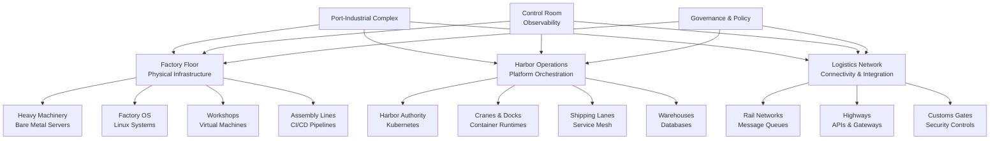
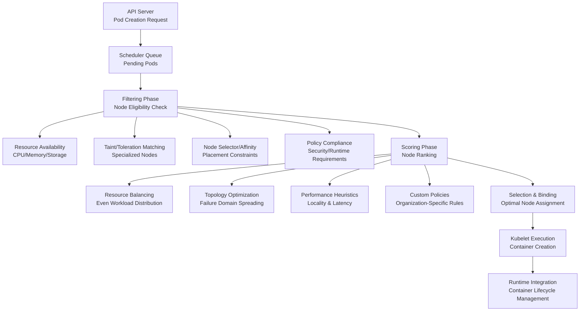
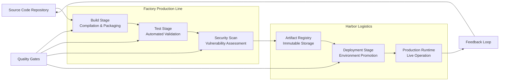
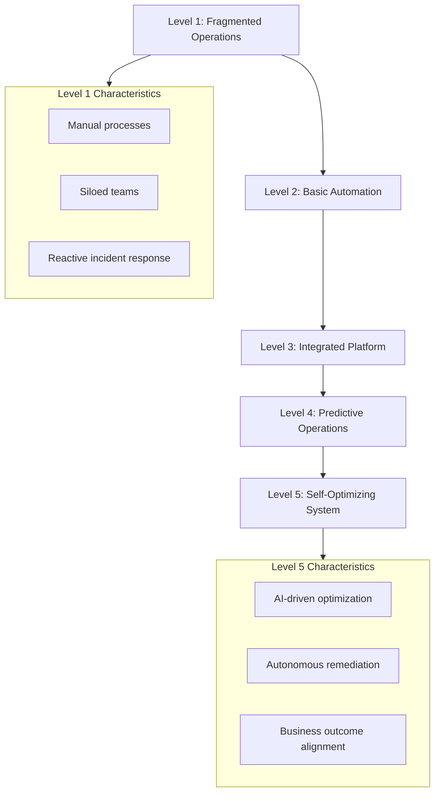
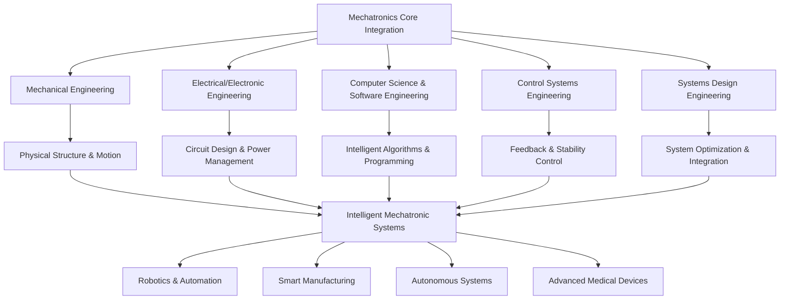
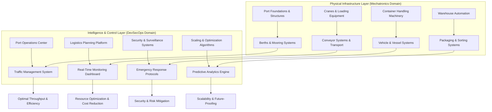
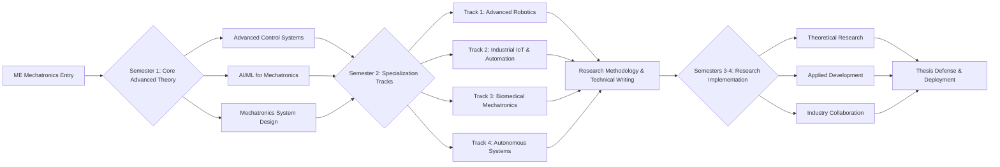

    

<h1 align="center">MR. SAM ROHAN</h1>
<h3 align="center">PRECISION IN EXECUTION - SUPREMACY IN IMPACT!</h3>

 

    

  
 

<h1 align="center">The Port–Industrial Complex mapping.</h1>

 

| Port / Factory (Original)  | **Port Analogy**                   | Tech Concept                                   | Plain explanation                                                                                                                                         |
| -------------------------- | ---------------------------------- | ---------------------------------------------- | --------------------------------------------------------------------------------------------------------------------------------------------------------- |
| Factory land & buildings   | Dockyard land, warehouses          | **Server machines** (physical or cloud VMs)    | The physical or virtual computers that host and run all software workloads, comparable to the land and buildings of a port.                               |
| Factory blueprints & rules | Port infrastructure, roads, cranes | **Linux (OS)**                                 | The foundational operating system that manages hardware, processes, memory, and networking—like the rules and infrastructure that govern port operations. |
| Private workshops          | Segregated factory units           | **Virtual Machines (VMs)**                     | Fully isolated computing environments that allow different systems or workloads to run independently on the same physical hardware.                       |
| Assembly line              | Automated loading belts            | **CI/CD pipelines** (build → test → deploy)    | Automated workflows that build, test, and deploy software repeatedly and reliably, similar to conveyor belts in a factory.                                |
| Packing boxes & tape       | Shipping containers                | **Docker / containers**                        | Standardized, portable units that bundle applications with all their dependencies so they can run consistently anywhere.                                  |
| Container blueprints       | Container blueprints               | **Container images**                           | Read-only templates used to create containers, ensuring every container starts from the same known state.                                                 |
| Container storage yard     | Container storage depot            | **Container registry** (Docker Hub, Harbor)    | Central repositories that store, version, and distribute container images across teams and environments.                                                  |
| Entire port authority      | Port authority                     | **Kubernetes cluster**                         | The orchestration platform that governs where containers run, how they scale, and how failures are handled across the system.                             |
| Port control tower         | Harbor master’s control tower      | **Kubernetes control plane**                   | The decision-making brain of Kubernetes that schedules workloads, monitors state, and enforces desired behavior.                                          |
| Docks & berths             | Docks / berths                     | **Worker nodes / servers**                     | The machines where containers actually execute, similar to docks where ships are berthed and unloaded.                                                    |
| Cranes                     | Crane operators                    | **Container runtime** (containerd, CRI-O)      | Low-level software responsible for starting, stopping, and managing containers on each node.                                                              |
| Ships (carrying cargo)     | Ships carrying containers          | **Pods**                                       | The smallest deployable unit in Kubernetes, grouping one or more tightly coupled containers that run together.                                            |
| Shipping lanes & roads     | Shipping lanes & port roads        | **Network / APIs**                             | Communication paths that allow services, systems, and users to exchange data reliably.                                                                    |
| Main highway rules         | Shipping documents & signals       | **REST API / gRPC**                            | Standardized communication protocols that define how services request, send, and receive data.                                                            |
| Rail network for bulk      | Conveyor belts / rail lines        | **Message streaming (Kafka, RabbitMQ)**        | Systems that move large volumes of data asynchronously and reliably between producers and consumers.                                                      |
| Warehouse                  | Cargo manifests & ledgers          | **Databases** (MySQL, PostgreSQL)              | Structured data stores used for transactions, records, and application state.                                                                             |
| Cold storage / archive     | Storage yards & silos              | **Object storage** (S3, MinIO)                 | Scalable storage for files, media, backups, and long-term archival data.                                                                                  |
| Inspection gate            | Cargo inspection scanners          | **Security scanners (SAST/DAST, Trivy)**       | Tools that analyze code and container images to detect vulnerabilities before deployment.                                                                 |
| Customs office             | Customs & security clearance       | **IAM / RBAC**                                 | Identity and access controls that define who can access which systems and perform which actions.                                                          |
| Security guards & cameras  | Security guards & surveillance     | **Host agents (Wazuh), runtime protections**   | Continuous monitoring systems that detect suspicious or malicious activity at runtime.                                                                    |
| Control room               | Control room dashboards            | **Monitoring (Prometheus, Grafana)**           | Systems that collect and visualize metrics to show the health and performance of the platform in real time.                                               |
| Alarm sirens               | Emergency sirens                   | **Alerting (Alertmanager, PagerDuty)**         | Notification systems that warn operators when predefined thresholds or failures occur.                                                                    |
| Maintenance logbooks       | Port activity logs                 | **Logs & metrics**                             | Recorded events and measurements used for troubleshooting, auditing, and performance analysis.                                                            |
| Emergency response team    | Emergency response crews           | **SRE / Ops**                                  | Engineers responsible for reliability, incident response, and continuous operational improvement.                                                         |
| Traffic routing system     | Traffic routing system             | **Service mesh (Istio, Linkerd)**              | Infrastructure that manages service-to-service communication, security, and traffic control.                                                              |
| Auto dock expansion        | Dynamic dock assignment            | **Autoscaling (HPA/VPA)**                      | Automatically adjusts compute capacity based on workload demand.                                                                                          |
| Port rulebook automation   | Automated port rulebook            | **Policy-as-Code (OPA, Gatekeeper)**           | Machine-enforced policies that ensure compliance, security, and governance across the platform.                                                           |
| Automated dock managers    | Automated dock managers            | **Kubernetes Operators / CRDs**                | Custom automation that manages complex applications using Kubernetes-native logic.                                                                        |
| Construction blueprints    | Port construction blueprints       | **Infrastructure as Code (Terraform, Pulumi)** | Declarative code used to provision and manage infrastructure consistently and repeatably.                                                                 |
| Emergency relocation ports | Emergency relocation ports         | **Disaster recovery / multi-region failover**  | Backup environments that take over operations if the primary system fails.                                                                                |
| Real-time cargo sorting    | Real-time cargo sorting lines      | **Stream processing (Flink, Kafka Streams)**   | Systems that analyze and transform data continuously as it flows through the platform.                                                                    |
| Smart port automation      | Smart port automation              | **AIOps / ML for operations**                  | AI-driven tools that detect anomalies, predict failures, and automate operational decisions.                                                              |

 

~~~
┌────────────────────────────────────────────────────────────┐
│  🧠 OPERATIONS & INTELLIGENCE LAYER                         │
│  AIOps, Monitoring, Alerting, Logs, SRE                     │
│  (Smart Port Automation, Control Rooms, Sirens)             │
└────────────────────────────────────────────────────────────┘
┌────────────────────────────────────────────────────────────┐
│  🔐 GOVERNANCE & SECURITY LAYER                              │
│  IAM / RBAC, Policy-as-Code, SAST/DAST, Wazuh, Runtime Sec   │
│  (Customs, Rulebooks, Guards, Inspection Gates)             │
└────────────────────────────────────────────────────────────┘
┌────────────────────────────────────────────────────────────┐
│  🚦 TRAFFIC & COMMUNICATION LAYER                            │
│  Service Mesh, REST/gRPC, Messaging (Kafka/RabbitMQ)        │
│  (Shipping Lanes, Traffic Signals, Rail Networks)           │
└────────────────────────────────────────────────────────────┘
┌────────────────────────────────────────────────────────────┐
│  ⚓ ORCHESTRATION & CONTROL LAYER                            │
│  Kubernetes Cluster, Control Plane, Autoscaling, Operators  │
│  (Port Authority, Control Tower, Dock Managers)             │
└────────────────────────────────────────────────────────────┘
┌────────────────────────────────────────────────────────────┐
│  📦 APPLICATION PACKAGING LAYER                              │
│  Containers, Images, Pods, CI/CD                             │
│  (Shipping Containers, Blueprints, Assembly Lines)          │
└────────────────────────────────────────────────────────────┘
┌────────────────────────────────────────────────────────────┐
│  🗄️ DATA & STORAGE LAYER                                    │
│  Databases, Object Storage, Stream Processing                │
│  (Warehouses, Silos, Cargo Sorting Lines)                   │
└────────────────────────────────────────────────────────────┘
┌────────────────────────────────────────────────────────────┐
│  🖥️ COMPUTE & ISOLATION LAYER                                │
│  Servers, VMs, Worker Nodes, Container Runtime               │
│  (Land, Buildings, Workshops, Cranes, Docks)                │
└────────────────────────────────────────────────────────────┘
┌────────────────────────────────────────────────────────────┐
│  🧱 FOUNDATION LAYER                                         │
│  Linux OS, Networking Basics, Infrastructure                 │
│  (Ground, Roads, Power, Core Port Infrastructure)           │
└────────────────────────────────────────────────────────────┘
~~~

 

<h1 align="center">The Port–Industrial Complex: A Unified Framework for Modern IT Operations.</h1>

 
 
## Executive Summary

This document presents the **Port–Industrial Complex** as a comprehensive analogy for modern IT operations and development practices within a cutting-edge technology organization. By mapping enterprise technology infrastructure, development workflows, and operational practices onto a unified maritime logistics framework, we establish intuitive mental models that bridge technical complexity with operational clarity. The analogy distinguishes between **Mechatronics**—the discipline of making physical systems move—and **DevSecOps**—the practice of making digital systems think, connect, scale, and remain secure. This framework serves dual purposes: providing stakeholders with accessible conceptual models while maintaining engineering precision for implementation teams.

The Port–Industrial Complex metaphor extends beyond simple component mapping to encompass entire operational workflows, governance structures, and lifecycle management practices. It addresses the complete software development lifecycle from initial requirements through production deployment and eventual decommissioning, all within a cohesive industrial logistics paradigm. This document provides both strategic conceptual models and tactical implementation guidance, with particular emphasis on container orchestration, security integration, and operational excellence.

 

## Table of Contents

1. **Introduction: The Port–Industrial Complex Framework**
2. **Core Analogy Layers and Terminology**
3. **The Factory Floor: Physical Infrastructure Layer**
4. **The Harbor: Platform and Orchestration Layer**
5. **Logistics and Transportation: Network and Integration Layer**
6. **Production Lines: CI/CD and Software Factory**
7. **Security and Governance: Customs and Inspection Framework**
8. **Operations and Reliability: Harbor Management**
9. **Mechatronics vs. DevSecOps: Comparative Analysis**
10. **Implementation Roadmap and Best Practices**
11. **Appendix: Reference Materials and Tools**

 

## 1. Introduction: The Port–Industrial Complex Framework

### 1.1 Conceptual Foundation

The Port–Industrial Complex represents a tightly governed, large-scale industrial ecosystem where design, production, deployment, security, logistics, and maintenance operate as an integrated system. This analogy provides a powerful framework for understanding modern IT operations by mapping complex technological relationships onto familiar industrial processes. Just as a major seaport coordinates thousands of interdependent activities—from cargo handling and customs inspection to vessel scheduling and facility maintenance—modern IT organizations must orchestrate diverse technologies, teams, and workflows into cohesive, reliable systems.

### 1.2 Core Value Proposition

- **Unified Mental Models**: Provides consistent terminology and conceptual frameworks across technical and non-technical stakeholders
- **Operational Clarity**: Maps abstract technical processes to concrete industrial workflows with clear ownership boundaries
- **Scalability Framework**: Supports deterministic workflows and failure handling patterns essential for enterprise-scale operations
- **Security Integration**: Embeds security practices throughout the operational lifecycle through customs and inspection metaphors
- **Cross-Discipline Alignment**: Bridges physical infrastructure (Mechatronics) and digital systems (DevSecOps) within a single operational paradigm

### 1.3 Strategic Alignment

This framework aligns with contemporary technology trends including cloud-native architectures, containerization, infrastructure as code, and GitOps practices. It provides the conceptual scaffolding needed to implement these technologies consistently across large organizations while maintaining operational rigor and security compliance.

 

## 2. Core Analogy Layers and Terminology

### 2.1 Layer Definitions

| Analogy Layer | Technical Equivalent | Purpose | Key Components |
|--------------|---------------------|---------|----------------|
| **Industrial Complex** | Enterprise IT Ecosystem | End-to-end technology environment | All systems, processes, and teams |
| **Factory Floor** | Physical Infrastructure | Hardware execution environment | Servers, network devices, edge computing |
| **Harbor/Port** | Platform Orchestration | Workload distribution and scheduling | Kubernetes, service mesh, registries |
| **Shipping Lanes** | Network Infrastructure | Data transportation and routing | Load balancers, firewalls, CDNs |
| **Customs & Inspection** | Security Framework | Policy enforcement and compliance | IAM, vulnerability scanning, policy engines |
| **Control Room** | Observability Stack | System monitoring and management | Metrics, logs, tracing, dashboards |

### 2.2 Standardized Terminology Table

| Maritime Term | IT Equivalent | Technical Specification | Operational Context |
|--------------|---------------|-------------------------|---------------------|
| **Factory Floor** | Physical Infrastructure | Bare metal servers, edge devices, data centers | Physical execution environment |
| **Factory OS** | Linux Operating System | Kernel, system services, cgroups, namespaces | Foundational operating system |
| **Private Workshop** | Virtual Machine | KVM/QEMU VMs, hypervisor management | Isolated execution environment |
| **Standardized Cargo** | Application Container | OCI containers, container runtimes | Portable, immutable workload unit |
| **Harbor Authority** | Kubernetes | Control plane, scheduler, controllers | Orchestration and scheduling |
| **Assembly Line** | CI/CD Pipeline | GitHub Actions, GitLab CI, Jenkins | Automated build and deployment |
| **Warehouse** | Database System | PostgreSQL, MongoDB, Redis, data lakes | Structured data storage |
| **Rail Network** | Message Queue | Kafka, RabbitMQ, Pulsar | Asynchronous data transport |
| **Control Room** | Observability | Prometheus, ELK, OpenTelemetry | System visibility and monitoring |
| **Customs Gate** | Security Policy | IAM, RBAC, admission controllers | Access control and compliance |
| **SOP Manual** | Runbook | Incident response guides, remediation playbooks | Operational procedure documentation |

### 2.3 Organizational Role Mapping

| Industrial Role | Technical Equivalent | Core Responsibilities | Key Interfaces |
|-----------------|---------------------|-----------------------|----------------|
| **Harbor Master** | Platform Engineering Lead | Cluster governance, resource allocation, policy enforcement | Application teams, infrastructure, security |
| **Factory Manager** | Infrastructure Manager | Hardware lifecycle, capacity planning, physical security | Platform team, facilities, vendors |
| **Customs Inspector** | Security Engineer | Policy enforcement, vulnerability management, compliance auditing | All engineering teams, legal/compliance |
| **Logistics Coordinator** | SRE/DevOps Engineer | Deployment orchestration, incident response, performance optimization | Development teams, operations, support |
| **Quality Inspector** | QA/Test Engineer | Validation testing, performance benchmarking, release gating | Development, product management |
| **Maintenance Technician** | Systems Administrator | Hardware maintenance, software updates, break-fix operations | Platform team, vendors, facilities |

 

## 3. The Factory Floor: Physical Infrastructure Layer

### 3.1 Foundation Components

The Factory Floor represents the physical and virtualization infrastructure that forms the computational foundation of the Port–Industrial Complex. This layer encompasses all hardware resources and their immediate management systems, providing the raw computational power and storage capacity required to execute workloads.

- **Heavy Machinery (Bare Metal Servers)**: High-capacity physical servers provide the foundational compute resources for the entire complex. These systems include enterprise-grade processors, large memory configurations, and specialized hardware accelerators (GPUs, FPGAs) for performance-intensive workloads. Their operation requires meticulous environmental controls including precision cooling, uninterruptible power supplies, and physical security measures comparable to industrial machinery safety protocols. Lifecycle management follows strict maintenance schedules with documented procedures for hardware refreshes, component replacements, and decommissioning to ensure consistent operational capacity.
  
- **Factory Operating System (Linux)**: The Linux operating system serves as the universal control layer for all physical infrastructure, analogous to the standardized control systems in modern industrial facilities. Its kernel provides process isolation, resource scheduling, and hardware abstraction through mechanisms like cgroups and namespaces. Enterprise distributions include long-term support commitments, security patching regimes, and compliance certifications essential for production environments. Configuration management follows infrastructure-as-code principles with all system states defined in version-controlled specifications.

- **Private Workshops (Virtual Machines)**: Virtualization technology creates isolated execution environments that operate like specialized workshops within the larger factory. Hypervisor platforms manage resource allocation and isolation between virtual machines, enabling multi-tenancy and workload consolidation. Each VM operates with its own complete operating system stack, providing strong isolation boundaries suitable for legacy applications, security-sensitive workloads, or mixed-OS environments. Migration capabilities allow live transfer between physical hosts for maintenance and load balancing.

### 3.2 Infrastructure Management Framework

| Management Domain | Industrial Analogy | Technical Implementation | Key Metrics |
|------------------|-------------------|--------------------------|-------------|
| **Capacity Planning** | Factory Expansion | Resource forecasting, procurement cycles | Utilization rates, growth projections |
| **Lifecycle Management** | Equipment Maintenance | Hardware refresh schedules, EOL tracking | MTBF, failure rates, refresh cadence |
| **Environmental Control** | Climate Management | Cooling systems, power distribution, physical security | PUE, temperature ranges, humidity levels |
| **Resource Allocation** | Production Scheduling | Resource pools, quota management, reservation systems | Allocation efficiency, contention rates |
| **Workplace Safety** | Industrial Safety | Access controls, monitoring, incident response | Security incidents, compliance audit results |

### 3.3 Operational Characteristics

- **Deterministic Performance**: Factory floor components must deliver predictable, measurable performance characteristics essential for capacity planning and workload scheduling. Performance baselines establish expected behavior under normal operating conditions, with monitoring systems detecting deviations that may indicate impending failures or performance degradation.
  
- **Resilience Engineering**: Physical infrastructure implements redundancy patterns at multiple levels—power supplies, network paths, storage controllers—to ensure continued operation during component failures. Failure domain analysis identifies single points of failure with mitigation strategies documented in disaster recovery plans tested through regular operational drills.
  
- **Automation Integration**: All factory floor components expose automation interfaces supporting infrastructure-as-code workflows. Physical servers provide out-of-band management controllers (iDRAC, iLO), virtualization platforms offer comprehensive APIs, and operating systems support configuration management tooling for consistent, repeatable provisioning.

 

## 4. The Harbor: Platform and Orchestration Layer

### 4.1 Harbor Architecture

The Harbor represents the orchestration platform that manages workload distribution, scheduling, and lifecycle operations across the factory floor infrastructure. As the central coordination point for containerized applications, it provides the abstraction layer that transforms physical infrastructure into programmable, elastic compute capacity.

- **Central Logistics Authority (Kubernetes)**: Kubernetes serves as the harbor master, coordinating all container operations across the cluster infrastructure. Its control plane components—API server, scheduler, controller manager, and etcd—implement declarative state management where operators specify desired system states rather than imperative commands. The scheduler employs sophisticated algorithms to place workloads based on resource requirements, affinity rules, and topology constraints, optimizing for resource utilization while respecting operational policies. Controllers continuously reconcile actual state with declared specifications, implementing self-healing behaviors that automatically restart failed containers or reschedule evicted workloads.

- **Cranes and Docks (Container Runtimes)**: Container runtimes operate as the mechanical systems that load, execute, and manage containerized workloads on individual nodes. Implementations like containerd and CRI-O provide the standardized interface between Kubernetes and the underlying operating system, handling image management, container lifecycle, and resource isolation. These systems implement the Open Container Initiative specifications ensuring portability across different runtime environments while providing security isolation through namespace separation and control group resource limits.

- **Berthing Operations (Pod Scheduling)**: Workload placement follows sophisticated scheduling policies analogous to harbor berth assignments. The scheduler evaluates pod requirements against node capabilities, considering factors like resource availability, topology constraints, and policy restrictions. Advanced scheduling features include pod affinity/anti-affinity rules that control collocation patterns, taints and tolerations that implement node specialization, and topology spread constraints that ensure workload distribution across failure domains. These mechanisms enable optimal resource utilization while maintaining application performance and availability requirements.

### 4.2 Kubernetes Scheduling Deep Dive

#### 4.2.1 Scheduling Policy Framework

- **Resource-Aware Placement**: The scheduler evaluates pod resource requests (CPU, memory, ephemeral storage) against node allocatable capacity, reserving resources to prevent overcommitment that could lead to performance degradation or instability. Quality of Service classes (Guaranteed, Burstable, BestEffort) influence scheduling priority and eviction order during resource contention scenarios.
  
- **Topology Constraints**: Pod topology spread constraints enforce distribution across failure domains (zones, regions, racks) to minimize correlated failure impact. These constraints work with node affinity rules to balance distribution requirements with performance considerations like data locality or network proximity.
  
- **Custom Scheduling Extensions**: Organizations can extend scheduling logic through scheduler plugins or custom schedulers for specialized requirements like GPU affinity, regulatory compliance, or cost optimization. These extensions integrate with the core scheduling framework while allowing domain-specific optimization criteria.

#### 4.2.2 Performance Optimization Strategies

- **Bin Packing vs. Spreading**: The scheduler implements configurable strategies balancing resource utilization (bin packing) against failure domain distribution (spreading). Weighted scoring profiles allow organizations to tune these priorities based on workload characteristics and operational requirements.
  
- **Preemption and Priority**: Priority classes enable critical system pods to preempt lower-priority workloads during resource contention. Preemption policies control eviction behavior to minimize disruption while ensuring essential services maintain operational capacity.
  
- **Dynamic Resource Management**: The vertical pod autoscaler adjusts pod resource requests based on historical usage patterns, while the horizontal pod autoscaler scales replica counts in response to demand fluctuations. These autoscaling mechanisms work with the scheduler to maintain performance during variable load conditions.

### 4.3 Harbor Services and Facilities

- **Service Registry and Discovery**: Kubernetes services provide stable network endpoints for dynamic pod populations, implementing load balancing and service discovery mechanisms. Service meshes extend this functionality with advanced traffic management, security policies, and observability features while abstracting network complexity from applications.
  
- **Ingress and Egress Control**: Ingress controllers manage external access to services, implementing routing rules, TLS termination, and rate limiting. Egress policies control outbound traffic with network policies defining allowed communication patterns between pods and external endpoints.
  
- **Storage Orchestration**: The Container Storage Interface (CSI) provides standardized storage integration, enabling dynamic provisioning of persistent volumes from various storage backends. Storage classes define performance characteristics and retention policies, while volume snapshot capabilities support data protection workflows.

 

## 5. Logistics and Transportation: Network and Integration Layer

### 5.1 Network Infrastructure

The logistics network provides the transportation pathways connecting all components within the Port–Industrial Complex, enabling communication between services, data movement between storage systems, and external connectivity to users and partner systems.

- **Shipping Lanes (Network Fabric)**: The underlying network fabric implements high-bandwidth, low-latency connectivity between all infrastructure components using redundant physical paths and logical overlays. Data center networking employs spine-leaf architectures with equal-cost multipath routing to eliminate bottlenecks and provide predictable performance. Network segmentation creates distinct zones for different traffic classes with security boundaries enforced at each segmentation point.
  
- **Traffic Control (Service Mesh)**: Service mesh implementations like Istio or Linkerd provide sophisticated traffic management capabilities analogous to harbor traffic control systems. They implement fine-grained routing rules, load balancing algorithms, circuit breakers for failure isolation, and retry policies for transient error handling. The mesh architecture separates operational concerns from business logic, enabling consistent implementation of cross-cutting requirements across all services.
  
- **Border Control (API Gateways)**: API gateways manage external access to internal services, implementing authentication, authorization, rate limiting, and protocol translation. They provide a unified facade for diverse backend services while enforcing security policies and usage quotas. Gateway configurations follow declarative patterns with version-controlled specifications enabling consistent deployment across environments.

### 5.2 Data Movement Patterns

| Transportation Mode | Technical Equivalent | Characteristics | Use Cases |
|-------------------|---------------------|-----------------|-----------|
| **Bulk Cargo Ships** | Batch Processing | High volume, scheduled, latency-tolerant | ETL pipelines, analytics processing, backups |
| **Container Freight** | Message Queues | Structured, reliable, async delivery | Event processing, service decoupling, workflow orchestration |
| **Express Couriers** | RPC Calls | Low latency, synchronous, request-response | User interactions, transactional processing |
| **Pipeline Networks** | Stream Processing | Continuous flow, real-time transformation | Monitoring data, sensor feeds, financial tickers |
| **Air Freight** | CDN Distribution | Global distribution, edge caching | Static assets, media streaming, web content |

### 5.3 Integration Framework

- **Protocol Standardization**: The logistics layer implements standardized protocols for different integration patterns—HTTP/REST for synchronous requests, gRPC for performance-critical RPC, AMQP for message queuing, and WebSocket for bidirectional streaming. Protocol selection follows established patterns based on latency requirements, message sizes, and compatibility constraints.
  
- **Schema Management**: Data schemas provide the structural definitions for information exchange, analogous to shipping container specifications and manifests. Schema registries manage evolution of data structures with version compatibility rules and validation tooling. Change management processes govern schema modifications with deprecation timelines and migration support.
  
- **Operational Visibility**: Integration points implement comprehensive observability with distributed tracing, metrics collection, and structured logging. Correlation identifiers propagate through entire call chains, enabling end-to-end transaction tracking across service boundaries. Monitoring dashboards visualize traffic patterns, error rates, and performance characteristics across all integration points.

 

## 6. Production Lines: CI/CD and Software Factory

### 6.1 Assembly Line Architecture

The CI/CD pipeline represents the automated assembly line that transforms source code into deployable artifacts, validates their quality, and coordinates their progression through staging environments to production deployment.

### 6.2 Pipeline Stage Details

- **Code Reception and Preparation**: Source code management systems receive developer contributions through pull request workflows with automated validation of coding standards, dependency licenses, and security policies. Branch protection rules enforce review requirements and status checks before integration, while semantic versioning provides consistent artifact identification through the deployment pipeline.

- **Automated Build and Packaging**: Build systems execute in isolated, reproducible environments with declared dependencies and version-pinned toolchains. Multi-stage builds produce minimal container images containing only runtime necessities, while build caches accelerate repeated operations. Artifacts include comprehensive metadata—build timestamps, commit references, dependency bills of materials—enabling complete provenance tracking.

- **Quality Validation Gates**: Automated testing implements a pyramid strategy with unit tests validating individual components, integration tests verifying service interactions, and system tests confirming end-to-end behaviors. Performance tests establish baseline metrics and detect regressions, while chaos engineering experiments validate resilience under failure conditions. Test environments mirror production topology to ensure validation relevance.

- **Security Integration**: Security scanning occurs at multiple pipeline stages—SAST tools analyze source code for vulnerabilities, dependency scanners check third-party libraries, container image scanners inspect built artifacts, and dynamic analysis tests running applications. Critical severity findings block progression, while lower-risk issues generate tracking tickets with remediation deadlines. Compliance checks validate configuration against organizational policies and regulatory requirements.

- **Controlled Deployment**: Deployment strategies implement progressive exposure patterns—canary releases route small traffic percentages to new versions for validation, blue-green deployments maintain parallel environments for instant rollback, and feature flags enable runtime activation without deployment. Deployment orchestration tools manage these patterns while integrating with observability systems to detect issues and trigger automated rollbacks.

### 6.3 Software Factory Metrics

| Metric Category | Specific Measurements | Target Benchmarks | Monitoring Frequency |
|----------------|----------------------|-------------------|---------------------|
| **Throughput** | Deployment frequency, lead time for changes | Multiple daily deployments, <1 hour lead time | Real-time with daily aggregates |
| **Quality** | Change failure rate, mean time to restore | <5% failure rate, <1 hour restoration | Per deployment with weekly trends |
| **Efficiency** | Build time, test execution time | <10 minutes build, <30 minutes test suite | Per pipeline execution |
| **Security** | Vulnerability count, time to remediate | Zero critical vulnerabilities, <7 day remediation | Continuous with weekly reports |
| **Cost** | Compute resource utilization, pipeline cost per deployment | >70% utilization, decreasing cost trend | Weekly with monthly reviews |

 

## 7. Security and Governance: Customs and Inspection Framework

### 7.1 Defense-in-Depth Architecture

Security within the Port–Industrial Complex implements a layered defense model analogous to port security systems, with multiple inspection points and graduated access controls protecting assets throughout their lifecycle.

- **Perimeter Security (Port Entry Points)**: External access controls implement zero-trust principles with identity verification required for all access attempts regardless of network location. Web application firewalls inspect incoming traffic for attack patterns, DDoS protection systems absorb volumetric attacks, and API gateways enforce authentication and rate limiting. Network segmentation creates security zones with strict traffic filtering between trust levels.

- **Internal Controls (Customs Inspection)**: Once inside the perimeter, continuous validation occurs through multiple mechanisms. Mutual TLS authentication verifies service identities for east-west traffic, network policies enforce least-privilege communication patterns, and runtime security monitors detect anomalous container behaviors. Secrets management systems provide secure credential storage with automatic rotation and audit logging of access attempts.

- **Supply Chain Security (Cargo Inspection)**: Artifact provenance verification ensures only trusted components enter the environment. Image signing with cryptographic attestations validates artifact integrity and origin, software bill of materials provides complete dependency transparency, and vulnerability scanning at multiple pipeline stages prevents compromised components from reaching production. Registry policies enforce signature requirements and vulnerability thresholds before artifact promotion.

### 7.2 Security Control Matrix

| Security Layer | Industrial Analogy | Technical Controls | Validation Mechanisms |
|---------------|-------------------|-------------------|----------------------|
| **Physical Security** | Facility Access Control | Data center access logs, camera surveillance, biometric authentication | Regular access review, penetration testing |
| **Network Security** | Port Perimeter Fencing | Firewalls, IDS/IPS, network segmentation, VPN gateways | Network vulnerability scanning, traffic analysis |
| **Identity Management** | Port Badge System | IAM, RBAC, MFA, SSO, just-in-time access | Access review cycles, privilege usage auditing |
| **Application Security** | Cargo Inspection | SAST, DAST, IAST, RASP, dependency scanning | Continuous scanning, penetration testing |
| **Data Security** | Secure Storage Facilities | Encryption at rest/in transit, data classification, DLP | Encryption validation, data access monitoring |
| **Runtime Security** | On-site Security Patrols | Container isolation, system call filtering, anomaly detection | Runtime behavior analysis, audit logging |

### 7.3 Compliance and Governance

- **Policy as Code**: Security policies are defined in declarative code formats enabling version control, automated testing, and consistent enforcement. Policy engines evaluate configurations against organizational standards, regulatory requirements, and security best practices. Policy violations generate actionable alerts with remediation guidance while exceptions follow formal approval workflows with expiration dates and justification documentation.

- **Audit and Accountability**: Comprehensive audit logging captures security-relevant events across all system layers with immutable storage and protected access. Audit trails support forensic investigation, compliance reporting, and operational analysis. Regular audit reviews validate control effectiveness while automated analysis detects suspicious patterns requiring investigation.

- **Continuous Compliance**: Compliance validation occurs continuously through automated checks rather than periodic manual assessments. Compliance frameworks map to technical controls with evidence collection automated through API integrations. Compliance dashboards provide real-time status visibility with drill-down capabilities to specific control implementations and evidence documentation.

 

## 8. Operations and Reliability: Harbor Management

### 8.1 Operational Excellence Framework

Harbor operations implement systematic approaches to reliability engineering, incident management, and continuous improvement modeled after port authority best practices for managing complex, critical infrastructure.

- **Control Room Operations (Observability)**: Comprehensive monitoring implements the three pillars of observability—metrics for quantitative measurement, logs for discrete events, and traces for request flow analysis. Monitoring coverage extends from infrastructure health through application performance to business outcomes, with carefully designed alerts that balance signal detection against alert fatigue. Dashboards provide situational awareness while deep-dive tools support investigation and analysis.

- **Standard Operating Procedures (Runbooks)**: Documented procedures provide consistent responses to common operational scenarios, from routine maintenance tasks to incident response workflows. Runbooks follow structured formats with clear prerequisites, step-by-step instructions, expected outcomes, and escalation paths. Automated runbook execution through orchestration tools accelerates response times while ensuring procedure consistency and compliance documentation.

- **Maintenance Scheduling (Change Management)**: Planned maintenance activities follow structured change management processes with risk assessment, approval workflows, and rollback planning. Maintenance windows coordinate across dependent systems with communication to affected stakeholders. Automated validation confirms successful completion while monitoring verifies system health post-change.

### 8.2 Incident Management Framework

| Incident Phase | Industrial Analogy | Technical Activities | Success Criteria |
|---------------|-------------------|---------------------|-----------------|
| **Detection** | Port Surveillance Systems | Monitoring alerts, anomaly detection, user reports | Time to detection <5 minutes for critical issues |
| **Triage** | Emergency Response Dispatch | Impact assessment, priority classification, team mobilization | Accurate severity assessment within 15 minutes |
| **Containment** | Emergency Containment | Issue isolation, traffic rerouting, feature disablement | Incident scope limited within 30 minutes |
| **Investigation** | Root Cause Analysis | Log analysis, metric correlation, diagnostic testing | Probable cause identified within 2 hours |
| **Resolution** | Repair and Restoration | Fix implementation, validation testing, traffic restoration | Service restored within 4 hours for P1 incidents |
| **Post-Mortem** | Incident Review | Timeline reconstruction, improvement identification, action tracking | Action items documented and assigned within 48 hours |

### 8.3 Reliability Engineering Practices

- **Resilience Patterns**: Systems implement resilience patterns including retries with exponential backoff, circuit breakers for failure isolation, bulkheads for resource protection, and graceful degradation during partial failures. Resilience testing through chaos engineering experiments validates these patterns under controlled conditions while identifying improvement opportunities.

- **Capacity Management**: Proactive capacity planning forecasts resource requirements based on usage trends, business projections, and seasonal patterns. Autoscaling configurations respond to immediate demand fluctuations while capacity reservations ensure resource availability for critical workloads. Regular capacity reviews validate assumptions and adjust allocations based on actual utilization patterns.

- **Disaster Recovery**: Disaster recovery plans define recovery time and point objectives for different service tiers with corresponding implementation strategies. Regular disaster recovery testing validates recovery procedures, identifies gaps, and trains response teams. Recovery automation accelerates restoration while reducing human error during high-stress situations.

 

## 9. Mechatronics vs. DevSecOps: Comparative Analysis

### 9.1 Discipline Definition and Scope

- **Mechatronics Engineering**: This discipline focuses on the integration of mechanical systems, electronic controls, and computational intelligence to create smart physical systems. In the Port–Industrial Complex analogy, Mechatronics corresponds to the design, construction, and maintenance of the physical factory infrastructure—the heavy machinery, conveyor systems, robotic assemblers, and their control systems. Mechatronics engineers ensure that physical systems move with precision, reliability, and efficiency, integrating sensors for feedback control and actuators for physical manipulation.

- **DevSecOps Engineering**: This discipline combines software development (Dev), security (Sec), and operations (Ops) to deliver secure, reliable software systems at high velocity. Within our analogy, DevSecOps corresponds to the digital nervous system of the Port–Industrial Complex—the software that makes systems think, connect, scale, and stay secure. DevSecOps engineers create the CI/CD pipelines, container orchestration, security controls, and observability systems that enable rapid, safe deployment and operation of applications across the infrastructure provided by Mechatronics.

### 9.2 Comparative Framework

| Dimension | Mechatronics (Makes Machines Move) | DevSecOps (Makes Systems Think) | Integration Points |
|-----------|-----------------------------------|---------------------------------|-------------------|
| **Primary Focus** | Physical systems and hardware | Software systems and platforms | Firmware/software interfaces |
| **Core Technologies** | PLCs, robotics, sensors, actuators | Kubernetes, CI/CD, security tools | Edge computing, IoT integration |
| **Development Cycles** | Longer (hardware iteration cycles) | Shorter (software iteration cycles) | Coordinated release planning |
| **Failure Modes** | Mechanical wear, component failure | Software bugs, configuration errors | Systemic failure analysis |
| **Skill Sets** | Mechanical engineering, electronics | Software engineering, security | Cross-disciplinary understanding |
| **Testing Approach** | Physical prototypes, stress testing | Automated testing, chaos engineering | Integrated system validation |
| **Security Concerns** | Physical access, tamper resistance | Code vulnerabilities, data breaches | End-to-end security chain |
| **Observability** | Sensor telemetry, physical inspection | Logs, metrics, distributed tracing | Unified monitoring dashboard |
| **Lifecycle Management** | Preventive maintenance, spare parts | Continuous deployment, versioning | Coordinated lifecycle planning |

### 9.3 Collaborative Workflow

- **Integrated Design Process**: New system development follows collaborative design processes where Mechatronics and DevSecOps engineers jointly architect solutions. Mechatronics defines physical constraints and capabilities while DevSecOps designs the software control systems and data flows. Regular design reviews ensure both perspectives address requirements while identifying integration challenges early in the development cycle.

- **Unified Telemetry Strategy**: Both disciplines contribute to a comprehensive observability strategy where physical sensor data (temperature, vibration, throughput) integrates with software metrics (response times, error rates, resource utilization). Correlation identifiers trace operations across physical and digital boundaries, enabling complete system understanding during normal operations and accelerated troubleshooting during incidents.

- **Coordinated Release Management**: Hardware and software releases follow synchronized schedules with compatibility matrices defining supported combinations. Firmware updates coordinate with software deployments, with rollback procedures addressing scenarios where either component requires reversion. Testing environments include representative hardware configurations to validate software behavior under realistic conditions.

- **Joint Incident Response**: Incident response procedures define clear handoffs between disciplines based on symptom analysis. Monitoring dashboards combine physical and digital indicators to accelerate root cause identification. Post-incident reviews include both disciplinary perspectives to identify systemic improvements addressing both hardware and software factors.

 

## 10. Implementation Roadmap and Best Practices

### 10.1 Maturity Model Progression

### 10.2 Implementation Phases

#### Phase 1: Foundation Establishment (Months 1-3)
- **Infrastructure Standardization**: Establish consistent hardware configurations, operating system baselines, and network topologies across all environments. Implement infrastructure-as-code tooling for reproducible provisioning with version-controlled configuration.
- **Basic Observability**: Deploy centralized logging, metrics collection, and alerting with coverage for critical system components. Establish incident response procedures with defined roles and communication channels.
- **Security Baseline**: Implement essential security controls including network segmentation, vulnerability scanning, and access management. Establish security policies and compliance monitoring for regulated environments.

#### Phase 2: Platform Development (Months 4-9)
- **Container Orchestration**: Deploy Kubernetes clusters with standardized configurations, networking, and storage integration. Implement namespace strategies, resource quotas, and basic autoscaling policies.
- **CI/CD Pipeline**: Establish automated build, test, and deployment pipelines with quality gates and security scanning. Implement deployment strategies supporting canary releases and rollback capabilities.
- **Service Catalog**: Develop standardized application patterns with corresponding deployment templates, monitoring configurations, and operational runbooks. Establish internal platform documentation and training materials.

#### Phase 3: Advanced Integration (Months 10-18)
- **Service Mesh Implementation**: Deploy service mesh for advanced traffic management, security policies, and observability features. Implement mutual TLS, fine-grained access controls, and distributed tracing across services.
- **Policy as Code**: Establish comprehensive policy frameworks with automated enforcement across infrastructure, security, and compliance domains. Implement policy testing and validation within CI/CD pipelines.
- **Chaos Engineering**: Introduce controlled failure experiments to validate resilience assumptions and identify improvement opportunities. Establish game day exercises to train teams on incident response procedures.

#### Phase 4: Optimization and Innovation (Months 19+)
- **AI Operations**: Implement machine learning for anomaly detection, predictive scaling, and intelligent alert correlation. Develop automated remediation workflows for common operational scenarios.
- **Cross-Discipline Integration**: Deepen integration between Mechatronics and DevSecOps through unified data platforms, collaborative tooling, and joint operational procedures.
- **Business Alignment**: Establish value stream mapping from business requirements through delivery, with metrics demonstrating operational excellence contributions to organizational goals.

### 10.3 Critical Success Factors

- **Executive Sponsorship and Alignment**: Secure committed leadership support with clear communication of business value and regular progress reporting. Establish governance structures with representation from all stakeholder groups including business units, security, compliance, and engineering.
  
- **Incremental Delivery Approach**: Implement capabilities in iterative increments with measurable outcomes and frequent validation. Prioritize foundational elements that enable subsequent capabilities while delivering immediate value through automation of manual processes.
  
- **Skills Development Program**: Invest in training and certification programs addressing both technical skills and collaborative practices. Establish mentorship relationships between experienced practitioners and team members developing new capabilities. Create communities of practice for knowledge sharing across organizational boundaries.
  
- **Metrics-Driven Improvement**: Establish key performance indicators aligned with organizational objectives, with regular review cycles assessing progress and identifying adjustment needs. Implement feedback mechanisms capturing both quantitative metrics and qualitative experiences from platform users and operators.
  
- **Vendor and Technology Strategy**: Develop clear criteria for technology selection balancing capabilities, integration requirements, community support, and commercial considerations. Establish vendor management processes ensuring alignment with roadmap objectives while maintaining flexibility to adopt emerging innovations.

 

## 11. Appendix: Reference Materials and Tools

### 11.1 Technology Stack Recommendations

| Component Category | Recommended Solutions | Considerations | Integration Points |
|-------------------|----------------------|----------------|-------------------|
| **Container Runtime** | containerd, CRI-O | Performance, security features, Kubernetes compatibility | Kubernetes CRI, storage plugins |
| **Orchestration Platform** | Kubernetes (vanilla or distributions) | Management overhead, feature requirements, support model | CNI/CSI plugins, ingress controllers |
| **Service Mesh** | Istio, Linkerd, Cilium | Complexity, performance impact, feature requirements | Kubernetes, ingress, observability |
| **CI/CD Pipeline** | GitHub Actions, GitLab CI, Jenkins | Integration requirements, scalability, ecosystem | Source control, container registry, Kubernetes |
| **Security Scanning** | Trivy, Clair, Grype | Coverage, performance, integration capabilities | CI/CD pipelines, registry, runtime |
| **Observability** | Prometheus, Grafana, OpenTelemetry | Scalability, retention, query performance | All system components, business metrics |
| **Infrastructure as Code** | Terraform, Pulumi, Crossplane | Multi-cloud support, module ecosystem, state management | Cloud APIs, Kubernetes, configuration management |
| **Policy Management** | OPA/Gatekeeper, Kyverno | Policy language, performance, management interface | Kubernetes admission, CI/CD validation |

### 11.2 Operational Checklists

#### Daily Operations Checklist
- [ ] Review system dashboards for anomalies
- [ ] Verify backup completion and integrity
- [ ] Check security scan reports for new vulnerabilities
- [ ] Review pending updates and maintenance windows
- [ ] Validate capacity projections against current utilization
- [ ] Check incident queue for unresolved issues
- [ ] Review access logs for suspicious activities

#### Deployment Readiness Checklist
- [ ] All automated tests passing
- [ ] Security scans clear with no critical vulnerabilities
- [ ] Performance tests meeting baseline requirements
- [ ] Rollback procedure documented and tested
- [ ] Stakeholder communication plan executed
- [ ] Monitoring and alerting configured for new components
- [ ] Documentation updated with deployment details
- [ ] Support teams briefed on new functionality

#### Incident Response Checklist
- [ ] Impact assessment completed with severity classification
- [ ] Stakeholder notifications sent per communication plan
- [ ] Incident commander assigned with clear authority
- [ ] War room established with necessary participants
- [ ] System backups verified before remediation attempts
- [ ] Change control procedures followed for emergency changes
- [ ] Timeline documentation initiated with key events
- [ ] External communications coordinated with PR/legal

### 11.3 Glossary of Terms

| Term | Definition | Context |
|------|-----------|---------|
| **Port–Industrial Complex** | Integrated ecosystem combining manufacturing (factory) with distribution (harbor) operations | Overall framework analogy |
| **Factory Floor** | Physical infrastructure layer including servers, network, and storage hardware | Mechatronics domain |
| **Harbor Authority** | Orchestration platform managing workload distribution and scheduling | Kubernetes equivalent |
| **Standardized Cargo** | Containerized application units with consistent packaging and interfaces | Application containers |
| **Assembly Line** | Automated pipeline for building, testing, and deploying software | CI/CD system |
| **Customs Inspection** | Security validation processes ensuring compliance and safety | Security scanning and policy enforcement |
| **Control Room** | Centralized monitoring and management interface | Observability platform |
| **Shipping Lanes** | Network pathways for data transportation between services | Service mesh and networking |
| **SOP Manual** | Documented procedures for operational activities | Runbooks and playbooks |

### 11.4 Further Reading and Resources

- **Kubernetes Documentation**: Official Kubernetes documentation for core concepts and APIs
- **CNCF Landscape**: Cloud Native Computing Foundation landscape for ecosystem tools
- **NIST Cybersecurity Framework**: Security best practices and control mappings
- **Site Reliability Engineering Books**: Google's SRE books for operational excellence practices
- **DevSecOps Maturity Model**: Guidance for security integration in DevOps practices
- **ITIL Framework**: Service management best practices for operational processes
- **Industry Standards**: ISO 27001, SOC 2, PCI-DSS for compliance requirements

 

## Document Conclusion

The Port–Industrial Complex provides a comprehensive, scalable framework for understanding and implementing modern IT operations. By mapping complex technical systems to familiar industrial processes, it creates shared mental models across organizational boundaries while maintaining the precision required for engineering implementation. The distinction between Mechatronics (making machines move) and DevSecOps (making systems think, connect, scale, and stay secure) clarifies disciplinary responsibilities while emphasizing their essential integration within complete technology solutions.

This framework supports organizations at various maturity levels, from initial automation efforts through advanced AI-driven operations. Its strength lies in the balanced combination of conceptual accessibility and technical rigor—making it equally valuable for executive stakeholders seeking strategic understanding and engineering teams requiring implementation guidance. As technology continues to evolve with increasing complexity, such unified frameworks become essential for maintaining operational coherence while enabling continuous innovation.

The Port–Industrial Complex is not merely an analogy but an operational paradigm—one that recognizes modern IT as the essential infrastructure of digital business, requiring the same disciplined engineering, rigorous operations, and strategic investment as physical industrial complexes that power economic growth. By adopting this mindset, organizations can build technology platforms that are not only efficient and reliable today but also adaptable and resilient for the challenges of tomorrow.

    

<h1 align="center">Mechatronics: The Convergence of Engineering Disciplines and Its Role in the Future.</h1>

 

## **Executive Summary**

Mechatronics represents the fundamental convergence of mechanical, electrical, computer, and control engineering disciplines, creating intelligent systems that form the physical execution layer of modern technological ecosystems. This document presents a comprehensive framework positioning mechatronics as the critical bridge between physical automation and digital intelligence systems. Through an innovative harbor analogy, we map the complete modern IT and industrial automation stack onto a unified maritime logistics framework, providing intuitive mental models for technical teams while maintaining engineering precision for implementation guidance.

## **1.0 The Convergence of Engineering Disciplines**

### **1.1 Definition and Core Philosophy**

Mechatronics is an interdisciplinary engineering domain that synergistically integrates mechanical systems, electronics, control theory, and computer science to design, create, and operate intelligent systems. Unlike traditional engineering silos, mechatronics adopts a holistic systems approach where the complete system behavior emerges from the integrated interaction of all components rather than from individual subsystem optimization.

### **1.2 Historical Evolution and Technological Progression**

The evolution of mechatronics follows a clear trajectory from simple electromechanical systems to today's intelligent, networked cyber-physical systems:

* **First Generation (1970s-1980s)**: Basic integration of mechanical components with simple electronic controls, characterized by stand-alone automated machines with limited programmability and minimal sensory feedback.
* **Second Generation (1990s-2000s)**: Introduction of microprocessors and digital controls enabling programmable automation, with systems featuring embedded intelligence and basic sensory feedback loops.
* **Third Generation (2000s-2010s)**: Integration of networking capabilities and advanced sensors, enabling distributed control systems, remote monitoring, and basic predictive maintenance functionalities.
* **Fourth Generation (2010s-Present)**: Convergence with artificial intelligence, machine learning, and cloud computing, creating adaptive systems capable of self-optimization, autonomous decision-making, and seamless integration with digital twins and Industry 4.0 frameworks.

### **1.3 The Interdisciplinary Knowledge Matrix**

The mechatronics engineering curriculum is structured around a core matrix of interdependent knowledge domains:

| **Domain Category** | **Core Subjects** | **Practical Applications** | **Future Evolution** |
|---------------------|-------------------|----------------------------|----------------------|
| **Mechanical Foundation** | Statics & Dynamics, Mechanics of Materials, Thermodynamics, Fluid Mechanics | Structural design, motion systems, thermal management, hydraulic/pneumatic systems | Smart materials, additive manufacturing, micro-electromechanical systems |
| **Electrical & Electronic Systems** | Circuit Theory, Digital Electronics, Power Electronics, Microelectronics | Power distribution, signal processing, embedded hardware, motor drives | Flexible electronics, wide-bandgap semiconductors, energy harvesting systems |
| **Control & Automation** | Control Systems Engineering, Robotics, Industrial Automation, Signal Processing | PID control, robotic manipulation, PLC programming, sensor data processing | Adaptive control, model predictive control, swarm intelligence, brain-computer interfaces |
| **Computational Intelligence** | Embedded Systems, Artificial Intelligence, Computer Vision, Real-Time Systems | Microcontroller programming, machine learning algorithms, image processing, RTOS | Edge AI, neuromorphic computing, quantum control systems, explainable AI |
| **Systems Integration** | Mechatronic System Design, CAD/CAM, Systems Engineering, Project Management | System prototyping, 3D modeling, integration testing, lifecycle management | Digital twin integration, model-based systems engineering, autonomous system validation |

## **2.0 The Harbor Analogy: A Unified Framework for Modern Technological Ecosystems**

### **2.1 Conceptual Framework**

The modern technological landscape can be comprehensively mapped onto a maritime logistics framework, where mechatronics constitutes the physical infrastructure and operational machinery, while DevSecOps provides the intelligent coordination, security, and scalability mechanisms.

### **2.2 Complete System Mapping**

### **2.3 Detailed Component Analysis**

#### **2.3.1 Physical Infrastructure Elements (Mechatronics)**

* **Port Foundations & Berths**: Represent the core mechanical and structural engineering components—the physical machines, robots, conveyors, and production lines that form the tangible assets of industrial operations. These systems are designed for durability, precision, and reliability under continuous operational stress, analogous to docks built to withstand tidal forces and heavy vessel impacts while providing stable operational platforms.
* **Cranes & Loading Equipment**: Correspond to robotic manipulators, automated guided vehicles (AGVs), and material handling systems that transfer, position, and assemble components within the manufacturing ecosystem. Like port cranes that must precisely position multi-ton containers, industrial robots execute millimeter-accurate movements while managing variable payloads and environmental conditions.
* **Container Handling Systems**: Map onto modular production units, palletizing systems, and standardized interfaces that enable efficient material flow. Just as shipping containers revolutionized global logistics through standardization, mechatronic systems implement modular design principles allowing rapid reconfiguration and scalability of production processes.
* **Vessel & Vehicle Systems**: Represent mobile robotic platforms, autonomous transport vehicles, and drone systems that provide dynamic material movement capabilities. These systems incorporate advanced navigation, obstacle avoidance, and fleet coordination algorithms while maintaining robust physical construction for operational reliability.

#### **2.3.2 Intelligence & Control Systems (DevSecOps)**

* **Port Operations Center**: Functions as the central nervous system—the cloud platforms, data analytics engines, and control software that orchestrate operations across the entire ecosystem. This layer processes sensory data, executes control algorithms, and implements business logic while maintaining system-wide situational awareness.
* **Traffic Management System**: Implements the coordination algorithms, scheduling optimizers, and real-time routing logic that prevent collisions, eliminate bottlenecks, and maximize throughput. Advanced implementations utilize machine learning to predict congestion patterns and dynamically adjust operational parameters.
* **Logistics Planning Platform**: Provides the development, testing, and deployment frameworks that enable rapid adaptation to changing requirements. Continuous integration pipelines automate validation of control logic, while containerization ensures consistent execution across diverse hardware platforms.
* **Security & Surveillance Systems**: Implement cybersecurity protocols, access controls, and intrusion detection mechanisms that protect both physical assets and data integrity. Distributed sensor networks monitor for anomalous behavior while automated response systems contain threats without disrupting core operations.

### **2.4 Operational Synergy and Value Proposition**

The true power of the integrated harbor ecosystem emerges from the seamless interaction between physical infrastructure and intelligent control systems:

* **Dynamic Resource Allocation**: Just as port operators reroute cranes and vehicles based on real-time vessel arrivals and cargo priorities, mechatronic systems dynamically reconfigure production lines in response to changing orders, equipment availability, and quality metrics.
* **Predictive Maintenance Integration**: Harbor maintenance schedules are optimized using vessel tracking data, weather forecasts, and equipment health monitoring—paralleling how industrial IoT sensors feed data to predictive algorithms that schedule maintenance before failures occur.
* **Scalability Through Standardization**: Container shipping achieved global dominance through standardized interfaces that work across diverse vessels, cranes, and transport modes. Similarly, mechatronic systems implement standardized communication protocols (OPC UA, MQTT) and modular mechanical interfaces that enable seamless integration and scaling.
* **Resilience Through Redundancy**: Critical harbor operations maintain multiple equipment options and alternate routing paths. Mechatronic systems implement hardware redundancy, graceful degradation capabilities, and fail-safe mechanisms that ensure continued operation despite component failures.

## **3.0 Academic Foundations: BE and ME Mechatronics Curriculum Analysis**

### **3.1 Undergraduate (BE) Program Structure**

The Bachelor of Engineering in Mechatronics follows a progressive curriculum designed to build layered competencies:

| **Academic Year** | **Core Competency Focus** | **Key Subjects** | **Practical Skill Development** |
|-------------------|---------------------------|------------------|--------------------------------|
| **First Year** | Foundational Engineering Principles | Mathematics I & II, Physics, Chemistry, Engineering Graphics, Basic Programming | Engineering drawing interpretation, basic circuit construction, introductory programming logic |
| **Second Year** | Core Discipline Fundamentals | Mechanics of Materials, Digital Electronics, Fluid Mechanics, Control Systems, Material Science | CAD modeling, microcontroller programming, sensor interfacing, basic control system implementation |
| **Third Year** | Systems Integration & Specialization | Robotics Engineering, Microprocessors, Mechanical Design, Signal Processing, Industrial Automation | Robot programming, PLC ladder logic development, system simulation, embedded systems design |
| **Fourth Year** | Advanced Applications & Capstone Implementation | AI/ML Applications, Mechatronic System Design, Power Electronics, Renewable Energy Systems, Major Project | Complete system design-build-test cycles, industry-standard tool mastery, professional documentation |

### **3.2 Postgraduate (ME) Program Structure**

The Master of Engineering curriculum focuses on advanced integration and research-driven innovation:

### **3.3 Critical Knowledge Integration Points**

The curriculum structure emphasizes specific integration nodes where interdisciplinary knowledge converges:

* **Control System Implementation**: Students learn to translate mathematical control theory into embedded C code executing on microcontrollers while accounting for mechanical response characteristics and electronic signal conditioning requirements.
* **Sensor-Actuator Coordination**: Courses bridge the gap between sensor physics, analog signal conditioning circuits, digital filtering algorithms, and mechanical actuation responses to create responsive closed-loop systems.
* **System Modeling and Simulation**: Advanced courses teach multi-domain modeling techniques using tools like MATLAB/Simulink that simultaneously simulate mechanical dynamics, electronic circuits, control algorithms, and thermal effects.
* **Cyber-Physical System Security**: Emerging curriculum elements address the intersection of real-time control requirements, network communication protocols, and cybersecurity principles to create resilient industrial systems.

## **4.0 Real-World Impact and Application Domains**

### **4.1 Industrial Transformation**

Mechatronics drives fundamental transformation across industrial sectors through several key mechanisms:

* **Manufacturing Evolution**: Traditional assembly lines evolve into flexible manufacturing cells where collaborative robots, vision systems, and AGVs reconfigure dynamically based on real-time production requirements. This transformation reduces changeover times from hours to minutes while improving quality consistency through automated inspection systems.
* **Predictive Maintenance Revolution**: Integrated sensor networks continuously monitor equipment health indicators including vibration spectra, thermal profiles, and acoustic emissions. Machine learning algorithms process this data to predict failures days or weeks in advance, reducing unplanned downtime by up to 50% while optimizing maintenance resource allocation.
* **Energy Efficiency Optimization**: Mechatronic systems implement sophisticated energy management strategies that adjust motor speeds, regulate hydraulic pressures, and schedule equipment operation based on real-time energy pricing and production requirements. These optimizations typically achieve 15-30% energy reduction without compromising throughput.
* **Quality Assurance Automation**: Advanced vision systems combined with robotic manipulation enable 100% inspection rates at production speeds previously requiring statistical sampling. Deep learning algorithms detect defects invisible to human inspectors while adaptive control systems automatically adjust process parameters to correct emerging quality issues.

### **4.2 Healthcare Advancements**

Medical technology represents one of the most impactful application domains for advanced mechatronics:

* **Surgical Robotics**: Systems like the da Vinci Surgical System exemplify the convergence of precision mechanics, haptic feedback controls, 3D visualization, and surgeon interface design. These systems translate surgeon hand movements into scaled, filtered motions while eliminating physiological tremor and providing enhanced visualization.
* **Prosthetic and Rehabilitation Devices**: Modern prosthetic limbs incorporate multiple degrees of freedom controlled through myoelectric signals, inertial measurement units, and sometimes direct neural interfaces. These systems require seamless integration of mechanical joints, actuator systems, power management electronics, and adaptive control algorithms.
* **Diagnostic Automation**: Laboratory automation systems precisely handle biological samples, execute complex assay protocols, and analyze results with minimal human intervention. These systems dramatically increase testing throughput while reducing human error and exposure to hazardous materials.
* **Drug Delivery Systems**: Smart infusion pumps and implantable drug delivery devices precisely regulate medication administration based on continuous physiological monitoring. These closed-loop systems represent the ultimate integration of sensing, control, and actuation for life-critical applications.

### **4.3 Sustainable Infrastructure Development**

Mechatronic systems play crucial roles in developing sustainable urban and industrial infrastructure:

* **Smart Grid Management**: Advanced monitoring and control systems balance energy generation, storage, and consumption across distributed renewable resources. These systems require robust communication networks, predictive algorithms, and power electronics capable of managing highly variable energy flows.
* **Intelligent Transportation Systems**: Autonomous vehicles represent the most visible application, but equally important are traffic management systems that optimize signal timing, parking guidance systems that reduce urban congestion, and freight logistics platforms that minimize empty miles.
* **Water Resource Management**: Automated irrigation systems adjust watering schedules based on soil moisture, weather forecasts, and plant requirements. Water treatment plants utilize advanced sensor networks and control systems to optimize chemical dosing while monitoring effluent quality.
* **Building Automation**: Modern building management systems integrate HVAC control, lighting automation, occupancy monitoring, and security systems to reduce energy consumption while maintaining occupant comfort. These systems typically achieve 20-40% energy savings compared to conventional building operations.

## **5.0 Future Trajectory and Emerging Frontiers**

### **5.1 Technological Convergence Trends**

The future evolution of mechatronics will be driven by convergence with several adjacent technology domains:

| **Convergence Domain** | **Integration Mechanism** | **Expected Impact** | **Time Horizon** |
|------------------------|--------------------------|---------------------|------------------|
| **Artificial Intelligence** | Embedded machine learning at the edge for adaptive control and anomaly detection | Systems that self-optimize based on operational experience and predict failures before they occur | 2-5 years for widespread adoption |
| **Advanced Materials** | Integration of shape-memory alloys, piezoelectric materials, and metamaterials into actuation and sensing systems | Lighter, more efficient systems with novel capabilities like shape adaptation and energy harvesting | 5-10 years for commercial applications |
| **Quantum Sensing** | Utilization of quantum effects for ultra-precise measurement of magnetic fields, acceleration, and rotation | Navigation systems that don't require GPS, medical imaging with unprecedented resolution, and geological exploration breakthroughs | 10-15 years for practical implementations |
| **Neuromorphic Computing** | Implementation of control algorithms on hardware that mimics biological neural networks | Drastically reduced power consumption for complex pattern recognition and control tasks, enabling more autonomous edge devices | 5-8 years for specialized applications |

### **5.2 Educational Evolution Requirements**

To prepare engineers for these emerging challenges, mechatronics education must evolve in several key directions:

* **Increased Computational Focus**: Curriculum must expand beyond traditional programming to include data science, machine learning implementation, and cloud integration skills while maintaining strong foundations in physical system design.
* **Cybersecurity Integration**: As mechatronic systems become increasingly connected, engineers must understand not just functional safety but also cybersecurity principles, secure communication protocols, and intrusion detection mechanisms.
* **Lifecycle Thinking Expansion**: Education must extend beyond design and implementation to include circular economy principles, remanufacturing considerations, and end-of-life recovery strategies for sustainable system development.
* **Human-System Integration**: As collaborative robots and autonomous systems become more prevalent, engineers need skills in human factors engineering, ethical AI implementation, and human-robot interaction design.

### **5.3 Organizational Implementation Framework**

Successfully implementing advanced mechatronic systems requires coordinated organizational adaptation:

* **Cross-Functional Team Structures**: Organizations must establish integrated teams combining mechanical, electrical, software, and control engineers working collaboratively from initial concept through deployment and maintenance.
* **Digital Thread Implementation**: Organizations should implement comprehensive digital thread strategies that maintain consistency from initial requirements through design, simulation, manufacturing, and operational data analytics.
* **Continuous Skills Development**: Given the rapid evolution of technologies, organizations must establish continuous learning pathways that keep engineering teams current with emerging tools, methodologies, and best practices.
* **Ecosystem Partnership Development**: No single organization can maintain expertise across all relevant domains, requiring strategic partnerships with academic institutions, technology providers, and specialized engineering firms.

## **6.0 Conclusion and Strategic Recommendations**

### **6.1 Synthesis of Key Insights**

Mechatronics has evolved from a niche integration specialty to the foundational discipline enabling intelligent physical systems across all industrial sectors. The harbor analogy provides a powerful framework for understanding how physical automation systems (the port infrastructure) and intelligent coordination systems (the operations center) must work in concert to achieve optimal performance. This integrated perspective reveals several critical insights:

* **Symbiotic Relationship**: Mechatronics and DevSecOps are not competing paradigms but complementary domains—mechatronics creates machines that move with precision and reliability, while DevSecOps creates systems that think, connect, scale, and remain secure.
* **Abstraction Hierarchy Necessity**: Successful implementations require clear abstraction boundaries between physical execution layers and intelligent coordination layers, with well-defined interfaces enabling innovation within each domain without compromising system integrity.
* **Evolutionary Trajectory**: The convergence trajectory points toward increasingly autonomous systems where mechatronic platforms execute complex tasks with minimal explicit programming, guided instead by high-level objectives and continuous learning from operational data.

### **6.2 Strategic Implementation Recommendations**

Based on this analysis, organizations should consider the following strategic initiatives:

* **Adopt the Harbor Analogy as a Communication Framework**: Use this mental model to facilitate cross-disciplinary understanding between mechanical, electrical, software, and operations teams, particularly when planning integrated system implementations.
* **Implement Gradual Integration Pathways**: Begin with pilot projects that demonstrate the value of integrated mechatronic systems before scaling to enterprise-wide implementations, focusing initially on high-impact, well-defined applications.
* **Develop Hybrid Talent Pipelines**: Invest in educational programs and internal training that develop engineers with both deep domain expertise in traditional engineering disciplines and broad integration skills across the mechatronic spectrum.
* **Establish Digital Foundation Infrastructure**: Prioritize implementation of the digital thread, standardized communication protocols, and data architecture that will enable increasingly sophisticated integration between physical systems and intelligent control layers.
* **Embrace Ecosystem Collaboration**: Actively participate in standards development, academic research partnerships, and industry consortia to stay abreast of emerging technologies and best practices in mechatronic system implementation.

The future of industrial innovation will be built on the foundation of advanced mechatronic systems—intelligent, connected, and adaptable platforms that transform raw materials into valuable products, monitor and maintain critical infrastructure, and enhance human capabilities across every sector of the economy. Organizations that master the integration of physical automation with intelligent coordination systems will achieve unprecedented levels of efficiency, quality, and adaptability in an increasingly competitive and rapidly evolving global landscape.

 

## **Appendix A: Reference Implementation Patterns**

### **A.1 Modular Mechatronic System Architecture**

Successful mechatronic implementations typically follow modular architectural patterns that separate concerns while enabling integration:

* **Hardware Abstraction Layer**: Standardized interfaces between mechanical components, sensors, actuators, and control electronics that enable component substitution without system redesign.
* **Middleware Communication Layer**: Industry-standard protocols (OPC UA, MQTT, DDS) that facilitate data exchange between subsystems while accommodating varying performance requirements and network conditions.
* **Application Logic Layer**: Platform-independent control algorithms and business logic that can be validated through simulation before deployment to physical hardware.
* **Orchestration and Management Layer**: Cloud-based or edge-based systems that coordinate multiple mechatronic units, implement system-wide optimizations, and provide operational visibility.

### **A.2 Validation and Testing Methodology**

Given the safety-critical nature of many mechatronic applications, comprehensive validation strategies are essential:

* **Model-in-the-Loop Simulation**: Initial validation of control algorithms against high-fidelity plant models before any physical implementation.
* **Hardware-in-the-Loop Testing**: Validation of electronic control units with simulated mechanical responses to verify signal integrity and timing performance.
* **Software-in-the-Loop Testing**: Validation of application software against simulated hardware interfaces to verify functional correctness.
* **Physical System Integration Testing**: Gradual integration of validated components into complete system configurations with increasing operational scope and complexity.

  

    

<h4 align="center">STAY TUNED FOR THE LATEST UPDATES!</h4>

  

    

    
