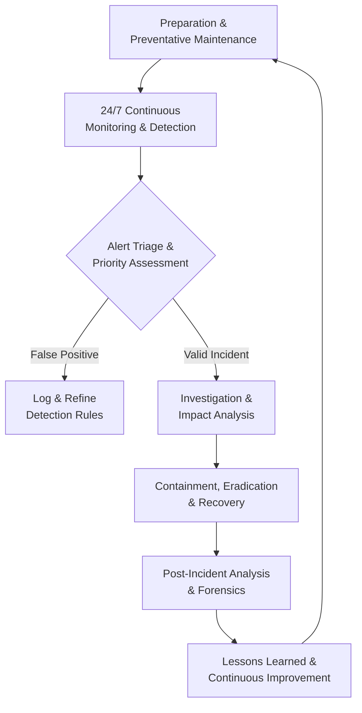
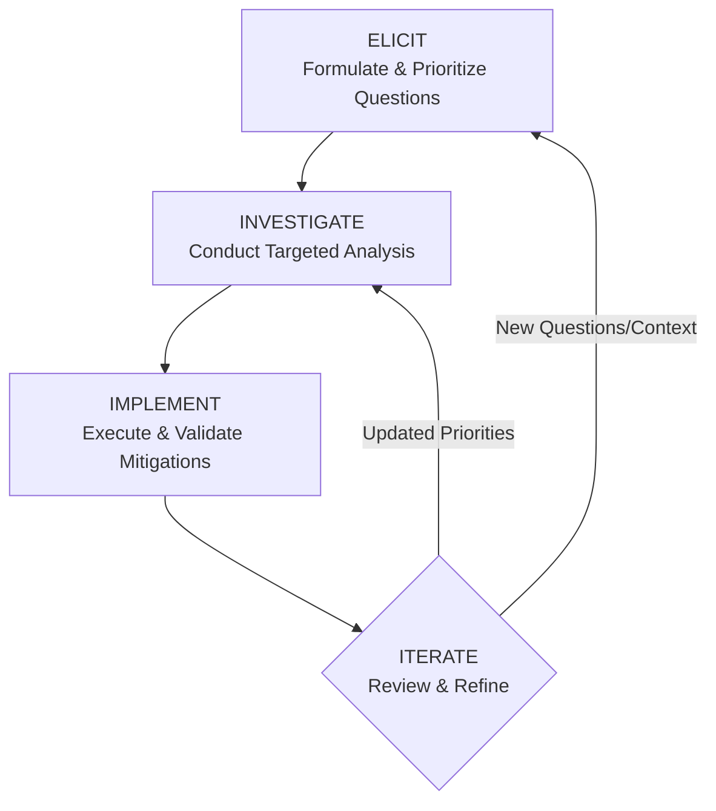
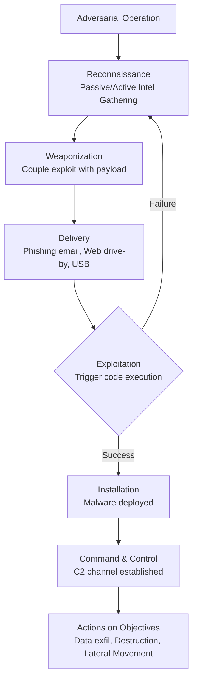
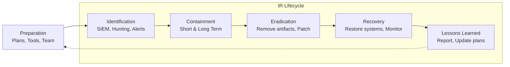

    

<h1 align="center">MR. SAM ROHAN</h1>
<h3 align="center">PRECISION IN EXECUTION - SUPREMACY IN IMPACT!</h3>

 

    

  

<h1 align="center">The Definitive Guide to Modern Security Operations Centers.</h1>

 

## Executive Summary
In an era defined by digital transformation and escalating cyber threats, the Security Operations Center (SOC) has evolved from a peripheral IT function to the strategic nerve center of organizational defense. This document provides a comprehensive analysis of the modern SOC, detailing its architecture, roles, operational impact, and evolution in confronting contemporary security challenges across both IT and industrial environments.

## 1.0 Introduction: The Strategic Imperative of the Modern SOC

A Security Operations Center (SOC) represents a centralized organizational unit dedicated to continuously monitoring, detecting, analyzing, investigating, and responding to cybersecurity threats and incidents. By orchestrating people, processes, and technology, the SOC serves as the primary guardian of an organization's security posture, protecting critical assets, ensuring business continuity, and maintaining regulatory compliance.

The modern SOC's mandate extends beyond traditional network boundaries to encompass cloud infrastructure, operational technology (OT), endpoints, identities, and data—wherever business value resides. Its operational philosophy has shifted from reactive alert monitoring to proactive threat hunting and intelligence-driven defense, enabled by automation, artificial intelligence (AI), and integrated security platforms.

## 2.0 Core Functions & Operational Framework

The SOC executes a continuous cycle of security operations aligned with the **Identify, Investigate, Mitigate, and Continuously Improve** framework. This operational model ensures both immediate incident response and long-term security enhancement.

### 2.1 Primary SOC Functions
*   **24/7 Proactive Monitoring & Surveillance:** SOCs maintain uninterrupted visibility across the entire digital estate—networks, endpoints, cloud workloads, applications, and data. By analyzing logs, traffic patterns, and telemetry from integrated security tools, analysts identify anomalies and indicators of compromise (IoCs) that signal potential security events, aiming to reduce Mean Time to Detection (MTTD).
*   **Incident Detection, Triage & Response:** When a security event is detected, the SOC executes a structured response: assessing severity, determining scope, containing the threat, eradicating the cause, recovering systems, and conducting post-incident analysis. This process minimizes damage and operational disruption.
*   **Threat Intelligence Integration & Analysis:** SOCs consume, analyze, and operationalize threat intelligence from internal investigations, open-source feeds, commercial providers, and industry information sharing groups. This intelligence informs detection rules, reveals attacker tactics, techniques, and procedures (TTPs), and enables proactive defense against emerging threats.
*   **Vulnerability Management & Proactive Remediation:** Through continuous vulnerability assessment, patch management oversight, and configuration hardening, SOC teams work to reduce the organization's attack surface. They prioritize remediation based on exploitability, asset criticality, and threat intelligence.
*   **Digital Forensics & Root Cause Analysis:** Following an incident, forensic specialists conduct detailed investigations to understand the attack timeline, methods, and impact. This analysis is crucial for ensuring complete remediation, supporting legal or regulatory requirements, and refining defenses to prevent recurrence.
*   **Compliance Assurance & Reporting:** SOCs play a key role in demonstrating adherence to regulatory frameworks (e.g., GDPR, HIPAA, PCI-DSS, NIST CSF) through continuous control monitoring, audit log maintenance, and generating compliance reports for internal and external stakeholders.

### 2.2 The SOC Operational Workflow
The following flowchart illustrates the continuous, iterative lifecycle of security operations within a mature SOC:

## 3.0 SOC Team Structure: Roles & Hierarchical Responsibilities

A SOC's effectiveness hinges on a clearly defined team structure with specialized roles operating in a tiered model for efficient escalation and expertise application.

### 3.1 Tiered Analyst Structure

| Tier | Role Title | Primary Responsibilities | Key Skills & Focus |
| :--- | :--- | :--- | :--- |
| **Tier 1** | **Triage Specialist / Alert Analyst** | Monitors security alerts from SIEM/XDR; performs initial triage and classification; enriches alerts with contextual data; filters false positives; manages security tools; escalates validated incidents to Tier 2. | Alert fatigue management, foundational security tool operation, basic log analysis, understanding of common IoCs. |
| **Tier 2** | **Incident Responder / Security Analyst** | Conducts deep-dive investigation of escalated incidents; utilizes threat intelligence to understand attack scope and actor TTPs; determines affected systems; executes containment and remediation strategies. | Digital forensics basics, malware analysis, threat intelligence application, incident response procedures. |
| **Tier 3** | **Threat Hunter / Senior Security Analyst** | Proactively hunts for covert threats and security gaps not caught by automated tools; performs vulnerability assessments and penetration tests; analyzes complex attack patterns; leads response to major incidents; optimizes SOC tools and processes. | Advanced persistent threat (APT) analysis, reverse engineering, security architecture review, purple teaming, threat hunting methodologies. |
| **Tier 4** | **SOC Manager / Lead** | Oversees all SOC operations, personnel, and strategy; manages budgets and resources; reports to CISO/executive leadership; handles major incident communication; responsible for hiring, training, and process development. | Leadership, project management, risk management, executive communication, strategic planning. |

### 3.2 Specialized & Supporting Roles
*   **Security Engineer/Architect:** Designs, implements, and maintains the organization's security infrastructure (firewalls, IDS/IPS, SIEM, etc.). Ensures security tools are integrated, optimized, and evolving with the threat landscape.
*   **Threat Intelligence Analyst:** Specializes in collecting, analyzing, and disseminating actionable intelligence on threat actors, campaigns, and vulnerabilities to inform proactive defensive measures.
*   **Digital Forensics & Incident Response (DFIR) Specialist:** Focuses exclusively on post-breach investigation, evidence collection, malware reverse engineering, and providing detailed attack narratives for legal or recovery purposes.
*   **Compliance Auditor:** Ensures SOC processes and controls align with relevant regulatory standards and internal policies, managing evidence collection and audit readiness.
*   **Security Automation/SOAR Engineer:** Develops and maintains automated playbooks and workflows to orchestrate response actions across disparate security tools, drastically reducing manual effort and response times.

## 4.0 Impact on Modern IT & Industrial Operations

### 4.1 For Traditional IT & Digital Business
*   The SOC enables **business resilience** by minimizing downtime and financial loss from cyber incidents, directly protecting revenue and customer trust.
*   It provides the **continuous control monitoring** necessary to navigate complex regulatory landscapes, avoiding hefty fines and reputational damage associated with non-compliance.
*   By securing cloud migrations, SaaS applications, and remote work infrastructures, the SOC acts as the **critical enabler of digital transformation**, allowing innovation to proceed with managed risk.
*   Through advanced analytics, the SOC shifts the security paradigm from reactive to **proactive risk management**, identifying and mitigating vulnerabilities before they are exploited.

### 4.2 For Industrial Operations & OT Environments
*   In Industrial Control Systems (ICS) and SCADA networks, the SOC adopts a **mission-centric approach**, prioritizing the safety and continuity of physical operations over traditional IT confidentiality goals.
*   SOC teams specializing in OT security must understand **protocol-specific threats** and the unique constraints of industrial environments, where patching cycles are long and system availability is paramount.
*   The convergence of IT and OT networks expands the attack surface. The SOC serves as the **bridge between these domains**, coordinating response that addresses both IT-borne threats and their potential physical consequences.
*   SOCs play a vital role in protecting against **industrial sabotage, ransomware targeting production**, and espionage aimed at intellectual property within manufacturing processes.

## 5.0 SOC Delivery Models & Evolution

Organizations can implement a SOC through various models, each with distinct advantages.

| Model | Description | Best For |
| :--- | :--- | :--- |
| **In-House SOC** | Dedicated, internal team using company-owned technology. Retains full control, context, and customization. | Large enterprises with significant resources, stringent compliance needs, and highly specialized environments. |
| **Virtual / Cloud SOC** | Team operates remotely, often leveraging cloud-native security platforms. Offers flexibility and access to talent regardless of location. | Distributed organizations, companies embracing cloud-first strategies, or those seeking operational flexibility. |
| **SOC-as-a-Service (Outsourced to MSSP/MDR)** | Fully managed detection and response provided by a third-party Managed Security Service Provider (MSSP) or Managed Detection and Response (MDR) provider. | Organizations lacking in-house expertise, seeking 24/7 coverage without the overhead of building a team, or needing to rapidly mature their security posture. |
| **Hybrid / Co-Managed SOC** | Blend of in-house and outsourced functions (e.g., internal Tier 3/management with outsourced 24/7 Tier 1 monitoring). Provides balance of control, context, and cost-effective scale. | Most organizations; allows internal focus on high-value tasks while leveraging external experts for foundational coverage and overflow support. |

## 6.0 The Future SOC: AI, Automation, and Proactive Defense

The next-generation SOC is being reshaped by powerful technological and methodological shifts.

*   **AI & Machine Learning as Force Multipliers:** AI will move beyond simple anomaly detection to predictive threat modeling, automated incident investigation, and intelligent response recommendations. Generative AI will act as an analyst co-pilot, summarizing incidents, drafting reports, and suggesting remediation steps.
*   **Hyperautomation through SOAR & XDR:** Security Orchestration, Automation, and Response (SOAR) platforms, integrated with Extended Detection and Response (XDR), will automate entire workflows—from alert enrichment and initial containment to evidence collection and ticket creation—freeing human analysts for complex decision-making.
*   **The Rise of Proactive Threat Hunting:** The future SOC will dedicate more resources to hunting, assuming adversaries are already inside the perimeter. This involves leveraging behavioral analytics, adversary emulation, and hypothesis-driven searches to uncover stealthy attacks.
*   **Unified Platforms Over Tool Sprawl:** To combat visibility gaps and analyst fatigue, organizations will consolidate onto unified security platforms that provide a single pane of glass for data, analytics, and response across network, endpoint, cloud, and identity.
*   **Focus on Metrics & Business Alignment:** SOCs will increasingly utilize business-relevant metrics like Risk Reduction Quantified, Business Process Recovery Time, and Security ROI to communicate value and align efforts with organizational objectives.

## 7.0 Conclusion: The SOC as a Business-Critical Foundation

The modern Security Operations Center is no longer a cost center but a **strategic asset** essential for business viability in the digital age. It is the engine of cyber resilience, transforming raw telemetry into actionable intelligence and coordinated response. By investing in a mature SOC—whether built internally, outsourced, or hybrid—organizations do not merely purchase technology; they cultivate a **core capability** to manage cyber risk, enable secure innovation, and protect their most valuable assets in an increasingly adversarial world. The evolution towards AI-augmented, proactive, and intelligence-driven operations is not optional; it is the necessary path to maintaining defensive advantage against an ever-evolving threat landscape.

    

<h1 align="center">Inquiry-Driven Cyber Defense (ICD): A Scalable Framework for Focused Security Operations.</h1>
 
 

## Executive Summary

Inquiry-Driven Cyber Defense (ICD) is a structured operational methodology that transforms ambiguous security challenges into measurable, evidence-based actions through systematic questioning. This framework replaces reactive, tool-centric approaches with a disciplined process that begins by explicitly defining critical knowledge gaps. ICD decomposes broad security objectives into discrete, answerable questions, creating a clear roadmap for execution, validation, and continuous adaptation. Designed for scalability and seamless integration into production environments, ICD ensures security resources are consistently aligned with the most impactful risks.

 

## 1. Conceptual Foundation: From Ambiguity to Action

Traditional security operations often falter due to vague objectives and an overreliance on tool outputs without contextual understanding. ICD mandates a fundamental shift: every security initiative must originate from a clearly articulated question that identifies a specific operational unknown. This approach moves teams beyond generic goals like "improve our security posture" or "harden the environment" and instead focuses on resolving explicit uncertainties that directly correspond to risk.

*   **ICD is inherently scalable**, functioning with equal efficacy for an individual analyst troubleshooting an alert, a team managing a vulnerability program, or an organization defining its annual security strategy. The same core principles apply regardless of scope, enabling consistent methodology across all levels of operation.
*   **ICD is fundamentally adaptive**, as its primary artifact—the Question Register—is a living document. Questions evolve in response to new threat intelligence, business changes, and technological shifts, ensuring the defense strategy remains relevant and proactive.
*   **ICD is production-ready**, designed to integrate directly with existing workflows such as incident response, risk management, and control assessments. It provides tangible inputs and outputs for these processes, bridging the gap between strategic goals and tactical execution.

## 2. Core Principles of ICD

The ICD framework is built upon five foundational principles that guide its application and ensure its effectiveness.

*   **Explicit Uncertainty Identification:** ICD eliminates tolerance for vague concerns by forcing the articulation of precise knowledge gaps. Instead of stating "we might have exposure," teams must formulate questions like, "Which of our externally facing Azure storage containers are configured for public anonymous read access?" This precision directs effort and enables measurement.
*   **Atomic Problem Decomposition:** Complex security challenges are broken down into fundamental, answerable questions. This decomposition prevents overwhelm, allows for parallel workstreams, and ensures each investigative action has a defined purpose and success criterion.
*   **Risk-Prioritized Execution:** Not all questions are equally urgent. ICD requires that questions be ranked based on potential impact (to confidentiality, integrity, and availability) and likelihood (informed by threat intelligence and asset criticality). This ensures that resources are consistently allocated to resolve the most critical unknowns first.
*   **Evidence-Based Action:** Decisions and mitigations within ICD must stem directly from answers validated through analysis, testing, or data collection. This principle replaces assumption and conjecture with empirical evidence, leading to more effective and defensible security controls.
*   **Iterative Refinement:** Security is a continuous cycle. Answering initial questions invariably generates deeper, more specific follow-up inquiries. This iterative process allows the security program to refine its understanding and defenses progressively, adapting to increased knowledge and changing conditions.

## 3. The ICD Operational Workflow

The ICD methodology is executed through a four-phase, iterative workflow. Each phase has distinct inputs, actions, and outputs, creating a closed-loop system for continuous security improvement.

### Phase 1: ELICIT – Formulate & Prioritize Questions
This phase translates broad security objectives into a prioritized list of specific, actionable questions.

*   **Input:** Security objectives, threat intelligence reports, audit findings, risk assessment data, and incident post-mortems.
*   **Action:** Conduct brainstorming sessions to generate questions using interrogatives (What, How, Where, Which, Who, When). Focus on uncovering concrete operational unknowns that, once answered, will directly reduce risk. All questions are logged in a central, version-controlled **Question Register**.
*   **Prioritization:** Questions are scored and ranked using a consistent risk rubric. Factors include potential business impact, asset criticality, exploit likelihood, and regulatory implications.
*   **Output:** A prioritized list of specific, answerable security questions documented in the Question Register.

### Phase 2: INVESTIGATE – Conduct Targeted Analysis
This phase involves executing precise investigative actions to gather evidence that definitively answers the prioritized questions.

*   **Input:** The prioritized Question Register.
*   **Action:** Design and execute targeted analysis tailored to each question. The investigation method is matched to the question type, leveraging appropriate tools and data sources.
*   **Output:** Evidence-based answers documented in the Question Register, including detailed notes on data sources, methodologies, and confidence levels.

**Table: Mapping Question Types to Investigation Methods**

| Question Type | Example Question | Investigation Methods & Tools |
| :--- | :--- | :--- |
| **Asset & Data Discovery** | “Where does our most sensitive PII data reside across the hybrid cloud environment?” | Data discovery scans, Cloud Security Posture Management (CSPM) tools, data classification platform queries, application owner interviews. |
| **Threat Exposure** | “What is our exposure to the newly disclosed critical vulnerability in SoftwareX?” | Vulnerability scanner correlation with asset inventory, exploitability analysis, threat intelligence platform queries for active exploitation. |
| **Control Effectiveness** | “Are our endpoint detection rules effectively identifying the latest living-off-the-land techniques?” | SIEM/EDR query development, purple team exercises simulating specific TTPs, analysis of detection alert logs and false negatives. |
| **Process & Configuration** | “How are administrative credentials for our core network devices managed and audited?” | Configuration management database (CMDB) review, password vault log analysis, network device configuration audit scripts. |

### Phase 3: IMPLEMENT – Execute & Validate Mitigations
Answers from the INVESTIGATE phase are translated into concrete security actions, which are then deployed and rigorously validated.

*   **Input:** Validated answers and evidence from the INVESTIGATE phase.
*   **Action:** Design and deploy controls, process changes, or configuration updates that directly address the identified gap. Crucially, each action must be followed by a validation step to confirm the mitigation is effective as intended.
*   **Output:** Implemented security controls or process changes, with validation results documented and linked to the original question in the Register.

### Phase 4: ITERATE – Review & Refine
This phase closes the loop, using the outcomes of the cycle to refine the security program and feed the next iteration of inquiry.

*   **Input:** Implementation outcomes, new threat intelligence, changing business context, and emerging vulnerabilities.
*   **Action:** Review the entire Question Register. Generate new follow-up questions based on findings, re-prioritize existing unanswered questions, and archive or update resolved items. Formalize validated knowledge into policies, playbooks, or architectural standards.
*   **Output:** An updated and reprioritized Question Register, new objectives for the next ICD cycle, and updated organizational knowledge bases.

## 4. Production Integration & Strategic Benefits

Implementing ICD yields significant operational and strategic advantages by introducing focus, measurability, and adaptability into the security function.

*   **Eliminates Ambiguity and Enhances Focus:** By defining success as answering specific questions, ICD provides unambiguous direction for security teams. Efforts shift from "running tools" to "seeking answers," which dramatically reduces wasted effort and tool sprawl. Teams select the right tool for the specific question at hand, rather than managing tool outputs in search of a problem.
*   **Delivers Measurable, Auditable Progress:** Each answered question and its corresponding implemented mitigation represents a concrete unit of risk reduction. Progress is transparently tracked via the status of the Question Register, providing clear metrics for leadership reporting and audit demonstrations. This evidence-based approach builds credibility and justifies resource allocation.
*   **Ensures Optimal Resource Allocation:** The built-in, risk-based prioritization mechanism acts as a forcing function, ensuring that time, budget, and personnel are consistently applied to the organization's most pressing security unknowns. This leads to a higher return on security investment.
*   **Fosters Collaboration and Knowledge Retention:** The Question Register serves as a centralized repository of context, documenting what is known, what is being investigated, and why. This is invaluable for onboarding new team members, handing off tasks, providing audit trails, and ensuring institutional knowledge is preserved despite personnel changes.
*   **Builds an Inherently Adaptive Posture:** The framework is designed for change. New threats, such as a zero-day exploit, immediately generate high-priority questions (e.g., "Are our systems vulnerable?" and "Is our monitoring capable of detecting exploitation?"). Similarly, business initiatives like a new cloud deployment trigger relevant, proactive security inquiries from the outset.

## 5. Deployment Guidelines for Security Teams

Successful adoption of ICD is a gradual process that emphasizes cultural shift over tool procurement.

*   **Begin with a Pilot Project:** Start small to demonstrate value and refine the process. Ideal pilot candidates include a focused incident post-mortem, a cloud configuration review, or a targeted vulnerability assessment. Apply the full ICD workflow to this bounded scope.
*   **Formalize the Question Register:** Establish a single source of truth for tracking inquiries. This can start as a shared document or wiki but should ideally integrate with existing ticketing (e.g., Jira, ServiceNow) or project management systems to align with operational workflows. Key fields include Question, Owner, Priority, Status, Answer, Evidence, Action Taken, and Validation Result.
*   **Train Teams on Question Formulation:** The quality of the process is dictated by the quality of the questions. Conduct workshops to help teams transform vague concerns into specific, investigative queries. A strong question is actionable, scoped, and answerable through available data or analysis.
*   **Integrate with Existing Governance Processes:** ICD should not operate in a silo. Feed its outputs directly into established processes: use answered questions to update the risk register, turn implemented mitigations into change management tickets, and leverage findings for control gap assessments and audit preparation.
*   **Establish a Regular Review Cadence:** Institutionalize the ITERATE phase. Schedule recurring meetings (e.g., a weekly tactical review for operations teams, a monthly strategic review for leadership) dedicated to updating the Question Register, incorporating new intelligence, and assessing progress. This ensures ICD remains a living, dynamic process.

 

## Conclusion: Replacing Guesswork with Disciplined Inquiry

Inquiry-Driven Cyber Defense provides a resilient, evidence-based framework for modern security operations. In an era of escalating complexity and constant change, ICD offers a disciplined alternative to reactive guesswork and tool-centric fatigue. By systematically asking, "What do we not know?" and relentlessly pursuing the answers, security teams can focus their efforts, demonstrate clear value, and build a defense posture that is both robust and adaptable. Ultimately, ICD ensures that cybersecurity resources are transformed from a cost center into a strategic, risk-informed business function.

    

<h1 align="center">The Modern Cybersecurity Landscape: Offensive Tactics, Defensive Strategies, and Building Incident Resilience.</h1>
 
 

#### **PART I: OFFENSIVE SECURITY: ATTACK VECTORS AND EXPLOITATION**  
*Understanding Adversarial Methodologies*  
**1. Foundations of Cyber Offense**  
- 1.1 Ethical Hacking Principles  
- 1.2 Cyber Kill Chain & MITRE ATT&CK Framework  
- 1.3 Attacker Motives, Goals, and Classification  
- 1.4 Information Warfare and Adversarial TTPs  
- 1.5 Threat Hunting Fundamentals  

**2. Reconnaissance and Intelligence Gathering**  
- 2.1 Passive Reconnaissance:  
  - 2.1.1 DNS/WHOIS, Metadata, and Public Network Footprinting  
  - 2.1.2 Google Dorking, Shodan/Censys, and IoT Search Engines  
  - 2.1.3 Social Engineering Recon (Job Boards, Social Networks)  
  - 2.1.4 Dark Web and Geospatial Intelligence  
- 2.2 Active Scanning & Enumeration:  
  - 2.2.1 Host Discovery and Network Topology Mapping  
  - 2.2.2 Advanced Nmap Scans (Stealth, XMAS, UDP, IDLE/IPID)  
  - 2.2.3 Service Fingerprinting and OS Detection  
  - 2.2.4 Enumeration Techniques: SMB, SNMP, LDAP, SMTP  
  - 2.2.5 IDS/Firewall Evasion Tactics  

**3. Vulnerability Analysis and Exploitation**  
- 3.1 Vulnerability Assessment Lifecycle  
- 3.2 Vulnerability Classification and Scoring (CVSS)  
- 3.3 Exploitation Techniques:  
  - 3.3.1 Buffer Overflows and Memory Corruption  
  - 3.3.2 Password Attacks (Brute Force, Hash Cracking, Extraction)  
  - 3.3.3 Privilege Escalation (Windows/Linux)  
  - 3.3.4 Web-Specific Exploits: SQLi, XSS, CSRF, LFI/RFI  
- 3.4 Post-Exploitation:  
  - 3.4.1 Maintaining Access (Backdoors, RATs)  
  - 3.4.2 Steganography and Anti-Forensics  

**4. Advanced Attack Vectors**  
- 4.1 Malware Threats:  
  - 4.1.1 APTs, Trojans, Fileless Malware  
  - 4.1.2 Ransomware and Worm Propagation  
- 4.2 Network-Based Attacks:  
  - 4.2.1 Sniffing (ARP/DNS Poisoning, DHCP Spoofing)  
  - 4.2.2 DoS/DDoS (Volumetric, Protocol, Application Layer)  
  - 4.2.3 Session Hijacking (Network/Application Layer)  
- 4.3 Wireless and Edge Device Exploitation:  
  - 4.3.1 Wi-Fi Hacking (Evil Twin, Deauthentication)  
  - 4.3.2 IoT/OT Vulnerabilities and Attacks  

**5. Specialized Target Exploitation**  
- 5.1 Web Application Offense:  
  - 5.1.1 OWASP Top 10 (2023) and Web Shells  
  - 5.1.2 API/Webhook Abuse and IDOR  
- 5.2 Cloud and Container Attacks  
- 5.3 Mobile Platform Hacking (Android/iOS)  
- 5.4 Cryptography Offense:  
  - 5.4.1 Cryptographic Weaknesses  
  - 5.4.2 PKI Exploitation and Cryptanalysis  

---

#### **PART II: DEFENSIVE SECURITY: PROTECTION AND PREVENTION**  
*Building Cyber Resilience*  
**6. Cyber Defense Fundamentals**  
- 6.1 Security Architecture and Zero Trust  
- 6.2 Risk Management Lifecycle (NIST RMF)  
- 6.3 Security Standards: ISO 27001, NIST CSF, PCI-DSS  

**7. Proactive Threat Mitigation**  
- 7.1 Threat Intelligence (Strategic, Tactical, Operational)  
- 7.2 Threat Modeling (STRIDE, DREAD)  
- 7.3 Vulnerability Management and Patching  
- 7.4 Defense-in-Depth Strategies:  
  - 7.4.1 Next-Gen Firewalls and IDS/IPS  
  - 7.4.2 Honeypots and Deception Technologies  
  - 7.4.3 Secure Coding Practices  

**8. Cryptography and Access Defense**  
- 8.1 Cryptographic Protocols and PKI Design  
- 8.2 Authentication Mechanisms (MFA, SAML, OAuth)  
- 8.3 Password Policies and Secrets Management  

**9. AI and Automation in Defense**  
- 9.1 Machine Learning for Anomaly Detection  
- 9.2 SOAR (Security Orchestration, Automation, Response)  

---

#### **PART III: INCIDENT RESPONSE AND RESILIENCE**  
*Detection, Response, and Recovery*  
**10. Incident Management Frameworks**  
- 10.1 NIST SP 800-61 and SANS PICERL Model  
- 10.2 Legal Compliance (GDPR, HIPAA, CCPA)  
- 10.3 Incident Response Team (IRT) Structuring  

**11. Incident Response Lifecycle**  
- 11.1 Preparation: Policies, Tools, and IR Plans  
- 11.2 Detection & Triage:  
  - 11.2.1 SIEM and Log Analysis  
  - 11.2.2 Threat Hunting in Live Environments  
- 11.3 Containment Strategies:  
  - 11.3.1 Network Segmentation  
  - 11.3.2 Malware Quarantine  
- 11.4 Eradication and Recovery:  
  - 11.4.1 Root Cause Analysis  
  - 11.4.2 System Restoration and Backups  
- 11.5 Post-Incident Activities:  
  - 11.5.1 Forensic Reporting  
  - 11.5.2 Lessons Learned and Improvement  

**12. Digital Forensics and Evidence Handling**  
- 12.1 Forensic Readiness Planning  
- 12.2 Data Acquisition:  
  - 12.2.1 Volatile Memory Analysis (Windows/Linux)  
  - 12.2.2 Disk Imaging and Anti-Forensics Detection  
- 12.3 Forensic Tools: Autopsy, FTK, OSForensics  

**13. Sector-Specific Incident Handling**  
- 13.1 Malware Outbreak Response  
- 13.2 Network Security Incidents (DDoS, Unauthorized Access)  
- 13.3 Web Application Breaches (SQLi, XSS, Defacement)  
- 13.4 Cloud and Insider Threat Incidents  
- 13.5 Email Compromise (Phishing, BEC)  

**14. Hands-On Cyber Operations**  
- 14.1 Volatile Evidence Collection: Windows/Linux  
- 14.2 Network Analysis: Wireshark, Suricata, Zeek  
- 14.3 Malware Analysis: Sandboxing and Reverse Engineering  
- 14.4 Web Attack Simulations: SQLMap, Burp Suite  
- 14.5 Cloud Security Tools: AWS GuardDuty, Azure Sentinel  

 
 
## Part I: Understanding the Adversary - Offensive Security Methodologies

To build an effective defense, one must first understand the offense. This section deconstructs the attacker's lifecycle, tools, and techniques, providing insight into modern exploitation methodologies.

### 1.1 Foundations of Cyber Offense and Adversarial Thinking
Offensive security, when conducted ethically, is a proactive discipline aimed at discovering vulnerabilities before malicious actors do. It is governed by structured frameworks and a deep understanding of adversary behavior.

*   **Ethical Hacking Principles** establish the legal and moral boundaries for security testing, requiring explicit authorization, defined scope, and responsible disclosure of findings. This practice, often termed penetration testing or red teaming, is not about causing harm but about identifying weaknesses in confidentiality, integrity, and availability from an attacker's perspective to bolster defenses.
*   **The Cyber Kill Chain®** and **MITRE ATT&CK®** are indispensable frameworks for modeling intrusions. The Kill Chain outlines the sequential stages of an attack from reconnaissance to action on objectives, while MITRE ATT&CK provides a granular, real-world knowledge base of adversary tactics and techniques, enabling more specific threat modeling and detection engineering.
*   **Attacker Classification** ranges from script kiddies using pre-packaged tools to highly resourced nation-state Advanced Persistent Threats (APTs). Motives span financial gain (ransomware, credential theft), espionage (corporate or state secrets), hacktivism (ideologically driven disruption), and simple vandalism, each requiring different defensive postures.
*   **Threat Hunting** is a proactive, hypothesis-driven search for adversaries already within the network, moving beyond automated alerts. It leverages knowledge of TTPs (Tactics, Techniques, and Procedures) to uncover stealthy activities that evade traditional security controls.

### 1.2 Reconnaissance and Weaponization: The Attack Commences
Before any exploit is launched, adversaries invest significant effort in understanding their target. This phase is critical for a successful defense, as early detection here can prevent the entire attack chain.

*   **Passive Reconnaissance** involves gathering information from publicly available sources without directly interacting with the target's systems. This includes DNS history and WHOIS records, harvesting metadata from public documents, using advanced search techniques (Google Dorking), and scanning for exposed devices via platforms like Shodan. Social media and professional networks like LinkedIn are also mined for technical details and potential phishing targets.
*   **Active Scanning & Enumeration** entails direct engagement with the target's infrastructure to map its attack surface. Using tools like Nmap, adversaries perform host discovery, service fingerprinting, and operating system detection. They enumerate specific services (SMB for network shares, SNMP for device info, LDAP for directory services) to identify software versions, user accounts, and misconfigurations that can be leveraged for initial access.
*   **Vulnerability Analysis** follows enumeration, where identified services are checked against known vulnerability databases. Adversaries prioritize targets using the Common Vulnerability Scoring System (CVSS), focusing on high-severity flaws that offer reliable exploitation paths, such as unpatched remote code execution (RCE) vulnerabilities or default credentials on internet-facing systems.

### 1.3 Exploitation and Post-Exploitation: Gaining and Maintaining Access
Once a vulnerability is identified, the adversary moves to exploit it, gain a foothold, and expand their control within the environment.

*   **Core Exploitation Techniques** vary by target but include classics like buffer overflows (corrupting memory to execute arbitrary code), password attacks (brute-forcing, credential stuffing, or dumping hashes for offline cracking), and privilege escalation to gain SYSTEM or root-level access. Web-specific attacks like SQL Injection (SQLi), Cross-Site Scripting (XSS), and Cross-Site Request Forgery (CSRF) remain prevalent due to complex web architectures.
*   **Post-Exploitation** begins once initial access is achieved. The primary goals are to maintain persistence, evade detection, and move laterally. This involves installing backdoors or remote access trojans (RATs), employing living-off-the-land binaries (LOLBins) to blend in with normal activity, harvesting credentials from memory and storage, and pivoting to other systems on the network to locate and exfiltrate valuable data.
*   **Advanced Attack Vectors** include sophisticated malware like fileless malware that resides only in memory, ransomware that encrypts data for extortion, and network-based attacks such as ARP poisoning for man-in-the-middle positions or sophisticated Distributed Denial of Service (DDoS) attacks to overwhelm services. Wireless and IoT/OT devices present unique, often poorly secured, entry points into corporate and industrial networks.

### 1.4 Key Offensive Security Frameworks and Classifications
The following table summarizes core frameworks and vulnerability classifications used to understand and categorize attacks.

| Framework/Standard | Primary Purpose | Key Components/Structure |
| :--- | :--- | :--- |
| **MITRE ATT&CK®** | Knowledge base of real-world adversary TTPs | 14 Tactical Stages (e.g., Initial Access, Execution, Persistence, Lateral Movement) with detailed Techniques and Sub-techniques. |
| **Cyber Kill Chain®** | Model for describing stages of a cyber attack | 7 Linear Stages: Recon, Weaponization, Delivery, Exploitation, Installation, C2, Actions on Objectives. |
| **OWASP Top 10** | Awareness document for critical web app risks | Categorized list (e.g., A01: Broken Access Control, A03: Injection, A07: Identification & Auth Failures) with remediation guidance. |
| **CVSS (v3.1)** | Standard for scoring IT vulnerability severity | Scores 0.0-10.0 based on Base (intrinsic qualities), Temporal (state over time), and Environmental (org-specific) metrics. |

***

## Part II: Building the Fortress - Defensive Security Strategies

A robust defense is multi-layered, proactive, and integrated across people, processes, and technology. This section outlines the strategies and controls necessary to prevent, detect, and mitigate attacks.

### 2.1 Foundational Defense: Architecture and Governance
Effective cybersecurity begins with a strong foundation built on sound architecture, risk management, and governance.

*   **Zero Trust Architecture** operates on the principle of "never trust, always verify." It assumes breach and eliminates implicit trust by enforcing strict identity verification for every person and device attempting to access resources, whether inside or outside the network perimeter. Micro-segmentation is a key component, limiting lateral movement.
*   **Risk Management** is a continuous lifecycle of identifying, assessing, and prioritizing risks followed by applying resources to minimize or control the probability of their occurrence. Frameworks like the NIST Risk Management Framework (RMF) provide a structured process to manage security and privacy risk, ensuring compliance and aligning security efforts with business objectives.
*   **Security Standards & Compliance** provide established baselines for security programs. Standards like ISO 27001 offer a comprehensive set of information security management controls, while the NIST Cybersecurity Framework (CSF) provides a risk-based approach to managing cybersecurity. Industry-specific regulations like PCI-DSS and HIPAA define mandatory protections for payment card and healthcare data, respectively.

### 2.2 Proactive Threat Mitigation and Defense-in-Depth
Preventing incidents requires a proactive stance that anticipates threats and layers defenses to protect critical assets.

*   **Threat Intelligence** involves collecting and analyzing information about current and emerging threats. Strategic intelligence informs high-level decision-making, tactical intelligence focuses on adversary TTPs for defensive tuning, and operational intelligence provides specific indicators (IPs, domains, hashes) for blocking. Integrating this intelligence into security tools is crucial for proactive defense.
*   **Threat Modeling** is a structured process to identify and prioritize potential threats to a system. Methodologies like STRIDE (Spoofing, Tampering, Repudiation, Information Disclosure, Denial of Service, Elevation of Privilege) help teams systematically think like an attacker during the design phase, enabling the implementation of security controls by design rather than as an afterthought.
*   **Vulnerability Management** is a continuous cycle of identifying, evaluating, treating, and reporting on security vulnerabilities in systems and software. It goes beyond periodic scanning to include risk-based prioritization (using CVSS and organizational context), timely patching, and compensating controls for vulnerabilities that cannot be immediately remediated.
*   **Defense-in-Depth** implements multiple, redundant layers of security controls so that if one layer fails, another will stop the attack. This architecture includes perimeter defenses (Next-Gen Firewalls, IDS/IPS), network segmentation, endpoint detection and response (EDR), application controls, data encryption, and user training. Deception technologies, like honeypots, add an active layer to detect and study attacker behavior.

### 2.3 Core Security Controls: Cryptography and Access Management
Protecting data and controlling access are cornerstone defensive activities that rely on proven cryptographic and identity management principles.

*   **Cryptographic Protocols and PKI** are essential for ensuring data confidentiality, integrity, and authenticity. Defenders must implement strong, up-to-date protocols (e.g., TLS 1.3, AES-256) and properly manage Public Key Infrastructure (PKI) for digital certificates, which underpin secure web browsing, email, code signing, and digital signatures. Weak or misconfigured cryptography is a critical failure point.
*   **Authentication and Access Control** mechanisms must evolve beyond simple passwords. Multi-Factor Authentication (MFA) is non-negotiable for all user access, significantly reducing the risk of credential-based attacks. Implementing robust identity federation protocols (SAML, OAuth 2.0) and principle of least privilege ensures users and systems have only the minimum access necessary to perform their functions. Centralized secrets management is vital for securing application credentials and API keys.

### 2.4 The Role of AI and Automation in Modern Defense
The scale and speed of modern threats necessitate intelligent automation to augment human security teams.

*   **Machine Learning for Anomaly Detection** excels at identifying subtle, previously unknown threats by establishing behavioral baselines for users, devices, and network traffic. ML models can detect deviations indicative of compromised accounts, insider threats, or novel malware that signature-based tools miss, though they require careful tuning to minimize false positives.
*   **Security Orchestration, Automation, and Response (SOAR)** platforms integrate disparate security tools and automate repetitive, labor-intensive tasks. Playbooks can automatically triage alerts, enrich data with threat intelligence, contain compromised hosts by isolating them from the network, and initiate incident response workflows, allowing human analysts to focus on complex investigation and strategic tasks.

***

## Part III: Assuming Breach - Incident Response and Organizational Resilience

No defense is impenetrable. Resilience is defined not by the absence of incidents, but by the ability to rapidly detect, respond, contain, recover, and learn from them.

### 3.1 Incident Management Preparedness
An effective response is planned long before an incident occurs. Preparation involves establishing clear frameworks, teams, and legal understandings.

*   **Incident Response Frameworks** like the NIST SP 800-61 and the SANS PICERL (Preparation, Identification, Containment, Eradication, Recovery, Lessons Learned) model provide proven, step-by-step methodologies for handling security breaches. They ensure a consistent, thorough, and effective response, reducing chaos and dwell time.
*   **Legal and Compliance Considerations** are critical during and after an incident. Response activities must adhere to data breach notification laws (GDPR, CCPA, state laws), data preservation requirements for potential litigation, and regulations governing specific data types (e.g., HIPAA for PHI, PCI-DSS for card data). Involving legal counsel early in the IR process is mandatory.
*   **Incident Response Team (IRT) Structuring** involves defining clear roles and responsibilities for a cross-functional team. This includes a lead/commander, forensic investigators, IT engineers for containment, communications specialists for internal and external messaging, and legal representatives. Regular tabletop exercises are essential to keep the team prepared and processes refined.

### 3.2 The Incident Response Lifecycle in Action
When an incident is declared, a structured lifecycle guides the response from detection to resolution and improvement.

*   **Preparation** is the continuous phase where IR plans are written and tested, communication channels are established, and necessary tools (forensic kits, analysis workstations, documentation systems) are provisioned and maintained. This phase determines the speed and effectiveness of the actual response.
*   **Detection & Triage** involves identifying potential security events from alerts, logs, user reports, or threat hunts and quickly determining their validity and severity. Security Information and Event Management (SIEM) systems are central, aggregating and correlating logs from across the enterprise to provide visibility and context for analysis.
*   **Containment, Eradication & Recovery** aim to limit damage, remove the threat, and restore normal operations. Short-term containment may involve taking a system offline, while long-term containment applies system patches and blocks malicious IPs. Eradication requires removing all traces of the adversary (malware, backdoors). Recovery involves carefully restoring systems from clean backups, validating their integrity, and monitoring for re-infection.
*   **Post-Incident Activity** is arguably the most critical phase for long-term resilience. A thorough lessons-learned review analyzes what happened, what was done well, and what needs improvement. This informs updates to IR plans, security controls, and policies. A formal forensic report details the timeline, impact, root cause, and corrective actions for stakeholders and legal requirements.

### 3.3 Digital Forensics and Evidence Handling
Forensics provides the "what, when, and how" of an incident, supporting eradication, legal action, and organizational learning.

*   **Forensic Readiness** involves preparing the organization to collect evidence effectively by ensuring appropriate logging is enabled and retained, defining evidence handling procedures, and training staff on the importance of preserving volatile data. This preparation is key to a successful investigation.
*   **Data Acquisition** follows a strict order of volatility, capturing the most transient data first. This includes RAM (for running processes, network connections, and unencrypted secrets) before moving to disk images, network device logs, and finally archival backup data. A forensically sound chain of custody must be maintained for any evidence that may be used in legal proceedings.
*   **Analysis and Tools** use specialized software to reconstruct events. Memory analysis tools (Volatility, Rekall) extract artifacts from RAM dumps. Disk forensic suites (Autopsy, FTK, X-Ways) allow examiners to analyze file systems, recover deleted files, and search for specific indicators of compromise (IOCs) across large datasets.

### 3.4 Essential Tools for Incident Response and Forensic Analysis
The following table categorizes key tool types used during the response and forensic investigation phases.

| Tool Category | Purpose | Common Examples |
| :--- | :--- | :--- |
| **SIEM & Analytics** | Centralized log aggregation, correlation, and alerting. | Splunk, Microsoft Sentinel, IBM QRadar, Elastic SIEM. |
| **Endpoint Detection & Response (EDR)** | Monitor endpoints for malicious activity, enable investigation/response. | CrowdStrike Falcon, Microsoft Defender for Endpoint, SentinelOne. |
| **Network Traffic Analysis** | Capture, analyze, and inspect network packets for threats. | Wireshark, Zeek (Bro), Suricata, Corelight. |
| **Digital Forensics** | Acquire and analyze data from disks, memory, and mobile devices. | Autopsy (free), FTK, X-Ways Forensics, Volatility Framework. |
| **Vulnerability & Exploitation** | Scan for vulnerabilities and simulate attacks (used responsibly). | Nessus, Qualys, Metasploit, Burp Suite, SQLMap. |

### 3.5 Building Continuous Resilience
Ultimately, cybersecurity is an ongoing cycle of preparation, defense, response, and adaptation. By understanding the adversary's playbook, implementing a layered, intelligent defense, and preparing to respond swiftly and effectively, organizations can transform their security posture from reactive to resilient, capable of operating securely in the face of continuous threats.

    

<h4 align="center">STAY TUNED FOR THE LATEST UPDATES!</h4>

  

    

    
