    

<h1 align="center">MR. SAM ROHAN</h1>
<h3 align="center">PRECISION IN EXECUTION - SUPREMACY IN IMPACT!</h3>

 

    

  

<h1 align="center">The Definitive Guide to Modern Security Operations Centers.</h1>

 

## Executive Summary
In an era defined by digital transformation and escalating cyber threats, the Security Operations Center (SOC) has evolved from a peripheral IT function to the strategic nerve center of organizational defense. This document provides a comprehensive analysis of the modern SOC, detailing its architecture, roles, operational impact, and evolution in confronting contemporary security challenges across both IT and industrial environments.

## 1.0 Introduction: The Strategic Imperative of the Modern SOC

A Security Operations Center (SOC) represents a centralized organizational unit dedicated to continuously monitoring, detecting, analyzing, investigating, and responding to cybersecurity threats and incidents. By orchestrating people, processes, and technology, the SOC serves as the primary guardian of an organization's security posture, protecting critical assets, ensuring business continuity, and maintaining regulatory compliance.

The modern SOC's mandate extends beyond traditional network boundaries to encompass cloud infrastructure, operational technology (OT), endpoints, identities, and data—wherever business value resides. Its operational philosophy has shifted from reactive alert monitoring to proactive threat hunting and intelligence-driven defense, enabled by automation, artificial intelligence (AI), and integrated security platforms.

## 2.0 Core Functions & Operational Framework

The SOC executes a continuous cycle of security operations aligned with the **Identify, Investigate, Mitigate, and Continuously Improve** framework. This operational model ensures both immediate incident response and long-term security enhancement.

### 2.1 Primary SOC Functions
*   **24/7 Proactive Monitoring & Surveillance:** SOCs maintain uninterrupted visibility across the entire digital estate—networks, endpoints, cloud workloads, applications, and data. By analyzing logs, traffic patterns, and telemetry from integrated security tools, analysts identify anomalies and indicators of compromise (IoCs) that signal potential security events, aiming to reduce Mean Time to Detection (MTTD).
*   **Incident Detection, Triage & Response:** When a security event is detected, the SOC executes a structured response: assessing severity, determining scope, containing the threat, eradicating the cause, recovering systems, and conducting post-incident analysis. This process minimizes damage and operational disruption.
*   **Threat Intelligence Integration & Analysis:** SOCs consume, analyze, and operationalize threat intelligence from internal investigations, open-source feeds, commercial providers, and industry information sharing groups. This intelligence informs detection rules, reveals attacker tactics, techniques, and procedures (TTPs), and enables proactive defense against emerging threats.
*   **Vulnerability Management & Proactive Remediation:** Through continuous vulnerability assessment, patch management oversight, and configuration hardening, SOC teams work to reduce the organization's attack surface. They prioritize remediation based on exploitability, asset criticality, and threat intelligence.
*   **Digital Forensics & Root Cause Analysis:** Following an incident, forensic specialists conduct detailed investigations to understand the attack timeline, methods, and impact. This analysis is crucial for ensuring complete remediation, supporting legal or regulatory requirements, and refining defenses to prevent recurrence.
*   **Compliance Assurance & Reporting:** SOCs play a key role in demonstrating adherence to regulatory frameworks (e.g., GDPR, HIPAA, PCI-DSS, NIST CSF) through continuous control monitoring, audit log maintenance, and generating compliance reports for internal and external stakeholders.

### 2.2 The SOC Operational Workflow
The following flowchart illustrates the continuous, iterative lifecycle of security operations within a mature SOC:

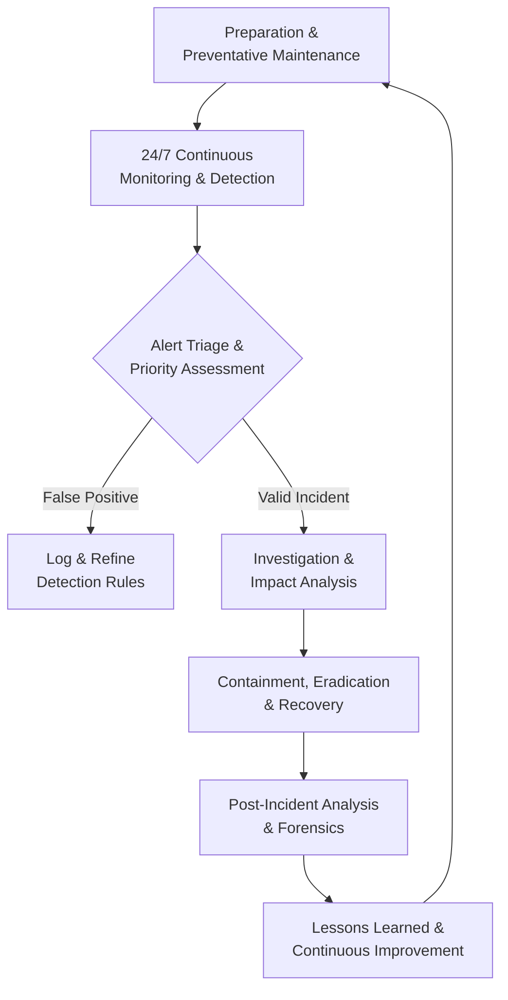

## 3.0 SOC Team Structure: Roles & Hierarchical Responsibilities

A SOC's effectiveness hinges on a clearly defined team structure with specialized roles operating in a tiered model for efficient escalation and expertise application.

### 3.1 Tiered Analyst Structure

| Tier | Role Title | Primary Responsibilities | Key Skills & Focus |
| :--- | :--- | :--- | :--- |
| **Tier 1** | **Triage Specialist / Alert Analyst** | Monitors security alerts from SIEM/XDR; performs initial triage and classification; enriches alerts with contextual data; filters false positives; manages security tools; escalates validated incidents to Tier 2. | Alert fatigue management, foundational security tool operation, basic log analysis, understanding of common IoCs. |
| **Tier 2** | **Incident Responder / Security Analyst** | Conducts deep-dive investigation of escalated incidents; utilizes threat intelligence to understand attack scope and actor TTPs; determines affected systems; executes containment and remediation strategies. | Digital forensics basics, malware analysis, threat intelligence application, incident response procedures. |
| **Tier 3** | **Threat Hunter / Senior Security Analyst** | Proactively hunts for covert threats and security gaps not caught by automated tools; performs vulnerability assessments and penetration tests; analyzes complex attack patterns; leads response to major incidents; optimizes SOC tools and processes. | Advanced persistent threat (APT) analysis, reverse engineering, security architecture review, purple teaming, threat hunting methodologies. |
| **Tier 4** | **SOC Manager / Lead** | Oversees all SOC operations, personnel, and strategy; manages budgets and resources; reports to CISO/executive leadership; handles major incident communication; responsible for hiring, training, and process development. | Leadership, project management, risk management, executive communication, strategic planning. |

### 3.2 Specialized & Supporting Roles
*   **Security Engineer/Architect:** Designs, implements, and maintains the organization's security infrastructure (firewalls, IDS/IPS, SIEM, etc.). Ensures security tools are integrated, optimized, and evolving with the threat landscape.
*   **Threat Intelligence Analyst:** Specializes in collecting, analyzing, and disseminating actionable intelligence on threat actors, campaigns, and vulnerabilities to inform proactive defensive measures.
*   **Digital Forensics & Incident Response (DFIR) Specialist:** Focuses exclusively on post-breach investigation, evidence collection, malware reverse engineering, and providing detailed attack narratives for legal or recovery purposes.
*   **Compliance Auditor:** Ensures SOC processes and controls align with relevant regulatory standards and internal policies, managing evidence collection and audit readiness.
*   **Security Automation/SOAR Engineer:** Develops and maintains automated playbooks and workflows to orchestrate response actions across disparate security tools, drastically reducing manual effort and response times.

## 4.0 Impact on Modern IT & Industrial Operations

### 4.1 For Traditional IT & Digital Business
*   The SOC enables **business resilience** by minimizing downtime and financial loss from cyber incidents, directly protecting revenue and customer trust.
*   It provides the **continuous control monitoring** necessary to navigate complex regulatory landscapes, avoiding hefty fines and reputational damage associated with non-compliance.
*   By securing cloud migrations, SaaS applications, and remote work infrastructures, the SOC acts as the **critical enabler of digital transformation**, allowing innovation to proceed with managed risk.
*   Through advanced analytics, the SOC shifts the security paradigm from reactive to **proactive risk management**, identifying and mitigating vulnerabilities before they are exploited.

### 4.2 For Industrial Operations & OT Environments
*   In Industrial Control Systems (ICS) and SCADA networks, the SOC adopts a **mission-centric approach**, prioritizing the safety and continuity of physical operations over traditional IT confidentiality goals.
*   SOC teams specializing in OT security must understand **protocol-specific threats** and the unique constraints of industrial environments, where patching cycles are long and system availability is paramount.
*   The convergence of IT and OT networks expands the attack surface. The SOC serves as the **bridge between these domains**, coordinating response that addresses both IT-borne threats and their potential physical consequences.
*   SOCs play a vital role in protecting against **industrial sabotage, ransomware targeting production**, and espionage aimed at intellectual property within manufacturing processes.

## 5.0 SOC Delivery Models & Evolution

Organizations can implement a SOC through various models, each with distinct advantages.

| Model | Description | Best For |
| :--- | :--- | :--- |
| **In-House SOC** | Dedicated, internal team using company-owned technology. Retains full control, context, and customization. | Large enterprises with significant resources, stringent compliance needs, and highly specialized environments. |
| **Virtual / Cloud SOC** | Team operates remotely, often leveraging cloud-native security platforms. Offers flexibility and access to talent regardless of location. | Distributed organizations, companies embracing cloud-first strategies, or those seeking operational flexibility. |
| **SOC-as-a-Service (Outsourced to MSSP/MDR)** | Fully managed detection and response provided by a third-party Managed Security Service Provider (MSSP) or Managed Detection and Response (MDR) provider. | Organizations lacking in-house expertise, seeking 24/7 coverage without the overhead of building a team, or needing to rapidly mature their security posture. |
| **Hybrid / Co-Managed SOC** | Blend of in-house and outsourced functions (e.g., internal Tier 3/management with outsourced 24/7 Tier 1 monitoring). Provides balance of control, context, and cost-effective scale. | Most organizations; allows internal focus on high-value tasks while leveraging external experts for foundational coverage and overflow support. |

## 6.0 The Future SOC: AI, Automation, and Proactive Defense

The next-generation SOC is being reshaped by powerful technological and methodological shifts.

*   **AI & Machine Learning as Force Multipliers:** AI will move beyond simple anomaly detection to predictive threat modeling, automated incident investigation, and intelligent response recommendations. Generative AI will act as an analyst co-pilot, summarizing incidents, drafting reports, and suggesting remediation steps.
*   **Hyperautomation through SOAR & XDR:** Security Orchestration, Automation, and Response (SOAR) platforms, integrated with Extended Detection and Response (XDR), will automate entire workflows—from alert enrichment and initial containment to evidence collection and ticket creation—freeing human analysts for complex decision-making.
*   **The Rise of Proactive Threat Hunting:** The future SOC will dedicate more resources to hunting, assuming adversaries are already inside the perimeter. This involves leveraging behavioral analytics, adversary emulation, and hypothesis-driven searches to uncover stealthy attacks.
*   **Unified Platforms Over Tool Sprawl:** To combat visibility gaps and analyst fatigue, organizations will consolidate onto unified security platforms that provide a single pane of glass for data, analytics, and response across network, endpoint, cloud, and identity.
*   **Focus on Metrics & Business Alignment:** SOCs will increasingly utilize business-relevant metrics like Risk Reduction Quantified, Business Process Recovery Time, and Security ROI to communicate value and align efforts with organizational objectives.

## 7.0 Conclusion: The SOC as a Business-Critical Foundation

The modern Security Operations Center is no longer a cost center but a **strategic asset** essential for business viability in the digital age. It is the engine of cyber resilience, transforming raw telemetry into actionable intelligence and coordinated response. By investing in a mature SOC—whether built internally, outsourced, or hybrid—organizations do not merely purchase technology; they cultivate a **core capability** to manage cyber risk, enable secure innovation, and protect their most valuable assets in an increasingly adversarial world. The evolution towards AI-augmented, proactive, and intelligence-driven operations is not optional; it is the necessary path to maintaining defensive advantage against an ever-evolving threat landscape.

    

<h1 align="center">Inquiry-Driven Cyber Defense (ICD): A Scalable Framework for Focused Security Operations.</h1>
 
 

## Executive Summary

Inquiry-Driven Cyber Defense (ICD) is a structured operational methodology that transforms ambiguous security challenges into measurable, evidence-based actions through systematic questioning. This framework replaces reactive, tool-centric approaches with a disciplined process that begins by explicitly defining critical knowledge gaps. ICD decomposes broad security objectives into discrete, answerable questions, creating a clear roadmap for execution, validation, and continuous adaptation. Designed for scalability and seamless integration into production environments, ICD ensures security resources are consistently aligned with the most impactful risks.

 

## 1. Conceptual Foundation: From Ambiguity to Action

Traditional security operations often falter due to vague objectives and an overreliance on tool outputs without contextual understanding. ICD mandates a fundamental shift: every security initiative must originate from a clearly articulated question that identifies a specific operational unknown. This approach moves teams beyond generic goals like "improve our security posture" or "harden the environment" and instead focuses on resolving explicit uncertainties that directly correspond to risk.

*   **ICD is inherently scalable**, functioning with equal efficacy for an individual analyst troubleshooting an alert, a team managing a vulnerability program, or an organization defining its annual security strategy. The same core principles apply regardless of scope, enabling consistent methodology across all levels of operation.
*   **ICD is fundamentally adaptive**, as its primary artifact—the Question Register—is a living document. Questions evolve in response to new threat intelligence, business changes, and technological shifts, ensuring the defense strategy remains relevant and proactive.
*   **ICD is production-ready**, designed to integrate directly with existing workflows such as incident response, risk management, and control assessments. It provides tangible inputs and outputs for these processes, bridging the gap between strategic goals and tactical execution.

## 2. Core Principles of ICD

The ICD framework is built upon five foundational principles that guide its application and ensure its effectiveness.

*   **Explicit Uncertainty Identification:** ICD eliminates tolerance for vague concerns by forcing the articulation of precise knowledge gaps. Instead of stating "we might have exposure," teams must formulate questions like, "Which of our externally facing Azure storage containers are configured for public anonymous read access?" This precision directs effort and enables measurement.
*   **Atomic Problem Decomposition:** Complex security challenges are broken down into fundamental, answerable questions. This decomposition prevents overwhelm, allows for parallel workstreams, and ensures each investigative action has a defined purpose and success criterion.
*   **Risk-Prioritized Execution:** Not all questions are equally urgent. ICD requires that questions be ranked based on potential impact (to confidentiality, integrity, and availability) and likelihood (informed by threat intelligence and asset criticality). This ensures that resources are consistently allocated to resolve the most critical unknowns first.
*   **Evidence-Based Action:** Decisions and mitigations within ICD must stem directly from answers validated through analysis, testing, or data collection. This principle replaces assumption and conjecture with empirical evidence, leading to more effective and defensible security controls.
*   **Iterative Refinement:** Security is a continuous cycle. Answering initial questions invariably generates deeper, more specific follow-up inquiries. This iterative process allows the security program to refine its understanding and defenses progressively, adapting to increased knowledge and changing conditions.

## 3. The ICD Operational Workflow

The ICD methodology is executed through a four-phase, iterative workflow. Each phase has distinct inputs, actions, and outputs, creating a closed-loop system for continuous security improvement.

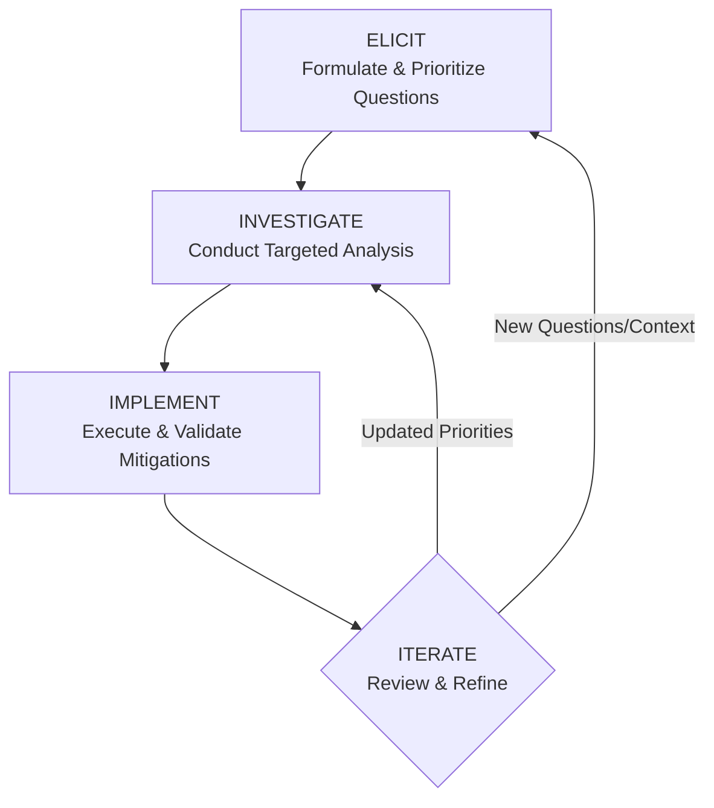

### Phase 1: ELICIT – Formulate & Prioritize Questions
This phase translates broad security objectives into a prioritized list of specific, actionable questions.

*   **Input:** Security objectives, threat intelligence reports, audit findings, risk assessment data, and incident post-mortems.
*   **Action:** Conduct brainstorming sessions to generate questions using interrogatives (What, How, Where, Which, Who, When). Focus on uncovering concrete operational unknowns that, once answered, will directly reduce risk. All questions are logged in a central, version-controlled **Question Register**.
*   **Prioritization:** Questions are scored and ranked using a consistent risk rubric. Factors include potential business impact, asset criticality, exploit likelihood, and regulatory implications.
*   **Output:** A prioritized list of specific, answerable security questions documented in the Question Register.

### Phase 2: INVESTIGATE – Conduct Targeted Analysis
This phase involves executing precise investigative actions to gather evidence that definitively answers the prioritized questions.

*   **Input:** The prioritized Question Register.
*   **Action:** Design and execute targeted analysis tailored to each question. The investigation method is matched to the question type, leveraging appropriate tools and data sources.
*   **Output:** Evidence-based answers documented in the Question Register, including detailed notes on data sources, methodologies, and confidence levels.

**Table: Mapping Question Types to Investigation Methods**

| Question Type | Example Question | Investigation Methods & Tools |
| :--- | :--- | :--- |
| **Asset & Data Discovery** | “Where does our most sensitive PII data reside across the hybrid cloud environment?” | Data discovery scans, Cloud Security Posture Management (CSPM) tools, data classification platform queries, application owner interviews. |
| **Threat Exposure** | “What is our exposure to the newly disclosed critical vulnerability in SoftwareX?” | Vulnerability scanner correlation with asset inventory, exploitability analysis, threat intelligence platform queries for active exploitation. |
| **Control Effectiveness** | “Are our endpoint detection rules effectively identifying the latest living-off-the-land techniques?” | SIEM/EDR query development, purple team exercises simulating specific TTPs, analysis of detection alert logs and false negatives. |
| **Process & Configuration** | “How are administrative credentials for our core network devices managed and audited?” | Configuration management database (CMDB) review, password vault log analysis, network device configuration audit scripts. |

### Phase 3: IMPLEMENT – Execute & Validate Mitigations
Answers from the INVESTIGATE phase are translated into concrete security actions, which are then deployed and rigorously validated.

*   **Input:** Validated answers and evidence from the INVESTIGATE phase.
*   **Action:** Design and deploy controls, process changes, or configuration updates that directly address the identified gap. Crucially, each action must be followed by a validation step to confirm the mitigation is effective as intended.
*   **Output:** Implemented security controls or process changes, with validation results documented and linked to the original question in the Register.

### Phase 4: ITERATE – Review & Refine
This phase closes the loop, using the outcomes of the cycle to refine the security program and feed the next iteration of inquiry.

*   **Input:** Implementation outcomes, new threat intelligence, changing business context, and emerging vulnerabilities.
*   **Action:** Review the entire Question Register. Generate new follow-up questions based on findings, re-prioritize existing unanswered questions, and archive or update resolved items. Formalize validated knowledge into policies, playbooks, or architectural standards.
*   **Output:** An updated and reprioritized Question Register, new objectives for the next ICD cycle, and updated organizational knowledge bases.

## 4. Production Integration & Strategic Benefits

Implementing ICD yields significant operational and strategic advantages by introducing focus, measurability, and adaptability into the security function.

*   **Eliminates Ambiguity and Enhances Focus:** By defining success as answering specific questions, ICD provides unambiguous direction for security teams. Efforts shift from "running tools" to "seeking answers," which dramatically reduces wasted effort and tool sprawl. Teams select the right tool for the specific question at hand, rather than managing tool outputs in search of a problem.
*   **Delivers Measurable, Auditable Progress:** Each answered question and its corresponding implemented mitigation represents a concrete unit of risk reduction. Progress is transparently tracked via the status of the Question Register, providing clear metrics for leadership reporting and audit demonstrations. This evidence-based approach builds credibility and justifies resource allocation.
*   **Ensures Optimal Resource Allocation:** The built-in, risk-based prioritization mechanism acts as a forcing function, ensuring that time, budget, and personnel are consistently applied to the organization's most pressing security unknowns. This leads to a higher return on security investment.
*   **Fosters Collaboration and Knowledge Retention:** The Question Register serves as a centralized repository of context, documenting what is known, what is being investigated, and why. This is invaluable for onboarding new team members, handing off tasks, providing audit trails, and ensuring institutional knowledge is preserved despite personnel changes.
*   **Builds an Inherently Adaptive Posture:** The framework is designed for change. New threats, such as a zero-day exploit, immediately generate high-priority questions (e.g., "Are our systems vulnerable?" and "Is our monitoring capable of detecting exploitation?"). Similarly, business initiatives like a new cloud deployment trigger relevant, proactive security inquiries from the outset.

## 5. Deployment Guidelines for Security Teams

Successful adoption of ICD is a gradual process that emphasizes cultural shift over tool procurement.

*   **Begin with a Pilot Project:** Start small to demonstrate value and refine the process. Ideal pilot candidates include a focused incident post-mortem, a cloud configuration review, or a targeted vulnerability assessment. Apply the full ICD workflow to this bounded scope.
*   **Formalize the Question Register:** Establish a single source of truth for tracking inquiries. This can start as a shared document or wiki but should ideally integrate with existing ticketing (e.g., Jira, ServiceNow) or project management systems to align with operational workflows. Key fields include Question, Owner, Priority, Status, Answer, Evidence, Action Taken, and Validation Result.
*   **Train Teams on Question Formulation:** The quality of the process is dictated by the quality of the questions. Conduct workshops to help teams transform vague concerns into specific, investigative queries. A strong question is actionable, scoped, and answerable through available data or analysis.
*   **Integrate with Existing Governance Processes:** ICD should not operate in a silo. Feed its outputs directly into established processes: use answered questions to update the risk register, turn implemented mitigations into change management tickets, and leverage findings for control gap assessments and audit preparation.
*   **Establish a Regular Review Cadence:** Institutionalize the ITERATE phase. Schedule recurring meetings (e.g., a weekly tactical review for operations teams, a monthly strategic review for leadership) dedicated to updating the Question Register, incorporating new intelligence, and assessing progress. This ensures ICD remains a living, dynamic process.

 

## Conclusion: Replacing Guesswork with Disciplined Inquiry

Inquiry-Driven Cyber Defense provides a resilient, evidence-based framework for modern security operations. In an era of escalating complexity and constant change, ICD offers a disciplined alternative to reactive guesswork and tool-centric fatigue. By systematically asking, "What do we not know?" and relentlessly pursuing the answers, security teams can focus their efforts, demonstrate clear value, and build a defense posture that is both robust and adaptable. Ultimately, ICD ensures that cybersecurity resources are transformed from a cost center into a strategic, risk-informed business function.

    

<h1 align="center">The Modern Cybersecurity Landscape: Offensive Tactics, Defensive Strategies, and Building Incident Resilience.</h1>
 
 

#### **PART I: OFFENSIVE SECURITY: ATTACK VECTORS AND EXPLOITATION**  
*Understanding Adversarial Methodologies*  
**1. Foundations of Cyber Offense**  
- 1.1 Ethical Hacking Principles  
- 1.2 Cyber Kill Chain & MITRE ATT&CK Framework  
- 1.3 Attacker Motives, Goals, and Classification  
- 1.4 Information Warfare and Adversarial TTPs  
- 1.5 Threat Hunting Fundamentals  

**2. Reconnaissance and Intelligence Gathering**  
- 2.1 Passive Reconnaissance:  
  - 2.1.1 DNS/WHOIS, Metadata, and Public Network Footprinting  
  - 2.1.2 Google Dorking, Shodan/Censys, and IoT Search Engines  
  - 2.1.3 Social Engineering Recon (Job Boards, Social Networks)  
  - 2.1.4 Dark Web and Geospatial Intelligence  
- 2.2 Active Scanning & Enumeration:  
  - 2.2.1 Host Discovery and Network Topology Mapping  
  - 2.2.2 Advanced Nmap Scans (Stealth, XMAS, UDP, IDLE/IPID)  
  - 2.2.3 Service Fingerprinting and OS Detection  
  - 2.2.4 Enumeration Techniques: SMB, SNMP, LDAP, SMTP  
  - 2.2.5 IDS/Firewall Evasion Tactics  

**3. Vulnerability Analysis and Exploitation**  
- 3.1 Vulnerability Assessment Lifecycle  
- 3.2 Vulnerability Classification and Scoring (CVSS)  
- 3.3 Exploitation Techniques:  
  - 3.3.1 Buffer Overflows and Memory Corruption  
  - 3.3.2 Password Attacks (Brute Force, Hash Cracking, Extraction)  
  - 3.3.3 Privilege Escalation (Windows/Linux)  
  - 3.3.4 Web-Specific Exploits: SQLi, XSS, CSRF, LFI/RFI  
- 3.4 Post-Exploitation:  
  - 3.4.1 Maintaining Access (Backdoors, RATs)  
  - 3.4.2 Steganography and Anti-Forensics  

**4. Advanced Attack Vectors**  
- 4.1 Malware Threats:  
  - 4.1.1 APTs, Trojans, Fileless Malware  
  - 4.1.2 Ransomware and Worm Propagation  
- 4.2 Network-Based Attacks:  
  - 4.2.1 Sniffing (ARP/DNS Poisoning, DHCP Spoofing)  
  - 4.2.2 DoS/DDoS (Volumetric, Protocol, Application Layer)  
  - 4.2.3 Session Hijacking (Network/Application Layer)  
- 4.3 Wireless and Edge Device Exploitation:  
  - 4.3.1 Wi-Fi Hacking (Evil Twin, Deauthentication)  
  - 4.3.2 IoT/OT Vulnerabilities and Attacks  

**5. Specialized Target Exploitation**  
- 5.1 Web Application Offense:  
  - 5.1.1 OWASP Top 10 (2023) and Web Shells  
  - 5.1.2 API/Webhook Abuse and IDOR  
- 5.2 Cloud and Container Attacks  
- 5.3 Mobile Platform Hacking (Android/iOS)  
- 5.4 Cryptography Offense:  
  - 5.4.1 Cryptographic Weaknesses  
  - 5.4.2 PKI Exploitation and Cryptanalysis  

---

#### **PART II: DEFENSIVE SECURITY: PROTECTION AND PREVENTION**  
*Building Cyber Resilience*  
**6. Cyber Defense Fundamentals**  
- 6.1 Security Architecture and Zero Trust  
- 6.2 Risk Management Lifecycle (NIST RMF)  
- 6.3 Security Standards: ISO 27001, NIST CSF, PCI-DSS  

**7. Proactive Threat Mitigation**  
- 7.1 Threat Intelligence (Strategic, Tactical, Operational)  
- 7.2 Threat Modeling (STRIDE, DREAD)  
- 7.3 Vulnerability Management and Patching  
- 7.4 Defense-in-Depth Strategies:  
  - 7.4.1 Next-Gen Firewalls and IDS/IPS  
  - 7.4.2 Honeypots and Deception Technologies  
  - 7.4.3 Secure Coding Practices  

**8. Cryptography and Access Defense**  
- 8.1 Cryptographic Protocols and PKI Design  
- 8.2 Authentication Mechanisms (MFA, SAML, OAuth)  
- 8.3 Password Policies and Secrets Management  

**9. AI and Automation in Defense**  
- 9.1 Machine Learning for Anomaly Detection  
- 9.2 SOAR (Security Orchestration, Automation, Response)  

---

#### **PART III: INCIDENT RESPONSE AND RESILIENCE**  
*Detection, Response, and Recovery*  
**10. Incident Management Frameworks**  
- 10.1 NIST SP 800-61 and SANS PICERL Model  
- 10.2 Legal Compliance (GDPR, HIPAA, CCPA)  
- 10.3 Incident Response Team (IRT) Structuring  

**11. Incident Response Lifecycle**  
- 11.1 Preparation: Policies, Tools, and IR Plans  
- 11.2 Detection & Triage:  
  - 11.2.1 SIEM and Log Analysis  
  - 11.2.2 Threat Hunting in Live Environments  
- 11.3 Containment Strategies:  
  - 11.3.1 Network Segmentation  
  - 11.3.2 Malware Quarantine  
- 11.4 Eradication and Recovery:  
  - 11.4.1 Root Cause Analysis  
  - 11.4.2 System Restoration and Backups  
- 11.5 Post-Incident Activities:  
  - 11.5.1 Forensic Reporting  
  - 11.5.2 Lessons Learned and Improvement  

**12. Digital Forensics and Evidence Handling**  
- 12.1 Forensic Readiness Planning  
- 12.2 Data Acquisition:  
  - 12.2.1 Volatile Memory Analysis (Windows/Linux)  
  - 12.2.2 Disk Imaging and Anti-Forensics Detection  
- 12.3 Forensic Tools: Autopsy, FTK, OSForensics  

**13. Sector-Specific Incident Handling**  
- 13.1 Malware Outbreak Response  
- 13.2 Network Security Incidents (DDoS, Unauthorized Access)  
- 13.3 Web Application Breaches (SQLi, XSS, Defacement)  
- 13.4 Cloud and Insider Threat Incidents  
- 13.5 Email Compromise (Phishing, BEC)  

**14. Hands-On Cyber Operations**  
- 14.1 Volatile Evidence Collection: Windows/Linux  
- 14.2 Network Analysis: Wireshark, Suricata, Zeek  
- 14.3 Malware Analysis: Sandboxing and Reverse Engineering  
- 14.4 Web Attack Simulations: SQLMap, Burp Suite  
- 14.5 Cloud Security Tools: AWS GuardDuty, Azure Sentinel  

 
 
## Part I: Understanding the Adversary - Offensive Security Methodologies

To build an effective defense, one must first understand the offense. This section deconstructs the attacker's lifecycle, tools, and techniques, providing insight into modern exploitation methodologies.

### 1.1 Foundations of Cyber Offense and Adversarial Thinking
Offensive security, when conducted ethically, is a proactive discipline aimed at discovering vulnerabilities before malicious actors do. It is governed by structured frameworks and a deep understanding of adversary behavior.

*   **Ethical Hacking Principles** establish the legal and moral boundaries for security testing, requiring explicit authorization, defined scope, and responsible disclosure of findings. This practice, often termed penetration testing or red teaming, is not about causing harm but about identifying weaknesses in confidentiality, integrity, and availability from an attacker's perspective to bolster defenses.
*   **The Cyber Kill Chain®** and **MITRE ATT&CK®** are indispensable frameworks for modeling intrusions. The Kill Chain outlines the sequential stages of an attack from reconnaissance to action on objectives, while MITRE ATT&CK provides a granular, real-world knowledge base of adversary tactics and techniques, enabling more specific threat modeling and detection engineering.
*   **Attacker Classification** ranges from script kiddies using pre-packaged tools to highly resourced nation-state Advanced Persistent Threats (APTs). Motives span financial gain (ransomware, credential theft), espionage (corporate or state secrets), hacktivism (ideologically driven disruption), and simple vandalism, each requiring different defensive postures.
*   **Threat Hunting** is a proactive, hypothesis-driven search for adversaries already within the network, moving beyond automated alerts. It leverages knowledge of TTPs (Tactics, Techniques, and Procedures) to uncover stealthy activities that evade traditional security controls.

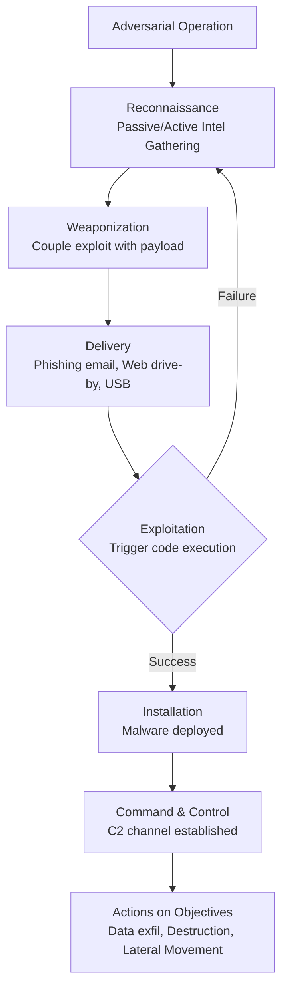

### 1.2 Reconnaissance and Weaponization: The Attack Commences
Before any exploit is launched, adversaries invest significant effort in understanding their target. This phase is critical for a successful defense, as early detection here can prevent the entire attack chain.

*   **Passive Reconnaissance** involves gathering information from publicly available sources without directly interacting with the target's systems. This includes DNS history and WHOIS records, harvesting metadata from public documents, using advanced search techniques (Google Dorking), and scanning for exposed devices via platforms like Shodan. Social media and professional networks like LinkedIn are also mined for technical details and potential phishing targets.
*   **Active Scanning & Enumeration** entails direct engagement with the target's infrastructure to map its attack surface. Using tools like Nmap, adversaries perform host discovery, service fingerprinting, and operating system detection. They enumerate specific services (SMB for network shares, SNMP for device info, LDAP for directory services) to identify software versions, user accounts, and misconfigurations that can be leveraged for initial access.
*   **Vulnerability Analysis** follows enumeration, where identified services are checked against known vulnerability databases. Adversaries prioritize targets using the Common Vulnerability Scoring System (CVSS), focusing on high-severity flaws that offer reliable exploitation paths, such as unpatched remote code execution (RCE) vulnerabilities or default credentials on internet-facing systems.

### 1.3 Exploitation and Post-Exploitation: Gaining and Maintaining Access
Once a vulnerability is identified, the adversary moves to exploit it, gain a foothold, and expand their control within the environment.

*   **Core Exploitation Techniques** vary by target but include classics like buffer overflows (corrupting memory to execute arbitrary code), password attacks (brute-forcing, credential stuffing, or dumping hashes for offline cracking), and privilege escalation to gain SYSTEM or root-level access. Web-specific attacks like SQL Injection (SQLi), Cross-Site Scripting (XSS), and Cross-Site Request Forgery (CSRF) remain prevalent due to complex web architectures.
*   **Post-Exploitation** begins once initial access is achieved. The primary goals are to maintain persistence, evade detection, and move laterally. This involves installing backdoors or remote access trojans (RATs), employing living-off-the-land binaries (LOLBins) to blend in with normal activity, harvesting credentials from memory and storage, and pivoting to other systems on the network to locate and exfiltrate valuable data.
*   **Advanced Attack Vectors** include sophisticated malware like fileless malware that resides only in memory, ransomware that encrypts data for extortion, and network-based attacks such as ARP poisoning for man-in-the-middle positions or sophisticated Distributed Denial of Service (DDoS) attacks to overwhelm services. Wireless and IoT/OT devices present unique, often poorly secured, entry points into corporate and industrial networks.

### 1.4 Key Offensive Security Frameworks and Classifications
The following table summarizes core frameworks and vulnerability classifications used to understand and categorize attacks.

| Framework/Standard | Primary Purpose | Key Components/Structure |
| :--- | :--- | :--- |
| **MITRE ATT&CK®** | Knowledge base of real-world adversary TTPs | 14 Tactical Stages (e.g., Initial Access, Execution, Persistence, Lateral Movement) with detailed Techniques and Sub-techniques. |
| **Cyber Kill Chain®** | Model for describing stages of a cyber attack | 7 Linear Stages: Recon, Weaponization, Delivery, Exploitation, Installation, C2, Actions on Objectives. |
| **OWASP Top 10** | Awareness document for critical web app risks | Categorized list (e.g., A01: Broken Access Control, A03: Injection, A07: Identification & Auth Failures) with remediation guidance. |
| **CVSS (v3.1)** | Standard for scoring IT vulnerability severity | Scores 0.0-10.0 based on Base (intrinsic qualities), Temporal (state over time), and Environmental (org-specific) metrics. |

***

## Part II: Building the Fortress - Defensive Security Strategies

A robust defense is multi-layered, proactive, and integrated across people, processes, and technology. This section outlines the strategies and controls necessary to prevent, detect, and mitigate attacks.

### 2.1 Foundational Defense: Architecture and Governance
Effective cybersecurity begins with a strong foundation built on sound architecture, risk management, and governance.

*   **Zero Trust Architecture** operates on the principle of "never trust, always verify." It assumes breach and eliminates implicit trust by enforcing strict identity verification for every person and device attempting to access resources, whether inside or outside the network perimeter. Micro-segmentation is a key component, limiting lateral movement.
*   **Risk Management** is a continuous lifecycle of identifying, assessing, and prioritizing risks followed by applying resources to minimize or control the probability of their occurrence. Frameworks like the NIST Risk Management Framework (RMF) provide a structured process to manage security and privacy risk, ensuring compliance and aligning security efforts with business objectives.
*   **Security Standards & Compliance** provide established baselines for security programs. Standards like ISO 27001 offer a comprehensive set of information security management controls, while the NIST Cybersecurity Framework (CSF) provides a risk-based approach to managing cybersecurity. Industry-specific regulations like PCI-DSS and HIPAA define mandatory protections for payment card and healthcare data, respectively.

### 2.2 Proactive Threat Mitigation and Defense-in-Depth
Preventing incidents requires a proactive stance that anticipates threats and layers defenses to protect critical assets.

*   **Threat Intelligence** involves collecting and analyzing information about current and emerging threats. Strategic intelligence informs high-level decision-making, tactical intelligence focuses on adversary TTPs for defensive tuning, and operational intelligence provides specific indicators (IPs, domains, hashes) for blocking. Integrating this intelligence into security tools is crucial for proactive defense.
*   **Threat Modeling** is a structured process to identify and prioritize potential threats to a system. Methodologies like STRIDE (Spoofing, Tampering, Repudiation, Information Disclosure, Denial of Service, Elevation of Privilege) help teams systematically think like an attacker during the design phase, enabling the implementation of security controls by design rather than as an afterthought.
*   **Vulnerability Management** is a continuous cycle of identifying, evaluating, treating, and reporting on security vulnerabilities in systems and software. It goes beyond periodic scanning to include risk-based prioritization (using CVSS and organizational context), timely patching, and compensating controls for vulnerabilities that cannot be immediately remediated.
*   **Defense-in-Depth** implements multiple, redundant layers of security controls so that if one layer fails, another will stop the attack. This architecture includes perimeter defenses (Next-Gen Firewalls, IDS/IPS), network segmentation, endpoint detection and response (EDR), application controls, data encryption, and user training. Deception technologies, like honeypots, add an active layer to detect and study attacker behavior.

### 2.3 Core Security Controls: Cryptography and Access Management
Protecting data and controlling access are cornerstone defensive activities that rely on proven cryptographic and identity management principles.

*   **Cryptographic Protocols and PKI** are essential for ensuring data confidentiality, integrity, and authenticity. Defenders must implement strong, up-to-date protocols (e.g., TLS 1.3, AES-256) and properly manage Public Key Infrastructure (PKI) for digital certificates, which underpin secure web browsing, email, code signing, and digital signatures. Weak or misconfigured cryptography is a critical failure point.
*   **Authentication and Access Control** mechanisms must evolve beyond simple passwords. Multi-Factor Authentication (MFA) is non-negotiable for all user access, significantly reducing the risk of credential-based attacks. Implementing robust identity federation protocols (SAML, OAuth 2.0) and principle of least privilege ensures users and systems have only the minimum access necessary to perform their functions. Centralized secrets management is vital for securing application credentials and API keys.

### 2.4 The Role of AI and Automation in Modern Defense
The scale and speed of modern threats necessitate intelligent automation to augment human security teams.

*   **Machine Learning for Anomaly Detection** excels at identifying subtle, previously unknown threats by establishing behavioral baselines for users, devices, and network traffic. ML models can detect deviations indicative of compromised accounts, insider threats, or novel malware that signature-based tools miss, though they require careful tuning to minimize false positives.
*   **Security Orchestration, Automation, and Response (SOAR)** platforms integrate disparate security tools and automate repetitive, labor-intensive tasks. Playbooks can automatically triage alerts, enrich data with threat intelligence, contain compromised hosts by isolating them from the network, and initiate incident response workflows, allowing human analysts to focus on complex investigation and strategic tasks.

***

## Part III: Assuming Breach - Incident Response and Organizational Resilience

No defense is impenetrable. Resilience is defined not by the absence of incidents, but by the ability to rapidly detect, respond, contain, recover, and learn from them.

### 3.1 Incident Management Preparedness
An effective response is planned long before an incident occurs. Preparation involves establishing clear frameworks, teams, and legal understandings.

*   **Incident Response Frameworks** like the NIST SP 800-61 and the SANS PICERL (Preparation, Identification, Containment, Eradication, Recovery, Lessons Learned) model provide proven, step-by-step methodologies for handling security breaches. They ensure a consistent, thorough, and effective response, reducing chaos and dwell time.
*   **Legal and Compliance Considerations** are critical during and after an incident. Response activities must adhere to data breach notification laws (GDPR, CCPA, state laws), data preservation requirements for potential litigation, and regulations governing specific data types (e.g., HIPAA for PHI, PCI-DSS for card data). Involving legal counsel early in the IR process is mandatory.
*   **Incident Response Team (IRT) Structuring** involves defining clear roles and responsibilities for a cross-functional team. This includes a lead/commander, forensic investigators, IT engineers for containment, communications specialists for internal and external messaging, and legal representatives. Regular tabletop exercises are essential to keep the team prepared and processes refined.

### 3.2 The Incident Response Lifecycle in Action
When an incident is declared, a structured lifecycle guides the response from detection to resolution and improvement.

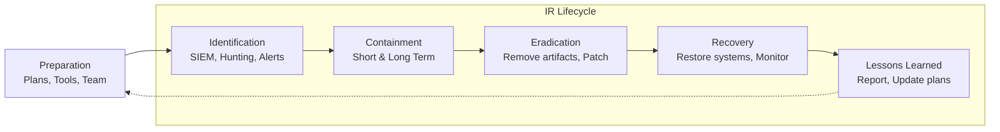

*   **Preparation** is the continuous phase where IR plans are written and tested, communication channels are established, and necessary tools (forensic kits, analysis workstations, documentation systems) are provisioned and maintained. This phase determines the speed and effectiveness of the actual response.
*   **Detection & Triage** involves identifying potential security events from alerts, logs, user reports, or threat hunts and quickly determining their validity and severity. Security Information and Event Management (SIEM) systems are central, aggregating and correlating logs from across the enterprise to provide visibility and context for analysis.
*   **Containment, Eradication & Recovery** aim to limit damage, remove the threat, and restore normal operations. Short-term containment may involve taking a system offline, while long-term containment applies system patches and blocks malicious IPs. Eradication requires removing all traces of the adversary (malware, backdoors). Recovery involves carefully restoring systems from clean backups, validating their integrity, and monitoring for re-infection.
*   **Post-Incident Activity** is arguably the most critical phase for long-term resilience. A thorough lessons-learned review analyzes what happened, what was done well, and what needs improvement. This informs updates to IR plans, security controls, and policies. A formal forensic report details the timeline, impact, root cause, and corrective actions for stakeholders and legal requirements.

### 3.3 Digital Forensics and Evidence Handling
Forensics provides the "what, when, and how" of an incident, supporting eradication, legal action, and organizational learning.

*   **Forensic Readiness** involves preparing the organization to collect evidence effectively by ensuring appropriate logging is enabled and retained, defining evidence handling procedures, and training staff on the importance of preserving volatile data. This preparation is key to a successful investigation.
*   **Data Acquisition** follows a strict order of volatility, capturing the most transient data first. This includes RAM (for running processes, network connections, and unencrypted secrets) before moving to disk images, network device logs, and finally archival backup data. A forensically sound chain of custody must be maintained for any evidence that may be used in legal proceedings.
*   **Analysis and Tools** use specialized software to reconstruct events. Memory analysis tools (Volatility, Rekall) extract artifacts from RAM dumps. Disk forensic suites (Autopsy, FTK, X-Ways) allow examiners to analyze file systems, recover deleted files, and search for specific indicators of compromise (IOCs) across large datasets.

### 3.4 Essential Tools for Incident Response and Forensic Analysis
The following table categorizes key tool types used during the response and forensic investigation phases.

| Tool Category | Purpose | Common Examples |
| :--- | :--- | :--- |
| **SIEM & Analytics** | Centralized log aggregation, correlation, and alerting. | Splunk, Microsoft Sentinel, IBM QRadar, Elastic SIEM. |
| **Endpoint Detection & Response (EDR)** | Monitor endpoints for malicious activity, enable investigation/response. | CrowdStrike Falcon, Microsoft Defender for Endpoint, SentinelOne. |
| **Network Traffic Analysis** | Capture, analyze, and inspect network packets for threats. | Wireshark, Zeek (Bro), Suricata, Corelight. |
| **Digital Forensics** | Acquire and analyze data from disks, memory, and mobile devices. | Autopsy (free), FTK, X-Ways Forensics, Volatility Framework. |
| **Vulnerability & Exploitation** | Scan for vulnerabilities and simulate attacks (used responsibly). | Nessus, Qualys, Metasploit, Burp Suite, SQLMap. |

### 3.5 Building Continuous Resilience
Ultimately, cybersecurity is an ongoing cycle of preparation, defense, response, and adaptation. By understanding the adversary's playbook, implementing a layered, intelligent defense, and preparing to respond swiftly and effectively, organizations can transform their security posture from reactive to resilient, capable of operating securely in the face of continuous threats.

    

<h1 align="center">The Cybersecurity Professional's Guide: Domains, Specializations, and Career Pathways.</h1>
 
 

## Executive Summary

Cybersecurity is a multidimensional discipline dedicated to protecting systems, networks, data, and programs from digital attacks. As the threat landscape grows in complexity, the field has evolved into a diverse ecosystem of interconnected specializations. This guide provides a structured overview of the core and emerging subdivisions within cybersecurity, offering clarity for organizations building security teams and for professionals navigating their career trajectories. A holistic cybersecurity strategy integrates these domains to create a resilient, defense-in-depth posture.

## 1. Foundational Security Disciplines

These domains represent the primary pillars upon which most security programs are built, divided by their fundamental approach to the security mission.

### 1.1 Offensive Security (Red Team)
*   Offensive security involves proactively simulating real-world adversarial attacks on an organization's systems, networks, and personnel to identify and validate security weaknesses. Practitioners, known as Red Teamers or Ethical Hackers, employ the same tactics, techniques, and procedures (TTPs) as malicious actors, but under strict, authorized conditions. Their primary objective is to uncover vulnerabilities from an external threat perspective before they can be exploited maliciously, providing tangible evidence of risk. Activities include penetration testing, vulnerability assessments, social engineering campaigns, and physical security bypass attempts. The findings are crucial for prioritizing remediation efforts, validating defensive controls, and enhancing the overall security posture by shifting the mindset from theoretical vulnerability to proven exploitability.

### 1.2 Defensive Security (Blue Team)
*   Defensive security encompasses the architecture, implementation, and ongoing operation of controls designed to protect information assets and detect malicious activity. Blue Teams are responsible for defending the organization's digital estate, focusing on prevention, detection, and response. This involves deploying and managing security infrastructure like firewalls, intrusion detection/prevention systems (IDS/IPS), and security information and event management (SIEM) platforms. Their daily duties include continuous monitoring of network traffic and logs, analyzing alerts, hardening systems, and responding to incidents escalated by the Security Operations Center (SOC). The Blue Team's success is measured by their ability to reduce the organization's attack surface, maintain system integrity, and contain breaches swiftly, forming the essential backbone of any cybersecurity program.

### 1.3 Security Operations Center (SOC)
*   The Security Operations Center (SOC) functions as the organization's centralized, 24/7 nerve center for cybersecurity monitoring and incident triage. SOC analysts operate on the front lines, utilizing a suite of monitoring tools to scrutinize network flows, endpoint behaviors, and application logs for indicators of compromise (IOCs). Their workflow is tiered, with Level 1 analysts performing initial alert triage and filtering out false positives, while Level 2 and 3 analysts conduct deeper investigation, threat hunting, and incident analysis. The SOC’s critical outputs include timely detection of security events, initial containment actions, and detailed incident reports that feed into the broader incident response process. Its effectiveness hinges on well-defined procedures, advanced analytics, and seamless integration with both IT and security teams.

## 2. Technical Security Domains

These specializations focus on securing specific technological layers within an organization's infrastructure, from the network perimeter to individual applications and data.

### 2.1 Network Security
*   Network security is dedicated to protecting the integrity, confidentiality, and availability of data as it traverses or resides on network infrastructure. It involves securing all network-accessible assets, including routers, switches, firewalls, wireless access points, and the data itself. Practitioners design and enforce security policies through technologies such as next-generation firewalls (NGFWs), virtual private networks (VPNs), network segmentation, intrusion prevention systems, and secure network protocols (e.g., TLS, DNSSEC). The core goal is to prevent unauthorized access, block malicious traffic, and segment network zones to limit lateral movement by attackers, ensuring that the network itself becomes a robust barrier against intrusion and data exfiltration attempts.

### 2.2 Endpoint Security
*   Endpoint security focuses on securing every device that connects to the corporate network, including desktops, laptops, servers, smartphones, and IoT devices. As the traditional perimeter dissolves, endpoints have become prime targets for attackers. This domain involves deploying and managing advanced protection mechanisms such as Endpoint Detection and Response (EDR) or Extended Detection and Response (XDR) platforms, antivirus/anti-malware software, host-based firewalls, disk encryption, and application whitelisting. Modern endpoint security strategies emphasize continuous monitoring and behavioral analysis on the device itself to detect, investigate, and automatically respond to suspicious activities, thereby protecting critical entry points into the enterprise environment.

### 2.3 Cloud Security
*   Cloud security is the practice of safeguarding data, applications, and infrastructure hosted in cloud environments (public, private, or hybrid). This specialization addresses the unique security challenges of cloud computing, such as shared responsibility models, identity federation, and ephemeral workloads. Key activities include configuring secure cloud architectures, managing cloud-native security tools (like Cloud Security Posture Management - CSPM), ensuring data encryption in transit and at rest, and maintaining compliance across decentralized assets. Cloud security professionals must be proficient in the security controls of major platforms like AWS, Azure, and GCP, and understand how to adapt traditional security principles to a dynamic, API-driven environment.

### 2.4 Application Security (AppSec)
*   Application security integrates security practices directly into the software development lifecycle (SDLC) to identify, fix, and prevent vulnerabilities in applications. AppSec shifts security "left," meaning it is addressed early in the development process rather than as an afterthought. Techniques include static application security testing (SAST), dynamic application security testing (DAST), software composition analysis (SCA) for third-party libraries, interactive application security testing (IAST), and secure code reviews. The objective is to build security into the fabric of the application itself, reducing the risk of exploits stemming from common vulnerabilities like those listed in the OWASP Top Ten, such as injection flaws, broken authentication, and sensitive data exposure.

### 2.5 Industrial Control Systems (ICS) & Operational Technology (OT) Security
*   ICS/OT security is a critical specialization focused on protecting the hardware and software used to monitor and control physical industrial processes in sectors like energy, water treatment, manufacturing, and transportation. Unlike traditional IT systems, OT systems prioritize safety and operational continuity, often running on legacy platforms not designed for modern connectivity. Securing these environments involves understanding proprietary protocols, implementing air-gapped or deeply segmented networks, deploying specialized anomaly detection, and managing the convergence of IT and OT networks. The stakes are exceptionally high, as a successful cyber-attack can lead to physical damage, environmental harm, and threats to public safety.

## 3. Strategic, Governance, and Support Functions

These areas provide the framework, policies, and human-centric elements necessary for a mature, compliant, and resilient security program.

### 3.1 Identity and Access Management (IAM)
*   Identity and Access Management (IAM) is the security discipline that ensures the right individuals have the appropriate access to technology resources at the right times and for the right reasons. It is a fundamental control plane for enforcing security policy and is often described as the "new perimeter." IAM frameworks encompass user provisioning/deprovisioning, multi-factor authentication (MFA), single sign-on (SSO), privileged access management (PAM), and role-based access control (RBAC). By rigorously managing digital identities and their privileges, IAM significantly reduces the risk of unauthorized access, insider threats, and credential-based attacks, forming the cornerstone of a zero-trust security model.

### 3.2 Security Compliance, Governance, and Risk Management
*   This triad forms the strategic backbone of a cybersecurity program, aligning security initiatives with business objectives and regulatory requirements. **Governance** involves defining policies, standards, and procedures. **Risk Management** is the continuous process of identifying, assessing, and prioritizing risks to information assets, followed by applying resources to mitigate or accept those risks. **Compliance** ensures adherence to internal policies and external regulations (like GDPR, HIPAA, PCI-DSS). Professionals in this domain conduct audits, manage risk registers, develop governance frameworks, and translate complex regulatory mandates into actionable security controls, thereby protecting the organization from both cyber threats and legal/financial repercussions.

### 3.3 Digital Forensics and Incident Response (DFIR)
*   Digital Forensics and Incident Response (DFIR) combines the investigative techniques of forensics with the structured action of incident response. When a security breach occurs, DFIR specialists are tasked with containing the threat, eradicating the attacker's presence, and recovering systems. Concurrently, they perform forensic analysis to determine the root cause, scope of impact, attacker methodology, and to collect evidence for potential legal action. This involves meticulous evidence preservation, memory and disk analysis, malware reverse-engineering, and timeline reconstruction. Their work is critical not only for recovery but also for learning from incidents to prevent future breaches and, if necessary, supporting law enforcement investigations.

### 3.4 Data Privacy and Protection
*   Data privacy focuses on the proper handling, processing, storage, and sharing of personal and sensitive information in accordance with legal frameworks and ethical standards. This specialization has surged in importance with regulations like the GDPR and CCPA. Data privacy professionals work to classify data, map data flows, implement data loss prevention (DLP) tools, manage data subject access requests (DSARs), and ensure that data collection and usage practices are transparent and lawful. Their role sits at the intersection of legal, technical, and business units, translating privacy principles into technical controls and organizational policies to build trust and avoid substantial regulatory fines.

### 3.5 Security Awareness, Training, and Culture
*   This human-centric specialization aims to transform employees from a potential security vulnerability into the first line of defense. It involves designing and delivering engaging training programs that educate staff on threats like phishing, social engineering, and secure handling of data. Effective programs go beyond annual compliance videos to include simulated phishing exercises, role-based training, and clear reporting channels for suspicious activity. The ultimate goal is to foster a sustainable culture of security mindfulness where safe digital practices become instinctive, thereby significantly reducing the risk surface associated with human error.

## 4. Emerging and Cross-Functional Specializations

These areas represent the evolving frontier of cybersecurity, often blending existing domains with new methodologies or technologies.

### 4.1 Threat Intelligence
*   Threat intelligence is the process of collecting, analyzing, and contextualizing information about existing and emerging threats to inform security decisions. It transforms raw data on adversary TTPs, indicators of compromise (IOCs), and campaigns into actionable intelligence. This field is divided into strategic (high-level trends for leadership), tactical (technical details for defenders), and operational (specific impending attacks) intelligence. Effective threat intelligence allows organizations to proactively adjust their defenses, prioritize patching, and understand the motives and capabilities of relevant threat actors, moving from a reactive to a predictive security stance.

### 4.2 Vulnerability Management
*   Vulnerability management is the cyclical practice of identifying, classifying, prioritizing, remediating, and mitigating software and hardware vulnerabilities. It is a foundational risk reduction program that relies on automated scanning tools, threat intelligence feeds, and asset inventories. The core challenge is not merely finding vulnerabilities but effectively prioritizing them based on severity, exploitability, and the criticality of the affected asset. This specialization requires close collaboration with IT and development teams to orchestrate patch deployment, configuration changes, or other compensating controls, ensuring that the most critical security gaps are addressed promptly.

### 4.3 DevSecOps
*   DevSecOps is the cultural and technical integration of security practices into the DevOps pipeline. It advocates for "shifting security left" and making it a shared responsibility of development, operations, and security teams. This is achieved by automating security checks—such as SAST, DAST, and container scanning—within the continuous integration/continuous delivery (CI/CD) workflow. The goal is to enable rapid, agile development while embedding security seamlessly, thereby producing more secure code, reducing the cost of fixing vulnerabilities late in the cycle, and maintaining development velocity without compromising on security posture.

### 4.4 Cryptography
*   Cryptography is the mathematical foundation of information security, providing techniques for securing data confidentiality, integrity, authenticity, and non-repudiation. Specialists in this domain design, implement, and review cryptographic systems, including encryption algorithms (e.g., AES, RSA), hash functions, digital signatures, and key management protocols. Their work is essential for protecting data at rest (e.g., encrypted databases), in transit (e.g., TLS for web traffic), and during authentication. As quantum computing advances, post-quantum cryptography is becoming a vital sub-specialty, focusing on algorithms resistant to quantum attacks.

## Career Pathway Visualization

The following flowchart illustrates a potential progression through various cybersecurity specializations:

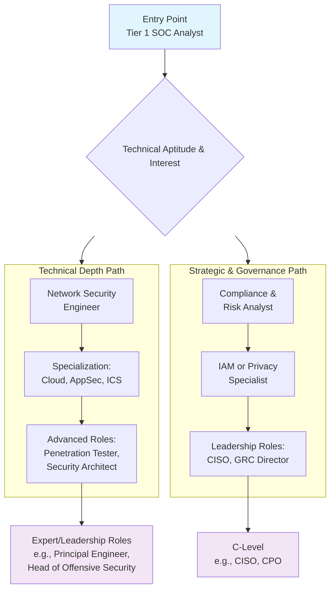

## Functional Team Comparison

| Team / Function | Primary Mission | Key Activities | Outcome Delivered |
| :--- | :--- | :--- | :--- |
| **Red Team** | Simulate adversaries to test defenses. | Penetration testing, social engineering, physical breach attempts, purple team exercises. | Real-world assessment of security posture, validation of detection/response, prioritized remediation roadmap. |
| **Blue Team** | Defend assets and maintain operational security. | Security architecture, system hardening, alert tuning, threat hunting, incident response support. | Reduced attack surface, improved defensive controls, contained security incidents. |
| **SOC** | 24/7 monitoring and initial incident triage. | Alert analysis, log investigation, IOC searches, initial containment actions. | Early threat detection, reduced dwell time, escalation of validated incidents. |
| **DFIR** | Investigate incidents and lead response. | Forensic evidence collection, malware analysis, root cause determination, remediation oversight. | Incident eradication, recovery, lessons learned, legal evidence. |
| **GRC** | Manage risk and ensure compliance. | Policy development, risk assessments, control audits, regulatory gap analysis. | Defined security framework, managed risk register, passed audits, regulatory compliance. |

## Conclusion

The cybersecurity landscape is not monolithic but a tapestry of interconnected specializations, each vital to a comprehensive defense strategy. From the proactive rigor of offensive security to the strategic oversight of governance and the emerging practices of DevSecOps, each domain addresses unique aspects of modern digital risk. For organizations, understanding these subdivisions is key to building balanced and effective teams. For professionals, it provides a map to navigate a rewarding career, allowing for deep technical mastery or broad strategic leadership. As threats continue to evolve, so too will these specializations, demanding continuous learning and adaptation to secure our digital future.

    

<h1 align="center">The Cybersecurity Team Spectrum: Understanding Red, Blue, Purple, and Beyond.</h1>

 

## **Executive Overview**

In today’s dynamic threat landscape, a singular, monolithic security team is insufficient. Modern cyber defense requires a diverse ecosystem of specialized teams, each with distinct missions, mindsets, and methodologies. This framework, often color-coded, transforms cybersecurity from a passive, defensive posture into a proactive, intelligence-driven, and continuously improving discipline. At its core, the adversarial relationship between **Red Teams** (attack simulators) and **Blue Teams** (defenders) is harmonized through **Purple Teaming** (collaborative analysis). Surrounding this nucleus are specialized teams—Yellow, Green, Orange, White, and more—that build security into every layer of the organization, from code development to physical access. This document provides a comprehensive analysis of these teams, detailing their functions, interactions, and the integrated strategy required to build a mature, resilient cybersecurity program.

## **1. Foundational Teams: The Core Adversarial Cycle**

The cybersecurity color wheel originates from military exercises, establishing a continuous cycle of testing and improvement that is critical for organizational resilience.

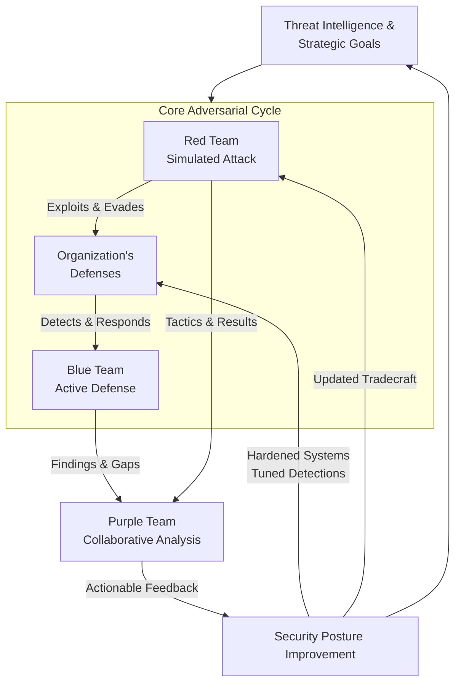

### **1.1 Red Team: The Authorized Adversaries**

The Red Team operates under strict rules of engagement to simulate real-world adversaries, providing the ultimate test of an organization's people, processes, and technology.

*   **Core Mission & Mindset:** To adopt the perspective of a malicious actor (e.g., cybercriminal, state-sponsored threat group) and attempt to breach defenses by any means within the agreed scope. Their mindset is one of creativity, stealth, and persistence, focusing not on checklist compliance but on achieving specific, mission-oriented goals such as exfiltrating sensitive data or compromising a critical system. Success is measured by the ability to evade detection, achieve objectives, and provide a realistic assessment of security readiness.
*   **Key Activities & Techniques:** Operations are methodical, often following frameworks like the MITRE ATT&CK® matrix. Activities begin with extensive reconnaissance and open-source intelligence (OSINT) gathering. This is followed by initial access attempts via sophisticated phishing, exploitation of public-facing applications, or physical security tests. Once inside, they focus on establishing persistence, escalating privileges, moving laterally across the network, and finally executing their objective, all while employing advanced evasion techniques to avoid Blue Team detection.
*   **Primary Output:** The deliverable is not merely a list of vulnerabilities, but a narrative-driven report detailing the attack path, the effectiveness of existing controls, detection gaps, and the potential business impact. This provides leadership with a clear, actionable story of how a real attacker could navigate their environment.

### **1.2 Blue Team: The Defensive Guardians**

The Blue Team is responsible for constructing, maintaining, and actively defending the organization's security perimeter and internal infrastructure.

*   **Core Mission & Mindset:** To protect the confidentiality, integrity, and availability of organizational assets. Their mindset is defensive, procedural, and resilient, focused on risk reduction, maintaining business continuity, and continuous monitoring. They operate under the assumption that breaches will occur and therefore prioritize rapid detection, response, and recovery. Their success is quantified by metrics like Mean Time to Detect (MTTD), Mean Time to Respond (MTTR), and the reduction of successful attack impact.
*   **Key Activities & Techniques:** Defense is layered, starting with preventative controls like system hardening, patch management, and secure configuration. The core of their operation is continuous monitoring via Security Information and Event Management (SIEM) systems, Endpoint Detection and Response (EDR) tools, and network traffic analysis. They develop and tune detection rules, often aligned with threat intelligence and the MITRE ATT&CK framework. When an alert triggers, they execute a formal Incident Response (IR) plan, containing the threat, eradicating it, and leading recovery efforts.
*   **Primary Output:** A stable, monitored, and resilient security posture. Outputs include operational security alerts, incident reports, forensic analyses, and improvements to security policies and tool configurations based on lessons learned from both real incidents and Red Team exercises.

### **1.3 Purple Team: The Collaborative Force Multiplier**

Purple Teaming is a function or process, not necessarily a permanent team. It represents the critical collaboration between Red and Blue to maximize learning and systemic improvement.

*   **Core Mission & Mindset:** To break down silos and ensure the adversarial cycle directly translates into stronger defenses. The Purple mindset is one of translation, collaboration, and shared goals. They facilitate the conversion of Red Team findings into actionable Blue Team detection rules and security controls, and help the Red Team understand defensive capabilities to create more challenging tests.
*   **Key Activities & Techniques:** Purple Team activities involve planning and overseeing controlled exercises where Red and Blue teams operate in a tightly coupled feedback loop. This may involve the Red Team executing a specific technique while the Blue Team observes in real-time to fine-tune their sensors. They conduct joint workshops to analyze attack data, create new detection analytics, and prioritize remediation efforts based on actual risk, not theoretical vulnerabilities.
*   **Primary Output:** The primary output is a measurable enhancement in security efficacy. This includes validated and improved detection capabilities, reduced dwell-time metrics, updated IR playbooks, and a culture of shared knowledge that elevates the skill level of both offensive and defensive practitioners.

## **2. The Extended Spectrum: Specialized Security Functions**

Beyond the core triad, a mature security program encompasses specialized teams that integrate security throughout the organization's lifecycle and structure.

| Team Color | Core Function | Primary Mission & Key Activities |
| :--- | :--- | :--- |
| **Yellow Team** | **Security-First Development** | Builds security into software from inception. Activities include secure code training for developers, integrating Static/Dynamic Application Security Testing (SAST/DAST) into CI/CD pipelines, developing secure libraries, and championing DevSecOps practices to shift security left. |
| **Green Team** | **Security Engineering & Architecture** | Designs and implements the secure foundation of systems and networks. They develop security reference architectures, evaluate and deploy security technologies (firewalls, IDS/IPS), ensure secure cloud configuration, and are responsible for the technical design of preventative controls. |
| **Orange Team** | **Security Awareness & Culture** | Manages human risk by transforming the employee from the "weakest link" into a resilient first line of defense. They create engaging training content, run phishing simulation campaigns, promote security champions programs, and measure improvements in security culture across the organization. |
| **White Team** | **Exercise Oversight & Governance** | Acts as referees and planners during security exercises. They define the rules of engagement for Red Team tests, ensure activities remain within legal and ethical bounds, adjudicate disputes between Red and Blue, and manage the exercise timeline and objectives to ensure strategic goals are met. |
| **Black Team** | **Physical Security Integration** | Secures the tangible intersection of the digital and physical worlds. Responsibilities include access control systems, surveillance, environmental security for data centers, and mitigating threats like hardware tampering, supply chain interdiction, or physical social engineering (tailgating, dumpster diving). |
| **Brown Team** | **Incident Management & Recovery** | Specializes in the coordinated response to major security incidents. They focus on crisis management, cross-departmental communication (Legal, PR, IT), forensic evidence collection, business impact analysis, and managing the complex recovery and restoration processes post-incident. |

## **3. Complementary Roles and Supporting Structures**

Several other critical roles operate alongside or within the colored team framework to provide depth and specialized expertise:

*   **Threat Intelligence Team:** This team researches external threats, providing context on adversary TTPs (Tactics, Techniques, and Procedures). They supply IOCs (Indicators of Compromise) for the Blue Team to hunt for and inform Red Team scenarios to ensure simulations reflect current, real-world threats.
*   **Security Operations Center (SOC):** Often the operational home of the Blue Team, the SOC is the 24/7 nerve center responsible for continuous monitoring, triage, and initial response to security alerts. They are the first line of analysts working with SIEM and EDR tools.
*   **Compliance & Audit Team:** This team ensures the organization meets external regulatory requirements (GDPR, HIPAA, PCI-DSS) and internal policies. They translate legal mandates into security controls and perform audits to validate control effectiveness, often working closely with the Blue and White teams.
*   **Cybersecurity Leadership (CISO, etc.):** Provides strategic direction, secures budget and resources, aligns the security program with business objectives, and bears ultimate responsibility for the organization's cyber risk posture. They set the priorities that guide all colored team activities.

## **4. Strategic Integration and Implementation Roadmap**

Building this team spectrum is an evolutionary process, not an overnight transformation. Success depends on strategic integration.

*   **Start with Culture, Not Just Color:** The colors represent functions and mindsets. In smaller organizations, individuals may wear multiple "color hats." The key is fostering a culture where these different mindsets are valued and given a voice, even if not embodied in separate teams.
*   **Prioritize the Feedback Loop:** The Purple function is the most critical element to implement early. Even without a dedicated team, mandate structured debrief sessions after every security test or incident where "attackers" and "defenders" collaborate on lessons learned.
*   **Align with Frameworks:** Use established frameworks like the MITRE ATT&CK® Matrix and the NIST Cybersecurity Framework to define the responsibilities of each team. This creates a common language and ensures comprehensive coverage of security capabilities.
*   **Invest in Foundational Capabilities First:** Before standing up an advanced Red Team, ensure the Blue Team has solid fundamentals: asset management, patch management, basic monitoring, and an incident response plan. A Red Team will find overwhelming flaws without these; the priority should be closing basic gaps.
*   **Measure What Matters:** Define and track metrics for each function. For Red, track time-to-compromise and dwell time. For Blue, track MTTD and MTTR. For Purple, track the number of detection rules created or improved from exercises. This demonstrates value and guides resource allocation.

## **5. Conclusion: Building a Resilient Security Ecosystem**

The cybersecurity color framework is a powerful model for understanding the diverse, specialized skills required for modern defense. It moves beyond a simple "good vs. evil" narrative to reveal a complex ecosystem of adversarial simulation, defensive hardening, and, most importantly, collaborative learning. **Red, Blue, and Purple teams form the essential engine of continuous improvement**, while the extended spectrum of Yellow, Green, Orange, and others ensures security is woven into the fabric of development, infrastructure, and human behavior.

Ultimately, the goal is not to have the most colors on an org chart, but to cultivate the capabilities and collaborative culture they represent. By understanding and integrating these functions, organizations can evolve from a reactive, compliance-based security posture to a proactive, intelligent, and resilient security program capable of anticipating and adapting to the threats of tomorrow.

    

<h1 align="center">The Adversarial Matrix: A Comprehensive Guide to Offensive and Defensive Cybersecurity Operations.</h1>

 
 
 

## **Executive Overview**

In modern cybersecurity, understanding the adversary is not optional—it is fundamental. This document serves as a dual-purpose framework, detailing the Tactics, Techniques, and Procedures (TTPs) employed by attackers and mapping them directly to defensive security controls and strategies. It is designed to equip Red Teams with a methodology for realistic adversary simulation and empower Blue Teams with the knowledge to detect, prevent, and respond to these incursions. The content is structured around the cybersecurity kill chain, promoting a defense-in-depth strategy that integrates people, processes, and technology.

The following diagram illustrates the perpetual cycle of adversarial action and defensive reaction that defines the modern security landscape.

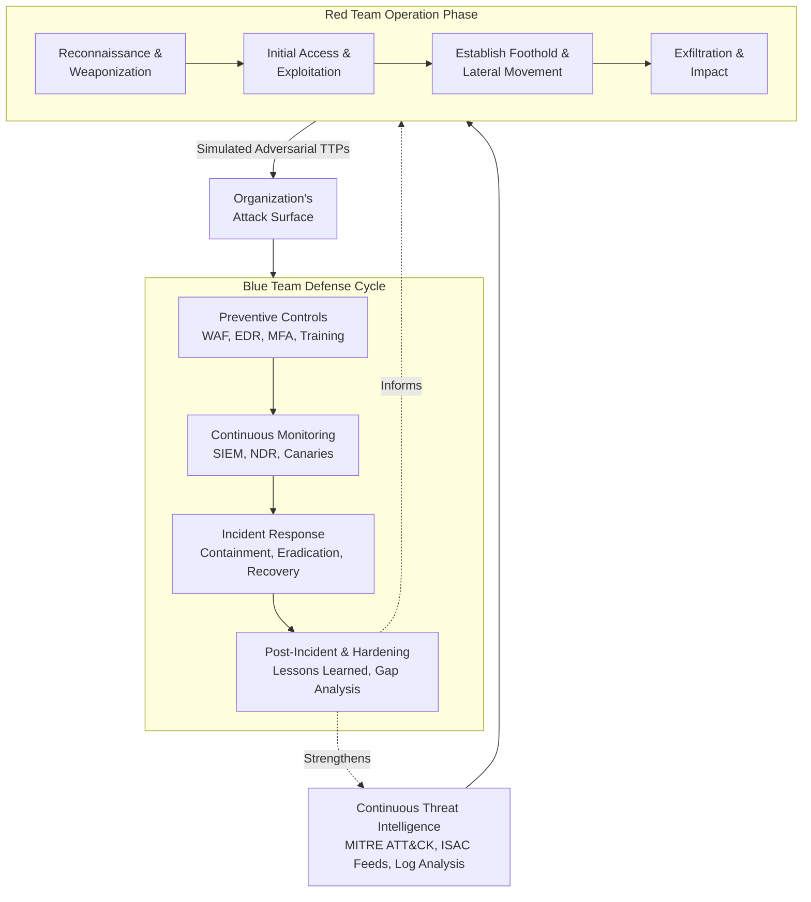

 

## **Part I: The Adversary's Playbook – Red Team Techniques**

This section details the offensive methodologies used to identify and exploit security weaknesses. Ethical application of these techniques is paramount and must always be conducted within a defined scope and with explicit authorization.

### **1. Initial Access & Social Engineering**
Initial access techniques focus on breaching the perimeter by exploiting human or systemic trust.

*   **Phishing & Spear-Phishing:** This technique involves crafting deceptive communications, typically emails, that appear legitimate to trick recipients into revealing credentials, executing malicious code, or approving fraudulent transactions. Advanced variants include spear-phishing (targeting specific individuals) and whaling (targeting high-level executives), often leveraging detailed reconnaissance to increase credibility. The payload is frequently a malicious attachment or a link to a credential-harvesting site. Success provides attackers with a foothold inside the network, often bypassing technical controls entirely by exploiting human psychology.
*   **Social Engineering:** A broader discipline than phishing, social engineering manipulates individuals into performing actions or divulging confidential information that compromises security. This can occur via phone (vishing), SMS (smishing), or in-person interactions (impersonation). Techniques include pretexting (creating a fabricated scenario), baiting (offering something enticing), and quid pro quo (offering a service for information). Its effectiveness stems from exploiting natural human tendencies like trust, curiosity, or a desire to be helpful, making it a persistent and high-impact threat vector.
*   **Physical Security Breaches:** This vector involves gaining unauthorized physical access to facilities, hardware, or restricted areas to plant devices, steal equipment, or directly interface with systems. Techniques include tailgating (following authorized personnel), lock picking, or exploiting poor access control measures. A successful breach can lead to the installation of hardware keyloggers, rogue wireless access points, or the theft of unencrypted devices, providing a level of access that is difficult to detect from network monitoring alone.
*   **Supply Chain Attacks:** Instead of attacking the target directly, adversaries compromise a trusted third-party vendor, software library, or update mechanism. This can involve poisoning open-source dependencies, compromising a software developer's build environment, or intercepting hardware in transit. The goal is to inject malicious code into a legitimate product or service that is then distributed to all downstream customers, enabling widespread and trusted access to otherwise secure environments.

### **2. Network & Application Exploitation**
These techniques target vulnerabilities in software and network protocols to execute code or intercept data.

*   **SQL Injection (SQLi):** By inserting malicious SQL statements into an application's input fields (like login forms or search queries), attackers can manipulate the backend database. This can lead to unauthorized viewing of data, deletion of tables, or in some cases, remote code execution on the database server. Successful exploitation is often due to the application's failure to properly sanitize user input and its practice of dynamically constructing SQL queries by concatenating strings.
*   **Cross-Site Scripting (XSS):** This vulnerability allows attackers to inject malicious client-side scripts (usually JavaScript) into web pages viewed by other users. When a victim's browser renders the page, it executes the injected script in the context of the trusted site. This can be used to steal session cookies, redirect users to malicious sites, deface the website, or perform actions on behalf of the user. XSS is typically categorized as Reflected (injected via a URL parameter), Stored (saved on the server), or DOM-based (processed entirely in the browser).
*   **Man-in-the-Middle (MitM) & DNS Spoofing:** MitM attacks intercept and potentially alter communication between two parties without their knowledge. Techniques like ARP spoofing on local networks or DNS spoofing can redirect traffic through an attacker-controlled system. This allows for eavesdropping on unencrypted traffic, session hijacking, or serving fraudulent websites to harvest credentials. DNS spoofing specifically corrupts the domain name resolution process, directing users to malicious IP addresses despite typing a correct URL.
*   **Wi-Fi Hacking & Rogue Access Points:** This involves exploiting weaknesses in wireless security protocols (e.g., cracking WPA2-PSK passwords) or creating a malicious wireless network with a legitimate-sounding name (an "Evil Twin"). Users connecting to this rogue AP have all their traffic monitored and manipulated. Attackers may also use deauthentication attacks to disconnect users from legitimate networks, forcing them to reconnect to the rogue counterpart.

### **3. Post-Exploitation & Persistence**
Once initial access is achieved, these techniques are used to maintain presence, move laterally, and achieve objectives.

*   **Privilege Escalation:** This is the process of exploiting a bug, design flaw, or configuration oversight to gain elevated access to resources. Vertical escalation involves moving from a standard user to an administrator (e.g., `root`, `SYSTEM`). Horizontal escalation involves accessing the privileges of another user at the same level. Techniques include exploiting kernel vulnerabilities, abusing misconfigured service permissions, or harvesting credentials from memory dumps.
*   **Lateral Movement:** After compromising one host, attackers pivot to other systems within the network. This is achieved using tools like PsExec, Windows Management Instrumentation (WMI), or remote desktop protocols, often leveraging stolen credentials. The goal is to map the network, locate high-value targets (domain controllers, file servers), and establish multiple points of presence to ensure access persists even if one entry point is discovered.
*   **Command Injection & Remote Code Execution (RCE):** These techniques involve exploiting vulnerabilities that allow an attacker to execute arbitrary operating system commands on a target system. Command injection typically occurs through web applications that pass unsafe user input to a system shell. RCE vulnerabilities can exist in any network service and provide the ability to run code without prior authentication, offering a direct path to full system compromise.
*   **Advanced Persistent Threats (APTs) & Zero-Days:** APTs are prolonged, targeted attacks conducted by sophisticated adversaries (often nation-states). They employ a combination of custom malware, stealthy techniques, and deep knowledge of the target. A key enabler is often the use of zero-day exploits—attacks targeting vulnerabilities unknown to the software vendor, for which no patch exists. Defense against these requires a focus on behavioral detection, robust logging, and threat hunting rather than signature-based tools alone.

 

## **Part II: The Defender's Handbook – Blue Team Strategies**

Effective defense is proactive, layered, and informed by an understanding of offensive TTPs. This section outlines strategic and tactical controls to mitigate the attacks described above.

### **1. Foundational Security Posture & Governance**
A resilient security program is built on a strong foundation of policy, architecture, and risk management.

*   **Implement a Zero Trust Architecture:** Move beyond the traditional "trust but verify" model. Zero Trust mandates "never trust, always verify." Every access request must be authenticated, authorized, and encrypted before granting access, regardless of origin (inside or outside the network). This is achieved through micro-segmentation, strict identity and access management (IAM), and least-privilege principles, significantly limiting an attacker's ability to move laterally after breaching the perimeter.
*   **Establish Robust Vulnerability Management:** This is a continuous cycle of identifying, evaluating, prioritizing, and remediating vulnerabilities. It involves regular automated scanning, but more critically, a risk-based approach to patching. Critical and exploitable vulnerabilities in internet-facing systems must be addressed immediately. A mature program also includes secure configuration management (using benchmarks like CIS), reducing the attack surface by disabling unnecessary services and hardening systems.
*   **Enforce Strong Identity & Access Management (IAM):** Identity is the new security perimeter. Defenses must include mandatory Multi-Factor Authentication (MFA) for all users, especially for administrative and cloud console access. Implement Single Sign-On (SSO) where possible to reduce password fatigue and attack surface. Enforce the principle of least privilege (PoLP) and conduct regular access reviews to ensure users only have the permissions necessary for their role. Utilize Privileged Access Management (PAM) solutions to vault and monitor the use of administrative credentials.
*   **Develop a Comprehensive Security Awareness Program:** Since humans are a primary attack vector, continuous education is essential. Training must go beyond annual compliance videos to include regular, simulated phishing campaigns, workshops on recognizing social engineering, and clear reporting procedures for suspicious activity. The goal is to cultivate a security-conscious culture where employees are an active layer of defense, not a passive vulnerability.

### **2. Technical Security Controls & Mitigations**
These are the specific tools and configurations deployed to prevent, detect, and respond to technical attacks.

| Attack Category | Primary Defensive Controls | Specific Mitigations & Actions |
| :--- | :--- | :--- |
| **Network Attacks** | Next-Generation Firewalls (NGFW), Intrusion Prevention Systems (IPS), Network Segmentation | Enforce TLS 1.2+ encryption everywhere. Deploy DNSSEC. Use a Wireless IPS (WIPS) to detect rogue access points. Segment networks to isolate critical assets (PCI, OT, R&D). |
| **Web Application Attacks** | Web Application Firewall (WAF), Secure Development Lifecycle (SDLC) | **For SQLi/XSS:** Use parameterized queries/prepared statements; implement strict input validation and output encoding. Enforce a Content Security Policy (CSP) header. |
| **Endpoint Compromise** | Endpoint Detection & Response (EDR), Application Allowlisting, Full-Disk Encryption (FDE) | Configure EDR for behavioral detection, not just signatures. Use allowlisting to block unauthorized software. Enforce FDE (BitLocker/FileVault) and BIOS/UEFI passwords on all devices. |
| **Credential-Based Attacks** | Multi-Factor Authentication (MFA), Password Managers, Account Lockout Policies | **Mitigate Brute Force/Spraying:** Enforce strong, unique passwords via policy; implement account lockout with intelligent delays; use breached password screening. |
| **Malware & Persistence** | EDR, Anti-Virus (NGAV), Regular Backups (3-2-1 Rule) | Maintain isolated, immutable backups. Use EDR for visibility into process execution and lateral movement. Hunt for persistence mechanisms (scheduled tasks, services, registry). |

### **3. Proactive Operations: Detection & Response**
Assuming breach is a core defensive mindset, focusing on rapid detection and effective response.

*   **Implement Continuous Monitoring & SIEM:** Security Information and Event Management (SIEM) platforms are the central nervous system for the Security Operations Center (SOC). They aggregate and correlate logs from endpoints, network devices, servers, and applications. Properly tuned, they turn vast amounts of data into actionable alerts by identifying anomalies and patterns indicative of known TTPs, such as unusual login times, lateral movement traffic, or data exfiltration volumes.
*   **Conduct Proactive Threat Hunting:** Threat hunting is a hypothesis-driven, human-led search for adversaries that have evaded existing automated detection tools. Hunters use their knowledge of adversary behavior (informed by frameworks like MITRE ATT&CK) to query data, look for subtle anomalies, and uncover hidden threats. This shifts the security posture from reactive to proactive, reducing adversary dwell time within the environment.
*   **Maintain a Formal Incident Response (IR) Capability:** An IR plan is useless without a trained team and tested processes. The IR lifecycle—Preparation, Identification, Containment, Eradication, Recovery, and Lessons Learned—must be ingrained. Regular tabletop exercises simulate real incidents, ensuring the team knows their roles, communication channels are clear, and containment strategies (like network isolation) can be executed swiftly to limit business impact.
*   **Leverage Threat Intelligence:** Operational threat intelligence involves consuming and integrating external data about adversary TTPs, indicators of compromise (IOCs), and campaigns. This intelligence feeds into SIEM rules, EDR configurations, and firewall blocklists, allowing defenses to be tuned against active, real-world threats rather than theoretical ones. Sharing intelligence within industry-specific Information Sharing and Analysis Centers (ISACs) further enhances collective defense.

 

## **Conclusion: Bridging the Divide for Organizational Resilience**

The dynamic between Red and Blue Teams is not adversarial but symbiotic. The ultimate goal of both is to strengthen the organization's security posture.

*   **Foster a Collaborative Feedback Loop:** Red Team engagements must conclude with detailed debriefs and reports that provide the Blue Team with specific, actionable findings. These reports should not just list vulnerabilities but describe the exploit chain, detection gaps, and the time taken to discover the simulated breach. This intelligence is critical for Blue Teams to improve monitoring, tighten controls, and validate their detection capabilities.
*   **Measure Effectiveness with Metrics:** Move beyond measuring the number of patched systems or blocked emails. Focus on meaningful metrics like **Mean Time to Detect (MTTD)** and **Mean Time to Respond (MTTR)**. Red Team exercises can help establish baseline metrics and track improvement over time. The reduction in an attacker's "breakout time" (from initial compromise to lateral movement) is a key indicator of a maturing defense.
*   **Embrace a Culture of Continuous Improvement:** Cybersecurity is not a project with an end date. It is a continuous cycle of assessment, defense, testing, and enhancement. Regularly update this playbook, run new attack simulations as the threat landscape evolves, and continuously train both Red and Blue Team personnel. By understanding the attacker's methodology and relentlessly fortifying defenses, organizations can build true resilience in the face of an ever-evolving threat landscape.

    

<h1 align="center">The Illusion of Readiness: A Critical Analysis of Misleading Cybersecurity Training.</h1>
 
 

> **Disclaimer:** This document is intended for informational and educational purposes. Career outcomes are influenced by a multitude of factors including individual effort, market conditions, and economic trends.

 

## Executive Summary

The cybersecurity industry faces a paradoxical crisis: a critical talent shortage coexists with a flood of inadequately prepared candidates. This phenomenon is largely fueled by an ecosystem of training programs that prioritize marketing allure over educational substance. This document deconstructs the mechanisms of misleading training, contrasts them with legitimate pathways, and provides a strategic framework for evaluating cybersecurity education. Our analysis synthesizes expert commentary, market data, and technical realities to expose the gaps between promise and practice.

## 1. The Deceptive Training Ecosystem: How Illusions Are Manufactured

The misleading training landscape operates on a model that exploits information asymmetry and career anxiety. The following flowchart visualizes this self-perpetuating cycle:

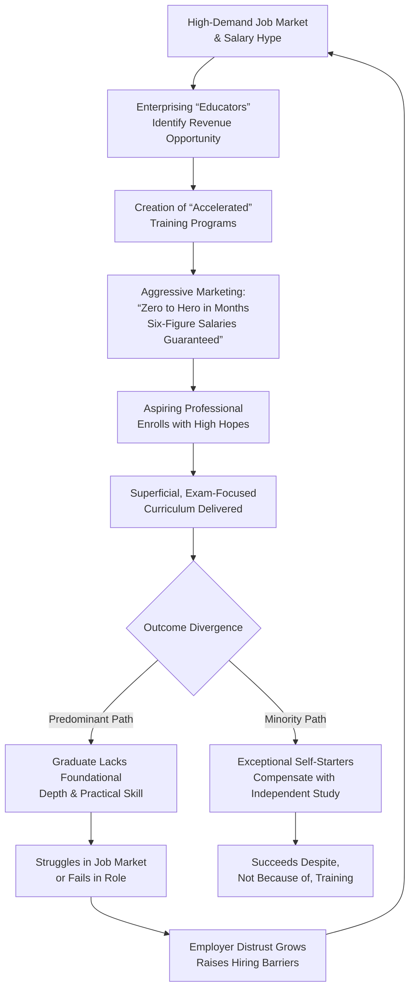

### 1.1 Core Mechanisms of Misrepresentation

*   **The "Quick Success" Mirage:** Programs routinely advertise career transformation in implausible timeframes (e.g., 12-16 weeks). This ignores the fundamental hierarchy of knowledge. Cybersecurity is an applied discipline that sits atop a pyramid of core IT competencies: hardware, operating systems, networking, system administration, and cloud architecture. Compressing this vertical stack into a single, short course results in fragile, superficial knowledge that collapses under real-world pressure. The promise of immediate six-figure salaries to career entrants is a statistical outlier misrepresented as the norm, preying on financial aspirations.

*   **Certification-Only Focus:** Many bootcamps and courses are designed as elaborate exam-prep engines, teaching students to recognize correct answers rather than understand underlying principles. This creates "paper-certified" professionals who can pass a CompTIA Security+ or CEH exam but cannot analyze a network diagram, interpret system logs, or articulate how a specific attack exploits a system's architecture. The credential becomes a hollow signal, devaluing its worth for employers and qualified holders alike.

*   **Omission of Foundational IT:** A central and damaging fallacy is treating cybersecurity as an entry-level discipline. Effective security requires deep comprehension of the system being secured. You cannot architect a zero-trust network without mastering VLANs, firewalls, and IAM. You cannot hunt for malware without understanding process management, memory allocation, and registry functions. Programs that jump straight to "ethical hacking" without ensuring fluency in TCP/IP, OSI layers, Windows/Linux internals, and basic scripting are building on a foundation of sand.

*   **Simulated Reality vs. Operational Reality:** Training environments are often sterile, with predefined vulnerabilities and guided pathways. This contrasts starkly with the chaotic, noisy, and constrained reality of enterprise networks—legacy systems, politically charged change controls, false positives, and business priorities that conflict with security ideals. Training that doesn't discuss budgetary constraints, policy development, incident reporting, and cross-departmental communication fails to prepare individuals for 80% of the job.

## 2. The Reality Matrix: Contrasting Marketing vs. Operational Truth

The table below crystallizes the disparity between common marketing claims and the on-the-ground reality experienced by security practitioners.

| Marketing Claim (The Illusion) | Operational Reality (The Truth) |
| :--- | :--- |
| **"Become a Penetration Tester in 12 Weeks!"** | Penetration testing is a mid-to-senior role. Competent testers require years of experience as network/systems admins to understand complex, heterogeneous environments. Entry-level security roles are defensive: SOC analysis, vulnerability management, and security coordination. |
| **"No IT Background Needed!"** | This is the most dangerous claim. Cybersecurity is **not** a standalone field. It is the risk management layer applied to **all** IT domains. Without the background, a professional cannot assess risk context, prioritize remediation, or communicate effectively with engineering teams. |
| **"High Salaries Guaranteed Upon Certification."** | Salaries are tied to demonstrable skill and experience, not certificates alone. The high salaries are for professionals who can defend complex environments, automate security controls, and guide business strategy—capabilities built over years, not weeks. |
| **"Learn the Latest Hacking Tools!"** | Over-emphasis on tools (Metasploit, Burp Suite) creates "script kiddies" who can run scans but cannot interpret results, modify payloads, or develop novel techniques. The value is in the underlying knowledge of protocols, systems, and code that the tools automate. |
| **"Thrilling, Action-Packed Daily Work!"** | Portrayals focus on "red team" glamour. The vast majority of roles are "blue team": monitoring alerts, reviewing logs, patching systems, writing reports, updating policies, and conducting user training. It is a profession of diligence, documentation, and occasional high-pressure incident response. |

## 3. The Path to Authentic Competence: A Sustainable Framework

Authentic cybersecurity expertise is not a product to be purchased but a mindset and skillset to be cultivated. The following framework outlines a sustainable, iterative approach.

### 3.1 Foundational Pillars: Non-Negotiable Prerequisites

*   **Master Core IT Systems:** Before any security-specific study, invest significant time in understanding how computers and networks actually work. This means being able to build a computer, install and configure Windows and Linux operating systems, set up a functional network with routers and switches (physical or virtual), and deploy basic services like DHCP, DNS, and Active Directory. Concepts must move from abstract to tangible. This foundational year (or more) is irreplaceable and is often best gained through roles like Help Desk Technician, Network Operations Center (NOC) Analyst, or Systems Administrator.
*   **Develop the Security Mindset:** Shift from a "user" perspective to a "builder and breaker" perspective. This involves constant curiosity: not just asking "how does it work?" but "how could it break?" and "how would I prove it's secure?" Begin reading incident reports from vendors like Mandiant or CrowdStrike, not for the drama, but to reverse-engineer the attacker's techniques and the defender's failures. This analytical posture is the core of the profession.
*   **Embrace Continuous, Self-Directed Learning:** The field's evolution is relentless. Formal training provides a launchpad, not a destination. Professionals must cultivate a disciplined habit of daily learning—following security researchers on social media, reading blogs from core infrastructure vendors, experimenting in personal labs, and taking incremental advanced certifications. The commitment is akin to a medical professional staying current with new treatments and research.

### 3.2 The Legitimate Learning Pathway: A Multiphase Journey

1.  **Phase 1: IT Foundation (6-24 months)**
    *   **Goal:** Achieve operational fluency in mainstream IT environments.
    *   **Actions:** Obtain CompTIA A+ and Network+ (or Cisco CCNA). Set up a home lab using virtualization (VirtualBox, VMware). Build a small domain network, configure Group Policy, manage users, and troubleshoot connectivity.
    *   **Outcome:** Ability to discuss technology in-depth with IT peers.

2.  **Phase 2: Security Fundamentals (6-12 months)**
    *   **Goal:** Apply the security mindset to foundational IT knowledge.
    *   **Actions:** Pursue CompTIA Security+. Study the NIST Cybersecurity Framework (CSF) and MITRE ATT&CK matrix. In your home lab, segment the network, implement a firewall, analyze logs for suspicious events, and practice basic hardening of Windows/Linux systems.
    *   **Outcome:** Ability to understand and articulate common threats and basic defensive controls.

3.  **Phase 3: Specialized Skill Development & Entry-Level Role (12-36 months)**
    *   **Goal:** Gain professional experience and deepen expertise in a chosen domain.
    *   **Actions:** Secure an entry-level role (SOC Analyst, Vulnerability Management Analyst). Pursue domain-specific certifications (e.g., CySA+ for defense, eJPT for introductory pentesting). Contribute to open-source security tools or write detailed blog posts about lab experiments.
    *   **Outcome:** Professional experience and a portfolio of demonstrable, practical skills.

## 4. Strategic Recommendations for Aspiring Professionals

*   **Conduct Diligent Vendor Vetting:** Scrutinize training providers. Legitimate programs will openly discuss the need for IT fundamentals, provide detailed bios of instructors with verifiable industry experience (not just teaching experience), and offer transparent job placement statistics, including role titles and starting salaries. They will emphasize concepts and principles over tool memorization.
*   **Seek Apprenticeship and Mentorship:** The master-apprentice model remains one of the most effective knowledge-transfer mechanisms. Seek out internships, apprenticeships, or even informal mentorships with experienced practitioners. On-the-job training surrounded by experts accelerates learning exponentially by providing context, nuance, and immediate feedback.
*   **Validate with Hands-On Practice:** Theory without application is useless. Use platforms like Hack The Box (HTB) or TryHackMe for guided, gamified learning. Build and attack your own isolated lab environments. Participate in Capture The Flag (CTF) competitions. This practical proving ground is where theoretical knowledge is stress-tested and solidified.
*   **Adopt a Long-Term Mindset:** Reframe your career entry as a marathon, not a sprint. Expect a journey of 3-5 years to reach a competent, mid-level degree of proficiency. Sustainable success is built on a wide and deep foundation. Patience and persistent effort will outperform rushed, superficial training every time.

## Conclusion

Misleading cybersecurity training is a systemic issue that damages individuals, employers, and the profession's integrity. It creates false expectations, floods the market with underqualified candidates, and forces employers to raise credentialing barriers. The antidote is a return to first principles: recognizing cybersecurity as an advanced, applied discipline built upon a robust IT core. By rejecting the allure of shortcuts, investing in foundational knowledge, and committing to continuous, experiential learning, aspiring professionals can build resilient, rewarding careers that genuinely enhance our digital ecosystem's security. The path is demanding but clear—it requires not just a different course, but a different mindset.

    

<h1 align="center">Global cybersecurity landscape and impact analysis 2020–2025.</h1>

 

**Economic and Sectoral Impact of Breaches:** Global cyberattack damages have surged over 2020–2024. The *average* cost of a data breach rose from **$3.86M in 2020** to **$4.88M in 2024**.  In 2024 alone IBM/Ponemon reports a 10% jump (to ~ $4.88M), the largest annual increase on record.  Losses include direct remediation (forensics, recovery), business disruption, regulatory fines, and reputational harm.  For example, healthcare breaches averaged **$10.93M** (2023) – roughly double the finance sector ($5.90M).  Critical infrastructure (energy, utilities) and manufacturing firms also see high costs (energy $4.7M; industrial/manufacturing $4.8M).  These costs often translate into physical disruptions (e.g. pipeline shutdowns) and customer attrition, eroding brand value.  (Cumulative global cybercrime costs are even larger: industry analysts project damages exceeding **$10 trillion** by 2025.)

**Sector examples:** Healthcare (highest breach costs, costly HIPAA compliance), Financial/Banking (heavy fines and fraud losses), Energy/Utilities (ransomware on pipelines/grids), Manufacturing (supply-chain disruption), Smart Cities/IoT (emerging attacks on transport, water, etc).

 

**Year-by-Year Breach Cost Trends. (2020–2024, Forecast 2025)**

| Year        | Global Avg. Breach Cost | Source (Ponemon/IBM) |
| ----------- | ----------------------- | -------------------- |
| 2020        |  $3.86M                 | IBM (Ponemon 2020)   |
| 2021        |  $4.24M                 | IBM (Ponemon 2021)   |
| 2022        |  $4.35M                 | IBM (Ponemon 2022)   |
| 2023        |  $4.45M                 | IBM (Ponemon 2023)   |
| 2024        |  $4.88M                 | IBM (Ponemon 2024)   |
| 2025 (est.) |  $5.2M (↑)              | Trend (CAGR\~8–10%)  |

 

The steady rise (15% total since 2020) reflects both more **costly breaches** and greater data volumes.  IBM projects continuing increases: for instance, breaches spanning hybrid cloud now cost $5.17M.  **Escalating factors** include faster attack lifecycles, supply-chain risk, and more sophisticated exploits.

 

**Regional Losses and Sector Highlights:**

**Regional variations:** The U.S. sustains by far the *highest* breach costs (average $9.48M in 2023).  Other hard-hit regions include the Middle East ($8.07M).  Western Europe and Canada see moderately high costs ($4–6M), while costs are lower (but rising) in Asia-Pacific and Latin America (e.g. India $2.18M, Latin America $3.69M in 2023).  Notably, Latin America’s breach costs jumped by 32% from 2022 to 2023 as cybercrime grows there.

**Key sectors:** According to IBM/Ponemon, **healthcare** has the highest per-incident loss ($10.93M in 2023).  Finance/banking breaches run $5–6M, and **energy/industrial** around $4.7–4.8M.  Public sector and small-scale consumer sectors tend to be lower.  These figures reflect direct costs; **infrastructure losses** (e.g. downtime, physical damage) and **reputation damage** (customer churn, stock dips) can far exceed the breach response costs in some cases (e.g. nationwide gas outages or public health data leaks).

 

**Threat Landscape and Trends:** Cybercriminal tactics have evolved dramatically:

* **Ransomware and Extortion:** Ransomware remains dominant.  Breaches by gangs (DarkSide, REvil, ALPHV/BlackCat) caused major disruptions (see examples below).  Adversaries target critical infrastructure, healthcare, and supply chains.  In 2024 the global cost of ransomware (lost business, remediation, and ransom payments) is estimated to exceed **$42B**.  Notably, 85% of ransomware targets are small/medium businesses.
* **Phishing and Social Engineering:** Traditional phishing still fuels many breaches (stolen credentials cause ~19% of breaches).  GenAI is rapidly amplifying these scams: Harvard Business Review notes *“GenAI tools are making phishing emails more advanced, harder to spot, and significantly more dangerous”*.  AI-enabled phishing campaigns can now generate thousands of personalized emails or deepfake voice calls in seconds.  Although studies show only a few percent of phishing emails are wholly AI-generated today, attackers increasingly use AI to craft more convincing messages and multi-channel attacks (voice, video).  This trend is expected to *greatly increase* phishing volume and sophistication.
* **AI-driven Scams and Deepfakes:** Fraudsters are using AI to impersonate executives or forge documents.  Entrust reports *“a deepfake attack happened every five minutes in 2024”*, and digital document forgeries (often with generative AI) rose 244% YoY.  AI-generated identities now facilitate account-takeover, fake invoices, and advanced baiting schemes.  Financial services (banks, crypto) and government agencies have been especially targeted in these new social-engineering attacks.
* **IoT and Connected Infrastructure:** The explosion of IoT and 5G-connected devices has broadened the attack surface.  Cybersecurity analysts warn that billions of poorly secured IoT sensors, medical devices, and OT controllers are being discovered daily.  For example, researchers highlight that surging IoT adoption and 5G rollouts are “creating more vulnerabilities, driving the need for advanced adaptable security solutions”.  Proof-of-concept attacks (e.g. on smart city cameras or industrial controllers) show that adversaries can potentially disrupt utilities, traffic systems, and supply-chain equipment.
* **Supply-Chain & Cloud Threats:** High-profile supply-chain breaches (SolarWinds, etc.) underscored that third-party code and cloud misconfigurations are critical risks.  Over one-third of breaches now involve data across multiple environments, prolonging incident response.  Shadow IT and unsecured public cloud repositories have led to massive data leaks.  Organizations remain busy auditing third parties and tightening cloud governance to mitigate these trends.

**Notable trends:** Ransomware syndicates now often operate “Ransomware-as-a-Service,” lowering barriers for criminals.  Business Email Compromise (BEC) remains lucrative ($12B+ annual losses globally).  Recent “double extortion” (leak data unless paid) and multi-stage attacks (initial phishing → credential theft → network compromise → ransomware) are more common.  In sum, threats are multiplying in volume and complexity, accelerated by AI.

 

**Cybersecurity Workforce & Skills:** Cybersecurity talent remains in **severe shortage** worldwide.  ISC² estimates the global cyber workforce at only **5.5 million**, against a demand of ~10.2 million – a shortfall of 4.7 million professionals.  Over half of organizations report skills gaps significantly impairing their security posture.  The deficit is acute in all regions, including Asia.  For example, in India a DSCI survey found **47%** of companies plan to expand security staff by >30%, yet major skill gaps remain (top ones: continuous learning, problem-solving, and cloud security).

**Vacancies and Hiring:** Cyber job postings have fluctuated.  A LinkedIn/ISC² analysis shows hiring slowed in some mature markets (US, India, Canada) but grew in others (Spain, Mexico).  Key hiring sectors include IT/technology firms, financial services, healthcare, defense/government, and growing industry sectors (manufacturing, utilities).  Major tech companies (Google, Amazon, Microsoft), defense contractors and consultancies are among the most active recruiters.  *(Emerging: many public agencies now list cybersecurity as priority skill.)*

**Skill Gaps:** The most-cited skill gaps globally are in hands-on technical skills (cloud security, DevSecOps) and “soft” skills (teamwork, communication).  Over 60% of CISOs say lack of skilled staff has measurably increased breach costs.  Organizations are responding by upskilling existing staff, hiring grads, and outsourcing (MSSPs), but a true talent pipeline remains a bottleneck.

**Salary & Career Trends:**  Supply–demand drives high pay.  ISC² data shows senior security certifications command six-figure salaries.  For example, globally a CISSP professional earns on average $119.6K per year (with North American CISSPs 147K on average, Asia-Pacific 71K).  Entry-level roles (e.g. analysts, junior engineers) start lower (often $50–80K), but with rapid growth to $100K+ as expertise accumulates.  In India, lead security roles can command several lakhs per annum, reflecting the shortage.

**Career Outlook:**  Cybersecurity remains a high-growth career.  Continued digitization ensures demand across all industries.  Professional development (certifications like CISSP, training programs) is recognized – ISC² reports those with advanced certifications can reduce breach impact dramatically.  Many analysts predict strong job growth (often 10–15% annually in major economies) over the next 5 years.  In short, for qualified candidates, cybersecurity offers robust hiring demand, upward salary trends, and a wide range of roles.

 

**Sector Readiness Model (concept):** Organizations’ security maturity varies by industry.  For example, finance and healthcare often score “High” on maturity (strict regulations, budgets, mature programs), whereas manufacturing and smart-city projects (with legacy systems and IoT endpoints) may be “Medium” or “Low” maturity.  Below is a *conceptual* mermaid diagram illustrating relative readiness by sector:

*Figure:* Conceptual sectoral security readiness model (higher maturity = stronger controls/resilience).

 

**Geographic Breach Heatmap (concept):** By geography, breach risk and impact also cluster.  North America (USA/Canada) shows **very high** breach costs and volumes; Europe has **high** readiness (due to GDPR/NIS2) but still significant attacks; Asia-Pacific shows **growing threats** as economies digitize; Latin America’s incidents are **rising rapidly**; Middle East/Africa have **variable** coverage (some targeted in energy/finance).  The sketch below is a *conceptual* regional heatmap:

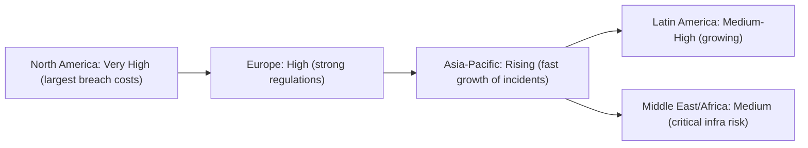

*Figure:* Conceptual map of relative breach incidence/cost by region (darker = higher).

 

**Cybersecurity Market & Investment Trends:** The security industry is booming.  Recent analyses show global cybersecurity spending around **$190–200B (2023)**, with forecasts of **$280–350B by 2026–2028**.  For example, research firm Gartner projects $190.4B in 2023, rising to $298.5B by 2028 (CAGR 9.4%).  Other sources predict even faster growth: one estimate sees spending exceeding **$350B by 2026**, driven by cloud adoption, regulatory mandates, and threats.  By 2033 the market may reach **\$644B** (IMARC, 8.9% CAGR).  The U.S. alone could hit $166B by 2032.  Cyber insurance is also rapidly expanding (projected from $14B in 2023 to $29B by 2027).

 

**Sub-segments growth:**

* **Managed Security Services (MSSP):** $30.6B (2023) → $52.9B by 2028 (CAGR 11.5%), as companies outsource security operations.
* **IoT/OT Security:** $8.8B (2025) → $37.4B by 2030 (CAGR 33.5%), riding the IoT boom.
* **Cloud Security:** multi-billion expansion as cloud adoption grows; “cloud-native” security tools are set to be 44% of software sales by 2027.
* **Cyber Warfare/Defense:** The “cyber warfare” sector (government/military solutions) is expected to grow from $67.4B in 2024 to $206.3B by 2033 (CAGR 12.6%).
* **Zero Trust:** Investments in zero-trust platforms could jump from $28B (2024) to $97B by 2030 (CAGR 23%).

Hardware still dominates spending in many sectors (firewalls, gateways held 55% of security spend in 2024), but software and services share is growing.  Organizations are increasing their budgets: IDC predicts security budgets will rise 12.2% in 2025.  Overall, corporate boardrooms now earmark a significant portion of IT budget for security (e.g. $147 per $1000 IT spend by 2025).

 

**Industry Threat Intelligence & Major Incidents:**

**Healthcare:** The 2024 *Change Healthcare* breach (BlackCat ransomware) exemplifies systemic impact.  UnitedHealth Group reports $2.9B total cost in 2024 (lost revenues, remediation, loans to payers) – one of the largest ransom-driven losses on record.

**Energy/Utilities:** In May 2021 the *Colonial Pipeline* was hit by DarkSide ransomware; operations halted for \~5 days and nearly **75 BTC (≈\$4.4M)** was paid to restore service.  This caused temporary fuel shortages and highlighted the ripple effect on national infrastructure.

**Manufacturing/Supply:** In June 2021 *JBS Foods* (global meat supplier) was attacked by the REvil gang, pausing US/Australia operations.  JBS paid **\$11M** in ransom, briefly threatening meat supply chains.

**Other examples:** The 2020 SolarWinds supply-chain hack (noted here for context) infiltrated government networks, showing how software dependencies can be weaponized.  City/Transportation systems have also been hit (e.g. 2016 San Francisco transit hack) – demonstrating “smart city” vulnerabilities.

These cases underscore that no sector is immune: adversaries will target **critical processes and high-value data**.  Beyond immediate costs, affected organizations often face regulatory penalties, customer lawsuits, and long-term reputational damage.  Cyber threat intelligence reports (from major cybersecurity firms) routinely highlight these incidents as catalysts for new defenses and regulations.

 

**Strategic Recommendations:**

* **Multi-layered Risk Mitigation:**  Adopt a defense-in-depth architecture.  Implement robust **network segmentation** to contain breaches.  Ensure timely patching and configuration management to eliminate known vulnerabilities.  Utilize endpoint protection, intrusion detection, and least-privilege access models.  According to Ponemon/IBM, organizations with mature zero-trust or AI-driven defenses see *significantly* lower breach costs (e.g. fully deployed security AI/automation saved \~\$2.2M on breaches, and mature zero-trust saw a 42% cost reduction).

* **Incident Response and Resilience:**  Develop and regularly test an incident response (IR) plan.  Maintain offline/offsite backups of critical data.  Conduct tabletop exercises simulating ransomware or data theft to ensure staff know procedures.  Strengthen supply chain resilience by auditing third-party security controls and requiring cyber hygiene from vendors.  Invest in cyber insurance where appropriate (premium hikes are occurring, but coverage can offset catastrophic losses).

* **Regulatory Alignment and Governance:**  Stay current with emerging regulations (e.g. GDPR/NIS2 in EU, CCPA/CPRA in US states, the new U.S. Cyber Incident Reporting Law, India’s impending Data Protection Bill, etc.).  Map compliance requirements into security controls (data classification, encryption, data residency).  Align with standards like NIST CSF/800-207 (Zero Trust), ISO 27001, and industry frameworks (HIPAA for health, PCI-DSS for payments, etc.).  Cross-functional coordination (legal, audit, IT, business units) is critical for governance.

* **Workforce Development:**  Address the talent shortage by investing in people.  Upskill existing IT staff through training and certifications (CISSP, CEH, etc.).  Partner with universities and vocational programs to build pipelines.  Encourage diverse hiring: broadening applicant pools (including women and underrepresented groups) can ease shortages.  Build career paths to retain talent.  IBM’s research shows understaffed security teams incurred **\$1.76M** more in breach costs, so dedicating resources to hiring and training pays off.

* **Embrace Security Automation and AI:**  Deploy tools to enhance human teams (SIEM/SOAR, automated threat detection).  As IBM notes, organizations with advanced security AI/automation contained breaches *98 days faster* and saved \~\$2.2M.  However, balance AI use with caution: validate outputs and guard ML models against poisoning or exploitation.

* **Zero-Trust Adoption:**  Move toward a zero-trust model (continuous verification of users/devices).  Given remote/hybrid work, traditional perimeters are obsolete.  Data show firms without zero-trust pay \~\$1M more per breach.  Start by micro-segmenting networks and enforcing MFA and identity controls everywhere.

* **Continuous Improvement:**  Monitor threat intelligence feeds (e.g. ISACs, vendor reports) for emerging TTPs.  Regularly reassess your security posture via audits and exercises.  Learn from industry incidents (post-mortems) to refine defenses.  Cultivate a security-aware culture: enforce training, phishing tests, and reward compliance.

By integrating these strategies—technical controls, policy alignment, proactive threat hunting, and human capital development—organizations can **significantly reduce breach impact** and build resilience against the evolving adversarial landscape.

    

<h1 align="center">Global cybersecurity workforce gap 2020–2025.</h1>

 

**Overview:** Global demand for cybersecurity talent has surged in recent years, outpacing the growth of the workforce. According to industry studies, both the supply of cybersecurity professionals and the estimated shortfall have steadily climbed since 2020. For example, the ISC² studies report the global workforce at **\~3.5 million in 2020**, rising to **\~4.7M in 2022** and **5.5M by 2023**, while the unfilled gap grew from **3.12M in 2020** to **4.0M in 2023**.  Other forecasts confirm this trend: the World Economic Forum notes a **4.0M professional shortfall** in 2023, despite a 12.6% workforce jump from 2022. Cybersecurity Ventures similarly predicted **3.5M unfilled positions by 2021**, plateauing through 2025. In short, despite record hiring, demand continues to outstrip supply, driven by rising cyber threats, digitization and new regulations.

**Year-by-Year Trends (2020–2024):**

* **2020:** The ISC² study estimates roughly **3.5M professionals** in the global cyber workforce, with a **gap of \~3.12M**. Growth had slowed due to the pandemic; yet **700K new entrants** began joining cybersecurity in 2021, suggesting \~**3.5M** workforce in 2020. Despite COVID disruptions, **demand remained high** (organizations faced new digital risks), but hiring constraints (economic uncertainty) kept growth modest. The gap remained the largest in **Asia-Pacific (\~1.42M)**.

* **2021:** By 2021 the workforce **jumped to \~4.19M**, driven by **700K new professionals** entering the field. This represents a **\~20% increase** from 2020. The widened supply helped **narrow the gap** to \~**2.72M** (from 3.12M). However, demand still outstripped supply; ISC² noted 72% of organizations planned to increase cybersecurity staff in the next year. The largest regional shortage remained **APAC (\~1.42M gap)**, although other regions (North America, Europe, Latin America) saw smaller gaps. Key drivers were continued **digital transformation and remote work expansion**, even as budgets were constrained.

* **2022:** Growth moderated. The workforce reached about **4.7M** (adding \~0.5M), a roughly **12% YOY** increase. At the same time, the **gap surged to \~3.4M**. ISC² noted the gap grew “twice as fast” as the workforce that year. Major factors were intense hiring competition and emerging tech (cloud, IoT) requiring specialized skills, coupled with heightened threats (e.g. after high-profile breaches). Geopolitical tensions and macroeconomic uncertainty also spurred firms to bolster security, fueling demand. (ISC² CEO Clar Rosso highlighted that “as a result of geopolitical tensions and macroeconomic instability…demand for professionals \[is] increasing”.) Nonetheless, 72% of surveyed organizations still intended staff increases – a new high – reflecting persistent need.

* **2023:** Strong growth continued in supply. ISC² reports **5.5M** cybersecurity professionals globally in 2023, up **8.7%** from 2022. This was a record high, despite the pandemic aftermath. Yet the **gap also climbed** to **4.0M** by 2023. Thus supply growth once again failed to “catch up” to demand. Regionally, APAC and North America saw the largest workforce gains (APAC +11.8% to 960K; NA +11.3% to 1.50M), but also the biggest gaps (APAC gap \~2.7M, up 23%; NA gap \~522K). Europe’s workforce grew modestly (+7.2% to 1.31M) with a gap of \~348K. Sectors driving demand included cloud security, AI readiness, and critical infrastructure protection. Automation and AI entered the discussion: many professionals believe AI will augment cyber work (only \~1/3 fear being “obsolete”), and roughly 45% of teams adopted generative AI to bridge skill gaps. However, budget cuts and layoffs began to bite: in 2023, \~25% reported cybersecurity layoffs and 37% faced budget cuts, hinting at slowing hiring.

* **2024:** The latest data show growth plateauing. ISC²’s **2024 workforce study** estimates **\~5.47M** cybersecurity professionals globally (just a 0.1% increase from 2023), even as organizations still *need* far more. The estimated **gap jumped \~19%** to about **4.76M** in 2024. In other words, the demand for talent expanded faster than supply. Economic pressures played a role: 25% of organizations reported cybersecurity layoffs in 2024 (up 3% from 2023), and 39% cite **budget shortfalls** as the #1 reason for skills shortages. Hiring freezes and fewer entry-level roles have created a bottleneck. Meanwhile, AI adoption is climbing (45% of teams use GenAI tools for security tasks), but so far hasn’t significantly eroded headcount – many see it more as an augmentation. By year-end 2024, ISC² warns that **“demand still outpaces supply”** and even an all-time high workforce of 5.47M can’t fill the 4.8M gap.

**Regional Patterns:** Regional data reveal disparities in both talent supply and gaps. In **Asia-Pacific**, the cybersecurity workforce is rapidly expanding: ISC² reports **0.96M (2023)–1.00M (2024)** professionals. However, APAC also has the **largest shortage** – on the order of **2.7M unfilled jobs** in 2023, driven by booming digital economies (e.g. India’s tech sector) and relatively slower growth in domestic talent. **Europe** has  **1.30M** professionals with a gap of  **0.35M**; the gap here stems partly from regulations like GDPR and NIS2 creating new demand. **North America** (US & Canada) fields about **1.45M** cyber pros but still reports roughly **0.52M unfilled roles** (as of 2023) – the highest corporate spending on cyber does not erase the shortage. **Middle East & Africa (MEA)** has a much smaller workforce (**0.43M** in 2024) and a gap of about **0.11M**. Notably, regions with less established training infrastructure (e.g. Africa – only  20K certified pros on a 1.4B population) face acute deficits. Lastly, **Oceania** (mainly Australia and NZ) has only  **0.15M** cybersecurity professionals. Australia’s gap was estimated  28K in 2023. Overall, APAC and NA drive global numbers, but no region is immune – all report skills shortages, as depicted by the charts above.

**Country Highlights and Initiatives:**

* **United States:** The U.S. remains the largest single market for cyber talent. Estimates suggest **>500K vacancies** nationwide. Industry statistics note  950K total cyber workers with  465K job openings. The U.S. government and tech sector have launched major initiatives to close the gap (e.g. White House / CISA training programs and partnerships to upskill 150K Americans, and tech giants pledging  250K new positions via education).

* **India:** With a massive IT/tech workforce, India is quickly becoming an epicenter of demand. One report projects **1.5 million cybersecurity job openings by 2025**. However, domestic supply lags: 30% of India’s 40K advertised cyber positions in 2023 went unfilled. The Indian government is ramping up cyber education (e.g. new training institutes) and international collaborations to grow its talent pool.
* **Europe/UK:** Europe’s cybersecurity gap is moderated by strong policy drivers. The EU’s **GDPR** (data privacy) and the expanded **NIS2** Directive impose stricter security requirements on many industries, effectively **creating demand for thousands of security officers and compliance experts**. The UK (no longer in EU) also faces shortages: about **43% of small/mid businesses couldn’t hire needed security support in 2023**. Many European governments have launched cyber skills strategies (funding training programs, certifications and apprenticeships) to increase supply. For instance, Germany and France saw their cyber workforces grow  14–17% in 2023 alongside EU mandates.
* **Middle East & Africa:** Wealthy Gulf nations are rapidly scaling up cyber teams; e.g. UAE’s cyber workforce grew 18% in 2023. Saudi Arabia and Egypt have national cyber security strategies with education quotas. By contrast, much of Sub-Saharan Africa has few trained cyber professionals (per capita) and is relying on external training initiatives (including partnerships with global bodies). Notably, only  20K certified pros serve an entire African continent (1.4B people), highlighting a critical regional gap.
* **Oceania (Australia/NZ):** Australia reports  146K cyber pros in 2024 (with a slight recent drop in large cities due to budget cuts). The government’s **Australian Cyber Security Strategy** (and bodies like the Australian Cyber Security Growth Network) aim to bridge a projected  28K shortfall by 2025, by funding university courses and industry bootcamps. New Zealand likewise emphasizes cyber training in its national security plan. Overall, Oceania has one of the lowest per-capita cyber workforce sizes, making strategic investment a national priority.

**Tech, Automation and Regulatory Impacts:**

Several cross-cutting factors are reshaping hiring demand:

* **AI and Automation:** Accelerating use of automation and AI in cyber tasks is a double-edged sword. Many organizations expect AI to **augment** analysts rather than replace them. In ISC²’s 2024 survey, 45% of teams had implemented generative AI tools for security functions (e.g. threat detection). While this may streamline routine work, it has **not** led to widespread layoffs – firms actually *value human expertise* to interpret AI outputs. Indeed, about 2/3 of security professionals believe their roles are “future-proof” even with AI. Meanwhile, automation of low-level tasks increases demand for higher-skilled roles (cloud architects, AI/ML security specialists, DevSecOps engineers). Many hiring managers now prioritize **transferable soft skills** (problem-solving, communication) to complement AI.

* **Economic Pressures:** The global economy has put pressure on cyber budgets. The 2024 ISC² study found that **budget constraints** have become the top barrier to hiring (39% cited funding shortfalls as the main reason for workforce gaps). Many organizations enacted hiring freezes or layoffs in 2023–24 (cumulatively \~25–37% of respondents). Consequently, **workforce growth is stalling**: the global cyber headcount grew only 0.1% in 2024. This crunch creates a paradox – demand is rising (due to more threats), but companies are cutting back on talent acquisition. Cybersecurity remains a high priority, but strained budgets mean slower hiring and more reliance on automation or third-party services.

* **Compliance Mandates:** Stricter regulations continue to drive hiring. The EU’s **GDPR** (in force since 2018) set a high bar for data protection, compelling companies to hire privacy officers and security teams. More recently, the **NIS2 Directive** (effective from 2024) dramatically expands the scope of regulated entities across finance, energy, healthcare, transportation and more. NIS2 imposes new obligations – mandatory incident reporting, risk management practices, supply-chain security, and board-level accountability. This effectively means *thousands* of European firms must beef up their cyber units and train existing staff, further boosting demand for skilled professionals. Similar trends exist globally (e.g. CMMC in the U.S. defense supply chain, evolving state data laws) so compliance requirements are a major hiring driver.

**Roles, Sectors and Skills in Demand:**

* **High-demand roles:** Certain specialties are skyrocketing in need. Security architects, cloud security specialists, DevSecOps engineers, incident responders and SOC analysts are among the fastest-growing positions. A recent salary index shows *Information Security Directors and CISOs* commanding \~\$200K median salaries, reflecting high demand. ISC² survey data highlight *cloud computing, zero-trust, AI/ML security,* and *penetration testing* as top skill gaps. About **45% of practitioners** cited **AI skills** as their biggest team deficiency (even though hiring managers rate it lower). Communication and leadership skills are also valued but scarce.

* **Declining or changing roles:** Routine security operations roles (e.g. purely on-premise firewall admins) may shrink over time, as cloud and automation take over repetitive tasks. Workers report fewer promotions and career advancement in stagnant areas. There is also a trend toward *consolidating roles* – for instance, companies merging separate network and security functions under DevOps/SecOps. Nevertheless, no major cyber role is disappearing in the short term; rather, job descriptions are evolving (e.g. “security practitioner” roles require broader expertise in AI, cloud, and compliance).

* **Sectoral demands:** All sectors report acute shortages, but a few stand out. **Healthcare** is especially vulnerable – ISC² found *96% of healthcare respondents* see skill gaps on their teams. This aligns with a 72% jump in global data breaches (2022–2023) affecting hospitals and pharma. **Critical infrastructure** (energy, utilities, manufacturing) also has high demand – utilities and manufacturing firms report some of the highest gaps in OT (operational technology) security skills, given the rise in attacks on power grids and factories. **Finance and banking** consistently hire lots of cyber staff (often requiring compliance and governance expertise) and have demand for roles like fraud detection analysts. Education, telecoms, and government too report >90% of surveyed orgs with team shortages. In short, nearly every key industry (finance, government, industrial, e-commerce) is competing for the same limited pool of talent.

**Salary Trends (2025 Estimates):**

Cybersecurity professionals command high salaries globally. **Senior executives** in security (CISOs, Directors) often see median compensation in the **\$180K–210K** range. For example, the Global InfoSec Salary Index (2025) shows an *Information Security Director* at about \$210K and a *CISO* at \$200K median. **Mid-career specialists** (e.g. Security Engineers, Security Team Leads) typically earn in the \$130K–160K band. **Entry-level roles** (e.g. Jr. analysts, SSCP-certified juniors) average around **\$90K–100K**. Regionally, there are sharp differences: North American professionals earn the highest salaries (e.g. certified CISSP holders \~\$148K in North America vs \~\$71K in Asia-Pacific). European averages (CISSP \~\$103K) sit between North America and APAC levels. Middle East/Africa pays the least on average (often \$40K–\$60K for comparable roles). These figures will likely tick upward in 2025, reflecting continued competition; ISC² data suggest certified cyber pros have global averages of \$95K–\$120K depending on experience.

| **Role / Level**         | **Median Salary (USD)**                       | **Sources**            |
| ------------------------ | --------------------------------------------- | ---------------------- |
| Entry Analyst (1–3yr)    | \~\$80K–100K                                  | ISC², industry reports |
| Mid-Level Engineer       | \~\$130K–160K                                 | InfoSec Salary Index   |
| Senior Manager (7+yr)    | \~\$180K–210K                                 | InfoSec Salary Index   |
| Regional Average (CISSP) | **NA: \~\$147K**; EU: \~\$103K; APAC: \~\$71K | ISC²                   |

**Root Causes and Closing the Gap:**

**Bottlenecks and retention:**  A major bottleneck is the **talent pipeline**. Cyber positions often require specialized credentials (CISSP, degrees) that narrow the candidate pool. Furthermore, **demand surged faster than universities and training programs could adapt**. On the retention side, burnout and job dissatisfaction are key issues: ISC² found \~70% of cyber pros feel *overworked*, and significant percentages would consider leaving for better work-life balance or pay. Pay and budgets also matter – 58% of workers at low-paying orgs see a skills gap vs only 38% at companies offering competitive pay.

**Diversity gaps:** The cyber workforce remains demographically narrow. However, industry research stresses that **“diverse backgrounds can help solve the talent gap.”** ISC² notes that entrants are increasingly coming from non-traditional fields, and respondents rate such diverse pathways as equally valuable. Yet women and minorities are underrepresented, and many organizations lack strong diversity programs. This bottleneck means half the population is not fully tapped for cyber roles.

**Strategies to close the gap:** Experts agree on several approaches:

* *Upskilling internal talent:* Prioritizing in-house training, rotational assignments, and mentoring can quickly fill roles without always hiring externally. Organizations are also expanding flexible entry paths (bootcamps, apprenticeships, return-to-work programs) to draw non-traditional candidates.
* *Flexible work and culture:* Embracing remote/hybrid work is critical. ISC² found that refusal to allow remote work was a top reason 40% of professionals would switch jobs. Companies with strong cultures and competitive pay report significantly lower vacancy rates.
* *Diversity & inclusion:* Investing in DEI initiatives widens the talent pool. ISC² emphasizes “put people before technology” – fostering an inclusive culture and pursuing candidates from varied backgrounds can rapidly alleviate shortages.
* *Educational partnerships:* Governments and industry are forging public-private partnerships (e.g. CISA’s NICE framework, university certificate programs) to boost enrollment in cyber programs.
* *Utilizing AI tools:* In the short term, AI/automation can reduce pressure on understaffed teams. As ISC² notes, 90% of organizations are already using some AI in their cyber function. Using tools like automated scanners and AI-driven analytics can free human experts for higher-order tasks, effectively stretching limited talent.

Overall, closing the gap will require **concerted, multi-faceted effort**: aligning education with industry needs, incentivizing careers, and leveraging technology—all underpinned by adequate funding.

By 2025 the global shortage will remain in the **multi-million** range unless dramatic changes occur. Studies and experts warn there is “little optimism that supply will catch up”. If the gap persists, organizations face higher cyber risk and potential disruptions in sectors from finance to infrastructure. Stakeholders should therefore act now: governments must fund cybersecurity education and scholarships; companies must create clear career paths and competitive packages; and the industry must continue to embrace broader talent pipelines and AI assistance. With these measures, the gap can be narrowed over the next decade; without them, the cybersecurity talent shortfall will become an enduring threat to digital resilience.

 
    

<h1 align="center">Exploring the multi-layered challenges behind the 3.5 million unfilled cybersecurity positions.</h1>

 

**Executive Summary:** Global cyber-ops vacancies have ballooned since 2013, when **1 million** roles went unfilled, to an astonishing **3.5 million** by 2021—and ISC² now estimates the gap at **4.8 million** as of 2024 ([isc2.org][1], [isc2.org][2]). This document dissects the supply–demand imbalance, organizational hurdles, practitioner pain points, hidden blind spots, and systemic inertia that perpetuate this crisis. Drawing on recent surveys, industry reports, and academic research, we propose a multi-faceted blueprint to close the gap through hiring reform, talent pipelines, wellbeing initiatives, and culture change.

**1. Demand vs. Constrained Supply:**

**1.1 Explosive Vacancy Growth:**

* **2013–2021**: Unfilled positions rose **350 %**, from 1 million to 3.5 million, driven by rapid digital transformation and sophisticated threats ([isc2.org][1], [isc2.org][1]).
* **2022–2024**: Vacancy levels plateaued around 3.5 million (Cybersecurity Ventures) even as breach costs surged, signaling entrenched hiring roadblocks ([isc2.org][1]).
* **ISC²’s View**: Puts the 2024 gap at **4.8 million**, a **19 %** year-on-year rise, underscoring a widening disconnect between organizational need and talent availability 

**1.2 Emerging Threat Complexity:**

* **AI-Enhanced Attacks**: 34 % of professionals warn their organizations lack AI-security skills, making this the top emerging gap ([wsj.com][4]).
* **Cloud & Supply Chain Risks**: As more workloads migrate to hybrid and SaaS environments, firms require deep cloud-security and third-party risk management expertise.

**2. Employer-Side Barriers:**

**2.1 Unrealistic Hiring Criteria:**

Job postings routinely request:

* A four-year degree in computer science or a related field
* Two to five industry certifications (CISSP, CISA, CEH)
* 3+ years of hands-on incident-response experience
  This “unicorn” profile screens out career-switchers and self-taught talent, even when they possess demonstrable skills ([isc2.org][5], [wsj.com][6]).

**2.2 Budgetary & Economic Pressures:**

* **Budget Cuts**: 37 % of firms faced cybersecurity budget reductions in 2024, up 7 % from 2023, hampering both hiring and professional development ([ibm.com][7], [isc2.org][2]).
* **Layoffs & Freezes**: One-quarter of organizations reported cybersecurity layoffs in 2024, and 38 % imposed hiring freezes—further eroding resilience ([ibm.com][7], [isc2.org][1]).

**2.3 Talent-Pipelining Neglect:**

Despite abundant entry-level interest, only **55 %** of North American firms maintain internship or apprenticeship programs; globally, that figure is under **50 %** ([isc2.org][5], [digital-skills-jobs.europa.eu][8]). This underinvestment perpetuates reliance on external recruiting and omits a prime source of diverse, trainable talent.

**3. Practitioner-Side Hurdles:**

**3.1 Burnout & Attrition:**

* **Burnout Rates**: 44 % of cybersecurity professionals report severe stress or burnout; 58 % say skills gaps put their organizations at significant risk, compounding pressure ([edu.arrow.com][9], [ibm.com][7]).
* **Silent Exits**: Under-resourced teams see “quiet quitting” and high turnover—early-career staff leave before mastering core competencies ([edu.arrow.com][9], [axios.com][10]).

**3.2 Theory vs. Practice:**

Graduates often lack hands-on exposure to SIEM tools, red-team exercises, and live incident drills. As a result:

* **Imposter Syndrome**: 62 % of entry-level hires express low confidence in real-world scenarios ([isc2.org][5]).
* **Skill Mismatch**: Employers rate only 35 % of graduates as “job-ready” without 3–6 months of supplementary training.

**3.3 Socioeconomic & Geographic Barriers:**

* **Certification Costs**: Average price for CISSP or CISM exam + training: \$1,500–\$3,000—prohibitively expensive for many candidates.
* **Location Bias**: Remote and emerging markets lag behind, with only 22 % of cyber roles open to fully remote work, shrinking the reachable talent pool.

**4. Employers’ Hidden Blind Spots:**

**4.1 Human Error & Insider Threats:**

* **Human Error**: Accounted for 22 % of breaches in 2024—nearly as many as software flaws (23 %) .
* **Insider Incidents**: 55 % of organizations suffered insider-related breaches, averaging \$505 K in remediation costs .

**4.2 Culture & Training Gaps:**

Only **47 %** of firms run continuous phishing simulations; **42 %** have no formal security-awareness curriculum ([digital-skills-jobs.europa.eu][8]). Without habit-forming, scenario-based training, staff revert to insecure shortcuts.

**4.3 Misaligned Recruitment Models:**

Many HR processes weigh degrees and pedigree over problem-solving aptitude. As WSJ readers note, this credential obsession excludes “unconventional” talent such as military veterans, bootcamp grads, and mid-career switchers ([wsj.com][6]).

**5. Consolidated Key Metrics:**

| **Metric**                                         | **Value**                     | **Source (Year)**                                                         |
| -------------------------------------------------- | ----------------------------- | ------------------------------------------------------------------------- |
| Unfilled positions                                 | 3.5 million / 4.8 million gap | Cybersecurity Ventures (2023)& ISC² (2024) ([isc2.org][1], [isc2.org][2]) |
| Vacancy growth (2013→2021)                         | +350 %                        | Cybersecurity Ventures (2023) ([isc2.org][1])                             |
| Budget cuts & freezes                              | 37 % / 38 %                   | ISC² (2024) ([ibm.com][7])                                                |
| Reported layoffs                                   | 25 %                          | ISC² (2024) ([ibm.com][7])                                                |
| Severe burnout                                     | 44 %                          | ISC² & Arora & Hastings (2024) ([edu.arrow.com][9])                       |
| Breaches due to human error                        | 22 %                          | IBM/Ponemon (2024)                                                        |
| Incidents from insider actions                     | 55 %                          | Ponemon Institute (2023)                                                  |
| Entry-level programs (internships/apprenticeships) | 50 % global                   | ISC² Hiring Trends (2025) ([isc2.org][5])                                 |

**6. A Multi-Faceted Solution Framework:**

1. **Transform Hiring Practices**

   * Swap rigid JD checklists for **growth-mindset indicators**: adaptability, analytical thinking, teamwork.
   * Embed **structured entry rails** (junior → mid → senior) with clear competency milestones.

2. **Forge Robust Talent Pipelines**

   * Partner with academia, bootcamps, and veteran-transition programs.
   * Scale **apprenticeships** (55 % adoption in top-performing regions) and **micro-internships** tied to real SOC projects ([isc2.org][5]).

3. **Prioritize Wellbeing & Retention**

   * Automate menial SOC tasks (using SOAR) to reduce 30 % of analyst toil.
   * Offer EAPs, mental-health days, flexible shifts, and **clear promotion ladders**.

4. **Embed a Security-First Culture**

   * Launch **continuous, gamified** training (phishing캠페인, tabletop exercises).
   * Publicly recognize incident-reporting heroes to foster psychological safety.

5. **Secure & Support Remote Work**

   * Apply **zero-trust** BYOD frameworks, containerized endpoints, and **managed VPN** clients.
   * Facilitate virtual mentorship circles and quarterly in-person summits.

The oft-cited **3.5 million** (or **4.8 million**) unfilled cyber-ops roles are a symptom of deeper organizational inertia: outdated hiring norms, underfunded talent development, cultural neglect, and underestimated human factors. To bridge this chasm, the industry must overhaul hiring mindsets, build and invest in internal talent pipelines, and safeguard the wellbeing and growth of practitioners. Only then can we staff truly resilient cyber-ops capable of defending tomorrow’s digital frontiers.

    

<h1 align="center">The indian cybersecurity ecosystem 2020–2035.</h1>

 

India’s cybersecurity market has been growing rapidly in the 2020s, fueled by pervasive digitization and rising threat levels.  Estimates vary, but most place the mid-2020s market in the low‐to‐mid single‐digit billions (USD). For example, one industry study estimates **\~USD 4.5–5.6 billion by 2024–25**, growing at \~18–20% per annum.  Grand View Research similarly projects **USD 6.87 billion in 2024 rising to USD 20.48 billion by 2030** (≈20.2% CAGR), while Mordor Intelligence forecasts **USD 5.56 billion in 2025 and USD 12.90 billion by 2030** (≈18.3% CAGR).  A market research firm (MRFR) predicts even larger scale by 2035 (≈**USD 46.93 billion**).  In sum, the sector is expected to roughly **double each 5–6 years**, reaching at least tens of billions of USD by the mid-2030s.

Market segmentation by product and deployment shows clear trends:

* **Offering (Solutions vs. Services):**  Traditionally hardware and software solutions (firewalls, endpoint protection, etc.) have driven revenue, but **security services (consulting, managed services, incident response)** are now the fastest-growing segment.  In fact, recent forecasts highlight security services as the **highest-growth category**, with spending in this segment projected to rise \~19% in 2025.  Many organizations are outsourcing security operations to MSSPs, reflecting persistent talent gaps.

* **Deployment (Cloud vs. On-Premise):**  Cloud adoption is accelerating security spending.  India’s **cloud data security** market, for instance, was only \~USD 198 million in 2024 but is expected to exceed **USD 615 million by 2030** (≈21% CAGR).  Enterprises are increasingly deploying **cloud-native security** (CWPPs, CASBs, etc.), and Gartner notes a sharp rise in cloud security budgets.  (Globally, spending on cloud workload/CASB tools is expected to grow \~24.7% in 2024.)

* **Operational Technology (OT) / Critical Infrastructure:**  With India’s expanding industrial and utility networks, OT/ICS security is emerging as a distinct segment.  One estimate puts India’s **OT security market at USD 1.13 billion in 2023**, growing at \~7.2% CAGR (2024–2029).  Government and industry are beginning to secure SCADA systems in power, transport and manufacturing, although at a slower rate than IT security.

* **By Industry:**  Banking and financial services (BFSI) constitute the **largest single market share** (roughly one-quarter of all security budgets).  Government and defense sectors (including public-sector banks, telecom and utilities) also drive heavy investment in cyber defenses.  Healthcare, energy, retail and e-commerce have been ramping up spend in response to recent attacks.  Notably, in 2024–25 **BFSI and healthcare were the most-targeted sectors**, and thus major focus areas for security spend.

* **Key Growth Drivers:**  Major drivers include regulatory compliance (new IT and data protection laws), large-scale digital transformation programs, and the megacity-level expansion of IT services.  For example, **Gartner projects India’s total infosec spend at USD 3.3 billion by 2025** (16.4% growth over 2024), reflecting corporate and government security budgets.

Overall, India’s cybersecurity industry is on a strong upward trajectory.  Current estimates place the market in the **USD 4–7 billion range by mid-2020s**, with robust double-digit growth.  Forecasts extend this into the **\$10–20+ billion range by 2030** and possibly **\$40–50 billion by 2035**, depending on scenarios.

**Workforce Trends and Talent Gap (2020–2025) with Forecast to 2035:** India faces an acute cybersecurity talent shortage.  The cybersecurity workforce has grown rapidly from a very small base: roughly **0.1 million professionals in 2021 to \~0.3 million in 2023**.  However, demand far outpaces supply.  A national study reports an **estimated gap of \~790,000 security professionals by 2023**.  In practical terms, *over 75%* of Indian organizations report a shortage of cyber specialists.  TeamLease Digital predicts that **\~1.0 million professionals will be needed by 2025** to adequately staff India’s cyber defenses – implying the workforce must triple from current levels in just a few years.  This gap is proportionally larger than the global average (India’s \~30% shortfall vs \~global norms) and has increased roughly sevenfold in the last two years.

Skill-specific shortages are severe.  Surveys of employers consistently flag a dearth of expertise in:

* **Cloud Security:** Architects, engineers, and CWPP specialists (to secure AWS/Azure workloads).
* **Threat Intelligence & Analytics:** Experts to gather and analyze threat data.
* **Incident Response and Forensics:** Capability to investigate breaches.
* **Application and DevSecOps:** AppSec reviewers, penetration testers, and secure software developers.
* **Network/SOC Analysts:** Analysts to monitor and respond via Security Operations Centers.
* **Emerging Fields:** AI/ML security (models and data protection), IoT/IIoT security, blockchain security, and compliance/privacy specialists.

For example, a 2023 survey lists *cloud security, threat intelligence, IR management, application security, ethical hacking, SOC analysis, identity & access management and data encryption* as the most in-demand cyber skills.  Academic and industry leaders note that **AI/ML security and generative AI security** are rapidly growing specializations.  The talent gap is aggravated by high attrition and limited training throughput: only about half of cybersecurity graduates meet industry needs.  As a result, many firms are outsourcing to Managed Security Service Providers (MSSPs) – indeed, by 2022 over 60% of large enterprises outsourced some security functions.

Looking ahead, India’s workforce demand will continue to swell.  Even under optimistic training ramp-up, **hundreds of thousands more practitioners will be needed by 2030**.  If the population of cyber professionals only grows \~30–40% annually (as some CEOs project), India may still lag behind need.  To put numbers in perspective, estimates suggest over **1.0–1.5 million total cybersecurity staff** may be required by 2030 to service all sectors (up from \~0.3 million in 2023).  By 2035, demand could exceed the ability of traditional pipelines, unless drastic educational and upskilling programs are implemented. (Globally, shortages are also projected to widen; one study warns of an **85 million global deficit by 2030**.)

**Key Workforce Stats:** (End-2023) \~300k employed vs \~790k shortage; growth \~40–50% year-on-year needed. **Target:** \~1 million professionals by 2025. **Hot Skills:** Cloud security, threat intel, incident response, appSec, IAM, SOC analysis; **Emerging:** AI security, IoT security, privacy engineering.

**Threat Landscape and Incident Profile:**

India’s threat landscape is intensifying in both scale and sophistication.  **Cyber incidents reported to CERT-In soared in the 2020s**: for example, attacks on government agencies jumped 138% from 85.8K incidents in 2019 to 204.8K in 2023.  Nationwide, **millions of cyberattacks are logged annually**.  One recent analysis found **over 7 million cyber incidents in 2024**, a 54% year-on-year increase.  This surge is driven by digitization (e.g. payment systems, e-governance) and by threat-actors exploiting India’s expanding attack surface.

**Major Threat Vectors:** Ransomware remains a top concern: dozens of organizations, including major hospitals, banks and ISPs, have been hit by high-impact ransomware strains.  Phishing and business-email compromise (BEC) attacks have spiked, targeting financial transactions and user credentials.  Malware targeting Android/Windows users and ISP routers has affected millions of consumers.  Supply-chain attacks (third-party software breaches) have also emerged, as seen in global breaches affecting Indian supply chains.  Notably, **Generative AI** and deepfakes are beginning to be used in social engineering.

**Financial Impact:**  Cybercrime is already inflicting serious economic damage.  Government data show that **annual losses to cyber fraud jumped from \~₹18.5 crore in 2014–15 to ₹177 crore in 2023–24** (a nearly tenfold increase).  Projections by the Indian Cyber Crime Coordination Centre (I4C) warn that losses could reach **\~₹1.2 trillion in 2025** if trends continue.  (These figures cover only reported financial fraud; intangible costs like data theft, service downtime and brand damage run much higher.)  On average worldwide, each data breach can cost several million dollars, so large-scale incidents in India could easily damage companies’ balance sheets and consumer trust.

**State-Sponsored and Geopolitical Threats:**  India’s regional tensions manifest acutely in cyberspace.  During the 2023–25 military standoffs with Pakistan and China, security experts detected **coordinated cyber campaigns**.  For instance, **“Operation Sindoor”** (May 2025) involved Pakistani-linked hackers and allied hacktivists targeting Indian defence, government and critical infrastructure entities.  Hundreds to thousands of probes and DDoS attacks were recorded, mainly against government targets (75% of observed attacks).  Attackers used ransomware, credential theft and API exploits, aiming to exfiltrate sensitive data on weapons and communications.  India’s cyber intelligence firms also report persistent intrusions by Chinese APT groups probing telecom, media and power sectors.  In sum, **nation-state espionage and hacktivism are a constant factor**, compelling India to elevate defensive countermeasures.

**High-Profile Incidents (2020–2025):**  Several incidents raised awareness: major data leaks at banks and digital services, ISPs hijacked, and government certificates stolen.  In early 2025, a large health insurer (Star Health) was hit by ransom demands after a breach of patient records.  State agencies have repeatedly warned of rising infrastructure threats (e.g. new advisories on mobile network security, SCADA protections).  The frequency of reported incidents suggests an average Indian organization faces multiple serious attacks each year.

In summary, the threat landscape combines **volume (millions of attacks annually)**, **financial crime (rapidly growing fraud losses)**, and **geopolitical campaigns**.  This situation underscores the urgency of scaling up India’s defense measures and incident response capabilities.

**Industry and Geographic Focus:** Cybersecurity investment and adoption are **unevenly distributed** across sectors and cities.  The **BFSI sector** leads in spending, driven by digital banking and payment systems.  Surveys indicate BFSI accounts for \~26% of India’s overall cybersecurity budgets.  Telecom/IT services and government (including defence PSUs) are also major spenders.  Sectors like e-commerce, healthcare and manufacturing have surged in investment after notable breaches.  For example, new digital threat reporting (by RBI/IBBI) now requires banks to share attack data, reflecting focus on finance.  At the same time, emerging sectors (AgriTech, Smart Cities) are only beginning to bolster their defenses.

Geographically, India’s **tech hubs dominate** the cybersecurity ecosystem.  Bangalore alone accounted for \~10% of all cyber-security job listings in late 2023, making it the country’s clear leader.  Delhi NCR (including Gurugram) is next (≈4%), followed by Hyderabad, Pune, Chennai and Mumbai.  Corporate IT centers (Gurugram for BFSI, Pune/Chennai for manufacturing) show strong demand for security talent.  A Quess report notes Bangalore generates \~43.5% of tech hiring demand, far above any other city.  Smaller cities (Lucknow, Ahmedabad, etc.) have nascent cybersecurity communities, but the primary innovation and purchasing power remain in the metros.

In terms of adoption trends, enterprises in these leading cities are quicker to deploy advanced solutions (cloud-native security, AI-based threat hunting, zero-trust architectures) as part of their digital transformation.  Public-sector efforts (such as CERT-In and MeitY initiatives) also cluster around New Delhi and regional centers.

 
**Strategic Opportunities and Policy Directions:** India’s government and industry are actively responding to cybersecurity challenges through policy, technology adoption, and capacity building.  Key initiatives and trends include:

* **National Exercises:**  India is institutionalizing cyber drills.  For example, in June 2025 the Defence Cyber Agency launched **“Cyber Suraksha”**, a 12-day multi-phase exercise simulating live attacks on defence networks. Over 100 cyber professionals (including tri-service personnel and CISOs) participated, training in real-world breach scenarios. The exercise emphasizes readiness at **all leadership levels** (from SOC operators to senior CISOs). Such drills – some becoming quarterly events – aim to tighten military cyber defenses and inter-agency coordination. (A related Home Ministry program, *Cyber Surakshit Bharat*, similarly conducts mock drills for government ministries.)

* **Training and Academia Collaboration:**  Bridging the skills gap is a national priority.  The government has launched a **“Cyber Commando” training program** (Oct 2024) at Rashtriya Raksha University (in collaboration with the cybercrime coordination centre) to train police officers in cyber defense.  The long-term plan is to train **5,000 cyber commandos over 5 years**, leveraging premier institutions (IITs, IIITs, NFSU) for curriculum and R\&D.  Industry-academia partnerships (e.g. CERT-In and NASSCOM-accredited centers) are also growing to certify CISOs and developers.  These efforts aim to create a sustainable pipeline of security experts.

* **Emerging Technologies (AI/ML, Quantum):**  Indian cybersecurity firms and labs are rapidly integrating **AI/ML** into products (for anomaly detection, automated threat hunting, intelligent access controls).  Analysts note that by 2024–25, most advanced monitoring platforms in India include machine-learning analytics.  Looking further ahead, there is strong interest in **quantum-resistant cryptography**. Industry roadmaps expect “quantum-safe” algorithms (e.g. post-quantum encryption, quantum key distribution) to start entering Indian deployments by the late 2020s.  Behavioral biometrics and AI-powered fraud detection are other key innovation areas.

* **Managed and Cloud Services:**  Faced with talent shortages, Indian enterprises are adopting Managed Security Services.  Over 60% of large firms now outsource tasks like 24×7 SOC monitoring and incident response to MSS providers.  Concurrently, cloud-service providers (AWS, Azure, Google Cloud) and security startups see opportunities: products for cloud workload protection, identity management, and security orchestration are in high demand. Gartner predicts that by 2028, \~40% of all IT service contracts in India will include integrated security components.

* **Policy and Regulation:**  The government is updating the legal/regulatory framework.  The 2023 **Digital Personal Data Protection Act (DPDP)** and revised IT Rules impose stricter breach reporting and data handling norms, pushing organizations to invest in compliance-related security.  India has also achieved **Tier-1 status (score 98.49/100)** in the ITU’s 2024 Global Cybersecurity Index, reflecting strong institutional capacity.  The ITU recommends that India periodically update its National Cybersecurity Strategy, expand workforce training, and boost international collaboration.  In line with this, India actively participates in multilateral cyber dialogues (QUAD Cyber Group, etc.) and has signed mutual legal assistance treaties on cybercrime.

* **Investment Climate:**  Cybersecurity has become a favored investment sector.  Venture funding and startups in threat intelligence, cloud security, blockchain security and AI for security are growing.  Domestic and foreign investment schemes are focusing on “deeptech” security startups (several incubators and seed funds have new cyber-oriented verticals).  This contrasts with the early 2020s when India had few homegrown vendors. Now dozens of Indian MSSPs, compliance platforms, and IoT security firms are scaling up.

These strategic measures – from technology adoption to policy reforms – are creating many opportunities.  Businesses and investors find that demand for advanced AI-driven security, IoT/OT protection, and security automation solutions is especially strong.  Analysts highlight cybersecurity as a high-growth segment within India’s tech economy, with both defense and commercial sectors set to continue heavy spending.

**Economic, Operational, and Security Impacts of Failures:** Cybersecurity failures carry **far-reaching consequences**.  Economically, successful attacks or data breaches can inflict multi-million-dollar losses.  For perspective, global studies estimate the average cost of a data breach at over USD 4.4 million, and India’s per-incident costs are similarly high.  India’s finance ministry data show that cyber fraud losses (in the payment and banking sector) exploded from ₹18.5 crore in 2014–15 to ₹177 crore in 2023–24.  This surge in losses – especially via digital payments and e-commerce fraud – erodes consumer trust and forces banks to spend heavily on remediation.

Operationally, cyberattacks can cripple critical services.  Major enterprises may suffer system shutdowns from ransomware (e.g. hospitals forced to divert patients, factories halting production, airlines delaying flights).  Outages can cost millions per hour, damage reputations, and trigger regulatory fines.  Indeed, ITU reports highlight “costly system outages” in essential industries and the high costs of ransomware as key risks.  Even a minor breach can disrupt supply chains: for example, a cyber incident at a logistics or telecom provider could cascade through the economy.

On the **national security** front, the stakes are highest.  Cyber intrusions into defence networks or critical infrastructure (power grids, nuclear facilities, telecom backbones) could compromise military readiness or even precipitate conflicts.  The recent “Operation Sindoor” scenario showed attempts to steal missile data and disable defense communications.  Successful espionage on security agencies or public utilities could undermine sovereignty.  The Indian government therefore treats cyberwarfare capability as integral to national defense planning.  Any major breach of a defense or intelligence system would constitute a grave security failure.

In summary, a significant cybersecurity failure can:

* **Cost billions** (through fraud, theft, loss of IP, and business interruption).
* **Damage critical infrastructure**, causing cascading effects on economy and daily life.
* **Undermine public trust** in digital services, slowing technology adoption.
* **Threaten national defense**, especially if sensitive military/government networks are penetrated.

These impacts justify India’s aggressive investment in cyber defenses and regulatory oversight.  The potential penalties of failure – from pay outs to hackers to strategic vulnerabilities – are enormous.

 
**Long-Range Forecasts (2030 and 2035):**

Looking ahead to 2030–2035, India’s cybersecurity ecosystem is projected to expand dramatically:

* **Market Size:**  Based on current growth, many analysts foresee the market crossing **USD 20 billion by 2030**.  Mordor Intelligence’s baseline suggests **USD 12.9 billion by 2030**, while Grand View Research projects over **USD 20.5 billion by 2030**.  By 2035, forecasts range up to **\~USD 46–50 billion**.  Even conservative scenarios (assuming 15–20% CAGR) imply a market of **\$10–15 billion by 2030**.  In any case, cybersecurity will constitute a key pillar of India’s \$10+ trillion digital economy, commanding high double-digit annual growth for the next decade.

* **Workforce and Skills:**  By 2030, workforce needs will likely have grown commensurately.  If India requires \~1 million cybersecurity professionals by 2025, extrapolating growth suggests perhaps **1.5–2.0 million** by 2030 to close the gap.  The shortfall could remain at \~30–40% unless education scales up greatly.  Beyond headcount, the required skill mix will include advanced capabilities (AI security engineers, quantum-safe cryptographers, cyber law experts, etc.).  Training one million cyber pros by 2030 has been a frequently stated goal; if achieved, India would add several hundred thousand more professionals by 2035 through attrition replacements and new roles.

* **Cyberwarfare and National Defense:**  India is actively building its cyber combat capacity.  The Defence Cyber Agency (established 2019) is becoming fully operational, with dedicated cyber brigades.  By the early 2030s, India aims to field thousands of cyber warfare personnel; for example, the government’s plan to train **5,000 Cyber Commandos over 5 years** will by \~2028 create a core cyber defense force across police and military.  Technology-wise, India is investing in cyber-intelligence platforms, advanced encryption (including quantum-safe systems), and offensive cyber tools.  Partnerships with allies (e.g. joint cyber exercises with friendly nations) will further enhance capabilities.  In short, India is moving from reactive defense to proactive cyber offense/defense integration, which will substantially elevate its cyber deterrence capacity by 2035.

* **Economic Impact:**  With the cybersecurity market becoming a significant industry, it will drive high-quality jobs and innovation.  A December 2024 report estimated that emerging tech (including cybersecurity) could **add \~\$150 billion to India’s economy by 2030** and create **\~1 million tech jobs**.  Many of those jobs will be in security.  By 2035, cybersecurity firms may be globally competitive in certain niches (e.g. fintech security, AI-driven monitoring) and contribute to exports.

* **Strategic Outlook:**  Ultimately, India is expected to be among the world leaders in cybersecurity.  Having achieved the ITU Tier-1 status already, India’s challenges will shift toward continual innovation.  By 2035, we can anticipate a comprehensive national cyberstrategy (regularly updated), pervasive zero-trust architectures, and widespread use of AI-driven risk management in both public and private sectors.  The balance between offensive and defensive cyber capabilities will be critical; India’s investments suggest it aims to match the capabilities of other major powers in cyber conflict scenarios.

    

<h1 align="center">Global healthcare cybersecurity breach report 2020–2025.</h1>

 

**Key Technical Insights & Strategic Imperatives**

* **Explosive Growth in Attacks (2020–2025):** Hundreds of major incidents globally, with U.S. healthcare alone reporting 541 breaches in 2023 exposing over 133 million records.
* **Massive Financial Impact:** Average cost per breach in healthcare is \~\$10 million, driving sectoral losses into the tens of billions (e.g., Change Healthcare’s 2024 ALPHV/BlackCat attack cost ≈\$2.9 billion).
* **Ransomware Dominance:** Ransomware (LockBit, BlackCat/ALPHV, Cl0p, Hive) accounts for \~80% of healthcare hacks, with RaaS syndicates increasingly professionalized.
* **Critical Vulnerabilities:** Legacy EHR platforms, unpatched medical IoT devices (MRIs, infusion pumps), and exposed remote-access portals (RDP/Citrix without MFA) are primary exploit paths.
* **Supply-Chain Risk:** Over 60% of large breaches originate via third-party/business-associate compromises (billing, transcription, cloud EHR vendors).
* **Regional Concentration:** The U.S. endures the highest incident volume; EU reporting rises under NIS2/GDPR; APAC and LATAM see surging, costly attacks amid rapid digital rollout.
* **Shifting Adversary Tactics:** Phishing remains the top vector; AI-enhanced spear-phishing and deepfake scams are emerging. Double- and triple-extortion schemes are on the rise.
* **Future Threat Horizon:** By 2030, expect AI-driven attacks (automated malware/phishing), deepfake impersonation, quantum-era decryption of harvested data, and biothreat profiling via genomic leaks.
* **Defensive Imperatives:** Urgent adoption of MFA, zero-trust segmentation, continuous patch management, post-quantum crypto planning, AI-augmented detection, and rigorous third-party risk oversight.
* **Proactive Collaboration:** Continuous monitoring, red-team exercises, incident-response drills, staff cybersecurity training, and coordinated information-sharing (ISACs, law enforcement) are essential to stem evolving threats.

 

Healthcare and medical facilities have seen a **dramatic rise in cyberattacks** since 2020, driven by ransomware and data theft.  Reports indicate **tens of billions of dollars** in direct losses and **hundreds of millions of patient records** breached.  For example, U.S. healthcare saw 725 reported breaches exposing \~133M records in 2023, with hacking/ransomware accounting for \~80% of cases.  Data show major incidents each year (Table 1), including the Irish HSE ransomware (2021, €102M loss), Australia’s Medibank (2022, 9.7M customers, \~\$126M loss), and the 2024 LockBit/ALPHV attack on U.S. Change Healthcare (∼190M records, \~\$2.9B loss).  Figure 1 highlights that healthcare breach costs average \~\$10M (much higher than other sectors) and are accelerating.

 

| **Year** | **Incident (Country)**       | **Attack/Actor**         | **Impact (Records/Patients)** | **Estimated Loss**           |
| -------- | ---------------------------- | ------------------------ | ----------------------------- | ---------------------------- |
| 2021     | HSE – Ireland                | Conti ransomware         | 90,936 patients contacted     | €102M (estimated total cost) |
| 2022     | Medibank – Australia         | Ransomware (REvil)       | 9.7M customers breached       | \$126M (projected total)     |
| 2023     | HCA Healthcare – US          | Data breach (external)   | 11M patient records           | N/A                          |
| 2023     | Perry Johnson & Assoc. – US  | Third-party breach       | 8.95M records                 | N/A                          |
| 2023     | MCNA (dental insurer) – US   | Data breach              | 8.8M records                  | N/A                          |
| 2024     | Change Healthcare (UHG) – US | LockBit/ALPHV ransomware | \~190M patient records        | \~\$2.87B (2024 est.)        |

 

*Table 1: **Selected major healthcare cyber incidents**.  Many others (ranging from hospital networks to insurers) have occurred globally.  Loss estimates are from company reports and media; indirect costs are excluded (see Disclaimer).*

Modern hospitals rely on thousands of networked devices, from MRI scanners to infusion pumps.  These **legacy systems and IoT medical devices** create unique vulnerabilities, making hospitals “special magnets” for cyberattacks.  Studies identify Electronic Health Records (EHRs), wireless infusion pumps, endoscope cameras, and radiology systems as **highly vulnerable** targets.  If an MRI or patient monitor is compromised, it can serve as a pivot to broader networks, endangering patient care.  Attackers exploit these weak points via **phishing and remote-access exploits** (e.g. unpatched RDP/VPN systems).  Common root causes include: outdated or unpatched EHR platforms, exposed remote-access portals without MFA, poor network segmentation, and insecure third-party integrations.

* **Insecure IoT & Legacy Systems:**  Many hospitals run decades-old software and numerous connected devices with weak defaults.  HHS reports note that if devices like MRIs, PET scanners, or vital-sign monitors are breached, they can be used as attack vectors.
* **Phishing & Credential Attacks:**  Phishing is consistently the *top vector* for healthcare breaches.  In 2022 over **300,000 phishing incidents** were reported in the US, and the average phishing breach cost was \~\$14.8M.  Attackers use stolen credentials to access Citrix or RDP portals; for example, the 2024 Change Healthcare hack began with compromised creds on a Citrix portal lacking MFA.
* **Third-Party/Supply Chain Vulnerabilities:**  Over 60% of major incidents involved a **business associate**.  In one review, 8 of 13 largest breaches of 2023-24 were traced to third-party compromises (e.g. transcription vendors, billing services).  Ransomware groups have also exploited supply-chain flaws (e.g. MOVEit file-transfer zero-day hit multiple health payers).

 

**Key Ransomware Actors & Malware Strains:** Ransomware continues to drive huge losses.  The most active strains (and RaaS syndicates) in healthcare include **LockBit**, **ALPHV/BlackCat**, **Cl0p**, **Black Basta**, **Hunters International**, **BianLian**, **Royal (BlackSuit)**, **Akira**, **Medusa**, and others.  A U.S. HHS/HC3 report (Apr 2024) ranked LockBit 3.0 and ALPHV/BlackCat as the #1-2 threats against hospitals.  Globally, 2023 saw LockBit, ALPHV/BlackCat, and Cl0p cause a large share of healthcare attacks.  Notably:

* **LockBit** (latest 3.0 version) leads in activity, using varied access methods (phishing, RDP exploits) and modular payloads.
* **ALPHV/BlackCat** (and its affiliate network) was responsible for Change Healthcare and many other breaches.
* **Cl0p** continued its focus on stealing data (e.g. MOVEit intrusions affecting health entities).
* **Hive** (subsequently disrupted by law enforcement) specifically **targeted hospitals and clinics** in 2021–22. DOJ reports note Hive attacks forced a U.S. hospital to revert to paper records and reject new patients.  Hive actors used RDP/VPN login and FortiToken exploits to breach networks.
* **Emerging groups** like **Rhysida** have struck Latin American hospitals (e.g. multiple Argentinian medical centers), and others like **Medusa**, **Rhysida**, **Hunters International** have been seen in U.S. health sector incidents.

 

**Regional Threat Landscape (US, EU, APAC, LATAM):**

**United States:**  The U.S. is the worst-hit region.  By one count, **460 of 630** global ransomware incidents in 2023 impacted U.S. health organizations.  According to Microsoft, roughly *389 U.S. healthcare institutions* were hit by ransomware in FY2024 (to date), each incurring downtime costs up to \$900K/day.  Among orgs that paid, the average ransom was \~\$4.4M.  The U.S. breach environment is at record levels: 2023 saw 541 HHS-reported breaches (vs. 524 in 2022) affecting >133M records, and 2024’s total records breached already surpasses 276M (driven largely by Change Healthcare).

**European Union:**  The EU’s NIS2 directive and health agencies report hundreds of incidents annually.  In 2023, EU providers reported **309 cybersecurity incidents** in healthcare; over half involved ransomware.  Key EU events include the 2021 Irish HSE ransomware (Conti) and various attacks on NHS trusts and pan-EU research networks.  Healthcare in the EU also faces threats from Eastern European ransomware gangs.  EU forecasts emphasize compliance (GDPR, NIS2) driving better reporting but also expose health data as a valuable target.

**Asia-Pacific (APAC):**  APAC is seeing steep growth in attacks.  Australia’s healthcare breach share was 22% of all data incidents (H2 2023).  A KnowBe4 report finds healthcare breaches cost APAC \~\$11M on average (over 3× the global average), with ransomware accounting for >70% of successful attacks in the last two years.  Japan saw an 87% jump in hospital ransomware attacks in early 2022.  High-profile APAC cases include SingHealth (Singapore, 2020, 1.5M patients), and Medibank (Australia, 2022, 9.7M customers).  Rapid tech adoption in APAC (IoT devices, telehealth) coincides with limited cybersecurity budgets, creating ripe conditions for exploits.

**Latin America:**  Latin American healthcare has become a rising target.  Kaspersky reports \~5.28% of all cyberattacks in Latin America targeted healthcare (2023).  Ransomware is surging: for example, Argentina’s public hospital network (PAMI) suffered a Rhysida attack affecting 17 hospitals and 166 clinics.  Regional gaps in training and investment amplify risk.  Forecasts note LA and Caribbean as “medium-low” in cyber-maturity, with healthcare often falling prey to phishing and ransomware.

 

**Vulnerabilities & Attack Surfaces:** Healthcare’s broad **attack surface** spans exposed IT infrastructure, connected medical gear, and sensitive data stores.  Common exploited vulnerabilities include:

* **Remote Access Misconfigurations:** Flaws or misconfigurations in VPN/RDP/Citrix portals (often lacking MFA) have been exploited repeatedly.  In Change Healthcare’s 2024 breach, adversaries used stolen credentials on a Citrix portal that had no MFA.  Similarly, vulnerabilities in remote-management tools have led to widespread provider outages.
* **Unpatched Software:** Many hospitals still run unsupported OS (e.g. Windows 7) and third-party legacy apps.  Zero-days (e.g. MOVEit, FileZilla, or other file-transfer tools) have been leveraged to steal PHI.  For instance, a zero-day in file-transfer software was cited in a 2023 U.S. Medicare/Medicaid breach.

* **Medical Device Flaws:** Connected medical devices (imaging equipment, monitors, infusion pumps) often use hardcoded credentials or outdated firmware.  Researchers note that breaches in these devices can shut down critical care systems.  Attackers have targeted MRIs and patient-monitor networks to gain lateral movement, knowing hospitals have weak segmentation.

* **Insider and Third-Party Risks:** Weak oversight of partners means credentials or tokens (e.g. FortiToken, VPN accounts) often fall prey to phishing or theft.  The Hive ransomware affiliates admitted they frequently used RDP/VPN logins to penetrate networks.  In eight of 13 recent large breaches, a compromised business associate was the entry point.

Organizations are increasingly fortifying these surfaces with **multi-factor authentication (MFA)**, network segmentation, regular patching, and zero-trust designs.  Proposed regulations (e.g. HIPAA Security Rule updates) now mandate vulnerability scanning, encryption, MFA, and stronger backups to address these gaps.

 

**Breach Forecasts & Future Threats (to 2030):** Cyber risk in healthcare is expected to **intensify sharply** by 2030.  Analysts predict that **AI-driven attacks, quantum decryption, and biometric deepfakes** will emerge as major concerns.  Key forecasts include:

* **AI-Powered Phishing & Deepfakes:**  Generative AI makes spear-phishing far cheaper and more convincing. Tools like “FraudGPT” (an AI kit sold underground) can autonomously generate malware and phishing content for a modest subscription.  Already, deep-voice scams have netted millions (e.g. \$35M stolen via voice-clone scam in 2021).  ENISA predicts that by 2030 deepfakes (audio/video) will be **ubiquitous**, leading to new attacks on verification systems.  We may see attackers using AI to impersonate patients or clinicians for fraudulent prescriptions or insurance claims, and even targeting AI-based defense systems in an “AI vs AI” arms race.

* **Quantum Computing Threats:**  By 2030 quantum hardware may break today’s encryption.  ENISA warns that threat actors could harvest encrypted health records now and decrypt them later once quantum attacks (e.g. Shor’s algorithm) are feasible.  This is especially concerning for medical research data and digital health IDs that rely on asymmetric crypto.  Healthcare organizations should plan crypto-agility (post-quantum algorithms) to mitigate this coming threat.

* **Data Explosion & Biothreats:**  The volume of health/genetic data will grow exponentially.  ENISA foresees criminals (or authoritarian regimes) exploiting breaches of e-health databases to blackmail or target individuals based on genetic markers or disease profiles.  Healthcare institutions must prepare for **privacy-invasive attacks** where stolen genomic or behavioral data could be used for extortion or discriminatory profiling.

* **Ransomware Evolution:**  RaaS gangs will continue evolving. Double/triple extortion (encrypt, leak, DDoS) will become more common. With remote work and IoT growth, the attack surface only widens.  Analysts like John Riggi of AHA have warned that 2023 was likely the worst year yet by victims reached. Absent drastic defenses, we expect healthcare to remain a top target through 2030.

**Estimations of future losses** are speculative but sobering.  Industry forecasts peg global cybercrime at ~~\$10–23 trillion annually by 2025–27; healthcare, with its high breach costs (~~\$10M each), will claim a significant share.  If attack frequency continues rising \~25–75% annually (as seen in 2022–2023), annual healthcare breach costs could easily climb into the **tens of billions** worldwide by 2030.  Table 2 (below) summarizes emerging threat trends and potential impacts.

 

| **Trend**                      | **Description & Potential Impact**                                                                                                                                                          | **Source** |
| ------------------------------ | ------------------------------------------------------------------------------------------------------------------------------------------------------------------------------------------- | ---------- |
| AI-Driven Phishing             | Use of generative AI (e.g. FraudGPT) to automate realistic phishing/malware; targeted deepfake audio/video attacks on patients/providers. Could exponentially increase successful breaches. |            |
| Deepfake Impersonation         | AI-generated patient or clinician likenesses to manipulate medical staff or systems (e.g. falsify consent, insurance, or telemedicine sessions). Detection arms race expected.              |            |
| Quantum Decryption             | Future quantum computers may break RSA/ECC encryption, exposing archived or transmitted patient data. Organizations may see harvested encrypted PHI at risk of future decryption.           |            |
| Genomic Data Exploits          | Attacks on databases of genetic/health records could lead to targeted blackmail (e.g. disease susceptibility) or biased profiling by bad actors.                                            |            |
| Hybrid Attacks (AI×Ransomware) | Ransomware gangs using AI to adapt payloads, evade defenses, or conduct large-scale extortion (e.g. automated negotiation bots). Legacy ransomware tools will advance.                      |            |
| Supply Chain & Cloud Risks     | Growing reliance on cloud EHR and IoT services means compromise of providers or SaaS vendors can cascade across facilities worldwide.                                                       |            |

 

**Summary of Key Points:**

* **Rising Costs:** Healthcare breach costs are already *far above average* (≈\$10M each), and are growing as attacks become more damaging. Sector-wide losses hit multi-billions (e.g. Change Healthcare \~\$2.9B).
* **Frequent Ransomware:** Ransomware is the dominant threat.  In 2023, U.S. saw \~258 healthcare victims vs. 113 in 2022.  Globally, LockBit and BlackCat/Cl0p families caused roughly 30% of known healthcare ransomware events.
* **Persistent Vulnerabilities:** Legacy systems, medical IoT, and third-party links remain pervasive weak points.  Even high-profile systems (e.g. Citrix) are often deployed without MFA, inviting credential theft.
* **Regional Variations:** The U.S. endures the most attacks (hundreds/year).  EU/UK report hundreds more (54% ransomware).  APAC and LATAM are increasingly targeted, with notable attacks (e.g. Medibank, Argentinian hospitals) and high breach costs.
* **Evolving Threats:** Future adversaries will exploit AI and quantum.  Healthcare must prepare for **AI-enhanced phishing**, **deepfake identity fraud**, and eventual **post-quantum decryption threats**. Early investment in AI-based defenses and quantum-safe cryptography is advised.

The healthcare sector must balance patient safety with security: “digital hygiene” (patching, access control) is now as critical as medical hygiene.  Proactive measures — continuous monitoring, staff training, incident drills, and collaboration with law enforcement/ISACs — are essential to stay ahead of this rapidly evolving landscape.

*Disclaimer: Loss estimates are derived from public reports, regulatory filings, and industry studies. Actual figures may vary due to underreporting or unrecovered incident data. This analysis excludes indirect costs (e.g., reputational damage, stock devaluation).*

    

<h1 align="center">Cybercrime Techniques & Modern Threats.</h1>

  

 

## Executive Summary

The digital landscape of 2025 presents a **dynamic and increasingly perilous** threat environment. Cybercrime has evolved into a highly profitable, industrialized sector, with global costs projected to escalate from $9.22 trillion in 2024 to a staggering **$13.82 trillion by 2028**. This surge is fueled by the convergence of **advanced artificial intelligence**, sophisticated criminal service models, and the ever-expanding attack surface created by cloud adoption and interconnected devices. Unlike traditional crime, cybercrime offers perpetrators **unprecedented anonymity, global reach, and scale**, enabling single attacks to simultaneously victimize individuals across hundreds of jurisdictions. This document provides a comprehensive analysis of modern attack techniques, organized by their operational domain, and outlines the foundational strategies required for organizational and individual resilience. Proactive defense, grounded in continuous adaptation and intelligence-sharing, is no longer optional but the critical cornerstone of security in this rapidly evolving battlefield.

## 1. The Modern Cybercrime Ecosystem: Drivers and Characteristics

The contemporary threat landscape is defined by structural shifts in how cybercrime is perpetrated and monetized. Understanding these underlying dynamics is essential for crafting effective defenses.

*   **Industrialization and "Crime-as-a-Service" (CaaS):** Cybercrime has matured into a specialized economy. Criminal networks now operate like illicit businesses, offering specialized services such as ransomware toolkits, phishing platforms, and access brokerage on the dark web. This **democratization of cybercrime** drastically lowers the barrier to entry, allowing individuals with minimal technical skill to launch sophisticated attacks by purchasing ready-made tools and services. This model enables scalability and efficiency for criminal enterprises, mirroring the software-as-a-service (SaaS) model of the legitimate tech industry.
*   **The AI Arms Race:** Artificial intelligence has become a transformative force for both attackers and defenders. Threat actors leverage generative AI to create highly convincing, personalized phishing messages and deepfake media, making fraudulent communications nearly indistinguishable from legitimate ones. Machine learning models are used to analyze vast data troves to identify target vulnerabilities, optimize attack timing, and even generate malware that can adapt to its environment to avoid detection. In response, security teams are deploying AI-powered tools for real-time anomaly detection, automated threat hunting, and scaling defensive operations to match the speed and volume of attacks.
*   **Exploiting Digital Interdependence:** The complexity of modern digital supply chains and organizational networks creates fragile trust dependencies. Attackers increasingly bypass fortified primary targets to compromise less-secure vendors, software providers, or open-source components within the ecosystem. A single vulnerability in a widely used software library or a compromise at a managed service provider can cascade into breaches across thousands of organizations, as seen in historical incidents like SolarWinds and MOVEit.

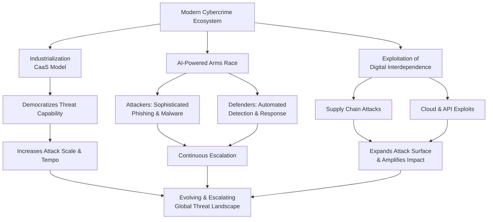

## 2. Attack Techniques: A Taxonomy of Threats

Modern cyber threats can be categorized by their primary attack vector. The following taxonomy organizes prevalent techniques based on whether they exploit human psychology, technical system flaws, deploy malicious software, or target emerging technologies.

### 2.1 Social Engineering & Human Exploitation
These attacks manipulate human psychology—such as trust, fear, curiosity, or a desire to be helpful—to bypass technical security controls. They remain profoundly effective, with approximately **one-third of data breaches attributed to social engineering tactics**.

*   **Phishing and Its Variants:** The foundational social engineering attack, phishing uses deceptive communications to steal credentials or deliver malware. Its evolution has led to more targeted and channel-specific forms:
    *   **Spear Phishing & Whaling:** Highly personalized attacks targeting specific individuals or high-value executives (whaling), often using researched details to create compelling lures.
    *   **Smishing and Vishing:** Phishing conducted via SMS (smishing) or voice calls (vishing). Vishing is particularly dangerous when combined with AI-powered voice cloning technology.
    *   **Business Email Compromise (BEC):** A high-impact fraud where attackers impersonate executives to authorize fraudulent wire transfers or disclose sensitive data, often relying on compromised email accounts and careful pretexting.
*   **Pretexting and Baiting:** These techniques involve creating a fabricated scenario (pretext) or offering something enticing (bait) to elicit a action from the victim. Pretexting often involves impersonating authority figures, while baiting may use physical media like malware-laden USB drives left in public spaces.
*   **Exploitation of Trust Relationships:** This category includes attacks that abuse perceived social or professional bonds. **Honeytraps** (or romance scams) create false intimate relationships to extract money or information. **Quid pro quo** attacks offer a service or benefit in exchange for login credentials or access. **Tailgating** is a physical technique where an unauthorized person gains access to a restricted area by following an employee.

### 2.2 Technical & Network-Based Exploits
These attacks target vulnerabilities in software, hardware, network protocols, and system configurations.

*   **Zero-Day Exploits:** These are among the most severe threats, targeting software vulnerabilities unknown to the vendor and for which no patch exists. While they constitute a small percentage of all vulnerabilities, their impact can be vast, as they leave systems defenseless until a fix is developed. The lifecycle of a zero-day is a race between vendors developing patches and attackers weaponizing the flaw. Famous examples include the Stuxnet worm and the Log4Shell vulnerability.
*   **Man-in-the-Middle (MitM) Attacks:** Attackers secretly intercept and potentially alter communications between two parties who believe they are directly communicating. Modern MitM attacks often exploit weaknesses in public Wi-Fi, compromised routers, or flaws in encryption protocols.
*   **Injection Attacks & Application Exploits:** These target web applications by sending malicious data that an interpreter executes as a command. **SQL Injection** manipulates databases, while **Cross-Site Scripting (XSS)** injects malicious scripts into webpages viewed by other users.
*   **Denial-of-Service (DoS/DDoS) Attacks:** Designed to disrupt service availability by overwhelming a system with traffic. Techniques have evolved to include **multi-vector attacks** that combine different methods, and **amplification attacks** that use vulnerable public servers to magnify the volume of attack traffic.

### 2.3 Malware and Malicious Code
Malware remains a core tool for cybercriminals, with its capabilities enhanced by AI and evasion techniques.

*   **Ransomware:** This malware encrypts a victim's files, demanding payment for decryption. The model has evolved into **"double extortion,"** where attackers also steal data and threaten to publish it unless paid. The rise of **Ransomware-as-a-Service (RaaS)** has fueled its proliferation.
*   **Fileless Malware:** This sophisticated threat operates in a system's memory (RAM) without writing files to disk, making it difficult for traditional antivirus software to detect.
*   **Spyware & Keyloggers:** Designed to covertly gather sensitive information, including keystrokes, login credentials, and financial data.
*   **Cryptojacking:** Malicious software that hijacks a victim's computing resources to mine cryptocurrency, degrading system performance and increasing operational costs.

### 2.4 Emerging Technology & Platform Threats
As new technologies are adopted, they create novel attack surfaces for criminals to exploit.

*   **AI-Driven Impersonation & Deepfakes:** Generative AI is used to create hyper-realistic fake videos, audio, and images. This technology enables convincing executive impersonation fraud, fake news, and sophisticated disinformation campaigns.
*   **Cloud & API Exploits:** Misconfigured cloud storage, excessive access permissions, and insecure Application Programming Interfaces (APIs) are frequent causes of major data breaches, as they can expose sensitive data directly to the internet.
*   **IoT and OT Exploitation:** The proliferation of Internet of Things (IoT) and Operational Technology (OT) devices—often with weak security—expands the attack surface into physical domains, risking disruption to critical infrastructure, smart homes, and industrial control systems.
*   **Supply Chain Compromises:** Attackers infiltrate an organization by targeting its less-secure vendors or software providers, poisoning updates or compromising development tools to distribute malware to downstream customers.

## 3. Defense and Mitigation Strategies

A robust defense requires a layered, proactive approach that addresses both human and technical vulnerabilities.

### 3.1 Foundational Security Hygiene
These are non-negotiable practices that form the bedrock of security.

*   **Patch Management & Vulnerability Prioritization:** Promptly applying software patches is critical. Organizations should prioritize remediating vulnerabilities listed in authoritative catalogs like CISA's Known Exploited Vulnerabilities (KEV) catalog.
*   **Strong Access Controls:** Implement **Multi-Factor Authentication (MFA)** universally and enforce the **principle of least privilege**, ensuring users and systems have only the access necessary to perform their functions.
*   **Employee Awareness Training:** Regular, engaging training is essential to help staff recognize and report phishing attempts, social engineering tactics, and other security threats.

### 3.2 Advanced Proactive Measures
To combat modern threats, organizations must adopt more dynamic and intelligent defenses.

*   **Adopt a Zero-Trust Architecture:** This security model operates on the principle of "never trust, always verify." It requires continuous verification of identity and device health for every access request, minimizing the damage from credential theft or network breaches.
*   **Leverage AI-Powered Defense Tools:** Deploy security solutions that use machine learning and behavioral analytics to detect anomalies, identify unknown threats (like fileless malware or zero-day exploits), and automate response actions.
*   **Implement Comprehensive Attack Surface Management:** Use tools to continuously discover, inventory, and assess the security posture of all digital assets—including cloud instances, APIs, and remote devices—from an attacker's perspective.
*   **Develop a Formal Incident Response Plan:** Prepare for breaches with a tested plan that defines roles, communication protocols, and procedures for containment, eradication, and recovery.

The following table outlines key defensive actions aligned with specific threat categories:

| Threat Category | Primary Defensive Strategies |
| :--- | :--- |
| **Social Engineering** | Security awareness training; Email/spam filtering; MFA; Verification protocols for financial requests. |
| **Zero-Day & Unknown Threats** | Zero-Trust Architecture; Behavioral-based detection (EDR/XDR); Prompt patch application; Network segmentation. |
| **Ransomware & Malware** | Regular, isolated data backups; Next-Gen Antivirus (NGAV); Least privilege access; Disabling macro scripts from email. |
| **Cloud & API Exploits** | Configuration auditing tools; Principle of least privilege for cloud identities; API security testing; Encryption of data at rest and in transit. |
| **Supply Chain Attacks** | Software Bill of Materials (SBOM) analysis; Vendor security assessments; Network segmentation for third-party access. |

## 4. Conclusion: The Path Forward

The cyber threat landscape of 2025 is characterized by its rapid evolution, industrial scale, and increasing sophistication powered by AI. No organization or individual is immune. Defense requires moving beyond reactive, perimeter-based security to a posture of **continuous vigilance and adaptation**.

The most critical evolution is the shift toward **collaborative defense**. As noted by industry leaders, "Fraudsters don't differentiate between data sources, so why should we?". Success hinges on sharing threat intelligence across industries and sectors, as exemplified by collaborations between financial networks and telecommunications providers to disrupt scam operations. Ultimately, building a resilient digital future depends on integrating robust technical controls, fostering a pervasive culture of security awareness, and participating in collective defense initiatives to raise the cost and complexity for adversaries operating globally.

    

<h1 align="center">Offensive vs Defensive Cybersecurity Techniques.</h1>

<h3 align="center">Comprehensive Reference for Red Teamers and Blue Teamers.</h3>

 

## Section 1 — Network, Application, and Protocol-Level Techniques:

| **Offensive Technique (Red Team)** | **Defensive Technique (Blue Team)** | **Description**                                                                                                                                          |
| ---------------------------------- | ----------------------------------- | -------------------------------------------------------------------------------------------------------------------------------------------------------- |
| Phishing                           | Anti-Phishing Controls              | Red team crafts deceptive emails to gain credentials or deliver payloads; defenders implement filtering, MFA, and user training. ([networkkings.org][1]) |
| SQL Injection                      | Input Validation, WAF               | Attackers exploit insufficient input sanitation in web apps; defenders enforce parameterized queries, WAF rules. ([appsecure.security][2])               |
| Cross-Site Scripting (XSS)         | Output Encoding, CSP                | Red team uses script injection to hijack sessions; blue team mitigates with input/output handling and Content Security Policy. ([appsecure.security][2]) |
| Man-in-the-Middle (MitM)           | TLS/HTTPS, Network Segmentation     | Interception of traffic; defenders use encryption and secure network architecture. ([networkkings.org][1])                                               |
| DNS Spoofing & Tunneling           | DNSSEC, Monitoring                  | DNS manipulation or covert channels; defenders implement DNS security extensions and anomaly detection. ([appsecure.security][2])                        |
| Rogue Access Points / Evil Twin    | Wireless Access Control, 802.1X     | Attackers establish unauthorized Wi-Fi; defenders enforce secure authentication and RF scanning. ([appsecure.security][2])                               |
| Session Hijacking                  | Session Management Controls         | Attackers take over active sessions; defenders rotate session tokens, detect anomalies. ([networkkings.org][1])                                          |
| Brute Force & Credential Stuffing  | Rate Limiting, Account Lockouts     | Attackers guess passwords; defenders enforce adaptive throttling and MFA. ([appsecure.security][2])                                                      |
| Privilege Escalation               | Least Privilege, EDR Controls       | Exploiting permissions; defenders harden access controls and monitor behavior. ([appsecure.security][2])                                                 |
| Command Injection, Code Injection  | Input Fencing, Secure Coding        | Attackers inject OS or code commands; defenders enforce secure coding and static analysis. ([appsecure.security][2])                                     |
| Remote Code Execution (RCE)        | Patch Management, IDS/IPS           | Unpatched flaws lead to remote compromise; defenders patch, monitor signatures. ([appsecure.security][2])                                                |

 

## Section 2 — Malware, Automated, and Persistent Threat Techniques:

| **Offensive Technique (Red Team)**   | **Defensive Technique (Blue Team)**         | **Description**                                                                                                              |
| ------------------------------------ | ------------------------------------------- | ---------------------------------------------------------------------------------------------------------------------------- |
| Malware Deployment                   | Endpoint Protection & Sandbox               | Attackers install malicious software; defenders use EDR, AV, and sandbox analysis. ([appsecure.security][2])                 |
| Fileless Malware                     | Behavioral Detection                        | Attacks in memory evade traditional AV; defenders must use behavior analytics. ([appsecure.security][2])                     |
| Polymorphic Malware & Exploit Kits   | Threat Intelligence & Updates               | Changing malware signatures; defenders integrate threat feeds and patch quickly. ([appsecure.security][2])                   |
| Advanced Persistent Threats (APTs)   | Threat Hunting & SIEM                       | Long-term stealthy intrusions; defenders hunt, correlate logs in SIEM. ([networkkings.org][1])                               |
| Zero-Day Exploits                    | Layered Hardening, Vulnerability Management | Unknown bugs exploited by red teams; defenders employ segmentation and rapid patching. ([appsecure.security][2])             |
| Distributed Denial of Service (DDoS) | DDoS Mitigation Services                    | Volumetric attacks; defenders scale infrastructure or use scrubbing services. ([appsecure.security][2])                      |
| Botnet & Automated Scanning          | Network Traffic Analytics                   | Coordination of compromised hosts; defenders analyze for patterns of scanning/command and control. ([appsecure.security][2]) |

 

## Section 3 — Social Engineering and Human-Centric Techniques:

| **Offensive Technique (Red Team)**                      | **Defensive Technique (Blue Team)**   | **Description**                                                                                          |
| ------------------------------------------------------- | ------------------------------------- | -------------------------------------------------------------------------------------------------------- |
| Social Engineering (Pretexting, Baiting)                | Security Awareness & Simulations      | Exploiting human trust; defenders provide training, regular test campaigns. ([networkkings.org][1])      |
| Phishing Variants (Vishing, Smishing)                   | Multi-Factor Authentication & Filters | Phone/SMS/email deception; defenders use layered authentication and filtering. ([appsecure.security][2]) |
| Physical Security Breaches (Tailgating, Access Cloning) | Physical Access Controls & CCTV       | In-person entry attacks; defenders use badge readers, biometrics, surveillance. ([networkkings.org][1])  |
| Insider Threat Simulation                               | User Monitoring & Privilege Review    | Testing internal risk; defenders review access and monitor user activities. ([appsecure.security][2])    |

 

## Section 4 — System, Protocol, and Side-Channel Attacks:

| **Offensive Technique (Red Team)**   | **Defensive Technique (Blue Team)**  | **Description**                                                                                         |
| ------------------------------------ | ------------------------------------ | ------------------------------------------------------------------------------------------------------- |
| Side-Channel Attacks                 | Hardware Hardening, Monitoring       | Exploits indirect signals (timing, power); defenders mitigate by design. ([appsecure.security][2])      |
| Keylogging                           | Anti-Keylogging/EDR Monitoring       | Capture of keystrokes; defenders deploy EDR/anti-spyware. ([appsecure.security][2])                     |
| Cryptographic Attacks                | Robust Cryptography & Key Management | Weak cipher exploitation; defenders enforce strong algorithms. ([appsecure.security][2])                |
| File Inclusion & Directory Traversal | Input Sanitization                   | Path exploits in web apps; defenders validate paths and user inputs. ([appsecure.security][2])          |
| Code Injection Variants              | Secure Development Lifecycle         | Multiple injection vectors; defenders enforce secure coding and code reviews. ([appsecure.security][2]) |

  

<h1 align="center">The Adversarial Cycle: A Technical Analysis of Offensive and Defensive Security Techniques.</h1>

 

## Executive Summary

In the modern cybersecurity landscape, organizational resilience is forged in the continuous contest between offensive (Red Team) and defensive (Blue Team) security practices. This document provides a comprehensive, technical breakdown of this adversarial cycle. It maps core attack techniques employed by Red Teams—and malicious actors—to the corresponding defensive strategies implemented by Blue Teams. By understanding both sides of this equation, organizations can develop more robust, proactive security postures that move beyond compliance to achieve genuine cyber resilience. The following analysis structures these techniques into logical phases of an attack chain, detailing the tools, methodologies, and mindsets that define contemporary security operations.

## 1. Introduction: The Red and Blue Team Paradigm

The Red Team/Blue Team model is a cornerstone of mature security programs, embodying the principle of "assume breach."

*   **Red Team (Offensive Security):** Authorized adversarial simulators whose mission is to emulate real-world threat actors. Their goal is not merely to find vulnerabilities but to chain them together, exploiting people, processes, and technology to achieve specific objectives (e.g., data exfiltration, domain compromise). Their work is tactical, stealthy, and focused on demonstrating impact, providing a true assessment of an organization's detection and response capabilities.
*   **Blue Team (Defensive Security):** The guardians of the enterprise, comprising Security Operations Center (SOC) analysts, incident responders, and security engineers. Their mission is to protect assets, maintain visibility, detect anomalies, and rapidly respond to and recover from incidents. They operate on a foundation of robust architecture, continuous monitoring, and well-rehearsed processes to mitigate the techniques employed by Red Teams and genuine attackers.

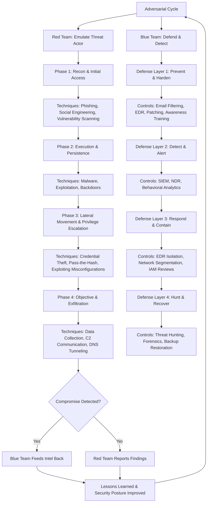

## 2. Technical Breakdown: Offensive Techniques vs. Defensive Controls

This section categorizes common techniques into phases of a generalized attack chain, providing detailed insights from both offensive and defensive perspectives.

### **Phase 1: Initial Access & Social Engineering**

This phase focuses on breaching the perimeter, most often by manipulating human psychology or exploiting exposed services.

| Offensive Technique (Red Team) | Defensive Strategy (Blue Team) |
| :--- | :--- |
| **Phishing & Variants (Spear, Whaling, Smishing, Vishing, Quishing)** | **Multi-Layered Email & Web Security** |
| **Social Engineering** | **Security Awareness & Process Hardening** |
| **Exploiting Public-Facing Applications** | **Attack Surface Reduction & Patching** |
| **Wireless & Physical Intrusion**  (WiFi Hacking, Rogue APs, Bluetooth Hacking, Tailgating, USB Drops) | **Physical & Network Access Control** |

*   **Phishing (Red Team):** Red teams craft targeted emails (spear-phishing) or texts (smishing) that leverage OSINT (Open Source Intelligence) on employees. This includes QR code phishing (quishing) to bypass email filters and voice phishing (vishing) for high-value targets (whaling). The objective is to deliver a malicious payload or harvest credentials via a convincing, cloned login portal.
*   **Defending Against Phishing (Blue Team):** Defense employs layered filtering (SPF, DKIM, DMARC, AI-based detonation chambers), robust endpoint protection that analyzes macro and script behavior, and continuous user awareness training with simulated phishing campaigns. Advanced solutions monitor for credential submissions to unauthorized domains.
*   **Social Engineering (Red Team):** This broad category includes pretexting, baiting (e.g., malicious USB drops), and quid pro quo scams. Red teams exploit trust, urgency, or curiosity to gain information, physical access, or system footholds. Techniques like "tailgating" into secure areas or "dumpster diving" for sensitive documents are common physical social engineering tactics.
*   **Defending Against Social Engineering (Blue Team):** Defense is rooted in culture and procedure. This includes mandatory security training that goes beyond phishing, clear reporting channels for suspicious requests, strict "clean desk" policies, enforced use of identity badges, and shredding of sensitive documents. A principle of least privilege and verification for all access requests is critical.
*   **WiFi & Rogue Access Points (Red Team):** Red teams may set up "Evil Twin" access points with legitimate-sounding SSIDs to capture credentials or deploy malware. They also probe for weak wireless protocols (WEP, WPA2 with weak handshakes) or use tools to perform packet capture and de-authentication attacks to force clients onto rogue networks.
*   **Defending Against Wireless Attacks (Blue Team):** Defenses mandate WPA3-Enterprise with 802.1X authentication (EAP-TLS) where possible, ensuring unique credentials for network access. Regular wireless surveys using specialized tools can identify rogue access points. Network segmentation should isolate guest and IoT wireless networks from critical corporate assets.

### **Phase 2: Execution, Persistence, & Exploitation**

Once initial access is gained, attackers seek to execute code, maintain persistence, and exploit system vulnerabilities.

| Offensive Technique (Red Team) | Defensive Strategy (Blue Team) |
| :--- | :--- |
| **Malware & Payload Delivery**  (Trojans, Ransomware, Fileless Malware, Rootkits, Spyware) | **Endpoint Detection & Response (EDR/XDR)** |
| **Exploiting Vulnerabilities**  (Zero-Days, N-Day, SQLi, XSS, File Inclusion, RCE) | **Vulnerability Management & Secure Coding** |
| **Privilege Escalation** | **Privileged Access Management (PAM) & Hardening** |

*   **Malware & Payload Delivery (Red Team):** Red teams use custom or obfuscated payloads to avoid signature-based detection. Fileless malware, which resides in memory using tools like PowerShell, WMI, or legitimate administrative frameworks (e.g., Cobalt Strike, Mimikatz), is prevalent for execution and credential theft. Persistence is achieved via registry run keys, scheduled tasks, service creation, or bootkit mechanisms.
*   **Defending Against Malware (Blue Team):** Modern defense relies on EDR/XDR platforms that use behavioral analytics to detect malicious activity chains (e.g., process injection, anomalous PowerShell execution, connection to known C2 IPs). Application allow-listing, macro restrictions, and regular host integrity checks are foundational controls. Isolating and sandboxing unknown applications can prevent execution.
*   **Exploiting Vulnerabilities (Red Team):** This includes both known (N-day) and unknown (Zero-day) vulnerabilities. Red teams automate scanning for common web vulnerabilities like SQL Injection (SQLi) and Cross-Site Scripting (XSS) but will also conduct manual code review and fuzzing for more subtle flaws like Remote Code Execution (RCE) or Local File Inclusion (LFI).
*   **Defending Against Vulnerability Exploitation (Blue Team):** A rigorous patch management program is non-negotiable. This must be supplemented with regular vulnerability scans and penetration tests. Web Application Firewalls (WAFs) provide virtual patches for known web flaws, while Input validation, parameterized queries, and secure coding practices address the root cause in development.
*   **Privilege Escalation (Red Team):** Attackers seek to move from a standard user to administrative or SYSTEM-level privileges. This is achieved by exploiting kernel or service vulnerabilities, abusing misconfigured service permissions (e.g., writable service binaries), credential dumping from memory, or leveraging insecure file/folder permissions that allow binary replacement.
*   **Defending Against Privilege Escalation (Blue Team):** Defense involves strict adherence to the principle of least privilege, ensuring users and services run with the minimum permissions required. Regular configuration audits using benchmarks like CIS, deployment of Privileged Access Management (PAM) solutions for credential vaulting, and kernel-level exploit mitigations (e.g., Control Flow Guard) are essential.

### **Phase 3: Lateral Movement, Command & Control**

After establishing a beachhead, attackers move laterally to locate and access high-value targets.

| Offensive Technique (Red Team) | Defensive Strategy (Blue Team) |
| :--- | :--- |
| **Credential Attacks & Theft**  (Keylogging, Credential Stuffing, Password Spraying) | **Identity & Access Governance** |
| **Lateral Movement Techniques**  (Pass-the-Hash, Exploiting Trusts) | **Network Segmentation & Micro-Segmentation** |
| **Command & Control (C2)**  (DNS Tunneling, HTTPS Blending, Steganography) | **Network Traffic Analysis & Egress Filtering** |

*   **Credential Attacks (Red Team):** Beyond phishing, Red teams perform password spraying (trying one common password against many accounts) and credential stuffing (using known breached credentials) to avoid account lockouts. Once on a system, they use tools to extract hashes or clear-text passwords from memory, the LSASS process, or credential managers for reuse (Pass-the-Hash/Ticket attacks).
*   **Defending Against Credential Attacks (Blue Team):** Implement strong password policies complemented by phishing-resistant Multi-Factor Authentication (MFA). Monitor for anomalous login patterns (impossible travel, unfamiliar locations) using Identity Threat Detection and Response (ITDR). Apply Credential Guard on Windows systems to protect hashes and regularly review account permissions.
*   **Lateral Movement (Red Team):** Using stolen credentials or exploited vulnerabilities, Red teams move between systems using tools like PSExec, WMI, or RDP. They map the network by enumerating shares, active directory trusts, and administrative groups to plan their path to domain controllers or data repositories.
*   **Defending Against Lateral Movement (Blue Team):** Implement strong network segmentation to limit broadcast traffic and contain breaches. Use micro-segmentation for critical assets. Deploy Endpoint Detection and Response (EDR) tools that can detect and block remote execution techniques. Limit the use of domain-wide administrative accounts and enforce strict firewall rules between network segments.
*   **Command & Control (C2) (Red Team):** To maintain communication with compromised hosts, Red teams use covert channels that blend with normal traffic. This includes DNS tunneling (hiding data in DNS queries), using popular cloud services (Dropbox, GitHub) as dead-drop resolvers, or employing encrypted HTTPS beacons that mimic legitimate user traffic to avoid detection by simple IP blocklists.
*   **Defending Against C2 (Blue Team):** Deploy Network Detection and Response (NDR) solutions that analyze traffic flows for anomalies (e.g., a host making regular, periodic DNS queries to a new domain). Implement strict egress filtering at the proxy and firewall, whitelisting only necessary external domains and ports. Use SSL/TLS inspection where legally and technically feasible to detect malware within encrypted streams.

### **Phase 4: Impact & Objectives**

The final phase involves achieving the attack's goal, whether data theft, destruction, or disruption.

| Offensive Technique (Red Team) | Defensive Strategy (Blue Team) |
| :--- | :--- |
| **Data Exfiltration & Theft** | **Data Loss Prevention (DLP) & Encryption** |
| **Denial of Service (DoS/DDoS)** | **DDoS Mitigation & Resilient Architecture** |
| **Destructive Attacks**  (Logic Bombs, Wiper Malware) | **Immutable Backups & Recovery Planning** |
| **Advanced & Emerging Threats**  (APTs, Supply Chain, AI-Powered Attacks) | **Threat Intelligence & Adaptive Defense** |

*   **Data Exfiltration (Red Team):** Data is often compressed, encrypted, and exfiltrated slowly over allowed protocols (HTTPS, DNS, SMB over internet) to avoid triggering data transfer alarms. Red teams may stage data in an intermediate location within the network before final extraction.
*   **Defending Against Data Exfiltration (Blue Team):** Implement Data Loss Prevention (DLP) solutions that can classify sensitive data and monitor/block its unauthorized transfer. Encrypt sensitive data at rest and in transit. Monitor for large or unusual outbound data transfers from endpoints or servers, especially to unknown external IP addresses or cloud storage providers.
*   **Denial of Service (Red Team):** While often noisy, DDoS attacks can be used as a smokescreen for other malicious activity or to disrupt business operations directly. Red teams may test an organization's resilience with smaller-scale DoS attacks (e.g., SYN floods, application-layer attacks) during exercises.
*   **Defending Against DDoS (Blue Team):** Utilize cloud-based DDoS mitigation services that can absorb large-scale volumetric attacks. On-premise, ensure network devices are hardened against flooding attacks. Design applications for scalability and implement rate-limiting and geo-blocking where appropriate to handle application-layer attacks.
*   **Supply Chain & AI-Powered Attacks (Red Team):** Sophisticated adversaries compromise trusted software vendors or third-party services to distribute malware (supply chain attack). The rise of AI also enables more convincing deepfakes for social engineering, automated vulnerability discovery, and polymorphic malware that adapts to evade detection.
*   **Defending Against Advanced Threats (Blue Team):** Defending requires a threat-intelligence-driven approach. This includes monitoring for discussions about your organization or vendors on dark web forums, implementing strict software supply chain security (e.g., Software Bill of Materials - SBOM), and using deception technologies (honeytokens, canaries) to detect novel attacker behavior. Security teams must also evaluate and test the security of any integrated AI/ML systems.

## 3. The Human Element: Beyond Technical Controls

A significant portion of the raw data provided pertains to **social engineering scams** (e.g., Honey trapping, Sextortion, Investment fraud, Tech support scams). These are not "hacking techniques" in the technical sense but are critical components of the **Initial Access** phase for both cybercriminals and Red Teams.

*   **Red Team Perspective:** These scams represent a rich vein for pretext development. A Red teamer might craft a romance scam (Catfishing) persona on LinkedIn to build trust with an employee before sending a malicious file, or impersonate tech support (Vishing) to gain remote access credentials. The goal is to bypass all technical controls by exploiting human psychology.
*   **Blue Team Defense:** Technical controls are secondary here. Primary defense is a resilient, aware organizational culture. This involves:
    *   Continuous, engaging security awareness training that uses real-world examples of these scams.
    *   Clear, non-punitive reporting procedures for employees who suspect they are being targeted.
    *   Established verification processes for any unusual financial or data requests, especially those invoking urgency or secrecy.
    *   Public-facing policies that make it harder for scammers to gather information (e.g., limiting employee details on company websites).

## 4. Strategic Conclusion: Fostering a Proactive Security Posture

The adversarial cycle is not a battle to be won but a continuous process to be managed. The most secure organizations are those that effectively integrate Red and Blue team functions.

*   **Purple Teaming:** The collaborative exercise where Red and Blue teams work in tandem, with the Red team executing attacks and the Blue team actively detecting and responding in real-time. This is the most effective way to test and improve detection logic, response playbooks, and communication pathways.
*   **Metrics that Matter:** Move beyond "number of vulnerabilities found" to "mean time to detect (MTTD)" and "mean time to respond (MTTR)" to incidents. Measure the effectiveness of security awareness by simulated phishing click rates and report rates.
*   **Assume Breach:** The foundational mindset. Architect networks, implement controls, and design processes with the assumption that an adversary is already inside. This leads to strategies like zero-trust architecture, pervasive encryption, and robust logging and auditing.

By understanding the detailed techniques outlined in this document from both offensive and defensive viewpoints, security leaders can make informed decisions about resource allocation, tool selection, and training programs. The ultimate goal is to create a security program that is not just a static set of controls, but a dynamic, intelligent system that learns and adapts from each engagement in the ongoing adversarial cycle.

 
    

<h4 align="center">STAY TUNED FOR THE LATEST UPDATES!</h4>

  

    

    
