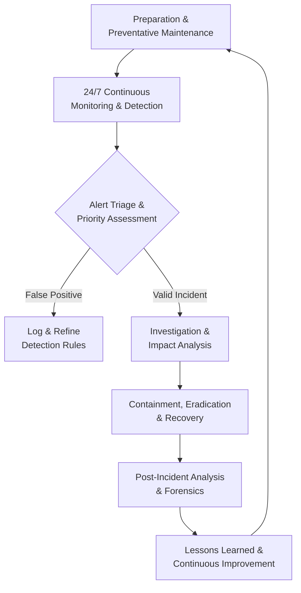
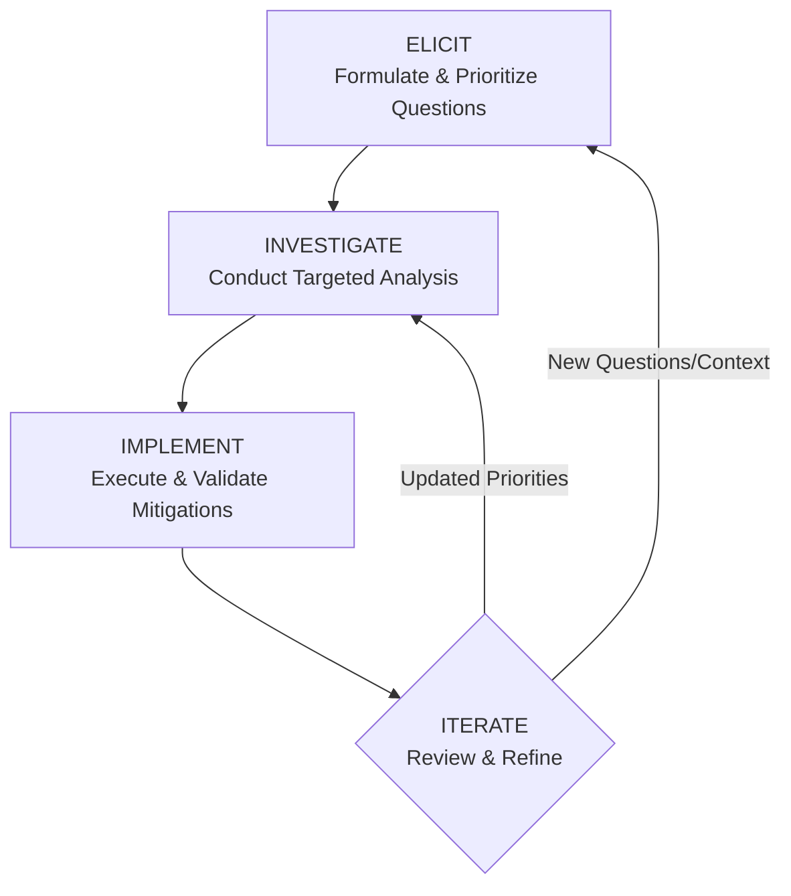

    

<h1 align="center">MR. SAM ROHAN</h1>
<h3 align="center">PRECISION IN EXECUTION - SUPREMACY IN IMPACT!</h3>

 

    

  

<h1 align="center">The Definitive Guide to Modern Security Operations Centers.</h1>

 

## Executive Summary
In an era defined by digital transformation and escalating cyber threats, the Security Operations Center (SOC) has evolved from a peripheral IT function to the strategic nerve center of organizational defense. This document provides a comprehensive analysis of the modern SOC, detailing its architecture, roles, operational impact, and evolution in confronting contemporary security challenges across both IT and industrial environments.

## 1.0 Introduction: The Strategic Imperative of the Modern SOC

A Security Operations Center (SOC) represents a centralized organizational unit dedicated to continuously monitoring, detecting, analyzing, investigating, and responding to cybersecurity threats and incidents. By orchestrating people, processes, and technology, the SOC serves as the primary guardian of an organization's security posture, protecting critical assets, ensuring business continuity, and maintaining regulatory compliance.

The modern SOC's mandate extends beyond traditional network boundaries to encompass cloud infrastructure, operational technology (OT), endpoints, identities, and data—wherever business value resides. Its operational philosophy has shifted from reactive alert monitoring to proactive threat hunting and intelligence-driven defense, enabled by automation, artificial intelligence (AI), and integrated security platforms.

## 2.0 Core Functions & Operational Framework

The SOC executes a continuous cycle of security operations aligned with the **Identify, Investigate, Mitigate, and Continuously Improve** framework. This operational model ensures both immediate incident response and long-term security enhancement.

### 2.1 Primary SOC Functions
*   **24/7 Proactive Monitoring & Surveillance:** SOCs maintain uninterrupted visibility across the entire digital estate—networks, endpoints, cloud workloads, applications, and data. By analyzing logs, traffic patterns, and telemetry from integrated security tools, analysts identify anomalies and indicators of compromise (IoCs) that signal potential security events, aiming to reduce Mean Time to Detection (MTTD).
*   **Incident Detection, Triage & Response:** When a security event is detected, the SOC executes a structured response: assessing severity, determining scope, containing the threat, eradicating the cause, recovering systems, and conducting post-incident analysis. This process minimizes damage and operational disruption.
*   **Threat Intelligence Integration & Analysis:** SOCs consume, analyze, and operationalize threat intelligence from internal investigations, open-source feeds, commercial providers, and industry information sharing groups. This intelligence informs detection rules, reveals attacker tactics, techniques, and procedures (TTPs), and enables proactive defense against emerging threats.
*   **Vulnerability Management & Proactive Remediation:** Through continuous vulnerability assessment, patch management oversight, and configuration hardening, SOC teams work to reduce the organization's attack surface. They prioritize remediation based on exploitability, asset criticality, and threat intelligence.
*   **Digital Forensics & Root Cause Analysis:** Following an incident, forensic specialists conduct detailed investigations to understand the attack timeline, methods, and impact. This analysis is crucial for ensuring complete remediation, supporting legal or regulatory requirements, and refining defenses to prevent recurrence.
*   **Compliance Assurance & Reporting:** SOCs play a key role in demonstrating adherence to regulatory frameworks (e.g., GDPR, HIPAA, PCI-DSS, NIST CSF) through continuous control monitoring, audit log maintenance, and generating compliance reports for internal and external stakeholders.

### 2.2 The SOC Operational Workflow
The following flowchart illustrates the continuous, iterative lifecycle of security operations within a mature SOC:

## 3.0 SOC Team Structure: Roles & Hierarchical Responsibilities

A SOC's effectiveness hinges on a clearly defined team structure with specialized roles operating in a tiered model for efficient escalation and expertise application.

### 3.1 Tiered Analyst Structure

| Tier | Role Title | Primary Responsibilities | Key Skills & Focus |
| :--- | :--- | :--- | :--- |
| **Tier 1** | **Triage Specialist / Alert Analyst** | Monitors security alerts from SIEM/XDR; performs initial triage and classification; enriches alerts with contextual data; filters false positives; manages security tools; escalates validated incidents to Tier 2. | Alert fatigue management, foundational security tool operation, basic log analysis, understanding of common IoCs. |
| **Tier 2** | **Incident Responder / Security Analyst** | Conducts deep-dive investigation of escalated incidents; utilizes threat intelligence to understand attack scope and actor TTPs; determines affected systems; executes containment and remediation strategies. | Digital forensics basics, malware analysis, threat intelligence application, incident response procedures. |
| **Tier 3** | **Threat Hunter / Senior Security Analyst** | Proactively hunts for covert threats and security gaps not caught by automated tools; performs vulnerability assessments and penetration tests; analyzes complex attack patterns; leads response to major incidents; optimizes SOC tools and processes. | Advanced persistent threat (APT) analysis, reverse engineering, security architecture review, purple teaming, threat hunting methodologies. |
| **Tier 4** | **SOC Manager / Lead** | Oversees all SOC operations, personnel, and strategy; manages budgets and resources; reports to CISO/executive leadership; handles major incident communication; responsible for hiring, training, and process development. | Leadership, project management, risk management, executive communication, strategic planning. |

### 3.2 Specialized & Supporting Roles
*   **Security Engineer/Architect:** Designs, implements, and maintains the organization's security infrastructure (firewalls, IDS/IPS, SIEM, etc.). Ensures security tools are integrated, optimized, and evolving with the threat landscape.
*   **Threat Intelligence Analyst:** Specializes in collecting, analyzing, and disseminating actionable intelligence on threat actors, campaigns, and vulnerabilities to inform proactive defensive measures.
*   **Digital Forensics & Incident Response (DFIR) Specialist:** Focuses exclusively on post-breach investigation, evidence collection, malware reverse engineering, and providing detailed attack narratives for legal or recovery purposes.
*   **Compliance Auditor:** Ensures SOC processes and controls align with relevant regulatory standards and internal policies, managing evidence collection and audit readiness.
*   **Security Automation/SOAR Engineer:** Develops and maintains automated playbooks and workflows to orchestrate response actions across disparate security tools, drastically reducing manual effort and response times.

## 4.0 Impact on Modern IT & Industrial Operations

### 4.1 For Traditional IT & Digital Business
*   The SOC enables **business resilience** by minimizing downtime and financial loss from cyber incidents, directly protecting revenue and customer trust.
*   It provides the **continuous control monitoring** necessary to navigate complex regulatory landscapes, avoiding hefty fines and reputational damage associated with non-compliance.
*   By securing cloud migrations, SaaS applications, and remote work infrastructures, the SOC acts as the **critical enabler of digital transformation**, allowing innovation to proceed with managed risk.
*   Through advanced analytics, the SOC shifts the security paradigm from reactive to **proactive risk management**, identifying and mitigating vulnerabilities before they are exploited.

### 4.2 For Industrial Operations & OT Environments
*   In Industrial Control Systems (ICS) and SCADA networks, the SOC adopts a **mission-centric approach**, prioritizing the safety and continuity of physical operations over traditional IT confidentiality goals.
*   SOC teams specializing in OT security must understand **protocol-specific threats** and the unique constraints of industrial environments, where patching cycles are long and system availability is paramount.
*   The convergence of IT and OT networks expands the attack surface. The SOC serves as the **bridge between these domains**, coordinating response that addresses both IT-borne threats and their potential physical consequences.
*   SOCs play a vital role in protecting against **industrial sabotage, ransomware targeting production**, and espionage aimed at intellectual property within manufacturing processes.

## 5.0 SOC Delivery Models & Evolution

Organizations can implement a SOC through various models, each with distinct advantages.

| Model | Description | Best For |
| :--- | :--- | :--- |
| **In-House SOC** | Dedicated, internal team using company-owned technology. Retains full control, context, and customization. | Large enterprises with significant resources, stringent compliance needs, and highly specialized environments. |
| **Virtual / Cloud SOC** | Team operates remotely, often leveraging cloud-native security platforms. Offers flexibility and access to talent regardless of location. | Distributed organizations, companies embracing cloud-first strategies, or those seeking operational flexibility. |
| **SOC-as-a-Service (Outsourced to MSSP/MDR)** | Fully managed detection and response provided by a third-party Managed Security Service Provider (MSSP) or Managed Detection and Response (MDR) provider. | Organizations lacking in-house expertise, seeking 24/7 coverage without the overhead of building a team, or needing to rapidly mature their security posture. |
| **Hybrid / Co-Managed SOC** | Blend of in-house and outsourced functions (e.g., internal Tier 3/management with outsourced 24/7 Tier 1 monitoring). Provides balance of control, context, and cost-effective scale. | Most organizations; allows internal focus on high-value tasks while leveraging external experts for foundational coverage and overflow support. |

## 6.0 The Future SOC: AI, Automation, and Proactive Defense

The next-generation SOC is being reshaped by powerful technological and methodological shifts.

*   **AI & Machine Learning as Force Multipliers:** AI will move beyond simple anomaly detection to predictive threat modeling, automated incident investigation, and intelligent response recommendations. Generative AI will act as an analyst co-pilot, summarizing incidents, drafting reports, and suggesting remediation steps.
*   **Hyperautomation through SOAR & XDR:** Security Orchestration, Automation, and Response (SOAR) platforms, integrated with Extended Detection and Response (XDR), will automate entire workflows—from alert enrichment and initial containment to evidence collection and ticket creation—freeing human analysts for complex decision-making.
*   **The Rise of Proactive Threat Hunting:** The future SOC will dedicate more resources to hunting, assuming adversaries are already inside the perimeter. This involves leveraging behavioral analytics, adversary emulation, and hypothesis-driven searches to uncover stealthy attacks.
*   **Unified Platforms Over Tool Sprawl:** To combat visibility gaps and analyst fatigue, organizations will consolidate onto unified security platforms that provide a single pane of glass for data, analytics, and response across network, endpoint, cloud, and identity.
*   **Focus on Metrics & Business Alignment:** SOCs will increasingly utilize business-relevant metrics like Risk Reduction Quantified, Business Process Recovery Time, and Security ROI to communicate value and align efforts with organizational objectives.

## 7.0 Conclusion: The SOC as a Business-Critical Foundation

The modern Security Operations Center is no longer a cost center but a **strategic asset** essential for business viability in the digital age. It is the engine of cyber resilience, transforming raw telemetry into actionable intelligence and coordinated response. By investing in a mature SOC—whether built internally, outsourced, or hybrid—organizations do not merely purchase technology; they cultivate a **core capability** to manage cyber risk, enable secure innovation, and protect their most valuable assets in an increasingly adversarial world. The evolution towards AI-augmented, proactive, and intelligence-driven operations is not optional; it is the necessary path to maintaining defensive advantage against an ever-evolving threat landscape.

    

<h1 align="center">Inquiry-Driven Cyber Defense (ICD): A Scalable Framework for Focused Security Operations.</h1>
 
 

## Executive Summary

Inquiry-Driven Cyber Defense (ICD) is a structured operational methodology that transforms ambiguous security challenges into measurable, evidence-based actions through systematic questioning. This framework replaces reactive, tool-centric approaches with a disciplined process that begins by explicitly defining critical knowledge gaps. ICD decomposes broad security objectives into discrete, answerable questions, creating a clear roadmap for execution, validation, and continuous adaptation. Designed for scalability and seamless integration into production environments, ICD ensures security resources are consistently aligned with the most impactful risks.

 

## 1. Conceptual Foundation: From Ambiguity to Action

Traditional security operations often falter due to vague objectives and an overreliance on tool outputs without contextual understanding. ICD mandates a fundamental shift: every security initiative must originate from a clearly articulated question that identifies a specific operational unknown. This approach moves teams beyond generic goals like "improve our security posture" or "harden the environment" and instead focuses on resolving explicit uncertainties that directly correspond to risk.

*   **ICD is inherently scalable**, functioning with equal efficacy for an individual analyst troubleshooting an alert, a team managing a vulnerability program, or an organization defining its annual security strategy. The same core principles apply regardless of scope, enabling consistent methodology across all levels of operation.
*   **ICD is fundamentally adaptive**, as its primary artifact—the Question Register—is a living document. Questions evolve in response to new threat intelligence, business changes, and technological shifts, ensuring the defense strategy remains relevant and proactive.
*   **ICD is production-ready**, designed to integrate directly with existing workflows such as incident response, risk management, and control assessments. It provides tangible inputs and outputs for these processes, bridging the gap between strategic goals and tactical execution.

## 2. Core Principles of ICD

The ICD framework is built upon five foundational principles that guide its application and ensure its effectiveness.

*   **Explicit Uncertainty Identification:** ICD eliminates tolerance for vague concerns by forcing the articulation of precise knowledge gaps. Instead of stating "we might have exposure," teams must formulate questions like, "Which of our externally facing Azure storage containers are configured for public anonymous read access?" This precision directs effort and enables measurement.
*   **Atomic Problem Decomposition:** Complex security challenges are broken down into fundamental, answerable questions. This decomposition prevents overwhelm, allows for parallel workstreams, and ensures each investigative action has a defined purpose and success criterion.
*   **Risk-Prioritized Execution:** Not all questions are equally urgent. ICD requires that questions be ranked based on potential impact (to confidentiality, integrity, and availability) and likelihood (informed by threat intelligence and asset criticality). This ensures that resources are consistently allocated to resolve the most critical unknowns first.
*   **Evidence-Based Action:** Decisions and mitigations within ICD must stem directly from answers validated through analysis, testing, or data collection. This principle replaces assumption and conjecture with empirical evidence, leading to more effective and defensible security controls.
*   **Iterative Refinement:** Security is a continuous cycle. Answering initial questions invariably generates deeper, more specific follow-up inquiries. This iterative process allows the security program to refine its understanding and defenses progressively, adapting to increased knowledge and changing conditions.

## 3. The ICD Operational Workflow

The ICD methodology is executed through a four-phase, iterative workflow. Each phase has distinct inputs, actions, and outputs, creating a closed-loop system for continuous security improvement.

### Phase 1: ELICIT – Formulate & Prioritize Questions
This phase translates broad security objectives into a prioritized list of specific, actionable questions.

*   **Input:** Security objectives, threat intelligence reports, audit findings, risk assessment data, and incident post-mortems.
*   **Action:** Conduct brainstorming sessions to generate questions using interrogatives (What, How, Where, Which, Who, When). Focus on uncovering concrete operational unknowns that, once answered, will directly reduce risk. All questions are logged in a central, version-controlled **Question Register**.
*   **Prioritization:** Questions are scored and ranked using a consistent risk rubric. Factors include potential business impact, asset criticality, exploit likelihood, and regulatory implications.
*   **Output:** A prioritized list of specific, answerable security questions documented in the Question Register.

### Phase 2: INVESTIGATE – Conduct Targeted Analysis
This phase involves executing precise investigative actions to gather evidence that definitively answers the prioritized questions.

*   **Input:** The prioritized Question Register.
*   **Action:** Design and execute targeted analysis tailored to each question. The investigation method is matched to the question type, leveraging appropriate tools and data sources.
*   **Output:** Evidence-based answers documented in the Question Register, including detailed notes on data sources, methodologies, and confidence levels.

**Table: Mapping Question Types to Investigation Methods**

| Question Type | Example Question | Investigation Methods & Tools |
| :--- | :--- | :--- |
| **Asset & Data Discovery** | “Where does our most sensitive PII data reside across the hybrid cloud environment?” | Data discovery scans, Cloud Security Posture Management (CSPM) tools, data classification platform queries, application owner interviews. |
| **Threat Exposure** | “What is our exposure to the newly disclosed critical vulnerability in SoftwareX?” | Vulnerability scanner correlation with asset inventory, exploitability analysis, threat intelligence platform queries for active exploitation. |
| **Control Effectiveness** | “Are our endpoint detection rules effectively identifying the latest living-off-the-land techniques?” | SIEM/EDR query development, purple team exercises simulating specific TTPs, analysis of detection alert logs and false negatives. |
| **Process & Configuration** | “How are administrative credentials for our core network devices managed and audited?” | Configuration management database (CMDB) review, password vault log analysis, network device configuration audit scripts. |

### Phase 3: IMPLEMENT – Execute & Validate Mitigations
Answers from the INVESTIGATE phase are translated into concrete security actions, which are then deployed and rigorously validated.

*   **Input:** Validated answers and evidence from the INVESTIGATE phase.
*   **Action:** Design and deploy controls, process changes, or configuration updates that directly address the identified gap. Crucially, each action must be followed by a validation step to confirm the mitigation is effective as intended.
*   **Output:** Implemented security controls or process changes, with validation results documented and linked to the original question in the Register.

### Phase 4: ITERATE – Review & Refine
This phase closes the loop, using the outcomes of the cycle to refine the security program and feed the next iteration of inquiry.

*   **Input:** Implementation outcomes, new threat intelligence, changing business context, and emerging vulnerabilities.
*   **Action:** Review the entire Question Register. Generate new follow-up questions based on findings, re-prioritize existing unanswered questions, and archive or update resolved items. Formalize validated knowledge into policies, playbooks, or architectural standards.
*   **Output:** An updated and reprioritized Question Register, new objectives for the next ICD cycle, and updated organizational knowledge bases.

## 4. Production Integration & Strategic Benefits

Implementing ICD yields significant operational and strategic advantages by introducing focus, measurability, and adaptability into the security function.

*   **Eliminates Ambiguity and Enhances Focus:** By defining success as answering specific questions, ICD provides unambiguous direction for security teams. Efforts shift from "running tools" to "seeking answers," which dramatically reduces wasted effort and tool sprawl. Teams select the right tool for the specific question at hand, rather than managing tool outputs in search of a problem.
*   **Delivers Measurable, Auditable Progress:** Each answered question and its corresponding implemented mitigation represents a concrete unit of risk reduction. Progress is transparently tracked via the status of the Question Register, providing clear metrics for leadership reporting and audit demonstrations. This evidence-based approach builds credibility and justifies resource allocation.
*   **Ensures Optimal Resource Allocation:** The built-in, risk-based prioritization mechanism acts as a forcing function, ensuring that time, budget, and personnel are consistently applied to the organization's most pressing security unknowns. This leads to a higher return on security investment.
*   **Fosters Collaboration and Knowledge Retention:** The Question Register serves as a centralized repository of context, documenting what is known, what is being investigated, and why. This is invaluable for onboarding new team members, handing off tasks, providing audit trails, and ensuring institutional knowledge is preserved despite personnel changes.
*   **Builds an Inherently Adaptive Posture:** The framework is designed for change. New threats, such as a zero-day exploit, immediately generate high-priority questions (e.g., "Are our systems vulnerable?" and "Is our monitoring capable of detecting exploitation?"). Similarly, business initiatives like a new cloud deployment trigger relevant, proactive security inquiries from the outset.

## 5. Deployment Guidelines for Security Teams

Successful adoption of ICD is a gradual process that emphasizes cultural shift over tool procurement.

*   **Begin with a Pilot Project:** Start small to demonstrate value and refine the process. Ideal pilot candidates include a focused incident post-mortem, a cloud configuration review, or a targeted vulnerability assessment. Apply the full ICD workflow to this bounded scope.
*   **Formalize the Question Register:** Establish a single source of truth for tracking inquiries. This can start as a shared document or wiki but should ideally integrate with existing ticketing (e.g., Jira, ServiceNow) or project management systems to align with operational workflows. Key fields include Question, Owner, Priority, Status, Answer, Evidence, Action Taken, and Validation Result.
*   **Train Teams on Question Formulation:** The quality of the process is dictated by the quality of the questions. Conduct workshops to help teams transform vague concerns into specific, investigative queries. A strong question is actionable, scoped, and answerable through available data or analysis.
*   **Integrate with Existing Governance Processes:** ICD should not operate in a silo. Feed its outputs directly into established processes: use answered questions to update the risk register, turn implemented mitigations into change management tickets, and leverage findings for control gap assessments and audit preparation.
*   **Establish a Regular Review Cadence:** Institutionalize the ITERATE phase. Schedule recurring meetings (e.g., a weekly tactical review for operations teams, a monthly strategic review for leadership) dedicated to updating the Question Register, incorporating new intelligence, and assessing progress. This ensures ICD remains a living, dynamic process.

 

## Conclusion: Replacing Guesswork with Disciplined Inquiry

Inquiry-Driven Cyber Defense provides a resilient, evidence-based framework for modern security operations. In an era of escalating complexity and constant change, ICD offers a disciplined alternative to reactive guesswork and tool-centric fatigue. By systematically asking, "What do we not know?" and relentlessly pursuing the answers, security teams can focus their efforts, demonstrate clear value, and build a defense posture that is both robust and adaptable. Ultimately, ICD ensures that cybersecurity resources are transformed from a cost center into a strategic, risk-informed business function.

    

<h4 align="center">STAY TUNED FOR THE LATEST UPDATES!</h4>

  

    

    
