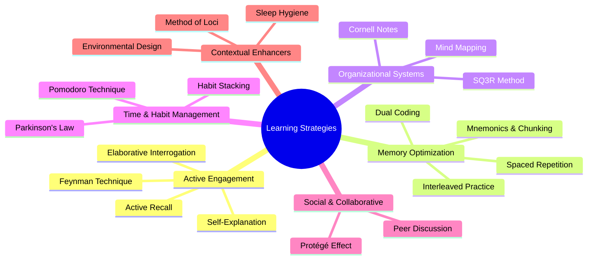

    

<h1 align="center">MR. SAM ROHAN</h1>
<h3 align="center">PRECISION IN EXECUTION - SUPREMACY IN IMPACT!</h3>

 

    

  

<h1 align="center">Comprehensive Compendium of Study Techniques and Methodologies (Extended Edition): A Psychological and Educational Analysis.</h1>

 

 

### **Table of Contents**
1.  **Introduction: The Science of Effective Learning**
2.  **Section I: Cognitive Foundations of Active Engagement**
    *   Active Recall (Retrieval Practice)
    *   The Feynman Technique (Teaching for Understanding)
    *   Self-Explanation & Elaborative Interrogation
3.  **Section II: Memory Architecture and Optimization Strategies**
    *   Spaced Repetition & the Leitner System
    *   Interleaved Practice
    *   Dual Coding
    *   Mnemonics and the Method of Loci (Memory Palace)
    *   Chunking
4.  **Section III: Organizational Frameworks for Comprehension**
    *   The Cornell Note-Taking System
    *   Mind Mapping & Concept Mapping
    *   The SQ3R Reading Method
5.  **Section IV: Metacognitive, Time Management, and Habit Formation**
    *   The Pomodoro Technique
    *   Parkinson's Law & Timeboxing
    *   Habit Stacking for Sustainable Learning
    *   Desirable Difficulties
6.  **Section V: Collaborative and Social Learning Dynamics**
    *   The Protégé Effect: Learning by Teaching
    *   Structured Group Discussion & Peer Tutoring
7.  **Section VI: Contextual and Environmental Optimizers**
    *   Environmental Design
    *   The "Sleep Sandwich" and Sleep-Based Consolidation
    *   Physiological Supports: Hydration, Nutrition, and Movement
8.  **Section VII: Implementation Framework & Synergistic Integration**
9.  **Conclusion: Cultivating Mastery**
10. **Appendix: Quick-Reference Guide for Technique Selection**

 

## **1. Introduction: The Science of Effective Learning**

Effective learning is not a passive process of consumption but an active, strategic endeavor grounded in the principles of cognitive psychology, educational neuroscience, and behavioral science. This compendium moves beyond anecdotal study tips to present a synthesis of empirically validated methodologies. It is authored from the dual perspective of a senior clinical psychologist and an educationalist, designed to translate complex research into actionable strategies for learners at all stages—from students navigating academic curricula to professionals pursuing lifelong mastery.

The human brain is not designed for the endless rehearsal of information but for its meaningful integration, application, and retrieval. Techniques that leverage this natural architecture—such as forcing recall, building explanatory frameworks, and strategically spacing exposure—consistently outperform traditional, passive methods like re-reading and highlighting. This document is organized thematically, progressing from the core cognitive processes of learning to the practical frameworks and environmental factors that support them. Each technique is presented with a clear operational definition, an evidence-based rationale, and a deployment-ready implementation protocol.

## **2. Section I: Cognitive Foundations of Active Engagement**

Cognitive science unequivocally demonstrates that deep, durable learning requires active mental construction. The following techniques replace passive review with generative processing, forcing the brain to engage with material in ways that solidify understanding and memory.

### **Active Recall (Retrieval Practice)**
*   **Core Concept:** The practice of actively stimulating memory recall **without** the aid of materials. It is the act of *generating* an answer from memory rather than *recognizing* it from a list.
*   **Psychological Rationale:** This leverages the **"testing effect,"** a robust phenomenon where the act of retrieval itself strengthens the memory trace and slows forgetting. Each successful recall builds a more accessible neural pathway for future use.
*   **Implementation:** After reviewing material, close the book and write down or verbalize everything you can remember. Use flashcards (physical or digital like Anki), where the prompt is on one side and you must actively produce the answer. Complete practice problems without first looking at the solution.
*   **Key Insight:** The effort and occasional failure inherent in active recall are not signs of poor learning but are critical to the process of long-term consolidation.

### **The Feynman Technique (Teaching for Understanding)**
*   **Core Concept:** The process of mastering a concept by explaining it in simple, plain language, as if teaching it to a novice or a child.
*   **Psychological Rationale:** Teaching forces **explanatory depth**. To simplify, you must identify the core principles, recognize relationships, and confront gaps or contradictions in your own understanding. This moves knowledge from superficial familiarity to true conceptual mastery.
*   **Implementation:**
    1.  **Choose:** Select a concept you wish to learn.
    2.  **Teach:** Explain it aloud or in writing, using simple terms and avoiding jargon.
    3.  **Identify Gaps:** Notice where your explanation becomes vague, complicated, or reliant on undefined terms. These are your knowledge gaps.
    4.  **Review and Simplify:** Return to your source material to clarify the gaps, then refine your explanation iteratively.

### **Self-Explanation & Elaborative Interrogation**
*   **Core Concept:** A family of techniques focused on **"how"** and **"why."**
    *   **Self-Explanation:** Verbally narrating your reasoning process as you work through a problem or text (e.g., "I'm applying this formula because the problem involves a rate of change...").
    *   **Elaborative Interrogation:** Proactively questioning the material by asking "Why is this true?" or "How does this connect to X?"
*   **Psychological Rationale:** These strategies promote **relational and causal encoding**. By connecting new information to existing knowledge schemas and explaining underlying mechanisms, you embed facts within a rich network of meaning, making them far more memorable and usable.
*   **Implementation:** While reading, pause at key points to ask and answer "why" questions. When solving problems, talk through each step's purpose. Create "why" chains to explore the foundational logic of a system.

## **3. Section II: Memory Architecture and Optimization Strategies**

Human memory is governed by predictable patterns of encoding, storage, and decay. These strategies work *with* the brain's architecture to combat the forgetting curve and build robust, long-term knowledge structures.

### **Spaced Repetition & the Leitner System**
*   **Core Concept:** Reviewing information at systematically increasing intervals over time.
*   **Psychological Rationale:** This directly counters **Ebbinghaus's forgetting curve**, which shows memory decay is steepest soon after learning. By reviewing just as information begins to fade, you powerfully reinforce it, signaling to the brain that the content is valuable for long-term storage.
*   **Implementation:** Use algorithm-driven software like **Anki** or **SuperMemo**. A manual alternative is the **Leitner System** with physical flashcards and boxes:
    *   **Box 1:** Review daily.
    *   **Box 2:** Review every 3 days.
    *   **Box 3:** Review weekly.
    *   Correct answers move cards to a higher box (longer interval); incorrect answers demote cards to Box 1 for more frequent review.

### **Interleaved Practice**
*   **Core Concept:** Mixing different topics or types of problems within a single study session, rather than blocking practice on one skill at a time (e.g., ABCABCABC vs. AAABBBCCC).
*   **Psychological Rationale:** Blocking can lead to **contextual overfitting**, where you learn to apply a procedure without deeply understanding its underlying principles. Interleaving forces constant retrieval and **discriminative contrast**—you must consciously choose the right strategy for each problem, leading to better skill generalization and problem-solving transfer.
*   **Implementation:** In a math session, mix algebra, geometry, and calculus problems. When studying languages, alternate between vocabulary, grammar drills, and reading comprehension.

### **Dual Coding**
*   **Core Concept:** Combining verbal information (words, explanations) with visual information (diagrams, charts, icons, sketches) to create two linked memory representations.
*   **Psychological Rationale:** The brain processes visual and verbal information in partially distinct channels (visuospatial sketchpad vs. phonological loop in working memory). Creating **dual traces** provides two potential retrieval routes, significantly enhancing the probability of recall.
*   **Implementation:** Always supplement text notes with a simple diagram, flowchart, or timeline. When learning a process, draw it. Annotate textbook images with your own written summaries.

### **Mnemonics and the Method of Loci (Memory Palace)**
*   **Core Concept:** Using associative frameworks—acronyms, rhymes, stories, or spatial layouts—to make abstract or list-based information memorable.
*   **Psychological Rationale:** Mnemonics impose **meaningful structure** on otherwise arbitrary information, leveraging the brain's superior memory for patterns, narratives, and spaces.
*   **Implementation:**
    *   **Acronyms:** "HOMES" for the Great Lakes.
    *   **Method of Loci (Memory Palace):** A powerful spatial mnemonic where you visualize placing items to be remembered along a familiar route (e.g., your home). To recall, you take a mental "walk" to retrieve them.
        1.  Choose a familiar location you can visualize in detail (your house, your commute).
        2.  Identify specific "loci" or spots along a path (front door, coat rack, lamp).
        3.  Create a vivid, exaggerated mental image representing the information and place it at each locus.
        4.  To recall, mentally retrace your journey, "seeing" each image.
    *   **Evidence:** A 2014 study with medical students found that those using the Method of Loci to learn about insulin and diabetes showed **significantly improved performance on assessments** compared to a control group using self-directed study.

### **Chunking**
*   **Core Concept:** Grouping individual pieces of information into larger, meaningful units or "chunks."
*   **Psychological Rationale:** Working memory has a severe capacity limit (~4-7 items). Chunking allows you to overcome this limit by treating a cluster of related information as a single item, dramatically increasing functional capacity.
*   **Implementation:** Memorize a phone number as "555-0198" rather than "5,5,5,0,1,9,8." Learn vocabulary grouped by theme (e.g., all kitchen-related words together). Break complex procedures into 3-4 step chunks.

## **4. Section III: Organizational Frameworks for Comprehension**

Effective learning requires not just intake but organization. These frameworks provide structured processes for capturing, connecting, and reviewing information, turning raw data into coherent knowledge.

### **The Cornell Note-Taking System**
*   **Core Concept:** A structured note-taking format that divides the page into three functional sections to promote active review.
*   **Psychological Rationale:** It integrates the **encoding** benefits of note-taking with the **retrieval** benefits of self-testing (via the Cue column) and the **consolidation** benefits of summarization.
*   **Implementation:** Divide your page:
    *   **Notes (Right Column):** Record lecture/text information here during class/reading.
    *   **Cues (Left Column):** Afterward, write key questions, main ideas, or prompts that correspond to the notes.
    *   **Summary (Bottom):** Write a brief synthesis of the entire page's content. For review, cover the Notes column and use the Cues to quiz yourself.

### **Mind Mapping & Concept Mapping**
*   **Core Concept:** A visual, non-linear method of organizing ideas around a central concept, using branches, keywords, colors, and images.
*   **Psychological Rationale:** Mirrors the brain's associative, networked thinking. By externalizing the relational structure of ideas, it facilitates **holistic understanding** and **visual-spatial memory**.
*   **Implementation:** Start with a central topic in the middle of the page. For each major subtopic, draw a branch outward. From these, draw sub-branches for finer details. Use single keywords and images liberally.

### **The SQ3R Reading Method**
*   **Core Concept:** A five-step method for engaged, strategic reading of textbooks and academic papers.
*   **Psychological Rationale:** Transforms passive reading into an **active, goal-directed inquiry**, enhancing attention, comprehension, and retention by setting a purpose before reading.
*   **Implementation:**
    1.  **Survey:** Skim headings, subheadings, figures, and the abstract/conclusion to get the big picture.
    2.  **Question:** Turn each heading into a question you expect the text to answer.
    3.  **Read:** Actively read to answer your questions.
    4.  **Recite/Recall:** After a section, close the book and recite the answers to your questions from memory.
    5.  **Review:** After finishing, go back over your questions and answers to consolidate.

## **5. Section IV: Metacognitive, Time Management, and Habit Formation**

Sustaining the cognitive effort required for deep learning demands strategic management of attention, time, and behavior. These techniques provide the scaffolding for consistent, focused effort.

### **The Pomodoro Technique**
*   **Core Concept:** Working in focused, timed intervals (traditionally 25 minutes) separated by short breaks (5 minutes), with a longer break after a set of intervals.
*   **Psychological Rationale:** Matches the brain's natural attention rhythms, prevents cognitive fatigue and burnout, and makes daunting tasks feel more manageable by breaking them into discrete units. It balances **focused mode** (intense concentration) and **diffuse mode** (restful background processing) thinking.
*   **Implementation:** Use a timer. Work for 25 minutes with zero distractions. When the timer rings, take a strict 5-minute break. After four "Pomodoros," take a 15-30 minute break.

### **Parkinson's Law & Timeboxing**
*   **Core Concept:** The adage that "work expands to fill the time available for its completion." Timeboxing is the practice of assigning a fixed, limited time period to complete a specific task.
*   **Psychological Rationale:** Creates beneficial **temporal urgency**, which focuses attention, reduces procrastination, and counters perfectionism by imposing an artificial constraint.
*   **Implementation:** Instead of "study Chapter 5," set the goal: "Outline the key points of Chapter 5 in 30 minutes." Use a timer to enforce the limit.

### **Habit Stacking for Sustainable Learning**
*   **Core Concept:** The practice of "stacking" a new, desired habit onto an existing, well-established habit by using the existing habit as a cue.
*   **Psychological Rationale:** Leverages the power of **existing neural pathways** and routine. The established habit acts as a reliable trigger, reducing the cognitive load and willpower required to initiate the new behavior.
*   **Implementation:**
    1.  **Identify a reliable current habit:** "I drink coffee every morning."
    2.  **Define your new desired habit:** "I want to review my flashcards."
    3.  **Stack them:** "After I pour my morning coffee, I will complete one flashcard deck."
    4.  **Start small and be consistent**. The new habit must be achievable; you can scale it up later.
*   **Expert Insight:** Psychologist Dr. Lauren Alexander notes that while habit stacking can work, it is not a magic bullet. Success depends on the difficulty of the new habit and the individual's intrinsic motivation. For complex habits, pairing the stack with a reward (the Premack Principle) or using an alternative like **"shaping"**—gradually building up to the target behavior in small steps—can be more effective.

### **Desirable Difficulties**
*   **Core Concept:** The counterintuitive principle that introducing certain obstacles or "difficulties" during learning creates more effortful processing, which leads to **superior long-term retention and transfer**.
*   **Psychological Rationale:** Effortful retrieval and processing strengthen memory encoding (Bjork's *Richness of Encoding Principle*). Easy, fluent study often leads to an **"illusion of mastery."**
*   **Implementation:** Handwrite notes instead of typing (slower, forces paraphrasing). Try to solve a problem before being shown the solution. Space and interleave your practice rather than cramming.

## **6. Section V: Collaborative and Social Learning Dynamics**

Learning is inherently social. Interacting with others provides accountability, exposes blind spots, and creates opportunities for the powerful cognitive restructuring that occurs through teaching.

### **The Protégé Effect: Learning by Teaching**
*   **Core Concept:** The phenomenon whereby those who teach a topic to others develop a deeper and more durable understanding of the material themselves.
*   **Psychological Rationale:** Preparing to teach triggers **metacognitive and generative processes**: you must organize knowledge logically, identify core concepts, anticipate questions, and clarify your own understanding. The **social responsibility** of teaching also increases motivation and depth of processing.
*   **Implementation:**
    *   **Peer Tutoring:** Form a study partnership and take turns teaching each other concepts.
    *   **The "Rubber Duck" Method:** Explain a complex problem to an inanimate object as if it were a student.
    *   **Create a Study Guide:** Even if no one else uses it, the act of creating a teachable resource forces you into the teacher's mindset.
*   **Key Research Insight:** The benefits are maximized by **interactivity**. A 2019 meta-analytic review suggests that the learning gains are greater when preparing for **direct, face-to-face teaching** compared to indirect teaching (like making a video). The live interaction, with its questions and feedback, creates a richer learning environment for the "teacher."

### **Structured Group Discussion & Peer Tutoring**
*   **Core Concept:** Moving beyond social study groups to implement purposeful, role-driven collaborative learning.
*   **Psychological Rationale:** Exposes learners to **multiple perspectives** and explanations. Defending your understanding and critiquing others' ideas fosters critical thinking and consolidates knowledge.
*   **Implementation:** Assign roles within a study group (e.g., **Discussion Leader**, **Skeptic**, **Synthesizer**, **Connector**). Use techniques like "think-pair-share" or debate a topic from opposing viewpoints.

## **7. Section VI: Contextual and Environmental Optimizers**

Cognitive performance does not occur in a vacuum. Physical state, environment, and even sensory cues can be harnessed to significantly enhance learning efficiency and recall.

### **Environmental Design**
*   **Core Concept:** Intentionally shaping your physical study environment to minimize distractions and cue focused behavior.
*   **Implementation:** Designate a **dedicated study space** used only for focused work. Ensure it is well-lit, organized, and free from clutter and noise. Use tools like website blockers during focus sessions.

### **The "Sleep Sandwich" and Sleep-Based Consolidation**
*   **Core Concept:** Strategically scheduling study and sleep to leverage the brain's natural memory consolidation processes.
*   **Psychological Rationale:** During deep sleep, the brain reactivates and reorganizes memories, strengthening neural connections and integrating new knowledge with existing networks (**synaptic consolidation**).
*   **Implementation:** Review difficult material **before sleeping**. Follow this with a full night's sleep, and then do a **brief review upon waking**. This "sandwiches" the consolidation process. Prioritizing consistent, high-quality sleep is one of the most impactful learning strategies.

### **Physiological Supports: Hydration, Nutrition, and Movement**
*   **Core Concept:** Supporting brain function through basic physiological care.
*   **Psychological Rationale:** The brain is an energy-intensive organ. Mild dehydration (~2% fluid loss) impairs attention, executive function, and short-term memory. Steady glucose from complex carbohydrates supports sustained effort. Brief physical activity increases blood flow and neurotrophic factors.
*   **Implementation:** Keep water at your desk and drink regularly. Opt for brain-healthy snacks (nuts, fruits, yogurt). Incorporate 5-minute movement breaks during longer study sessions.

## **8. Section VII: Implementation Framework & Synergistic Integration**

The true power of this compendium lies not in using techniques in isolation, but in strategically combining them into a personalized, synergistic learning system.

*   **1. Diagnose & Align:** Match the technique to your learning goal.
    *   **Goal: Memorize facts/vocabulary** → **Spaced Repetition + Mnemonics**.
    *   **Goal: Master complex concepts** → **Feynman Technique + Self-Explanation**.
    *   **Goal: Prepare for application/projects** → **Active Recall + Interleaved Practice**.
*   **2. Personalize:** Adapt frameworks to your preferences. A visual learner might emphasize Dual Coding and Mind Mapping, while a verbal learner might lean on Self-Explanation and the Feynman Technique.
*   **3. Integrate Synergistically:** Create powerful workflows by chaining techniques.
    *   **Example A (for lectures):** Take **Cornell Notes** during class. Within 24 hours, use the Cue column for **Active Recall** practice. At the end of the week, create a **Mind Map** from your notes to see the big picture, then transfer key facts to an **Anki (Spaced Repetition)** deck.
    *   **Example B (for textbook reading):** Use the **SQ3R** method. During the "Recite" phase, employ **Self-Explanation**. When reviewing, use the **Feynman Technique** on challenging concepts.
*   **4. Iterate with Metacognition:** Maintain a simple learning journal. After exams or major study blocks, reflect: *Which techniques felt most effective? Where did I struggle?* Use this data to refine your system quarterly.

## **9. Conclusion: Cultivating Mastery**

This compendium synthesizes centuries of pedagogical insight and decades of cognitive science into a unified framework for intellectual growth. Effective learning is a skill that can be systematically developed. By understanding the *why* behind these techniques—the principles of active retrieval, spaced reinforcement, desirable difficulty, and explanatory depth—you move beyond random tips to a principled approach to mastery.

The journey is iterative and personal. Begin by selecting one or two techniques from different sections that address your most pressing challenge. Implement them consistently, reflect on their impact, and gradually build your integrated system. In doing so, you will not only learn your subject matter more deeply but also cultivate the far more valuable meta-skill of **learning how to learn**—a capability that will propel academic, professional, and personal achievement for a lifetime.

---
**Appendix: Quick-Reference Guide for Technique Selection**

| **Primary Learning Goal** | **Highly Recommended Techniques** | **Synergistic Combinations** |
| :--- | :--- | :--- |
| **Memorizing Facts, Terms, Lists** | Spaced Repetition, Mnemonics (Method of Loci), Active Recall, Chunking | Create Mnemonic images, then drill them with Spaced Repetition flashcards (Anki). |
| **Understanding Complex Concepts** | Feynman Technique, Self-Explanation, Elaborative Interrogation, Mind Mapping | Use Mind Mapping to visualize relationships, then explain the map using the Feynman Technique. |
| **Problem-Solving & Skill Application**| Interleaved Practice, Active Recall (on problems), Desirable Difficulties | Practice a mixed set of problems (Interleaving) without first looking at solutions (Desirable Difficulty). |
| **Comprehending & Retaining Texts** | SQ3R Method, Cornell Notes, Dual Coding | Use SQ3R for reading, take Cornell Notes, and add a Dual Coding sketch in the notes column. |
| **Managing Time & Building Consistency** | Pomodoro Technique, Timeboxing (Parkinson's Law), Habit Stacking | Use Habit Stacking to trigger a Pomodoro session dedicated to a specific, timeboxed task. |
| **Preparing for Exams Holistically**| Protégé Effect (teach others), Practice Testing (Active Recall), Spaced Repetition | Form a study group (Protégé Effect) to create and take practice exams for each other. |

    

<h4 align="center">STAY TUNED FOR THE LATEST UPDATES!</h4>

  

    

    
